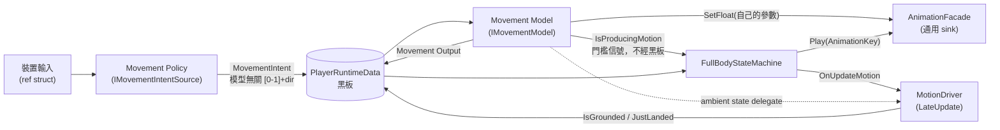

# IntentPipeline

**A learning-oriented Unity character framework built around one idea: gameplay reads data, never queries other gameplay systems.**
Input becomes a model-agnostic *intent* on a blackboard; a swappable *movement model* turns that intent into motion and drives its own animation parameters. Gait tuning and hold-vs-toggle semantics live in a ScriptableObject (key bindings stay in Unity Input Actions); swapping the input source (AI / replay / network) is swapping a component; and the core pipeline never names a concrete movement model — it depends only on `IMovementModel`, so a second one (strafe / swim / vehicle) is a new class plus a component swap. **Runtime model switching is designed (`MovementContext`) but deliberately not implemented until a second model exists.**

Every significant decision is recorded as an ADR, and the architecture's invariants are enforced by EditMode tests rather than by convention — **73 EditMode tests, including an architecture-regression suite that turns 10 documented invariants (layer boundaries, blackboard single-writer ownership, zero-LINQ, intent contracts) into executable assertions. Break one and the suite goes red.**

> ⚠️ This repository does **not** build from a fresh clone: **Animancer Pro is the only compile-time third-party dependency** (excluded — paid licence). Kubold Movement Animset Pro is **sample locomotion content, not a framework dependency** — remove it and movement, gait, state transitions, jump physics and roll all keep working; only the locomotion *animation* stops playing. See [第三方資產需求](#-第三方資產需求).

---

## 這個專案在做什麼

一個**學習導向**的 Unity 角色框架，目標**不是**做出一款遊戲，而是把「乾淨架構、資料驅動、零 GC 熱路徑」三件事做到**能被檢驗**——前兩者由 EditMode 測試守，第三者由 Development Build 的 Profiler 實測佐證。同時把每一個重要決策的**理由與被否決的替代方案**寫下來。

因此這個 repo 的重點有一半在 `docs/`：架構決策紀錄（ADR）、當前架構文件、開發規格、以及一份逐版本的開發日誌，記錄每一輪撞到什麼坑、為什麼那樣解。

**環境**：Unity 6000.5.1f1 ／ URP 17.5 ／ Input System 1.19 ／ Animancer Pro（動畫執行期）

---

## 架構主張

| 主張 | 具體做法 |
| --- | --- |
| **資料驅動** | Gameplay 讀黑板資料，不直接查詢其他 gameplay 系統 |
| **單一寫入者** | 黑板每個欄位有明確的 Owner／Writer／Readers，禁止第二個寫入者（由測試守） |
| **單向依賴** | `Input → Pipeline → 黑板`；`StateMachine`／`Animation`／`Motion` 皆為黑板的**平行消費者**，彼此不互相依賴（表現層反向依賴狀態機由 A4 擋下）。逐帧執行順序見 `docs/02-dev-spec.md` §2.1 |
| **零 GC 熱路徑（✅ Player 實測）** | `ref struct` 輸入採樣、值型別 dynamics、無 LINQ（由 A3 測試守）。**Development Build ＋ Profiler 實測：穩態移動下 `PlayerLoop` 的 `GC Alloc` = 0 B**（[存證截圖](docs/images/profiler/gc-alloc-zero-walk.png)；量測程序、排除項與已知邊界見 `docs/02-dev-spec.md` §7.4） |
| **動畫資產不可變** | FBX 子 clip 是唯一真相；調整依「資料 → 呈現層 → 換 clip → 改 clip 內容」的固定升級階梯，禁止跳級 |
| **不預造** | 第二個使用者出現前不抽象。每一次「先蓋好等以後用」都在文件裡被明確否決過 |

### 每帧的資料流



關鍵在於 **seam 的位置**：意圖（intent）是模型無關的 `{強度[0-1], 方向}`。因此「同樣的推桿量該換算成多強」與「walk 是按住生效還是按一下切換型態」這類 per-game 規則，住在可替換的 policy ＋ `GaitProfileSO` 裡，而不是燒進狀態機；「**哪顆鍵**做什麼」則留在 Unity Input Actions（ADR-003 §13.3：input routing 屬更上游的職責，不歸 producer）；「多快才算跑」是 movement model 的內部知識——通用管線完全不認識 `MoveSpeed` 這種概念，而且這件事由測試 A9 守著。

---

## 架構決策紀錄（ADR）

ADR 是**不可變的決策快照**——要改決策就開新 ADR 取代舊的，不改寫歷史。每份都含 Context／Decision／**Alternatives Considered（附明確的否決理由）**／Trade-offs／Consequences。

| # | 決策 | 一句話 |
| --- | --- | --- |
| [001](docs/ADR/001-root-model-hierarchy.md) | GameObject 階層 Root/Model 分離 | 物理世界座標與 Animator 根動作徹底分開，骨骼操作一律掛 Model 層 |
| [002](docs/ADR/002-data-driven-jump.md) | 數據驅動跳躍與多段跳 | 跳躍物理量從動畫烘焙資料反推，而非手填魔術數字；根治「兩個真相來源」 |
| [003](docs/ADR/003-movement-intent-layering.md) | Movement Intent 分層 | Producer 介面 × 黑板中性契約 × Model via State；含四輪對抗式評審後被推翻的三個方案 |

---

## 專案結構

```
Assets/
  Scripts/
    Core/
      Blackboard/          PlayerRuntimeData / IntentData / MovementIntentData / InputData
      Pipeline/            CharacterPipelineRunner（管線唯一驅動點）/ IInputSource
      Movement/            意圖 producer（context-free）＋ GaitProfileSO
        Models/            Movement Model：IMovementModel / LocomotionModel
      StateMachine/        FSM 本體與各 State（Idle / Move / Jump / Roll）
    Presentation/          AnimationFacade（抽象＋Animancer 實作）/ MotionDriver / Foot IK / Audio
    Editor/                動畫烘焙與特徵提取工具鏈
  _Project/Tests/EditMode/ 73 個測試，含架構回歸測試
  ScriptableObjects/       Motion（烘焙資料）/ Animation / Movement（gait）/ StateMachine
docs/                      見下方導覽
```

---

## 文件導覽

**從 [`docs/00-map.md`](docs/00-map.md) 開始**——那是一頁式索引（模組 → 檔案 → 治理章節），設計目的就是讓你不必為了找一件事而掃全部檔案。

| 文件 | 角色 |
| --- | --- |
| [`docs/00-map.md`](docs/00-map.md) | 單頁導覽索引 |
| [`docs/01-design-doc.md`](docs/01-design-doc.md) | 當前架構、模組職責邊界、**Trade-off 表**（含每個決策的代價） |
| [`docs/02-dev-spec.md`](docs/02-dev-spec.md) | 跨領域契約：黑板 schema、管線順序表、驅動介面、**架構回歸檢核清單** |
| [`docs/ADR/`](docs/ADR/) | 不可變決策紀錄 |
| [`docs/changelog.md`](docs/changelog.md) | 逐版本開發日誌（撞到的坑、為什麼那樣解、學到什麼）；更早的在 `changelog-archive.md` |
| `docs/03`～`docs/06` | 動畫路線圖、Locomotion 基礎、Foot IK、動畫呈現層的子系統規格 |

---

## 測試：架構不變量是可執行的

一般測試守功能，這裡多了一類守**架構**——因為架構被破壞時**通常沒有任何症狀**，直到某天要換 producer 或加第二個 model 才發現 seam 已經爛了。

| ID | 守什麼 |
| --- | --- |
| A1～A3 | 組件依賴方向單向、Runtime 不得在 `#if UNITY_EDITOR` 外碰 `UnityEditor`、熱路徑零 LINQ |
| A4 | 跨層依賴禁令（表現層不得反向依賴狀態機、意圖 producer 不得回讀 gameplay state…） |
| A5 | 黑板每個欄位的**單一寫入者**白名單 |
| A6～A8 | 意圖契約：連續型 intent 不被單帧復位、輸出可由意圖完全重現、mode state 不得藏在 producer 私有欄位 |
| A9 | **通用管線不得認識任何 locomotion 概念**（`MoveSpeed`／`SmoothDamp`／gait 等 token 出現在 Runner 即失敗） |
| A10 | 跨帧平滑狀態的執行期持有者恰好一個（多於一個＝狀態切換時手感會斷） |

這些測試同時是**最便宜且不可能過期的架構摘要**——想知道誰能寫黑板某欄位，讀 15 行的 `WriterRules` 比讀三個實作檔（600+ 行）快 40 倍，而且它不可能與程式碼不同步，因為不同步就會變紅。

在 Unity 中執行：`Window → General → Test Runner → EditMode → Run All`

---

## ⚠️ 第三方資產需求

以下資產已從版本控制排除。**三者的角色與缺失後果完全不同，請分開看**：

| 資產 | 角色 | 缺失後果 | 放置位置 |
| --- | --- | --- | --- |
| **Animancer Pro**（Kybernetik，付費） | **Framework dependency** | 🔴 **Compile-blocking**——動畫播放後端，全 Runtime 唯一的 `using Animancer` 在 `AnimancerFacade.cs`。缺少時 `Project.Runtime` 編譯失敗，**測試也跑不了** | `Packages/com.kybernetik.animancer/`（本機 UPM 套件，`packages-lock.json` 已以 `file:` 引用） |
| **Kubold Movement Animset Pro**（付費） | **Sample content**（現行 locomotion 動畫來源） | 🟠 **Sample-content-only**——不影響編譯，也不影響 gameplay 邏輯。`Locomotion.asset` 的 4 支 mixer clip 與 4 顆 locomotion `Bake_*.asset` 的 `SourceClip` 會變 `None` → **角色仍以正確速度移動、狀態機仍正常轉換，但不播 locomotion 動畫**（Animancer facade 印警告後略過，不拋例外） | `Assets/MovementAnimsetPro/` |
| Unity StarterAssets（免費） | Scene dressing | 🟡 **Scene-only（可選）**——`SampleScene` 引用了它的材質（`GridOrange_01_Mat`），缺少時場景出現遺失材質，**不影響編譯與測試** | Package Manager 匯入 |

### Kubold 為什麼只是 sample content

這不是宣稱，是可以照著查的：

* **`Assets/Scripts/Core` 全層搜不到 `AnimationClip`／`ClipTransition`／`AnimancerState`** —— 核心層不認識 clip 型別。
* **烘焙資料是自足的**：`MotionBakeData` 的特徵欄位（速度曲線、腳相曲線、代表速度、動畫長度、起跳前搖、頂點高度、反推重力…）**全部是烘焙期寫入的序列化值**，clip 消失後仍在。`MotionDriver` 的滿速來源讀的是 `AutoAverageSpeed`，不是 clip；`SourceClip` 已降為 Editor-side provenance，**執行期程式碼對它的讀取數為 0**。
* **Jump 與 Roll 的動畫來源本來就不是 Kubold**：兩者的烘焙資產指向版控內的 Mixamo clip（`X Bot@Jump.fbx`／`X Bot@Stand To Roll.fbx`），因此跳躍物理與翻滾曲線位移完全不受影響。
* **角色 Prefab 對 Kubold 的引用數為 0** —— 模型與 Avatar 皆為 Mixamo X Bot。

換句話說：**要換一整套 locomotion 動畫，換的是 `Locomotion.asset` 的 4 支 clip ＋ 重跑一次烘焙**，程式碼一行不動。

> ⚠️ 但重匯入 Kubold 時要注意：clip 引用靠 `.meta` 的 GUID 對應，**重新匯入後 GUID 不會與原專案一致**，因此 `Locomotion.asset` 與 4 顆 locomotion `Bake_*.asset` 的 clip 欄位需在 Unity 內重新指定，並依 `docs/02-dev-spec.md` §4 重跑烘焙（門檻公式 `threshold = speed_i / speed_max`，數值從重烘後的 Bake Data 換算）。動畫匯入設定（Humanoid Root Transform 矩陣）見同文件 §0.4。

---

## License

程式碼採 [MIT](LICENSE)。

**License 不涵蓋上述第三方資產**——Animancer Pro 與 Kubold Movement Animset Pro 各自受其原始授權約束，本 repo 不包含也不轉散佈它們的任何內容。版控內的 Mixamo（Adobe）角色與動畫資產亦受其原始條款約束。
