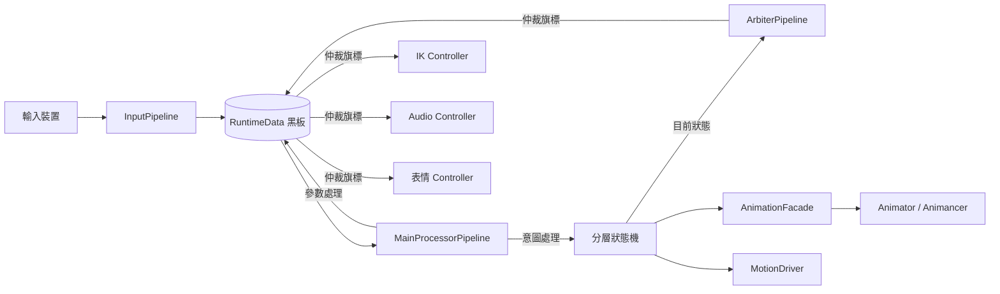

# CharacterController 架構設計文件

> 狀態：草稿 v0.14.2
> 最後更新：2026-07-14
> 作者：Baka8787

---

## 1. 專案目標

### 1.1 這是什麼
一個資料驅動的 Unity 第三人稱角色控制器框架
目標是徹底分離「邏輯決策」與「表現執行」。

### 1.2 為什麼要做這個（問題陳述）
傳統角色控制器常見的問題：
- 輸入、狀態、動畫事件、音效全部耦合在同一份腳本裡
- 新增一個動作/武器，要到處改現有程式碼，容易牽一髮動全身
- 狀態切換用大量 if-else 或 bool flag 堆疊，難以追蹤「誰能打斷誰」

### 1.3 這個專案要解決到什麼程度（Scope）
- [ ] 必須做到：最終目的是做出能用於arpg、射擊遊戲及其他各種遊戲模式的角色控制器
- [ ] 盡量做到：IK製作或串接、完整的離線內容建置系統。未來不論加入 Motion Matching、Motion Warping、AI 動畫標註，甚至自動產生 LOD 動畫資料，都只是往 Pipeline 增加新的 Stage，而不是重寫整個工具鏈
- [ ] 不在這次範圍內（Out of Scope）：____

> 建議先填這一欄再往下寫，避免規格越寫越大導致做不完。

---

## 2. 核心設計理念

### 2.1 兩股資訊流：意圖（Intent）與參數（Parameter）

| | 意圖 (Intent) | 參數 (Parameter) |
|---|---|---|
| 定義 | 這一瞬間「想」做什麼 | 這一帧用來驅動表現的連續數值 |
| 範例 | 按下跳躍鍵、按下開火鍵 | 移動速度、視角角度、上半身權重 |
| 生命週期 | 通常單帧觸發，當帧處理完即復位 | 持續存在，每帧更新 |
| 誰來讀 | 狀態機（決定要不要切換狀態） | 動畫層、IK 層（決定怎麼表現） |

**為什麼要分開？**
[在這裡寫下你自己的理解 / 之後實作後回頭補充的心得]

### 2.2 資料中心黑板（Blackboard）模式
- 所有模組只讀寫 `RuntimeData`，不直接互相呼叫
- 好處：____
- 代價／要注意的地方：____（例如：黑板過度肥大、誰該擁有寫入權需要規範）

### 2.3 分層狀態機
- FullBody / UpperBody / Override 三層的職責邊界
- 為什麼不用單一狀態機處理所有動作？

### 2.4 表現層解耦（Facade 模式）
- 玩法邏輯不應該知道「動畫機是 Animancer 還是 Animator」
- Facade 的介面該長什麼樣子？

### 2.5 仲裁層（ArbiterPipeline）

角色在某些特殊狀態下（死亡、被控制、離相機太遠），不是「要播什麼動畫」的問題，而是「要不要允許某個表現層模組繼續運作」的問題。

如果讓各個 Controller（IK、音頻、表情）自己讀狀態機目前的狀態來判斷，就會變成原問題陳述的老毛病——到處寫死依賴、牽一髮動全身。

仲裁層的職責是：**把「能不能」這件事，從各模組各自判斷，收斂成一個單一決策點。**

資料流如下：
```
狀態機（知道目前是什麼狀態）
  → ArbiterPipeline（依狀態轉譯成仲裁旗標）
  → RuntimeData.Arbitration（寫入黑板的仲裁區）
  → 各 Controller（只讀旗標，不問為什麼）
```

這與黑板模式的精神一致：下游模組只看黑板上的資料辦事，不直接詢問上游模組的內部狀態。仲裁旗標就是黑板上繼「意圖」「參數」之後的第三種資料類型。

**實作時機**：第四階段（仲裁器與打斷系統），狀態機完成後再接入。

### 2.6 表現層物件階層：Adapter Root + Model Child（v0.9 新增，v0.12 定調，詳見 `docs/ADR/001-root-model-hierarchy.md`）

除錯 v0.8 的「Jump 先蹲下再往上」問題時，根因追到 `Animator.applyRootMotion` 若沒關乾淨，Unity 會自動把根動作套用到掛著 `Animator` 的那顆 Transform；如果這顆 Transform 跟 `CharacterController` 是同一顆物件，就會跟我們手動呼叫的 `CharacterController.Move()` 互搶同一份世界座標，產生位置衝突、抖動或瞬移。這是 2.4 節「表現層解耦」的精神在**物件階層**這個維度上還沒落實——邏輯上做了 Facade 隔離，但實體階層上邏輯根跟美術根還疊在同一顆物件。

**決策**：角色物件拆成兩層。

```
CharacterRoot（空物件，Adapter）
├── CharacterController
├── CharacterPipelineRunner
├── MotionDriver
├── AnimancerFacade（掛 AnimationFacadeBase 子類）  ← 邏輯玩法只認得到這一層
├── AnimancerComponent（動畫「邏輯」元件，定調在 Root）
├── PlayerInputSource
└── Model（子物件，僅美術/骨骼相關）
    ├── Animator（Humanoid Avatar，applyRootMotion 強制關閉）
    ├── SkinnedMeshRenderer
    └── 骨骼階層（供未來 IK / 手部持武器對位使用）
```

> ⚠️ **v0.12 定調**：本節初版（v0.9）曾把 `AnimancerComponent` 畫在 Model 子物件，與 `docs/02-dev-spec.md` §0.3 的 Root 擺法矛盾。ADR-001 已定調 `AnimancerComponent` 掛在 **Root**（只有真正屬於美術的 `Animator`＋網格＋骨骼下放 Model），此處已更正。理由詳見 `docs/ADR/001-root-model-hierarchy.md`。

**為什麼要分開？**
- **物理權威單一化**：`CharacterController` 只存在於 Root，Root 的世界座標只能被 `MotionDriver.ExecuteBaseMovement()` 等程式碼路徑改動。即使 Model 子物件上的 `Animator.applyRootMotion` 哪天不小心被勾選，Unity 自動套用的根動作也只會影響 Model 的**local transform**，不會波及 Root 的世界座標，兩者物理上不可能打架——這比「靠 Inspector 記得關勾選框」更根本地杜絕了這類 bug。
- **呼應既有 Facade 精神**：`AnimancerComponent` 與 `AnimancerFacade` 同在 Root，`Facade` 以 `GetComponent<AnimancerComponent>()`（同物件）取得動畫邏輯元件，比跨層 `GetComponentInChildren` 更嚴格；`Animator` 則以 `GetComponentInChildren<Animator>()` 由 Model 子物件取得。Animancer 原生支援 `AnimancerComponent` 與 `Animator` 跨物件（`AnimancerComponent._Animator` 為序列化欄位），此配置受官方支援，不需要改 Facade 介面。
- **美術資產可替換**：換裝、換模型只需要替換 Model 子物件，Root 上的邏輯元件、Collider 尺寸、Inspector 綁定關係完全不受影響。
- **未來 IK 擴充的自然掛點**：手部 IK、武器對位、頭部 LookAt 這類需要直接操作骨骼的功能，天然應該掛在 Model 這一層或引用 Model 底下的 Transform，跟「只讀黑板仲裁旗標」的表現層 Controller（4.6 節）分開放，職責邊界更清楚。

**代價**：現有專案若已經是單層結構，需要一次性搬遷（拆出 Model 子物件、把 `Animator`＋網格＋骨骼移過去，`AnimancerComponent` 留在 Root 並把其 `Animator` 欄位重新指向 Model 子物件的 `Animator`、確認 Inspector 引用沒斷掉）；`ThirdPersonCamera` 等外部引用角色 Transform 的模組要重新確認引用的是 Root 還是 Model（規範上一律引用 **Root**，Model 只服務於動畫播放，任何遊戲邏輯都不該直接參考它）。列入 `docs/02-dev-spec.md` §5 待補清單。

---

### 2.7 狀態專屬參數：StateParamsSO（v0.10 新增，取代 StateRule 兼職）

v0.7～v0.8 為了解決「`[SerializeField]` 掛在純 C# 狀態類別上不會被序列化」的問題，把 `JumpImpulseForce`、`JumpTakeoffDelay` 直接塞進了泛用的 `StateRule` 結構體。這個做法**能動，但方向是錯的**，複查後確認踩了三個真實的坑：

1. **職責混亂（FSM 拓撲 vs 物理表現參數）**：`StateRule` 的職責應該只回答「誰能打斷誰、誰能自然過渡到誰、優先級多高」這種**拓撲關係**問題——這件事跟具體是 Idle、Jump 還是未來的 SlideState 無關，是狀態機控制流本身的資料。而 `JumpImpulseForce`／`JumpTakeoffDelay` 是「Jump 這個特定狀態自己要怎麼表現」的**物理調參**，兩者屬於完全不同的關注點，硬塞進同一個結構體就是教科書等級的 SRP 違反。
2. **Inspector／記憶體污染**：`StateRule` 是所有狀態共用的泛用結構體，於是設定 Idle、Move、Roll 的規則時，Inspector 上也會強行冒出跟這些狀態毫無關係的 `Jump Impulse Force`／`Jump Takeoff Delay` 欄位，策劃/美術配置時容易誤填，執行期也有用不到的欄位在每個 `StateRule` 元素裡佔記憶體。
3. **擴充性災難**：這是最致命的一點。專案的終極目標是同一套控制器要能撐起 ARPG、射擊等不同遊戲模式，勢必會有 `SlideState`（滑行距離／摩擦係數）、`ClimbState`（爬牆速度／體力消耗）、`AimState`（瞄準靈敏度倍率）……如果繼續往 `StateRule` 塞欄位，這個結構體會線性膨脹到幾十個只有單一狀態用得到的欄位，變成沒有人敢動的巨石類別。

**決策**：拆成兩個完全獨立的資料通道。

```
StateRule（純拓撲，維持精簡）
├── State
├── Priority
├── CanBeInterruptedBy
└── ValidTransitions

StateParamsSO（新增，狀態專屬參數，一狀態一資產，可為 None）
├── abstract class StateParamsSO : ScriptableObject   ← 只是個標記基底，不放共用欄位
├── JumpStateParams : StateParamsSO { Stages(List<JumpStage>), HeightMultiplier, GravityMultiplier, LaunchVelocityMultiplier }   ← 內容經 ADR-002 重新定義，見 §2.8
├── SlideStateParams : StateParamsSO { SlideDistance, FrictionCurve }   ← 未來
├── ClimbStateParams : StateParamsSO { ClimbSpeed, StaminaCostPerSecond }   ← 未來
└── ...每個需要調參的狀態各自一個子類別，互不干擾
```

`StateMachineConfigSO` 比照既有 `bakeMappings` 的模式，新增一份 `List<StateParamsMapping>`（`State` + `StateParamsSO`），查表方法用泛型收斂型別轉換：

```csharp
public TParams GetStateParams<TParams>(StateType state) where TParams : StateParamsSO
{
    return _paramsMap.TryGetValue(state, out var so) ? so as TParams : null;
}
```

`JumpState.Initialize(config)` 改成 `config.GetStateParams<JumpStateParams>(Type)`，拿不到就沿用程式碼內建預設值（跟 v0.7 的 fallback 精神一致，只是查表的資料結構換了）。

**為什麼這樣選**：
- Inspector 上每個狀態只看得到跟自己相關的欄位（因為是獨立資產），策劃配置時不會被無關欄位干擾。
- 新增一個需要調參的狀態，只要新增一個 `StateParamsSO` 子類別，`StateRule` 完全不用動——**擴充成本是 O(1)，不是 O(既有狀態數)**。
- 跟現有 `MotionBakeData`／`bakeMappings` 是同一套設計語言（狀態專屬資產 + Config SO 查表掛載），學習成本低、不用引入新概念。
- 直接呼應「最終目的是做出能用於 ARPG、射擊遊戲及其他各種遊戲模式的角色控制器」這個專案目標：不同遊戲模式所需要的狀態集合天差地遠，核心的 `StateRule`／`FullBodyStateMachine` 必須維持跟具體遊戲模式無關，所有「這個模式特有的調參」都應該收斂在各自獨立的 `StateParamsSO` 資產裡，而不是污染共用的拓撲結構。

**代價**：多一層 `ScriptableObject` 資產管理（每個需要調參的狀態要多建一個 `.asset` 檔並在 Config SO 裡掛好對應關係）；`GetStateParams<T>` 的向下轉型失敗只會靜默回傳 `null`（型別掛錯資產時要靠呼叫端自己防呆，未來可以考慮加一層 Editor 驗證工具檢查掛載型別是否正確）。**尚未實作**，`JumpImpulseForce`／`JumpTakeoffDelay` 目前仍留在 `StateRule` 內運作，等下一輪程式碼實作再遷移，避免文件（設計意圖）跟程式碼（暫時方案）互相矛盾——這點在 `docs/02-dev-spec.md` §5 待補清單與 Trade-off 表都會標註清楚何者是目標、何者是過渡態。

---

### 2.8 數據驅動跳躍與多段跳（v0.13 定調）

> [歷史決策脈絡詳見 `docs/ADR/002-data-driven-jump.md`]

承 §2.7 的 `StateParamsSO` 機制，跳躍的物理表現改為**數據驅動、單一真相來源**：

- **物理量單一來源**：起跳前搖、最高點、逆推重力全部來自各段 clip 的 `MotionBakeData`（`AutoTakeoffDelay` / `AutoApexHeight` / `AutoCalculatedGravity`），不再手填；`JumpStateParams` 拔除 `ImpulseForce` / `TakeoffDelay`。
- **JumpStateParams = 跳躍內容 + 設計師倍率**：有序 `Stages`（`List<JumpStage>`，每段引用一份 `MotionBakeData`；第 0 段 = 地面跳）＋ Designer Tuning 三倍率（`HeightMultiplier` / `GravityMultiplier` / `LaunchVelocityMultiplier`，預設 1）。
- **多段跳＝資產閉環**：可跳段數上限即 `Stages.Count`；`JumpState` 以「已跳次數 < `Stages.Count`」為閘門，空中再按跳在狀態內部消化（不走狀態轉移）。新增一段＝資產加一個 `JumpStage`，邏輯零改。
- **物理逆推（選項 A）**：`JumpState` 以 `v = √(2gh)`（g = `AutoCalculatedGravity`、h = `AutoApexHeight`，套用倍率）逐段預算，透過 `MotionDriver.ApplyJumpLaunch(in JumpLaunchData)` 注入初速＋該段重力；`MotionDriver` 以 `_activeGravity` 積分、落地自動回復預設，仍是垂直速度的唯一寫入者。

（`Coyote Time`／`Jump Buffer`／`Variable Jump` 等手感行為與「能力系統動態限制段數」屬 ADR-002 §6 Deferred，尚未定案，不在本節。）

---

## 3. 系統架構圖

> 用 Mermaid 畫，GitHub 上可直接渲染



[依實作進度持續更新此圖]

---

## 4. 模組職責邊界

> 每個模組寫清楚「該做什麼」跟「不該做什麼」，避免職責蔓延

### 4.1 InputPipeline
- 該做：採樣輸入裝置、做輸入緩衝/一致性處理、寫入意圖到黑板
- 不該做：不該知道狀態機目前在哪個狀態、不該直接觸發動畫

### 4.2 RuntimeData（黑板）
- 該做：承載當帧意圖、參數快取、裝備/瞄準引用、仲裁旗標
- 不該做：不該包含邏輯方法（只存資料，不做決策）
- **已知落差（v0.7 盤點）**：目前尚未有 `IsGrounded` 欄位。`JumpState` 的落地判定需要這個資訊，但因為黑板沒有承載，只能退而求其次用內部固定計時器模擬，違反「狀態只讀黑板」的邊界。規劃由 `MotionDriver` 每幀讀取 `CharacterController.isGrounded` 寫入黑板，`JumpState` 改讀黑板旗標（見 §5 Trade-off 表新增列）。**（v0.8 已實作）**
- **規劃中的擴充（v0.10 定案，⏸ 實作時機已全數延後）**：`VerticalVelocity`（比照 `internal set` 限制寫入權限）、`JustLanded`、`JustLeftGround` 三個欄位，見 §5 Trade-off 表 v0.10 決策列與 §8 跨模式重用策略。延後細節：`VerticalVelocity` 由 **ADR-002 §6-1** 定為等出現**第二個**垂直速度消費者（wall-slide／擊飛／電梯）再落地，目前垂直速度仍封裝於 `MotionDriver`（跳躍經 `ApplyJumpLaunch` 注入）；`JustLanded`／`JustLeftGround` 於 **2026-07-14 定調比照辦理**（YAGNI），等**第一個**下游消費者（音效／鏡頭／特效 Controller）出現再實作。設計介面均已備妥於 `docs/02-dev-spec.md` §1.1，落地永遠等消費者。

### 4.3 狀態機（State Machine）
- 該做：依黑板資料決定要不要切換狀態、管理進入/退出條件、將目前狀態資訊提供給 ArbiterPipeline
- 不該做：不該直接操作動畫播放細節（要透過 Facade）、不該直接去開關各個 Controller

### 4.4 AnimationFacade
- 該做：統一動畫播放介面，隔離底層動畫系統差異
- 不該做：不該包含遊戲邏輯判斷
- **物件階層（v0.9 新增，v0.12 定調）**：Facade 與 `AnimancerComponent` 同掛在 Root（Adapter），以 `GetComponent<AnimancerComponent>()` 取得動畫邏輯元件；`Animator` 掛在 Model 子物件，以 `GetComponentInChildren<Animator>()` 取得。不該把 `Animator` 掛在 Root（會與 `CharacterController` 世界座標互搶），理由見 2.6 節與 `docs/ADR/001-root-model-hierarchy.md`。

### 4.5 ArbiterPipeline（仲裁管線）
- 該做：接收狀態機目前狀態，統一計算並寫入 `RuntimeData.Arbitration` 仲裁旗標（如 `BlockInput`、`BlockIK`、`BlockAudio`）
- 不該做：不該直接呼叫任何表現層 Controller 的方法（只能透過寫黑板旗標溝通）、不該包含狀態切換邏輯（那是狀態機的職責）

### 4.6 表現層 Controller（IK / Audio / 表情等）
- 該做：每帧讀取 `RuntimeData.Arbitration` 對應旗標，決定自己要不要執行本帧的更新
- 不該做：不該直接詢問狀態機目前在哪個狀態、不該自己包含「死亡時停止」這類判斷邏輯（那是仲裁層的職責）

### 4.7 GameObject 物件階層（v0.9 新增，v0.12 定調，詳見 2.6 節與 `docs/ADR/001-root-model-hierarchy.md`）
- 該做：邏輯／物理權威元件（`CharacterController`、`CharacterPipelineRunner`、`MotionDriver`、`AnimationFacade` 子類、`AnimancerComponent`、`IInputSource` 實作）掛在 Root（Adapter）；美術／骨骼相關元件（`Animator`、`SkinnedMeshRenderer`、骨骼階層）掛在子物件 Model；外部模組（如 `ThirdPersonCamera`）一律引用 Root Transform
- 不該做：不該把 `Animator` 或任何會產生根動作的元件跟 `CharacterController` 掛在同一顆物件上；不該讓遊戲邏輯持有 Model 子物件的 Transform 引用（該子物件只服務動畫播放）

---

## 5. 關鍵設計決策與 Trade-off

> 這一節是面試時最容易被問到的地方：「為什麼這樣設計？有沒有想過別的做法？」

| 決策 | 選擇 | 替代方案 | 為什麼選這個 | 代價 |
|---|---|---|---|---|
| 動畫系統（第三階段決策） | Animancer Lite v8（Editor 驗證）+ Facade 按 Pro 目標設計 | Unity Animator + 自製 Facade / 直接上 Animancer Pro | Facade 介面穩定、內部可替換；Lite 免費驗證架構正確性，不綁定升級時機 | **Lite Runtime Build 限制**：僅支援 Layer 0，Mixer 功能（含程式動態建立）只能在 Editor 使用，發行版需 Pro（約 $95 USD）或退回 Unity Animator。目前以「Editor 驗證優先，升級決策延後」策略推進；`AnimancerFacade` 介面按 Pro 功能設計，確保升級時只改內部實作、外部呼叫端零修改 |
| 狀態機表示法 | ScriptableObject 配置 | 純程式碼 enum + switch | | |
| 黑板實作 | 單一 class 集中持有 | ECS / 元件式資料 | | |
| `InputData` 物件複用策略（v0.1） | `PlayerInputSource` 持有單一 `private readonly InputData` 實例，每帧覆寫後回傳同一參考 | 每帧 `new InputData()` | 避免每帧 GC Alloc | **鬼影資料風險（Aliasing）**：回傳的是參考而非拷貝，若被外部跨帧持有將隨下一帧被覆寫；已規劃以 `ref struct` 重構消除此風險（見 docs/02-dev-spec.md 1.3 節） |
| `InputData` 型別升版（v0.2 已執行） | 改為 `ref struct`，`IInputSource` 簽名改為 `void FetchRawInput(ref InputData data)` | 維持可變 class | 徹底消除 Aliasing 風險，stack-only 語意保證不會被跨帧持有；對齊原作者零 GC 設計方向 | `ref struct` 不能裝箱、不能用於 async/迭代器、不能被 class 持有為欄位；為破壞性變更，需同步修改 `IInputSource`、`PlayerInputSource`、`CharacterPipelineRunner` 三處。實作後用 Profiler 量測 GC Alloc 差異補入此欄 |
| Intent/Parameter 處理器內嵌在 Runner | 以 private method 寫死在 `CharacterPipelineRunner` | 抽成 `IIntentProcessor` / `IParameterProcessor` 介面，Runner 持有 List 逐一呼叫 | 地基階段邏輯量小，先求資料流跑通，避免過早抽象 | 與規格文件隱含的可插拔設計不一致；**重構訊號**：任一 method 超過 10-15 行判斷邏輯時執行（見 docs/02-dev-spec.md 3.1 節） |
| 仲裁層設計 | 獨立 `ArbiterPipeline`，統一寫入黑板仲裁旗標，下游 Controller 只讀旗標 | 各 Controller 自行讀狀態機狀態判斷 / 狀態機直接開關 Controller | 維持單一決策點，新增表現層模組不需要修改狀態機；旗標語意清晰（`BlockIK = true` 比 `currentState == DeadState` 更不依賴具體狀態實作） | 多一層間接（狀態 → 仲裁旗標 → Controller），若旗標粒度設計過細會讓黑板變肥；**實作時機**：第四階段，狀態機完成後再接入 |
| 根運動資料載體 | 內建雙曲線 (SpeedCurve + RotationCurve) | 逐幀世界座標累計位移陣列 (Vector3[]) | 1. **運行時平滑度極高**：不論玩家電腦是 30 幀還是 144 幀，直接透過 `AnimationCurve.Evaluate(time)` 享受 Unity 底層的貝塞爾插值，根除幀率抖動。. **維度擴充**：同時擷取水平瞬時速度與連續偏航角（Yaw），完美支援原地打轉、急轉彎，並為高階的動態吸附（Motion Warping）提供時間物理基礎。 | 1. 編輯器採樣時需改用**雙階段（Two-Pass）物理提取算法**，代碼複雜度提升。失去直觀的空間絕對座標點，無法直接在 Inspector 看到各幀的落點（需透過圖表看速度/角度趨勢）。 |
| **（待評估，v0.6 新增）** 執行期位移資料來源 | 目前：即時讀取 `OnAnimatorMove` / `animator.deltaPosition`（Idle/Move/Jump），Roll 另外切換為烘焙曲線 | 全面改為烘焙曲線 + 輸入速度統一驅動，執行期完全不呼叫 `OnAnimatorMove`，所有模式收斂成單一 `Vector3` 速度後單一 `CharacterController.Move()` 出口 | 現行方案優點：Idle/Move 這類無需精確位移控制的狀態，可以直接沿用美術動畫的自然位移，不用額外烘焙每一支 clip。 | 現行方案代價（2026-07-08 除錯實錄）：`OnAnimatorMove` 要正確觸發，同時依賴 GameObject 階層、`Apply Root Motion` 勾選、`Animate Physics` 不勾選、匯入設定 `Bake Into Pose` 不勾選、以及每個繞道路徑（如烘焙曲線移動）都要自行歸零殘留量——任一項偏離都會表現為原地不動或動作結束瞬移，且症狀彼此難以區分，排查成本高。替代方案的代價是**所有**移動狀態都要先烘焙，包含原本不需要精確控制的 Idle/Move，前期資料準備成本較高。**尚未定案**，暫時先在現行架構修補已知缺口，中期視 Roll/Jump 之後新增的動作種類增加速度，再評估是否整體遷移。 |
| **（v0.7 新增）** Jump 落地判定資料來源 | 目前：`JumpState` 內部用固定 `_airTimer`（寫死 1.0s）倒數，時間到即視為 `IsLanded` | 由 `MotionDriver` 每幀寫入黑板新欄位 `RuntimeData.IsGrounded`（來源 `CharacterController.isGrounded`），`JumpState.IsLanded` 改讀黑板旗標 | 固定計時器只是地基階段的簡化版，跑資料流用；但一旦調整 `jumpImpulseForce` 或重力數值，倒數秒數不會跟著實際物理滯空時間變，會出現「空中被判定落地」或「已落地仍卡在 Jump 動畫」。改讀黑板也更符合 2.2 節黑板模式精神——狀態不該自己另開管道問物理元件，只讀黑板 | 多一個黑板欄位、MotionDriver 需每幀寫入；需搭配一點點最小滯空時間保護，避免起跳瞬間 `isGrounded` 還沒切換就誤判落地。**尚未定案**，列入 docs/02-dev-spec.md §5 待補清單 |
| **（v0.7 新增，⚠️ v0.10 起已被取代，見下方新列）** Jump 衝量參數（`jumpImpulseForce`）歸屬 | ~~移入 `StateMachineConfigSO`（比照 `RollState` 透過 `Initialize(config)` 查表取得 `_rollBakeData` 的做法）~~ | ~~原本：`[SerializeField]` 掛在 `JumpState` 類別上（死碼）~~ | 當時只解決了「序列化失效」這個表面問題，忽略了塞進 `StateRule` 會造成的職責混亂，詳見下方 v0.10 新列 | **保留本行作為歷史紀錄**：說明「解法本身沒錯（改查表），但落點選錯（不該進 `StateRule`）」，避免未來重蹈覆轍 |
| **（v0.8 新增，⚠️ v0.10 起已被取代，見下方新列）** Jump 起跳延遲（`JumpTakeoffDelay`） | ~~同上，一併塞進 `StateRule`~~ | ~~原本：進入狀態當幀立刻注入衝量（無延遲）~~ | 延遲的必要性（除錯「先蹲下再往上」問題）判斷正確，且**已透過手動調整數值、實測驗證表現正常**；但承載位置延續了上一行的錯誤 | 同上，保留作歷史紀錄 |
| **（v0.9 新增，已採用）** 角色 GameObject 階層拆分（Adapter Root + Model Child） | 邏輯元件（`CharacterController`／`CharacterPipelineRunner`／`MotionDriver`／`AnimancerFacade`）放 Root 空物件；`Animator`／`AnimancerComponent`／`SkinnedMeshRenderer`／骨骼放子物件 Model | 原本：所有元件（含 Animator）掛在同一顆物件上 | 詳見 2.6 節。核心動機是讓 `CharacterController` 的世界座標權威跟 `Animator` 的根動作套用機制在物件階層上物理隔離，即使 Model 子物件的 `applyRootMotion` 忘記關，也不會跟 `CharacterController.Move()` 打架 | 需要一次性搬遷既有場景/預製體結構；外部引用角色 Transform 的模組（如 `ThirdPersonCamera`）需確認引用的是 Root 而非 Model |
| **（v0.10 新增，已採用，取代上面兩筆 v0.7/v0.8 決策）** 狀態拓撲與狀態專屬參數分離（`StateRule` vs `StateParamsSO`） | `StateRule` 只留 FSM 拓撲欄位（`Priority`／`CanBeInterruptedBy`／`ValidTransitions`）；`JumpImpulseForce`／`JumpTakeoffDelay` 等狀態專屬調參，移到獨立的 `StateParamsSO` 子類別資產（如 `JumpStateParams`），透過 `StateMachineConfigSO.GetStateParams<T>(state)` 泛型查表取得 | 沿用 v0.7/v0.8：全部塞進 `StateRule` 通用結構體 | 詳見 2.7 節。SRP 違反（拓撲邏輯 vs 物理表現參數混在一起）、Inspector／記憶體污染（不相關狀態也看得到 Jump 專用欄位）、擴充性災難（未來 SlideState／ClimbState 會讓 `StateRule` 線性膨脹成巨石類別）三個理由，直接對應專案「同一套控制器要撐起 ARPG／射擊／其他模式」的終極目標——不同模式的狀態集合差異極大，核心拓撲結構必須維持跟具體模式無關 | 多一層 `ScriptableObject` 資產管理成本；`GetStateParams<T>` 型別轉型失敗只會靜默回傳 `null`，需要呼叫端自行防呆或未來補 Editor 驗證工具。**設計已定案，尚未實作**，見 docs/02-dev-spec.md §5 待補清單 |
| **（v0.9 新增，⚠️ v0.10 起已採用，⏸ ADR-002 §6-1 延後實作時機）** `VerticalVelocity` 資料歸屬 | 目前：私有欄位 `_verticalVelocity` 封裝在 `MotionDriver` 內部，外部只能透過 `ApplyJumpLaunch(in JumpLaunchData)` 間接注入（ADR-002 選項 A） | 參考碼做法（`MotionDriver_1__.cs`）：直接放在 `PlayerRuntimeData.VerticalVelocity`，`GetGravityThisFrame` 讀寫同一個黑板欄位，任何狀態都能直接讀寫，不必透過方法呼叫 | 優點：未來像二段跳、擊退、彈跳台這類需要「狀態直接改垂直速度」的邏輯會更直接，不用幫每個情境開一個 `ApplyXxxImpulse` 方法；也讓黑板成為真正單一事實來源。v0.10 決定採用，理由是 ARPG／射擊模式都很可能出現「非 Jump 狀態也要改垂直速度」的需求（擊退、彈簧床、翻越），提前把入口打開比之後每個情境各開一個方法更符合可擴充目標 | 垂直速度變成可被任何模組寫入的公開狀態，喪失目前的方法級封裝保護；比照 `CurrentWeapon` 用 `internal set` 限制外部（僅 `MotionDriver`／狀態機所在的 `Project.Core` 命名空間可寫），一般表現層 Controller 仍只能讀。**設計已定案；ADR-002 §6-1 將實作時機定為「出現第二個垂直速度消費者（wall-slide／擊飛／電梯）時」**，屆時重新界定 Owner/Writer/Readers，列入 §5 待補清單 |
| **（v0.9 新增，⚠️ v0.10 起已採用，⏸ 2026-07-14 定調延後實作時機）** 落地/離地單幀邊沿旗標 | 參考碼做法：`PlayerRuntimeData` 另外提供 `JustLanded`／`JustLeftGround`（僅觸發那一帧為 true），供音效／鏡頭震動／特效等表現層 Controller 直接訂閱，不需要自己追蹤「上一幀 IsGrounded 是什麼」 | 目前：只有持續性的 `IsGrounded`，任何模組想知道「剛剛落地」都要自己額外記錄上一幀的值再做比較 | v0.9 當時因為還沒有音效/鏡頭 Controller 這類下游消費者而暫緩；v0.10 決定提前採用，因為落地音效／鏡頭震動幾乎是 ARPG 與射擊遊戲的標配表現，晚加不如趁黑板 schema 還小時一次到位，避免之後每個 Controller 各自用 `IsGrounded` 手刻邊沿偵測、造成重複邏輯 | 在 `MotionDriver.GetGravityThisFrame` 內比較本幀與上一幀 `IsGrounded` 差異即可算出，成本低；**設計已定案；2026-07-14 定調實作時機比照 `VerticalVelocity`（ADR-002 §6-1）的 YAGNI 紀律延後——等第一個下游消費者出現再實作**，避免黑板承載無消費者的欄位，列入 §5 待補清單 |

[每完成一個重大決策就補一行，越早寫越不會忘記當時的考量]

---

## 6. 效能目標（可選，視時間決定要不要做到這層）

- [ ] 角色邏輯每帧耗時目標：____
- [ ] 是否要求零 GC（持續運行階段）：____
- [ ] 物件池涵蓋範圍：____

---

## 7. 開放問題 / 待決事項

> 還沒想清楚但要記下來的問題，避免之後忘記

- [ ] 上半身打斷與全身打斷的優先順序衝突時怎麼處理？
- [ ] IK 要不要在這次 demo 範圍內做？
- [ ] 仲裁旗標的粒度：單一 `BlockAll` 旗標 vs 每個 Controller 各自一個旗標（`BlockIK` / `BlockAudio` / `BlockInput`）？粒度越細越靈活但黑板越肥。
- [ ] ArbiterPipeline 要不要支援「優先級疊加」（多個來源同時要求封鎖，解鎖需全部來源同意）？還是簡單的單一旗標就夠？
- [ ] **（v0.10 新增）** `IIntentProcessor`／`IParameterProcessor` 何時該從 `CharacterPipelineRunner` 抽出來？§5 v0.1 決策當時定的重構訊號是「單一 method 超過 10-15 行」，`ProcessIntents` 現在已經摸到這條線；一旦要支援 ARPG／射擊等不同模式的差異化意圖處理（例如射擊模式需要處理 `AimHeld`／`FireHeld` 這類參考碼裡才有的欄位），是現在就抽介面，還是等真的出現第二種模式需求時再抽？
- [ ] **（v0.10 新增）** `StateType` enum 要不要拆成「核心通用狀態」（Idle/Move/Jump/Roll）與「模式專屬狀態」（射擊模式的 Aim/Reload、ARPG 模式的 Parry）兩個獨立 enum，或是全部塞同一個 enum 靠命名/分組管理？拆開的好處是不同模式的 `StateMachineConfigSO` 資產可以更明確只暴露該模式相關的狀態，壞處是狀態機/仲裁層的型別簽名會變複雜。
- [ ] **（v0.10 新增）** `StateParamsSO` 的型別安全防呆：`GetStateParams<T>` 轉型失敗時目前只會靜默回傳 `null`，未來要不要做一個 Editor 驗證工具，在 Config SO 存檔時檢查每個 `StateParamsMapping` 掛的資產型別跟該 `StateType` 預期的參數類別是否吻合？

---

## 8. 跨遊戲模式重用策略（v0.10 新增）

> 專案的終極目標不是做出「一個角色控制器」，而是做出「一套能撐起 ARPG、射擊遊戲及其他各種遊戲模式的角色控制器骨架」。這一節統整目前架構裡，哪些設計已經天生具備跨模式重用能力、哪些是這次盤點後才補上的、哪些還沒有答案。

### 8.1 已經具備跨模式重用能力的設計

- **黑板模式（2.2）**：`PlayerRuntimeData` 本身只是資料容器，不同模式要新增欄位（例如射擊模式的 `AimHeld`／`RecoilOffset`）只是加欄位，不影響既有模式的邏輯。
- **仲裁層（2.5）**：`BlockInput`／`BlockIK`／`BlockAudio`／`BlockExpression` 這種「用旗標溝通、不用具體狀態耦合」的設計，天生就是模式無關的——射擊模式一樣可以用 `BlockInput` 來處理換彈時鎖輸入，不需要仲裁層知道「換彈」這個概念存在。
- **Facade 模式（2.4）**：玩法邏輯只認 `AnimationFacadeBase` 抽象介面，不同模式即使動畫系統/骨架結構差異很大，只要各自實作 Facade 子類別即可接入，核心狀態機完全不用改。
- **Adapter Root / Model 分層（2.6）**：邏輯權威跟美術資產物理隔離，換裝、換角色模型、甚至換完全不同的美術管線（例如射擊模式可能用不同的槍械骨架系統），都只需要動 Model 子物件。

### 8.2 這次盤點後才補上／修正的設計

- **StateRule vs StateParamsSO（2.7）**：這是本節最核心的修正。沒有這次拆分，`StateRule` 會在多模式擴充時線性膨脹成沒人敢動的巨石結構；拆分後，新增模式專屬狀態的成本只跟該狀態本身有關，不影響其他模式已經在用的狀態設定。
- **`VerticalVelocity`／`JustLanded`／`JustLeftGround` 提前開放（Trade-off 表 v0.9→v0.10）**：提前把這些欄位/入口打開，是因為預判到不同模式都會需要「非 Jump 狀態也能改變垂直速度」「落地那一刻觸發一次性表現」這類需求，與其每個模式各自繞路，不如在黑板層級先把管道打通。（⚠️ 後續進展：三欄位的**實作時機已全數延後**——`VerticalVelocity` 經 ADR-002 §6-1 定為等第二個垂直速度消費者；`JustLanded`／`JustLeftGround` 於 2026-07-14 定調等第一個下游消費者。「設計定案」與「落地時機」自此分離：介面先寫清楚（`docs/02-dev-spec.md` §1.1），欄位跟著真實消費者一起進黑板。）

### 8.3 還沒有答案、留給下一輪決策的部分

- `IIntentProcessor`／`IParameterProcessor` 的抽介面時機（見 §7 開放問題）。
- `StateType` 是否需要拆成核心/模式專屬兩層 enum（見 §7 開放問題）。
- 仲裁旗標粒度（`BlockAll` vs 個別旗標）在多模式場景下的取捨，射擊模式可能需要比 ARPG 模式更細的旗標粒度（例如 `BlockAiming`、`BlockReload`），這會回頭影響 `ArbiterData` 的欄位設計，但目前仲裁層（第四階段）都還沒動工，實際粒度需求留到那時候再依真實案例決定，避免過早設計。

---

## 9. 修訂紀錄

| 日期 | 版本 | 變更內容 |
|---|---|---|
| 2026-06-28 | v0.1 | 初版骨架建立 |
| 2026-06-29 | v0.2 | 補充仲裁層設計理念（2.5）、更新架構圖加入 ArbiterPipeline、補充 4.5/4.6 模組職責邊界、Trade-off 表補入鬼影資料風險、ref struct 升版、Pipeline 處理器抽介面、仲裁層決策共四筆、開放問題補充仲裁旗標粒度議題 |
| 2026-07-05 | v0.3 | Trade-off 表更新動畫系統決策：補入 Animancer Lite v8 評估結論（Runtime Build 僅 Layer 0、Mixer 限 Editor）、確認採用「Facade 按 Pro 目標設計、Lite 做 Editor 驗證」策略 |
| 2026-07-05 | v0.4 | 升級根運動烘焙資料結構為內建雙曲線（速度與連續偏航角），重寫 MotionDriver 驅動與動態補償算法（對齊物理時間軸軸心）。 |
| 2026-07-08 | v0.5 | 除錯 Roll/Jump 動畫原地播放與結束瞬移問題，定位出 `OnAnimatorMove` 執行期依賴鏈（GameObject 階層／Apply Root Motion／Animate Physics／Bake Into Pose／殘留量歸零）過於脆弱；同步發現 `MotionBakeEditor.cs` 實作與 `docs/02-dev-spec.md §4.1` 規格脫鉤，未使用真實 Humanoid Avatar 環境取樣。Trade-off 表新增「執行期位移資料來源」決策列，記錄是否遷移至完全烘焙曲線驅動架構的評估，暫未定案。 |
| 2026-07-08 | v0.6 | （版本號沿用，實際為程式碼側修正）`MotionBakeEditor.cs` 已改為 `Instantiate(characterPrefab)` + 檢查 `animator.avatar.isHuman` + `applyRootMotion = true` 後再採樣，v0.5 記錄的「空 GameObject 無 Avatar」技術債**已在程式碼層級解決**，詳見 v0.7 文件盤點說明。 |
| 2026-07-08 | v0.7 | **文件與程式碼同步盤點**：①確認並更正 `MotionBakeEditor.cs` 的技術債敘述已過時（見上一列），§4.1 落差警告已在 docs/02-dev-spec.md 中更新為「已解決＋殘留待辦」；②新增 Trade-off 決策列：Jump 落地判定資料來源（計時器 → 黑板 `IsGrounded`）、`jumpImpulseForce` 參數歸屬（`[SerializeField]` 死碼 → Config SO 查表）；③4.2 節補充 `RuntimeData` 目前缺少 `IsGrounded` 欄位的已知落差說明。 |
| 2026-07-08 | v0.8 | **補記錄**：除錯 Jump「先蹲下再往上」問題，定位出物理起飛時機（進入狀態當幀立刻注入衝量）跟動畫預備蹲下姿勢的時間軸沒對齊；新增可設定的 `JumpTakeoffDelay`，延遲期間維持貼地移動等預備動畫播完再離地。同時借鑑參考碼做法，把 `IsGrounded` 黑板同步收斂進 `MotionDriver.GetGravityThisFrame()` 內部，取代 v0.7 額外顯式呼叫 `SyncGroundedState` 的做法。Trade-off 表補上這兩筆決策。 |
| 2026-07-08 | v0.9 | **參考設計評估 + 物件階層決策**：①新增 2.6／4.7 節，決定角色 GameObject 拆成 Root（Adapter，放邏輯/物理元件）與 Model 子物件（放 Animator/AnimancerComponent/骨骼），杜絕 Animator 根動作與 CharacterController 世界座標互搶的整類問題；②評估參考碼（BBBNexus）兩個設計但暫不採用：`VerticalVelocity` 移入黑板（增加靈活性但犧牲封裝）、`JustLanded`/`JustLeftGround` 單幀邊沿旗標（目前無下游消費者，先不加），列入 Trade-off 表與 §5 待評估清單。 |
| 2026-07-08 | v0.10 | **StateRule 職責分離 + 跨模式重用策略**：①`JumpTakeoffDelay` 經手動調整實測確認表現正常，落地判定與動畫預備動作時間軸已對齊；②新增 2.7 節，診斷出 `StateRule` 身兼 FSM 拓撲與狀態專屬物理參數是 SRP 違反，會在多遊戲模式擴充時造成 Inspector／記憶體污染與擴充性災難，設計拆分為 `StateRule`（純拓撲）＋ `StateParamsSO`（狀態專屬參數資產，一狀態一子類別），Trade-off 表標記 v0.7/v0.8 舊決策為已取代並保留歷史紀錄；③重新評估 v0.9 暫緩的兩個參考設計（`VerticalVelocity` 移入黑板、`JustLanded`/`JustLeftGround`），基於多模式重用目標改為已採用（設計定案，實作待補）；④新增 §8 跨遊戲模式重用策略，盤點哪些既有設計天生模式無關（黑板／仲裁層／Facade／Adapter-Model）、哪些是這輪才補上、哪些留待下一輪決策（Intent/Parameter 處理器抽介面時機、StateType 是否分層、仲裁旗標粒度）。 |
| 2026-07-11 | v0.11 | **分支整併（feature ↔ main），並將 v0.10「設計定案、實作待補」的 StateParamsSO 正式落地**：以 main 為結構基準，採泛型 `StateParamsSO`／`JumpStateParams` + `StateMachineConfigSO.GetStateParams<T>()`，取代過渡期把 Jump 物理欄位塞進 `StateRule`／用 Config float-getter 的做法；跳躍延遲注入沿用 main（`TakeoffDelay` 秒後注入）；`IsGrounded` 統一為公開欄位；`JumpState`／`RollState` 補上著地資格閘門（杜絕空中跳／空中翻滾）；新增 EditMode 測試 + asmdef 化。（`VerticalVelocity`／`JustLanded`／`JustLeftGround` 仍為設計定案、實作待補，不在本輪）|
| 2026-07-12 | v0.12 | **ADR-001 定調 GameObject 階層 Root/Model 分離**：①新增 `docs/ADR/001-root-model-hierarchy.md`；②釐清並修正 §2.6 與 `docs/02-dev-spec.md` §0.3 對 `AnimancerComponent` 掛載位置的既有矛盾——定調 `AnimancerComponent` 掛在 **Root**（只有 `Animator`＋網格＋骨骼下放 Model），同步更新 §2.6／§4.4／§4.7；③`AnimancerFacade` 由 `GetComponentInChildren<AnimancerComponent>()` 改為 `GetComponent<AnimancerComponent>()`（Root），並新增 `ValidateHierarchy()` Fail-Fast 防線（Root/Model 職責、Humanoid Avatar、連線正確性校驗）＋ 強制關閉 Model `Animator.applyRootMotion`，Editor／Runtime 皆生效。 |
| 2026-07-12 | v0.13 | **ADR-002 數據驅動跳躍與多段跳架構**：①新增 `docs/ADR/002-data-driven-jump.md`；②`JumpStateParams` 拔除硬編碼 `TakeoffDelay`/`ImpulseForce`，改承載有序 `Stages`（每段引用 `MotionBakeData`）＋ Designer Tuning 三倍率；③`JumpState` 逐段逆推 `v=√(2gh)`、快取 `JumpLaunchData`、以 `Stages.Count` 為多段閘門（空中再跳於狀態內部消化）；④`MotionDriver` 以 `ApplyJumpLaunch(in JumpLaunchData)` ＋ `_activeGravity` 落地選項 A，垂直速度寫入者不外流。`Coyote/Buffer/Variable Jump` 與「可用段數限制」留待後續 ADR（見 ADR-002 §6）。 |
| 2026-07-13 | v0.14.1 | **文件一致性修正（純文件輪，程式碼零行為變更；v0.14 為 dev-spec／changelog 側的演算法修復紀錄，本文件無對應章節變更）**：①§4.2／§5 Trade-off 表補上 `VerticalVelocity` 經 **ADR-002 §6-1 延後實作**（等第二個垂直速度消費者）的註記，消除與 ADR 的表述矛盾；②修訂紀錄 v0.11～v0.13 排序錯置修正、文件頭部版本狀態追平；③同輪 dev-spec 亦完成 §0.2 實際資料夾佈局、§2.1 順序 6a、§3.1 `BaseState` 介面的同步（詳見 dev-spec v0.14.1）。 |
| 2026-07-14 | v0.14.2 | **決策收錄（純文件，零程式碼變更）**：①`JustLanded`／`JustLeftGround` 定調**延後實作**（比照 `VerticalVelocity` 的 ADR-002 §6-1 YAGNI 紀律，等第一個下游消費者出現），§4.2／§5 Trade-off 表／§8.2 同步標註，「設計定案」與「落地時機」正式分離；②資料夾結構正式定調現狀（`Assets/Scripts/` 直掛，`_Project/` 收攏規劃廢止）與序列化欄位命名豁免（`[SerializeField]` 採 `camelCase`）記載於 `CLAUDE.md` 與 dev-spec §0.1／§0.2（詳見 dev-spec v0.14.2）。 |