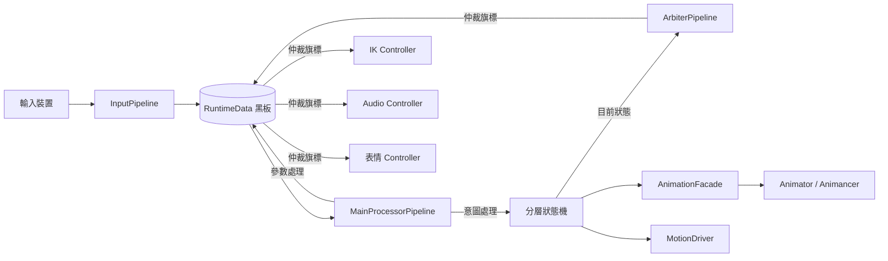

# IntentPipeline 架構設計文件

> 狀態：草稿 v0.22
> 最後更新：2026-07-25
> 作者：Baka8787

---

## 1. 專案目標

### 1.1 這是什麼
一個資料驅動的 Unity 第三人稱角色控制器框架
目標是徹底分離「邏輯決策」與「表現執行」。

### 1.2 為什麼要做這個（問題陳述）
傳統角色控制器常見的問題：
- 輸入、狀態、動畫事件、音效全部耦合在同一份腳本裡
- 新增一個動作/武器，要到處改現有程式碼，容易牽一髮動全身
- 狀態切換用大量 if-else 或 bool flag 堆疊，難以追蹤「誰能打斷誰」

### 1.3 這個專案要解決到什麼程度（Scope）
- [ ] 必須做到：最終目的是做出能用於arpg、射擊遊戲及其他各種遊戲模式的角色控制器
- [ ] 盡量做到：IK製作或串接、完整的離線內容建置系統。未來不論加入 Motion Matching、Motion Warping、AI 動畫標註，甚至自動產生 LOD 動畫資料，都只是往 Pipeline 增加新的 Stage，而不是重寫整個工具鏈
- [ ] 不在這次範圍內（Out of Scope）：____

> 建議先填這一欄再往下寫，避免規格越寫越大導致做不完。

---

## 2. 核心設計理念

### 2.1 兩股資訊流：意圖（Intent）與參數（Parameter）

| | 意圖 (Intent) | 參數 (Parameter) |
|---|---|---|
| 定義 | 這一瞬間「想」做什麼 | 這一帧用來驅動表現的連續數值 |
| 範例 | 按下跳躍鍵、按下開火鍵 | 移動速度、視角角度、上半身權重 |
| 生命週期 | 通常單帧觸發，當帧處理完即復位 | 持續存在，每帧更新 |
| 誰來讀 | 狀態機（決定要不要切換狀態） | 動畫層、IK 層（決定怎麼表現） |

**為什麼要分開？**
[在這裡寫下你自己的理解 / 之後實作後回頭補充的心得]

### 2.2 資料中心黑板（Blackboard）模式
- 所有模組只讀寫 `RuntimeData`，不直接互相呼叫
- 好處：____
- 代價／要注意的地方：____（例如：黑板過度肥大、誰該擁有寫入權需要規範）

### 2.3 分層狀態機
- FullBody / UpperBody / Override 三層的職責邊界
- 為什麼不用單一狀態機處理所有動作？

### 2.4 表現層解耦（Facade 模式）
- 玩法邏輯不應該知道「動畫機是 Animancer 還是 Animator」
- Facade 的介面該長什麼樣子？

### 2.5 仲裁層（ArbiterPipeline）

角色在某些特殊狀態下（死亡、被控制、離相機太遠），不是「要播什麼動畫」的問題，而是「要不要允許某個表現層模組繼續運作」的問題。

如果讓各個 Controller（IK、音頻、表情）自己讀狀態機目前的狀態來判斷，就會變成原問題陳述的老毛病——到處寫死依賴、牽一髮動全身。

仲裁層的職責是：**把「能不能」這件事，從各模組各自判斷，收斂成一個單一決策點。**

資料流如下：
```
狀態機（知道目前是什麼狀態）
  → ArbiterPipeline（依狀態轉譯成仲裁旗標）
  → RuntimeData.Arbitration（寫入黑板的仲裁區）
  → 各 Controller（只讀旗標，不問為什麼）
```

這與黑板模式的精神一致：下游模組只看黑板上的資料辦事，不直接詢問上游模組的內部狀態。仲裁旗標就是黑板上繼「意圖」「參數」之後的第三種資料類型。

**實作時機**：~~第四階段（仲裁器與打斷系統），狀態機完成後再接入~~ → ✅ **輪 4 落地（2026-07-27）**，見 4.5 節。

🆕 **落地時修正的一個假設：封鎖不必然來自狀態。** 上面那條資料流把「狀態機」畫成唯一的上游，是因為當初想的都是死亡／被控制這類**確實是角色狀態**的情境。實際接上第一個需求（Alt ＝ 放開滑鼠去點 UI）才發現它**根本不是角色狀態**——強行為它開一個 FSM 狀態只會污染拓撲。因此上游被一般化為 `IArbiterSource` 集合：**狀態機是眾多可能來源之一**（未來的死亡封鎖會是一顆讀 FSM 狀態的 source），而不是唯一來源。仲裁層「把能不能收斂成單一決策點」的核心精神不變，改變的只是「決策的**輸入**可以來自哪裡」。

### 2.6 表現層物件階層：Adapter Root + Model Child（v0.9 新增，v0.12 定調，詳見 `docs/ADR/001-root-model-hierarchy.md`）

除錯 v0.8 的「Jump 先蹲下再往上」問題時，根因追到 `Animator.applyRootMotion` 若沒關乾淨，Unity 會自動把根動作套用到掛著 `Animator` 的那顆 Transform；如果這顆 Transform 跟 `CharacterController` 是同一顆物件，就會跟我們手動呼叫的 `CharacterController.Move()` 互搶同一份世界座標，產生位置衝突、抖動或瞬移。這是 2.4 節「表現層解耦」的精神在**物件階層**這個維度上還沒落實——邏輯上做了 Facade 隔離，但實體階層上邏輯根跟美術根還疊在同一顆物件。

**決策**：角色物件拆成兩層。

```
CharacterRoot（空物件，Adapter）
├── CharacterController
├── CharacterPipelineRunner
├── MotionDriver
├── AnimancerFacade（掛 AnimationFacadeBase 子類）  ← 邏輯玩法只認得到這一層
├── AnimancerComponent（動畫「邏輯」元件，定調在 Root）
├── PlayerInputSource
└── Model（子物件，僅美術/骨骼相關）
    ├── Animator（Humanoid Avatar，applyRootMotion 強制關閉）
    ├── SkinnedMeshRenderer
    └── 骨骼階層（供未來 IK / 手部持武器對位使用）
```

> ⚠️ **v0.12 定調**：本節初版（v0.9）曾把 `AnimancerComponent` 畫在 Model 子物件，與 `docs/02-dev-spec.md` §0.3 的 Root 擺法矛盾。ADR-001 已定調 `AnimancerComponent` 掛在 **Root**（只有真正屬於美術的 `Animator`＋網格＋骨骼下放 Model），此處已更正。理由詳見 `docs/ADR/001-root-model-hierarchy.md`。

**為什麼要分開？**
- **物理權威單一化**：`CharacterController` 只存在於 Root，Root 的世界座標只能被 `MotionDriver.ExecuteBaseMovement()` 等程式碼路徑改動。即使 Model 子物件上的 `Animator.applyRootMotion` 哪天不小心被勾選，Unity 自動套用的根動作也只會影響 Model 的**local transform**，不會波及 Root 的世界座標，兩者物理上不可能打架——這比「靠 Inspector 記得關勾選框」更根本地杜絕了這類 bug。
- **呼應既有 Facade 精神**：`AnimancerComponent` 與 `AnimancerFacade` 同在 Root，`Facade` 以 `GetComponent<AnimancerComponent>()`（同物件）取得動畫邏輯元件，比跨層 `GetComponentInChildren` 更嚴格；`Animator` 則以 `GetComponentInChildren<Animator>()` 由 Model 子物件取得。Animancer 原生支援 `AnimancerComponent` 與 `Animator` 跨物件（`AnimancerComponent._Animator` 為序列化欄位），此配置受官方支援，不需要改 Facade 介面。
- **美術資產可替換**：換裝、換模型只需要替換 Model 子物件，Root 上的邏輯元件、Collider 尺寸、Inspector 綁定關係完全不受影響。
- **未來 IK 擴充的自然掛點**：手部 IK、武器對位、頭部 LookAt 這類需要直接操作骨骼的功能，天然應該掛在 Model 這一層或引用 Model 底下的 Transform，跟「只讀黑板仲裁旗標」的表現層 Controller（4.6 節）分開放，職責邊界更清楚。

**代價**：現有專案若已經是單層結構，需要一次性搬遷（拆出 Model 子物件、把 `Animator`＋網格＋骨骼移過去，`AnimancerComponent` 留在 Root 並把其 `Animator` 欄位重新指向 Model 子物件的 `Animator`、確認 Inspector 引用沒斷掉）；`ThirdPersonCamera` 等外部引用角色 Transform 的模組要重新確認引用的是 Root 還是 Model（規範上一律引用 **Root**，Model 只服務於動畫播放，任何遊戲邏輯都不該直接參考它）。列入 `docs/02-dev-spec.md` §5 待補清單。

---

### 2.7 狀態專屬參數：StateParamsSO（v0.10 新增，取代 StateRule 兼職）

v0.7～v0.8 為了解決「`[SerializeField]` 掛在純 C# 狀態類別上不會被序列化」的問題，把 `JumpImpulseForce`、`JumpTakeoffDelay` 直接塞進了泛用的 `StateRule` 結構體。這個做法**能動，但方向是錯的**，複查後確認踩了三個真實的坑：

1. **職責混亂（FSM 拓撲 vs 物理表現參數）**：`StateRule` 的職責應該只回答「誰能打斷誰、誰能自然過渡到誰、優先級多高」這種**拓撲關係**問題——這件事跟具體是 Idle、Jump 還是未來的 SlideState 無關，是狀態機控制流本身的資料。而 `JumpImpulseForce`／`JumpTakeoffDelay` 是「Jump 這個特定狀態自己要怎麼表現」的**物理調參**，兩者屬於完全不同的關注點，硬塞進同一個結構體就是教科書等級的 SRP 違反。
2. **Inspector／記憶體污染**：`StateRule` 是所有狀態共用的泛用結構體，於是設定 Idle、Move、Roll 的規則時，Inspector 上也會強行冒出跟這些狀態毫無關係的 `Jump Impulse Force`／`Jump Takeoff Delay` 欄位，策劃/美術配置時容易誤填，執行期也有用不到的欄位在每個 `StateRule` 元素裡佔記憶體。
3. **擴充性災難**：這是最致命的一點。專案的終極目標是同一套控制器要能撐起 ARPG、射擊等不同遊戲模式，勢必會有 `SlideState`（滑行距離／摩擦係數）、`ClimbState`（爬牆速度／體力消耗）、`AimState`（瞄準靈敏度倍率）……如果繼續往 `StateRule` 塞欄位，這個結構體會線性膨脹到幾十個只有單一狀態用得到的欄位，變成沒有人敢動的巨石類別。

**決策**：拆成兩個完全獨立的資料通道。

```
StateRule（純拓撲，維持精簡）
├── State
├── Priority
├── CanBeInterruptedBy
└── ValidTransitions

StateParamsSO（新增，狀態專屬參數，一狀態一資產，可為 None）
├── abstract class StateParamsSO : ScriptableObject   ← 只是個標記基底，不放共用欄位
├── JumpStateParams : StateParamsSO { Stages(List<JumpStage>), HeightMultiplier, GravityMultiplier, LaunchVelocityMultiplier }   ← 內容經 ADR-002 重新定義，見 §2.8
├── SlideStateParams : StateParamsSO { SlideDistance, FrictionCurve }   ← 未來
├── ClimbStateParams : StateParamsSO { ClimbSpeed, StaminaCostPerSecond }   ← 未來
└── ...每個需要調參的狀態各自一個子類別，互不干擾
```

`StateMachineConfigSO` 比照既有 `bakeMappings` 的模式，新增一份 `List<StateParamsMapping>`（`State` + `StateParamsSO`），查表方法用泛型收斂型別轉換：

```csharp
public TParams GetStateParams<TParams>(StateType state) where TParams : StateParamsSO
{
    return _paramsMap.TryGetValue(state, out var so) ? so as TParams : null;
}
```

`JumpState.Initialize(config)` 改成 `config.GetStateParams<JumpStateParams>(Type)`，拿不到就沿用程式碼內建預設值（跟 v0.7 的 fallback 精神一致，只是查表的資料結構換了）。

**為什麼這樣選**：
- Inspector 上每個狀態只看得到跟自己相關的欄位（因為是獨立資產），策劃配置時不會被無關欄位干擾。
- 新增一個需要調參的狀態，只要新增一個 `StateParamsSO` 子類別，`StateRule` 完全不用動——**擴充成本是 O(1)，不是 O(既有狀態數)**。
- 跟現有 `MotionBakeData`／`bakeMappings` 是同一套設計語言（狀態專屬資產 + Config SO 查表掛載），學習成本低、不用引入新概念。
- 直接呼應「最終目的是做出能用於 ARPG、射擊遊戲及其他各種遊戲模式的角色控制器」這個專案目標：不同遊戲模式所需要的狀態集合天差地遠，核心的 `StateRule`／`FullBodyStateMachine` 必須維持跟具體遊戲模式無關，所有「這個模式特有的調參」都應該收斂在各自獨立的 `StateParamsSO` 資產裡，而不是污染共用的拓撲結構。

**代價**：多一層 `ScriptableObject` 資產管理（每個需要調參的狀態要多建一個 `.asset` 檔並在 Config SO 裡掛好對應關係）；`GetStateParams<T>` 的向下轉型失敗只會靜默回傳 `null`（型別掛錯資產時要靠呼叫端自己防呆，未來可以考慮加一層 Editor 驗證工具檢查掛載型別是否正確）。**尚未實作**，`JumpImpulseForce`／`JumpTakeoffDelay` 目前仍留在 `StateRule` 內運作，等下一輪程式碼實作再遷移，避免文件（設計意圖）跟程式碼（暫時方案）互相矛盾——這點在 `docs/02-dev-spec.md` §5 待補清單與 Trade-off 表都會標註清楚何者是目標、何者是過渡態。

---

### 2.8 數據驅動跳躍與多段跳（v0.13 定調）

> [歷史決策脈絡詳見 `docs/ADR/002-data-driven-jump.md`]

承 §2.7 的 `StateParamsSO` 機制，跳躍的物理表現改為**數據驅動、單一真相來源**：

- **物理量單一來源**：起跳前搖、最高點、逆推重力全部來自各段 clip 的 `MotionBakeData`（`AutoTakeoffDelay` / `AutoApexHeight` / `AutoCalculatedGravity`），不再手填；`JumpStateParams` 拔除 `ImpulseForce` / `TakeoffDelay`。
- **JumpStateParams = 跳躍內容 + 設計師倍率**：有序 `Stages`（`List<JumpStage>`，每段引用一份 `MotionBakeData`；第 0 段 = 地面跳）＋ Designer Tuning 三倍率（`HeightMultiplier` / `GravityMultiplier` / `LaunchVelocityMultiplier`，預設 1）。
- **多段跳＝資產閉環**：可跳段數上限即 `Stages.Count`；`JumpState` 以「已跳次數 < `Stages.Count`」為閘門，空中再按跳在狀態內部消化（不走狀態轉移）。新增一段＝資產加一個 `JumpStage`，邏輯零改。
- **物理逆推（選項 A）**：`JumpState` 以 `v = √(2gh)`（g = `AutoCalculatedGravity`、h = `AutoApexHeight`，套用倍率）逐段預算，透過 `MotionDriver.ApplyJumpLaunch(in JumpLaunchData)` 注入初速＋該段重力；`MotionDriver` 以 `_activeGravity` 積分、落地自動回復預設，仍是垂直速度的唯一寫入者。

（`Coyote Time`／`Jump Buffer`／`Variable Jump` 等手感行為與「能力系統動態限制段數」屬 ADR-002 §6 Deferred，尚未定案，不在本節。）

---

## 3. 系統架構圖

> 用 Mermaid 畫，GitHub 上可直接渲染



[依實作進度持續更新此圖]

---

## 4. 模組職責邊界

> 每個模組寫清楚「該做什麼」跟「不該做什麼」，避免職責蔓延

### 4.1 InputPipeline
- 該做：採樣輸入裝置、做輸入緩衝/一致性處理、寫入意圖到黑板
- 不該做：不該知道狀態機目前在哪個狀態、不該直接觸發動畫
- **中性紀律（🆕 ADR-003）**：`InputData` 只承載**中性 action 訊號**（`JumpButtonDown`、`SprintButtonHeld`…），只回答「這顆 action 有沒有被按／按住」，**不回答它代表什麼**。不得引入 `MovementModifier` 這類**領域分類**欄位——那會把 gameplay 語意烤進 raw input 層，並讓 AI／replay／netcode 得先「假裝有按鍵」才能產生意圖（ADR-003 §6.3 明確否決）。「同一顆鍵在不同情境代表不同意義」的路由屬 Input 層更上游（action map 切換／Input Router），不屬下游 producer

### 4.2 RuntimeData（黑板）
- 該做：承載當帧意圖、參數快取、裝備/瞄準引用、仲裁旗標
- 不該做：不該包含邏輯方法（只存資料，不做決策）
- **已知落差（v0.7 盤點）**：目前尚未有 `IsGrounded` 欄位。`JumpState` 的落地判定需要這個資訊，但因為黑板沒有承載，只能退而求其次用內部固定計時器模擬，違反「狀態只讀黑板」的邊界。規劃由 `MotionDriver` 每幀讀取 `CharacterController.isGrounded` 寫入黑板，`JumpState` 改讀黑板旗標（見 §5 Trade-off 表新增列）。**（v0.8 已實作）**
- **規劃中的擴充（v0.10 定案；⏸ `VerticalVelocity` 延後、✅ `JustLanded`／`JustLeftGround` 已於 M2 落地）**：`VerticalVelocity` 由 **ADR-002 §6-1** 定為等出現**第二個**垂直速度消費者（wall-slide／擊飛／電梯）再落地，目前垂直速度仍封裝於 `MotionDriver`（跳躍經 `ApplyJumpLaunch` 注入）；`JustLanded`／`JustLeftGround` 於 2026-07-14 定調比照辦理（YAGNI）後，**M2 因第一個下游消費者（`AudioController` 落地音）出現而兌現落地**——「落地永遠等消費者」的紀律走完「定案 → 延後 → 消費者出現 → 落地」完整生命週期，黑板讀寫規格見 `docs/02-dev-spec.md` §1.1。
- **單幀瞬態的統一生命週期（🆕 M2）**：黑板提供 `ResetTransientState()`（復位意圖旗標＋落地/離地邊沿），由 Runner 在管線末尾（順序 7）統一呼叫。復位屬**資料生命週期管理**，與「黑板不含邏輯方法」原則不衝突（同 `IntentData.Reset()` 性質——復位不是決策），也不視為第二寫入者（觸發源仍唯一）。
- **兩類意圖的分界（🆕 ADR-003）**：黑板同時承載 **trigger 意圖**（`IntentData`：Jump／Roll／Fire 邊沿，當帧生當帧死）與 **連續型 domain 意圖**（`MovementIntent`：每帧由 active producer 整體覆寫，**不**參與順序 7 復位）。兩者混為一談會出事：若把連續意圖也納入統一復位，producer 缺席的帧會產生「意圖瞬間歸零」假訊號。黑板採 **domain-partitioned intents** 原則——未來 `CombatIntent`／`InteractionIntent` 各為**兄弟 region、各自單一寫入者**，而不是把欄位塞進同一個 god-Intent。

### 4.3 狀態機（State Machine）
- 該做：依黑板資料決定要不要切換狀態、管理進入/退出條件、將目前狀態資訊提供給 ArbiterPipeline
- 不該做：不該直接操作動畫播放細節（要透過 Facade）、不該直接去開關各個 Controller

### 4.4 AnimationFacade
- 該做：統一動畫播放介面，隔離底層動畫系統差異
- 不該做：不該包含遊戲邏輯判斷
- **物件階層（v0.9 新增，v0.12 定調）**：Facade 與 `AnimancerComponent` 同掛在 Root（Adapter），以 `GetComponent<AnimancerComponent>()` 取得動畫邏輯元件；`Animator` 掛在 Model 子物件，以 `GetComponentInChildren<Animator>()` 取得。不該把 `Animator` 掛在 Root（會與 `CharacterController` 世界座標互搶），理由見 2.6 節與 `docs/ADR/001-root-model-hierarchy.md`。

### 4.5 ArbiterPipeline（仲裁管線）＋ IArbiterSource（✅ 輪 4 落地）
- 該做：於管線順序 4.5（Update，狀態機之後、動畫表現層之前）詢問所有 `IArbiterSource`、**OR 合併**、整體覆寫 `RuntimeData.Arbitration`（`BlockInput`／`BlockIK`／`BlockAudio`／`BlockExpression`）。它是該區的**唯一執行期寫入者**
- 不該做：不該直接呼叫任何表現層 Controller 的方法（只能透過寫黑板旗標溝通，由 dev-spec §7-A4 的層級掃描守）、不該包含狀態切換邏輯（那是狀態機的職責）、**不該認識任何具體封鎖語意**（不知道有 UI 模式、不知道有游標、不知道有死亡——那些都住在各自的 source 裡）
- **seam 形態（輪 4 裁決）**：`IArbiterSource` 集合 ＋ 管線只認介面，與 `IMovementIntentSource`（順序 2.5）／`IPresentationController`（順序 6.5）**第三次沿用同一個 pattern**。新增封鎖來源＝實作介面掛上角色階層，管線與 Runner 零改動
- **被否決的替代方案**：①**`BaseState.BlocksInput` virtual（各 State 自帶宣告）**——會讓 FSM 反向認識仲裁概念（2.5 節的資料流是「Arbiter 讀 state」，方向相反），把「哪些狀態封鎖什麼」這張表拆散到 N 個 state 檔，而且**蓋不住 Alt**（UI 模式不是角色狀態）；②**`StateMachineConfigSO` per-state 封鎖旗標**——同樣蓋不住非狀態來源，且把只有一條 bool 的規則搬進資產，徒增維護面
- **來源介面刻意回傳 `ArbiterData` 而非收 `ref ArbiterData`**：採 `ref` 時來源看得見（也就改得掉）別人已抬起的旗標，「不得清掉別人的封鎖」只能靠紀律去守；回傳自己的請求後這件事**結構上不可能**，且「多來源如何合併」有唯一的家——未來要做優先級／強制解封，改的是管線一個迴圈，所有來源零改。這是「用型別把紀律變成不可能」優於「用測試把紀律守住」的一個實例
- **首個來源：`UiModeArbiterSource`（UI 模式）**——Alt 放開滑鼠、角色停止移動。它是「UI 模式」概念的唯一持有者（開關狀態＋`InputAction`），上游只收到一顆 bool。🔄（輪 4.2）**`Cursor` API 已移出**——第二個滑鼠模式（暫停）出現後改由 §4.9 的 `CursorModeController` 統一擁有，本元件只回報意圖。**Alt 刻意不進 `InputData`**：那是可被 `BlockInput` 封鎖的通道，而解除封鎖的鍵不能住在可被封鎖的通道裡（詳見 `docs/02-dev-spec.md` §1.4）
- **`BlockInput` 的語意（dev-spec §7-M5 結案）**：＝「本帧管線看不到任何輸入」，實作為在順序 2 閘門把 `InputData` 歸零、順序 2 與 2.5 照常執行。**不是**「跳過移動意圖」——`MovementIntent` 是連續型意圖，跳過等於凍結在最後一帧（封鎖瞬間全速跑 ⇒ 無限前進）。歸零輸入讓 producer 依然是 `MovementIntent` 的唯一寫入者，且**完全不需要知道「封鎖」存在**（ADR-003 D2 context-free 不受影響），手感則自然落在既有 B9 減速收步上
- **不預造**：多來源只做 OR，**無優先級／強制解封**（需要真實競爭情境才能裁決語意，見 dev-spec §7.3）；死亡封鎖等第二個真實來源出現時，再新增一顆讀 FSM 狀態的 source

### 4.6 表現層 Controller（IK / Audio / 表情等）＋ PresentationPipeline（✅ M2 落地）
- 該做：實作 `IPresentationController`，由 `PresentationPipeline` 於管線順序 6.5（LateUpdate，MotionDriver 之後、統一復位之前）集中驅動；每帧讀取 `RuntimeData.Arbitration` 對應旗標決定要不要執行、讀取單幀事件（`JustLanded` 等）觸發一次性表現
- 不該做：不該直接詢問狀態機目前在哪個狀態、不該自己包含「死亡時停止」這類判斷邏輯（那是仲裁層的職責）、不該自帶 `Update`／`LateUpdate`（時序由管線統一保證，否則單幀事件的讀取窗口不可控）、不該回寫黑板
- **定位（M2 定調）**：`PresentationPipeline` 是**表現層驅動骨架**——Runner 只呼叫管線、不認識任何具體 Controller；後續 IK／Facial／VFX 模組沿用同一介面掛上角色階層即生效，Runner 零改動。M2 首個實例：`AudioController`（落地音；Event → Definition → Library 查表結構見 `docs/02-dev-spec.md` §3.4）
- **第二實例（✅ M3 Foot IK，M3.1 修正定調）**：`FootIKController`（Root，決策端）＋`FootIKRig`（Model，**Presentation Adapter**）——兌現 2.6 節「需要直接操作骨骼的功能掛 Model 層、與讀黑板的 Controller 分開放」的預留。兩者以**兩條各自單寫單讀的獨立單向管道**橋接：`FootIKTargetData`（Controller 寫 → Rig 讀，IK 目標）與 `FootIKPoseData`（Rig 寫 → Controller 讀，動畫原始 goal 快照）——執行期零方法呼叫，與黑板／MotionDriver 同款資料流哲學。**Adapter 定義**：動畫系統邊界上的雙向轉接器，對每條管道各守單一讀寫方向、零判斷零演算法，非單純 Reader。Controller 對 Animator 零依賴（pose 一律讀快照，不採骨骼現值——反饋迴路教訓見 §5 Trade-off 與 changelog v0.18.1）。Runner 零改動（骨架的首次回收驗證）。規格見 `docs/05-foot-ik.md`（原 dev-spec §3.5，2026-07-25 分卷）
- **Foot IK 設計哲學（✅ v1 凍結，2026-07-20 使用者裁決）**：源自對喜好遊戲全身 IK 的觀察（大腿可高抬、小腿不受限、腳踝自由旋轉、腳底不強制整面貼地、允許少量腳尖穿模），目標鐵律定為 **Natural Pose > Terrain Adaptation > Perfect Foot Contact**——接受少量腳尖穿模，不接受為修穿模讓動作僵硬。優先級（高→低）：①動畫自然度 → ②保留角色原本活動範圍（抬腿／跨步／轉向不因 IK 受限）→ ③只擋真正超出人體極限的姿勢（Reach Clamp 類屬允許範疇）→ ④地形適應（Ground Sampling）→ ⑤腳尖穿模等視覺瑕疵（最後處理）。**禁令**：不再新增 Fade／Gate／大量權重修正修穿模——貼地品質改善一律走 Ground Sampling 升級（Heel/Toe 雙點、多點採樣、CapsuleCast），懸置的「Normal Gate 僅旋轉版」正式否決。**新機制檢核問句**：所有新 IK 機制必答「是否會縮小角色原本的活動空間？」，會就必須提替代方案。此哲學把 M3.2~M3.4 實驗教訓（fade 族＝半 IK 常態化、Slope Gate＝邊緣震盪源，changelog v0.18.2~v0.18.6）升格為明文禁令；v1 已知限制與品質升級順序見 `docs/05-foot-ik.md` §3.5.2（原 dev-spec §3.5.2，2026-07-25 分卷）與 `docs/03-animation-roadmap.md`
- **升級預留**：本骨架只做「依序驅動」，不做**輸出**仲裁。未來若多個 Controller 競爭同一輸出（例如兩個模組都要控制 AudioSource／同一根骨骼），屆時升級為表現層的輸出仲裁並**補 ADR**——在那之前不預先設計（YAGNI）
  - ⚠️ **這個預留沒有因為輪 4 而兌現**（2026-07-27 澄清）：4.5 節落地的 `ArbiterPipeline` 解的是「**誰可以運作**」（功能封鎖旗標，經黑板 `ArbiterData` 單向溝通，Controller 只讀不寫）；此處預留的是「**同一個輸出由誰說了算**」（多個 Controller 同時要寫同一個目標時的取捨）。兩者層次不同、資料流也不同，**前者落地不代表後者已解決**——別因為專案裡已經有一顆叫 `ArbiterPipeline` 的類別就把這條劃掉

### 4.7 GameObject 物件階層（v0.9 新增，v0.12 定調，詳見 2.6 節與 `docs/ADR/001-root-model-hierarchy.md`）
- 該做：邏輯／物理權威元件（`CharacterController`、`CharacterPipelineRunner`、`MotionDriver`、`AnimationFacade` 子類、`AnimancerComponent`、`IInputSource` 實作）掛在 Root（Adapter）；美術／骨骼相關元件（`Animator`、`SkinnedMeshRenderer`、骨骼階層）掛在子物件 Model；外部模組（如 `ThirdPersonCamera`）一律引用 Root Transform
- 不該做：不該把 `Animator` 或任何會產生根動作的元件跟 `CharacterController` 掛在同一顆物件上；不該讓遊戲邏輯持有 Model 子物件的 Transform 引用（該子物件只服務動畫播放）

### 4.8 Movement 意圖層 ＋ Movement Model（🆕 ADR-003 Stage 1＋2 落地，詳見 `docs/ADR/003-movement-intent-layering.md`）
- 該做：`IMovementIntentSource` 的 active 實作（Stage 1＝`PlayerLocomotionPolicy`，掛 Root）讀**中性輸入＋`GaitProfileSO`**，每帧產出**模型無關**的 `MovementIntent{DesiredSpeedNormalized[0-1], DesiredDirection}` 寫入黑板；「預設 Run／Shift=Sprint／Ctrl=Walk」這類 per-game 控制方案全部住在這裡（換方案＝換資產，換驅動來源＝換掛元件，Runner 零改）
- 不該做：不該回讀 gameplay state 或當前 model（**context-free**，否則 producer → state 同帧回圈重現）；不該判斷「這顆 Shift 現在是不是給移動用的」（那是 Input 層 action map 的職責）；不該把 gait／速度換算寫進意圖（Walk/Run/Sprint 是 **Locomotion model** 對 [0-1] 的命名門檻，不屬契約）
- 🆕 **控制方案的可配置面在資產，不在 policy 程式碼**（2026-07-25）：連「Walk 是按住生效還是按一下切換型態」都是 per-game 差異，因此做成 `GaitProfileSO.walkIsToggle` 而非寫死在 producer——否則「換玩法＝換一顆資產」只對數值成立、對操作語意不成立。對應地，**toggle 的持久型態存黑板**（`MovementIntent.WalkModeActive`）而非 producer 私有欄位：ADR-003 D5 明文「mode/toggle state 進黑板」，§9-L5 的 snapshot-able 前提也要求無隱藏態。這條由測試守——同一顆 producer 換一塊新黑板，型態必須從乾淨狀態開始
- **為什麼需要這一層**：「input＋modifier → 想要多快」是一條 **per-game 的規則**，塞進 State 會把控制方案焊進 FSM 拓撲（破壞多玩法目標）、塞進 Input 會洩漏 gameplay 語意、塞進通用 Runner 會讓它認識 locomotion 概念（Swim 只有 StrokeRate、Vehicle 只有 RPM，一進場即露餡）。三處都撞牆 → 這條規則需要自己的家
- **單一真相紀律**：`MovementIntent` 是唯一真相；黑板 Movement Output（`MoveSpeed`／`MoveDirection`／`UpperBodyWeight`）是它經 model dynamics 導出的**衍生值**，禁止任何路徑繞過 intent 直寫。此紀律專為避免重演「兩個真相來源」病（＝ ADR-002 為 jump 物理奮戰的同型問題）而設，並由 EditMode 測試守（`docs/02-dev-spec.md` §7-A5／A7）
- 🆕 **Movement Model（Stage 2 落地）**：`IMovementModel` 封裝「此刻怎麼動」的全部 dynamics（B9 平滑、運動輸出、**自驅自己的動畫參數**）。ambient 狀態（Idle／Move）的 `OnUpdateMotion` delegate 給它、`CanEnter` 問它 `IsProducingMotion`；intrinsic-motion 狀態（Jump／Roll）維持自帶位移。**model 的唯一持有點是狀態機**（Runner 解析 → 注入 → 發給所有 state），因為跨帧平滑狀態必須全域唯一——多份平滑＝Idle↔Move 切換時收步被重置
- ✅ **殘餘耦合已收尾（2026-07-25）**：B9 平滑＋`MoveSpeed` 導出＋動畫參數驅動已整組遷入 `LocomotionModel`，通用 Runner 不再認識任何 locomotion 概念（ADR-003 §9-L1 消解，由 dev-spec §7-A9／A10 自動守住不回流）。**唯一刻意保留的中間態**：Movement Output 仍走黑板欄位（消費端含 `MotionDriver` 與 Jump 空中控制），D4 的「完全內化」待第二個 model 進場時一併處理（dev-spec §7.3）
- **Stage 2 學到的時序課**：「把 dynamics 併進 `OnUpdateMotion`、讓 model 只有一個進入點」看起來更乾淨，實測會壞兩件事——Jump／Roll 期間平滑凍結（空中控制吃的正是這組輸出，落地滑步），以及 `SetFloat` 落到 LateUpdate 後動畫參數比位移晚一帧（Animator 評估卡在 Update 與 LateUpdate 之間）。**「乾淨的形狀」必須先通過時序驗證**，這條寫進 dev-spec §2.1 脆弱點警告第 6 條

### 4.9 應用層（Application Layer，🆕 輪 4.1 落地：`Assets/Scripts/App/`）

- **這一層為什麼存在**：輪 4.1 要做「Tap Left Alt ＝ 暫停」時，第一個直覺是把它做成 `ArbiterData` 的第 5 個旗標。**那是錯的**——`PlayerRuntimeData`／`ArbiterData` 是**單一角色**的黑板與仲裁旗標，而 `Time.timeScale` 是**應用全域**狀態。把全域狀態放進 per-character 結構，第二隻角色進場立刻露餡：兩塊黑板都會聲稱自己擁有暫停。**這是「哪個 scope 擁有這個狀態」的問題，不是「哪個模組比較方便」的問題**
- 該做：持有**跨角色／全域**的狀態與其副作用（首例：`GamePauseController` 擁有暫停狀態與 `Time.timeScale`）。自帶 `Update`——它沒有管線可掛，**這是與 `IArbiterSource`／`IPresentationController`「不得自帶 Update」紀律的刻意差異**，那條紀律的前提是「你屬於角色管線」，本層明確不屬於
- 不該做：不掛在角色階層上、不由 `CharacterPipelineRunner` 管理、不寫入任何角色黑板欄位；**不做 Singleton**（CLAUDE.md 明禁）——沒有靜態實例與全域存取點，需要驅動它的人以 Inspector 引用
- **首例的刻意最小化（使用者裁決）**：`GamePauseController` 只做 `timeScale` 切換，**不封鎖角色輸入**（`timeScale = 0` 已讓位移與動畫全停）。已知缺口與未來正解記在 dev-spec §7.3
- 🆕 **第二個住戶：`CursorModeController`（輪 4.2）＝`Cursor` API 的唯一擁有者**。它把所有「想要自由游標」的來源（目前：UI 模式、暫停）**OR 合併後套用一次**——形狀與 `ArbiterPipeline` 同源，只是來源改用 Inspector 明確引用（兩個而已，不預先做成介面集合；等第三個滑鼠模式出現再一般化，同 `PresentationPipeline` 當年的節奏）
  - **為什麼游標會搬到這一層**：輪 4 只有一個滑鼠模式時，Cursor 判給 `UiModeArbiterSource` 是合理的最小解；輪 4.1 的暫停讓它變成**兩個**，各寫各的就出現可重現的碰撞（暫停中進出 UI 模式會把游標鎖回去）。游標的**scope 本來就是應用層**——它跟 `timeScale` 一樣，不屬於任何一隻角色
  - ⚠️ **`ThirdPersonCamera.Start` 的初始鎖定已一併移除**：留著就是第二個寫入者，「唯一擁有者」會變成只是文件上的說法。代價是這顆元件缺席時開場游標不會鎖、連帶相機不轉（相機以 `Cursor.lockState` 為閘門）——**刻意讓它大聲壞掉**，而不是靜默漂移
- **這一層的兩個方向，都對**：游標是「**高層擁有、低層回報意圖**」（App 讀角色元件的 `IsUiModeActive`）；而若未來暫停要封鎖角色輸入，則是「**低層擁有、高層提供來源**」（角色的 `ArbiterPipeline` 收一顆 App 給的 `IArbiterSource`）。看起來相反，判準其實同一個：**那個狀態的 scope 屬於誰，就由誰擁有**
- **與角色層的溝通方式（尚未需要，先記下界線）**：若未來暫停真的必須讓角色 `BlockInput`，正解**不是**讓角色去查詢全域，而是讓暫停器實作 `IArbiterSource`、由角色以 Inspector 引用（DIP，同 `IMovementIntentSource` 的注入形態）。在真的需要之前不預先接線

---

## 5. 關鍵設計決策與 Trade-off

> 這一節是面試時最容易被問到的地方：「為什麼這樣設計？有沒有想過別的做法？」

| 決策 | 選擇 | 替代方案 | 為什麼選這個 | 代價 |
|---|---|---|---|---|
| 動畫系統（第三階段決策，✅ 2026-07-14 已升級 Pro） | ~~Animancer Lite v8（Editor 驗證）~~ → **Animancer v8 Pro（已入專案）**+ Facade 按 Pro 目標設計 | Unity Animator + 自製 Facade / 直接上 Animancer Pro | Facade 介面穩定、內部可替換；Lite 免費驗證架構正確性，不綁定升級時機——**此策略已兌現**：升級時外部呼叫端零修改 | Lite 的 Runtime 限制（僅 Layer 0、Mixer 限 Editor）已隨升級解除；Mixer／ITransition 資產機制已於 **v0.16 落地**（M1＝F1＋F2）——外部介面僅 `Play`／`PlayWithCallback` 拔除 duration 參數（裁決 Q1），其餘契約不變；Layers 多層混合（F4）仍屬 Future Work |
| 狀態機表示法 | ScriptableObject 配置 | 純程式碼 enum + switch | | |
| 黑板實作 | 單一 class 集中持有 | ECS / 元件式資料 | | |
| `InputData` 物件複用策略（v0.1） | `PlayerInputSource` 持有單一 `private readonly InputData` 實例，每帧覆寫後回傳同一參考 | 每帧 `new InputData()` | 避免每帧 GC Alloc | **鬼影資料風險（Aliasing）**：回傳的是參考而非拷貝，若被外部跨帧持有將隨下一帧被覆寫；已規劃以 `ref struct` 重構消除此風險（見 docs/02-dev-spec.md 1.3 節） |
| `InputData` 型別升版（v0.2 已執行） | 改為 `ref struct`，`IInputSource` 簽名改為 `void FetchRawInput(ref InputData data)` | 維持可變 class | 徹底消除 Aliasing 風險，stack-only 語意保證不會被跨帧持有；對齊原作者零 GC 設計方向 | `ref struct` 不能裝箱、不能用於 async/迭代器、不能被 class 持有為欄位；為破壞性變更，需同步修改 `IInputSource`、`PlayerInputSource`、`CharacterPipelineRunner` 三處。實作後用 Profiler 量測 GC Alloc 差異補入此欄 |
| Intent/Parameter 處理器內嵌在 Runner | 以 private method 寫死在 `CharacterPipelineRunner` | 抽成 `IIntentProcessor` / `IParameterProcessor` 介面，Runner 持有 List 逐一呼叫 | 地基階段邏輯量小，先求資料流跑通，避免過早抽象 | 與規格文件隱含的可插拔設計不一致；**重構訊號**：任一 method 超過 10-15 行判斷邏輯時執行（見 docs/02-dev-spec.md 3.1 節） |
| 仲裁層設計 | 獨立 `ArbiterPipeline`，統一寫入黑板仲裁旗標，下游 Controller 只讀旗標 | 各 Controller 自行讀狀態機狀態判斷 / 狀態機直接開關 Controller | 維持單一決策點，新增表現層模組不需要修改狀態機；旗標語意清晰（`BlockIK = true` 比 `currentState == DeadState` 更不依賴具體狀態實作） | 多一層間接（狀態 → 仲裁旗標 → Controller），若旗標粒度設計過細會讓黑板變肥；**實作時機**：第四階段，狀態機完成後再接入 |
| 根運動資料載體 | 內建雙曲線 (SpeedCurve + RotationCurve) | 逐幀世界座標累計位移陣列 (Vector3[]) | 1. **運行時平滑度極高**：不論玩家電腦是 30 幀還是 144 幀，直接透過 `AnimationCurve.Evaluate(time)` 享受 Unity 底層的貝塞爾插值，根除幀率抖動。. **維度擴充**：同時擷取水平瞬時速度與連續偏航角（Yaw），完美支援原地打轉、急轉彎，並為高階的動態吸附（Motion Warping）提供時間物理基礎。 | 1. 編輯器採樣時需改用**雙階段（Two-Pass）物理提取算法**，代碼複雜度提升。失去直觀的空間絕對座標點，無法直接在 Inspector 看到各幀的落點（需透過圖表看速度/角度趨勢）。 |
| **（待評估，v0.6 新增）** 執行期位移資料來源 | 目前：即時讀取 `OnAnimatorMove` / `animator.deltaPosition`（Idle/Move/Jump），Roll 另外切換為烘焙曲線 | 全面改為烘焙曲線 + 輸入速度統一驅動，執行期完全不呼叫 `OnAnimatorMove`，所有模式收斂成單一 `Vector3` 速度後單一 `CharacterController.Move()` 出口 | 現行方案優點：Idle/Move 這類無需精確位移控制的狀態，可以直接沿用美術動畫的自然位移，不用額外烘焙每一支 clip。 | 現行方案代價（2026-07-08 除錯實錄）：`OnAnimatorMove` 要正確觸發，同時依賴 GameObject 階層、`Apply Root Motion` 勾選、`Animate Physics` 不勾選、匯入設定 `Bake Into Pose` 不勾選、以及每個繞道路徑（如烘焙曲線移動）都要自行歸零殘留量——任一項偏離都會表現為原地不動或動作結束瞬移，且症狀彼此難以區分，排查成本高。替代方案的代價是**所有**移動狀態都要先烘焙，包含原本不需要精確控制的 Idle/Move，前期資料準備成本較高。**尚未定案**，暫時先在現行架構修補已知缺口，中期視 Roll/Jump 之後新增的動作種類增加速度，再評估是否整體遷移。 |
| **（v0.7 新增）** Jump 落地判定資料來源 | 目前：`JumpState` 內部用固定 `_airTimer`（寫死 1.0s）倒數，時間到即視為 `IsLanded` | 由 `MotionDriver` 每幀寫入黑板新欄位 `RuntimeData.IsGrounded`（來源 `CharacterController.isGrounded`），`JumpState.IsLanded` 改讀黑板旗標 | 固定計時器只是地基階段的簡化版，跑資料流用；但一旦調整 `jumpImpulseForce` 或重力數值，倒數秒數不會跟著實際物理滯空時間變，會出現「空中被判定落地」或「已落地仍卡在 Jump 動畫」。改讀黑板也更符合 2.2 節黑板模式精神——狀態不該自己另開管道問物理元件，只讀黑板 | 多一個黑板欄位、MotionDriver 需每幀寫入；需搭配一點點最小滯空時間保護，避免起跳瞬間 `isGrounded` 還沒切換就誤判落地。**尚未定案**，列入 docs/02-dev-spec.md §5 待補清單 |
| **（v0.7 新增，⚠️ v0.10 起已被取代，見下方新列）** Jump 衝量參數（`jumpImpulseForce`）歸屬 | ~~移入 `StateMachineConfigSO`（比照 `RollState` 透過 `Initialize(config)` 查表取得 `_rollBakeData` 的做法）~~ | ~~原本：`[SerializeField]` 掛在 `JumpState` 類別上（死碼）~~ | 當時只解決了「序列化失效」這個表面問題，忽略了塞進 `StateRule` 會造成的職責混亂，詳見下方 v0.10 新列 | **保留本行作為歷史紀錄**：說明「解法本身沒錯（改查表），但落點選錯（不該進 `StateRule`）」，避免未來重蹈覆轍 |
| **（v0.8 新增，⚠️ v0.10 起已被取代，見下方新列）** Jump 起跳延遲（`JumpTakeoffDelay`） | ~~同上，一併塞進 `StateRule`~~ | ~~原本：進入狀態當幀立刻注入衝量（無延遲）~~ | 延遲的必要性（除錯「先蹲下再往上」問題）判斷正確，且**已透過手動調整數值、實測驗證表現正常**；但承載位置延續了上一行的錯誤 | 同上，保留作歷史紀錄 |
| **（v0.9 新增，已採用）** 角色 GameObject 階層拆分（Adapter Root + Model Child） | 邏輯元件（`CharacterController`／`CharacterPipelineRunner`／`MotionDriver`／`AnimancerFacade`）放 Root 空物件；`Animator`／`AnimancerComponent`／`SkinnedMeshRenderer`／骨骼放子物件 Model | 原本：所有元件（含 Animator）掛在同一顆物件上 | 詳見 2.6 節。核心動機是讓 `CharacterController` 的世界座標權威跟 `Animator` 的根動作套用機制在物件階層上物理隔離，即使 Model 子物件的 `applyRootMotion` 忘記關，也不會跟 `CharacterController.Move()` 打架 | 需要一次性搬遷既有場景/預製體結構；外部引用角色 Transform 的模組（如 `ThirdPersonCamera`）需確認引用的是 Root 而非 Model |
| **（v0.10 新增，已採用，取代上面兩筆 v0.7/v0.8 決策）** 狀態拓撲與狀態專屬參數分離（`StateRule` vs `StateParamsSO`） | `StateRule` 只留 FSM 拓撲欄位（`Priority`／`CanBeInterruptedBy`／`ValidTransitions`）；`JumpImpulseForce`／`JumpTakeoffDelay` 等狀態專屬調參，移到獨立的 `StateParamsSO` 子類別資產（如 `JumpStateParams`），透過 `StateMachineConfigSO.GetStateParams<T>(state)` 泛型查表取得 | 沿用 v0.7/v0.8：全部塞進 `StateRule` 通用結構體 | 詳見 2.7 節。SRP 違反（拓撲邏輯 vs 物理表現參數混在一起）、Inspector／記憶體污染（不相關狀態也看得到 Jump 專用欄位）、擴充性災難（未來 SlideState／ClimbState 會讓 `StateRule` 線性膨脹成巨石類別）三個理由，直接對應專案「同一套控制器要撐起 ARPG／射擊／其他模式」的終極目標——不同模式的狀態集合差異極大，核心拓撲結構必須維持跟具體模式無關 | 多一層 `ScriptableObject` 資產管理成本；`GetStateParams<T>` 型別轉型失敗只會靜默回傳 `null`，需要呼叫端自行防呆或未來補 Editor 驗證工具。**設計已定案，尚未實作**，見 docs/02-dev-spec.md §5 待補清單 |
| **（v0.9 新增，⚠️ v0.10 起已採用，⏸ ADR-002 §6-1 延後實作時機）** `VerticalVelocity` 資料歸屬 | 目前：私有欄位 `_verticalVelocity` 封裝在 `MotionDriver` 內部，外部只能透過 `ApplyJumpLaunch(in JumpLaunchData)` 間接注入（ADR-002 選項 A） | 參考碼做法（`MotionDriver_1__.cs`）：直接放在 `PlayerRuntimeData.VerticalVelocity`，`GetGravityThisFrame` 讀寫同一個黑板欄位，任何狀態都能直接讀寫，不必透過方法呼叫 | 優點：未來像二段跳、擊退、彈跳台這類需要「狀態直接改垂直速度」的邏輯會更直接，不用幫每個情境開一個 `ApplyXxxImpulse` 方法；也讓黑板成為真正單一事實來源。v0.10 決定採用，理由是 ARPG／射擊模式都很可能出現「非 Jump 狀態也要改垂直速度」的需求（擊退、彈簧床、翻越），提前把入口打開比之後每個情境各開一個方法更符合可擴充目標 | 垂直速度變成可被任何模組寫入的公開狀態，喪失目前的方法級封裝保護；比照 `CurrentWeapon` 用 `internal set` 限制外部（僅 `MotionDriver`／狀態機所在的 `Project.Core` 命名空間可寫），一般表現層 Controller 仍只能讀。**設計已定案；ADR-002 §6-1 將實作時機定為「出現第二個垂直速度消費者（wall-slide／擊飛／電梯）時」**，屆時重新界定 Owner/Writer/Readers，列入 §5 待補清單 |
| **（v0.9 新增，v0.10 採用，2026-07-14 定調延後，✅ M2 已兌現落地）** 落地/離地單幀邊沿旗標 | 參考碼做法：`PlayerRuntimeData` 另外提供 `JustLanded`／`JustLeftGround`（僅觸發那一帧為 true），供音效／鏡頭震動／特效等表現層 Controller 直接訂閱，不需要自己追蹤「上一幀 IsGrounded 是什麼」 | 目前：只有持續性的 `IsGrounded`，任何模組想知道「剛剛落地」都要自己額外記錄上一幀的值再做比較 | v0.9 當時因為還沒有音效/鏡頭 Controller 這類下游消費者而暫緩；v0.10 決定提前採用，因為落地音效／鏡頭震動幾乎是 ARPG 與射擊遊戲的標配表現，晚加不如趁黑板 schema 還小時一次到位，避免之後每個 Controller 各自用 `IsGrounded` 手刻邊沿偵測、造成重複邏輯 | 在 `MotionDriver.GetGravityThisFrame` 內比較本幀與上一幀 `IsGrounded` 差異即可算出，成本低；**設計已定案；2026-07-14 定調實作時機比照 `VerticalVelocity`（ADR-002 §6-1）的 YAGNI 紀律延後——等第一個下游消費者出現再實作**，避免黑板承載無消費者的欄位，列入 §5 待補清單 |

| **（v0.16 新增，已採用）** 動畫過渡資料載體 | `TransitionAsset`（ScriptableObject）承載過渡時長／播放速度／循環／事件；`Play(stateKey)` 簽名拔除 `transitionDuration`（2026-07-17 裁決 Q1） | 保留 duration 參數作 sentinel 覆寫 / `ClipMapping` 與 `TransitionMapping` 雙軌並存 | 過渡時長是表現參數，硬編碼在簽名預設值＝活在程式碼裡，策劃不可調、也無法隨動作差異化（Idle↔Run 要柔、進 Roll 要脆）；sentinel 覆寫等於留一條「程式碼靜默蓋掉資產」的後門，違反單一真相；雙軌是永久維護債，現僅 4 條映射一次換完成本最低 | 執行期動態 fade 需求（受擊打斷等）出現時需另開專用重載；Prefab 映射一次性重接線；多一類資產要管理 |
| **（v0.16 新增，已採用）** Locomotion 表現載體 | Idle／Move 兩狀態**共用**一份 1D `LinearMixer` 資產（映射表兩鍵指向同一資產，FSM 拓撲零改動）；黑板 `MoveSpeed` 每幀經動畫圖參數字典驅動混合；Walk／Run 開 `SynchronizeChildren` 腳步相位同步 | 合併為單一 `LocomotionState` / 維持 Idle、Move 各播一支 clip 硬切 | Idle/Move 在拓撲層有獨立語意（打斷規則、優先級、Jump 落地依 MoveSpeed 選過渡目標），合併要動 enum＋Config 資產＋測試＋過渡表，收益只是省一條映射；硬切則無 Walk 層次、換速瞬間腳步跳相 | `IsPlaying` 語意變為「該鍵對應的**資產**是否在播」（多鍵映射同一資產時彼此等價）；鍵盤輸入 0/1 二值踩不到混合中間值——M1 裁決 Q2 不做平滑、留 B9 專門輪（**✅ B9 已於 2026-07-21 落地，見下方 B9 列，中間 Walk/Run tier 現可平順經過**）|
| **（B9 落地，2026-07-21）** MoveSpeed 平滑（Game Feel） | 在 **Parameter Processor 平滑黑板 `MoveSpeed` 本身**（SmoothDamp，加/減速不同時間常數）＋減速期**保留最後移動方向**；動畫混合與實際位移共用此平滑值 | 只平滑動畫參數（movement 仍瞬時）／不平滑（鍵盤 0/1 硬跳）／加減速曲線取代 SmoothDamp | 共用平滑值靠 `currentSpeed = MoveSpeed × moveSpeed` 自洽——加減速全程動畫↔位移同步、不滑步（只平滑動畫會「身體瞬時、腳步漸變」＝滑步）；方向保留避免放開瞬間「身體停、動畫續動」的收尾滑步（Idle/Move 皆走 `ExecuteBaseMovement`，減速滑行無縫）；SmoothDamp＝臨界阻尼、零 GC、免曲線資產 | 兩個手感 tunable（accel/decel time）要調；平滑狀態落在 Runner 的 Parameter Processor（該 method 漸長，逼近既定重構訊號 10~15 行）；SmoothDamp 尾段殘值以 snap-to-0 收拾 |
| **（v0.16 複核，維持 v0.4 既定）** Facade 映射鍵型別：`string` vs `StateType` | 維持 `string`（`BaseState.AnimationKey` 慣例＝enum 名稱，子類可覆寫） | 直接以 `StateType` enum 當映射鍵（換取編譯期型別安全） | ①**依賴方向**：`StateType` 是 Core.StateMachine 的拓撲型別，拿它當鍵＝Presentation.Animation 反向認識狀態機，違反 CLAUDE.md「Animation → StateMachine 禁止」的依賴邊；②**基數不對稱**：動畫鍵與狀態不是 1:1——v0.16 已出現「多鍵 → 一資產」（Idle/Move → Locomotion），未來 Combat（F3）是「一狀態 → 多鍵」（combo 各段）；③**呼叫端不限 FSM**：過場、AI 展示、上半身層等非狀態機呼叫端可用同一套 Facade | 失去編譯期安全：鍵拼錯要到執行期查表警告才發現（Play 防線已在；必要時可補 Editor 驗證工具比對映射表與 `StateType` 名稱）；string 雜湊查表較 enum 稍貴（僅發生在狀態切換，非每幀熱路徑） |
| **（v0.16.1 新增，已採用）** 動畫資產管理策略 | **FBX 子 clip 直引**：AnimationClip 預設不可變（immutable by default），FBX 為唯一預設真相來源；匯入設定變更立即傳播到執行期；一般調整（數值／Mixer／Transition／播放速度／MotionDriver）一律在 Data／Presentation 層解決；僅內容修改（Events／Curves／Keyframes／特殊 Variant）允許建立獨立 clip 並須註明原因 | 維持 Ctrl+D 重萃取 `.anim` 快照＋「改設定必重萃取」人工紀律（GUID 保留需檔案內容覆蓋手法） | 快照是「設定的衍生快取」且無同步機制——v0.15 已實際分岔（preset 只落 FBX，五支執行期快照三支過期），與 skinWidth/center 脫鉤同型，即 v0.15.1「原子綁定勝過使用提醒」教訓的資產版；另有重萃取 GUID 更替斷引用實例（Walking 換檔即斷 Locomotion child）。直引後這兩類 bug 整類消失 | 一次性遷移成本（Transition／Bake 引用重指、刪五支 `.anim`、重烘焙）；clip 名稱綁定 FBX `@` 命名慣例；未來 Animation Event 需求（如 M2 Audio 腳步聲）出現時，須依規範走「內容修改」通道（Animancer 事件可序列化於 TransitionAsset，屆時優先評估以資產事件取代 clip 內嵌事件） |
| **（v0.16 決策，YAGNI 延後）** 映射表承載位置 | 序列化 `List<TransitionMapping>` 留在 `AnimancerFacade` 元件上 | 抽成 `AnimationSetSO` 資產（stateKey → Transition 對照表資產化，角色／模式可整組共享、換裝切換） | 現況單一角色單一 Prefab，SO 只是多一層間接、零當下收益；比照黑板欄位「等第一個真實消費者再落地」紀律（v0.14.2 反思）。**遷移已預留平滑路徑**：`TransitionMapping` 型別與 Awake 建表迴圈可原樣搬進 SO，`AnimancerFacade` 僅一個欄位型別替換（`List<TransitionMapping>` → `AnimationSetSO` 引用），`AnimationFacadeBase` 契約與所有呼叫端**零改動** | 觸發條件（第二個角色，或換裝／模式需整組切換動畫集）出現時，需把 Inspector 既有映射重填進資產（條目少可手搬，或寫數行 Editor 搬運腳本）；在那之前每個新 Prefab 各自維護自己的映射清單 |

| **（v0.16.2 新增，已採用）** 動畫數據作為配置來源（MotionBakeData 定位升級） | `MotionBakeData` 是動畫真實運動數據的**權威來源**：`AutoAverageSpeed`＋`GetRepresentativeSpeed()` 供 `MotionDriver.moveSpeed`（`moveSpeedSource` 引用最高速 clip）與 Mixer 門檻（`speed_i/speed_max`）取值；「Bake 提供預設＋Designer 可 override＋來源可追蹤」 | 維持人工查看 Bake 後手抄數字進 Config／Prefab（moveSpeed=5.66、threshold=0.3 各自硬填、無來源記錄） | 手抄＝數字與來源脫鉤：改動畫要記得重抄、抄錯無人察覺（同 v0.15 快照分岔、v0.15.1 skin/center 脫鉤的同型病）。讓配置直接引用 Bake 存取器，動畫改→重烘焙→配置自動跟隨，數字全程可追溯來源，兌現「MotionBake/Analysis → Config Data」願景 | 生效需在 Prefab 接 `moveSpeedSource`（不接則向後相容用手填值）；Mixer 門檻仍需設計師依公式手填進 Animancer 資產（自動化列裁決）；速度刻意**不做**skin/center 式原子綁定——速度是設計手感參數，保留 gameplay 天生速度分離的自由（勾 `overrideMoveSpeed`） |
| **（v0.16.2 決策）** 代表速度的承載：序列化欄位＋即時回退 vs 純即時計算 | `AutoAverageSpeed` 序列化欄位（烘焙寫入、Inspector 可見、零執行期成本）＋`GetRepresentativeSpeed()` 欄位為 0 時即時回退算曲線平均 | 純即時計算（不加欄位，每次從 SpeedCurve 算）／純序列化（不做回退） | 序列化讓「代表速度」成為可檢視的明確分析輸出（符合願景），零執行期成本；即時回退讓現有資產無需立即全部重烘焙也能用（漸進遷移），兩者互補 | 欄位需重烘焙才填，未重烘焙資產走回退路徑（一次性掃曲線，僅初始化，可忽略）；兩條路徑共用 `ComputeAverageSpeed` 杜絕定義分歧 |
| **（M2 新增，已採用）** 表現層驅動方式 | 集中式 `PresentationPipeline`：Runner Start 一次性 `GetComponentsInChildren<IPresentationController>()` 收集，順序 6.5 統一 Tick | 各 Controller 自帶 `Update`／`LateUpdate` 自主執行 / Runner 直接序列化持有具體 Controller 引用清單 | 自帶 Update 無法保證與單幀事件（順序 6 生、順序 7 死）的相對時序——`JustLanded` 這類「當幀生滅」契約要求消費點必須物理落在 6 與 7 之間，只有集中驅動能在架構上保證；直接持有具體引用則讓 Runner 認識每個表現模組，新增模組要改 Runner。介面收集制下新增 IK／VFX Controller 零 Runner 改動 | Controller 執行順序＝階層順序，彼此有依賴時無法顯式排序（現階段 Controller 間互不依賴；出現時再上優先級）；Start 之後動態加掛的 Controller 不會被收集（現無執行期動態掛載需求） |
| **（M3 新增，M3.1 升級為雙管道）** Foot IK 決策端與執行端的溝通方式 | **兩條獨立單向管道**：`FootIKTargetData`（Controller 寫→Rig 讀）＋`FootIKPoseData`（Rig 寫→Controller 讀，OnAnimatorIK 開頭的動畫原始 `GetIK*` goal），各自嚴守單一寫入者；Rig＝Presentation Adapter（雙向轉接、零判斷）；組裝期 `Bind()` 注入一次，執行期零方法呼叫 | Controller 直接呼叫 Rig / IK 欄位併入全域黑板 / Event Bus・Callback / **單管道＋Controller 採樣骨骼 Transform（M3 初版，已證錯）** | 初版讓 Controller 讀骨骼現值當 pose——但骨骼在 LateUpdate 已被上一幀 IK 改寫，等於把 IK 輸出當輸入：旋轉逐幀追逐（腳踝抽搐）＋權重鎖死（腳黏地）兩條反饋迴路，實測即現形。動畫原始 pose 的唯一無污染來源是 OnAnimatorIK 當下的 `GetIK*`，該時間點只有 Rig 在場 → 由 Rig 寫 Pose 快照回流。Target 與 Pose 屬不同資料流不混構；雙管道後 Controller 對 Animator 零依賴，比單管道版更純 | 多一個資料類與一條管道要理解；Pose 快照概念上是「Rig 也寫資料」——以「每條管道各自單寫單讀」的升級定義維持紀律；`IsWarm` 一個初始化標記 |
| **（M2 新增，已採用）** 落地音觸發資料源 | 黑板單幀事件 `JustLanded`（MotionDriver 唯一觸發源）＋ Event → Definition → Library 三層解耦（enum 鍵 → `AudioDefinitionSO` → `AudioLibrarySO` O(1) 查表） | Animation Event 內嵌 clip 觸發 / `AudioController` 自行以 `IsGrounded` 手刻邊沿偵測 / 直接硬引用 AudioClip 播放 | Animation Event 違反「clip 不可變」治理（v0.16.1）且把玩法時機藏進美術資產；自刻邊沿會讓每個未來消費者（鏡頭震動／特效）重複同一邏輯——黑板旗標一次算、多方讀；三層解耦讓「何時播」（Controller）與「播什麼」（Definition 資產）分離，策劃改音量／clip 池不碰程式碼 | 事件粒度受黑板旗標限制（新表現觸發點得先加黑板事件）；三層結構對「只有一個音效」的現況是輕微超前結構——以範本價值（後續 Footstep／Combat 音效直接沿用）證成 |

| **（ADR-003 Stage 1 落地，2026-07-25）** 「移動控制方案」的落點（Movement Policy 該住哪） | **黑板中性 seam ＋ producer 介面**：`MovementIntent{DesiredSpeedNormalized[0-1], Dir}` 進黑板（模型無關契約）；`IMovementIntentSource` 為 DIP seam，`PlayerLocomotionPolicy`＋`GaitProfileSO` 為 Stage 1 唯一實作；`MoveSpeed`／`MoveDirection` 降為 intent 的下游衍生值 | ①直接改 `BaseState`（Shift=Run 寫死進 State）；②`MovementModeResolver + MovementProfileSO`（我方自提又自推翻）；③`InputData` 加 `[Flags] MovementModifier` 就地解讀 | 三個替代方案的共同病灶都是 **seam 放錯層**：①違反依賴方向（State 讀 raw input）並把控制方案焊進 FSM 拓撲；②profile 為 1D-speed-centric、擴不到 strafe/swim/vehicle，toggle state 藏在私有欄位使 netcode 無法 snapshot，且 AI 得偽造 modifier bit；③把「這些輸入是為了 movement」的領域分類烤進 raw input 層。上移到**黑板中性 intent** 後，換玩法＝換資產、換驅動來源（AI／Replay／Network）＝換掛元件、加 model（Strafe／Swim／Vehicle）＝加 state，**三類擴充皆為加法且 Pipeline 核心零改**。完整推導與逐輪否決理由見 `docs/04` §11–14 與 ADR-003 §6 | 一次性引入三個新概念（intent region／producer 介面／context 軸）與一次黑板 schema 變更；多一層間接（input→producer→intent→dynamics），追流程要理解分層；`MovementContext`（context 軸）在只有 Locomotion 一個 model 時**尚未被實質行使**（潛在 over-design，待第二個 model 複驗，ADR-003 §9-L2）；~~B9／`MoveSpeed` 動畫參數驅動仍在 Runner ＝ 已知殘餘耦合，列 Stage 2~~ → **已於 Stage 2（2026-07-25）收尾**，剩餘代價轉為「Movement Output 仍走黑板欄位」的刻意中間態（dev-spec §7.3） |
| **（ADR-003 Stage 2 落地，2026-07-25）** locomotion dynamics（平滑／速度／門檻／動畫參數）該住哪 | **獨立的 Movement Model（`IMovementModel`），由狀態機單一持有、ambient state delegate**：`LocomotionModel` 掛 Root，順序 3 `Tick`（每帧無條件，推進 dynamics ＋自驅 `SetFloat`）＋順序 6 `UpdateMotion`（由 Idle／Move delegate）；FSM 門檻改問 `IsProducingMotion` | ①留在 Runner（Stage 1 現況）；②只走 `OnUpdateMotion` 單一進入點（ADR 字面最直觀的讀法）；③讓每個 state 各持一份 dynamics | ①違反 D4——通用管線不該認識 locomotion，Swim／Vehicle 一進場即露餡；②**實測會壞**：Jump／Roll 期間平滑凍結（空中控制吃這組輸出→落地滑步）＋`SetFloat` 落 LateUpdate 導致動畫參數晚一帧（Animator 評估卡在 Update／LateUpdate 之間）；③平滑是值型別跨帧狀態，多持有者＝Idle↔Move 切換重置收步（本輪最大陷阱）。選定形狀讓「換 model＝換一顆元件」、且唯一性由注入鏈**結構性**保證而非紀律 | 多一個進入點（`Tick`／`UpdateMotion` 兩段式）需要文件解釋為何不能合併；`BaseState.Initialize` 簽名擴充波及 Jump／Roll 兩個 override；Movement Output 仍走黑板欄位（D4 完全內化延後，見 dev-spec §7.3） |
| **（ADR-003 Stage 1 落地，2026-07-25）** 架構不變量的守法：文件約定 vs 可執行測試 | **雙軌**：可機器判定者（asmdef 依賴方向、層級 import 禁令、黑板單一寫入者、intent 生命週期、衍生值可重現）固化成 EditMode 測試（`docs/02-dev-spec.md` §7 A1~A8）；其餘明列為人工項（M1~M6）並註明「為什麼不能自動化」 | 只寫在 CLAUDE.md／dev-spec 靠人記得遵守 / 全面上架構檢查工具（如 NDepend 式規則引擎） | **功能壞了測試會紅，架構壞了通常沒有任何症狀**——直到要換 producer／加第二個 model 時才發現 seam 已被侵蝕。既有前例已證文件約定會漂移（v0.15 clip 快照分岔、skinWidth/center 脫鉤）。測試規則表與 §1.1 權限表刻意重複，讓「改了程式忘了改文件」在測試層立即現形；全面工具則屬 Gate B 風險（相依第三方規則引擎）與 Gate A 不足（規則數量小） | 原始碼掃描有精度上限（見 §7.1 註記：只掃 Runtime、需先去註解、字串內 `//` 會使檢查偏寬鬆）——刻意選擇「寧可漏報也不假陽性」；新增黑板欄位／變更所有權時**必須同步改測試規則表**（這是設計上的摩擦，不是缺陷） |

[每完成一個重大決策就補一行，越早寫越不會忘記當時的考量]

---

## 6. 效能目標（可選，視時間決定要不要做到這層）

- [ ] 角色邏輯每帧耗時目標：____
- [ ] 是否要求零 GC（持續運行階段）：____
- [ ] 物件池涵蓋範圍：____

---

## 7. 開放問題 / 待決事項

> 還沒想清楚但要記下來的問題，避免之後忘記

- [ ] 上半身打斷與全身打斷的優先順序衝突時怎麼處理？
- [ ] IK 要不要在這次 demo 範圍內做？
- [ ] 仲裁旗標的粒度：單一 `BlockAll` 旗標 vs 每個 Controller 各自一個旗標（`BlockIK` / `BlockAudio` / `BlockInput`）？粒度越細越靈活但黑板越肥。
- [ ] ArbiterPipeline 要不要支援「優先級疊加」（多個來源同時要求封鎖，解鎖需全部來源同意）？還是簡單的單一旗標就夠？
- [ ] **（v0.10 新增）** `IIntentProcessor`／`IParameterProcessor` 何時該從 `CharacterPipelineRunner` 抽出來？§5 v0.1 決策當時定的重構訊號是「單一 method 超過 10-15 行」，`ProcessIntents` 現在已經摸到這條線；一旦要支援 ARPG／射擊等不同模式的差異化意圖處理（例如射擊模式需要處理 `AimHeld`／`FireHeld` 這類參考碼裡才有的欄位），是現在就抽介面，還是等真的出現第二種模式需求時再抽？
- [ ] **（v0.10 新增）** `StateType` enum 要不要拆成「核心通用狀態」（Idle/Move/Jump/Roll）與「模式專屬狀態」（射擊模式的 Aim/Reload、ARPG 模式的 Parry）兩個獨立 enum，或是全部塞同一個 enum 靠命名/分組管理？拆開的好處是不同模式的 `StateMachineConfigSO` 資產可以更明確只暴露該模式相關的狀態，壞處是狀態機/仲裁層的型別簽名會變複雜。
- [ ] **（v0.10 新增）** `StateParamsSO` 的型別安全防呆：`GetStateParams<T>` 轉型失敗時目前只會靜默回傳 `null`，未來要不要做一個 Editor 驗證工具，在 Config SO 存檔時檢查每個 `StateParamsMapping` 掛的資產型別跟該 `StateType` 預期的參數類別是否吻合？

---

## 8. 跨遊戲模式重用策略（v0.10 新增）

> 專案的終極目標不是做出「一個角色控制器」，而是做出「一套能撐起 ARPG、射擊遊戲及其他各種遊戲模式的角色控制器骨架」。這一節統整目前架構裡，哪些設計已經天生具備跨模式重用能力、哪些是這次盤點後才補上的、哪些還沒有答案。

### 8.1 已經具備跨模式重用能力的設計

- **黑板模式（2.2）**：`PlayerRuntimeData` 本身只是資料容器，不同模式要新增欄位（例如射擊模式的 `AimHeld`／`RecoilOffset`）只是加欄位，不影響既有模式的邏輯。
- **仲裁層（2.5）**：`BlockInput`／`BlockIK`／`BlockAudio`／`BlockExpression` 這種「用旗標溝通、不用具體狀態耦合」的設計，天生就是模式無關的——射擊模式一樣可以用 `BlockInput` 來處理換彈時鎖輸入，不需要仲裁層知道「換彈」這個概念存在。
- **Facade 模式（2.4）**：玩法邏輯只認 `AnimationFacadeBase` 抽象介面，不同模式即使動畫系統/骨架結構差異很大，只要各自實作 Facade 子類別即可接入，核心狀態機完全不用改。
- **Adapter Root / Model 分層（2.6）**：邏輯權威跟美術資產物理隔離，換裝、換角色模型、甚至換完全不同的美術管線（例如射擊模式可能用不同的槍械骨架系統），都只需要動 Model 子物件。

### 8.2 這次盤點後才補上／修正的設計

- **StateRule vs StateParamsSO（2.7）**：這是本節最核心的修正。沒有這次拆分，`StateRule` 會在多模式擴充時線性膨脹成沒人敢動的巨石結構；拆分後，新增模式專屬狀態的成本只跟該狀態本身有關，不影響其他模式已經在用的狀態設定。
- **`VerticalVelocity`／`JustLanded`／`JustLeftGround` 提前開放（Trade-off 表 v0.9→v0.10）**：提前把這些欄位/入口打開，是因為預判到不同模式都會需要「非 Jump 狀態也能改變垂直速度」「落地那一刻觸發一次性表現」這類需求，與其每個模式各自繞路，不如在黑板層級先把管道打通。（⚠️ 後續進展：三欄位的**實作時機已全數延後**——`VerticalVelocity` 經 ADR-002 §6-1 定為等第二個垂直速度消費者；`JustLanded`／`JustLeftGround` 於 2026-07-14 定調等第一個下游消費者。「設計定案」與「落地時機」自此分離：介面先寫清楚（`docs/02-dev-spec.md` §1.1），欄位跟著真實消費者一起進黑板。）

### 8.3 還沒有答案、留給下一輪決策的部分

- `IIntentProcessor`／`IParameterProcessor` 的抽介面時機（見 §7 開放問題）。
- `StateType` 是否需要拆成核心/模式專屬兩層 enum（見 §7 開放問題）。
- 仲裁旗標粒度（`BlockAll` vs 個別旗標）在多模式場景下的取捨，射擊模式可能需要比 ARPG 模式更細的旗標粒度（例如 `BlockAiming`、`BlockReload`），這會回頭影響 `ArbiterData` 的欄位設計，但目前仲裁層（第四階段）都還沒動工，實際粒度需求留到那時候再依真實案例決定，避免過早設計。

---

## 9. 修訂紀錄

| 日期 | 版本 | 變更內容 |
|---|---|---|
| 2026-06-28 | v0.1 | 初版骨架建立 |
| 2026-06-29 | v0.2 | 補充仲裁層設計理念（2.5）、更新架構圖加入 ArbiterPipeline、補充 4.5/4.6 模組職責邊界、Trade-off 表補入鬼影資料風險、ref struct 升版、Pipeline 處理器抽介面、仲裁層決策共四筆、開放問題補充仲裁旗標粒度議題 |
| 2026-07-05 | v0.3 | Trade-off 表更新動畫系統決策：補入 Animancer Lite v8 評估結論（Runtime Build 僅 Layer 0、Mixer 限 Editor）、確認採用「Facade 按 Pro 目標設計、Lite 做 Editor 驗證」策略 |
| 2026-07-05 | v0.4 | 升級根運動烘焙資料結構為內建雙曲線（速度與連續偏航角），重寫 MotionDriver 驅動與動態補償算法（對齊物理時間軸軸心）。 |
| 2026-07-08 | v0.5 | 除錯 Roll/Jump 動畫原地播放與結束瞬移問題，定位出 `OnAnimatorMove` 執行期依賴鏈（GameObject 階層／Apply Root Motion／Animate Physics／Bake Into Pose／殘留量歸零）過於脆弱；同步發現 `MotionBakeEditor.cs` 實作與 `docs/02-dev-spec.md §4.1` 規格脫鉤，未使用真實 Humanoid Avatar 環境取樣。Trade-off 表新增「執行期位移資料來源」決策列，記錄是否遷移至完全烘焙曲線驅動架構的評估，暫未定案。 |
| 2026-07-08 | v0.6 | （版本號沿用，實際為程式碼側修正）`MotionBakeEditor.cs` 已改為 `Instantiate(characterPrefab)` + 檢查 `animator.avatar.isHuman` + `applyRootMotion = true` 後再採樣，v0.5 記錄的「空 GameObject 無 Avatar」技術債**已在程式碼層級解決**，詳見 v0.7 文件盤點說明。 |
| 2026-07-08 | v0.7 | **文件與程式碼同步盤點**：①確認並更正 `MotionBakeEditor.cs` 的技術債敘述已過時（見上一列），§4.1 落差警告已在 docs/02-dev-spec.md 中更新為「已解決＋殘留待辦」；②新增 Trade-off 決策列：Jump 落地判定資料來源（計時器 → 黑板 `IsGrounded`）、`jumpImpulseForce` 參數歸屬（`[SerializeField]` 死碼 → Config SO 查表）；③4.2 節補充 `RuntimeData` 目前缺少 `IsGrounded` 欄位的已知落差說明。 |
| 2026-07-08 | v0.8 | **補記錄**：除錯 Jump「先蹲下再往上」問題，定位出物理起飛時機（進入狀態當幀立刻注入衝量）跟動畫預備蹲下姿勢的時間軸沒對齊；新增可設定的 `JumpTakeoffDelay`，延遲期間維持貼地移動等預備動畫播完再離地。同時借鑑參考碼做法，把 `IsGrounded` 黑板同步收斂進 `MotionDriver.GetGravityThisFrame()` 內部，取代 v0.7 額外顯式呼叫 `SyncGroundedState` 的做法。Trade-off 表補上這兩筆決策。 |
| 2026-07-08 | v0.9 | **參考設計評估 + 物件階層決策**：①新增 2.6／4.7 節，決定角色 GameObject 拆成 Root（Adapter，放邏輯/物理元件）與 Model 子物件（放 Animator/AnimancerComponent/骨骼），杜絕 Animator 根動作與 CharacterController 世界座標互搶的整類問題；②評估參考碼（BBBNexus）兩個設計但暫不採用：`VerticalVelocity` 移入黑板（增加靈活性但犧牲封裝）、`JustLanded`/`JustLeftGround` 單幀邊沿旗標（目前無下游消費者，先不加），列入 Trade-off 表與 §5 待評估清單。 |
| 2026-07-08 | v0.10 | **StateRule 職責分離 + 跨模式重用策略**：①`JumpTakeoffDelay` 經手動調整實測確認表現正常，落地判定與動畫預備動作時間軸已對齊；②新增 2.7 節，診斷出 `StateRule` 身兼 FSM 拓撲與狀態專屬物理參數是 SRP 違反，會在多遊戲模式擴充時造成 Inspector／記憶體污染與擴充性災難，設計拆分為 `StateRule`（純拓撲）＋ `StateParamsSO`（狀態專屬參數資產，一狀態一子類別），Trade-off 表標記 v0.7/v0.8 舊決策為已取代並保留歷史紀錄；③重新評估 v0.9 暫緩的兩個參考設計（`VerticalVelocity` 移入黑板、`JustLanded`/`JustLeftGround`），基於多模式重用目標改為已採用（設計定案，實作待補）；④新增 §8 跨遊戲模式重用策略，盤點哪些既有設計天生模式無關（黑板／仲裁層／Facade／Adapter-Model）、哪些是這輪才補上、哪些留待下一輪決策（Intent/Parameter 處理器抽介面時機、StateType 是否分層、仲裁旗標粒度）。 |
| 2026-07-11 | v0.11 | **分支整併（feature ↔ main），並將 v0.10「設計定案、實作待補」的 StateParamsSO 正式落地**：以 main 為結構基準，採泛型 `StateParamsSO`／`JumpStateParams` + `StateMachineConfigSO.GetStateParams<T>()`，取代過渡期把 Jump 物理欄位塞進 `StateRule`／用 Config float-getter 的做法；跳躍延遲注入沿用 main（`TakeoffDelay` 秒後注入）；`IsGrounded` 統一為公開欄位；`JumpState`／`RollState` 補上著地資格閘門（杜絕空中跳／空中翻滾）；新增 EditMode 測試 + asmdef 化。（`VerticalVelocity`／`JustLanded`／`JustLeftGround` 仍為設計定案、實作待補，不在本輪）|
| 2026-07-12 | v0.12 | **ADR-001 定調 GameObject 階層 Root/Model 分離**：①新增 `docs/ADR/001-root-model-hierarchy.md`；②釐清並修正 §2.6 與 `docs/02-dev-spec.md` §0.3 對 `AnimancerComponent` 掛載位置的既有矛盾——定調 `AnimancerComponent` 掛在 **Root**（只有 `Animator`＋網格＋骨骼下放 Model），同步更新 §2.6／§4.4／§4.7；③`AnimancerFacade` 由 `GetComponentInChildren<AnimancerComponent>()` 改為 `GetComponent<AnimancerComponent>()`（Root），並新增 `ValidateHierarchy()` Fail-Fast 防線（Root/Model 職責、Humanoid Avatar、連線正確性校驗）＋ 強制關閉 Model `Animator.applyRootMotion`，Editor／Runtime 皆生效。 |
| 2026-07-12 | v0.13 | **ADR-002 數據驅動跳躍與多段跳架構**：①新增 `docs/ADR/002-data-driven-jump.md`；②`JumpStateParams` 拔除硬編碼 `TakeoffDelay`/`ImpulseForce`，改承載有序 `Stages`（每段引用 `MotionBakeData`）＋ Designer Tuning 三倍率；③`JumpState` 逐段逆推 `v=√(2gh)`、快取 `JumpLaunchData`、以 `Stages.Count` 為多段閘門（空中再跳於狀態內部消化）；④`MotionDriver` 以 `ApplyJumpLaunch(in JumpLaunchData)` ＋ `_activeGravity` 落地選項 A，垂直速度寫入者不外流。`Coyote/Buffer/Variable Jump` 與「可用段數限制」留待後續 ADR（見 ADR-002 §6）。 |
| 2026-07-13 | v0.14.1 | **文件一致性修正（純文件輪，程式碼零行為變更；v0.14 為 dev-spec／changelog 側的演算法修復紀錄，本文件無對應章節變更）**：①§4.2／§5 Trade-off 表補上 `VerticalVelocity` 經 **ADR-002 §6-1 延後實作**（等第二個垂直速度消費者）的註記，消除與 ADR 的表述矛盾；②修訂紀錄 v0.11～v0.13 排序錯置修正、文件頭部版本狀態追平；③同輪 dev-spec 亦完成 §0.2 實際資料夾佈局、§2.1 順序 6a、§3.1 `BaseState` 介面的同步（詳見 dev-spec v0.14.1）。 |
| 2026-07-14 | v0.14.2 | **決策收錄（純文件，零程式碼變更）**：①`JustLanded`／`JustLeftGround` 定調**延後實作**（比照 `VerticalVelocity` 的 ADR-002 §6-1 YAGNI 紀律，等第一個下游消費者出現），§4.2／§5 Trade-off 表／§8.2 同步標註，「設計定案」與「落地時機」正式分離；②資料夾結構正式定調現狀（`Assets/Scripts/` 直掛，`_Project/` 收攏規劃廢止）與序列化欄位命名豁免（`[SerializeField]` 採 `camelCase`）記載於 `CLAUDE.md` 與 dev-spec §0.1／§0.2（詳見 dev-spec v0.14.2）。 |
| 2026-07-14 | v0.14.3 | **Animancer 升級 Pro 確認（純文件同步）**：Trade-off 表「動畫系統」列更新——Animancer v8 Pro 已入專案，「Facade 按 Pro 設計、升級零改呼叫端」策略兌現，Lite 的 Layer/Mixer 限制解除；Mixer／Layers／ITransition 資產機制的實際落地維持為 Future Work（F1/F2）。 |
| 2026-07-17 | v0.16 | **M1 Locomotion 落地（F1＋F2，對應 dev-spec v0.16／changelog v0.16）**：①Trade-off 表新增四列——動畫過渡資料載體（`TransitionAsset` 單一真相，裁決 Q1 拔除 duration）、Locomotion 表現載體（Idle/Move 共用 1D Mixer、FSM 拓撲零改動，裁決 Q2 不平滑）、映射鍵型別複核（維持 `string`，依賴方向／基數不對稱／非 FSM 呼叫端三理由）、映射表承載位置（留在 Facade 元件，`AnimationSetSO` YAGNI 延後並預留平滑遷移路徑）；②「動畫系統」列更新：Mixer／ITransition 已落地，Layers（F4）仍為 Future Work；③裁決 Q3 查證收錄：Move 的 2DVector composite 預設 DigitalNormalized（對角線模長＝1），免 Clamp01，新增搖桿綁定或改 Analog 模式時需複查。 |
| 2026-07-17 | v0.16.1 | **動畫資產治理定調（對應 dev-spec v0.16.1／changelog v0.16.1）**：Trade-off 表新增「動畫資產管理策略」列——FBX 子 clip 直引取代 Ctrl+D 快照流（AnimationClip 預設不可變；快照無同步機制已兩度實害：設定分岔＋GUID 斷引用；「原子綁定勝過使用提醒」教訓的資產層版本）；CLAUDE.md 新增 Animation Assets 規範章節；配套 In Place 下載慣例反轉與 `MotionClipImportSOP` v2（Locomotion 原地／位移雙 preset）。 |
| 2026-07-17 | v0.16.2 | **動畫數據 → 配置資料流（對應 dev-spec v0.16.2／changelog v0.16.2）**：Trade-off 表新增兩列——動畫數據作為配置來源（`MotionBakeData` 定位升級為權威數據來源，`MotionDriver.moveSpeedSource`／Mixer 門檻由 Bake 取值，取代人工抄數字）、代表速度承載（序列化欄位＋即時回退雙路徑）；CLAUDE.md「Animation Assets」章補「Clip＝表現資源、Bake Data＝數據真相」定位與四層數據↔表現連動 escalation；`RollState` 加烘焙資料斷鏈警告。程式碼落在 `Presentation.Motion` 層內，Data/Presentation 邊界、黑板 schema、依賴方向皆不變。 |
| 2026-07-18 | v0.17 | **M2 Presentation Pipeline + Landing Audio（對應 dev-spec v0.17／changelog v0.17）**：①§4.6 具體化——表現層 Controller 統一契約（`IPresentationController`）＋集中驅動骨架（`PresentationPipeline`，順序 6.5），定調「Runner 只認管線、不認識具體 Controller」與升級預留（多 Controller 競爭同一輸出時升表現仲裁＋補 ADR）；②§4.2 `JustLanded`／`JustLeftGround` 由「定調延後」轉「✅ M2 落地」（YAGNI 紀律走完「定案 → 延後 → 消費者出現 → 落地」完整生命週期），新增單幀瞬態統一生命週期（`ResetTransientState()`）說明；③Trade-off 表新增兩列：表現層驅動方式（集中管線 vs 自帶 Update vs 具體引用）、落地音觸發資料源（黑板事件＋三層解耦 vs Animation Event vs 自刻邊沿） |
| 2026-07-18 | v0.18 | **M3 Foot IK（對應 dev-spec v0.18／changelog v0.18）**：①§4.6 新增第二實例——`FootIKController`（Root 決策）＋`FootIKRig`（Model 執行）兌現 §2.6／ADR-001「骨骼操作掛 Model 層」預留，Presentation Pipeline 骨架首次回收驗證（Runner 零改動）；②Trade-off 表新增「Foot IK 決策端與執行端溝通方式」列（`FootIKRuntimeData` 共享數據 vs 直接呼叫 vs 併入黑板 vs Event Bus）；③M3 四項裁決收錄：Unity Humanoid IK（不自寫 Solver）、腳部貼合＋骨盆補償一體、Runtime Pose Heuristic（禁 Bake 擴充）、Roll/Jump 不特判（禁提前 Arbiter） |
| 2026-07-18 | v0.18.1 | **M3.1 Foot IK 反饋迴路修正（對應 dev-spec v0.18.1／changelog v0.18.1）**：①§4.6 第二實例改寫——`FootIKRig` 重定位 **Presentation Adapter**（動畫系統邊界雙向轉接，每管道各守單一讀寫方向、零判斷），Controller 對 Animator 零依賴；②Trade-off「溝通方式」列升級雙管道並收錄反饋迴路教訓（骨骼現值＝上一幀 IK 輸出，採樣即成迴路——腳踝抽搐實測現形）；③ADR-001 §5 機械性補記兌現紀錄（非決策變更） |
| 2026-07-21 | v0.18.7 | **Foot IK v1 凍結（收案輪，對應 dev-spec v0.18.7／changelog v0.18.7／roadmap `docs/03`）**：§4.6 第二實例補「Foot IK 設計哲學」——五優先級（①動畫自然度 →②保留活動範圍 →③只擋人體極限 →④地形適應 →⑤腳尖穿模最後處理）＋鐵律 **Natural Pose > Terrain Adaptation > Perfect Foot Contact**＋禁令（不再加 Fade／Gate／權重修正修穿模，貼地改善走 Ground Sampling 升級）＋新機制檢核問句（是否縮小角色原本活動空間）；懸置的「Normal Gate 僅旋轉版」正式否決。v1 凍結狀態與已知限制 L1~L6 見 dev-spec §3.5 |
| 2026-07-25 | v0.20 | **ADR-003 Movement Intent Migration Stage 1（對應 dev-spec v0.20／changelog v0.20）**：①§4.1 InputPipeline 補「中性紀律」（`InputData` 只承載中性 action，禁領域分類欄位）；②§4.2 黑板補「兩類意圖的分界」（trigger vs 連續型 domain intent，domain-partitioned 原則）；③**新增 §4.8 Movement 意圖層**（producer 職責邊界、為什麼需要這一層、Stage 1 單一真相紀律、已知殘餘耦合）；④Trade-off 表補兩列——「移動控制方案的落點」（含三個被否決方案的共同病灶＝seam 放錯層）與「架構不變量的守法：文件約定 vs 可執行測試」。架構層新增一個分層（Movement 意圖），FSM 拓撲／表現層／物件階層皆零改動 |
| 2026-07-25 | v0.21 | **ADR-003 Migration Stage 2（locomotion dynamics 歸位，對應 dev-spec v0.21／changelog v0.21）**：①§4.8 更名為「Movement 意圖層 ＋ Movement Model」，新增 Movement Model 職責段（`IMovementModel` 封裝平滑／運動輸出／自驅動畫參數；ambient delegate、intrinsic 自帶位移；**唯一持有點是狀態機**，因跨帧平滑必須全域唯一）；②「已知殘餘耦合」條**結案**（§9-L1 消解，改由 dev-spec §7-A9／A10 自動守），僅保留「Movement Output 仍走黑板欄位」的刻意中間態；③新增「Stage 2 學到的時序課」——把 dynamics 併進 `OnUpdateMotion` 會壞 Jump 空中控制與動畫參數時序，**乾淨的形狀必須先通過時序驗證**；④Trade-off 表補一列（locomotion dynamics 該住哪：三個替代方案與各自的失敗機制）。**架構分層數不變**，改變的是既有分層的職責歸屬；FSM 拓撲／MotionDriver／物件階層皆零改動 |
| 2026-07-25 | v0.22 | **Walk 型態 hold／toggle（對應 dev-spec v0.22／changelog v0.22）**：§4.8 補一條「控制方案的可配置面在資產、不在 policy 程式碼」——連操作語意（按住 vs 切換）都做成 `GaitProfileSO` 欄位，並把 toggle 的持久型態放黑板（`WalkModeActive`）而非 producer 私有欄位，理由是 ADR-003 D5 與 §9-L5 的 snapshot 前提。**無架構變更**，屬既有分層內的職責填實 |
| 2026-07-27 | v0.25 | **輪 4 ArbiterPipeline 落地（對應 dev-spec v0.25／changelog v0.25）**：①**§2.5 修正一個原始假設**——原資料流把狀態機畫成仲裁的唯一上游，第一個真實需求（Alt ＝ UI 模式）證明**封鎖不必然來自狀態**，上游一般化為 `IArbiterSource` 集合，狀態機降為眾多可能來源之一；「把能不能收斂成單一決策點」的核心精神不變，變的只是決策**輸入**可以來自哪裡；②§4.5 由規劃轉為落地並補完整職責邊界：seam 形態（第三次沿用「介面集合＋管線只認介面」pattern）、**兩個被否決的替代方案**（`BaseState.BlocksInput` virtual／`StateMachineConfigSO` per-state 旗標，皆蓋不住非狀態來源且方向相反）、**來源介面回傳值而非 `ref`** 的理由（用型別讓錯誤寫不出來，優於用測試守紀律）、`BlockInput` 的語意結案、以及明列的不預造項。**屬既有架構骨架的兌現**（§2.5 早已規劃仲裁層），非新架構——依 CLAUDE.md 路由規則寫入 Living Doc，**不另開 ADR** |
