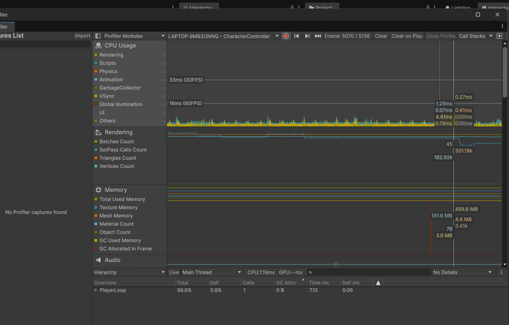

# IntentPipeline 開發規格文件（API / 資料結構）

> **狀態**：草稿 v0.23
> **最後更新**：2026-07-25
> **用途**：實作時的對照表，採「介面先行，實作隨後」原則。
> **架構不變量**：見 §7 架構回歸檢核清單（A1~A10 由 EditMode 測試自動守，M1~M6 為人工項）。

---

## 0. 命名與檔案結構規範

### 0.1 命名規範

* **介面**：`I` 前綴，例如 `IInputSource`
* **抽象基底類別**：`Base` 後綴，例如 `BaseState`
* **ScriptableObject 設定檔**：`SO` 後綴，例如 `StateMachineConfigSO`
* **私有欄位**：`_camelCase`
* **序列化私有欄位（`[SerializeField]`）**：**豁免底線規範，統一採用 `camelCase`（無底線）**。（2026-07-14 定調：全案既有序列化欄位自 v0.1 起一致如此；Unity 依欄位名稱序列化，事後改名會破壞 Inspector 既有綁定、被迫引入 `FormerlySerializedAs` 冗餘，故明文豁免而非遷移）
* **公開屬性 / 欄位**：`PascalCase`

### 0.2 資料夾結構

> ✅ **正式定調（2026-07-14）**：下方磁碟佈局為**最終正式結構**。本節最初（v0.5）規劃把所有專案內容收攏在 `Assets/_Project/` 底下，該規劃已**廢止**——為避免 GUID／`.meta` 搬移風險，不進行 Asset 遷移；`Assets/Scripts/`／`Assets/ScriptableObjects/` 直掛 `Assets/` 即為定案形，僅測試維持於 `Assets/_Project/Tests/`。（同步記載於 `CLAUDE.md` Project Structure 章節。）`Interrupt`／`Equipment`／`Pooling`／`Audio` 等目錄屬未來階段，建立時依本節骨架就地新增，不另起收攏層。

```
Assets/
  Scripts/
    Project.Runtime.asmdef   # Runtime 組件（引用 Animancer、InputSystem）
    Core/
      Blackboard/        # PlayerRuntimeData, IntentData, MovementIntentData, InputData (黑板資料層)
      Pipeline/          # IInputSource, PlayerInputSource, CharacterPipelineRunner (管線層)
      Movement/          # 🆕 ADR-003 意圖層（producer，context-free）：IMovementIntentSource,
                         # PlayerLocomotionPolicy, GaitProfileSO, LocomotionSpeedSmoother
        Models/          # 🆕 Movement Model（D3/D4）：IMovementModel, LocomotionModel
                         # ⚠️ 與上層紀律不同：Models 允許依賴 Presentation（自驅 Facade），
                         #    producer 則連 Presentation 都不得認識（見 §7 A4）
      StateMachine/      # BaseState, FullBodyStateMachine, StateMachineConfigSO,
                         # StateRule, StateType, StateParamsSO, JumpStateParams
        States/          # IdleState, MoveState, JumpState, RollState
      Arbitration/       # 🆕（輪 4）仲裁層：ArbiterData, IArbiterSource,
                         # ArbiterPipeline（順序 4.5，Arbitration 區的唯一寫入者）
        Sources/         # 🆕 IArbiterSource 實作：UiModeArbiterSource
                         #    （UI 模式；自持「按住 Left Alt」的 InputAction。
                         #     🔄 輪 4.2 起**不再持有 Cursor API**，改由 App/CursorModeController 統一擁有）
    App/                 # 🆕（輪 4.1）**應用層**：GamePauseController（Time.timeScale 的擁有者）、
                         # 🆕（輪 4.2）CursorModeController（**Cursor API 的唯一擁有者**，OR 合併所有
                         #    「想要自由游標」的來源）
                         # ⚠️ 與角色層的分界：本層放「跨角色／全域」的狀態，不掛在角色階層上、
                         #    不由 CharacterPipelineRunner 管理、不進黑板。非 Singleton（見 design-doc §4.9）
    Presentation/        # IPresentationController, PresentationPipeline（表現層驅動骨架，順序 6.5）
      Animation/         # AnimationFacadeBase, AnimancerFacade
      Motion/            # MotionDriver, MotionBakeData, JumpLaunchData
      Camera/            # ThirdPersonCamera
      Audio/             # AudioController（IPresentationController 首個實例）,
                         # AudioEventId, AudioDefinitionSO, AudioLibrarySO（Event→Definition→Library 三層）
      IK/                # FootIKController（Root，決策端）, FootIKRig（Model，Presentation Adapter）,
                         # FootIKTargetData / FootIKPoseData（兩條單向管道）, FootIKSettings
    Editor/
      Project.Editor.asmdef  # Editor 組件（引用 Project.Runtime）
      Pipeline/          # CharacterPipelineRunnerEditor（Inspector 除錯擴充）
      Stages/            # MotionBakeEditor（烘焙工具）, MotionFeatureAnalysis（特徵分析階段）
      Tools/             # CharacterCapsuleFitter（膠囊一鍵匹配）, MotionClipImportSOP（匯入設定 SOP 套用）
  ScriptableObjects/
    Motion/              # Bake_*.asset（MotionBakeData 烘焙資產）
    Movement/            # 🆕 GaitProfile.asset（GaitProfileSO：修飾鍵→強度映射）
    StateMachine/        # PlayerStateMachineConfig.asset, JumpStateParams.asset
    Animation/           # Transition_*.asset（TransitionAsset：狀態鍵 → 過渡資產）、MoveSpeed.asset（StringAsset 參數名）
  Scenes/
  Prefabs/
  _Project/
    Tests/
      EditMode/          # Project.Tests.EditMode.asmdef, EditMode 單元測試
  Plugins/

```

---

### 0.3 GameObject 階層規範（v0.9 新增，v0.12 定調；詳見 docs/01-design-doc.md §2.6 與 `docs/ADR/001-root-model-hierarchy.md`）

角色物件一律拆成 **Root（Adapter）** 與 **Model（子物件）** 兩層，禁止把 `Animator` 或其他會產生根動作的元件跟 `CharacterController` 掛在同一顆物件上。

```
CharacterRoot                          <- 邏輯/物理權威層，外部一律引用這一層
  ├─ CharacterController               <- 物理碰撞體與世界座標的唯一權威
  ├─ CharacterPipelineRunner
  ├─ MotionDriver
  ├─ AnimancerFacade (: AnimationFacadeBase)
  ├─ AnimancerComponent
  ├─ PlayerInputSource (: IInputSource)
  └─ Model                             <- 美術/骨骼層，禁止被遊戲邏輯直接引用
       ├─ Animator                     <- Humanoid Avatar；applyRootMotion 必須為 false
       ├─ SkinnedMeshRenderer
       └─ <骨骼階層>                    <- 供未來手部 IK / 武器對位掛點使用
```

**規則**：
1. `CharacterController.center` 的高度基準以 Root 為準，Model 只做視覺呈現，不參與碰撞計算。
2. `AnimancerFacade`（或任何 `AnimationFacadeBase` 子類）與 `AnimancerComponent` **同掛在 Root**：Facade 以 `GetComponent<AnimancerComponent>()`（同物件）取得動畫邏輯元件（禁止 `GetComponentInChildren`，會誤抓子物件）；`Animator` 位於 Model 子物件，以 `GetComponentInChildren<Animator>()` 排除 Root 自身後取得（**禁止 `transform.Find("Model")` 等名稱硬編碼**）。`AnimancerComponent.Animator` 序列化欄位須在 Prefab 指向 Model 的 `Animator`。
3. `Model` 底下的 `Animator.applyRootMotion` 必須為 `false`。除了 Inspector 手動關閉外，`AnimancerFacade.ValidateHierarchy()` 會在 `Awake()`（Runtime）與 `OnValidate()`（Editor）強制覆寫一次並記錄警告，避免未來換模型/美術誤勾選又忘記關閉。
4. `AnimancerFacade.ValidateHierarchy()` 另做 Fail-Fast 校驗（Runtime 拋例外／Editor 報錯）：Root 恰好 1 個 `AnimancerComponent` 且 0 個 `Animator`；Model 子物件恰好 1 個 `Animator`；`Animator` 須綁 Humanoid Avatar；`AnimancerComponent.Animator` 須指向該 Model `Animator`。詳見 ADR-001。
5. 任何遊戲邏輯（狀態機、Controller、Driver）一律只能持有 **Root** 的 `Transform` 引用；`ThirdPersonCamera.target` 等外部模組同理只能指向 Root。
6. **Capsule 對齊規範（v0.15 新增，v0.15.1 定稿）**：`CharacterController` 膠囊以 **Root 原點＝腳底** 為錨定——`center = (0, height/2 + skinWidth, 0)`。幾何依據：CharacterController（PhysX CCT）落地時膠囊表面與地面恆保持 `skinWidth`（contactOffset）的掃掠停距，若膠囊底直接對齊 Root 原點，角色會整體懸浮該距離（實測 skin 0/0.03/0.08 → 貼地/浮 3cm/浮 8cm，斜率 1）；上抬 `skinWidth` 後落地時 Root 原點（＝腳底）恰好貼地。**Model 子物件的 local transform 必須為 identity**，禁止用 Model 偏移遷就未校準的膠囊（v0.15 前 Prefab 曾以 `localPosition.y = -0.996` 補償預設膠囊，該做法廢止）。更換/新增 Humanoid 模型後，以 Editor 選單 `Tools/Project/角色 Capsule 自動對齊 (CapsuleFitter)` 一鍵匹配：Height＝rest pose 網格 bounds 高度、Radius＝基準 0.3 × `Animator.humanScale`（gameplay 統一半徑，不隨模型胖瘦跳動）、**SkinWidth＝radius×10%（v1.1 起由工具寫入，與 Center 原子綁定——禁止事後單獨手調 skinWidth，會造成 center 內嵌 skin 項與活欄位脫鉤、腳底偏移＝兩者差值）**、Model 歸零，含 Undo 與量測合理性警告。⚠️ 對場景實例執行後**務必 Apply 到 Prefab**（場景改動不會回寫 Prefab 依賴）。Editor-time 一次性執行，零 Runtime 成本；工具讀取 Model 屬離線配置（比照烘焙工具先例），不違反本節第 5 條的 Runtime 引用禁令。v2 待補（骨骼推估身高、髖寬下限、bounds 條件精化、stepOffset）見 `WORKLOG.md` Backlog。

---

### 0.4 Humanoid 動畫匯入規範（Root Transform 矩陣，v0.15.1 定調）

> 驗證歷程見 `docs/changelog.md` v0.15～v0.15.1。核心機制：本專案 `applyRootMotion` 恆為 false（ADR-001），**未 Bake Into Pose 的 root motion 成分會被引擎「抽出後丟棄」**——輕則水平滑步（hips 被錨定、雙腳反向滑動），重則垂直位移被抹平（跳躍前搖「雙腿向骨盆收攏」、翻滾「在髖部高度空中翻」）。原則：**執行期用不到的成分一律 Bake Into Pose；烘焙器要採樣的成分維持不 Bake。**

| Clip 類型 | 執行期驅動 | XZ Bake | Y Bake | Y Based Upon | Rot Bake | Loop Time | 現有 clip |
|---|---|---|---|---|---|---|---|
| **Locomotion-原地** | procedural（MotionDriver） | ✅ | ✅ | Original | ✅ | ✅ | Idle |
| **Locomotion-位移**（v0.16.1 新增） | procedural（MotionDriver）；烘焙採**速度真相** | **❌**（執行期抽出丟棄＝天然原地化） | ✅ | Original | ✅ | ✅ | Walking、Fast Run |
| **Jump 家族** | 物理 launch（ADR-002）；烘焙採 Y 特徵 | ✅ | ❌ | **Feet** | ✅ | ❌ | Jump |
| **烘焙曲線驅動** | SpeedCurve＋RotationCurve | ❌（採速度） | ✅ | Original | ❌（採 yaw） | ❌ | Stand To Roll |

（XZ／Rotation 的 Based Upon 一律 **Original**——所有 clip 共用 armature 原點參考系，杜絕切換瞬間的水平跳移。）
（**Locomotion-位移的 XZ ❌ 機制**：clip 保留真實 root motion，執行期 `applyRootMotion=false` 將其抽出後丟棄＝視覺原地播放；烘焙器（採樣時開 root motion）仍量得到天生步速，作為 `MotionDriver.moveSpeed` 校準與 Mixer 門檻換算的資料來源。若誤套全 Bake，位移被烤進姿勢：原地播放時角色在動畫內前衝、循環點瞬移回彈。⚠️ 原地型全 Bake 與位移型 Rot ✅ 屬文件目標值，v0.16.1 遷移後首次實測依「先驗證再定調」原則做最終確認。）

**規則**：
0. **AnimationClip 預設不可變（immutable by default），FBX 子 clip 為唯一預設真相來源（2026-07-17 定調，CLAUDE.md 同步收錄）**：所有引用端（`TransitionAsset`、`MotionBakeData.SourceClip`…）一律直接引用 FBX 內的子 clip；匯入設定變更經 SOP 工具落在 FBX 上、立即傳播到執行期，不存在快照過期問題。**禁止以 Ctrl+D 重萃取 `.anim` 作為一般流程**（歷史教訓：v0.15 preset 只落在 FBX、執行期 `.anim` 快照未同步而分岔，2026-07-17 盤點發現五支快照三支過期＋一次 GUID 更替斷引用）。一般調整（數值、Mixer、Transition、播放速度、`MotionDriver` 參數）一律在 Data／Presentation 層解決；僅當需要**修改動畫內容本身**（Animation Event、加曲線、改 keyframe、Import Setting 無法達成的特殊 Variant）才允許建立獨立 AnimationClip，且必須註明建立原因。
1. 新增動畫後，一律以 Project 視窗右鍵 `Project 動畫匯入 SOP` 套用對應 preset（工具經 `ModelImporter.defaultClipAnimations` 覆寫，take 名稱/影格範圍由 Unity 填入，`X Bot@動作名` 慣例使子 clip 自動獲得 @ 後的名稱；禁止手改 `.meta`）。該 clip 若有烘焙資產，套用後**必須重烘焙**。**套用粒度（🆕 per-clip）**：選 FBX 本體＝整檔套用（單 clip FBX 用）；**選個別 AnimationClip 子資產＝只套那幾支、不碰同 FBX 其他 clip**——一支 FBX 內含多類型 clip（如 Kubold Movement Animset Pro）時務必用子 clip 選取，避免單一 preset 誤灌整檔。
2. **Jump 家族的 Y Based Upon＝Feet 是關鍵設定**：Y 的 Based Upon 是「全程連續追蹤」（非 XZ/Rotation 的僅起始對齊）——貼地段（前搖/收勢）root Y 持平、下沉保留在姿勢（執行期腳踩得住）；滯空段腳升高才進 root Y（烘焙器量測 `AutoApexHeight` 用、執行期丟棄改由 `ApplyJumpLaunch` 物理接管，無二重上升）。若誤用 Original，前搖下沉會被歸入 root motion Y 而被抹平。`AutoApexHeight` 語意＝**腳底淨空高度**，與 `g=8h/t²`／`v=√(2gh)` 自洽（ADR-002 §2.3）。
3. Mixamo 下載慣例：同一角色（X Bot）下載保 retarget 一致；第一支 with skin、其餘 without skin；FBX for Unity、30fps；**一律不勾 In Place（2026-07-17 反轉舊規）**——root motion 是速度／特徵的資料真相，In Place 會在源頭銷毀它（實證：In Place 版 Walking 烘出 0.1 m/s 雜訊，非 In Place 版量得 1.677 m/s），執行期原地化改由 Locomotion-位移 preset（XZ ❌＋`applyRootMotion=false` 抽出丟棄）達成；命名沿用 `X Bot@<動作名>`。

---


### 1.1 PlayerRuntimeData（全域黑板）

```csharp
public class PlayerRuntimeData
{
    // === 意圖區（trigger 邊沿；每帧處理完即復位）===
    // 註：維持公開欄位而非 Property，避免 struct 值複製導致無法直接修改內部旗標
    public IntentData Intent;

    // === Movement 意圖區（🆕 ADR-003 D1，連續型 domain intent）===
    // 每帧由當下唯一 active 的 IMovementIntentSource 重算覆寫；**不**參與 ResetTransientState()。
    // domain-partitioned intents 的第一個 region（未來 CombatIntent／InteractionIntent 為兄弟 region）。
    public MovementIntentData MovementIntent;

    // === 仲裁區（由 ArbiterPipeline 每帧寫入，各表現層 Controller 唯讀）===
    // 註：同 Intent，維持公開欄位
    public ArbiterData Arbitration;

    // === Movement Output 區（🆕 Stage 2 語意重定義；持續存在，每帧更新；實碼採自動屬性）===
    // 以下三欄＝**當下 active Movement Model 於順序 3 發布的運動輸出**（不是 Runner 維護的 locomotion state）。
    // ⚠️（ADR-003 §13.4）非獨立真相：恆可由 MovementIntent ＋ 該 model 的 dynamics 重新導出，
    //    禁止任何路徑繞過 MovementIntent 直寫。B9 平滑與 0.1 ambient 門檻皆為 model 私有。
    public float MoveSpeed { get; set; }
    public Vector2 MoveDirection { get; set; }
    public float UpperBodyWeight { get; set; }
    public Transform CameraTransform { get; set; }

    // ✅（v0.7 規劃、v0.8 實作完成，v0.11 定調公開欄位）由 MotionDriver.GetGravityThisFrame(data)
    // 每帧統一寫入，供狀態邏輯讀取地面接觸狀態，取代 JumpState 內部原本固定計時器模擬落地判定的做法
    public bool IsGrounded;

    // ⏸（v0.10 定案 → ADR-002 §6-1 延後，尚未實作）取代 MotionDriver 內部私有欄位 _verticalVelocity，
    // 讓非 Jump 狀態（未來的擊退、彈跳台、翻越）也能直接改垂直速度。
    // ADR-002 已定調：等出現「第二個垂直速度消費者」（wall-slide／擊飛／電梯）再落地，
    // 屆時重新界定 Owner/Writer/Readers；目前垂直速度仍封裝於 MotionDriver（選項 A，跳躍經
    // ApplyJumpLaunch 注入）。寫入權限規劃比照 CurrentWeapon 用 internal set。
    public float VerticalVelocity { get; internal set; }

    // ✅（v0.10 定案 → 2026-07-14 定調延後 → M2 落地）單幀邊沿旗標，由 MotionDriver.GetGravityThisFrame(data)
    // 比較本幀與上一幀 IsGrounded 的差異計算得出，僅在觸發那一幀為 true。
    // 供音效／鏡頭震動／落地特效等表現層 Controller 直接訂閱，不必自己追蹤上一幀的 IsGrounded。
    // 延後紀律兌現：第一個下游消費者（M2 AudioController 落地音）出現，欄位隨之落地（YAGNI 閘門通過）。
    // 生命週期：順序 6（MotionDriver 觸發）→ 6.5（PresentationPipeline 消費）→ 7（ResetTransientState 復位）。
    public bool JustLanded;
    public bool JustLeftGround;

    // 🆕（M2）統一復位所有單幀瞬態（意圖旗標 + 落地/離地邊沿），由 Runner 於管線順序 7 呼叫。
    // 復位屬生命週期管理（同 IntentData.Reset() 性質），不視為第二寫入者（觸發源仍唯一）。
    // ⚠️（ADR-003）MovementIntent **刻意不在此列**——連續型 domain intent 由 producer 每帧整體覆寫，
    // 若在此清零，producer 缺席的帧會產生「意圖瞬間歸零」假訊號。此分界由 EditMode 測試守（§7 A6）。
    public void ResetTransientState();   // 實碼：Intent.Reset() + JustLanded/JustLeftGround = false

    // === 引用區 ===
    public ItemInstance CurrentWeapon { get; internal set; }
    public Transform AimTarget { get; set; }
}

```

#### 💡 黑板讀寫權限表

| 欄位 | 型別 | 誰寫入 | 誰讀取 | 備註 |
| --- | --- | --- | --- | --- |
| **Intent** | `IntentData` (struct) | InputPipeline | 狀態機 | 每帧結尾由 `ResetTransientState()` 統一復位（順序 7，🆕 M2 起與邊沿旗標一致生命週期） |
| **MovementIntent** | `MovementIntentData` (struct) | 🆕 該 domain 當下**唯一 active** 的 `IMovementIntentSource`（＝`PlayerLocomotionPolicy`，順序 2.5） | 當下 active 的 `IMovementModel`（順序 3，Stage 2 起＝`LocomotionModel`）；未來亦供 FSM 轉換判斷 | **模型無關契約**（`DesiredSpeedNormalized[0-1]` ＋ `DesiredDirection`）。連續型意圖：每帧整體覆寫、**不**參與順序 7 復位。換 AI／Replay／Network 驅動＝換掛另一個 `IMovementIntentSource` 元件，Runner 零改（ADR-003 D1／D2） |
| **MoveSpeed**／**MoveDirection**／**UpperBodyWeight**（＝**Movement Output**） | `float`／`Vector2`／`float` | 🆕（Stage 2）當下 active 的 `IMovementModel`（順序 3 `Tick`；Locomotion 時＝`LocomotionModel`） | `MotionDriver.ExecuteBaseMovement`（位移結算，含 `JumpState` 空中控制）；Editor 監視器 | 🆕 **語意（2026-07-25 裁決）**：這三欄不再是 Runner 維護的 locomotion state，而是**當下 active Movement Model 發布的 Movement Output**——換 model 就換這組值的產生者，欄位形狀不變。B9 平滑（`SmoothDamp`，加/減速不同時間常數＋減速保留方向）與 0.1 ambient 門檻皆已內化為 model 私有。⚠️ **ADR-003 §13.4**：輸出恆可由 `MovementIntent` ＋ model dynamics 重新導出，禁止繞過 intent 直寫。⚠️ 動畫參數已**不再**由此欄位經 Runner 轉送——model 於順序 3 自行 `SetFloat`（D4）。D4 的最終形態（欄位完全內化、不經黑板）目標不變，見 §7.3 |
| **CurrentWeapon** | `ItemInstance` | EquipmentDriver | 多處 | 唯讀引用，禁止外部修改內容 |
| **Arbitration** | `ArbiterData` (struct) | 🆕（輪 4）`ArbiterPipeline`（順序 4.5）——**全專案唯一執行期寫入者** | 順序 2 的輸入閘門（`BlockInput`）／各表現層 Controller（`BlockIK`／`BlockAudio`） | 每帧**從 `default` 重算後整體覆寫**（不以現值為起點，否則旗標只會愈疊愈多、永遠關不掉）。⚠️ 唯一寫入者是**管線**而非任何 `IArbiterSource`：來源只回傳自己的請求（值複製），合併與寫黑板由管線獨佔——**多來源進場時 §7-A5 白名單不會跟著變長**。合併政策目前為**純 OR**（見 §1.4） |
| **IsGrounded** | `bool` | MotionDriver（於 `GetGravityThisFrame(data)` 內部統一寫入，所有移動路徑最終都會呼叫此方法，來源 `CharacterController.isGrounded`） | 狀態機（如 `JumpState.IsLanded`） | ✅ v0.7 規劃、v0.8 實作完成；已取代 `JumpState` 內部原本的固定計時器落地判定 |
| **VerticalVelocity** | `float`（`internal set`） | MotionDriver、`Project.Core` 內的狀態類別 | 各表現層 Controller（唯讀） | ⏸ v0.10 定案 → **ADR-002 §6-1 延後**：等第二個垂直速度消費者（wall-slide／擊飛／電梯）再落地；目前垂直速度仍封裝於 `MotionDriver` |
| **JustLanded / JustLeftGround** | `bool` | MotionDriver（於 `GetGravityThisFrame(data)` 內比較前後兩幀 `IsGrounded`，**唯一觸發源**；順序 7 `ResetTransientState()` 的統一復位屬生命週期管理，不視為第二寫入者） | PresentationPipeline 驅動的表現層 Controller（✅ M2 首個消費者：`AudioController` 落地音；未來鏡頭震動／特效同窗口讀取） | ✅ v0.10 定案 → 2026-07-14 定調延後 → **M2 落地**（第一個下游消費者出現，YAGNI 閘門通過）；單幀生命週期：順序 6 生 → 6.5 消費 → 7 死 |

> ⚠️ **`ref struct` 相容性警語**：`InputData` 已升版為 `ref struct`（見 1.3 節），**絕對不能**成為 `PlayerRuntimeData` 的欄位。黑板只能持有處理後轉換的 `IntentData` 或一般參數。違反此邊界將導致編譯直接失敗。

### 1.2 IntentData（意圖輕量結構）

```csharp
public struct IntentData
{
    public bool JumpRequested;
    public bool RollRequested;
    public bool FireRequested;
    // 結構體 + 整體覆寫 = 復位時零 GC Alloc
}

```

### 1.3 InputData（原始輸入，Stack-Only）

```csharp
public ref struct InputData
{
    public Vector2 MoveInput;
    public Vector2 LookInput;
    public bool JumpButtonDown;   // 邊沿（WasPressedThisFrame）
    public bool RollButtonDown;
    public bool FireButtonDown;

    // 🆕（ADR-003 Stage 1）持續型中性 action（IsPressed），供 movement producer 解讀為 gait 強度。
    // ⚠️ 刻意**不**做成 [Flags] MovementModifier——那會把「這些輸入是為了 movement」的領域分類
    //    烤進 raw input 層，並寫死 modifier 數量與領域（ADR-003 §6.3 明確否決）。
    //    本層只回答「這顆 action 有沒有被按住」，不回答它代表什麼。
    public bool SprintButtonHeld;
    public bool WalkButtonHeld;

    // 🆕（v0.22）同一顆 action 的邊沿訊號，供「按一下切換型態」的控制方案使用。
    // 與 Held 並存而非取代：hold vs toggle 是 per-game 差異，由 GaitProfileSO 選擇（§3.1）；
    // raw input 層不預設哪一種，兩種訊號都如實提供。
    public bool WalkButtonDown;
}

```

> 🛑 **使用限制（執行盲區）**：
> * 只能存活在 Stack 上，**不能**被任何 `class` 持有為欄位。
> * 不能裝箱（Boxing）、不能用於 `async/await` 方法或 `yield return` 迭代器。
> * ~~**後續動作**：用 Unity Profiler 量測升版前後的 GC Alloc 差異~~ → ✅ **已於 2026-07-26 完成**（Development Build 實測穩態 `PlayerLoop` = 0 B）。量測程序見 §7.4，存證於 `docs/images/profiler/`。
> 
> 

### 1.4 ArbiterData（功能仲裁旗標）

```csharp
public struct ArbiterData
{
    public bool BlockInput;       // 輸入封鎖：Intent Processor 停止寫入意圖
    public bool BlockIK;          // IK 封鎖：IK Controller 跳過本帧更新
    public bool BlockAudio;       // 音頻封鎖：Audio Controller 靜音
    public bool BlockExpression;  // 表情封鎖：表情 Controller 跳過更新
}

```

#### 💡 仲裁觸發情境表

| 旗標 | 誰寫入 | 誰讀取 | 典型觸發情境 |
| --- | --- | --- | --- |
| **BlockInput** | ArbiterPipeline | PipelineRunner（順序 2 閘門） | 🆕 **UI 模式（Alt，✅ 輪 4 落地）**、死亡、被定身 CC、過場動畫 |
| **BlockIK** | ArbiterPipeline | IK Controller（`FootIKController`，已在讀） | 死亡、角色不可見、LOD 降級 |
| **BlockAudio** | ArbiterPipeline | Audio Controller（`AudioController`，已在讀） | 死亡、劇烈爆炸靜音、LOD 降級 |
| **BlockExpression** | ArbiterPipeline | 表情 Controller（尚無 reader，僅 Editor 監視器顯示） | 死亡、頭部被全罩式頭盔遮擋 |

#### 🆕 IArbiterSource／ArbiterPipeline（輪 4 落地，`Assets/Scripts/Core/Arbitration/`）

```csharp
public interface IArbiterSource
{
    /// 回傳「本來源自己」這一幀請求的封鎖旗標；合併由 ArbiterPipeline 負責。
    ArbiterData Evaluate(PlayerRuntimeData data);
}
```

| 面向 | 規格 |
| --- | --- |
| seam 形態 | **介面集合 ＋ 管線只認介面**，與 `IMovementIntentSource`（順序 2.5）／`IPresentationController`（順序 6.5）同款。新增封鎖來源＝實作介面掛上角色階層，`ArbiterPipeline` 與 `CharacterPipelineRunner` **零改動** |
| 為什麼**回傳值**而非 `ref ArbiterData` | 採 `ref` 時來源看得見（也就改得掉）別人已抬起的旗標，「不得清掉別人的封鎖」只能靠紀律去守。回傳自己的請求後這件事**結構上不可能**，且「多來源如何合併」有唯一的家——未來做優先級／強制解封只改 `ArbiterPipeline` 一個檔案，所有來源零改。回傳 4 bool 的 struct，熱路徑零配置 |
| 合併政策 | **純 OR，任一來源要求即封鎖**。⛔ **刻意不做**優先級／強制解封（某來源可否決他人的封鎖）——需要真實競爭情境（死亡 vs 過場誰贏？）才能裁決語意，見 §7.3 |
| 生命週期 | 管線每帧從 `default` 重算，**不累積**上一帧。封鎖是「本幀有沒有人在要求」，不是狀態 |
| 實作紀律 | ①**不得自帶 `Update`／`LateUpdate`**（比照 `IPresentationController`）——時序由管線保證；需要邊沿訊號就在 `Evaluate` 內採樣，那正好每幀一次。②**不得回寫黑板**。③可以讀狀態機當前狀態（§2.5 的資料流本就是「Arbiter 讀 state」），但反過來讓 `BaseState` 自帶 `BlocksInput` 是**被否決的方向**（design-doc §4.5） |
| 零 GC | 來源陣列於 `Runner.Start` 一次性 `GetComponentsInChildren` 收集；`Tick` 為純索引 for 迴圈。⚠️ **禁用介面型 `foreach`**（會裝箱 struct enumerator，見 §7.1-A3） |

**第一顆來源：`Sources/UiModeArbiterSource.cs`（UI 模式）**——**按住** Left Alt 放開滑鼠、角色停止移動，**放開即收回**。它是「UI 模式」概念的**唯一持有者**，獨佔兩樣東西：① UI 模式開關狀態　② Left Alt 的 `InputAction`。上游 `ArbiterPipeline` 只收到一顆 bool，**不認識 UI、不認識游標**。

> 🔄 **輪 4.2：`Cursor` API 已移出本元件**（原本是第三樣獨佔物）。暫停成為第二個滑鼠模式後，兩個各寫各的會產生**可重現的碰撞**——暫停中按住 Alt 進 UI 模式、再放開，`ApplyCursor(false)` 會把游標鎖回去，即使暫停還開著。游標的唯一擁有者改為 `Project.App.CursorModeController`（design-doc §4.9），本元件只透過 `IsUiModeActive` 回報**意圖**。**合併政策與 `ArbiterPipeline` 同源：來源各報各的，單一擁有者 OR 後套用一次。**

> 🔄 **輪 4.1 語意變更：toggle → hold，並與 Tap 暫停分流同一顆鍵。**
>
> | 操作 | 誰負責 | 效果 |
> | --- | --- | --- |
> | **按住** Left Alt（Hold interaction，門檻約 0.25s） | `UiModeArbiterSource`（角色層） | 游標解鎖、`BlockInput`、相機停轉；放開即全部復原 |
> | **Esc**（🔄 輪 4.2 改綁；原為短按 Left Alt） | `Project.App.GamePauseController`（**應用層**，design-doc §4.9） | `Time.timeScale = 0`；再按解除 |
>
> **分流方式＝Input System 原生 interaction，不是自刻計時器**（輪 4.1 裁決）：`Hold`／`Tap` 門檻在 Inspector 可調。理由同 `GaitProfileSO.walkIsToggle`——**操作語意是 per-game 差異，應該住在資產而不是程式碼**。
>
> 🔄 **輪 4.2：暫停改綁獨立的 Esc**，兩者不再共用 Left Alt。連帶影響兩點：①原本「**Tap 門檻必須 ≤ Hold 門檻**」的相依**已解除**，`PauseToggleAction` 也不再需要 `Tap` interaction（獨佔一顆鍵，一般 Button 綁定即可）；②**兩個滑鼠模式變成可以同時開著**（暫停中再按住 Alt），這正是游標必須有**單一擁有者**（而非各模式自己存○還原）的實證情境，見 changelog v0.26 §5。
>
> 🛑 **鍵位選擇的既有地雷：OS 保留組合鍵**（2026-07-27 實測）。`Alt`+`Esc` 是 **Windows 系統快捷鍵**（切換視窗），在 OS 層就被攔截，Unity 完全收不到——實測「按住 Alt 再按 Esc」會直接把使用者丟出遊戲視窗。同族還有 `Alt`+`Tab`／`Alt`+`F4`／`Alt`+`Space`。
> **這是鍵位與作業系統撞號，不是程式問題**，任何架構都擋不住；只能靠選鍵避開。
> **現況為已知限制**：「按住 Alt 時按 Esc」不可用；反向順序（先 Esc 暫停、再按住 Alt）完全正常，且測得到同一個不變量（見 §7.2-M8 ④）。
> ⚠️ **選 modifier 型持續按鍵時務必先查 OS 保留組合**——`Alt` 尤其危險，它在 Windows 上參與多組系統快捷鍵。
>
> ⚠️ **刻意接受的 UX 取捨（使用者裁決）**：因為「放開之前無法知道它是不是 tap」，要嘛 tap 會先閃一下 UI 模式，要嘛 hold 要等門檻。本專案選**後者**——Tap **不**先觸發 Hold，代價是按住後約 0.25s 游標才出現。日後調整的是**門檻數值**，不是新增更複雜的判定機制。
>
> ⚠️ 進出邊沿刻意不對稱：進場用 `WasPerformedThisFrame()`（Hold 撐過門檻才算），離場用 `!IsPressed()`（讀控制實際狀態、與 interaction 無關）。後者**會自癒**——視窗失焦等吃掉放開邊沿的情境不會讓 UI 模式永久卡住。

> **為什麼 Alt 不進 `InputData`**（輪 4 裁決）：`InputData` 是**可被 `BlockInput` 封鎖的角色輸入通道**，而「解除封鎖的那顆鍵」絕不能住在可被封鎖的通道裡——放進去就得為它開一條「這顆不受 `BlockInput` 影響」的例外，例外一開，「封鎖＝本幀管線看不到任何輸入」這個乾淨語意就沒了。Alt 屬**應用層／shell 輸入**（同 Esc 開選單），先例是 `ThirdPersonCamera` 同樣自持 `Mouse.current`。這也落地 ADR-003 §13.3「游標狀態切換偏 Input／UI 職責」。
>
> **UI 模式狀態為何留在元件私有欄位而非黑板**：它是應用層 shell 狀態，不是角色的 gameplay state（對比 `MovementIntent.WalkModeActive` 因 netcode snapshot 前提而必須進黑板，ADR-003 D5）。黑板上該有的是它的**結果**——`Arbitration.BlockInput`。

### 1.5 MovementIntentData（Movement 領域意圖，🆕 ADR-003 D1）

```csharp
public struct MovementIntentData
{
    public float DesiredSpeedNormalized;  // [0-1]，模型無關的移動強度
    public Vector2 DesiredDirection;      // 2D 平面輸入座標系（與 InputData.MoveInput 同語意）

    // 🆕（v0.22）Walk 型態是否啟用——**mode state，非單幀事件**。
    // 語意固定為「本帧型態開著沒有」，與它怎麼被觸發無關（hold 方案＝按住期間；toggle 方案＝被閂住的持久值）。
    public bool WalkModeActive;
}

```

**契約要點（落地自 `docs/ADR/003-movement-intent-layering.md`，此處記 API 形態）**

| 面向 | 規格 |
| --- | --- |
| 模型無關 | 只描述「往某方向、以某強度移動」。**不含 gait 語意**——Walk/Run/Sprint 是 Locomotion model 對 [0-1] 的命名門檻（`docs/04` §10），不屬本契約。因此 Strafe(2D)／Swim 等未來 model 可共用同一 seam |
| 生命週期 | **連續型**：每帧由 active producer 整體覆寫；**不**參與 `ResetTransientState()`（那是 `IntentData` 的 trigger 邊沿語意）。兩類 intent 的分界見 `docs/04` §14.2 |
| 單一寫入者 | 同一 domain 任一時刻只有一個 active producer 寫本 region |
| 🆕 mode state 的歸屬 | `WalkModeActive` 這類**持久型態**必須存在黑板，**不得**是 producer 的私有欄位（ADR-003 D5 明文「mode/toggle state 進黑板」＋§9-L5）。理由是 netcode 的 rewind／replay 前提＝所有狀態可 snapshot；藏在元件私有欄位的 mode 會讓回捲後型態與紀錄不一致。toggle 的推進方式因此是**讀黑板 → 邊沿翻轉 → 寫回黑板**（由 §7-A8 的測試守：同一顆 producer 換一塊新黑板，型態必須從乾淨狀態開始） |
| 🆕 mode vs trigger 的生命週期 | 兩者**都不**參與 `ResetTransientState()`，但理由不同：trigger（`IntentData`）是「當帧生當帧死」故由順序 7 清；連續型 intent 是「每帧整體覆寫」故不需清；**mode state 是持久的**，被每帧清零就永遠關不起來 |
| 校準責任 | [0-1] → 實際值的校準屬**各 model**（Locomotion 的 mixer 門檻＝`speed_i / speed_max`）。校準錯＝滑步（ADR-003 §9-L4） |
| 擴充紀律 | 控制範式不同的 model（Vehicle＝throttle/brake/steer、grid-based）**開兄弟 region**（如 `VehicleIntent`），**不擴脹本 schema**，否則本 schema 退化成 God-object（ADR-003 §13.1） |

> 📌 **子系統文件切分的預留（依 CLAUDE.md「Subsystem specs get their own file」規則）**：Movement 分層的 **Stage 1 內容屬跨領域契約**（黑板 schema §1、管線順序 §2、驅動介面 §3.1），因此留在本文件。當 Stage 2／3 落地（Locomotion model、`MovementContext`、多 model 並存）而規格量顯著成長時，再開 `docs/05-movement-model.md` 承載子系統細節，本文件僅保留跨領域契約。**現在不預先切分**（同「不預先設計」紀律）。

---

## 2. 核心管線與生命週期（Pipeline Layer）

### 2.1 Pipeline 處理順序規格表

| 順序 | 處理器 | 輸入 | 輸出 | 執行時機與關鍵備註 |
| --- | --- | --- | --- | --- |
| **1** | InputPipeline | 裝置原始輸入 | `InputData` | `ref struct` 採樣，隨後即銷毀。 |
| **2 閘門** 🆕 | BlockInput Gate | `RuntimeData.Arbitration` | 本帧 `InputData`（可能被歸零） | **輪 4 落地（§7-M5 結案）**：`BlockInput == true` 時 **`inputData = default`**——`BlockInput` 的語意定為「**本帧管線看不到任何輸入**」，順序 2 與 2.5 由此自動同時失效，不需要兩套規則。⚠️ Editor 除錯快照刻意取在閘門**之前**（永遠是原始輸入，封鎖期間仍看得到「按著 W 但被擋下」）。 |
| **2** | Intent Processor | `InputData` | `RuntimeData.Intent` | 每帧無條件執行（封鎖時輸入全 false ⇒ 不寫入任何意圖，與舊版「跳過」逐位元等價）。（trigger 邊沿：Jump／Roll／Fire） |
| **2.5** | 🆕 Movement Intent Producer | `InputData` ＋ `GaitProfileSO` | `RuntimeData.MovementIntent` | **ADR-003 D2**：Runner 只依賴 `IMovementIntentSource` 介面、不認識任何移動策略（Shift=Sprint 這類規則全在 policy＋profile 資產）。**唯一**寫入 `MovementIntent` 的環節。🆕 **輪 4 裁決（§7-M5 結案）**：本步**仍每帧無條件執行**，封鎖時吃到的是**被歸零的輸入** ⇒ `DesiredSpeedNormalized` 歸零 ⇒ B9 減速收步。⚠️ **不可**改為「跳過本步」——`MovementIntent` 是連續型意圖、不參與順序 7 復位，跳過 ≠ 歸零而是**凍結在最後一帧**（封鎖瞬間若正全速跑，角色會以全速無限前進且放不下來）。 |
| **3** | 🆕 **Movement Model Tick**（active `IMovementModel`） | `RuntimeData.MovementIntent` | `RuntimeData` 的 Movement Output（`MoveSpeed`／`MoveDirection`／`UpperBodyWeight`）＋**該 model 自己的動畫參數** | **ADR-003 D3／D4（Stage 2）**：Runner 只呼 `_movementModel?.Tick(...)`，**不認識** 平滑／MoveSpeed／gait（原 `DeriveMovementParameters` 已整段遷入 `LocomotionModel`）。⚠️ **每幀無條件執行、不看當前狀態**（理由見下方脆弱點 6）。model 在此自驅 `SetFloat(MoveSpeed)`（不再由順序 5 轉送）。 |
| **4** | 狀態機 Tick | `RuntimeData` | 狀態切換與邏輯驅動 | 讀取 Intent。讀完當幀即視為消耗完畢。 |
| **4.5** | ArbiterPipeline Tick | `RuntimeData`（含新狀態） | `RuntimeData.Arbitration` | ✅ **輪 4 落地**。緊跟狀態機之後評估最新旗標：詢問所有 `IArbiterSource` → OR 合併 → 整體覆寫仲裁區（**唯一寫入者**）。Runner 只呼叫管線、**不認識任何具體封鎖語意**（UI 模式／死亡／過場都是 source 的事），比照順序 6.5 的 `PresentationPipeline`。⚠️ 本步在順序 2 閘門**之後**，故 `BlockInput` 有**一帧延遲**——刻意的取捨，見下方脆弱點警告第 7 條。 |
| **5** | AnimationFacade 同步 | 當前狀態 | 動畫播放指令 | 狀態變更時提交播放請求（`Play(AnimationKey)`）。🆕（Stage 2）**參數同步已遷出**：每個 model 於順序 3 驅動自己的參數（Locomotion→`MoveSpeed`、未來 Swim→`StrokeRate`），共用同一支通用 Facade（D4）。此處只剩「狀態 → 動畫鍵」的通用映射。 |
| **6a** | MotionDriver 基礎運動 | `RuntimeData`（Movement Output）＋單幀快取重力積分 | `CharacterController.Move` | **必須在 LateUpdate**，由當前狀態的 `OnUpdateMotion` 選擇移動路徑。🆕（Stage 2，D3）**ambient 狀態**（Idle／Move）在此 **delegate 給 active model** 的 `UpdateMotion`；**intrinsic-motion 狀態**（Jump／Roll）維持既有 override 自帶位移。v0.9 起全程式碼驅動，**不再讀取 `OnAnimatorMove` 根運動增量**（見 §3.2 風險註記）。 |
| **6b** | MotionDriver 烘焙曲線/補償 | `MotionBakeData`（＋補償目標點） | `CharacterController.Move` | **與 6a 同幀 LateUpdate 執行**。現行 Roll 走 `ExecuteBakedCurveMovement`（純曲線）；`ApplyBakedCompensation`（動態吸附）屬 Warping 階段，尚無呼叫端。 |
| **6.5** | PresentationPipeline Tick | `RuntimeData`（含單幀事件 `JustLanded` 等） | 各表現層 Controller 的表現輸出（M2：落地音；未來 IK／特效） | 🆕（M2）**LateUpdate，MotionDriver 之後**——單幀事件由順序 6 觸發、順序 7 復位，此處是唯一保證可讀到的時間窗。Runner 只呼叫 `PresentationPipeline.Tick`，不認識具體 Controller（見 §3.4）。 |
| **7** | ResetTransientState() | — | `RuntimeData.Intent` ＋ `JustLanded`／`JustLeftGround` 清空 | **LateUpdate 末尾**執行，確保所有讀取方已消耗。🆕（M2）由 `IntentData.Reset()` 擴充為統一復位所有單幀瞬態。 |

> ⚠️ **生命週期脆弱點警告**：
> 1. `ResetTransientState()`（原 `IntentData.Reset()`，M2 擴充）必須死守在管線最後（順序 7），若不小心提前，當幀意圖與單幀事件會在讀取方消費前被清空。
> 2. `ArbiterPipeline Tick`（順序 4.5）必須卡在狀態機**之後**、動畫表現層**之前**，確保動畫能讀到當幀最新的封鎖狀態。
> 3. `FullBodyStateMachine.Initialize()` 必須由 `CharacterPipelineRunner.Start()` 呼叫（**禁止放在 Awake**），確保黑板資料已完全初始化。
> 4. 🆕（M2）`PresentationPipeline.Tick`（順序 6.5）必須卡在 MotionDriver（順序 6，單幀事件觸發源）**之後**、統一復位（順序 7）**之前**——6 → 6.5 → 7 的相對順序是單幀事件「當幀生、當幀死」契約的物理基礎，勿調換。
> 5. 🆕（ADR-003）順序 2.5 必須在順序 3 **之前**：model 的唯一輸入是本帧剛產出的 `MovementIntent`。若倒置，衍生值會落後意圖一帧，且「Movement Output 可由 intent 重新導出」的單一真相紀律（§13.4）失效。
> 6. 🆕（ADR-003 Stage 2）**順序 3 必須留在 Update、且每幀無條件執行**——這是 Stage 2 落地時實測出的兩個時序陷阱，未來若有人想「把 dynamics 併進 `OnUpdateMotion` 讓 model 只有一個進入點」，先讀這條：
>    - **不可只在 ambient 狀態推進**：`JumpState.OnUpdateMotion` 的空中控制吃的正是 Movement Output。若 Jump／Roll 期間平滑凍結，落地會拿起跳時的殘值續走＝滑步。
>    - **不可移到 LateUpdate**：Animator 的評估卡在 Update 與 LateUpdate 之間，`SetFloat` 落到 LateUpdate 會讓動畫參數比位移**晚一帧**（動畫／位移分岔）。
>    這也是為什麼順序 3 **沒有隨 Stage 2 消失**，而是換人執行（Runner 呼介面 → model 決定內容）。
> 7. 🆕（輪 4）**`BlockInput` 的一帧延遲是刻意的，不得為了消除它而把順序 4.5 提前。**
>    仲裁在順序 4.5（狀態機**之後**）評估，而輸入閘門在順序 2——因此某來源在第 N 帧要求封鎖時，
>    旗標於第 N 帧寫入，**第 N+1 帧的閘門才看得到**。約 16ms。
>    - **為什麼不提前**：4.5 卡在狀態機之後，是為了讓仲裁讀得到當幀**更新後**的 state
>      （design-doc §2.5 的資料流本就是「狀態機 → Arbiter 轉譯 → 黑板」）。提前到順序 2 之前，
>      仲裁就只能讀到**上一帧**的狀態——延遲並沒有消失，只是從「旗標晚一帧生效」變成
>      「旗標根據過期狀態計算」，後者更難除錯，且違反脆弱點第 2 條。
>    - **實務影響**：來源自身的即時反應（如 UI 模式的游標／相機）在當帧就完成，
>      只有「輸入封鎖」晚一帧。若未來出現無法容忍一帧的封鎖情境（例如需要 frame-perfect 的
>      無敵幀取消），正解是讓該情境走 **FSM 狀態**而非仲裁旗標，不是搬動 4.5。
> 
> 

### 2.2 管線處理器重構介面（規劃中）

> 💡 **重構訊號**：當 `ProcessIntents` 或 `ProcessParameters` 內的 `if-else` 分支超過 10~15 行時，立即啟動此重構。

```csharp
public interface IIntentProcessor
{
    void Process(ref InputData input, ref IntentData intent); // 必須使用 ref 傳遞
}

public interface IParameterProcessor
{
    void Process(ref InputData input, PlayerRuntimeData data);
}

```

---

## 3. 狀態機與動畫表現系統（Presentation Layer）

### 3.1 驅動介面與核心類別

#### IInputSource（輸入源）

```csharp
public interface IInputSource
{
    void FetchRawInput(ref InputData data); // v0.3 升版：採 ref 寫入，杜絕 GC
}

```

#### IMovementIntentSource（Movement 意圖 producer，🆕 ADR-003 D2）

```csharp
public interface IMovementIntentSource
{
    // 【管線順序 2.5】產生本帧 Movement 意圖，寫入黑板 MovementIntent region
    void ProduceIntent(ref InputData input, PlayerRuntimeData data);
}

```

**契約**
1. **每 domain 任一時刻只有一個 active producer** 寫該 intent region（single-writer 不破）。
2. **Producer context-free**：input → intensity 走固定 profile，**不每帧回讀 gameplay state**（避免 producer → state 同帧回圈）。此紀律由 §7-A4 的層級掃描自動守（`Core/Movement` 禁 import `Core.StateMachine`）。
3. **不處理 context-sensitive input**：「同一顆實體鍵在不同情境代表不同意義」的切換屬**更上游的 Input 層**（Input System action map／Input Router）；輸入抵達 producer 時語意已定（ADR-003 §13.3）。
4. **擴充＝加法**：`AIMovementSource`／`ReplaySource`／`NetworkSource` 各實作本介面，於 Inspector 換掛即切換 active producer，**Runner 零改**（DIP＋OCP）。

> ⚠️ **已知限制（Stage 1 實作取捨，非 ADR 契約）**：簽名帶 `InputData` 參數——因管線順序 1 已在 Runner 集中採樣一次，而 `ref struct` 不能被任何 class 持有為欄位、只能沿呼叫堆疊傳遞，故沿用單一採樣點傳址給 producer；非輸入驅動的 producer（AI／Replay）直接忽略此參數。**待第二個 producer 真正進場時**再複驗是否改為「各 producer 自持資料來源」的無參數簽名。

#### PlayerLocomotionPolicy／GaitProfileSO／LocomotionSpeedSmoother（🆕 ADR-003 Stage 1）

```csharp
// Movement 意圖 producer（MonoBehaviour，掛角色 Root）：讀中性輸入＋gait 配置 → 寫黑板意圖
public class PlayerLocomotionPolicy : MonoBehaviour, IMovementIntentSource
{
    [SerializeField] private GaitProfileSO gaitProfile;   // 留空＝直接採原始推桿量（＝Migration 前行為）
    public void ProduceIntent(ref InputData input, PlayerRuntimeData data);
}

// Locomotion 專屬的 gait 配置資產：修飾鍵 → 強度 [0-1] 的 per-game 映射
public class GaitProfileSO : ScriptableObject
{
    // 序列化：defaultIntensity / sprintIntensity / walkIntensity / respectAnalogMagnitude / walkIsToggle
    public bool WalkIsToggle { get; }   // 🆕 v0.22：Walk 是「按住生效」還是「按一下切換型態」
    public float ResolveIntensity(float inputMagnitude, bool sprintHeld, bool walkActive);  // 純函數
}

// B9 平滑的純運算單元（struct，無 MonoBehaviour 相依）：intent → 平滑速度＋有效方向
public struct LocomotionSpeedSmoother
{
    public const float Epsilon = 0.001f;
    public float Speed { get; }        // → 黑板 MoveSpeed
    public Vector2 Direction { get; }  // → 黑板 MoveDirection
    public void Tick(in MovementIntentData intent, float accelTime, float decelTime, float deltaTime);
}

```

| 類別 | 定位 | 紀律 |
| --- | --- | --- |
| `PlayerLocomotionPolicy` | 「移動控制方案」（per-game Movement Policy）的家。**唯一**寫 `MovementIntent` 的執行期元件 | 不得回讀 gameplay state／不得判斷「這顆 Shift 是否給移動用」（§13.3 屬 Input 層） |
| `GaitProfileSO` | **只管 on-foot gait**（範圍刻意收窄，ADR-003 §6.2 的教訓：泛用 movement profile 會 overfit 到 1D speed）。換玩法控制方案＝換這顆資產 | 三個強度值以 `intensity_i = speed_i / speed_max` 從 MotionBakeData 換算為**基準參考值**（CLAUDE.md B11 documented-formula 決策）；**程式碼預設一律 1＝無 gait 差異**，不硬編實測值。<br>🆕 **釐清（2026-07-25）——公式綁的是 threshold，不是 intensity**：Mixer 門檻**必須**等於 `speed_i / speed_max`（那是不可協商的校準，決定動畫速度與位移速度的對應）；但 gait intensity 是**自由的手感參數**，因為對任意 `p`，混合後的動畫速度恆為 `p × speed_max`（推導見 changelog v0.22 §3），與位移速度**恆等**。所以偏離基準值（如把 Run 從 0.574 調到 0.75）＝**刻意選一個混合姿態**，不是校準錯誤、不會滑步；代價只有「姿態不再是純 Run，而是 Run/Sprint 的混合」。Walk 型態與 Sprint 同時成立時 **Walk 優先**（固定規則，非可調欄位）。🆕 `walkIsToggle`：hold／toggle 屬 **per-game 控制方案差異**，故住在資產而非 policy 程式碼——否則「換玩法＝換一顆資產」的承諾即破。目前只有 Walk 有實體按鍵（Sprint 規劃為 buff 驅動），故用 bool 而非 per-modifier enum，**不預造** |
| `LocomotionSpeedSmoother` | B9 平滑的純運算單元。🆕（Stage 2 已遷移）持有者自 `CharacterPipelineRunner` 換為 `LocomotionModel`，**計算邏輯一字未改** | 輸入**只有** `MovementIntentData`；`deltaTime` 由呼叫端傳入（不隱式取 `Time.deltaTime`）以維持純運算與可測性；所有狀態顯式在 struct 內、無隱藏靜態態（ADR-003 §9-L5 snapshot-able 前提）。**執行期持有者恆為一個**（由 §7 A10 守）——多於一個＝平滑被切分，Idle↔Move 切換會重置收步 |

#### IMovementModel／LocomotionModel（Movement Model，🆕 ADR-003 D3／D4 Stage 2）

```csharp
// Movement Model 的通用抽象（Runner 與狀態機都只認識這支介面）
public interface IMovementModel
{
    bool IsProducingMotion { get; }                                                   // FSM 的 ambient 門檻信號
    void Tick(PlayerRuntimeData data, AnimationFacadeBase facade, float deltaTime);    // 【順序 3，Update】
    void UpdateMotion(MotionDriver motionDriver, PlayerRuntimeData data);             // 【順序 6，LateUpdate】
}

// 第一個實作：雙足地面移動（MonoBehaviour，掛角色 Root）
public class LocomotionModel : MonoBehaviour, IMovementModel
{
    public const float MoveThreshold = 0.1f;               // ambient 門檻（原硬編在 Idle/MoveState.CanEnter）
    // 序列化：moveSpeedAccelTime = 0.12f / moveSpeedDecelTime = 0.18f（自 Runner 原值搬入）
    // 私有：LocomotionSpeedSmoother _smoother —— 本模型**唯一**的跨帧狀態
}

```

| 項目 | 規格 | 紀律 |
| --- | --- | --- |
| **兩個進入點** | `Tick`＝順序 3（Update，**每帧無條件**）；`UpdateMotion`＝順序 6（LateUpdate，由 ambient state delegate） | 不得合併為一個——理由見 §2.1 脆弱點 6（Jump 空中控制凍結／動畫參數晚一帧） |
| **實例唯一性** | Runner 解析單一實例 → 注入 `FullBodyStateMachine.Initialize` → 狀態機發給所有 state | 平滑狀態是值型別，多持有者＝多份平滑。由 §7 A10 守 |
| **門檻信號** | `IsProducingMotion`（Locomotion＝平滑速度 ≥ `MoveThreshold`） | 「速度多少算在動」屬 model 內部知識；FSM 只問語意布林，不讀數值也不讀 raw intent（後者會讓放開輸入瞬間切 Idle 但角色仍在滑行） |
| **自驅動畫參數** | model 在 `Tick` 內 `facade.SetFloat(ParamMoveSpeed, …)` | D4：每個 model 驅動自己的參數，共用同一支通用 Facade；**Facade 不加 `IAnimationModel`** |
| **不持有跨帧引用** | Facade／MotionDriver 皆逐帧由呼叫端傳入 | 使 model 的全部跨帧狀態僅為 `_smoother`（§9-L5 snapshot-able 前提） |
| **依賴邊界** | 放在 `Core/Movement/Models/`：**允許** 依賴 `Project.Presentation`（D4 要求驅動 Facade／MotionDriver）；**禁止** 依賴 `Core.StateMachine`／`Core.Pipeline` | 與同層的 intent producer 紀律不同（producer 連 Presentation 都不得碰），故 §7 A4 對 `Core/Movement` 根目錄**不遞迴**、`Models/` 另立一條規則 |

#### BaseState（狀態基底）

```csharp
public abstract class BaseState
{
    public abstract StateType Type { get; }
    protected StateMachineConfigSO Config;

    // 🆕（ADR-003 Stage 2）當下 active 的 Movement Model。全狀態共用**同一實例**：
    // 由 FullBodyStateMachine 於註冊時統一發放（見下節），沒有 state 自建的路徑——
    // 這條注入鏈就是「跨帧平滑狀態全域唯一」的結構性保證。
    protected IMovementModel MovementModel { get; private set; }

    // 動畫鍵：預設以 enum 名稱對應 AnimancerFacade 的 TransitionMapping.StateKey，子類別可覆寫
    public virtual string AnimationKey => Type.ToString();

    // 🆕（Stage 2）簽名加入 model；Jump／Roll 的 override 需一併傳遞（單相位注入，無兩段式初始化）
    public virtual void Initialize(StateMachineConfigSO config, IMovementModel movementModel);

    public abstract bool CanEnter(PlayerRuntimeData data);
    public abstract void OnEnter(PlayerRuntimeData data);
    public abstract void OnTick(PlayerRuntimeData data, float deltaTime);
    public abstract void OnExit(PlayerRuntimeData data);

    // 【管線順序 6】由當前狀態決定本影格 LateUpdate 的物理位移結算路徑。三種歸屬（D3）：
    //   ambient（Idle／Move）    → override 成 delegate 給 MovementModel.UpdateMotion
    //   intrinsic-motion（Jump／Roll）→ override 成自帶位移（烘焙曲線／衝量注入）
    //   下方預設實作            → 兩者皆非時的保底，也是 model 未注入時的降級路徑
    public virtual void OnUpdateMotion(MotionDriver motionDriver, AnimationFacadeBase animationFacade, PlayerRuntimeData data)
    {
        motionDriver.ExecuteBaseMovement(data);
    }

    // 預設由 SO 配置驅動打斷規則；子類別可 override 處理特殊情況（如無敵幀不可打斷）
    public virtual bool CanBeInterruptedBy(BaseState other)
    {
        return Config != null && Config.CheckCanInterrupt(this.Type, other.Type);
    }

    // 控制是否允許自然過渡。有鎖定期的狀態（Jump、Roll）應在動作結束前 override 為 false
    public virtual bool CanTransitionAway => true;
}

```

#### FullBodyStateMachine（狀態機主體）

```csharp
public class FullBodyStateMachine
{
    private readonly Dictionary<StateType, BaseState> _stateRegistry = new();
    private BaseState _currentState;
    private StateMachineConfigSO _config;

    public BaseState CurrentState => _currentState;

    public void Initialize(StateMachineConfigSO config, PlayerRuntimeData data) { ... }

    public void Tick(PlayerRuntimeData data, float deltaTime)
    {
        // 1. 執行當前狀態 OnTick
        // 2. EvaluateInterrupts (意圖打斷，由優先級排序評估)
        // 3. EvaluateTransitions (自然過渡，需 CanTransitionAway == true)
    }
}

```

#### AnimationFacadeBase（動畫門面抽象）

```csharp
public abstract class AnimationFacadeBase : MonoBehaviour
{
    // 動畫圖參數鍵：管線順序 5 每幀把黑板 MoveSpeed 送入動畫圖，
    // 訂閱者由 Transition 資產內的 ParameterName（StringAsset，名稱須一致）自行綁定
    public const string ParamMoveSpeed = "MoveSpeed";

    // v0.16（F1）：Play / PlayWithCallback 拔除 transitionDuration——
    // 過渡時長/速度/起始時間由 Transition 資產承載（單一真相），程式碼不再覆寫（2026-07-17 裁決 Q1）
    public abstract void Play(string stateKey);
    public abstract void PlayWithCallback(string stateKey, System.Action onComplete);
    public abstract void SetLayerWeight(int layerIndex, float weight, float transitionDuration = 0.1f);
    public abstract void SetFloat(string key, float value);   // v0.16（F2）由空殼轉正：寫入動畫圖參數字典
    public abstract void SetBool(string key, bool value);
    public abstract bool IsPlaying(string stateKey);          // 語意：多鍵可映射同一資產（Idle/Move → Locomotion），結果一致
    public abstract float GetNormalizedTime();
}

```

---

### 3.2 狀態機與動畫具體實作（第三階段）

#### StateMachineConfigSO（設定檔資產）

```csharp
[Serializable]
public struct StateRule
{
    public StateType State;
    [Tooltip("哪些狀態可以主動打斷當前狀態（意圖觸發時檢查）")]
    public List<StateType> CanBeInterruptedBy;
    [Tooltip("當前狀態結束或無意圖時，允許自然過渡到的狀態優先級")]
    public List<StateType> ValidTransitions;
    public int Priority; // 用於 EvaluateInterrupts 當幀多意圖同時觸發時的排序
}

[CreateAssetMenu(fileName = "StateMachineConfig", menuName = "Project/Core/StateMachineConfig")]
public class StateMachineConfigSO : ScriptableObject
{
    [SerializeField] private List<StateRule> rules;
    private Dictionary<StateType, List<StateType>> _interruptMap;
    private Dictionary<StateType, List<StateType>> _transitionMap;

    public void Initialize() { /* List → Dictionary 建立 O(1) 執行期查表 */ }
    public bool CheckCanInterrupt(StateType current, StateType next) { ... }
    public IReadOnlyList<StateType> GetValidTransitions(StateType state) { ... }
}

```

> ⚠️ **v0.10 更新**：實際程式碼在 v0.7/v0.8 曾把 `JumpImpulseForce`／`JumpTakeoffDelay` 直接加進 `StateRule`（上面這份介面草稿沒有反映這兩個欄位，兩者是分開演進的）。經盤點確認這違反單一職責原則，且會在多遊戲模式擴充時讓 `StateRule` 線性膨脹。**目標設計**改為下面的 `StateParamsSO` 方案，`StateRule` 維持只有拓撲欄位（`State`／`Priority`／`CanBeInterruptedBy`／`ValidTransitions`），不再新增任何狀態專屬的物理/表現參數。詳見 `docs/01-design-doc.md` §2.7、§5 Trade-off 表 v0.10 決策列。

#### StateParamsSO（狀態專屬參數資產，v0.10 新增設計，尚未實作）

> ⚠️ **v0.11／v0.13 更新**：本小節為 v0.10 設計草案，保留作歷史脈絡。`StateParamsSO` 機制已於 v0.11 實作；其中 `JumpStateParams` 的內容已由 **ADR-002** 重新定義（拔除下方範例的 `ImpulseForce`／`TakeoffDelay`，改為 `Stages` ＋ Designer Tuning 倍率）。**現行跳躍規格以下方「JumpStateParams／JumpLaunchData／MotionDriver 跳躍注入 API」小節與 `docs/ADR/002-data-driven-jump.md` 為準。**

**動機**：`StateRule` 的職責是 FSM 拓撲（誰能打斷誰、能過渡到誰、優先級），跟具體狀態要用什麼物理參數表現自己（Jump 的衝量、Roll 的翻滾距離、未來 Slide 的摩擦係數）是兩個完全不同的關注點。混在同一個結構體會導致：
1. Inspector 上不相關的狀態也會看到不屬於自己的欄位（例如設定 Idle 時也看得到 `Jump Impulse Force`）。
2. 每個 `StateRule` 元素都攜帶所有狀態的參數欄位，執行期有用不到的記憶體浪費。
3. 隨著 ARPG／射擊等模式陸續加入 SlideState、ClimbState、AimState，`StateRule` 會線性膨脹成沒人敢動的巨石結構——這正是專案要支援多遊戲模式的目標下，最需要提前避免的坑。

**介面設計**：

```csharp
/// <summary>
/// 狀態專屬參數資產的抽象基底。只是型別標記，不放任何共用欄位——
/// 共用欄位屬於 StateRule 的職責，不該在這裡重複。
/// </summary>
public abstract class StateParamsSO : ScriptableObject
{
}

// 範例：Jump 專屬參數，取代原本塞進 StateRule 的 JumpImpulseForce / JumpTakeoffDelay
[CreateAssetMenu(fileName = "JumpStateParams", menuName = "Project/Core/StateParams/Jump")]
public class JumpStateParams : StateParamsSO
{
    [Tooltip("起跳發射初速度 (m/s)。0 或未設定時，狀態端會 fallback 到程式碼內建預設值")]
    public float ImpulseForce;

    [Tooltip("衝量注入前的延遲秒數，用於等待動畫預備/蹲下姿勢播完。0 = 不延遲")]
    public float TakeoffDelay;
}

// 未來範例（尚未實作，僅供設計參考）：
// public class SlideStateParams : StateParamsSO { public float SlideDistance; public AnimationCurve FrictionCurve; }
// public class ClimbStateParams : StateParamsSO { public float ClimbSpeed; public float StaminaCostPerSecond; }
```

`StateMachineConfigSO` 擴充：

```csharp
[Serializable]
public struct StateParamsMapping
{
    public StateType State;
    [Tooltip("該狀態使用的專屬參數資產，型別需繼承 StateParamsSO；若該狀態不需要調參則留空")]
    public StateParamsSO Params;
}

// StateMachineConfigSO 內新增：
[SerializeField] private List<StateParamsMapping> paramsMappings = new();
private readonly Dictionary<StateType, StateParamsSO> _paramsMap = new();

// Initialize() 內新增對應的建表邏輯（比照 _bakeMap 的模式）

/// <summary>
/// 泛型查表，呼叫端指定期望型別；查無資料或型別不符時回傳 null，呼叫端自行 fallback。
/// </summary>
public TParams GetStateParams<TParams>(StateType state) where TParams : StateParamsSO
{
    return _paramsMap.TryGetValue(state, out var so) ? so as TParams : null;
}
```

呼叫端範例（`JumpState.Initialize`）：

```csharp
public override void Initialize(StateMachineConfigSO config)
{
    base.Initialize(config);

    var p = config?.GetStateParams<JumpStateParams>(Type);
    if (p != null)
    {
        if (p.ImpulseForce > 0f) _jumpImpulseForce = p.ImpulseForce;
        _takeoffDelay = Mathf.Max(0f, p.TakeoffDelay);
    }
}
```

**已知限制**：`GetStateParams<T>` 用 `as` 轉型，型別掛錯（例如 Jump 狀態誤掛了 `RollStateParams`）只會靜默回傳 `null`，不會報錯——目前先靠呼叫端的 fallback 預設值兜底，避免整個管線因為一個掛錯的資產而崩潰；長期可以考慮加一個 Editor 驗證工具，在 `StateMachineConfigSO` 存檔時檢查每筆 `StateParamsMapping` 掛的資產型別是否符合預期。

#### JumpStateParams／JumpLaunchData／MotionDriver 跳躍注入 API（ADR-002 落地，取代上方 v0.10 草案）

> [歷史決策脈絡詳見 `docs/ADR/002-data-driven-jump.md`]

```csharp
// 單一跳躍段：每段引用一份 MotionBakeData（提供 AutoTakeoffDelay / AutoApexHeight / AutoCalculatedGravity）
[System.Serializable]
public struct JumpStage
{
    public MotionBakeData Bake;
}

// 跳躍參數資產：內容（Stages）＋ 設計師微調倍率（預設 1）。
// 不含 Coyote / Jump Buffer / Variable Jump（屬 ADR-002 §6 Deferred，未定案）。
[CreateAssetMenu(fileName = "JumpStateParams", menuName = "Project/Core/StateParams/JumpStateParams")]
public class JumpStateParams : StateParamsSO
{
    public List<JumpStage> Stages;          // 第 0 段 = 地面跳；可跳段數上限 = Stages.Count
    public float HeightMultiplier;          // 乘在 AutoApexHeight
    public float GravityMultiplier;         // 乘在 AutoCalculatedGravity
    public float LaunchVelocityMultiplier;  // 乘在逆推出的 v
}

// 跳躍發射資料契約（readonly struct，傳值零 GC）：由 JumpState 逆推、傳給 MotionDriver
public readonly struct JumpLaunchData
{
    public readonly float InitialVerticalVelocity; // 起跳初速（向上為正）
    public readonly float Gravity;                 // 該次採用的重力大小（正值）
    public JumpLaunchData(float initialVerticalVelocity, float gravity);
}
```

**MotionDriver 注入 API**：`ApplyJumpImpulse(float)` 已由 `public void ApplyJumpLaunch(in JumpLaunchData launch)` 取代。`MotionDriver` 新增 `_activeGravity`：注入時覆寫為該段重力、落地（`IsGrounded`）時於 `GetGravityThisFrame` 內部回復預設；`_verticalVelocity` / `_activeGravity` 的唯一寫入者仍為 `MotionDriver`。

**逆推時機**：`JumpState.Initialize()` 逐段以 `v = √(2gh)`（g = `AutoCalculatedGravity` × `GravityMultiplier`、h = `AutoApexHeight` × `HeightMultiplier`，再乘 `LaunchVelocityMultiplier`）預算並快取 `JumpLaunchData`；`OnUpdateMotion` 於當前段 `AutoTakeoffDelay` 過後點火注入。查無 `Stages` 或該段無可信烘焙資料時安全退化為程式碼內建預設值。

#### 動畫呈現三小節 → 已分卷至 `docs/06-animation-presentation.md`（2026-07-25）

> 📦 **本節內容已遷出，原標題與編號在新檔中原樣保留**（遷檔零斷鏈）：
> * `AnimancerFacade`（Animancer v8 Pro 封裝，v0.16 Transition 資產機制）
> * `Locomotion 1D Mixer 規格`（F2，v0.16；門檻推導 v0.16.2）
> * `動畫數據 → 配置資料流`（v0.16.2）
>
> **全文見 [`docs/06-animation-presentation.md`](06-animation-presentation.md)。**
> 既有交叉引用（例如「dev-spec §3.2『動畫數據 → 配置資料流』」）請改讀該檔的同名小節。
>
> **為什麼是這三節被搬走、其餘留下**：留在本節的 `StateMachineConfigSO`／`StateParamsSO`（FSM 配置契約，與 §3.3 State Matrix 同族）與 `JumpStateParams／JumpLaunchData／MotionDriver`（管線順序 6 的驅動契約，§2.1 直接引用）屬**跨領域契約**；被搬走的三節是**動畫呈現子系統的內部規格**，只有做動畫表現時才需要。分卷依據見 CLAUDE.md「Subsystem specs get their own file」與「Context Discipline」。

#### MotionDriver（根運動與補償驅動）

> 🛑 **已知風險（2026-07-08 除錯發現）**：下方 `OnAnimatorMove` 路徑正確運作，同時依賴以下外部設定全部對齊，任一項偏離都會表現為「動畫原地不動」或「動作結束瞬移」：
> 1. `Animator`／`CharacterController`／`MotionDriver` 須在**同一個 GameObject**（`OnAnimatorMove` 不會跨物件傳遞）。
> 2. `Animator.applyRootMotion` 必須勾選。
> 3. `Animator.Animate Physics` 必須**不**勾選（勾選會讓回呼落在 FixedUpdate 節奏，與本類別以 `Time.deltaTime` 做每渲染幀積分的假設衝突）。
> 4. 動畫匯入設定的 `Root Transform Position (XZ) → Bake Into Pose` 必須**不**勾選（勾選會讓水平位移被烤進骨架姿勢，讀不到 `deltaPosition`）。
> 5. 任何繞過 `ExecuteBaseMovement` 的位移路徑（如 `ExecuteBakedCurveMovement`）都必須自行歸零 `_rootMotionDelta`，否則會累積殘留量並在切回 `ExecuteBaseMovement` 時一次性噴出。
>
> 中期正評估改為完全不依賴執行期 `OnAnimatorMove`、統一以「輸入速度 + 烘焙曲線速度」驅動的替代架構，降低上述耦合，尚未定案，見 `docs/01-design-doc.md` §5 Trade-off 表。
>
> ⚠️ **文件落後於實作提醒（v0.9 複查）**：下方 code block 是本節最初的規劃版偽代碼，實際上專案已經在 v0.5～v0.8 期間走完「完全不依賴 `OnAnimatorMove`」這條路線，目前 `MotionDriver.cs` 是純程式碼驅動（`ExecuteBaseMovement` / `ExecuteBakedCurveMovement` / `ApplyBakedCompensation` 都改吃 `PlayerRuntimeData data` 參數、`IsGrounded` 也統一在 `GetGravityThisFrame(data)` 內寫回黑板）。下方 code block 僅供理解「最初評估過的替代方案長相」，**不代表目前實作**，避免直接照抄。

```csharp
public class MotionDriver : MonoBehaviour
{
    [SerializeField] private AnimancerFacade _animancerFacade;
    [SerializeField] private CharacterController _characterController;
    private Vector3 _rootMotionDelta = Vector3.zero;

    private void OnAnimatorMove()
    {
        if (_animancerFacade != null) _rootMotionDelta += _animancerFacade.GetDeltaPosition();
    }

    public void ExecuteBaseMovement() // 【管線順序 6a】
    {
        if (_rootMotionDelta != Vector3.zero)
        {
            _characterController.Move(_rootMotionDelta);
            _rootMotionDelta = Vector3.zero;
        }
    }

    public void ExecuteBakedCurveMovement(MotionBakeData bakeData, float normalizedTime)
    {
        if (bakeData == null) return;
        float currentTime = normalizedTime * bakeData.Duration;
        float previousTime = Mathf.Max(0f, currentTime - Time.deltaTime);

        Vector3 moveDelta = transform.forward * bakeData.GetSpeedAt(currentTime) * Time.deltaTime;
        float deltaYaw = bakeData.GetRotationAt(currentTime) - bakeData.GetRotationAt(previousTime);
        
        transform.Rotate(Vector3.up, deltaYaw);
        _characterController.Move(moveDelta);
    }

    public void ApplyBakedCompensation(MotionBakeData bakeData, Vector3 actualTarget, float normalizedTime) // 【管線順序 6b】
    {
        if (bakeData == null) return;
        float currentTime = normalizedTime * bakeData.Duration;
        float remainingTime = bakeData.Duration - currentTime;

        if (remainingTime <= 0.001f) { ExecuteBakedCurveMovement(bakeData, normalizedTime); return; }

        // 1. 轉向補償 (Slerp Alignment)
        Vector3 toTarget = actualTarget - transform.position; toTarget.y = 0f;
        if (toTarget.sqrMagnitude > 0.01f)
        {
            Quaternion targetRotation = Quaternion.LookRotation(toTarget.normalized);
            transform.rotation = Quaternion.Slerp(transform.rotation, targetRotation, Time.deltaTime / remainingTime);
        }

        // 2. 位移扭曲補償 (Warping 計算法則)
        float curveSpeed = bakeData.GetSpeedAt(currentTime);
        Vector3 baseMoveDelta = transform.forward * curveSpeed * Time.deltaTime;

        Vector3 distanceToGo = actualTarget - transform.position; distanceToGo.y = 0f;
        Vector3 requiredVelocity = distanceToGo / remainingTime;
        Vector3 compensationVelocity = requiredVelocity - (transform.forward * curveSpeed);

        _characterController.Move(baseMoveDelta + (compensationVelocity * Time.deltaTime));
    }
}

```

---

### 3.3 狀態邏輯規則表（State Matrix）

| 狀態 | 所屬層 | CanTransitionAway 條件 | 可被誰意圖打斷 | 自然過渡目標（依優先級） | 核心邏輯備註 |
| --- | --- | --- | --- | --- | --- |
| **Idle** | FullBody | 永遠 `true` | Move, Jump, Roll | Move | 無意圖且速度時回歸。 |
| **Move** | FullBody | 永遠 `true` | Jump, Roll | Idle | MoveSpeed < 0.1f 時自動自然過渡回 Idle。 |
| **Jump** | FullBody | `IsLanded == true` | 空中狀態不可被打斷 | Idle, Move | 落地瞬間依黑板 MoveSpeed 決定自然過渡目標。 |
| **Roll** | FullBody | `IsRollFinished == true` | 翻滾中強制不可打斷 | Idle, Move | 動畫全程享有不可打斷的「無敵幀」語意。 |

---

### 3.4 表現層管線與 Audio 子系統（🆕 M2）

> 定位：表現層的**統一驅動骨架**＋第一個具體 Controller（Audio）。Runner 只認 `PresentationPipeline`，
> 新增表現模組（IK／Facial／VFX）只需實作 `IPresentationController` 掛上角色階層，Runner 零改動。
> 架構歸類：非架構變更（依 CLAUDE.md Document Consolidation Policy 走 Living Doc，不開 ADR）；
> 設計理念與升級預留見 `docs/01-design-doc.md` §4.6。

#### 3.4.1 驅動骨架（`Assets/Scripts/Presentation/`）

```csharp
// 表現層 Controller 統一契約：讀黑板 → 驅動表現。實作者對 PlayerRuntimeData 只讀不寫。
public interface IPresentationController
{
    void Tick(PlayerRuntimeData data);
}

// 集中驅動：Runner Start() 以 GetComponentsInChildren<IPresentationController>() 一次性收集，
// LateUpdate 順序 6.5 統一 Tick。陣列建構時一次配置，執行期純 for 迴圈零 GC。
public class PresentationPipeline
{
    public PresentationPipeline(IPresentationController[] controllers);
    public void Tick(PlayerRuntimeData data);
}
```

**規則**：
* Controller **不得自帶 `Update`／`LateUpdate`**——時序由管線統一保證（順序 6.5），否則單幀事件的讀取窗口不可控。
* Controller 對黑板**只讀不寫**（含 `Arbitration` 旗標）。
* Controller 彼此**不得互相引用**；需要協調時走黑板（或未來的表現仲裁）。
* 本骨架只做「依序驅動」，不做輸出仲裁；多 Controller 競爭同一輸出時升級 ArbiterPipeline 式仲裁＋補 ADR。
* Controller 執行順序＝`GetComponentsInChildren` 的階層順序；Start 之後動態加掛的 Controller 不會被收集（現無此需求，出現時再議）。

#### 3.4.2 Audio 子系統（`Assets/Scripts/Presentation/Audio/`）

資料流：黑板單幀事件（`JustLanded`）→ `AudioController.Tick` → `AudioLibrarySO.Get(AudioEventId)` → `AudioDefinitionSO` → `AudioSource.PlayOneShot`

| 類別 | 型別 | 職責 | 關鍵 API／規則 |
| --- | --- | --- | --- |
| `AudioEventId` | enum | 事件語義鍵（Event → Definition 解耦）：玩法端只認「落地了」，播什麼由資產決定 | `Landing = 0`。**顯式數值＝查表索引，只增不改不重排**；腳步音等 Foot IK 週邊（腳相事件源）再擴充 |
| `AudioDefinitionSO` | ScriptableObject | 「**怎麼播**」：clip 池＋音量＋音高範圍（隨機微變化抗重複疲勞） | `GetRandomClip()`（池空回 null）／`GetRandomPitch()`／`Volume`；`CreateAssetMenu: Project/Audio/AudioDefinition` |
| `AudioLibrarySO` | ScriptableObject | 事件 → 定義的唯一查表窗口；Inspector 清單維護，執行期攤平 | `Initialize()`（由 Controller Awake 呼叫，攤平成 enum 值索引陣列：O(1)、零 boxing、冪等）／`Get(id)`（未註冊回 null＝靜默跳過，允許逐步填表）；`CreateAssetMenu: Project/Audio/AudioLibrary` |
| `AudioController` | MonoBehaviour, `IPresentationController` | 「**何時播**」：讀 `JustLanded`＋`BlockAudio`，查表播放 | 由管線順序 6.5 驅動，無自身 Update；`[RequireComponent(AudioSource)]`，掛角色 Root 階層（Runner `GetComponentsInChildren` 收得到即可）；缺引用 Awake 報錯（防禦線風格同 Runner／MotionDriver） |

* **M2 裁決：單一 `AudioSource`＋`PlayOneShot`**。已知侷限：pitch 是 Source 層屬性，連續觸發時後一發會改到仍在播的前一發；多音軌／Source 池屬 §5 Future Work，等第一個真實劣化案例再上。
* `BlockAudio` 讀取**契約先行**：M2 落地時 writer 尚不存在、旗標恆 `false`。🆕 **輪 4 起 writer 已存在**（`ArbiterPipeline`，順序 4.5），但目前沒有任何 `IArbiterSource` 要求 `BlockAudio`——旗標仍恆 `false`，直到死亡等來源進場。**契約先行的代價已於此兌現：Controller 本身零改動。**
* Unity 接線（Phase 5 人工作業）：`AudioController`＋`AudioSource` 掛 Root；`library` 指向 `AudioLibrary` 資產；Library entries 填 `Landing → 落地 AudioDefinition`；Definition 填至少一個落地 `AudioClip`。

### 3.5 Foot IK 子系統 → 已分卷至 `docs/05-foot-ik.md`（2026-07-25）

> 📦 **本節全文已遷出（§3.5 / 3.5.1 ~ 3.5.4），章節編號在新檔中原樣保留**（遷檔零斷鏈）——既有引用如「dev-spec §3.5.2 已知限制 L1~L6」「§3.5.4 極端案例收束」在該檔以同一編號直接定位。
>
> **全文見 [`docs/05-foot-ik.md`](05-foot-ik.md)。**
>
> **一句話現況**：第二個 `IPresentationController` 實例；`FootIKController`（Root，決策）⇄ 兩條各自單寫單讀的管道（`FootIKTargetData`／`FootIKPoseData`）⇄ `FootIKRig`（Model，Presentation Adapter）。**v1 已於 2026-07-21 凍結**，剩餘 6 條已知限制（L1~L6）各有不改架構的升級路徑，品質升級由 `docs/03-animation-roadmap.md` 承載。
> **設計哲學**（不可違背）：Natural Pose > Terrain Adaptation > Perfect Foot Contact，全文見 `docs/01-design-doc.md` §4.6。
>
> **為什麼優先拆這一節**：v1 已凍結＝內容不再變動，是分卷風險最低的候選（不會出現「拆完又大改」的來回搬運成本）。

---

## 4. 編輯器工具鏈：動畫烘焙與特徵提取（Editor Tooling）

> 🛠️ **本章節為離線工具組規格**：用於生成運行時 `MotionDriver` 所需的資料資產（`MotionBakeData` / `WarpedMotionData`）。
> 🛠️ **離線內容建置系統藍圖**：本工具鏈最終將演進為標準的 `Animation Build Pipeline`，包含：
> Source Discovery ──> Validation ──> Feature Extraction ──> Feature Post Process ──> Asset Generation ──> Dependency Update ──> Report
> 
> **現階段（第三階段）落地策略**：暫不寫通用框架類別，但在 `RootMotionExtractor.cs` 與 `WarpedMotionExtractor.cs` 內部，必須將程式碼嚴格依此順序切分為私有方法（Private Methods），確保未來能零代價重構拆分。

### 4.1 常規運動特徵提取（`RootMotionExtractor.cs`）

解決 Unity 導出四元數突變、動畫超限抖動、滑步判定問題。

1. **環境動態構造**：實例化臨時角色 Model，注入 Humanoid Avatar，設 `applyRootMotion = true`。掛載 `HideFlags.HideAndDontSave` 防止場景殘留殘渣。
2. **多階段特徵採樣與建置管線**：

* **【Extraction 階段】時間軸原始數據採樣**
    * **Pass 1 (原始幾何與骨骼採樣)**：呼叫 `AnimationClip.SampleAnimation` 逐影格步進，撈取最純粹的引擎底層軌跡。
        * *連續偏航角（Yaw）原始採樣*：利用 $\Delta R = R_{current} \cdot R_{last}^{-1}$ 提取旋轉增量，投影至 XZ 水平面（`forward.y = 0`），透過 `Vector3.SignedAngle` 換算並直接累加至原始數據陣列。
        * *骨骼特徵腳相採樣*：動態抓取 Humanoid 的 `LeftFoot` 與 `RightFoot` 骨骼，透過 `InverseTransformPoint` 將世界坐標轉回相對本地坐標，比對高度 $Y$ 值，低者判定為當前「落地腳（`FootPhase`）」。
    * **Pass 2 (原始速度採樣)**：依據目標 `PlaybackSpeed` 縮放時間軸，二次步進採樣計算 XZ 瞬時的原始物理速度。

* **【Post Process 階段】特徵數據二次加工與濾波**
    * *逆向容忍度掃描（數據裁剪）*：為防止動畫末尾的過沖抖動干擾打斷點，工具在此階段由數據尾端**逆向（由後往前）**掃描。當兩幀間角度差首度超越臨界閾值 `_rotationAngleToleranceDeg` 時，其下一幀（`i+1`）即標定為 `RotationFinishedTime`，用以裁剪無效的過沖抖動。
    * *速度與旋轉平滑濾波（數據優化）*：針對 Extraction 階段採樣出的原始速度與偏航角曲線，進行低通濾波（Low-pass Filter）或噪點過濾，從根本上杜絕因動畫超限抖動產生的滑步判定與視覺微抖動。

3. **反射硬碟落地**：利用 C# 反射遞迴遍歷 `PlayerSO` 等序列化入口，自動尋找匹配的資料欄位覆寫。調用 `EditorUtility.SetDirty` 與 `AssetDatabase.ForceReserializeAssets` 強制執行硬碟硬性序列化。

> ✅ **已解決（v0.7 文件盤點更新）**：v0.5.1 曾記錄 `MotionBakeEditor.cs` 對空 `GameObject`（無 `Animator`／`Avatar`）直接呼叫 `AnimationClip.SampleAnimation` 的技術債。經 2026-07-08 複查，目前程式碼**已依本節第 1 點實作**：`ExecuteBakePipeline()` 會 `Instantiate(characterPrefab)`、檢查 `animator.avatar != null && animator.avatar.isHuman`（不合法則中斷並跳錯誤對話框）、設定 `animator.applyRootMotion = true` 後才呼叫 `BakeCoreProcessor` 採樣。**先前「所有既有 MotionBakeData 資產視為不可信」的警語已不再適用於此問題**；若手上仍有 v0.5.1 之前烘焙出來的舊資產，建議重新烘焙一次以確保是用目前這版真人形 Avatar 流程產生的。
>
> 🛑 **殘留落差（尚未實作）**：目前的 `BakeCoreProcessor` 仍只做「單一迴圈同時採樣速度與偏航角」的簡化版本，尚未落實本節後段要求的：
> 1. Pass 1／Pass 2 分離（原始幾何骨骼採樣與速度採樣分兩階段）
> 2. 骨骼腳相採樣（`LeftFoot`／`RightFoot` 落地腳判定 `FootPhase`）
> 3. Post Process 階段的逆向容忍度裁剪（`RotationFinishedTime`）與低通濾波
>
> 這三項列入 §5 待補清單，屬於功能完整度落差，不影響目前已修復的「取樣來源正確性」問題。

### 4.2 高階動態扭曲特徵提取（`WarpedMotionExtractor.cs`）

針對 3D 空間立體位移（如翻牆、側滑）進行**物理模擬與特徵分段技術**。

1. **真實物理增量採樣（重大技術差異）**：
不使用強刷姿勢的 `SampleAnimation`（該方法不觸發 Root Motion 物理結算）。
* *作法*：構造 `AnimatorOverrideController` 將 Clip 掛載至運行狀態機，在迴圈中實時呼叫 `animator.Update(deltaTime)`，**強迫 Unity 引擎執行實質物理步進**。精確擷取 `animator.deltaPosition` 與 `animator.deltaRotation`。確保烘焙資料與運行期 `CharacterController` 的物理表現 $100\%$ 一致。


2. **三軸本地速度解耦 (3D Local Velocity)**：將擷取到的世界位移增量 `worldDelta` 透過 `transform.InverseTransformVector(worldDelta)` 逆矩陣轉換為當下影格的局部向量，除以 $\Delta t$ 換算為速度，拆分儲存為 $X$（左右）、$Y$（上下）、$Z$（前後）三條獨立的 `AnimationCurve`。
3. **自動化物理臨界點探測 (Automated Warp Points)**：實時記錄局部位移絕對軌跡陣列 `absolutePositions[]`。
* 若設定為 `Vault`（翻越）：自動遍歷尋找 `absolutePositions[i].y` 最大（最高點）的一幀，自動標記為 **"Apex"** 特徵點。
* 若設定為 `Dodge`（閃避）：自動遍歷尋找水平二維向量（$X, Z$）模長最大（移位最遠）的一幀，自動標記為 **"MaxDodge"** 特徵點。


4. **局部分段相對積分 (Segmented Relative Offsets)**：
在烘焙結尾執行相對化計算：

$$\text{BakedLocalOffset} = \text{CurrentAbsPos} - \text{LastAbsPos}$$


將特徵點坐標換算為「相對於上一個特徵點的相對位移」。將整個動作切成數個獨立的物理線段（例如：起跳 $\rightarrow$ 最高點 $\rightarrow$ 落地）。運行時 Motion Warping 系統便能獨立對齊、縮放其中某一段，而不會破壞其他分段的完美表現。

### 4.3 特徵分析階段（`MotionFeatureAnalysis.cs`：跳躍物理特徵自動提取）

> 位置：Bake Pipeline 中 Root Motion 曲線提取「之後」、資產存檔「之前」（`MotionBakeEditor.SaveAsset` 內呼叫 `MotionFeatureAnalysisStage.Run`），完全不干涉既有曲線／旋轉收斂／腳相邏輯。
> 契約：`IMotionFeatureAnalyzer` 讀取 `MotionFeatureContext`（整段動畫的逐影格採樣緩衝）並將結果寫入 `MotionBakeData`；實作必須自帶安全退化，不可拋例外中斷管線。新增特徵（Stride Length、Trajectory…）＝實作介面並註冊到 `MotionFeatureAnalysisStage`，無需改動採樣迴圈或既有分析器。
> 已註冊分析器：`JumpFeatureAnalyzer`（本節演算法）＋`FootPhaseCurveAnalyzer`（🆕 輪 2 依此契約新增＝連續腳相曲線，複用雙腳世界 Y 採樣、零額外採樣；詳見 `docs/04-locomotion-foundation.md` §9.2）。

#### 世界空間相對足跡演算法（World-Relative Footprint，v0.14 落地）

**基線（Rest Pose Baseline）**：烘焙器在實例化採樣替身後、第一次 `SampleAnimation` **之前**，快取雙腳骨骼的世界 Y（`MotionFeatureContext.LeftFootBaselineY` / `RightFootBaselineY`）。基線屬於 rig 本身（踝骨自然離地高度），與 clip 內容完全解耦，天然免疫「根節點蹲伏下沉被反相混疊成腳抬起」的舊誤判（v0.14 前的舊演算法以「腳踝相對根節點本地 Y > 絕對門檻」判離地，零點隨匯入設定漂移且被根節點自身位移污染，導致前搖誤判與滯空高估）。

**逐影格分類**：`腳騰空 ≡ 腳世界 Y > 自身基線 + FootLiftThreshold`（容忍度，Inspector 可調，預設 0.03m 以吸收蹬伸期踝骨抬升雜訊）；`騰空 ≡ 雙腳同時騰空`。

**Pass 1 — 事件偵測狀態機**：
1. 起跳候選：`前一幀觸地 → 本幀起連續 ≥2 幀騰空`（單幀騰空視為採樣雜訊）。
2. 持續騰空驗證：候選起的騰空段必須延續 `≥ MinAirTime`（0.1s），否則整段丟棄、續掃下一個候選——過濾跑步循環的雙腳騰空相與小碎跳。
3. 騰空段行進中，「單幀觸地、下一幀又騰空」視為擦地雜訊忽略；連續 ≥2 幀觸地（或片尾觸地幀）即為真實接觸，該接觸 run 的第一幀＝落地影格。
4. 第一段通過驗證的飛行即為本 clip 的跳躍（多段小跳只取第一弧）。

**Pass 2 — 精算閉環**：
1. 子影格線性插值：在跨越門檻線的相鄰兩採樣間解出精確交點——起跳取雙腳交點的 **max**（後離地的腳）、落地取 **min**（先觸地的腳）。
2. 最高點：只在 `[起跳, 落地]` 窗內掃描根節點世界 Y 最大值；基準為插值後起跳時刻的根節點高度（拋體弧線真正起點）。頂點本身不需插值（頂點速度趨近 0，30fps 量化誤差約 1.4mm）。
3. `AutoAirTime = 落地時刻 − 起跳時刻`；`AutoCalculatedGravity = 8·h / t_air²`（與執行期 `v = √(2gh)` 對稱自洽，見 ADR-002 §2.3）。

**安全退化矩陣**：

| 情境 | AutoTakeoffDelay | AutoApexHeight | AutoAirTime | AutoCalculatedGravity |
|---|---|---|---|---|
| 偵測不到起跳（Idle／Walk／Run／非跳躍） | 0 | 0 | 0 | 標準值 9.81 |
| 有起跳、無落地（jump-loop／跳上高台的不對稱拋物線） | 量測值 | 量測值（窗至片尾） | 0（明示未量測） | 標準值 9.81 |
| 落地找到但 t_air ≤ MinAirTime 或 h ≤ MinApexHeight（如 Bake Into Pose Y 採不到上升量） | 量測值 | 量測值 | 量測值 | 標準值 9.81 |
| 完整閉環 | 量測值 | 量測值 | 量測值 | 8h/t² |

**已知限制**：(1) 蹬伸期腳跟先離地會讓踝骨提早上升，深蹲推蹬類動畫的起跳時刻可能提早約 1 影格（容忍度 0.03m 已吸收大部分；未來可選配腳趾骨骼精化）。(2) 跳上高台類不對稱拋物線不符 `g = 8h/t²` 的對稱假設，一律誠實退化（廣義解 `g = 2(√h_up + √h_down)²/t²` 需另偵測落地面高度，暫不落地）。(3) 演算法全程為絕對值逐幀比較，無積分項、無累積誤差；量測精度受採樣率限制的部分已由子影格插值消除主要量化誤差。(4) 即使 `Root Transform Position (Y) → Bake Into Pose` 被誤勾，腳的世界 Y 仍隨姿勢升降，起跳／落地時刻照樣可量測，僅最高點（root 基準）退化、重力安全退回標準值。

#### 代表速度（AutoAverageSpeed，v0.16.2）——曲線聚合類特徵

特徵分兩類，資料依賴不同：**採樣提取類**（跳躍前搖／最高點／滯空）需原始逐影格採樣（foot/root 世界 Y），走 `JumpFeatureAnalyzer`（吃 `MotionFeatureContext.Samples`）；**曲線聚合類**（代表速度）是對「已提取的 `SpeedCurve`」再做的統計量，天然屬 `MotionBakeData` 自身，故由 `MotionBakeEditor.SaveAsset` 在寫入 `SpeedCurve` 後直接呼叫 `MotionBakeData.ComputeAverageSpeed` 填入 `AutoAverageSpeed`，不繞經 analyzer（analyzer 契約吃 `Samples`，而 `Samples` 不含水平位移／速度）。定義：`SpeedCurve` 關鍵影格值算術平均（等距採樣＝時間平均）。消費見 §3.2「動畫數據 → 配置資料流」。未來若新增同屬「曲線聚合類」的特徵（如 Stride Length 由位移曲線積分），沿用此處分工即可。

#### 動畫長度（BakedDuration，🆕 2026-07-26）——切斷執行期對 AnimationClip 的最後一條依賴

**問題**：`MotionBakeData.Duration` 原本實作為 `SourceClip != null ? SourceClip.length : 0f`——這是全專案**唯一**一條「執行期 gameplay 邏輯讀 `AnimationClip`」的耦合。動畫資產缺席或 GUID 變動（fresh clone、重匯入、換動畫來源）時 `Duration` 會**靜默歸零**，而 `RollState` 的退化條件只檢查「Bake 資產是否為 null」、檢查不到「clip 是否為 null」，於是翻滾第一帧就結束——這是「Roll 秒退」在 clip 層的變體（asset 層那次於 v0.16.x 已修）。

**做法**：烘焙時把 `sourceClip.length` 快照進序列化欄位 `BakedDuration`（`MotionBakeEditor.SaveAsset`），`Duration` 改為 `=> BakedDuration`。與 `AutoAverageSpeed` 同一個 pattern。

| 面向 | 規格 |
| --- | --- |
| `SourceClip` 的新定位 | **Editor-side provenance／烘焙來源**，執行期**不得**讀取。目前全 Runtime 對它的程式碼讀取數為 **0**（只剩欄位宣告與註解） |
| 快照語意 | clip 長度日後變動需**重跑烘焙**才同步。與其他 `Auto*` 特徵一致，也是「Clip＝表現資源、Bake Data＝運動數據真相」（§0.4 規則 0）的直接體現 |
| 舊資產遷移 | 新欄位反序列化為 **0**。**刻意不做「回退讀 clip」**——那會讓遷移缺口永遠隱形。改由消費端接住：`RollState` 的退化條件從「引用是否為 null」改為「**值是否 > 0**」，並在 `#if UNITY_EDITOR` 補「請重跑烘焙」警告 |
| 誠實揭露（未解） | 欄位保留序列化引用 → clip 仍會被打包進 build、並隨資產一起載入。要連「載入」都斷開需改為 Editor-only 序列化（sidecar），屬**另一個決定**，本輪不做 |

---

## 5. 待補充規格清單（Project Management）

### 第二階段進度（已完成）

* [x] `StateMachineConfigSO` 加入 `Priority` 欄位，`EvaluateInterrupts` 改為手動迴圈比大小，確保零 GC 確定性仲裁。
* [x] Animancer Lite v8 評估結論補入 `docs/01-design-doc.md` Trade-off 表。

### 第三階段（目前衝刺中）

* [x] **（v0.16.2 完成）** 動畫數據 → 配置資料流：`MotionBakeData` 新增 `AutoAverageSpeed`（代表速度，烘焙時寫入）＋ `GetRepresentativeSpeed()`（欄位優先、舊資產即時回退）；`MotionDriver` 新增 `moveSpeedSource`＋`overrideMoveSpeed`（Bake 提供滿速預設、可 override、來源可追蹤）；Mixer 門檻改由 `threshold=speed_i/speed_max` 推導。規格見 §3.2「動畫數據 → 配置資料流」，均在 `Presentation.Motion` 層內、不動 Data/Presentation 邊界。⚠️ 生效需在 Prefab 上把 `moveSpeedSource` 指向 `Bake_Fast Run`（不指則維持手填值，向後相容）。
* [x] `AnimancerFacade` 實作：建立 `stateKey` $\rightarrow$ `AnimationClip` 的映射配置資產機制。**✅ v0.16 落地並升級**：直接落在 `stateKey` → `TransitionAssetBase`（F1 Transition 資產機制，過渡參數由資產承載），見 §3.2；映射表本體維持序列化於 Facade 元件上——抽成 `AnimationSetSO` 屬 YAGNI 延後（等第二個角色／模式的動畫集共享需求，遷移路徑見 `docs/01-design-doc.md` §5 Trade-off 表 v0.16 列）。
* [ ] `PlayWithCallback` 的回調分配器（ObjectPool）實作，消除 Lambda 的 GC Alloc 隱患。
* [ ] `MotionDriver` 基礎版實作：驗證 LateUpdate 根運動物理同步。
* [ ] 動畫烘焙 Editor 工具實作（`RootMotionExtractor`）：以跳躍落地動畫進行首波驗證。
* [ ] `MotionDriver` 進階版：接入 `MotionBakeData`，驗證目標點補償誤差 $< 0.01\text{m}$。
* [ ] 上半身 Layer 實作（持槍/空手切換），確認 Lite 限制下的 Editor 表現行為。
* [x] **（v0.6，複查後確認已完成）** 依 4.1 節規格重寫 `MotionBakeEditor.cs`：改為實例化真實 Humanoid Prefab + 檢查 `avatar.isHuman` + `applyRootMotion = true` 後再採樣。**2026-07-08 複查確認此項已在程式碼中落地**，詳見上方 §4.1 已解決說明；仍缺 Pass 1/2 分離與腳相/濾波後處理，已拆成下方新項目追蹤。
* [x] **（新增，v0.6）** 補齊 `JumpState` 的垂直位移設計：明確定義起跳上升段是「純動畫根運動」還是「程式碼注入初速度（`ApplyJumpImpulse`）」，避免與 Roll 的水平曲線移動模式混用導致重力失效。**已實作**：`JumpState.OnUpdateMotion` 第一幀呼叫 `MotionDriver.ApplyJumpImpulse`，採用「程式碼注入初速度＋重力每幀積分」路線。
* [ ] **（新增，v0.6）** 評估是否將 `MotionDriver` 重構為不依賴執行期 `OnAnimatorMove` 的統一速度模型（輸入速度 + 烘焙曲線速度，單一 `CharacterController.Move()` 出口，重力每幀快取一次），降低目前對 Animator 設定/匯入設定/GameObject 階層的多重外部依賴。
* [ ] **（新增，v0.7，Code Review 發現）** `RootMotionExtractor` 補齊 Pass 1/Pass 2 分離、`LeftFoot`／`RightFoot` 骨骼腳相採樣（`FootPhase`）、Post Process 階段的逆向容忍度裁剪與低通濾波，目前 `MotionBakeEditor.cs` 只做到單一迴圈的速度＋偏航角採樣。
* [x] **（v0.7 提出，v0.7 當輪實作完成）** `PlayerRuntimeData` 補上 `IsGrounded` 欄位；`JumpState.IsLanded` 改讀黑板旗標，取代固定計時器判定。**v0.8 再優化**：同步時機從「`CharacterPipelineRunner.LateUpdate` 額外呼叫 `SyncGroundedState`」收斂進「`MotionDriver.GetGravityThisFrame(data)` 內部統一寫入」，見下方 v0.8 項目。
* [x] **（v0.7 提出，v0.7 當輪實作完成）** `JumpState.jumpImpulseForce` 改為從 `StateMachineConfigSO.GetJumpImpulseForce(Type)` 查表取得，不再依賴失效的 `[SerializeField]`。
* [x] **（v0.7 提出，v0.7 當輪實作完成）** `MotionDriver.Awake()` 補上 `characterController` 缺失時的 `Debug.LogError` 防呆。
* [x] **（v0.7 提出，v0.7 當輪實作完成）** `RollState.OnUpdateMotion` 加入 `animationFacade.IsPlaying(AnimationKey)` 檢查，失敗時退回 `ExecuteBaseMovement`。
* [x] **（v0.7 提出，v0.7 當輪實作完成）** `CharacterPipelineRunner.ProcessIntents` 的富文本 `Debug.Log` 包進 `#if UNITY_EDITOR`。
* [x] **（v0.7 提出，v0.7 當輪實作完成）** `AnimancerFacade.SetLayerWeight` 補上 `layerIndex < 0` 邊界檢查；`clipMappings` 補 `= new()` 保底。
* [x] **（新增，v0.8，實測發現）** Jump「先蹲下再往上」問題：新增可設定的 `StateRule.JumpTakeoffDelay`，`JumpState` 延遲期間維持一般貼地移動，時間到才呼叫 `ApplyJumpImpulse`，讓物理起飛時機與動畫預備蹲下姿勢的時間軸對齊。**已實作，並於 v0.10 經手動調整數值、實機測試確認表現正常**（延遲秒數需依實際動畫預備動作長度手動填入，非自動偵測）。
* [x] **（新增，v0.8）** `IsGrounded` 黑板同步收斂進 `MotionDriver.GetGravityThisFrame(data)` 內部，`ExecuteBakedCurveMovement`／`ApplyBakedCompensation` 簽名同步補上 `PlayerRuntimeData data` 參數，移除額外的 `SyncGroundedState` 呼叫點。**已實作**。
* [ ] **（v0.9 提出，v0.10 已定案，⏸ ADR-002 §6-1 延後）** `VerticalVelocity` 從 `MotionDriver` 私有欄位移入 `PlayerRuntimeData` 黑板（`internal set`）。ADR-002 已定調實作時機：**等出現第二個垂直速度消費者**（wall-slide／擊飛／電梯）再做，屆時重新界定 Owner/Writer/Readers；在那之前垂直速度維持 `MotionDriver` 封裝（跳躍經 `ApplyJumpLaunch` 注入，選項 A）。介面設計見 §1.1。
* [x] **（v0.9 提出，v0.10 定案，2026-07-14 定調延後，✅ M2 落地）** 新增 `JustLanded`／`JustLeftGround` 單幀邊沿旗標供音效/鏡頭震動等表現層 Controller 訂閱。延後紀律兌現：第一個下游消費者（M2 `AudioController` 落地音）出現，欄位隨之落地——MotionDriver 唯一觸發源、順序 7 `ResetTransientState()` 統一復位，規格見 §1.1／§2.1／§3.4。
* [ ] **（新增，v0.9）** 角色 GameObject 階層遷移為 Root（Adapter）＋ Model 子物件兩層結構（詳見 §0.3、`docs/01-design-doc.md` §2.6）：既有場景/預製體需要一次性搬遷，並確認 `AnimancerFacade`、`ThirdPersonCamera` 等模組的 Inspector 引用在搬遷後仍正確指向 Root。
* [ ] **（新增，v0.9）** 在 `Model` 子物件的 `Animator` 上，除了 Inspector 手動關閉 `applyRootMotion` 外，於 `AnimancerFacade.Awake()`（或等效初始化流程）加一道程式碼防線，強制覆寫 `applyRootMotion = false`，避免未來換模型時又被誤勾選。
* [ ] **（新增，v0.10，最高優先）** `StateRule` 職責分離重構：新增抽象基底 `StateParamsSO` 與範例子類別 `JumpStateParams`（介面設計見 §3.2 新增小節），`StateMachineConfigSO` 補上 `paramsMappings` 與泛型查表方法 `GetStateParams<T>`；`JumpState.Initialize` 改為呼叫 `config.GetStateParams<JumpStateParams>(Type)`；完成後從 `StateRule` 移除 `JumpImpulseForce`／`JumpTakeoffDelay` 兩個欄位，`StateRule` 恢復只有純拓撲欄位。這是目前最高優先的重構項，因為後續任何新狀態（`SlideState`／`ClimbState`／`AimState`）的調參需求都應該走新機制，不該再繼續往 `StateRule` 加欄位。
* [x] **（v0.10 提出，2026-07-18 以執行期防線輕量解決，Editor 工具不建）** 評估 `StateParamsSO` 掛載型別驗證的 Editor 工具：`GetStateParams<T>` 靜默回 null 的防呆改由 `JumpState.Initialize` 的 Editor 警告承接（比照 RollState 斷鏈防線＋M2 Warning 治理 `Application.isPlaying` 條件）——「未綁定／引用失效／型別不符」三種情境進 Play 第一時間現形。專用存檔時驗證工具依「Editor Tool vs Documented Process」雙 Gate 評估**不建**（Gate A 弱：State 種類少、配置頻率低）；未來狀態種類明顯增多再重評。
* [ ] **（新增，v0.10）** `CharacterPipelineRunner.ProcessIntents` 已摸到 v0.1 決策訂下的「10-15 行重構訊號」門檻，且專案目標轉向支援多遊戲模式（不同模式的意圖處理邏輯會分岔），評估是否該啟動抽介面（`IIntentProcessor`／`IParameterProcessor`）。
* [x] **（新增，v0.14，當輪完成）** Jump Feature Analysis 演算法修復：起跳偵測改為「世界空間相對足跡」（Rest Pose 基線＋持續騰空驗證），根治「腳踝相對根節點＋絕對門檻」造成的前搖誤判；滯空時間由「`Duration − 起跳`」簡化估計改為「起跳 → 首次落地」雙 Pass 精確量測（含子影格線性插值與頂點窗格裁剪），根治逆推重力被系統性低估的發飄問題。規格見 §4.3；⚠️ 需手動重烘焙 `Bake_Jump.asset` 才生效。

### 後續第四、五階段

* [ ] 導入 `WarpedMotionExtractor` 核心腳本至 Editor 資料夾，建構離線生成管線。
* [ ] 在 `MotionDriver` 中擴充 `ExecuteWarpedMovement`，支援分段特徵點（Apex / End）時間與空間軸動態縮放校準。
* [ ] 以「翻越 1.5m 矮牆」與「精準側向閃避」作為第一個 Warping 功能測試 Demo。
* [ ] 仲裁器（Arbiter）多重封鎖同一旗標時的優先級合併規則。
* [ ] **（M2 新增）** Audio 多音軌／`AudioSource` 池：解除單一 Source 的 pitch 相互干擾與重疊播放限制（見 §3.4.2 已知侷限）；等第一個真實劣化案例出現再設計。
* [ ] Pipeline 處理器全面抽換為介面驅動（對齊 2.2 節架構草案）。
* [ ] 裝備系統 `ItemDefinition` 欄位規格定義。
* [ ] 補齊 InputData 升版為 ref struct 後的 Profiler 效能測試數據。
* [ ] 導入 `WarpedMotionExtractor` 核心腳本（採隱式分層寫法）。
* [x] (新增) 建立 `AnimationBuildPipeline` 通用框架，將舊有 Extractor 拆分為獨立的 `IBuildStage` 節點。
* [x] (新增) 實作 `BuildCache` 快取機制，透過 `LastWriteTime` 與 Hash 實現秒級的增量編譯（Incremental Build）。
* [x] (新增) 實作 `Animation Build Report` 編輯器視窗，展示烘焙成功率與零 GC 效能數據。

---

## 6. 修訂紀錄

| 日期 | 版本 | 變更內容 | 變更負責人 |
| --- | --- | --- | --- |
| 2026-06-28 | v0.1 | 初版結構建立（骨架定義） | Core Dev |
| 2026-06-29 | v0.2 | 補充 InputData ref struct 重構規劃與黑板相容性限制 | Core Dev |
| 2026-06-29 | v0.3 | InputData 正式升版為 ref struct；新增 Arbiter 仲裁結構與管線脆弱點警告 | Core Dev |
| 2026-07-03 | v0.4 | BaseState 對齊實作更新；加入 StateMachineConfigSO 與動態打斷規則表 | Core Dev |
| 2026-07-05 | v0.5 | **進入第三階段**；補齊 Animation 完整介面；定義常規與扭曲（Warped）雙提取器離線烘焙規格；重構編排全文件順序 | Architecture 組 |
| 2026-07-08 | v0.6 | 除錯過程中發現 `MotionBakeEditor.cs` 實作與 §4.1 規格脫鉤（空 GameObject 取樣、無 Humanoid Avatar），標記為技術債；§3.2 `MotionDriver` 範例補上 `OnAnimatorMove` 執行期外部依賴風險警語；§5 待補清單新增三項對應修復任務 | Core Dev |
| 2026-07-08 | v0.7 | **全面 Code Review 與文件同步**：複查確認 `MotionBakeEditor.cs` 的 Humanoid Avatar 採樣技術債（v0.6 記錄）**已在程式碼中修復**，更正 §4.1 說明並拆出殘留的 Pass 分離／腳相／濾波待辦；§1.1 `PlayerRuntimeData` 新增規劃中的 `IsGrounded` 欄位；§5 待補清單新增 7 項 Code Review 發現（Jump 落地判定資料流、`jumpImpulseForce` 序列化死碼、`MotionDriver` null 防禦、`RollState` 動畫播放防呆、熱路徑 log GC、`AnimancerFacade` 邊界檢查） | Core Dev |
| 2026-07-08 | v0.8 | **補齊修訂紀錄**：實作 Jump「先蹲下再往上」修正（`StateRule.JumpTakeoffDelay`）；`IsGrounded` 黑板同步收斂進 `MotionDriver.GetGravityThisFrame(data)` 內部統一寫入，取代額外呼叫 `SyncGroundedState`；§1.1／§5 同步更新 | Core Dev |
| 2026-07-08 | v0.9 | **補齊修訂紀錄**：新增 §0.3 GameObject 階層規範（Root Adapter + Model Child），呼應 `docs/01-design-doc.md` §2.6；§5 新增對應遷移任務；評估參考碼（BBBNexus）`VerticalVelocity`／`JustLanded`／`JustLeftGround` 兩項設計，當時暫緩（見 v0.10 更新為已定案） | Core Dev |
| 2026-07-08 | v0.10 | **StateRule 職責分離重構規劃**：新增 §3.2 `StateParamsSO` 抽象基底 + `JumpStateParams` 範例的完整介面設計，取代 v0.7/v0.8 把 `JumpImpulseForce`／`JumpTakeoffDelay` 直接塞進 `StateRule` 的做法；§1.1 黑板新增 `VerticalVelocity`／`JustLanded`／`JustLeftGround` 三個 v0.9 暫緩、v0.10 改為已定案的欄位設計；§5 待補清單新增 `StateRule` 重構任務（列為最高優先）與 `StateParamsSO` 型別驗證工具評估；確認 `JumpTakeoffDelay` 已透過手動調整實機驗證表現正常 | Core Dev |
| 2026-07-11 | v0.11 | **分支整併 + StateParamsSO 落地**：§3.2 規劃的 `StateParamsSO`／`JumpStateParams` 由「設計」轉為「已實作」（泛型 `GetStateParams<TParams>()` 取代過渡期 float-getter）；`StateRule` 移除 Jump 物理欄位、抽為獨立檔（純拓撲）；黑板 `IsGrounded` 採公開欄位；`JumpState`／`RollState` 加著地閘門；新增 asmdef（Project.Runtime／Editor／Tests.EditMode）與 `StateMachineTests` EditMode 測試 | Core Dev |
| 2026-07-13 | v0.14 | **Jump Feature Analysis 演算法修復（世界空間相對足跡）**：新增 §4.3 特徵分析階段規格（Rest Pose 基線、雙 Pass 事件偵測與精算閉環、安全退化矩陣、已知限制）；`MotionFeatureSample` 雙腳欄位語意改為世界 Y、`MotionFeatureContext` 新增雙腳基線；滯空時間「簡化估計」技術債清除（§5 對應項標記完成）。Runtime 零改動，僅 `MotionBakeData` 註解同步 | Core Dev |
| 2026-07-13 | v0.14.1 | **文件—程式碼一致性修正（純文件，零程式行為變更）**：§0.2 資料夾結構改為記載實際磁碟佈局並標註「原 `_Project/` 收攏規劃」為待決事項；§1.1 黑板 code block 對齊實碼簽名（參數區自動屬性、`CurrentWeapon` internal set），`VerticalVelocity` 補 **ADR-002 §6-1 延後**註記（讀寫表與 §5 待補清單同步）；§2.1 順序 6a 輸入欄修正過時的「Animancer 根運動增量」描述（v0.9 起全程式碼驅動）；§3.1 `BaseState` 補上實碼既有的 `AnimationKey` 與 `OnUpdateMotion`（管線順序 6 入口）；文件頭部版本狀態追平修訂紀錄 | Core Dev |
| 2026-07-14 | v0.14.2 | **決策收錄（純文件，零程式碼變更）**：①§0.2 資料夾結構由「待決」改為**正式定調現狀**（`Assets/Scripts/` 直掛為最終形，`_Project/` 收攏規劃廢止，CLAUDE.md 同步新增 Project Structure 章節）；②§0.1 新增**序列化私有欄位豁免條款**（`[SerializeField]` 統一 `camelCase`，CLAUDE.md 同步）；③`JustLanded`／`JustLeftGround` 定調**延後實作**（比照 `VerticalVelocity` 的 YAGNI 紀律，等第一個下游消費者；§1.1 code block／讀寫表／§5 待補清單同步標註） | Core Dev |
| 2026-07-14 | v0.15 | **兩支 Editor 工具＋Capsule 對齊規範（零 Runtime 變更）**：①§0.3 新增規則 6「Capsule 對齊規範」（Root 原點＝腳底＝膠囊底、Model 必為 identity、廢止 -0.996 偏移補償），配套 `CharacterCapsuleFitter` v1（Height=bounds／Radius=0.3×humanScale／Center=h/2／Model 歸零／Undo／合理性警告；骨骼推估等 v2 項留 Backlog）；②新增 `MotionClipImportSOP` 匯入設定套用工具（Locomotion／Jump／BakedCurve 三 preset，經 `defaultClipAnimations` 覆寫保引用不斷鏈），供 Jump 腳滑 Step 1 驗證使用——**Root Transform 匯入矩陣本身待實測通過後才寫入本文件定調**；③§0.2 目錄補 `Editor/Tools/` | Core Dev |
| 2026-07-14 | v0.15.1 | **Step 1 全數驗證通過，匯入矩陣正式定調＋CapsuleFitter v1.1**：①新增 **§0.4 Humanoid 動畫匯入規範**（Root Transform 矩陣＋Jump 家族 Y Based Upon=Feet 關鍵設定＋Mixamo 下載慣例），Step 1 三次迭代實測全過（跳躍前搖蹲下正常/腳底穩定、翻滾貼地、跑步無滑步、腳底貼地）後依「先驗證後定調」閘門入文；②§0.3 規則 6 定稿：`CapsuleFitter` v1.1 起 **skinWidth 由工具寫入（radius×10%）並與 Center 原子綁定**，根絕 center 內嵌 skin 項與活欄位脫鉤（v1 實測教訓：懸浮量＝兩者差值），補「場景實例執行後務必 Apply Prefab」警語（本輪實際根因）；③膠囊落地間隙定律 G=skinWidth 經使用者三點數據（0/0.03/0.08）實證，記入規則 6 | Core Dev |
| 2026-07-17 | v0.16 | **M1 Locomotion 落地（F1＋F2）**：①§3.1／§3.2 動畫門面升級 **Transition 資產機制**——`Play`／`PlayWithCallback` 拔除 `transitionDuration`（裁決 Q1：資產＝單一真相）、映射改 `TransitionMapping`（string → `TransitionAssetBase`）、Awake 建表＋預熱、`SetFloat`／`SetBool` 由空殼轉正為 Animancer v8 參數字典通道（Facade 不持有 Mixer 引用）；②新增「Locomotion 1D Mixer 規格」小節（Idle／Walking／Fast Run，threshold 0/0.5/1，Idle 不參與同步；參數空間＝0~1 輸入強度；裁決 Q2 不平滑；裁決 Q3 查證 Move 的 2DVector composite 預設 DigitalNormalized、對角線模長＝1，免 Clamp01）；③§0.2 補 `ScriptableObjects/Animation/`、§2.1 順序 5 補參數同步、§1.1 MoveSpeed Reader 兌現標註、§5 映射資產機制待辦勾銷。FSM 拓撲／State／MotionDriver／黑板 schema 零改動 | Core Dev |
| 2026-07-17 | v0.16.1 | **動畫資產治理定調：FBX 子 clip 直引（單一真相）**：①§0.4 新增規則 0——AnimationClip 預設不可變、FBX 子 clip 為唯一預設來源，Ctrl+D 重萃取廢止（僅內容修改可建獨立 clip 且須註明原因），CLAUDE.md 同步收錄；②矩陣 Locomotion 拆「原地／位移」兩列（位移型 XZ ❌＝執行期抽出原地化＋烘焙採速度真相）；③規則 3 反轉：Mixamo 一律**不勾 In Place**（In Place 版 Walking 0.1 m/s 雜訊 vs 非 In Place 1.677 m/s 實證）；④`MotionClipImportSOP` v2：Locomotion preset 拆為原地／位移兩個。遷移 SOP 與 `.anim` 盤點（五支全屬設定快照、零內容修改、全數退場）見 changelog v0.16.1 | Core Dev |
| 2026-07-17 | v0.16.2 | **動畫數據 → 配置資料流（MotionBakeData 定位升級）**：①§3.2 新增「動畫數據 → 配置資料流」小節（資料流圖＋代表速度／MotionDriver 速度來源／Mixer 門檻推導三條連接＋Data/Presentation 分離論證＋手動覆寫保留）；②§4.3 補「代表速度＝曲線聚合類特徵」與採樣提取類的分工；③Locomotion Mixer 門檻由手填改為 `speed_i/speed_max` 推導（Walk 0.5→0.3）；④§0.4／CLAUDE.md 新增「數據↔表現連動規則」四層 escalation（先 Data、再 Presentation、換 clip、最後才改 clip 內容）與「Clip＝表現資源、Bake Data＝數據真相」定位；⑤`RollState` 加烘焙資料斷鏈警告（設計問題提示，非限制）。程式碼：`MotionBakeData`（AutoAverageSpeed／GetRepresentativeSpeed／ComputeAverageSpeed）、`MotionBakeEditor`、`MotionDriver`、`RollState`；新增 `MotionBakeDataTests`（7 條）。全數 `Presentation.Motion` 層內，黑板 schema／依賴方向不變 | Core Dev |
| 2026-07-18 | v0.17 | **M2 Presentation Pipeline + Landing Audio**：①§1.1 `JustLanded`／`JustLeftGround` 由「定調延後」轉「✅ 落地」（第一個下游消費者出現，YAGNI 閘門通過），新增 `ResetTransientState()` 統一復位（意圖＋邊沿旗標一致生命週期）；②§2.1 順序表新增 **6.5 PresentationPipeline Tick**、順序 7 由 `IntentData.Reset()` 擴充為 `ResetTransientState()`，脆弱點警告補第 4 條（6 → 6.5 → 7 相對順序＝單幀事件契約的物理基礎）；③新增 §3.4 表現層管線與 Audio 子系統規格（`IPresentationController`／`PresentationPipeline`／`AudioEventId`／`AudioDefinitionSO`／`AudioLibrarySO`／`AudioController`）；④§5 邊沿旗標待辦勾銷、Future Work 補 Audio 多音軌／Source 池。程式碼新增 6 檔、修改 3 檔，依賴方向不變（Core 經介面驅動 Presentation）；（07-18 補）RollState 斷鏈警告補 `Application.isPlaying` 條件——EditMode 測試以最小拓撲 config 組裝屬合法輸入，防線語義精確化、Play 偵測力零損失；新增 M2 測試 12 條（`PresentationPipelineTests` 3＋`AudioSystemTests` 9，總數 22→34） | Core Dev |
| 2026-07-18 | v0.18 | **M3 Foot IK（Presentation Pipeline 第二個 Controller）**：新增 §3.5——`FootIKController`（Root，順序 6.5 決策端）→ `FootIKRuntimeData`（共享數據管道，單寫單讀）→ `FootIKRig`（Model，Thin Executor，`OnAnimatorIK` 套用）單向資料流；IK Solver＝Unity Humanoid IK（Q1）、腳部貼合＋骨盆補償一體（Q2）、權重＝Runtime Pose Heuristic（Q3，禁 Bake 擴充）、Roll/Jump 不特判（Q4，禁提前 Arbiter）；`AnimationFacadeBase` 新增 `SetApplyAnimatorIK` virtual（`AnimancerFacade` 覆寫）；已知時序限制（一幀延遲）入 §3.5.2；新增 `FootIKTests` 8 條（總數 34→42）；Runner／MotionDriver／黑板 schema 零改動 | Core Dev |
| 2026-07-18 | v0.18.1 | **M3.1 Foot IK 反饋迴路修正＋雙管道定調**：實測腳踝旋轉抽搐 → Review 定位根因＝Controller 採樣骨骼 Transform（上一幀 IK 輸出）形成旋轉追逐＋權重鎖死兩條反饋迴路。裁決落地：①`FootIKRuntimeData` 更名 **`FootIKTargetData`**、新增 **`FootIKPoseData`**（Rig 於 OnAnimatorIK 開頭寫入動畫原始 `GetIK*` goal＋`FeetBottomHeight`）——Target 與 Pose 兩條**各自單寫單讀**的獨立單向管道；②`FootIKRig` 重定位 **Presentation Adapter**（動畫系統邊界雙向轉接，仍零判斷零演算法）；③Controller **對 Animator 零依賴**（移除 `GetBoneTransform`／骨骼引用）；④手填 `footHeight` 欄位刪除，改用 avatar 內建 `left/rightFeetBottomHeight`（數據真相）；⑤§3.5.2 新增「反饋禁令」；ADR-001 §5 機械性補記（Presentation Adapter 兌現，非決策變更） | Core Dev |
| 2026-07-18 | v0.18.2 | **M3.2 Foot IK 極端案例收束**：新增 §3.5.4——IK Height Fade（單腳深度 SmoothStep 退出）＋雙腳高差 Fade（超過 `MaxFootHeightDifference` 低腳放棄、骨盆同退）＋Reach Clamp（目標夾回腿長×`ReachRatio` 可達球面，錨＝動畫髖＋骨盆偏移；只 clamp Target 不動 Solver）＋Pelvis Clamp（既有上限參數化）；全參數集中 `FootIKSettings`（Serializable）；`FootIKPoseData` 擴充髖位置＋腿長（Rig 量測寫入，Controller 維持對 Animator 零依賴）；純函數 `ComputeHeightFade`／`ClampReach`＋測試 42→49；§3.5.3 Future Work 補 IK Hint | Core Dev |
| 2026-07-18 | v0.18.3 | **M3.3 實測校正（使用者側）**：坡度閘門 `MaxGroundAngle`（Slope Gate，立面視為未命中）、目標沿地面法線抬升（腳背穿模修正）、`ReachRatio` 0.95→0.98 與 `MaxFootHeightDifference` 0.45→0.6 校正（0.95 拉離地面／0.45 誤殺大階梯＝v0.18.2 貼合劣化根因），詳 changelog v0.18.3 | Core Dev |
| 2026-07-18 | v0.18.4 | **M3.4 方向性修正＋Edge Filter 完成（裁決 P1/P3 核可、P2 暫緩）**：①P1——單腳 Height Fade 改**僅向下探深**（v0.18.2 絕對值誤殺踩高階、抬腿能力喪失＝方向性錯誤，抬腿表現回歸）；②P3——雙腳差 Fade 改套**距 Root 平面較遠腳**（上下極限處理一致）；③Edge Filter 補完——②法線低通（Slerp，稜角毛刺濾除）＋③目標修正量平滑（偏移空間，移動零拖尾），與 v0.18.3 的 ①Slope Gate 合為單點採樣最後穩定化；④Heel＋Toe 雙點採樣列 Future Work（P2 暫緩至 M4）；Settings 新增 `NormalFilterSpeed`／`TargetFilterSpeed`，純函數簽名未變、測試維持 49 條 | Core Dev |
| 2026-07-18 | v0.18.5 | **M3.5 Regression Recovery**：實測 regression → 分析定調（M3.1 二態權重系統被疊乘 fade 推進「半 IK」常態；Slope Gate 硬開關＝邊緣三路震盪源；法線低通把離散面選擇混成持續微斜）→ 預設行為**回退 M3.1 基線**＋保留法線抬升／`FeetBottomHeight`／**Reach Clamp 0.98 恆開**（對人體極限的直接建模：可達性＝腿長幾何，取代 fade 族的高差代理指標）；Height Fade／雙腳差 Fade／Slope Gate／Edge Filter ②③ 降為 Experimental A/B flag（`Enable*` 預設 false，不刪除）。版本語義：M3.1＝Baseline、M3.2~M3.4＝Experimental、M3.5＝Regression Recovery；未來品質路線＝Heel/Toe 雙點採樣／CapsuleCast／Foot Contact（M4+） | Core Dev |
| 2026-07-18 | v0.18.6 | **M3.5 最終形：字面回歸 M3.1**：flag 版驗收未過（兩快篩：ReachRatio→1.0 仍歪＋踏面中央亦歪 → 排除全部 M3.5 新增項）→ 依裁決實驗機制**連同 flag 全數移除**（Controller／Settings／PoseData／Rig 四檔回 M3.1 本體＋法線抬升＋`FeetBottomHeight`；Settings 精簡為 8 參數；測試 49→42）；§3.5.3 改寫為「Foot IK 品質路線圖」（首查項＝`GetIK*` 在 Playables 的值域、M4+ 雙點採樣／CapsuleCast／Foot Contact、實驗歸檔）；階梯腳踝歪斜列**遺留未解**（極可能 M3.1 即存在） | Core Dev |
| 2026-07-21 | v0.18.7 | **Foot IK v1 凍結（收案輪，對應 changelog v0.18.7／roadmap `docs/03`）**：§3.5 intro 補 v1 凍結宣告＋設計哲學（Natural Pose > Terrain Adaptation > Perfect Foot Contact）＋旋轉公式定形（保留俯仰式）；§3.5.2 補已知限制表 L1~L6（roadmap §1.3 落地 Living Doc）；§3.5.3 首查項（GetIK* 值域）標記**已否證**（樓梯歪斜真凶＝斜坡 collider，殘餘跨階穿模改歸 L1 單點採樣天花板）。程式碼：`ResolveFoot` 旋轉還原保留俯仰式、`FootIKRig` 刪 `debugLogGoals`；測試 42 條不變。（順修：移除本表重複／錯置的 v0.18.3 列，內容已存 changelog 與上方 v0.18.3 列） | Core Dev |
| 2026-07-25 | v0.20 | **ADR-003 Movement Intent Migration Stage 1（最小 seam 落地，行為等價）**：①§1.1 黑板新增 `MovementIntent` region（連續型 domain intent，不參與順序 7 復位）＋權限表新列，`MoveSpeed`／`MoveDirection` 改標註為 intent 的**下游衍生值**（§13.4 單一真相紀律）；②新增 §1.5 `MovementIntentData` schema（模型無關契約＋擴充紀律：異質控制範式開兄弟 region）；③§1.3 `InputData` 新增 `SprintButtonHeld`／`WalkButtonHeld`（中性 action，非 `[Flags] MovementModifier`）；④§2.1 新增**順序 2.5 Movement Intent Producer**、順序 3 改由 intent 導出、脆弱點警告補第 5 條；⑤§3.1 新增 `IMovementIntentSource` 契約（含「簽名帶 InputData」的已知取捨）與 `PlayerLocomotionPolicy`／`GaitProfileSO`／`LocomotionSpeedSmoother` 規格；⑥§0.2 目錄補 `Core/Movement/`、`ScriptableObjects/Movement/`；⑦**新增 §7 架構回歸檢核清單**（A1~A8 自動／M1~M6 人工），其中 A1~A5 實作為 `ArchitectureRegressionTests`、A6~A8 為 `MovementIntentTests`。程式碼：新增 5 檔、修改 5 檔；**新增測試 20 條**（`ArchitectureRegressionTests` 5 ＋ `MovementIntentTests` 15），`[Test]` 總數 **47 → 67**（⚠️ 順帶更正：v0.18.7 起文件沿用的「42 條」為過時計數，磁碟實際為 47，無參數化測試；以 Test Runner 實跑為準）。**B9／MoveSpeed 動畫參數驅動仍在 Runner ＝ ADR-003 §9-L1 已知殘餘耦合，列 Stage 2** | Core Dev |
| 2026-07-25 | v0.21 | **ADR-003 Migration Stage 2（B9／MoveSpeed 歸位，§9-L1 收尾）**：①§1.1 權限表把 `MoveSpeed`／`MoveDirection`／`UpperBodyWeight` 合併為 **Movement Output** 一列，寫入者改為 active `IMovementModel`（語意重定義：非 Runner 維護的 locomotion state，而是 model 發布的輸出）；②§2.1 順序 3 改寫為 **Movement Model Tick**（未消失，換人執行）、順序 5 移除參數同步、順序 6a 補 ambient delegate、**脆弱點警告新增第 6 條**（順序 3 必須留 Update 且每帧無條件——Jump 空中控制凍結／動畫參數晚一帧兩個實測陷阱）；③§3.1 新增 `IMovementModel`／`LocomotionModel` 規格節，`BaseState` 補 `MovementModel` 注入與三種 `OnUpdateMotion` 歸屬，`LocomotionSpeedSmoother` 改標為「已遷移，換持有者、邏輯零改」；④§7.1 A4／A5 更新＋**新增 A9（Runner 不得認識 locomotion）／A10（平滑持有者唯一）**，§7.2 M3 補 `LocomotionModel` 綁定；⑤**§7.3 結案兩列**（B9 在 Runner、FSM 讀衍生值），新增一列誠實記錄「Movement Output 仍是黑板欄位」＝刻意的 migration intermediate state。程式碼：新增 2 檔（`Core/Movement/Models/`）、修改 9 檔，`CharacterPipelineRunner` 移除 B9 欄位／`DeriveMovementParameters`／`SetFloat`；FSM 拓撲、MotionDriver、Jump／Roll 位移路徑皆行為等價 | Core Dev |
| 2026-07-25 | v0.22 | **Walk 型態 hold／toggle（控制方案落地，參考終末地）**：①§1.3 `InputData` 新增 `WalkButtonDown`（邊沿，與 `WalkButtonHeld` **並存**——raw input 層不預設控制方案）；②§1.5 `MovementIntentData` 新增 `WalkModeActive`（**mode state**，語意為「型態開著沒有」而非「鍵按住沒有」），並補兩列契約：mode state 必須存黑板（ADR-003 D5／§9-L5，toggle 走「讀黑板→邊沿翻轉→寫回」）、mode vs trigger 的生命週期差異；③§3.1 `GaitProfileSO` 新增 `walkIsToggle`＋`WalkIsToggle`，`ResolveIntensity` 第三參數改名 `walkHeld`→`walkActive`（語意不再是「按住」）；④§7.1 A8 擴充（hold/toggle 語意＋toggle 狀態無私有殘留）；⑤§7.2 M3 補 `WalkAction`→Left Ctrl、註明 `SprintAction` 刻意不綁；⑥§7.3 新增一列誠實記錄「Sprint 由 buff 驅動未來會撞 D2 producer context-free」。程式碼：修改 6 檔，**新增測試 4 條**（`[Test]` 69 → **73**）。無架構變更（沿用 ADR-003 既有裁決，不開新 ADR） | Core Dev |
| 2026-07-26 | v0.23 | **切斷 Runtime → AnimationClip 的最後一條依賴（`BakedDuration`）**：①§4.3 新增「動畫長度（BakedDuration）」小節——問題（`Duration => SourceClip.length` 是全專案唯一的執行期 clip 讀取，且是「Roll 秒退」在 clip 層的變體）、做法（烘焙期快照，與 `AutoAverageSpeed` 同 pattern）、`SourceClip` 降為 Editor-side provenance、舊資產遷移策略（**刻意不回退讀 clip**，改由消費端以「值 > 0」接住）、以及誠實揭露的未解項（欄位保留 → clip 仍被打包/載入）；②`RollState` 退化條件由「引用是否為 null」改為「**值是否 > 0**」，並補 Editor 警告提示重烘。程式碼：`MotionBakeData`（+`BakedDuration`，`Duration` 改讀它）、`MotionBakeEditor`（烘焙時寫入）、`RollState`；**新增測試 3 條**（`[Test]` 73 → **76**）：`Duration` 不依賴 `SourceClip`、舊資產如實回 0、**Roll 在資產無時長時不得秒退**。⚠️ 需重烘 8 顆 `Bake_*.asset`（使用者側） | Core Dev |
| 2026-07-27 | v0.25 | **輪 4 ArbiterPipeline 落地：`Arbitration` 第一次擁有合法寫入者**：①§1.4 新增 `IArbiterSource`／`ArbiterPipeline` 契約（**回傳值而非 `ref`**——讓「來源不得清掉別人的封鎖」結構上不可能；合併政策＝**純 OR**，優先級／強制解封明確延後）與首個來源 `UiModeArbiterSource`（UI 模式：Alt 放開滑鼠＋停止移動；**Alt 刻意不進 `InputData`**，因為解除封鎖的鍵不能住在可被封鎖的通道裡）；②§2.1 新增「**順序 2 閘門**」列並改寫順序 2／2.5／4.5 三列，脆弱點警告新增**第 7 條**（`BlockInput` 的一帧延遲是刻意取捨，不得為此提前 4.5）；③§1.1 權限表 `Arbitration` 寫入者由「不得有」改為 `ArbiterPipeline`；④**§7.2-M5 結案**——`BlockInput` ＝「本帧管線看不到任何輸入」，實作為閘門處 `inputData = default`（**不可**改為跳過順序 2.5：連續型意圖跳過 ≠ 歸零而是**凍結在最後一帧**，封鎖瞬間全速跑會無限前進），手感落在既有 B9 減速收步；⑤§7.1 A5 白名單改為 `ArbiterPipeline.cs`、A4 新增 `Core/Arbitration` ✗ `Project.Presentation`（刻意不禁 StateMachine，未來死亡 source 需要）；⑥§7.2 新增 **M7**（Alt 行為 Play 驗收＋重鎖游標的鏡頭跳動觀察項）、M3 補 `UiModeArbiterSource` 綁定；⑦§7.3 新增三條張力（僅 OR 無優先級／`Cursor.lockState` 兼任相機閘門的**成立前提與失效條件**／一帧延遲）。程式碼新增 3 檔 ＋ `ThirdPersonCamera` 游標閘門；**新增測試 7 條**（`[Test]` 76 → **83**） | Core Dev |
| 2026-07-27 | v0.26 | **輪 4.1 Hold／Tap 分流 ＋ 應用層暫停**：①§1.4 `UiModeArbiterSource` 語意 **toggle → hold**，新增分流表（按住＝UI 模式／短按＝暫停）與三條紀律：分流走 **Input System 原生 interaction 而非自刻計時器**（同 `walkIsToggle` 精神——操作語意屬 per-game 差異，該住資產）、**Tap 門檻必須 ≤ Hold 門檻**（正確性條件非調味）、進出邊沿刻意不對稱（進場 `WasPerformedThisFrame`／離場 `!IsPressed()`，後者對失焦**會自癒**）；②**§0.2 新增 `App/` 應用層**＋補完 `Presentation/` 遺漏的 `Audio/`／`IK/` 與頂層兩檔（舊漂移，順手修）；③**design-doc 新增 §4.9 應用層**——`Time.timeScale` 是全域狀態、`ArbiterData` 是**單一角色**的仲裁旗標，把暫停做成第 5 個 Block 旗標會在第二隻角色進場時露餡；④§7.2 M3 補 Hold／Tap interaction 綁定與「暫停器不要掛在角色 Root」，M7 隨語意改寫，**新增 M8**（含關鍵驗收：暫停中能否再短按解除＝驗證 Tap 判定用的是不受 `timeScale` 影響的真實時間）；⑤§7.3 新增一列「暫停刻意不碰 `Cursor` 且不封鎖輸入」（兩個缺口理由不同，各自記明未來的正解），並複驗 `Cursor.lockState` 相機閘門**仍然成立**（暫停不碰游標，失效條件未觸發）。⑥**（輪 4.2）`Cursor` API 擁有權移交**：§1.4 記 `UiModeArbiterSource` 由「獨佔三樣」降為兩樣，新增 `App/CursorModeController` 為唯一擁有者（OR 合併所有「想要自由游標」的來源，形狀同 `ArbiterPipeline`）；§7.3 上列「暫停刻意不碰 Cursor」**結案**（壓力在同一階段到來：暫停時游標需常駐），並記下**不採「存○還原」**的理由（埋 LIFO 假設，暫停改綁 Esc 即壞）；相機閘門那列複驗**仍成立但理由更換**（兩模式都放開游標，但對相機期望一致），失效條件收窄為「游標自由但相機仍該轉」；§7.2 M3 補 `CursorModeController` 接線與「缺席即大聲壞掉」，**新增 M9**。程式碼新增 2 檔（`App/GamePauseController.cs`、`App/CursorModeController.cs`）＋修改 `UiModeArbiterSource`（移除 Cursor 寫入、公開 `IsUiModeActive`）＋`ThirdPersonCamera`（移除 `Start` 初始鎖定＝第二個寫入者）；另修 `CharacterPipelineRunnerEditor` 的 `Repaint()` → `RequiresConstantRepaint()`（Editor-only：GUIClip 失衡／`SerializedProperty` 已 dispose 兩條錯誤的根因）；**新增測試 12 條**（`[Test]` 83 → **95**） | Core Dev |

---

## 7. 架構回歸檢核清單（Architecture Regression Checklist，🆕 ADR-003 落地）

> **定位**：本清單守的是**架構不變量**（Ownership／DIP／Single Writer／Intent Contract／依賴方向），
> 不是功能正確性。功能壞了測試會紅；**架構壞了通常沒有任何症狀**——直到某天要換 producer／加第二個 model
> 時才發現 seam 已被侵蝕。故把可機器判定的條目固化成 EditMode 測試，其餘明列為人工項。
>
> **依 CLAUDE.md 路由規則**：本清單屬非架構性的實作規範，寫入 Living Doc（本文件），**不另開 ADR**。
> 檢核項變更（新增欄位／變更所有權）時，**必須同步更新 §1.1 權限表與對應測試的規則表**——
> 兩者刻意重複，是為了讓「改了程式忘了改文件」在測試層立即現形。

### 7.1 自動項（EditMode 測試守；`Assets/_Project/Tests/EditMode/`）

| ID | 檢核項 | 對應原則 | 實作位置 | 判定方式 |
| --- | --- | --- | --- | --- |
| **A1** | asmdef 依賴方向單向：`Project.Runtime` 不得引用 `Project.Editor`／測試組件；Runtime 對所有平台開放；Editor／Tests 限定 Editor 平台 | 依賴方向 | `ArchitectureRegressionTests.A1_*` | 解析三份 asmdef 的 `references`／`includePlatforms` 宣告 |
| **A2** | Runtime 程式觸及 `UnityEditor` 一律包在 `#if UNITY_EDITOR` 內 | 依賴方向（建置期） | `ArchitectureRegressionTests.A2_*` | 原始碼掃描＋前處理器巢狀追蹤（`#if`／`#else`／`#endif`） |
| **A3** | Runtime 不得引用 `System.Linq` | Zero GC | `ArchitectureRegressionTests.A3_*` | 原始碼掃描（零 GC 紀律中**可機器判定**的切片）。⚠️ **已知能力邊界（2026-07-26 實測界定）**：A3 是 token 掃描，抓不到「**對介面型別 `foreach` 導致 struct enumerator 裝箱**」這類配置——那裡沒有任何可疑 token，只有一個看起來正常的 `foreach`（實例：`EvaluateTransitions` 對 `IReadOnlyList<T>` 迭代，每帧 40 B，只有 Profiler 抓得到）。**熱路徑迭代介面型集合時一律用索引迴圈**；零 GC 的完整驗收走 §7.4 SOP，A3 只是靜態可見的那一片 |
| **A4** | 層級依賴禁令：`Presentation` ✗ StateMachine／Pipeline／InputData；`Core/StateMachine` ✗ Pipeline／Runner；`Core` ✗ Animancer／Animator；**`Core/Movement`（不遞迴）✗ StateMachine／Presentation（producer context-free）**；🆕 **`Core/Movement/Models` ✗ StateMachine／Pipeline（model 不得反向認識 FSM；但**允許** Presentation，D4 要求自驅 Facade）**；🆕（輪 4）**`Core/Arbitration` ✗ `Project.Presentation`／`IPresentationController`（仲裁層只能透過黑板旗標與表現層溝通，不得直接呼叫 Controller，design-doc §4.5）——刻意**不**禁 StateMachine，§2.5 的資料流本就是「Arbiter 讀 state → 轉譯成旗標」**；`Core/Blackboard` ✗ 任何消費者 | 依賴方向／DIP／ADR-003 D2・D3／design-doc §4.5 | `ArchitectureRegressionTests.A4_*` | 每層一組禁用 token，掃描去註解後的原始碼；`TopLevelOnly` 控制是否遞迴子資料夾 |
| **A5** | 黑板成員單一寫入者：`MovementIntent`→`PlayerLocomotionPolicy`；`Intent`→`CharacterPipelineRunner`；🆕 **Movement Output（`MoveSpeed`／`MoveDirection`／`UpperBodyWeight`）→`LocomotionModel`（＝當下 active model）**；`IsGrounded`／`JustLanded`／`JustLeftGround`→`MotionDriver`；🆕（輪 4）**`Arbitration`→`ArbiterPipeline`（第一次擁有合法寫入者）** | Ownership／Single Writer | `ArchitectureRegressionTests.A5_*` | 以賦值形 regex 掃描 Runtime，比對允許檔名白名單 |
| **A6** | `ResetTransientState()` 清 trigger 意圖與邊沿旗標，但**不得**清 `MovementIntent` | Intent Contract（連續型 vs trigger） | `MovementIntentTests.ResetTransientState_*` | 行為測試 |
| **A7** | `MoveSpeed`／`MoveDirection` 完全由 `MovementIntent` 序列導出、可重現（無隱藏輸入） | Intent Contract（ADR-003 §13.4 單一真相） | `MovementIntentTests.Smoother_*` | 同一意圖序列餵兩個獨立實例，輸出須一致；含收斂／snap-to-0／滑行保留方向 |
| **A8** | 未指派 `GaitProfileSO` 時，producer 輸出＝原始推桿量（Stage 1 行為等價保證）；gait 解析規則（Walk 優先、零輸入不生意圖、Clamp01）；🆕 **hold／toggle 兩種 Walk 型態語意**（toggle 只看邊沿不看 Held、放開後閂住、再按翻回）；🆕 **toggle 狀態必須存在黑板**——同一顆 producer 換一塊新黑板時型態須從乾淨狀態開始（＝producer 無私有殘留，ADR-003 D5／§9-L5） | 行為等價／資料驅動／Ownership | `MovementIntentTests.ProduceIntent_*`／`ResolveIntensity_*` | 行為測試 |
| **A9** 🆕 | **通用管線不得認識 locomotion 概念**：`CharacterPipelineRunner` 原始碼不得出現 `MoveSpeed`／`MoveDirection`／`UpperBodyWeight`／`LocomotionSpeedSmoother`／`SmoothDamp`／`GaitProfile`／`LocomotionModel` | DIP／ADR-003 D4（Stage 2 完成判準本身） | `ArchitectureRegressionTests.A9_*` | 掃描去註解**且去字串常值**後的 Runner（Tooltip／LogError 指名預設元件屬設定指引，非型別依賴） |
| **A10** 🆕 | **跨帧平滑狀態全域唯一**：Runtime 內宣告 `LocomotionSpeedSmoother` 的持有者**恰好一個**（＝active model） | Ownership／行為等價（B9 收步不斷） | `ArchitectureRegressionTests.A10_*` | 宣告形 regex 掃描 Runtime；0 個＝平滑遺失，>1 個＝Idle↔Move 切換重置收步 |

> **掃描法的已知精度（誠實記錄，非缺陷）**：①只掃 Runtime（`Core`／`Presentation`）——單一寫入者是**執行期**契約，`Editor/` 的除錯 Inspector 可手動改寫黑板意圖屬合法例外；②掃描前移除註解，避免文件性文字造成假陽性；字串常值內含 `//` 會被一併截斷，此偏差只會讓檢查**變寬鬆**（漏報），不會假陽性；③token 採子字串比對，刻意保守。

### 7.2 人工項（需要 Unity Editor／實機／人為判斷）

| ID | 檢核項 | 為什麼不能自動化 | 執行時機 |
| --- | --- | --- | --- |
| **M1** | Play 行為等價：未配置 gait 資產時，移動手感與 Migration 前一致（加速平順、放開滑行收步、無滑步） | 手感屬人為感知；自動測試只能守數值契約（A7），守不住「看起來對不對」 | 每次動 Locomotion dynamics |
| **M2** | Profiler 執行期 0 GC Alloc（順序 1～7 全程）。**量測程序見 §7.4**。✅ **已達標（2026-07-26）：Development Build 穩態移動下 `PlayerLoop` 的 `GC Alloc` = 0 B**（§7.4.5，存證 `docs/images/profiler/`）。⚠️ 每次動熱路徑須重驗——本項無法自動化，而 A3 抓不到裝箱類配置（見 §7.1-A3 能力邊界） | 需 Play 模式／Player 連線量測；A3 只能守 LINQ 這一類靜態可見的來源 | 每次動熱路徑 |
| **M3** | Inspector 綁定：角色 Root 掛 `PlayerLocomotionPolicy` ＋ `LocomotionModel`；Runner 的 Movement Intent Source／Movement Model 欄位（留空則自動 `GetComponent`）；`WalkAction` 綁鍵（現行方案＝Left Ctrl）。🆕 **`SprintAction` 刻意不綁**——現行方案的 sprint 由 buff 驅動而非按鍵（見 §7.3 張力表）。🆕（輪 4）**角色 Root 掛 `UiModeArbiterSource`，其 `UiModeAction` 綁 Left Alt（`<Keyboard>/leftAlt`）**——未綁定＝永遠不進 UI 模式，行為與接上仲裁前完全等價（不會靜默壞掉，只是 Alt 沒反應）。🆕（輪 4.1）**該 action 另需掛 `Hold` interaction（Duration 建議 0.25）**；並在場景中另建一顆物件掛 `Project.App.GamePauseController`（**不要掛在角色 Root**，理由見 design-doc §4.9），其 `PauseToggleAction` 🔄（輪 4.2）綁 **`<Keyboard>/escape`**，一般 Button 綁定即可、**不需要 `Tap` interaction**（獨佔一顆鍵）。⚠️ 若日後改回與 UI 模式共用 Left Alt，才需要掛 `Tap` 且 **Tap 門檻 ≤ Hold 門檻**——那是正確性條件不是調味。🆕（輪 4.2）**同一顆物件再掛 `CursorModeController`，並把 `Ui Mode Source`／`Pause Controller` 兩個欄位拖好**——⚠️ **這顆缺席時開場游標不會被鎖住、連帶相機不會轉**（相機以 `Cursor.lockState` 為閘門，且 `ThirdPersonCamera.Start` 的初始鎖定已移除以確保單一擁有者）。**刻意讓它大聲壞掉**，症狀一眼可見 | 資產／Prefab 配置屬使用者側（AI 不碰 `.prefab`／`.asset`） | 本輪落地後首次進 Editor |
| **M4** | 🆕 **改為兩段**：①**Mixer threshold 必須**等於 `speed_i / speed_max`（不可協商的校準，錯了必滑步）；②`GaitProfileSO` 的 gait intensity 以該公式為**基準參考**，允許依手感偏離（不會滑步，見 §3.1 釐清），但偏離時要知道自己選的是混合姿態 | 數值來源的正確性無法從程式碼判定（B11 決策：公式文件化、設計師手填）；「姿態好不好看」更是純人為判斷 | 建立／調整 gait 資產、或更換 locomotion clip 時 |
| **M5** | ✅ **已結案（輪 4，2026-07-27）**：`BlockInput` ＝「**本帧管線看不到任何輸入**」，實作為在順序 2 閘門把 `InputData` 整份歸零，順序 2 與 2.5 照常執行。**裁決理由**（三段，缺一不可）：①**不能只是跳過 2.5**——`MovementIntent` 是連續型意圖、不參與順序 7 復位，跳過 ≠ 歸零而是**凍結在最後一帧**（封鎖瞬間若正全速跑，角色會以全速無限前進且放不下來）；②**不能改為歸零 `MovementIntent`**——那需要它的第二寫入者，直接違反 A5，且會逼 producer 認識「封鎖」而破壞 ADR-003 D2 的 context-free；③**歸零 `InputData` 三者兼得**——單一寫入者不變、producer 零改、且順序 2 與 2.5 收斂成同一個語意。**手感**（使用者裁決）：意圖歸零 → B9 減速時間常數收步，與「放開 WASD」完全同款，零新增機制、不動 `IMovementModel` 介面 | — | — |
| **M7** 🆕 | **UI 模式行為驗收**（Play 模式）。🔄（輪 4.1）語意已由「按一下切換」改為「**按住生效**」，下列各項的觸發方式隨之改為**按住 Left Alt 超過 Hold 門檻**：①游標解鎖並顯示、相機**同帧**停止吃 Mouse Delta；②**下一帧**輸入封鎖生效（一帧延遲屬設計，見 §2.1 脆弱點第 7 條）；③封鎖時按著 W，角色**滑行收步**至停止而非瞬間定格；④封鎖期間 Ctrl 的 Walk 型態不被誤翻，解除後型態原樣保留；⑤**放開** Alt 後恢復輸入／相機／移動。⚠️ **附帶觀察項**：重新鎖定游標的當帧可能有一次小幅鏡頭跳動（Unity 的 `Mouse.delta` 在解鎖期間照常回報）。觸發時手在按鍵、滑鼠通常靜止，預估風險低，**刻意不預先做抑制器**；若實測明顯再處理 | 邊沿輸入與游標狀態需要真實 Input System 更新迴圈，EditMode 無法確定性重現（管線側的 OR 合併／零輸入語意已由 `ArbiterPipelineTests` 自動守住） | 輪 4 落地後首次進 Editor；每次動仲裁來源 |
| **M8** 🆕 | **Hold 分流 ＋ 暫停驗收**（Play 模式，輪 4.1；🔄 4.2 起暫停鍵＝Esc）：①按 **Esc** → 世界凍結（角色、動畫全停）；②再按 Esc → 恢復，且恢復後的 `timeScale` 是暫停前的值——⚠️ **這條是關鍵**：它驗證暫停中輸入仍能被處理（`Update` 在 `timeScale == 0` 下照跑）。若失敗，暫停將無法解除；③**按住** Alt 超過門檻 → 進 UI 模式（游標出現），**且不會順便觸發暫停**；④🆕（4.2）**先按 Esc 暫停 → 再按住 Alt 進 UI 模式 → 放開 Alt** → 游標**必須仍然可見**。⚠️ **順序不可顛倒**：`Alt`+`Esc` 是 Windows 系統快捷鍵（切換視窗，同族還有 Alt+Tab／F4／Space），在 OS 層就被攔截、Unity 收不到，實測會直接丟出遊戲視窗。**這不是程式問題，是鍵位與 OS 撞號**；此順序測到的不變量與顛倒順序完全相同（兩個滑鼠模式交錯時，其一收手不得解除另一個的游標要求）；⑤已知缺口複驗（🔬 2026-07-27 部分完成）：**移動不會排隊已確認**（結構保證，見 §7.3）；**尚待確認 trigger 意圖**——暫停中按 Space，看 Inspector 監視器的 **`[Current State]`** 是否由 IDLE 變 JUMP。⚠️ **看狀態欄而不是看畫面**：解除暫停後那一下跳躍可能不顯眼，肉眼判斷會漏。若確實轉移＝缺口為真；**若沒轉移，要查出是什麼擋住的**——依賴一個不知道為何存在的保護，比沒有保護更危險 | interaction 與 `timeScale` 的互動需要真實 Input System 更新迴圈，EditMode 無法確定性重現（暫停器的狀態機／還原／防呆已由 `GamePauseControllerTests` 自動守住） | 輪 4.1 落地後首次進 Editor；每次動 Hold 門檻或暫停綁定 |
| **M9** 🆕 | **游標唯一擁有者驗收**（Play 模式，輪 4.2）：①開場游標即被鎖住、相機正常轉動（＝`CursorModeController` 有接上，且它接手了原本 `ThirdPersonCamera.Start` 的初始鎖定）；②**暫停期間游標常駐可見**；③**關鍵回歸**：暫停中按住 Alt 進 UI 模式、再放開 → **游標必須仍然可見**（舊架構在此會把游標鎖回去，正是本輪修的 bug；合併邏輯已由 `CursorModeControllerTests` 自動守住，這裡驗的是實際套用到 `Cursor` 的那一段）；④兩個模式都退出後游標回到鎖定；⑤🆕 **外力改動後要自癒**：Play 模式中讓視窗失焦再切回（或任何會被 Unity 內建解鎖游標的操作），游標必須在下一帧被拉回鎖定——**這條是初版 bug 的回歸**：初版快取「自己上次寫了什麼」，一旦 Unity Editor 在背後解鎖（按 Esc、視窗失焦都會），就永遠認為已套用而不再修正，游標永久可見。現版比對 `Cursor` 現值，故自癒 | `Cursor.lockState` 是全域且與編輯器視窗焦點互動的狀態，EditMode 斷言它既不穩定又會污染測試回合（連還原都不可靠），故只自動測合併政策（`WantsFreeCursor`），套用行為人工驗 | 輪 4.2 落地後首次進 Editor；每次新增滑鼠模式 |
| **M6** | ADR-003 契約語意複驗：新 domain 是否開**兄弟 region**（非擴脹 `MovementIntent`）；新 producer 是否 context-free；新 model 是否自驅動畫參數 | 屬設計意圖層面，靜態掃描只能守 import 邊界（A4） | 每次新增 domain／producer／model |

### 7.3 已知的架構張力（誠實記錄，非違規）

| 項目 | 現況 | ADR 依據與處理 |
| --- | --- | --- |
| ~~B9 平滑＋`MoveSpeed` 動畫參數驅動仍在 Runner~~ | ✅ **已結案（Stage 2，2026-07-25）** | B9 平滑、Movement Output 導出、`SetFloat` 驅動三者已整組遷入 `LocomotionModel`；Runner 不再認識任何 locomotion 概念，並由 **A9** 自動守住不回流。ADR-003 §9-L1 消解 |
| trigger 意圖（Jump／Roll／Fire）尚未 domain 分區 | `IntentData` 仍為扁平單一 struct，由 Runner 直接寫 | **ADR-003 D5 YAGNI**：pattern（domain-partitioned）已定，`MovementIntent` 先落地；Combat 輪出現 `CombatIntent` 時才分區。因此 §5 表「`InputData` Readers ＝ `PlayerLocomotionPolicy`（唯一）」在 Stage 1 尚未字面成立（Runner 仍讀 input 產 trigger 意圖），屬**已知過渡**而非違規 |
| ~~FSM 的 Idle／Move 門檻讀 `MoveSpeed`（衍生值）而非 intent~~ | ✅ **已結案（Stage 2，2026-07-25）** | 採「由 model 提供門檻信號」路線：`CanEnter` 改問 `IsProducingMotion`，0.1 門檻回歸 model 內部。**未改為讀原始 intent**——原因即當初記錄的分岔風險（放開輸入瞬間切 Idle 但仍在滑行），該理由至今成立 |
| 🆕 **Movement Output 仍是黑板欄位**（D4 字面要求「不再是黑板欄位」） | `MoveSpeed`／`MoveDirection`／`UpperBodyWeight` 仍在 `PlayerRuntimeData`，但語意已改為「active model 發布的輸出」、寫入者唯一且為 model | **刻意的 migration intermediate state（2026-07-25 裁決）**：D4 最終目標不變，但完全內化需連動 `MotionDriver` API（改為顯式傳值）與 `JumpState` 空中控制（intrinsic 狀態也消費這組值），會模糊「ambient delegate／intrinsic override」界線，風險大於本輪收益。待第二個 model（Strafe／Swim）進場時一併處理——屆時「多個 model 寫同一組欄位」的壓力會自然逼出正確形狀 |
| 🆕 **Sprint 規劃由 buff 驅動，但 producer 不得回讀 gameplay state** | 現行控制方案（參考終末地）中 sprint 不是按鍵而是**加速 buff** 的結果；`SprintAction` 因此未綁鍵、`sprintIntensity` 欄位暫時無來源（填 1.0 閒置） | **未來會撞到 ADR-003 D2**：buff 是 gameplay state，producer 直接查詢它＝context-free 破功（§7-A4 的層級掃描會直接擋）。可行方向是「buff 寫進黑板的 status／capability region，producer 讀**資料**而非查詢系統」，但那條界線（描述性 vs gameplay authority，ADR-003 §13.2）需要真需求才裁決。**現在不做**——YAGNI，且提前決定會在沒有壓力測試的情況下把介面定死 |
| 🆕（輪 4）**多來源封鎖只做 OR，無優先級／強制解封** | `ArbiterPipeline` 對所有 `IArbiterSource` 的請求做純 OR；任一來源要求即封鎖，沒有任何來源能否決他人的封鎖 | **刻意的 YAGNI**：優先級需要真實的競爭情境（死亡 vs 過場誰贏？無敵幀該不該壓過 CC？）才能裁決語意，現在決定＝在沒有壓力測試下把介面定死。⚠️ 但**擴充成本已預先壓到最低**：來源回傳自己的請求、合併政策獨佔於管線一個迴圈——屆時改一個檔案，所有來源零改動。§2.4 舊規格提過的「優先級疊加」正式歸入本列 |
| 🆕（輪 4）**`Cursor.lockState` 兼任相機的 Mouse Delta 閘門** | `ThirdPersonCamera` 以 `Cursor.lockState == CursorLockMode.Locked` 決定要不要吃滑鼠位移，而非讀黑板 `Arbitration` | **刻意的現階段取捨，不是「`Cursor.lockState` 永遠是全域權威」的宣告**。成立前提：全專案目前只有 UI Mode **一個**滑鼠模式，且相機不是 `IPresentationController`、不持有黑板——用既有游標狀態當判準是零新增依賴的最小解。⚠️ **失效條件明確**：一旦出現 Pause／Inventory／Dialogue／Cutscene 等**多個**滑鼠模式（它們對相機的期望未必一致），就要重新裁決是否需要一份更上游的 camera-input contract。在那之前不預造。<br>🔄 **輪 4.2 複驗結論：這條仍然成立，但成立的理由換了。** 現在確實有**兩個**滑鼠模式（UI 模式、暫停），兩者也**都會**放開游標——失效條件的前半段已觸發。但後半段沒有：兩個模式對相機的期望**一致**（都要停轉），所以「以 `Cursor.lockState` 判斷該不該吃 Mouse Delta」依然是對的答案。⚠️ **真正的失效條件因此收窄為**：出現一個「游標自由**但相機仍該轉**」（或反之）的模式。在那之前不動相機閘門 |
| ~~（輪 4.1）暫停刻意不碰 `Cursor`~~ | ✅ **已結案（輪 4.2，2026-07-27）** | 輪 4.1 記錄的是「等真實壓力再裁決 Cursor 擁有權」，壓力在**同一個工作階段內**就到了（需求：暫停時游標常駐）。解法＝把 `Cursor` API 從 `UiModeArbiterSource` 整組移交 `App/CursorModeController`，**OR 合併所有「想要自由游標」的來源後套用一次**（形狀與 `ArbiterPipeline` 同源）。⚠️ **不採「存○還原」的替代方案**：那在現行綁定下也正確（兩模式共用 Left Alt，按住中無法再短按），但埋了一個 LIFO 假設——暫停日後改綁 Esc 就會壞。回歸由 `CursorModeControllerTests` 守（其中一條專門重現舊 bug），套用行為由 §7.2-M9 人工驗 |
| 🆕（輪 4.1）**暫停不封鎖角色輸入** | `GamePauseController` 只切 `Time.timeScale`，未要求 `BlockInput` | **刻意的缺口**。🔬 **2026-07-27 實測拆成兩半**：<br>✅ **連續型意圖（移動）不會排隊——這是結構保證**：`MovementIntent` 每帧整體覆寫，而 B9 平滑吃 `deltaTime = 0` 推不動，`MoveSpeed` 恆為 0；放開按鍵後意圖直接歸零。此半已結案。<br>⚠️ **trigger 意圖（Jump／Roll）仍是開口**：`FullBodyStateMachine.Tick` **沒有 deltaTime 閘門**（每帧無條件 `EvaluateTransitions`），而 `JumpState.CanEnter` ＝ `JumpRequested && IsGrounded`，兩者皆與時間無關——**程式碼層面沒有任何機制阻止暫停中切入 `JumpState`**。待 §7.2-M8 ⑤ 以 Inspector 的 `[Current State]` 確認實際是否轉移。真要修時，正解是讓暫停器實作 `IArbiterSource` 並由角色以 Inspector 引用（DIP），**不是**讓角色去查詢全域。⚠️ 注意這與上一列的 Cursor 解法**方向相反**且兩者都對：游標是「高層擁有、低層回報意圖」（App 讀角色），封鎖是「低層擁有、高層提供來源」（角色收 App 給的 source）——判準是**那個狀態的 scope 屬於誰** |
| 🆕（輪 4）**`BlockInput` 有一帧延遲** | 仲裁在順序 4.5 評估、輸入閘門在順序 2，故封鎖旗標第 N 帧寫入、第 N+1 帧生效 | **刻意的時序取捨**（§2.1 脆弱點第 7 條）：4.5 卡在狀態機之後是為了讀到當幀更新後的 state。提前並不能消除延遲，只會把「旗標晚一帧生效」換成「旗標依過期狀態計算」。若未來出現無法容忍一帧的封鎖情境，正解是讓它走 **FSM 狀態**而非仲裁旗標 |
| `MovementContext`（context 軸）未實作 | 只有 Locomotion 一個 model | **ADR-003 §9-L2／Stage 3**：第二個 model（Strafe／Swim）進場時才落地，並以它複驗 context 軸是否真的零改核心 |

### 7.4 零 GC 量測 SOP（🆕 2026-07-26，對應 §7.2-M2）

> **為什麼需要 SOP**：M2 原本只寫「需 Play 模式 Profiler 量測」，結果第一次實測踩了三個坑——看錯欄位、把 Editor 開銷算進來、把我們自己刻意保留的 Editor-only 配置當成違規。以下把「量哪裡／排除什麼／怎麼判定」寫死，避免每次重新推理一遍。

#### 7.4.1 量哪裡（看錯欄位是最常見的錯誤）

| ✅ 要看 | ❌ 不要看 | 為什麼 |
| --- | --- | --- |
| **CPU Usage → 下方面板切 `Hierarchy` → `GC Alloc` 欄 → `PlayerLoop` 那一列** | CPU Usage 圖表的 **`GarbageCollector` 毫秒數** | 那是「GC **回收**花了多少時間」，不是「配置了多少 bytes」。配置會先累積在 managed heap、等閾值才觸發回收——**所以每幀 0.00ms 完全可能同時每幀都在配置**。零配置 ⇒ GC 時間 0ms，反之不成立 |
| Memory 模組的 **`GC Allocated In Frame`**（可與上者互相驗證） | Memory 模組 **Simple 視圖的總量** | Unity 自己在該視圖印警告：「Memory usage in the Editor is not the same as it would be in a Player」。總量趨勢答不了「這一幀配置多少」 |
| 佐證：**`GC Used Memory` 是否為平線** | — | 穩態下若呈鋸齒狀（緩升→驟降）＝有持續配置在觸發回收 |

#### 7.4.2 排除什麼（否則量到的是 Editor 的數字）

1. **Editor 開銷** —— 實測 `EditorLoop` 佔一幀 **89.2%／28.25ms**，而 `PlayerLoop` 只有 **2.61ms**。**只讀 `PlayerLoop` 子樹**，或直接用 Development Build。
2. **不要在 Hierarchy 選取角色** —— `CharacterPipelineRunnerEditor` 每幀重繪會配置字串（`ToString("F3")`、`Vector2.ToString()`、`GetType().Name`）。**這是 Editor-only 監視器，build 中不存在**。
3. **不要在量測期間切換狀態** —— 各 State 的 `#if UNITY_EDITOR` 富文本 `Debug.Log` 每次觸發都配置（ADR-002 §3 既有取捨，Release 由編譯器整段移除）。要量狀態切換的成本，請直接用 Development Build。
4. **Deep Profile 必須關** —— 它為每個方法插樁，開銷是數量級差異。
5. **Profiler 自身的 frame buffer** —— 實測緩衝到 14,877 幀時 Profiler 自己 Reserved **2.88 GB** 並造成週期性卡頓。`Preferences → Analysis → Profiler → Frame Count` 調小，並養成按 `Clear`。

#### 7.4.3 判定標準與存證

| 等級 | 條件 | 可用於 |
| --- | --- | --- |
| **自檢** | Editor 內，穩態直線走（不跳／不滾／不切狀態、角色未被選取），`PlayerLoop` 的 `GC Alloc` 連續數十幀為 **0 B** | 內部判斷「這輪改動有沒有帶進配置」 |
| **達標** | **Development Build**（勾 Development Build ＋ Autoconnect Profiler）＋ Player 連線，同條件下 `PlayerLoop` `GC Alloc` = **0 B** | **對外文件（README／design-doc）唯一可據以宣稱「已驗證」的等級** |

**存證截圖放 `docs/images/profiler/`，並且必須進版控**——它是 dev-spec 與 README 的真實佐證，別人 clone 下來要能在 Markdown 裡看到。檔名採語意化命名（現有：`gc-alloc-zero-walk.png`）。**截圖須自證來源**——Player 連線的證據是「目標選單顯示機器名而非 `Play Mode`」＋「Hierarchy 無 `EditorLoop`」＋「`Deep Profile` 自動停用」，截圖時務必把這幾處一起框進去，否則日後無法分辨它是 Editor 還是 Player 的數字。對照：**build 產物本身不進版控**（`.gitignore` 排除 `/[Bb]uilds/`），因為它可重新產生且是大型二進位——**進版控的是證據，不是產物**。

**未達「達標」等級前，對外一律寫「設計目標／Profiler 驗收未完成」**——這條是 2026-07-26 README 稽核的直接產物（當時 README 把零 GC 寫成已達成的性質，而專案裡沒有任何量測）。

#### 7.4.4 當前實測狀態（2026-07-26，修正後複驗）

| 量測情境 | `PlayerLoop` 的 `GC Alloc` | 判定 |
| --- | --- | --- |
| **穩態**（直線走、不切狀態、角色未選取） | **0 B** | ✅ **自檢級達標** |
| **狀態切換的那一幀** | 約 2.6 KB | ⚠️ 已定位且**僅存在於 Editor**，見下方拆解 |

**狀態切換幀的 2.6 KB 拆解**（不是回歸，是已知且刻意的取捨）：

```
CharacterPipelineRunner.Update      2.6 KB
  └ LogStringToConsole              2.4 KB
      └ StackTraceUtility           2.4 KB   ← Unity 為 Debug.Log 擷取 stack trace
  └ GC.Alloc                         180 B   ← 富文本訊息字串本身（4 次配置）
```

來源是各 State `OnEnter` 的 `#if UNITY_EDITOR Debug.Log("<color=…>")`（ADR-002 §3 既有取捨），**Release build 由編譯器整段移除**。值得注意的是大頭（2.4 KB）**不是我們的字串，而是 Unity 的 stack trace 擷取**——若在 Editor 內量測時想壓掉這個雜訊，可暫時 `Application.SetStackTraceLogType(LogType.Log, StackTraceLogType.None)`。

**修正前的狀態（保留作為對照）**：穩態下每幀 **40 B**，來自 `FullBodyStateMachine.EvaluateTransitions` 對介面型別 `IReadOnlyList<StateType>` 做 `foreach` 導致 `List<T>` 的 struct enumerator 被裝箱。改為索引迴圈後歸零。同幀的 `EditorLoop` 佔 89.2%／28.25 ms 而 `PlayerLoop` 僅 2.61 ms——這組對比是「Editor 數字不能直接用」的量化依據。

#### 7.4.5 ✅ 達標複驗（2026-07-26，Development Build）

| 量測 | Editor（Play Mode） | **Development Build（Player）** |
| --- | --- | --- |
| `PlayerLoop` 的 `GC Alloc`（穩態移動） | 0 B | **0 B** ✅ |
| Hierarchy 是否出現 `EditorLoop` | 有（佔 89.2%／28.25 ms） | **無**（純 Player Loop，`PlayerLoop` 佔 99.6%） |
| CPU / Total Used Memory | 31.65 ms／3.38 GB | **7.19 ms／499.6 MB** |

Profiler 連線目標為 `<機器名> - CharacterController`（非 `Play Mode`），`Deep Profile` 於 Player 連線時自動停用——這兩點可用來確認截圖確實來自 Player 而非 Editor。



**結論：達標。** 零 GC 自此可在 README／design-doc 寫成「**已驗證（Player 實測）**」，但措辭須限定範圍：**穩態移動**下 0 B；狀態切換幀的 Editor-only `Debug.Log`（§7.4.4）在 Release build 已被編譯移除，不在此量測範圍內亦不影響結論。

#### 7.4.6 ✅ 複驗（2026-07-27，輪 4／4.1／4.2 後）

熱路徑本輪新增三處，故依 §7.4 SOP 重驗，結果 **維持 0 B**：

| 新增的熱路徑 | 為什麼可能帶進配置 | 設計上如何守住 |
| --- | --- | --- |
| 順序 4.5 `ArbiterPipeline.Tick` | 每帧迭代來源集合 | 陣列於 `Start` 一次性收集；`Tick` 為**索引 for**，不對介面型集合 `foreach`（§7.1-A3 的實測教訓）；`Evaluate` 回傳 4 bool 的 struct，值複製無配置 |
| `GamePauseController.Update` | 每帧輪詢 `InputAction` | 只在按鍵當帧做事，無 new／無字串 |
| `CursorModeController.Update` | 每帧比對並可能寫 `Cursor` | 只在與現值不一致時才寫；比較與屬性設值皆無配置 |

**紀律重申**：每次新增管線階段或自帶 `Update` 的元件都要重跑本 SOP——A3 的靜態掃描抓不到裝箱類配置（§7.1-A3 能力邊界），只有 Profiler 抓得到。

