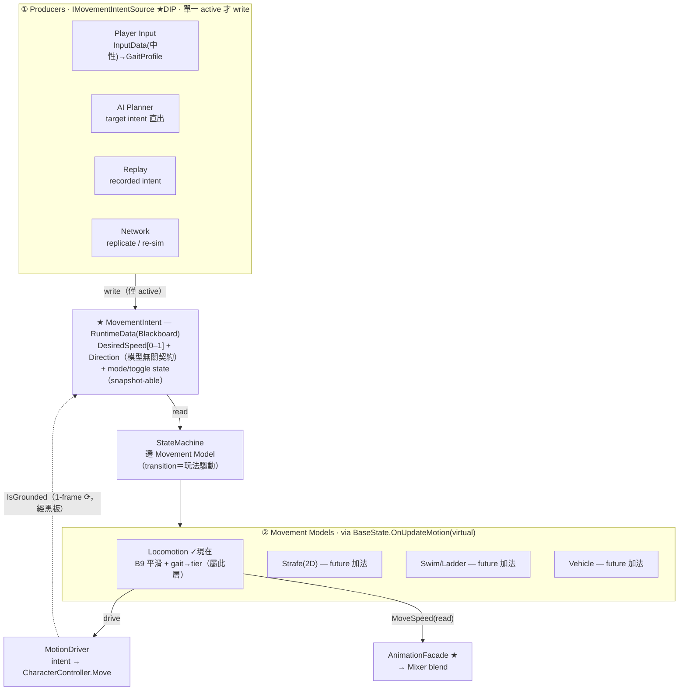
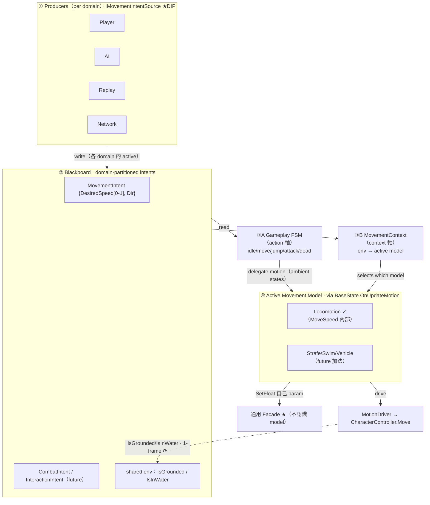

# Locomotion Foundation — 輪 2 資產盤點與導入規劃（Kubold Movement Animset Pro）

> **定位**：規劃／分析文件（Planning Doc），對應 roadmap `docs/03-animation-roadmap.md` 輪 2。
> 本檔承載「資產盤點、Import Preset、Bake Strategy、Motion Feature Mapping、承載分析、工作拆分」——**不承載架構決策**。
> **流程紀律（使用者裁決 2026-07-21）**：先建立 Locomotion Foundation（把 Kubold 完整導入現有 Animation Runtime）→ 依資產**實際**結構再決定 Start／Stop／Pivot 承載方式（FSM State vs Presentation），**不預先拍板**。
> **真相流向**：本檔（planning）→ 實作後把 durable 結果（最終 preset、Bake 配置、Mixer/Transition 結構、若有承載決策）fold 進 Living Docs（`01-design-doc.md`／`02-dev-spec.md`），必要時開 ADR。
> **來源**：clip 清單由 7 支 FBX 的 `.meta`（`clipAnimations` takeName）完整抽出；官方對照 `MAP_Unity_v1.5_animlist.pdf`。

---

## 1. Animation Catalog（完整盤點）

- **來源真相**：FBX 子 clip 直引（§0.4 規則 0，AnimationClip 預設不可變）。7 支動畫 FBX + `Models/Dummy.fbx`（Kubold 骨架，非執行期資產）。
- **Rig**：主 FBX `animationType: 3`（Humanoid）、`avatarSetup: 1`（Create From This Model）。Humanoid clip 以肌肉空間儲存，**自動 retarget 到 X Bot 的 Humanoid avatar**——這是能用在現有角色上的關鍵前提，已滿足。
- **更新檔優先**：`_SprintFixed`／`_RunStrafeUpdate` 是 Kubold 的修正／更新包，與主 FBX 有同名 clip（如 `SprintFwdLoop`）。**同名時採更新版**（`_SprintFixed` 的 Sprint、`_RunStrafeUpdate` 的 `*_new` Crouch）。
- **命名規律**：`{Gait}{Dir}{Kind}{Angle}_{Foot}`。Gait＝Walk/Run/Sprint；Dir＝Fwd/Bwd/StrafeLeft/StrafeRight；Kind＝Loop/Start/Stop/Turn/Arch/Lean；Angle＝90/135/180；Foot＝`_L/_R`（起步 lead 腳）或 `_LU/_RU`（Left/Right foot **Up**＝停步/轉身的落定腳相）。

### 1.1 分類總表（全 7 FBX，標本輪範圍）

| 類別 | 代表 clip | 數量 | 循環 | 位移/旋轉 | 本輪 (輪 2) |
| --- | --- | --- | --- | --- | --- |
| **Idle（基準）** | `Idle` | 1 | ✓ | 原地 | ✅ 核心 |
| Idle 變體 | `Idle2`~`Idle6`（_Idles FBX） | 5 | ✓ | 原地 | ⏸ 延後（觀感選配） |
| **原地轉身** | `TurnRt90_Loop`/`TurnLt90_Loop`/`TurnRt180`/`TurnLt180` | 4 | 部分 | 純旋轉 | ✅ 核心 |
| **Walk 前向 loop** | `WalkFwdLoop` | 1 | ✓ | 位移 | ✅ 核心 |
| **Walk 前向 start** | `WalkFwdStart`(+`90_L/R`,`135_L/R`,`180_L/R`) | 7 | ✗ | 位移+旋轉 | ✅ Phase C |
| **Walk 前向 stop** | `WalkFwdStop_LU`/`WalkFwdStop_RU` | 2 | ✗ | 位移(減速) | ✅ Phase C |
| **Run 前向 loop** | `RunFwdLoop` | 1 | ✓ | 位移 | ✅ 核心 |
| **Run 前向 start** | `RunFwdStart`(+`90_L/R`,`135_L/R`,`180_L/R`) | 7 | ✗ | 位移+旋轉 | ✅ Phase C |
| **Run 前向 stop** | `RunFwdStop_RU`/`RunFwdStop_LU` | 2 | ✗ | 位移(減速) | ✅ Phase C |
| **Run 180 轉身** | `RunFwdTurn180_{L/R}_{LU/RU}` | 4 | ✗ | 位移+旋轉 | ✅ Phase C |
| **Sprint loop** | `SprintFwdLoop`（採 `_SprintFixed`） | 1 | ✓ | 位移 | ✅ 核心 |
| 曲線 locomotion | `Walk/RunArchLoop_{L/R}`, `*Loop_Lean{L/R}` | 8 | ✓ | 位移(弧線) | ⏸ 延後（轉向打磨） |
| Strafe / 後退 | `StrafeLeft/Right*`, `WalkBwd*`, `RunLt/Rt/Bwd*`, `RunStrafe*` | ~25 | 混 | 側向/後向 | ⏸ **延後＝需 2D Mixer（roadmap F2）** |
| Crouch（含 `_new`） | `Crouch_*`, `Crouch_Walk*_new` | ~30 | 混 | 位移 | ⏸ 延後（蹲伏系統） |
| Jump / Fall | `Jump_*`, `JumpWalk/Run*`, `FallingLoop*` | ~25 | 混 | Y 特徵 | ⏸ 延後（專案已有自研 Jump，見下方 §2 註） |
| Fighting | `Fists_*`, `*Punch/Kick/Hit/Knockdown`, `Death_*` | ~19 | 混 | — | ⏸ roadmap 輪 6 Combat |
| 互動/翻越/其他 | `ButtonPush/PickUp/PullLever/Throw*`, `Vault1m/Climb2m/Slide`, `SitChair*`, `Patrol*` | ~35 | 混 | 混 | ⏸ 各自後續輪 |

> 完整 clip 逐條清單見各 FBX `.meta` 的 `clipAnimations`（本表已窮舉分類，未省略類別）。

---

## 2. 輪 2 範圍界定（Locomotion Foundation）

**納入（前向 locomotion 核心）**：
- **Phase A 地基＋loops**：`Idle`、`WalkFwdLoop`、`RunFwdLoop`、`SprintFwdLoop`（Mixer 核心，直接替換現行 Idle/Move 1D Mixer，並以真實 Kubold 資產壓測導入/烘焙管線）。
- **Phase C 一次性動作**：Walk/Run 的 Start（含 90/135/180）、Stop（`_LU/_RU`）、原地轉身（Turn90/180）、Run 180 轉身。**承載方式在此階段依實測定案**。

**延後（記於 Backlog，本輪不動）**：
- **Strafe／後退**（~25）：需 2D 方向 Mixer＝roadmap **F2 Strafe 2D**，且連動 B11 門檻公式；前向地基穩固後再開。
- **Crouch／Jump／Fighting／互動／翻越**：各屬後續輪；其中 **Jump**——專案已有自研資料驅動跳躍（ADR-002：物理 launch + Bake Y 特徵），Kubold Jump 家族**暫不導入**，未來若要換素材再對照。
- **Idle 變體、Arch/Lean 曲線 locomotion**：觀感選配，主線穩定後再評估。

**理由**：roadmap 輪 2 主目標＝消除滑行感 + 起停/pivot；前向 locomotion 已涵蓋此目標的完整鏈路（loop→start→stop→turn）。側向/後退屬「移動維度擴充」（2D），與地基正交，先做會把 1D→2D 的 Mixer 決策提前綁死。

---

## 3. Import Preset（依 §0.4 Root Transform 矩陣分類）

**映射到現有 4 原型**（§0.4）——本輪**零新增 preset 類型**，全部複用既有先例：

| Kubold 類別 | §0.4 原型 | XZ Bake | Y Bake | Rot Bake | Loop Time | 執行期驅動 | 先例 |
| --- | --- | --- | --- | --- | --- | --- | --- |
| `Idle` | **Locomotion-原地** | ✅ | ✅ | ✅ | ✓ | procedural | Idle |
| `WalkFwdLoop`/`RunFwdLoop`/`SprintFwdLoop` | **Locomotion-位移** | ❌（抽出丟棄=原地化） | ✅ | ✅ | ✓ | procedural；烘焙採速度真相 | Walking、Fast Run |
| Start / Stop / Turn（一次性、位移+旋轉） | **烘焙曲線驅動** | ❌（採速度） | ✅ | ❌（採 yaw） | ✗ | SpeedCurve + RotationCurve | **Stand To Roll** |

- **Rig/Retarget**：維持 Humanoid；retarget 走 Humanoid→Humanoid 自動肌肉映射（Kubold 自帶 avatar 即可，無需 Copy X Bot avatar；若實測有比例滑步再議 Copy From Other Avatar）。
- **套用方式**：一律用 `MotionClipImportSOP` 工具套 preset（§0.4 規則 1，`ModelImporter.defaultClipAnimations` 覆寫，**禁手改 `.meta`**）。套用後有烘焙資產者**必須重烘焙**。
- **待確認**：`烘焙曲線驅動` preset 目前先例 Roll 是否已涵蓋「Rot Bake ❌ 採 yaw」對**大角度轉身**（Turn180、Start180）的正確性——Roll 轉幅小，Kubold Turn180 是半圈，需 Phase C 首個 turn clip 烘焙後實測確認 RotationCurve 合理（此為 §0.4 「先驗證再定調」的落點）。

---

## 4. Bake Strategy

**原則**：loop 取「代表速度」穩態值；一次性動作取「全曲線」。全部 clip 建 `MotionBakeData` 資產、直引 FBX 子 clip。

| Clip 群 | 主要烘焙輸出 | 用途 |
| --- | --- | --- |
| Loops（Walk/Run/Sprint） | `AutoAverageSpeed`（+ `SpeedCurve` 供穩定度檢視） | `MotionDriver.moveSpeed` 來源（最高速 clip）＋ Mixer 門檻推導（`threshold = speed_i / speed_max`，§3.2 資料流） |
| Starts | `SpeedCurve`（加速段）、`RotationCurve`+`RotationFinishedTime`（90/135/180 起步的轉向）、`EndPhase` | 執行期依曲線驅動起步位移/轉向；`EndPhase` 決定銜接哪隻腳進 loop |
| Stops | `SpeedCurve`（減速段）、`EndPhase`（`_LU/_RU`＝落定腳相） | 依曲線驅動減速；`EndPhase` 對齊停步後 Idle 的腳相 |
| Turns（原地/移動） | `RotationCurve`、`RotationFinishedTime` | 執行期套 deltaYaw 驅動轉身；`RotationFinishedTime` 防收尾抖動 |

**烘焙速度預期序**（實際值待烘焙量測，此處僅相對關係）：`Idle(0) < WalkFwdLoop < RunFwdLoop < SprintFwdLoop`。門檻由各 loop 的 `AutoAverageSpeed / SprintSpeed` 推導（設計師依公式手填，B11 決策：門檻是可調表現參數，不自動寫 Animancer `_Thresholds`）。

**新增烘焙 Stage（本輪捆綁，roadmap §2.1 / dev-spec §5 既定未完成項）**：
- **Foot Phase Curve**（`IBuildStage` 可插拔擴充）：現有 `MotionBakeData.EndPhase` 僅「動畫結束瞬間」單值；Kubold 的 Start/Stop 是**腳別特化**（`_LU/_RU`），要在 loop 進行中「當下哪隻腳著地」才能選對停步/起步變體 → 需**連續腳相曲線**（時間 → 哪腳觸地）。此 stage 亦為未來 Footstep（roadmap 輪 3）與 SynchronizeChildren 相位對齊的共用資料源。
  - 產出候選：`AnimationCurve FootPhaseCurve`（0=左觸地、1=右觸地，或雙腳高度差符號），供執行期查詢當前相位。
  - 偵測法：沿用 §4.3 「世界空間相對足跡」機制（雙腳世界 Y vs Rest Pose 基線），取較低腳為觸地腳。

---

## 5. Motion Feature Mapping（clip → 需要的特徵；缺口分析）

| 特徵（`MotionBakeData` 欄位） | 現況 | 本輪需求 | 缺口？ |
| --- | --- | --- | --- |
| `AutoAverageSpeed` / `GetRepresentativeSpeed()` | ✅ 已有（Walking/FastRun 在用） | Loops 速度真相 → moveSpeed + 門檻 | 無 |
| `SpeedCurve` | ✅ 已有（Roll 在用） | Starts 加速 / Stops 減速 | 無 |
| `RotationCurve` + `RotationFinishedTime` | ✅ 已有（Roll 在用） | Turns / 帶角度 Starts 的轉向 | 無 |
| `EndPhase`（`FootPhase` L/R） | ✅ 已有（enum 定義齊全） | Stop 落定腳相對齊 | 無（但需 Foot Phase Curve 供「進行中」查詢） |
| `TargetLocalDirection` | ✅ 已有 | （側向/後退才用）本輪前向不需 | 無（延後 F2 才用） |
| **Foot Phase Curve（連續腳相）** | ❌ **缺**（僅單點 EndPhase） | Start/Stop 腳別選擇 + 未來 Footstep/同步 | **是＝本輪唯一新增特徵** |
| Start/Stop 行進距離 | ❌ 無 | （Distance Matching 才用） | 延後 roadmap 輪 7，不在本輪 |

**結論**：本輪特徵層**幾乎全部複用**現有 `MotionBakeData`；唯一新增＝**Foot Phase Curve 烘焙 stage**（已在 roadmap 捆綁範圍內）。無需改 `MotionBakeData` 以外的資料契約。

---

## 6. 承載分析（Mixer / Transition / 新 State）——輸入資料，**不預先定案**

> 依使用者裁決：承載方式由 Phase A/C 導入後的**實測行為**定案，本節只把候選與判準列清楚。

| Clip 群 | 天然承載傾向 | 理由 | 是否需新 FSM State |
| --- | --- | --- | --- |
| Idle / Walk / Run / Sprint loop | **Mixer**（1D 速度） | 連續速度混合，直接擴充現行 Idle/Move `LinearMixer`（多鍵→一資產先例 v0.16） | 否（拓撲零改動） |
| Start / Stop / Turn | **Transition（Presentation）候選** | 一次性、事件觸發（開始/停止移動、急轉）、腳別特化——形態同 Roll（Facade 播一次性 Transition） | **待定**（見下方判準） |

**新 FSM State 的判準（Phase C 實測回答，不提前）**：
- 若 Start/Stop 只需「Facade 播一次性 Transition → 混回 loop Mixer」、**無狀態級鎖定/完成判定** → **Presentation 承載，FSM 拓撲零改動**（延續 Idle/Move 共用 Mixer 精神、design-doc §2.7「拓撲與模式無關」）。
- 若需要「停步期間鎖輸入直到腳踩定」「起步完成前不可打斷」等**狀態級語意** → 才評估新 State；但**「封鎖輸入」語意本屬 Arbiter（roadmap 輪 4）範疇**，不應提前塞進 locomotion 狀態（YAGNI + 依賴方向）。
- **Sprint 承載**待定：第 4 個 Mixer 節點（1D 續擴）vs 獨立段——依 Sprint 是否需獨立打斷規則決定。

**上一輪的傾向（僅記錄，非結論）**：B 為主（Presentation）、A 為輔（少量 State）。本輪以資產實測驗證或推翻。

---

## 7. 本輪工作拆分（重新規劃）

> 每階段結束為一個可 Play 驗收點；Phase A 綠燈才進 B/C。程式改動走既定路由（非架構→Living Docs；承載若升為架構決策→ADR）。
> **使用者裁決細化（2026-07-21）**：管線嚴格照序推進 **Catalog → Import → Bake → Motion Features → Locomotion Mixer → Parameter Calibration**（＝下表 A+B 展開）；Start/Stop/Pivot 承載（原 C3）**明確延到整個 Foundation 驗證完成後**才決定（見 §8.1 第 4 點）。本輪主目標＝完整 Foundation，不急著加動畫功能。

| Phase | 工作 | 產出 | 負責 |
| --- | --- | --- | --- |
| **A. 地基＋loops** | A1 Import Preset 套用（Idle→原地；Walk/Run/Sprint loop→位移）｜A2 建 loops `MotionBakeData`+烘焙（取速度真相）｜A3 擴充 Mixer 至 Idle/Walk/Run/Sprint、門檻由速度推導｜A4 Facade 映射 + `moveSpeed` source 接最高速 clip｜A5 Play：換速無滑步、相位同步 | Kubold loop locomotion 上線，替換現行 Idle/Move | A1/A2 資產側=使用者(SOP)；A3/A4 程式=我；A5 使用者實測 |
| **B. Foot Phase 烘焙** | B1 設計 `FootPhaseCurve` `IBuildStage`（§4.3 足跡機制）｜B2 烘焙 in-scope clips 腳相 | 連續腳相資料，供 Phase C 選腳別 | 我（stage 程式）+ 使用者（烘焙執行） |
| **C. 一次性動作＋承載定案** | C1 烘焙 Starts/Stops/Turns（SpeedCurve+RotationCurve+EndPhase）｜C2 以 Transition（Facade）實作起停/轉身，實測行為｜C3 **據實測定案承載方式**（→ 補 dev-spec/design-doc，必要時 ADR） | 起步/停步/pivot 上線 + 承載決策落地 | 我（程式）+ 使用者（烘焙/實測/裁決） |
| **D. 參數平滑（B9）** | 資產定形後：MoveSpeed SmoothDamp + 加減速曲線 | Game Feel 收尾 | 我 + 使用者調參 |

**延後（Backlog，本輪不動）**：Strafe/後退 2D Mixer（F2）、Crouch、Kubold Jump 對照、Fighting（輪 6）、互動/翻越、Idle 變體、Arch/Lean 曲線 locomotion、Distance Matching（輪 7）。

---

## 8. 已裁決與 Import 執行規劃（2026-07-21）

### 8.1 已裁決（使用者確認）
1. **範圍**：Foundation 全做（Catalog→Import→Bake→Motion Features→Mixer→Parameter Calibration 完整管線），前向 locomotion。Strafe/後退/Crouch/Jump/Fighting/互動 全數延後。
2. **速度分段**：**Idle / Walk / Run / Sprint 四段**（不硬補不存在的 Jog）。**原則：速度段數由動畫資產決定**——Foundation 忠實反映現有素材，不為預設規格硬湊。未來導入含 Jog 的資產時，透過 **Catalog → Bake → Mixer 擴充**即可（新增一個 loop child + 一個門檻），**不動 FSM 與整體架構**（Mixer 門檻是資料驅動的表現參數，非拓撲）。
3. **Retarget**：全部 Humanoid、retarget 到 **X Bot**（維持現有角色，不換成 Kubold Dummy）。
4. **承載紀律**：Start/Stop/Pivot 承載（FSM State vs Presentation）**延到整個 Foundation 驗證完成後**，依實際資產結構與動畫效果再定。本輪目標＝完整 Locomotion Foundation，不急著加動畫功能。

### 8.2 盤點發現（需在對應步驟處理）
- **F1 已裁決（2026-07-21）→ 四段**：Kubold 前向移動 loop 僅 3 支（`WalkFwdLoop`/`RunFwdLoop`/`SprintFwdLoop`），**無獨立 Jog**。使用者裁決**不硬補**——Foundation＝Idle/Walk/Run/Sprint 四段，忠實反映資產。落實 §8.1 第 2 點「速度段數由資產決定」原則；未來含 Jog 的資產走 Catalog→Bake→Mixer 擴充，不改架構。
- **F2（Import 步驟）SOP 工具粒度**：`MotionClipImportSOP` 目前「整檔套用」——但 Kubold 一支 FBX 內含多類型 clip（`MovementAnimsetPro.fbx` ~85 支混 Idle/Walk/Start/Turn/Jump/Crouch）。整檔套用會誤套全部。**Phase A 的 3 支 loop 先在 FBX Inspector 逐 clip 手設**（量少可行）；Phase C（25+ 一次性動作）時再評估把工具增強為「僅套用選取的子 clip」（Gate A 量大/易錯 ✓、Gate B 用 Unity 公開 API ✓，屆時提案）。

### 8.3 Import SOP — Phase A loops（Foundation 第一步，你在 Editor 執行）
在對應 FBX 的 Inspector → Animation 分頁 → Clips 清單，對下列 clip **逐支**設 Root Transform（依 §3 preset）：

| Clip | 來源 FBX | Preset | Root Transform 設定 |
| --- | --- | --- | --- |
| `Idle` | `MovementAnimsetPro.fbx` | Locomotion-原地 | Bake XZ ✅ / Y ✅ / Rot ✅；Loop Time ✅；Based Upon 全 Original |
| `WalkFwdLoop` | `MovementAnimsetPro.fbx` | Locomotion-位移 | Bake XZ **❌** / Y ✅ / Rot ✅；Loop Time ✅；Based Upon 全 Original |
| `RunFwdLoop` | `MovementAnimsetPro.fbx` | Locomotion-位移 | 同上 |
| `SprintFwdLoop` | `MovementAnimsetPro_SprintFixed.fbx` | Locomotion-位移 | 同上；此 FBX 僅 1 clip，可直接用現有 SOP 工具「Locomotion-位移」選單整檔套用 |

> 主 FBX 的 Idle/Walk/Run Loop 三支需逐 clip 手設（避免誤套其餘 ~82 支）。Retarget：三支 FBX 的 Rig → Animation Type = Humanoid、Avatar Definition 維持 Create From This Model（Humanoid 自動 retarget 到 X Bot）。

### 8.4 下一步
Import（8.3）為你在 Editor 的即時可執行步驟。你套用後，我接著出 **Bake 步驟**規格（loops 建 `MotionBakeData`＋烘焙取速度真相）與 **Foot Phase Curve stage**（Motion Features）的程式設計，並實作 **Mixer 擴充/Facade 映射/Calibration**。

（本檔為分析/規劃，除本檔外未改任何程式或資產。）

---

## 9. Bake 步驟 SOP ＋ Motion Features（Foot Phase Curve stage）

### 9.1 Bake SOP — 四段 loop（你在 Editor 執行）
前置：§8.3 Import 完成（四支 loop 的 preset 已套、`Loop Time` 已開）。
工具：`Tools/Project/動畫根運動物理烘焙工具 v4.0`（`MotionBakeEditor`）。逐支操作：

| 欄位 | 值 |
| --- | --- |
| 目標 Animation Clip | 拖入 loop 子 clip（`Idle`／`WalkFwdLoop`／`RunFwdLoop`／`SprintFwdLoop`）|
| 採樣用角色模型 | **X Bot prefab**（掛 Animator + Humanoid Avatar）——關鍵：用 X Bot 採樣，`speed` 真相＝Kubold **retarget 到 X Bot 後**的實際速度 |
| 採樣率 (FPS) | 30（Kubold 原生 30fps）|

按「開始提取」→ 生成 `Assets/ScriptableObjects/Motion/Bake_<clip>.asset`。

- **必烘**：Walk/Run/Sprint 三支移動 loop（要 `AutoAverageSpeed` 速度真相）。**Idle 可選**（`AutoAverageSpeed≈0`，無位移；烘它只為 FootPhaseCurve 一致性，Mixer 的 0 門檻不需速度）。
- **驗證**：`AutoAverageSpeed` 應 Walk < Run < Sprint 遞增。記下三值 → 供 **Parameter Calibration**：`MotionDriver.moveSpeed` source 接最高速（`Bake_SprintFwdLoop`）、Mixer 門檻 = `speed_i / speed_max`（各 loop 的 `AutoAverageSpeed ÷ Sprint 的`）。
- Foot Phase Curve 於**同一次烘焙自動產出**（見 §9.2，無需額外操作）。

### 9.2 Motion Features — Foot Phase Curve stage（新增特徵；程式設計）

**目標**：連續腳相曲線（時間 → 哪腳觸地），供 Start/Stop 選腳別（`_LU/_RU`）與未來 Footstep／相位同步。

**架構契合（零管線改動）**：烘焙迴圈已每幀採 `LeftFootWorldY`／`RightFootWorldY`（存進 `MotionFeatureSample`）；`IMotionFeatureAnalyzer` 介面本就是「新增特徵的擴充點」（其註解明列「實作本介面並註冊即可，無需改動採樣迴圈或既有分析器」）。故本特徵＝**新增一個 analyzer ＋ 註冊一行 ＋ MotionBakeData 一個欄位**，**`MotionBakeEditor.cs` 完全不動**（既有 `MotionFeatureAnalysisStage().Run` 自動帶跑）。

**演算法**：`d(t) = LeftFootWorldY(t) − RightFootWorldY(t)`。`d<0`＝左腳較低＝**LeftFootDown**；`d>0`＝**RightFootDown**——與既有 `EndPhase`（`LeftLocal.y < RightLocal.y → LeftFootDown`）**符號一致**。差值抵消共模垂直起伏（兩腳共享根運動 Y），故世界 Y 差 ≈ 本地 Y 差、複用現有 samples 零額外採樣；**零交越點＝換腳時刻＝未來 Footstep 事件候選**。

**資料格式（MotionBakeData +1 欄位 +1 helper；additive、向後相容）**：
```csharp
// MotionBakeData.cs 新增（放於 EndPhase 附近）
[Tooltip("連續腳相曲線：值 = 左腳世界Y − 右腳世界Y。<0 左腳觸地、>0 右腳觸地（與 EndPhase 同義）。零交越＝換腳時刻。")]
public AnimationCurve FootPhaseCurve;

/// <summary>查詢某時刻哪隻腳觸地。曲線缺（舊資產未重烘焙）時退回單點 <see cref="EndPhase"/>。</summary>
public FootPhase GetFootPhaseAt(float time)
{
    if (FootPhaseCurve == null || FootPhaseCurve.length == 0) return EndPhase;
    return FootPhaseCurve.Evaluate(time) < 0f ? FootPhase.LeftFootDown : FootPhase.RightFootDown;
}
```

**Analyzer（`MotionFeatureAnalysis.cs` 新增，並在 `MotionFeatureAnalysisStage` 建構子註冊）**：
```csharp
public sealed class FootPhaseCurveAnalyzer : IMotionFeatureAnalyzer
{
    public string FeatureName => "Foot Phase Curve (continuous L/R contact)";

    public void Analyze(MotionFeatureContext context, MotionBakeData target)
    {
        target.FootPhaseCurve = null; // 安全預設（比照 JumpFeatureAnalyzer 先寫退化值）
        IReadOnlyList<MotionFeatureSample> samples = context.Samples;
        if (samples == null || samples.Count == 0) return;

        var curve = new AnimationCurve();
        for (int i = 0; i < samples.Count; i++)
            curve.AddKey(samples[i].Time, samples[i].LeftFootWorldY - samples[i].RightFootWorldY);

        target.FootPhaseCurve = curve;
    }
}
```
```csharp
// MotionFeatureAnalysisStage 建構子（新增一行註冊）
_analyzers = new List<IMotionFeatureAnalyzer>
{
    new JumpFeatureAnalyzer(),
    new FootPhaseCurveAnalyzer(), // 🆕
};
```

**影響面**：**2 檔**——`MotionBakeData.cs`（+1 欄位 +1 helper）、`MotionFeatureAnalysis.cs`（+1 analyzer +1 註冊行）。`MotionBakeEditor.cs`、既有 `JumpFeatureAnalyzer`、執行期全不動。欄位 additive 向後相容（舊 Bake 資產 `FootPhaseCurve=null`，helper 退回 `EndPhase`；不必為此強制重烘全部舊資產）。

**已落地（2026-07-21，使用者核可）**：`MotionBakeData.cs`（+`FootPhaseCurve` 欄位 +`GetFootPhaseAt()` helper）與 `MotionFeatureAnalysis.cs`（+`FootPhaseCurveAnalyzer` +`MotionFeatureAnalysisStage` 註冊）皆已修改（既有檔，非新建）。additive 欄位向後相容。**待你重烘 4 支 loop 一次**，FootPhaseCurve 即隨既有 `MotionFeatureAnalysisStage().Run` 自動產出。同輪並落地 per-clip 版 `MotionClipImportSOP`（選子 clip 只套那幾支）。EditMode 測試 +5（`FootPhaseCurveAnalyzer` 2＋`GetFootPhaseAt` 3）。

---

## 10. Locomotion Mixer 擴充 ＋ Parameter Calibration（SOP，你在 Editor 執行）

### 10.1 架構確認：本步驟**零程式改動**
- `MotionDriver.ExecuteBaseMovement`：`currentSpeed = data.MoveSpeed × moveSpeed`（正規化 [0,1] × m/s）。
- 黑板 `MoveSpeed` = `input.MoveInput.magnitude` ∈ **[0,1]**（`CharacterPipelineRunner.ProcessParameters`）。
- `AnimancerFacade` 無 Mixer 引用，只 `SetFloat("MoveSpeed", MoveSpeed)`；Mixer 結構全在資產、由資產內 ParameterName 綁定驅動。
- **自洽性**：門檻ᵢ = speedᵢ / speed_max、實際速度 = speed_max × MoveSpeed → 當 MoveSpeed 到達門檻ᵢ 時，實際速度 = speedᵢ = 該 clip 天生腳速 → **不滑步**。
- ∴ Facade／Runner／MotionDriver 皆不改一行——**驗證「速度段數由資產決定、不改架構」原則**（§8.1 第 2 點）。

### 10.2 Mixer 資產（`Assets/ScriptableObjects/Animation/Locomotion.asset`，Animancer 1D LinearMixer）
現行 2 children（M1 Idle/Move）→ 擴充為 **4 children**：

| # | Child Clip（FBX 子 clip 直引） | Threshold | Sync |
| --- | --- | --- | --- |
| 0 | `Idle`（`MovementAnimsetPro.fbx`）| **0** | ✗（非步態循環，不參與相位同步）|
| 1 | `WalkFwdLoop` | **0.265**（1.617 / 6.101）| ✓ |
| 2 | `RunFwdLoop` | **0.574**（3.502 / 6.101）| ✓ |
| 3 | `SprintFwdLoop`（`_SprintFixed.fbx`）| **1.0**（6.101 / 6.101）| ✓ |

- ParameterName 綁定維持 **`MoveSpeed`**（`MoveSpeed.asset` StringAsset，M1 已接，不動）。
- Sync：Walk/Run/Sprint 開 `SynchronizeChildren`（步態相位對齊，換速不跳腳）；Idle 不開。
- 播放速度（`_Speeds`）維持預設 1——門檻已用**天生速度**校準，不需再調 playback speed（B11：門檻是可調表現參數，設計師依公式手填）。

### 10.3 MotionDriver（角色 Prefab 上）
- `moveSpeedSource` → **`Bake_SprintFwdLoop.asset`**（最高速 clip，6.101 m/s）。啟動時覆寫 `moveSpeed = 6.101`，滿速＝Sprint 天生速度、根除滑步。
- `overrideMoveSpeed` 維持**不勾**。

### 10.4 Facade 映射
- **不需改**：Idle/Move 兩鍵仍映射到同一份 `Locomotion.asset`（多鍵 → 一資產，M1 先例）。你只換 mixer 內部 children，`transitionMappings` 引用不變。

### 10.5 Play 驗收
- Idle 站立 → 按住 W：角色以 **Sprint 速度（6.10 m/s）** 前進、腳步無滑移（門檻 × moveSpeed 自洽）。
- **✅ B9 已落地（2026-07-21）**：`CharacterPipelineRunner.ProcessParameters` 以 `SmoothDamp` 平滑 `MoveSpeed`（加速 `moveSpeedAccelTime` 0.12s／減速 `moveSpeedDecelTime` 0.18s，減速期保留最後方向）→ 鍵盤按住 W 即平順加速 Idle→Walk→Run→Sprint、放開滑行收步，**中間 Walk/Run tier 現可用**。動畫與位移共用此平滑值（`currentSpeed = MoveSpeed × moveSpeed`），加減速全程不滑步。手感由 Runner 的兩個時間常數（Inspector）調；純 Runner-local、零 GC、不新增黑板 writer、FSM 拓撲零改動。
- Profiler 熱路徑 0 GC（沿用 M1）。

### 10.6 完成後
Foundation 主幹（Catalog → Import → Bake → Motion Features → Mixer → **Calibration**）到位。下一步依 §7 二選一：**Phase D（B9 參數平滑）** 讓中間 tier 立即可用（觀感投報率高），或 **Phase C（Starts/Stops/Turns ＋承載定案）**。承載決策仍依既定紀律，待此二者推進後由實測回答。

---

## 11. Working Notes / Design Notes — 停步姿勢 ＋ Movement Policy 架構（2026-07-21 設計探索）

> **定位**：設計紀錄 / 探索筆記，**非正式架構決定**。本輪只分析、不改 Runtime 程式。若結論需動正式架構（ADR / dev-spec），**先在 §11.7 提建議，待使用者核可再落地**。Foundation 測試現全綠（All Green）。

### 11.1 目前 Locomotion 行為（現況盤點）
| 層 | 現況 |
| --- | --- |
| Input | `InputData`（ref struct）＝ MoveInput / LookInput / Jump·Roll·FireButtonDown。**無任何 Walk/Run/Sprint modifier（Shift/Ctrl 未捕獲）** |
| Parameter | `Runner.ProcessParameters`：`MoveSpeed = MoveInput.magnitude` ∈ [0,1]，B9 `SmoothDamp` 平滑；`MoveDirection = MoveInput`（減速保留方向） |
| FSM | `Idle`(MoveSpeed<0.1) / `Move`(≥0.1)——拓撲僅「動/不動」，**不含 gait** |
| Mixer | 1D，MoveSpeed 驅動 Idle/Walk/Run/Sprint 四 tier 連續混合 |
| Motion | `currentSpeed = MoveSpeed × moveSpeed(6.10)` |

**結論**：目前**沒有「速度模式選擇」層**——鍵盤按住 W ＝ magnitude 1 ＝ 一路加速到 Sprint；Walk/Run 中間 tier 只能靠 analog 連續值或 B9 過程經過，**無法「選定」停在某 gait**。**「Shift=Run／預設 Walk」尚未實作**——這是往前設計，非改現有行為。

### 11.2 停步姿勢問題（分析；判定非 Blocking，暫不修）
- **現象**：停止瞬間 Root 已無位移，但 mixer 仍在 blend，停在 loop 的**任意步態相位**（可能一腳前一腳後）→ 短暫「左腳後、右腳前」的分腿姿勢再 settle 到 Idle。
- **真正原因**：loop clip 是**循環、無「收步落定」語意**。在任意相位停下並 blend 到 Idle ＝ 把中途步態姿勢線性內插到雙腳併攏——**缺「腳掌踩定」的停步動畫**，就會看到這段內插。與「Root 位移歸零」時序**無因果**（位移歸零是對的）；這是**動畫層缺停步資產**，非 Pipeline / 物理問題。
- **是否常見**：**是**，blend-tree locomotion 的經典現象（無 stop 動畫 / 距離匹配時必然）。AAA 靠 Start/Stop 動畫（腳掌落定停步）＋腳別選擇 或 Motion Matching 解決。
- **歸屬建議（與你的判斷一致）**：**留待 Phase C**。Kubold 已有 `WalkFwdStop_LU/RU`、`RunFwdStop_LU/RU`，配我們剛建的 **Foot Phase Curve**（查停下當刻哪腳觸地 → 選對應 `_LU/_RU` 停步 clip）即為正解。**非 Blocking，列後續優化，不現在修**。Motion Matching 屬研究支線、不進主線（roadmap 輪 8+）。

### 11.3 Movement Policy 架構分析（回應你的 6 問）

**Q1 — 為什麼 BaseState 無法支援 Walk/Run/Sprint 切換？**
`BaseState`（Idle/Move）是 **FSM 拓撲**——語意「動/不動」＋優先級/打斷，**與具體遊戲無關**。Walk/Run/Sprint 是「速度模式」，屬**遊戲特定控制策略**。把 `Shift=Run` 塞進 State 會：①違反依賴方向（`Input→Pipeline→RuntimeData→StateMachine`；State 只讀黑板、**不得讀原始輸入/modifier**）；②把拓撲耦合到某遊戲的控制方案，破壞「同一 FSM 撐 ARPG/射擊/平台」目標；③gait 是連續/模式維度，本就由 Mixer（MoveSpeed blend）承載，新增三個速度 State ＝拓撲爆炸，且與 design-doc §2.7「拓撲與模式無關」相悖。

**Q2 — 問題真正卡在哪一層？**
卡在 **Parameter Processing 層**（`Runner.ProcessParameters`）：現行 `MoveSpeed = magnitude` 是**寫死、遊戲無關**的映射，**沒有注入「Movement Policy」的縫**。更精確：raw input 與「想要的 gait/speed」之間**缺一層抽象**——「input＋modifier → 目標 gait」是 per-game RULE，目前無家可歸；`InputData` 也無 modifier 通道。

**Q3 — Locomotion 責任分配是否需調整？**
需要。`ProcessParameters` 目前混做兩事：「採集輸入」＋「套用遊戲移動策略」。應**拆開**：採集（Engine 固定）／策略解析（Profile 資料驅動）。「input → 移動意圖（速度/模式）」的映射應**資料驅動、可插拔**，不再寫死。

**Q4 — 是否應新增 MovementProfile / MovementPolicy / MovementModeResolver / Input Mapping Strategy？**
是——這正是你要的「Engine vs Profile」分離落點。設計見 §11.4。**判斷放進 Profile（資料）＋Resolver（Engine），不放進 State。**

**Q5 — 目前架構哪裡還不夠 Data-Driven？**
① `ProcessParameters` 寫死 magnitude→MoveSpeed，無 policy 注入點；② `InputData` 無 modifier 通道，無法中性承載 Shift/Ctrl/trigger；③ 無 `MovementProfile` 概念，「哪個 gait」的規則無資料家；④ FSM Idle/Move 門檻 0.1 寫死（可接受，未來亦可 profile 化）。

**Q6 — 提出設計並說明為何優於改 BaseState** → §11.4。

### 11.4 提議設計：資料驅動 MovementProfile（Engine 固定、Profile 可換）

**三層分離**：
1. **Input Mapping（Engine ＋ Unity Input System）**：physical → 中性訊號。Unity Input System 已處理 physical→action（可 rebind、control scheme：鍵盤 Shift / 手把 L3 / trigger）。`InputData` 新增**中性 modifier 通道**（如 `[Flags] MovementModifier`，2~3 個 generic slot：Mod0/Mod1…，int-backed enum ＝零 GC）；`PlayerInputSource` 由具名 InputAction 的 held 狀態填入。**`InputData` 不認識「Sprint/Walk」語意**，保持遊戲無關。
2. **Movement Policy（Profile ＝資料）**：`MovementProfileSO`（ScriptableObject）定義——
   - **modes**：一組模式，各有正規化速度（對映 mixer tier）：Walk 0.265 / Run 0.574 / Sprint 1.0（值由資產決定，延續「速度段數由資產決定」原則）。
   - **base mode**：無 modifier 時預設（A=Walk、B/C=Run、D=單速）。
   - **modifier bindings**：每個 modifier signal → mode 覆寫 ＋ 互動（Hold/Toggle）。例 B：Mod0(Shift,Hold)→Sprint、Mod1(Ctrl)→Walk。
   - **analog 行為**：analog stick → magnitude 連續映射（或在當前 mode 上限內縮放）；digital → modifier 選離散 tier。**一份 profile 兼容鍵鼠與手把**。
   - **（擴充預留）mode 可用性條件**：如 C 的 Sprint 需 stamina>0 ＝ Gameplay Rule；profile 可掛 data-driven 條件，Resolver 吃「capabilities」輸入，**不改 Pipeline**。
3. **MovementModeResolver（Engine ＝執行期，Runner 持有）**：讀 `MovementProfileSO` ＋ InputData，產出目標正規化速度。**持有 Toggle 等每角色執行期狀態**（不放進共享 SO）。`ProcessParameters` 改呼叫 `resolver.ResolveTargetSpeed(magnitude, modifiers, caps)` 取代寫死的 magnitude；B9 平滑此 target；mixer/MotionDriver 皆不變。

**提議資料流**：
```
PlayerInputSource → InputData（MoveInput ＋ MovementModifier 中性通道）
  → Runner.ProcessParameters → MovementModeResolver.ResolveTargetSpeed(mag, mod, caps)〔讀 MovementProfileSO〕→ targetSpeed
  → B9 SmoothDamp → MoveSpeed → （mixer blend ＋ MotionDriver velocity，皆零改動）
```

**為何優於改 BaseState**：
- **SRP**：Resolver 管「input→速度策略」、State 管「拓撲」、Mixer 管「速度→姿勢」、MotionDriver 管「速度→位移」，各司其職。
- **依賴方向不破**：State 不碰 input/modifier；policy 在 Pipeline 的 Parameter 層。
- **可換不可改**：不同遊戲換 `MovementProfileSO` asset，**Pipeline C# 零改動**——正中「Engine 固定、Profile 配置」目標。
- **泛化（非只解 Shift/Ctrl）**：modes＋base＋bindings＋analog＋條件 可表達 A~E——A(Walk/Shift=Run)、B(Run/Shift=Sprint/Ctrl=Walk)、C(always-Run＋stamina-Sprint)、D(platformer 單速/無 Walk)、E(Souls-like Hold-Sprint vs ARPG Toggle-Sprint 各一份 profile)。**任一 Input Mapping × Movement Policy × Gameplay Rule 組合都靠換 profile／掛條件達成，不改核心。**
- **與既有模式一致**：SO 配置（同 `StateMachineConfigSO`／`StateParamsSO`／`AudioDefinitionSO`）；「值由資產決定」延續 Jog 裁決精神。

### 11.5 後續需驗證 ＋ 對未來架構的影響
- **需驗證（泛化壓測）**：拿 A~E 各寫一份 `MovementProfileSO`，確認模型無痛表達；analog＋digital 同 profile 的縮放手感；stamina/條件 mode 的擴充介面（Resolver 的 caps 輸入形狀）。**設計必須通過「能表達未來任意組合」而非只有 Shift/Ctrl**——若壓測發現表達不了某類遊戲，回頭修模型。
- **對未來架構影響**：引入「Profile 層」是專案「多玩法不改 Pipeline」願景的**第一塊基石**；未來 Combat/Camera 等策略或許沿用同款（GameplayProfile 家族）。需在 ADR 界定 Profile ↔ Pipeline / Blackboard 的邊界與 Owner（誰讀誰寫、Resolver 的執行期狀態歸屬）。
- **暫時可接受方案**：現況（analog magnitude→MoveSpeed）對「純類比、單一速度連續」已可用；**mode 選擇（Shift/Ctrl）等 Profile 落地**；停步姿勢等 Phase C stop 動畫。三者皆非 Blocking。

### 11.6 落地涉及的正式架構變更（本輪不動，僅標示）
- `InputData` 加 modifier 通道 ＝ **資料格式變更**（ref struct 加欄位）。
- `Runner.ProcessParameters` 加 Resolver 呼叫 ＋ Runner 持有 Resolver ＝ **Pipeline 改動**（僅一個注入點，之後零改）。
- 新增 `MovementProfileSO` ＋ `MovementModeResolver` ＋ `MovementModifier` ＝ **新 config 型別 ＋ 新責任層（Movement Policy）**。

### 11.7 待你裁決（集中；本輪不動程式，等你點頭）
1. **是否採納 MovementProfile 方向**（Engine 固定 / Profile 資料驅動 / Resolver 執行期）？
2. 若採納：這是**跨切面的新架構層**（新責任、新 InputData 格式、新 config），建議**開一份新 ADR**（例：`ADR-003 Movement Policy 資料驅動分層`）記錄決策，再落地程式與 dev-spec。**要我先出 ADR 草案供你審**嗎？
3. **停步姿勢**：確認列為 Phase C 後續優化（stop 動畫＋Foot Phase 選腳別），本輪不修——同意？

---

## 12. Architecture Review — 刻意挑戰 §11.4 MovementProfile 方案（2026-07-21）

> **定位**：Working Notes 續。以資深 Engine Programmer 角度**主動找缺點、必要時推翻** §11.4。無程式/ADR/dev-spec 改動。**不為支持原方案而支持。**

### 12.1 結論先行（TL;DR）
§11.4 原方案 **directionally 對，但 overfit＋seam 放錯位置**。data-driven SO 配置的精神保留，但有 **6 個真缺陷**，需**部分推翻並重定 seam**（非全盤否定）：

| # | 缺陷 | 嚴重度 |
| --- | --- | --- |
| A | `MovementProfileSO`／`Resolver` 有 **God-object 風險**（config 膨脹＋`caps` 雜物袋＋分支堆疊）| 中 |
| B | `InputData` 的 `MovementModifier` **仍洩漏 gameplay（movement 域）語意**進 input 層 | 中 |
| C | **OCP 只達 parametric**（換值可、換 resolution 邏輯/model 要改碼）；**DIP 弱**（Runner→具體 Resolver→具體 SO，無介面可反轉）| 高 |
| D | **無法擴到 strafe/swim/vehicle/ladder/lockon**——profile 是 1D-speed-centric，**overfit 當前 on-foot-forward** | **致命** |
| E | **netcode/AI 敵對**：seam 綁 input＋modifier、toggle state 藏在 Resolver（不可 snapshot/rollback；AI 得偽造 modifier bit）| 高 |
| F | 「Pipeline 不改」**誇大**——parametric 免碼、structural（新 model/邏輯）必改碼 | 中 |

### 12.2 逐點挑戰（回應你的 7 問）

**Q1 — God Object 風險？有。** 兩處：①`MovementProfileSO`——隨 Combat/Swim 加入，會被誘惑把 modes＋bindings＋analog＋stamina＋per-mode 轉向/加速/動畫 全塞一份 → mega-config。②`MovementModeResolver`——`ResolveTargetSpeed(mag, mod, caps)` 的 `caps` 會變雜物袋（stamina／lock-on／water／vehicle…），method 長出一堆 special-case 分支。「解析所有移動」這個責任本身**太寬**。

**Q2 — InputData 仍混 Gameplay 語意？是。** `MovementModifier` 比 `ShiftDown`（physical）好，但**仍把「這些輸入是為了 movement」的 gameplay 分類烤進 raw input 層**。InputData 應承載**中性 action 狀態**，「這是移動修飾鍵」的解釋屬下游。固定 slot 的 `MovementModifier` 還寫死了 slot 數與領域。邊界糊掉。

**Q3 — SRP/OCP/DIP？**
- **SRP**：勉強，隨 God-object 成長侵蝕。
- **OCP**：對 **parametric variation 成立**（新 profile asset）；對 **structural variation 失敗**（新 resolution 邏輯／新 movement model ＝改既有碼）。只在 Resolver 已支援的形狀內「open」。
- **DIP**：**弱**。Runner→具體 `Resolver`→具體 `SO`，無抽象可反轉。**修法＝介面化**。

**Q4 — Combat/Swimming/Vehicle/Ladder/LockOn 可擴充？誠實答案：不行（如現設計）。** 這是**致命傷**：profile 是 1D-speed-centric——
- **LockOn/Combat strafe**＝2D 方向移動 → 1D gait profile 表達不了。
- **Swimming**＝3D 速度＋浮力＋無 gait → 純量 target speed 不足。
- **Vehicle**＝完全不同模型（檔位/轉向）→ 整個繞過 locomotion。
- **Ladder**＝受限 1D 攀爬＋重映射輸入 → 又一個不同模型。
- **根因**：我把「movement policy（泛）」和「on-foot forward gait policy（特定）」**混為一談**。正確層級是 **Movement MODEL（locomotion／strafe／swim／climb／vehicle）> gait policy（locomotion 內）**。而 model 本就有 seam：**`BaseState.OnUpdateMotion` 是 virtual**——不同 state 已能驅動不同 motion。所以 model 走 state/context seam，gait-profile 只是**其中一個 model 的 config**。

**Q5 — Network Prediction／Replay／AI？兩者都打臉原設計。**
- **Netcode/Replay**：Resolver **私藏 toggle state** → 不可 snapshot → 破壞 rollback/prediction determinism。所有 movement-mode state 必須**顯式在可回溯 buffer（黑板）**，且 resolution 須為 **pure(input+state)→output**。
- **AI**：AI 產出的是 **high-level intent**（「跑去 X」），不是 raw input＋modifier。把 resolution 綁 input 會逼 AI **偽造 modifier bit** ＝ 脆弱。seam 應在「**desired movement intent**」（player/AI/replay 都能寫的值），input→intent 只是 **player 的 producer**。
- 兩者共同暴露：**seam 位置錯了**（綁 input）＋**藏 state**。

**Q6 —「Pipeline 不改」合理嗎？誇大了。** parametric 免碼；structural（新 model/邏輯）必改碼。「零碼」是假的。**真正該固定的是「契約」而非「碼量」**：
- **固定（Engine）**：pipeline **順序**＋黑板 **schema**（層間契約）。
- **變（資料）**：profile SO（加法）。
- **變（碼，但介面後的加法）**：新 policy／model 實作＝**ADD 一個 class，不 MODIFY 既有**（OCP 本義）。
- 誠實 framing：**「不改 Pipeline 的結構與契約；擴充＝加 Profile（資料）或加介面後的 Policy/Model 實作（加法），永不改核心。」** DIP＋介面才讓「extend without modify」成真。

**Q7 — 有更 data-driven 的設計？有 → §12.3。**

### 12.3 修訂設計（重定 seam；保留 SO 配置精神）

**把 seam 從「input＋modifier」上移到「中性黑板 intent」，並用介面反轉：**

1. **Input 層純化**：`InputData` 只承載**中性 action 狀態**（不叫 `MovementModifier`，改為 generic action bits／值；「移動修飾」的解釋移出）。Input Mapping（physical→action）交給 Unity Input System（control scheme/rebind）。
2. **契約層（黑板，固定）**：新增中性 **`MovementIntent`**（最小：`DesiredNormalizedSpeed`〔＋未來 `MovementModelId`〕）。**這是穩定契約**，下游（B9→mixer/motion）只讀它、不讀 input。所有 mode/toggle state **顯式在黑板**（snapshot-able，netcode/replay 友善）。
3. **Producer 層（介面，可換＝DIP/OCP）**：`IMovementIntentSource`——`PlayerLocomotionPolicy`（讀 input＋`GaitProfileSO`）／`AIMovementPolicy`（讀 planner）／`ReplaySource`（讀錄製）。Runner 依賴**介面**、注入具體實作。新 producer ＝加 class，不改 Runner。
4. **Model 層（走既有 state/OnUpdateMotion seam）**：locomotion／strafe／swim／climb／vehicle 各是一個 model，消費 `MovementIntent` 產出實際 motion——**沿用現有 `BaseState.OnUpdateMotion` virtual**，非新機制。gait-profile **只 scope 在 locomotion model**，誠實改名 `LocomotionGaitProfileSO`。
5. **Config（資料，範圍收窄）**：`GaitProfileSO` 只管 locomotion 的 gait（modes＋base＋bindings＋analog）；stamina 等條件由**需要的那個 policy 自己查**，不進 universal `caps` 雜物袋（消 God-object）。

**修訂資料流**：
```
Input（中性 action）→ IMovementIntentSource〔player 讀 GaitProfileSO／AI 讀 planner／replay〕
  → 黑板 MovementIntent.DesiredNormalizedSpeed（＋mode/toggle state 顯式在黑板）
  → B9 SmoothDamp → MoveSpeed → 當前 Movement Model（state.OnUpdateMotion）→ mixer/motion
```

**這修掉了什麼**：D（model 與 policy 分層，strafe/swim 走 state seam）／E（seam 在黑板 intent、state 顯式 → AI/replay/netcode 友善）／C（介面化 → DIP 成立、新 policy/model 加法 → OCP 成立）／B（InputData 去 movement 語意）／A（profile 收窄、消 caps 雜物袋）／F（誠實 framing）。

### 12.4 務實落地路徑（YAGNI；別過度工程）
Review 不等於現在就蓋 netcode/AI 全套。**關鍵是「現在把 seam 放對位置（便宜），machinery 待真需求（加法）」**：
- **現在（最小正確 seam）**：`IMovementIntentSource` 介面 ＋ 一個 `PlayerLocomotionPolicy`（讀 input＋`GaitProfileSO`）產出 desired speed → B9。toggle/mode state 放黑板。**locomotion model 沿用現有 OnUpdateMotion。**
- **待真需求（加法，不改核心）**：`AIMovementPolicy`／`ReplaySource`（AI/netcode 出現時）；strafe/swim/vehicle model（各為新 state＋OnUpdateMotion）；`MovementModelId` 黑板欄位（多 model 並存時）。
- **不現在做**：universal caps、多 model 切換機制、netcode 序列化——YAGNI，但**seam 已保證它們是加法**。

### 12.5 待裁決更新（取代 §11.7 的方案版本）
1. **原 §11.4 方案：部分推翻**——保留「data-driven SO 配置 gait」，但 **seam 上移黑板 `MovementIntent`＋介面化 `IMovementIntentSource`＋model/policy 分層＋profile 收窄＋state 進黑板**。
2. **ADR 應記「修訂後」設計**（§12.3），非 §11.4 原版。若採納，**要我出 `ADR-003 Movement Intent 分層（Producer 介面 × 黑板契約 × Model via State）` 草案**嗎？
3. 是否同意「務實 staging」（現在只放最小正確 seam，AI/netcode/多 model 待真需求加法）？

---

## 13. Architecture Validation — Runtime Data Flow Diagram（2026-07-21，ADR-003 前置）

> **定位**：以資料流圖驗證 §12.3 修訂設計。**畫圖過程再抓到 3 個缺陷，已修進本節最終版**（§13.1）。此圖經核可後才寫 ADR-003。

### 13.1 畫圖時發現並修正的 3 點（§12.3 → 最終版）
- **R1（seam 語義）**：`MovementIntent` 必須是**模型無關的正規化 intensity ＋ direction**，**不是 gait/DesiredSpeed-as-gait**。Walk/Run/Sprint 是 **Locomotion model** 對 [0–1] 的命名門檻（§10 mixer），不屬 seam。否則 seam 仍偷偷耦合 locomotion，Swim/Vehicle 無法共用同一契約。
- **R2（B9 歸屬）**：B9 平滑是 **Locomotion model 的 dynamics**（各 model 的 accel/decel 不同），**不該留在通用 `Runner.ProcessParameters`**。現況 B9 在 Runner ＝**待遷移的殘餘 locomotion 耦合**（非 blocker，值域明確可搬）。
- **R3（無循環）**：Producer 必須 **context-free**（input → intensity 走**固定 profile**，不每幀讀 state）。modifier 語義跨 model 一致（Shift＝更高 intensity），model 各自解讀。如此**無 producer→state 回讀** → 無循環。

### 13.2 資料流圖（mermaid；與上方視覺圖同構）


### 13.3 標註（Ownership / Lifetime / R-W / DIP）
**Ownership（單一 writer）＋ Lifetime**
| 資料 | Writer（唯一） | Readers | Lifetime |
| --- | --- | --- | --- |
| `MovementIntent`（speed[0-1]+dir） | active `IMovementIntentSource` | Locomotion model、FSM | 每幀重算；值＝「當前意圖」 |
| mode / toggle state | active producer（player policy） | producer、netcode snapshot | 持續、**snapshot-able** |
| `MoveSpeed`（平滑後）＋B9 state | Locomotion model（B9） | Mixer、MotionDriver | 持續、snapshot-able（model state） |
| `IsGrounded` / transform | MotionDriver | FSM／producer（下一幀） | 持續（延遲一幀） |
| `InputData` | PlayerInputSource | player producer only | 每幀、stack（ref struct） |

**R/W 權限**
| 層 | 可寫 | 只讀 |
| --- | --- | --- |
| Producer | MovementIntent、toggle state | InputData、GaitProfileSO |
| StateMachine | （選 model／狀態） | 黑板信號 |
| Model（state.OnUpdateMotion） | MoveSpeed、velocity、anim param | **MovementIntent（唯讀）** |
| MotionDriver | IsGrounded、transform | model 給的 velocity |
| Facade / Mixer | animator 參數 | **MoveSpeed（唯讀）** |

**DIP 逐邊**
| 依賴邊 | 抽象？ | 判定 |
| --- | --- | --- |
| Runner → Producer | `IMovementIntentSource`（介面） | ✅ 反轉 |
| State → Animation | `AnimationFacadeBase`（抽象） | ✅ 反轉（既有） |
| State → MotionDriver | 具體 | ⚠️ 可接受（單一 engine 元件；多後端才抽象） |
| Producer → GaitProfileSO | 資料（SO） | n/a（資料依賴，非行為） |

### 13.4 驗證結論（回應你的 6 問）
1. **Ownership**：每筆資料單一 writer（見表）；黑板唯讀下游。✅
2. **Lifetime**：input 幀級 stack；intent 幀級重算；mode/toggle 與 B9 state 持續且 **snapshot-able**（netcode/replay 前提）。✅
3. **可改/唯讀**：Model 唯讀 intent、Facade/Mixer 唯讀 MoveSpeed，寫入權集中且不重疊。✅
4. **DIP**：關鍵 seam（producer 介面、facade 抽象）皆反轉；MotionDriver 具體為可接受例外。✅（大致）
5. **循環**：唯一 back-edge＝MotionDriver→IsGrounded，**經黑板、延遲一幀**（同 M2 既有模式）＝非同幀 cycle；producer context-free → 無 producer→state 回圈。✅ 無害循環
6. **Locomotion 耦合**：seam（MovementIntent）已**模型無關** ✅；gait/B9 收進 Locomotion model；**現況 B9 在 Runner ＝唯一殘餘耦合，標記待遷移**（非 blocker）。

**可擴充性**：Combat/Swim/Vehicle/Ladder/LockOn ＝新 model（新 state＋OnUpdateMotion，**加法**）；AI/Replay/Network ＝新 producer（**加法**）；皆不改核心契約（pipeline 順序＋黑板 schema）。

### 13.5 ADR-003 就緒判定
此圖若你核可，即可作 **ADR-003 Movement Intent 分層** 的依據。ADR 需固定的契約：①`MovementIntent` 黑板 schema（模型無關）；②`IMovementIntentSource` producer 介面（single-active-writer）；③Movement Model 走 `OnUpdateMotion`；④B9/gait 歸 Locomotion model（含現況 B9 遷移計畫）；⑤staging（現在最小 seam，其餘加法）。**待你確認圖無誤 → 我才開始寫 ADR-003。**

---

## 14. Design Review R2 — 三個結構性挑戰（2026-07-21，ADR 前再驗）

> 使用者挑戰 §13 圖，抓出**三條被混淆的軸線**。皆成立，設計再修。**連續兩輪都抓到結構修正 → 設計仍在收斂，ADR 待穩定。**

### 14.1 挑戰 1（成立）：StateMachine **不**擁有 Movement Model——軸線要分離
- **Movement Model**（locomotion／swim／vehicle／climb）＝ **context 軸**（環境/情境決定「移動怎麼運作」）。**Gameplay State**（idle／move／jump／attack／hit／dead）＝ **action 軸**（「在做什麼行為」）。**兩者正交**——可「游泳中攻擊」「載具中 idle」「爬梯中受擊」。
- 混入同一 FSM → **狀態爆炸**（SwimIdle／SwimAttack／LandIdle／LandAttack／VehicleMove…笛卡兒積）。
- **修正**：新增 **`MovementContext`**（env-driven resolver，讀水體/地面/載具/梯子等，**與 gameplay FSM 正交**）決定 active model；gameplay state 的 motion **delegate 給 active model**。**§13「StateMachine selects Movement Model」作廢。**

### 14.2 挑戰 2（成立）：Blackboard ＝ **domain-partitioned intents**，非單一 god-Intent
- `MovementIntent{DesiredSpeed,Dir}`／`CombatIntent{Facing,Aim,Target}`／`InteractionIntent{…}`——**各 domain 一個 intent region，各自 single-writer**（domain producer）。取代目前扁平的單一 `IntentData`。
- 兩類 intent：**trigger**（Jump/Roll/Fire 邊沿事件）vs **continuous domain**（Movement/Combat 連續狀態）——皆 domain-partitioned。
- **YAGNI**：現在只建 `MovementIntent`，但**pattern 定為 domain-partitioned**（未來加 domain ＝加 region，不脹單一 struct）。不現在建 Combat/Interaction。

### 14.3 挑戰 3（成立，但你的 framing 我要修一點）：MoveSpeed 誰算？Facade 要 `IAnimationModel` 嗎？
- **MoveSpeed 是 Locomotion model 的內部值**——不該是黑板欄位由通用層讀。**現況耦合點**：`Runner.SyncAnimation` 讀黑板 `MoveSpeed`、`SetFloat` 給 Facade——這讓通用 Runner「知道 MoveSpeed（locomotion 概念）」。Swim 只有 StrokeRate、Vehicle 只有 RPM，此路一走就耦合。
- **修正**：**每個 model 自己驅動自己的動畫參數**——Locomotion→`facade.SetFloat("MoveSpeed", …)`、Swim→`facade.SetFloat("StrokeRate", …)`，都走**同一支通用 Facade**。MoveSpeed 退回 Locomotion model 內部，不再是黑板欄位。
- **你的問題「Facade 是否需要 `IAnimationModel`？」→ 我的答案：不需要，而且理由重要**：`AnimationFacadeBase` **本身就是那個抽象**（generic `SetFloat`／`Play`／`SetBool` sink，**不認識任何 model**）。缺的不是「Facade 加抽象」，而是「**把 param 驅動的責任從通用 Runner 移進各 model**」。model 各自解讀 intent → 驅動自己的 anim binding。加 `IAnimationModel` 反而是**多一層不必要的抽象**。
- `IAnimationModel` 只有在「某 model 需要**根本不同的動畫 backend**（純程序化 IK／別的動畫系統，非 param+transition）」才值得 → **YAGNI，屆時加法**（Facade 的 generic API 已能涵蓋 mixer/transition 類全部 model）。
- 註：多來源同時驅動 Facade（locomotion＋上身攻擊＋表情）＝ **arbitration/layer** 範疇（roadmap F4 Upper Body／F6 Arbiter 既有規劃），與「model 各自驅動」一致——屆時由 Arbiter 決定誰的 param 生效。

### 14.4 修正後層級（v3，三軸分離）
```
Producers（per domain）──write──▶ Blackboard: domain-partitioned intents
   Movement: Player/AI/Replay/Net → MovementIntent{DesiredSpeed[0-1], Dir}
   (future) Combat → CombatIntent{Facing,Aim,Target} · Interaction → InteractionIntent
                                   │
        ┌──────────────────────────┴──────────────────────────┐
   （正交軸 A）Gameplay FSM                      （正交軸 B）MovementContext（env-driven）
   idle/move/jump/attack/dead（action）          → 決定 active Movement Model（locomotion/swim/vehicle）
        └──────────── gameplay state.OnUpdateMotion delegate ▶ active Movement Model ────────┘
                                   │  （model 消費 MovementIntent；自含 motion＋animation）
              ┌────────────────────┴─────────────────────┐
        MotionDriver（velocity）              通用 AnimationFacade（model 各自 SetFloat 自己的 param）
        （Locomotion: MoveSpeed 內部算→mixer；Swim: StrokeRate；Vehicle: RPM）
```

### 14.5 ADR 就緒？尚未——建議再驗一次
連續兩輪（§12、§14）都抓到結構修正——**核心 seam（黑板契約＋producer 介面＋model via OnUpdateMotion）穩定，但周邊軸線（context 軸／domain 分區／anim 歸屬）才剛補上**。建議：**更新資料流圖（納入三軸分離＋domain intents＋model-owns-anim），再跑一次 validation 確認無新裂縫 → 穩定後才寫 ADR-003。** 不急著進 ADR，正是為了不把未收斂的設計凍進 immutable log。

### 14.6 v3 資料流圖（mermaid；三軸分離）


### 14.7 v3 Validation（三軸結構複驗——無新裂縫，但補一個 nuance）
| 準則 | v3 判定 |
| --- | --- |
| Ownership | 各 intent region 單寫（domain producer）；env 單寫（MotionDriver）；MoveSpeed 退回 model 內部（不再黑板欄位）。**兩軸皆只讀黑板、不互寫** ✅ |
| Lifetime | active-model 由 env 決定論可再導出（snapshot-able）；其餘同 §13 ✅ |
| R/W | 兩正交軸唯讀黑板；model 唯讀 intent、寫 MotionDriver/Facade；無寫入重疊 ✅ |
| DIP | producer 介面、Facade 抽象皆反轉；`MovementContext` resolver 建議資料驅動（condition→model 表）或介面，讓新 model 加法 ✅ |
| 循環 | 唯一 back-edge＝env（IsGrounded/IsInWater）1-frame；producer 與 context 皆 context-free/env-driven，無同幀回讀 ✅ |
| Locomotion 耦合 | seam 模型無關、MoveSpeed model 內部、Facade 通用 → **唯一殘餘仍是 B9 在 Runner（待遷移）** ✅ |

**補的 nuance（非裂縫，既有機制已涵蓋）**：**不是每個 gameplay state 都 delegate 給 model**——**ambient 狀態**（Idle/Move）delegate 給 active model；**intrinsic-motion 狀態**（Roll/Jump/Attack-lunge）本就 override `OnUpdateMotion` 自帶位移（現有設計即如此，Roll 走 baked curve）。若某 action 需 context 感知（水下攻擊 vs 陸上攻擊），該 state 讀 env（黑板）自選——讀 env 非讀 raw input，合法。

**結論：v3 通過複驗，設計已收斂**（核心契約穩定；唯一已知遷移項＝B9→Locomotion model，列為 ADR 的 known-migration）。**→ ADR-003 就緒，待你點頭即開寫。**
