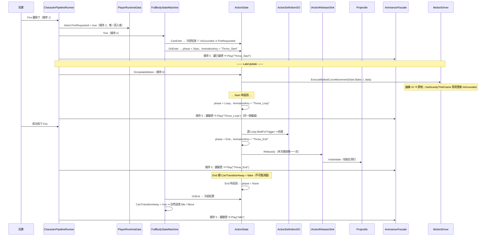
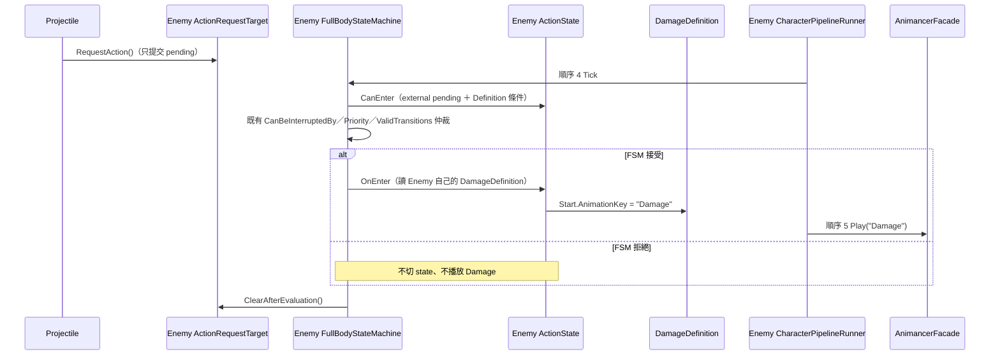
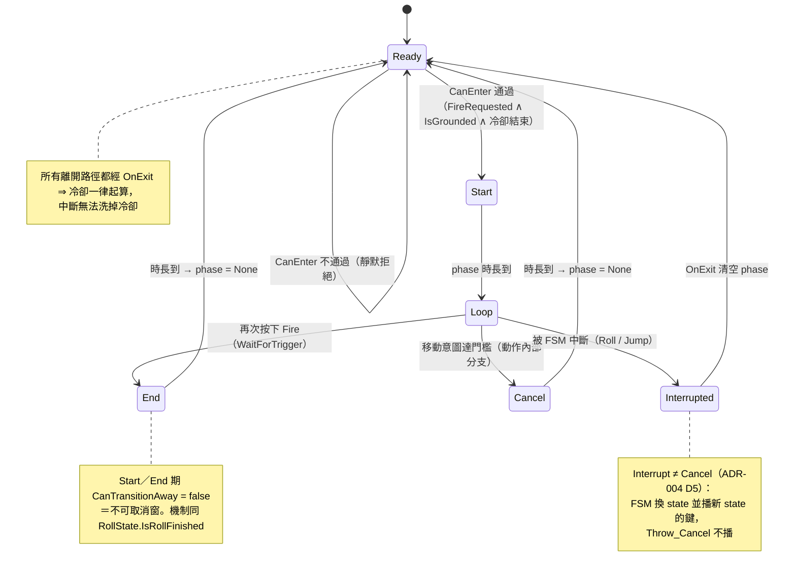

# Action System — Throw Vertical Slice（實作規格）

> ✅ **2026-09-02：ADR-004 已 `Accepted`，本 vertical slice 結案。** 本檔自此描述**已驗證的實作**，不再是 Trial 期文件。
> **Throw 的後續定位**：ADR-004 的 Acceptance 證據 ＋ 架構歷史案例。依 2026-09-02 使用者裁決，
> **不再投入手感調整，且不出現在作品集影片**。多 Action 的後續工作見 [`docs/09-multi-action.md`](09-multi-action.md)。
>
> **定位**：✅ **[`docs/ADR/004-action-in-fsm.md`](ADR/004-action-in-fsm.md)（狀態 `Accepted`）的 Living Spec。**
> ADR 只凍結「改錯會造成架構污染」的決策（D1–D7）；**本檔承載全部實作細節，且本檔內容允許因實作發現而修改**——
> 那正是 Trial 的目的（ADR-004 §0）。
> **本輪範圍**：讓 Codex 能實作**第一個 Throw vertical slice**，不多不少。
> **不是** Action Framework 的完整設計；不做 ActionLibrary／多動作／Combo／Effect Framework（ADR-004 D7）。
> ~~**⚠️ 引用本檔時請一併註明 ADR-004 仍是 Trial**~~ —— **2026-09-02 解除**：ADR-004 §10 已通過，本檔為穩定真相。
> **前身**：本檔 2026-08-29 上午的初稿設計了獨立 `SkillDriver`，已被 ADR-004 取代；該方案與其否決理由保存在 ADR-004 §5.1。

---

## 1. 本輪範圍

### 1.1 In Scope

| 項目 | 界定 |
| --- | --- |
| 動作配置 | **每個角色仍恰好一份 Definition**：Player＝Throw；Enemy＝Damage。這是兩隻角色各自的一對一配置，不是同角色多 Action，故不需要 `ActionLibrarySO` |
| 承載 | 既有 `FullBodyStateMachine` ＋ **一顆** `ActionState`（ADR-004 D1／D3） |
| 定義 | `ActionDefinitionSO` 資產（phase 序列、動畫鍵、時長來源、可打斷性、冷卻） |
| 請求 | Player：既有 `Intent.FireRequested`；External：`ActionRequestTarget.RequestAction()` 的單格 mailbox。兩者只提出請求，最終資格仍由 FSM 判斷；**黑板 schema 零改動** |
| 位移 | intrinsic-motion override → `MotionDriver`（ADR-004 D4） |
| 動畫 | **只**由管線順序 5 播放（ADR-004 D2） |
| 中斷 | FSM ＋ `StateMachineConfigSO` 資產；Cancel 為動作內部分支（ADR-004 D5） |
| 投射物 | `ActionState` 在 authored release phase 發出一次 semantic release → 外部 sink 生成投射物；命中只對 target 提出 Action request，敵人最終由自己的 FSM 播 Damage |

### 1.2 Non-goals

- ❌ 同一角色的第二個 Action、動作查表（`ActionLibrarySO`）、Combo、通用 Effect Framework、傷害數值／血量、資源消耗、上身層。Enemy 的唯一 Definition＝Damage，不構成同角色多 Action。
- ❌ 不新增 `PlayerRuntimeData` 欄位或寫入者（A5 白名單零改動）。
- ❌ 不新增管線階段（順序 1–7 不變）。
- ❌ 不在 `AnimationFacadeBase` 加任何動作專用 API（A14）。
- ❌ **不為了「未來會有很多技能」而預先抽象**——第二個動作出現時才談（ADR-004 D7）。

---

## 2. 資料契約

### 2.1 `ActionPhase`（enum）

```csharp
// Assets/Scripts/Core/StateMachine/Actions/ActionPhase.cs
public enum ActionPhase { None = 0, Start = 1, Loop = 2, End = 3, Cancel = 4 }
```

`None` ＝動作未進行（也是 `CanTransitionAway` 為 true 的唯一條件，§3.5）。

### 2.2 `ActionDefinitionSO`（authored facts）

```csharp
// Assets/Scripts/Core/StateMachine/Actions/ActionDefinitionSO.cs
[CreateAssetMenu(fileName = "ActionDefinition", menuName = "Project/Core/Action/ActionDefinition")]
public class ActionDefinitionSO : StateParamsSO      // ← 沿用既有 StateParamsSO 家族，注入見 §2.4
{
    [Tooltip("phase 集合；順序不重要，以 Phase 欄位查找。Start 必須存在，其餘可省略（Damage 只需 Start）。")]
    public ActionPhaseEntry[] Phases;

    [Tooltip("冷卻秒數（0 = 無冷卻）。這是本切片唯一的 gameplay 規則，讓「動作可以被規則拒絕」成為可測行為。")]
    public float Cooldown = 0.5f;

    [Tooltip("是否要求著地才能發動。")]
    public bool RequiresGrounded = true;

    [Tooltip("Loop 期間玩家的移動意圖超過此值即進入 Cancel（見 §6.2）。")]
    public float CancelMoveIntentThreshold = 0.1f;
}

[System.Serializable]
public struct ActionPhaseEntry
{
    [Tooltip("這一筆描述哪個 phase。")]
    public ActionPhase Phase;

    [Tooltip("AnimancerFacade.transitionMappings 的 StateKey。必須是本動作專屬鍵，不得與其他 state 或 Stop 變體共用資產。")]
    public string AnimationKey;

    [Tooltip("時長與位移曲線的真相來源。缺席時退化為 FallbackDuration 並走一般位移結算（§3.7）。")]
    public MotionBakeData Bake;

    [Tooltip("Bake 缺席或 BakedDuration 為 0 時的保底時長（秒）。比照 RollState 的 FallbackDuration 慣例。")]
    public float FallbackDuration;

    [Tooltip("本 phase 是否允許被 FSM 中斷（疊加在 StateMachineConfigSO 的規則之上，只會更嚴不會更寬）。")]
    public bool Interruptible;

    [Tooltip("Loop 專用：不以時長推進，等待玩家再次按下 Fire 才進入 End（見 §11-R1）。")]
    public bool WaitForTrigger;

    [Tooltip("進入本 phase 時是否送出一次 semantic release。只提交給外部 sink，不直接建立 Unity 物件。")]
    public bool EmitsRelease;
}
```

> 📌 **為什麼 `Bake` 是 `MotionBakeData` 而不是手填秒數**：CLAUDE.md 明訂「**MotionBakeData 是動畫真實運動數值的真相來源**」，且 `BakedDuration` 已於 2026-07-26 導入。用它同時拿到**時長**與**位移曲線**，並讓未來的位移型動作（`Fists_Punch_Move_R`、突進）只需換一份資產。
> ⚠️ 這代表 Throw 的每個 phase clip **都要烘焙**（使用者側工作，§10.3）。

### 2.3 Throw 的資產配置（本輪唯一一份 Definition）

| Phase | AnimationKey | Bake 來源 clip | Interruptible | WaitForTrigger | EmitsRelease |
| --- | --- | --- | --- | --- | --- |
| `Start` | `Throw_Start` | `Throw_Start` | ❌（前搖承諾） | — | ❌ |
| `Loop` | `Throw_Loop` | `ThrowLoop` | ✅（可被 Roll／Jump 中斷） | ✅ | ❌ |
| `End` | `Throw_End` | `ThrowEndFar`（`ThrowEndClose` 留給未來的距離選擇） | ❌（**不可取消窗**） | — | ✅（進入 End 時投出） |
| `Cancel` | `Throw_Cancel` | `ThrowCancel` | ❌ | — | ❌ |

### 2.4 Damage 的資產配置（Enemy 的唯一 Definition）

| Phase | AnimationKey | Bake 來源 clip | Interruptible | WaitForTrigger | EmitsRelease |
| --- | --- | --- | --- | --- | --- |
| `Start` | `Damage` | `Damage` | 依敵人受擊承諾窗配置 | — | ❌ |

Damage 省略 Loop／End／Cancel：Start 時長到後直接完成。它與 Throw 分別掛在 Enemy／Player 各自的
`StateMachineConfigSO.paramsMappings[Action]`，所以一個角色仍只有一份 `ActionDefinitionSO`；ADR-004 §8-L1
所述「同角色第二個 Action」尚未發生，**不得因此新增 ActionLibrary**。

### 2.5 Definition 注入路徑（沿用既有機制）

`ActionDefinitionSO : StateParamsSO` ⇒ 由 `StateMachineConfigSO.paramsMappings` 掛 `Action → ThrowDefinition`，
`ActionState.Initialize` 內以既有的 `config.GetStateParams<ActionDefinitionSO>(Type)` 取得——
**與 `JumpState` 取 `JumpStateParams` 逐字同款**。

> ⚠️ **已知限制**：`paramsMappings` 是 `StateType → StateParamsSO` **一對一**，故目前**一個角色只能有一個 Action 定義**。
> Player 配 Throw、Enemy 配 Damage，兩者各自仍是一對一。只有**同一角色**真的需要第二份 Definition 時才設計查表（ADR-004 D7）。

### 2.6 External Action Request seam（最窄 mailbox）

外部 gameplay event 不進 `IntentData`，也不經 Runner 逐幀轉送。目標角色 Root 掛一顆
`ActionRequestTarget`；projectile 命中時只可呼叫：

```csharp
public sealed class ActionRequestTarget : MonoBehaviour
{
    public void RequestAction();          // 只把單格 pending 設為 true；重複提交合併
    internal bool HasPendingRequest { get; }
    internal void ClearAfterEvaluation(); // 只由 FullBodyStateMachine 在本次 Tick 評估完後清除
}
```

- mailbox **不攜帶 Definition**：目標執行自己的 `paramsMappings[Action]`，所以同一顆 projectile 打到 Enemy 時請求的是 Damage。
- request 是「一次 FSM 評估機會」，不是 queue／retry。當前 state 不允許被 Action 打斷、Definition 拒絕進入或冷卻未結束時，本次請求即被拒絕並清除。
- `FullBodyStateMachine` 是唯一 consumer；`ActionState.CanEnter` 只讀 pending，仍保持無副作用。FSM 完成既有 `EvaluateInterrupts`／`EvaluateTransitions` 後統一清除。
- Runner 只可在組裝期取得同角色的 optional `ActionRequestTarget` 並注入 FSM；**不得在 Update 讀、寫或轉送 hit**。
- projectile 不得呼叫 `TransitionTo`、不得取得 FSM 引用、不得播放動畫。它只找 target endpoint 並 `RequestAction()`。

### 2.7 Throw semantic release seam（一次性 side effect）

```csharp
public interface IActionReleaseSink
{
    void Release();
}
```

`ActionState` 進入 `EmitsRelease == true` 的 phase 時呼叫一次 optional sink。Player 注入的具體實作是
`ThrowProjectileEmitter`；它才持有 projectile prefab／spawn point 並負責 `Instantiate`。Enemy Damage 不配置 sink。

- release 時點由 Action phase 決定，屬 FSM lifecycle；不是 Animation Event，也不依賴 clip callback。
- sink 只執行 Unity side effect，不決定 phase、不完成 Action、不播放動畫。
- `_releaseEmittedThisExecution` 在 `OnEnter` 歸零；第一次 release 後設 true；同一次施放即使重複進入或重複 Tick 也最多送出一次。
- Runner 只在組裝期解析 optional sink 並注入 `ActionState`；不判斷何時 release，不成為 gameplay authority。
- 本 API 是 Throw Trial 的 point-to-point seam，**不是** event bus、command framework 或通用 Effect Framework。名稱／注入細節可依實作修訂，但上述 ownership 不可倒置。

---

## 3. `ActionState` 規格

```csharp
// Assets/Scripts/Core/StateMachine/States/ActionState.cs
public class ActionState : BaseState
{
    public override StateType Type => StateType.Action;
    public override string AnimationKey => _currentAnimationKey;   // ← 快取欄位，phase 切換時才更新
    public override bool CanTransitionAway => _phase == ActionPhase.None;
}
```

`StateType` 新增 **`Action = 5`**（append，**只增不改不重排**——`StateMachineConfigSO` 以整數序列化 rules，重排會靜默改變所有已存資產的語意；紀律同 `AudioEventId`）。

### 3.1 `Initialize`

取 Definition；**比照 `RollState` 的防禦線風格**，資產斷鏈時在 `Application.isPlaying` 下 `LogWarning`（不拋例外、不中斷管線），讓問題在進 Play 的第一時間現形，而不是靠肉眼發現「動作怪怪的」。

### 3.2 `CanEnter`

```
(data.Intent.FireRequested || externalRequest.HasPendingRequest)
  && (!definition.RequiresGrounded || data.IsGrounded)
  && 冷卻已結束
  && definition != null && 取得到 Start phase
```

⚠️ **`CanEnter` 必須無副作用**（`EvaluateInterrupts` 每帧會呼叫它）。冷卻因此以**截止時間**表示而非每帧遞減：
`_cooldownEndTime` 於 `OnExit` 設為 `Time.time + Cooldown`，`CanEnter` 只做比較。

### 3.3 `OnEnter`

`_phase = Start`、`_phaseElapsed = 0`、更新 `_currentAnimationKey`。

### 3.4 `OnTick(data, deltaTime)`

```
若 _phase == None：return
若 deltaTime <= 0：return                     ← 暫停守衛
_phaseElapsed += deltaTime

Start  ： _phaseElapsed >= 該 phase 時長 → 有 Loop 則進 Loop；否則有 End 則進 End；皆無則完成
Loop   ： ① 移動意圖 >= CancelMoveIntentThreshold → 進入 Cancel（§6.2）
         ② WaitForTrigger 且 Intent.FireRequested → 進入 End
         ③ 否則維持 Loop（動畫本身循環）
End    ： 時長到 → _phase = None
Cancel ： 時長到 → _phase = None
```

**phase 時長** ＝ `entry.Bake != null && entry.Bake.Duration > 0 ? entry.Bake.Duration : entry.FallbackDuration`
（「以**值**判定而非以**引用**判定」是 `RollState` 於 2026-07-26 修過的坑，勿重蹈）。

**進入新 phase 時更新** `_phase`、`_phaseElapsed`、`_currentAnimationKey`；若該 entry 的 `EmitsRelease == true`
且本次尚未 release，再提交一次 semantic release 給 §2.7 sink。**不呼叫播放 API、不 Instantiate**——動畫由順序 5
偵測鍵變更後播放，Unity 物件生命週期由 sink 負責。

### 3.5 `CanTransitionAway`

`_phase == ActionPhase.None`。
⇒ **`Start`／`End` 期間為 false ＝不可取消窗**，機制與 `RollState.IsRollFinished` 完全相同。

### 3.6 `CanBeInterruptedBy(other)`

```csharp
if (!base.CanBeInterruptedBy(other)) return false;   // ① 全域拓撲規則（StateMachineConfigSO 資產）
return CurrentPhaseEntry.Interruptible;              // ② per-phase 疊加，只會更嚴不會更寬
```

`BaseState.CanBeInterruptedBy` 原註解即寫明「子類別可 override 處理特殊情況（如無敵幀不可打斷）」——
**這是既有的擴充點，不是新機制**。兩層都由資產驅動。

### 3.7 `OnUpdateMotion`（順序 6，LateUpdate）

比照 `RollState` 逐字同款：

```csharp
bool hasBake = entry.Bake != null && entry.Bake.Duration > 0f;
bool isActuallyPlaying = animationFacade != null && animationFacade.IsPlaying(AnimationKey);
if (!hasBake || !isActuallyPlaying) { motionDriver.ExecuteBaseMovement(data); return; }   // 防呆退回
motionDriver.ExecuteBakedCurveMovement(entry.Bake, animationFacade.GetNormalizedTime(), data);
```

- Throw 站定投擲 ⇒ 曲線 ≈ 0 ⇒ **角色原地不動，即使玩家按著 W**（intrinsic-motion 的位移不吃 `MovementIntent`）。
- `GetGravityThisFrame` 在 `Execute*` 內部 ⇒ **`IsGrounded`／`JustLanded`／腳步音鏈路照常**（`docs/07` §10.1）。
- 未來位移型動作換一份 Bake 即可，本節零改動。

### 3.8 `OnExit`

`_phase = None`、`_phaseElapsed = 0`、清除本次 release guard、**`_cooldownEndTime = Time.time + definition.Cooldown`**。

⚠️ **冷卻必須活過中斷**：`OnExit` 對「自然結束」與「被 Roll 打斷」都會被呼叫，兩條路徑冷卻一致。
否則「出手被打斷 → 冷卻歸零 → 立刻再出手」＝**中斷變成洗冷卻的 exploit**（§9.1-T8 守）。

---

## 4. Runner 的邊界（熱路徑只改順序 5；其餘僅組裝）

```csharp
// CharacterPipelineRunner.SyncAnimation
- if (current.Type != _lastPlayedState) { animationFacade.Play(current.AnimationKey); _lastPlayedState = current.Type; }
+ if (!string.Equals(current.AnimationKey, _lastPlayedKey, StringComparison.Ordinal))
+ { animationFacade.Play(current.AnimationKey); _lastPlayedKey = current.AnimationKey; }
```

- Idle／Move／Jump／Roll 的 `AnimationKey` 是常數 ⇒ **行為逐字不變**（由 §9.1-T10 守）。
- `AnimationKey` 每帧求值 ⇒ **必須回傳快取欄位，禁止任何字串內插或串接**（§7）。
- 這是**移除一個播放權威**，不是新增（ADR-004 D2）。
- Runner 另在 Awake／Start 解析 optional `ActionRequestTarget`／`IActionReleaseSink` 並注入 FSM；這是 composition root 工作，**Update 不處理 external request 或 release**，管線階段仍為 1–7。

---

## 5. 一次完整 Throw 的呼叫鏈



**關鍵**：整條鏈上 `Play` **只被順序 5 呼叫**。`ActionState` 從頭到尾沒有碰過 `AnimationFacadeBase` 的播放 API——
它只回報 `AnimationKey`（`OnUpdateMotion` 內的 `IsPlaying`／`GetNormalizedTime` 是**唯讀查詢**，與 `RollState` 既有做法相同）。

### 5.1 Projectile Hit → Enemy Damage 呼叫鏈



此鏈沒有 Runner hit forwarding、沒有 projectile → FSM 強制轉移，也沒有順序 5 以外的 `Play`。

---

## 6. 生命週期與中斷

### 6.1 生命週期



### 6.2 為什麼「想移動」是 Cancel 而不是 Interrupt

這是本切片**唯一刻意的設計選擇**，用來讓 ADR-004 D5 的區分在畫面上看得見：

| 事件 | 機制 | 表現 |
| --- | --- | --- |
| Loop 期玩家推桿想跑 | `ActionState` **內部**進入 `Cancel` phase | 播 `Throw_Cancel`（收手），播完自然過渡到 Move |
| Loop 期玩家按 Roll／Jump | **FSM 中斷**（`CanBeInterruptedBy` 通過） | 直接播 `Roll`／`Jump`，**`Throw_Cancel` 不播** |

配置方式：`StateMachineConfigSO` 中 **Action 的 `CanBeInterruptedBy` 只列 Roll／Jump，不列 Move**。
⇒「想跑」走不到 FSM 中斷，於是由動作自己收手——**這正好是 `ThrowCancel` 這份 authored 資產存在的理由**。

### 6.3 中斷矩陣

| 事件 | 偵測點 | 位移（順序 6） | 動畫 | phase | 冷卻 |
| --- | --- | --- | --- | --- | --- |
| **Loop 期想移動** | `OnTick` 讀 `MovementIntent.DesiredSpeedNormalized` | 走 Cancel 的曲線 | 順序 5 播 `Throw_Cancel` | `Loop → Cancel` | 播完後起算 |
| **Roll** | `EvaluateInterrupts`（Config 允許 ∧ phase `Interruptible`） | `RollState` 曲線位移 | 順序 5 播 `Roll` | `OnExit` 清空 | **起算** |
| **Jump** | 同上 | `JumpState` 自帶位移 | 順序 5 播 `Jump` | `OnExit` 清空 | **起算** |
| **`Start`／`End` 期按任何鍵** | `CanTransitionAway == false` ＋ `Interruptible == false` | 續走曲線 | 不變 | 不變 | — |
| **離地（走下懸崖）** | `OnUpdateMotion` 內 `GetGravityThisFrame` 照常 | 曲線 ＋重力 | 不變 | 不變 | — |
| **暫停（`deltaTime <= 0`）** | `OnTick` 首行守衛 | `MotionDriver.IsTimeFrozen` 整段跳過（既有） | 隨 `timeScale` 凍結 | **保留** | `Time.time` 不前進 ⇒ 一併凍結 |
| **`BlockInput`（UI 模式）** | 上游順序 2 歸零輸入 | 不受影響 | 不受影響 | 進行中者照常；**新的發不出來** | 照常 |
| **進行中再按 Fire** | `Loop` 期 ⇒ 進 `End`；其他 phase ⇒ FSM 不會重入（已是 current state） | — | — | — | — |
| **自然完成** | `End`／`Cancel` 時長到 | — | 順序 5 播新 state 的鍵 | `None` | 起算 |

---

## 7. 位移與零 GC

- **位移出口唯一**：`ActionState.OnUpdateMotion → MotionDriver.Execute*`。**不得**在 `Core/StateMachine/Actions` 出現 `CharacterController`（§9.2-A20）。
- **零配置**：`_currentAnimationKey` 是快取欄位；phase 查找用**索引迴圈**（禁 LINQ、禁介面型 `foreach`）；`_phase`／計時皆值型別。
- **無回調**：phase 由時長推進 ⇒ **不需要 `PlayWithCallback`**，因此沒有閉包配置、也不需要世代檢查（初稿 `SkillDriver` 方案每次施放約 2 次配置，在此歸零）。

---

## 8. 需要 Unity Play 驗證（證據不足，**不得猜測**）

| # | 待驗項 | 為什麼現在無法定案 | 阻塞性 |
| --- | --- | --- | --- |
| **V1** | Throw 四支 clip 的**實際長度與位移量**（是否原地） | `.fbx.meta` 只有 clip 名稱；專案紀律禁止以檔名猜語意 | 🔴 **阻塞資產配置**（烘焙後即解決） |
| **V2** | `ThrowEndClose` vs `ThrowEndFar` 的語意差異 | 未實測。本輪只用一支，另一支留給未來的距離選擇 | 不阻塞 |
| **V3** | Loop 的推進方式（再按一次 vs 按住放開）手感 | 純感知，見 §11-R1 | 不阻塞（預設「再按一次」，零 schema 改動） |
| **V4** | `Throw_Cancel` 從 Loop 中段切入是否姿勢連續 | Kubold 的 Cancel 是否 authored 成「任意時刻可切入」未知 | 不阻塞；若跳動先調 Transition 的 Fade（升級階梯第 2 階），**不改 clip** |
| **V5** | 順序 5 改追蹤鍵後，既有四狀態是否真的零回歸 | 靜態上必然（鍵為常數），但 Animancer 的重播冪等性需實測 | 🔴 **屬 ADR-004 §10-C，Acceptance 必驗** |
| **V6** | 零 GC | 走 dev-spec §7.4 SOP | 🔴 **屬 ADR-004 §10-E** |

---

## 9. 測試計畫

### 9.1 EditMode（新增 `Assets/_Project/Tests/EditMode/ActionStateTests.cs`，Codex）

> `ActionState` 可直接 `new` 並 `Initialize(config, model)`，不需要場景、不需要 Animancer 實體——
> 比照既有 `StateMachineTests`／`LocomotionStopTests` 的做法。

| ID | 測項 | 斷言 |
| --- | --- | --- |
| **T1** | `CanEnter` 全條件通過 | 進入 `Start`，`AnimationKey == "Throw_Start"` |
| **T2** | `CanEnter` 逐條否決 | 無 `FireRequested`／離地／冷卻中／Definition 為 null，**皆不進入**且不拋例外 |
| **T3** | phase 推進 | `Start`→`Loop`→`End`→`None` 的時長邊界正確；時長取自 `Bake.Duration`，缺席時取 `FallbackDuration` |
| **T4** | **時長以值判定** | `Bake != null` 但 `Duration == 0` ⇒ 用 `FallbackDuration`（不得第一帧就結束）——`RollState` 2026-07-26 的同型坑 |
| **T5** | `AnimationKey` 隨 phase 變更 | 四個 phase 各回報對應鍵；**同一 phase 內回傳同一個引用**（快取，零配置） |
| **T6** | 不可取消窗 | `Start`／`End` 期 `CanTransitionAway == false`；`None` 時為 true |
| **T7** | per-phase 打斷疊加 | Config 允許但 `Interruptible == false` ⇒ `CanBeInterruptedBy` 為 false（**只會更嚴不會更寬**） |
| **T8** | **冷卻活過中斷** | 中斷離場後冷卻仍在，期間 `CanEnter` 為 false |
| **T9** | Cancel ≠ Interrupt | 移動意圖過門檻 ⇒ 進 `Cancel` phase（鍵為 `Throw_Cancel`）；被 Roll 中斷 ⇒ `OnExit` 清空且**不曾**回報 `Throw_Cancel` |
| **T10** | **行為等價回歸** | Idle／Move／Jump／Roll 的 `AnimationKey` 恆為常數；順序 5 的鍵比對對這四者產生與改動前**逐字相同**的播放序列 |
| **T11** | 暫停 | `deltaTime <= 0` 時不推進 `_phaseElapsed`、不改變 phase |
| **T12** | 資產斷鏈降級 | `Phases` 為空／缺 `Start` ⇒ 不進入、不拋例外 |
| **T13** | External request 接受／拒絕 | mailbox pending 時僅在 Definition 與 FSM 規則皆允許時進 Action；無論接受或拒絕，評估後清除，不 queue／retry |
| **T14** | Damage 單 phase | Enemy 的 Start-only Definition：external request → Action → `AnimationKey == "Damage"` → duration 到後 `None` |
| **T15** | Release exactly once | 進入 `EmitsRelease` phase 時 sink 恰好收到一次；後續 Tick、自然完成與中斷均不得重送 |

### 9.2 架構不變量（`ArchitectureRegressionTests.cs`，**Claude 獨佔**）

| ID | 不變量 | 判定 |
| --- | --- | --- |
| **A13**（**已被取代，非暫停**） | 原「`StateType` 恆五員」 | 由 A13′ 正式取代——架構測試驗證的是「目前有效的 baseline」，而 Trial baseline 就是有效的。**同一工作包內完成替換**；Trial 失敗時 code／ADR／invariant 一起 revert（ADR-004 §10） |
| **A13′** 🆕 | `StateType` 恆為 `{None, Idle, Move, Jump, Roll, Action}` **六**員 | 反射，同 A13 寫法 |
| **A19** 🆕 | **不得為每個 Action 建立獨立 `ActionState` 子類別**；例外需在 allowlist 附書面理由 | 掃描 Runtime 的 `: ActionState` 宣告，比對 allowlist（現為空）。⚠️ 掃描範圍**只含 Runtime**（既有 `RuntimeScriptPaths()`），故測試用替身不受限 |
| **A20** 🆕 | Action 層不得繞過唯一位移出口：`Core/StateMachine/Actions` 不得出現 `CharacterController` | 加一條既有 `LayerRule`（零新機制） |
| **A21** 🆕 | projectile／request endpoint 不得取得 animation／transition authority | 掃描相關 Runtime 檔：不得呼叫 `AnimationFacadeBase.Play`／`TransitionTo`，不得寫 `IntentData` |
| **A22** 🆕 | `ActionState` 不得擁有 Unity 物件生成 | `ActionState.cs` 不得出現 `Instantiate`／`Destroy`；只能呼叫 `IActionReleaseSink.Release` |
| **A5／A3／A9／A14** | **零改動**：黑板白名單不變長、無 LINQ、Runner 不認識 locomotion、Facade 維持通用 | 既有測試 |

---

## 10. 檔案變更

### 10.1 新增（Runtime，Codex）

| 檔案 | 內容 |
| --- | --- |
| `Core/StateMachine/Actions/ActionPhase.cs` | §2.1 |
| `Core/StateMachine/Actions/ActionDefinitionSO.cs` | §2.2 |
| `Core/StateMachine/States/ActionState.cs` | §3 |
| `Core/Actions/ActionRequestTarget.cs` | §2.6 單格 external request mailbox；中性 seam 讓 Presentation projectile 不必反向依賴 StateMachine；不是 event bus |
| `Core/Actions/IActionReleaseSink.cs` | §2.7 semantic one-shot seam；同上為跨層最窄介面 |
| `ThrowProjectileEmitter.cs`／投射物 | sink 負責生成；投射物負責直線飛行、命中提交 request、逾時銷毀（實際資料夾於實作時依現有依賴規則落位） |

### 10.2 修改（Runtime，Codex）

| 檔案 | 變更 | 風險 |
| --- | --- | --- |
| `Core/StateMachine/StateType.cs` | 加 `Action = 5`（append） | 低，但**不得重排既有數值** |
| `Core/StateMachine/FullBodyStateMachine.cs` | 註冊單一 `ActionState`；注入／每 Tick 評估並清除 optional external mailbox | 中——request 只能得到一次既有 FSM 仲裁機會，不可強制轉移 |
| `Core/Pipeline/CharacterPipelineRunner.cs` | §4 的 `SyncAnimation` 改追蹤鍵；組裝期注入 optional request target／release sink | **中**——Update 不轉送 hit／release；四個既有狀態回歸由 T10 ＋ V5 守 |

### 10.3 使用者側資產（**AI 不碰 `.prefab`／`.asset`／`.meta`／場景**）

1. Throw 四支子 clip **直引**建立 TransitionAsset（不得 Ctrl+D 複製 clip），並在 `AnimancerFacade.transitionMappings` 加四列。
   ⚠️ **四份必須互相獨立，且不得與 Idle／Move／Jump／Roll／Stop 變體共用資產**（共用資產＝共用同一個 `AnimancerState`）。
2. 四支各烘一份 `MotionBakeData`（既有通用批次烘焙視窗）。
3. 建 `ThrowDefinition` 資產，依 §2.3 填表。
4. `PlayerStateMachineConfig`：`rules` 增列 `Action`（`ValidTransitions` → Idle／Move；`CanBeInterruptedBy` → **只列 Roll／Jump**，§6.2）；並視需求在 Idle／Move 的 `CanBeInterruptedBy` 增列 `Action`。
5. `paramsMappings` 增列 `Action → ThrowDefinition`。
6. Player Root 配置 `ThrowProjectileEmitter`（prefab＋spawn point）作為 release sink。
7. Enemy 建 `DamageDefinition`（Start-only）與 Damage Transition／Bake；Enemy Config 的 `paramsMappings` 綁 `Action → DamageDefinition`，Root 掛 `ActionRequestTarget`。Enemy 的 Action interrupt／transition資格仍在自己的 Config 配置。

### 10.4 文件同步（Claude，**Acceptance 通過後才寫**）

`docs/02-dev-spec.md`（§2.1 順序 5 語意／§3.1 `AnimationKey`／§3.3 State Matrix 增列 Action／§7.1 A13′・A19・A20）、
`docs/00-map.md`、`docs/changelog.md`、`WORKLOG.md`。

---

## 11. 🔄 Trial 回饋通道：實作**允許推翻**的項目

> ADR-004 §0 規則 2：**實作暴露問題時，先修本檔或 Trial ADR，再驗證——不得補 workaround。**
> 下列是預期最可能被實作推翻的地方；Codex 撞到時**請直接提出修改，不要為了符合本檔而繞路**。

| # | 可推翻項 | 若要改，改哪裡 |
| --- | --- | --- |
| **R1** | **Loop 的推進方式**：目前是「再按一次 Fire」（零 schema 改動）。若手感差，正解是加 `InputData.FireButtonHeld` ＋ `IntentData.FireHeld` 做成「按住蓄力、放開投出」 | 本檔 §2.2／§3.4。加欄位**不新增寫入者**，A5 仍綠，但屬 dev-spec §1.2／§1.3 schema 變更 |
| **R2** | **phase 以時長推進**。若 Fade 造成時長與實際播放脫節，備案是改用 `PlayWithCallback`（代價：閉包配置＋需要世代檢查，見 `docs/07` §9.2） | 本檔 §3.4；**ADR-004 不受影響**（計時方式已明列為實作細節） |
| **R3** | **冷卻以 `Time.time` 截止時間表示**。若需與 `timeScale` 或 EditMode 時間解耦，可改用其他推進機制 | 本檔 §3.2／§3.8 |
| **R4** | **`Cancel` 由移動意圖觸發**（§6.2）。若實測手感不對（想跑時應該直接硬取消），可改為由 FSM 中斷並放棄播 `Throw_Cancel` | 本檔 §6.2。⚠️ 但 **D5 的區分本身不可放棄**——那是 ADR 層 |
| **R5** | **`Start` 不可被中斷**。若前搖太長導致操作黏手，改 `Interruptible = true`（純資產改值，零程式） | 資產 |
| **R6** | **release seam 的具體 interface／注入方式與 projectile 檔案位置**。實作採 `Core/Actions` 中性 seam＋`Presentation/Actions` side-effect adapter，避免 Presentation 反向 import StateMachine。Ownership 維持「Action phase 決定一次性時點、sink 做 Unity side effect」 | 本檔 §2.7／§10.1；不得退回 Animation Event authority 或 `ActionState.Instantiate` |
| **R7** | **external request mailbox 的具體 API／一次評估生命週期**。預設為單格合併、FSM Tick 後不論接受／拒絕皆清除；若物理時序實測會漏 request，可修 mailbox lifetime | 本檔 §2.6；不得改成 projectile 直接 Transition、Runner hit forwarding、IntentData event 通道或 event bus |

**不可推翻**（屬 ADR-004 §3；要改必須回頭改 Trial ADR 並記入其 §11）：
Action 進既有 FSM／無平行 Driver／三個權威單一化／動作優先資料驅動／`MotionDriver` 唯一位移出口／Cancel ≠ Interrupt／打斷三機制分工。

---

## 11.1 🚧 Trial 期發現、但**超出本輪範圍**的項目（登記，不處理）

> **新增 2026-08-30（planning review，依磁碟現況核對）。**
> 下列三項**不屬於本節上方的「允許推翻」**——它們不是「本檔寫錯了」，而是「本輪根本沒走到那裡」。
> 三項都**不影響 ADR-004 §10 的 A–F**：Acceptance 問的是「單一 authority 撐不撐得住多 phase 動作」，
> 而 A–F 沒有任何一條要求多 Action。**若 Acceptance Review 因它們而卡住，那是把下一個工作包的題目誤算進本輪。**
> ⚠️ **紀律：Throw vertical slice 期間不得為這三項動任何程式。** 它們是下一包（Multi-Action ／ Action Mapping）的題目，
> 預計走 **ADR-005（Trial）**，而**同一時間只允許一個 Trial 在跑**——ADR-004 必須先 `Accepted`。

| # | 發現 | 證據（磁碟現況） | 為什麼本輪不處理 | 何時處理 |
| --- | --- | --- | --- | --- |
| **FU-1** | **Action → Action 中斷在目前架構下結構性不可能** | `FullBodyStateMachine.EvaluateInterrupts` 首行 `if (targetState.Type == _currentState.Type) continue;`；所有 Action 共用 `StateType.Action` ⇒「敵人 Telegraph 被 Throw 命中改播 `Damage`」「玩家動作中被打斷」**都不會發生** | 本輪每個角色**只有一份** Definition，同型別互斥不會被觸發。三個候選解（①`ActionState` 內部換 Definition ②中斷規則表改以 Action 身分為鍵 ③每個 Action 一個 `StateType`）架構後果完全不同：①會在 `ActionState` 內長出**第二個 interrupt 權威**（違反 ADR-004 D2）、③已被 ADR-004 §5.2 否決 ⇒ **這是 ADR 級裁決，不是實作細節**，不適用本節「允許推翻」 | 下一包（ADR-005 Trial） |
| **FU-2** | **一個角色只能有一份 `ActionDefinitionSO`** | `ActionState.Initialize` 的 `config.GetStateParams<ActionDefinitionSO>(Type)`；根因在更下一層——`StateMachineConfigSO` 的 `_paramsMap`／`_bakeMap`／`_priorityMap`／`_interruptMap` **全部以 `StateType` 為鍵** | ADR-004 **D7 YAGNI staging** 明文「Trial 期間只落一個動作」。本輪 Player＝Throw、Enemy＝Damage 各一份，恰好成立。⚠️ 記下根因是為了避免下一包誤診成「`ActionState` 偷懶」——那是 Config 的索引形狀決定的 | 下一包 |
| **FU-3** | **`ActionRequestTarget` 無身分**：「我被打到」與「我要出手」在這條 seam 上不可區分 | `ActionRequestTarget.RequestAction()` 無參數，內部只有一顆 `bool _hasPendingRequest` | 本輪每個角色只有一份 Definition，request 的意思唯一。⚠️ **不得以 R7 為由順手加參數**——R7 允許修的是 mailbox 的 **lifetime**，**不含 identity**；identity 會連動 `IntentData` 與輸入映射，屬**黑板 schema 變更**（CLAUDE.md ADR 判準①） | 下一包 |

> 📌 三項共同的觸發時機一致：**敵人同時需要 `Attack` ＋ `Damage`、玩家同時需要 `Throw` ＋ `Sword` 的那一刻**。
> 在那之前它們是登記事項；在那之後它們是同一個 ADR 的三個面向，**不應該被拆成三張票分別解決**。

---

## 12. Risks

| # | 風險 | 處置 |
| --- | --- | --- |
| **R-a** | 順序 5 改追蹤鍵，破壞既有四狀態 | T10 ＋ V5；這是本輪**唯一**動到既有熱路徑的改動 |
| **R-b** | Throw clip 實際帶位移，站定前提失效 | V1 烘焙後即知；若帶位移，**這反而是位移型動作的免費驗證**（§3.7 曲線非零就會動），不是失敗 |
| **R-c** | `ActionState` 隨動作變多長成 God Class | A19 守著不長子類別；第二個動作進來時先談查表再談拆分 |
| **R-d** | Trial 期間文件被當成穩定真相引用 | 本檔與 ADR-004 頂部皆標註狀態；`WORKLOG` 同步 |
| **R-e** | external request 被誤做成永久 queue，角色在承諾窗結束後延遲受擊 | 預設只保留到下一次 FSM Tick 評估完成；T13 守接受／拒絕都清除 |
| **R-f** | release 因 phase 重入／重複 Tick 生成多顆 projectile | `_releaseEmittedThisExecution` ＋ T15；sink 不參與 lifecycle |
