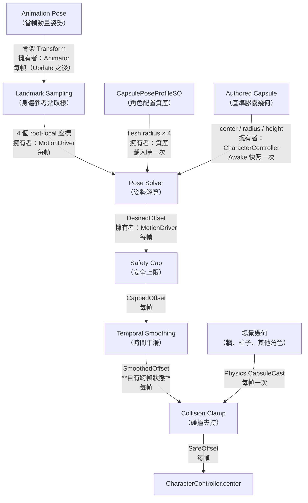
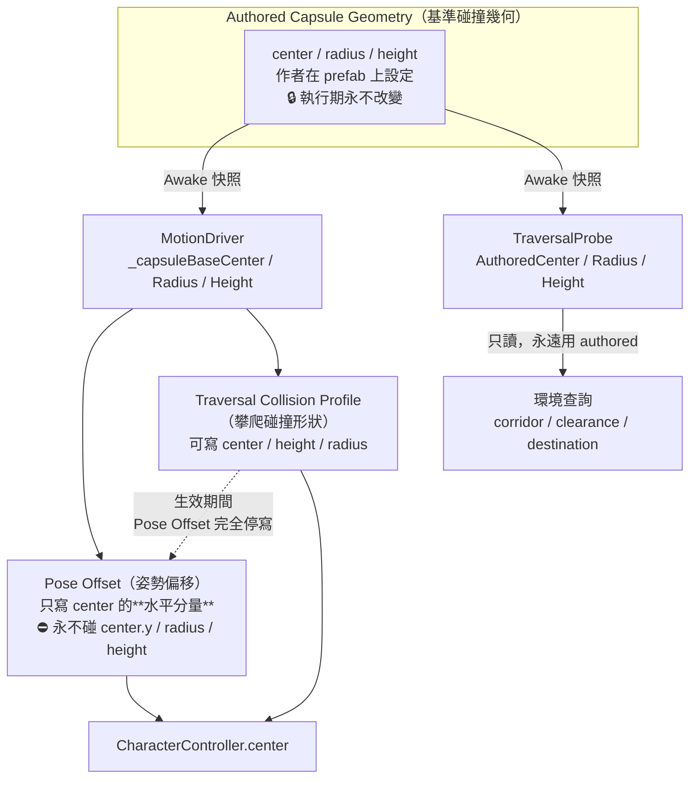

# 28 — Dynamic Capsule 架構教學（給人看的版本）

> **這份文件不是規格書。** 規格與量測證據在 `docs/27`；這裡的目標是讓你**看完能自己口頭講一次**。
>
> 假設你會 Unity 與 C#，但對 collision geometry（碰撞幾何）與 convex solver（凸集求解）不熟。
> 專有名詞第一次出現都會寫成 `English term`（中文解釋）。
>
> 對應程式：
> `Assets/Scripts/Presentation/Motion/CapsulePoseSolver.cs`、
> `CapsulePoseProfileSO.cs`、`MotionDriver.cs`、
> `Assets/Scripts/Core/Environment/TraversalProbe.cs`。

---

## 0. 一句話講完這個系統在幹嘛

> 角色跑起來的時候身體會前傾，**頭會跑到碰撞膠囊外面**，於是貼牆時看得到頭穿進牆裡。
> 這套系統每一幀看一眼角色現在的姿勢，算出「膠囊要往哪邊移動多少，才能把身體包回去」，
> 然後在不把膠囊推進牆裡的前提下，把它移過去。

就這樣。剩下的都是「怎麼算」與「誰有權力動它」。

---

## A. 整體資料流



### 每一個箭頭在傳什麼

| 箭頭 | 資料是什麼 | 誰擁有 | 更新頻率 |
|---|---|---|---|
| Pose → Sampling | 4 根骨頭的世界座標 | Unity `Animator` | 每幀，在 Update 與 LateUpdate **之間**由 Animator 寫好 |
| Sampling → Solver | 同樣 4 個點，轉成 root-local（角色自己的座標系） | `MotionDriver` | 每幀 |
| Profile → Solver | 每個參考點的 `FleshRadius` | `CapsulePoseProfileSO` 資產 | 載入時固定，執行期唯讀 |
| Authored → Solver | 基準 `center` / `radius` / `height` | `CharacterController`，由 `MotionDriver.Awake` 快照 | **一次**，之後恆定 |
| Solver → Cap | `DesiredOffset`（姿勢想要的最小修正） | `MotionDriver` | 每幀 |
| Cap → Smooth | `CappedOffset`（套 `MaxOffset` 與轉向權重之後） | `MotionDriver` | 每幀 |
| Smooth → Clamp | `SmoothedOffset` | `MotionDriver`，**這是唯一一個跨幀記憶的中間值** | 每幀 |
| 場景 → Clamp | 一次 `Physics.CapsuleCast` 的可行距離 | Unity Physics | 每幀一次 |
| Clamp → center | `SafeOffset` | `MotionDriver`（唯一寫入者） | 每幀 |

### 🔴 為什麼 Clamp 一定排在 Smoothing **後面**

`Collision Clamp`（碰撞夾持）是整條管線裡**唯一認識場景幾何的一層**。
任何排在它後面的處理，都可能把已經夾好的值再推回牆裡。

V1 的順序是 `Clamp → Smooth`，於是走向牆時：夾持把**目標**壓小了，
但平滑值還停在上一幀的大值 ⇒ **實際寫進 `center` 的數字大於安全值** ⇒ 膠囊進牆。

V2 改成 `Smooth → Clamp`，寫進 `center` 的永遠是剛剛夾過的那個值。

### 🔴 為什麼平滑器要有「自己的」狀態

`SmoothedOffset` 追的是 **CappedOffset**，**不是**夾持後的 `SafeOffset`。

如果把夾持結果餵回平滑器，牆就變成平滑狀態的**第二個 authority（決定權）**：
貼牆時平滑值被壓到接近 0，等你離開牆邊，偏移還要**重新慢慢長回來**。
現在的作法下，牆消失的**那一幀**就恢復完整偏移（測試 `CO4` 守著這件事）。

---

## B. Authority（決定權）：誰可以動膠囊

`CharacterController` 的 `center` / `radius` / `height` 是**共用可變狀態**。
三個角色想動它，必須講清楚誰在什麼時候有權力。



### 三個角色的權限表

| 角色 | 可以寫 | 不可以寫 | 什麼時候 |
|---|---|---|---|
| **Authored geometry**（基準幾何） | — | 任何東西（它是常數） | 永遠 |
| **Pose offset**（姿勢偏移） | `center.x` / `center.z` | `center.y`、`radius`、`height` | traversal 沒在跑、功能開著、沒死 |
| **Traversal collision profile**（攀爬碰撞形狀） | `center` / `height` / `radius` 全部 | — | 只在一次 traversal 執行期間 |

### 為什麼不能有兩個 writer（寫入者）

同一幀裡兩個人寫同一個欄位，**結果取決於誰後寫**——而元件的執行順序在 Unity 裡沒有保證。
那不是「偶爾會錯」，是「行為無法推理」。

更糟的是恢復：traversal 結束時會把 `center` 還原成「它開始前記下的值」。
若那個值裡混進了姿勢偏移，還原之後偏移就變成**永久的**——
而那時 traversal 已經結束，沒有任何人會把它改回來。

所以 `MotionDriver.BeginTraversalCollisionProfile` 的第一件事，就是把姿勢偏移**收乾淨**再記基準。

### 🔴 為什麼 `center.y` 不准動

改變膠囊底面的高度，就改變了 Unity 判斷「有沒有踩到地」的結果。
而 `FootIKController`（腳部 IK）的開關是**二值、沒有淡入**的——
判斷錯一次，玩家就會看到腳彈一下。所以本輪把 `center.y` 完全排除在外。
（膠囊高度確實是個真問題，見 §G 與 `docs/27` §12.6，但那是**另一個**決定。）

---

## C. 用真實的 RunFwd 從頭算到尾

以下每個數字都是從 `X Bot` 的實際資產量出來的（`Bake_RunFwdLoop`，`t = 0.198 s`，
偏移最大的那一幀）。你可以自己拿計算機驗算。

### 第 1 步：膠囊長什麼樣

```
radius R      = 0.320
height        = 1.8266
baseCenter.y  = 0.9134
上半球中心 topC = 0.9134 + (1.8266/2 − 0.320) = 1.5067
```

### 第 2 步：四個參考點現在在哪裡（root-local）

| landmark | x | y | z | 水平距離 \|q\| |
|---|---:|---:|---:|---:|
| Chest（胸，Spine1） | 0.0048 | 1.1785 | 0.1440 | **0.1441** |
| UpperChest（上胸，Spine2） | 0.0137 | 1.2608 | 0.1867 | **0.1872** |
| Neck（頸） | 0.0302 | 1.4077 | 0.2679 | **0.2696** |
| **Head（頭）** | 0.0412 | 1.4753 | 0.3375 | **0.3400** |

> 📌 注意 `y`：跑步時整個軀幹是**下沉**的（頭在 1.475，站直時是 1.599）。
> 所以這一幀四個點全部低於 `topC = 1.5067`，膠囊在這些高度都還是完整的 0.32 寬。

### 第 3 步：每個點「還剩多少活動半徑」

肉體球要完全塞進膠囊，球心離膠囊軸心的距離不能超過 `R − r`：

| landmark | flesh r | `allow = R − r` | 高度超出 `topC` 的量 dy | **ρ（可行半徑）** |
|---|---:|---:|---:|---:|
| Chest | 0.2038 | 0.1162 | 0 | **0.1162** |
| UpperChest | 0.1867 | 0.1333 | 0 | **0.1333** |
| Neck | 0.0952 | 0.2248 | 0 | **0.2248** |
| **Head** | 0.2109 | **0.1091** | 0 | **0.1091** |

（`ρ = sqrt(allow² − dy²)`；dy = 0 時就等於 allow。）

### 第 4 步：為什麼現在的膠囊包不住

膠囊現在在 `c = (0, 0)`（沒有偏移）。檢查頭：

```
頭離膠囊軸心的水平距離 = 0.3400
頭被允許的最大距離     = 0.1091
                         ─────────
超出                    = 0.2309   ← 頭有 23 公分在膠囊外
```

胸呢？`0.1441 vs 0.1162` ⇒ 也超出 0.0279。所以**不只頭，胸也有一點露出來**。

### 第 5 步：solver 解出什麼

solver 要找「離原點最近、又能同時滿足四個圓盤約束的那個 c」。
這一幀的答案是：

```
c = (0.0280, 0.2292)     |c| = 0.2309     status = Corrected     residual = 0.00000
```

**為什麼是 0.2309？** 看每個約束在這個 c 上還剩多少餘裕：

| landmark | \|q − c\| | ρ | slack（餘裕） |
|---|---:|---:|---:|
| Chest | 0.0883 | 0.1162 | −0.0279（還有空間） |
| UpperChest | 0.0448 | 0.1333 | −0.0885（還有空間） |
| Neck | 0.0387 | 0.2248 | −0.1861（還有空間） |
| **Head** | **0.1091** | **0.1091** | **±0.0000 ← 正好頂住** |

只有 **Head 頂住**，其他三個都有餘裕。
所以這一幀的答案其實很簡單：**往頭的方向移動，剛好到頭能被包住為止**：

```
需要的距離 = |q_head| − ρ_head = 0.3400 − 0.1091 = 0.2309   ✓ 完全吻合
方向       = q_head 的方向 = (0.0412, 0.3375) 正規化
```

> ⚠️ 但**不要**把這個簡化當成演算法。這一幀剛好只有一個約束在頂；
> 別的姿勢會有兩個同時頂住，那時答案就不在任何單一 landmark 的方向上。
> 「四個圓盤的交集、取離原點最近的點」才是通則。

### 第 6 步：Safety Cap（安全上限）

profile 的 `MaxOffset = 0.18`，而解出來是 0.2309 ⇒ **超過上限，要夾**：

```
c_capped = c × (0.18 / 0.2309) = (0.0218, 0.1787)     |c| = 0.1800
```

⚠️ **只縮長度，不轉方向。** 方向是姿勢決定的；上限只能少給，不能改變意圖。

夾完之後頭還露多少？`0.3400 − (往頭方向走 0.18) − 0.1091 ≈ 0.05`。
所以 cap 0.18 不是「完全解決」，是「拿掉大部分」——實測整支 RunFwd 的
上半身網格超出從 **0.204 降到 0.024，改善 88%**。

### 第 7 步：Temporal Smoothing（時間平滑）

上一幀的 `SmoothedOffset` 用 `Vector3.SmoothDamp` 往 `c_capped` 靠近，
`smoothTime = 0.12 s`（伸出去）／`0.06 s`（收回來）。

為什麼伸慢收快？**伸出去是把碰撞體推向可能有東西的地方（要保守），
收回來是脫困（要快）。**

### 第 8 步：Collision Clamp（碰撞夾持）

假設前方 0.10 m 有一面牆。從 **authored 基準位置**發一次 `Physics.CapsuleCast`，
沿偏移方向掃，問「最多能走多遠」：

```
想走 0.180，掃到 0.100 ⇒ SafeOffset = c_smoothed × (0.100 / 0.180)
```

⚠️ **cast 用的半徑刻意縮一個 `skinWidth`（0.32 → 0.29）**。
`CharacterController` 本來就允許 `skinWidth` 的互相穿透；用原半徑去掃，
角色貼著牆站定時**起點就已經重疊**，Unity 會回 `distance = 0`
⇒ 偏移直接歸零 ⇒ 退化回「貼牆就沒有偏移」的舊行為，而那正是我們要修的東西。

### 第 9 步：寫入

```csharp
characterController.center = new Vector3(
    baseCenter.x + safeOffset.x,
    baseCenter.y,                 // ⛔ 永遠是基準值
    baseCenter.z + safeOffset.z);
```

**永遠是「基準 ＋ 偏移」，不是「上一幀 ＋ 差值」。** 後者會讓浮點誤差累積成永久漂移。

### 你現在應該能口頭講一次

> 「跑步時頭跑到膠囊前面 23 公分。系統看四個身體參考點各自代表的肉球，
> 算出膠囊中心要移到哪裡才能把它們都包住——這一幀是頭在頂住，要移 23 公分。
> 但安全上限是 18 公分，所以夾到 18。再平滑、再確認前面沒有牆，最後寫進 center。」

---

## D. 為什麼 MoveDirection 是錯的（Strafe 例子）

V1 的模型是：

```
offset = normalize(MoveDirection) × MaxOffset × speed
```

白話：**「角色往哪走，膠囊就往哪偏」**。聽起來很合理。實測結果是它錯得很離譜。

### 純側移時發生什麼

```
        角色面向 ↑（螢幕上方）
        實際移動 ← 往左

   舊模型認為：                     實際姿勢：

     ┌─────┐                        ┌─────┐
     │     │                        │     │
   ◄─┤  人 │                        │  人 ├─►
     │     │  膠囊被推到左邊          │     │   身體其實往**右**微傾
     └─────┘                        └─────┘
        ↑                               ↑
     推 0.12 m                      實際偏 0.029 m（反方向）
```

`StrafeLeftLoop` 的實測：角色往**左**移動，但軀幹核心往**右**傾 0.029 m。
`StrafeRightLoop` 也是反的。

### 為什麼會這樣

Strafe（橫向移動）動畫裡，角色**面向不變、腳步橫跨**，軀幹柱幾乎不動。
身體的傾斜是**動畫自己的力學**（為了平衡橫跨的腳），**不是世界移動方向的函數**。

### 錯誤的代價有多大

| | 值 |
|---|---:|
| 純側移時上半身實際超出膠囊的量 | **0.000**（完全在裡面） |
| 舊模型推的量 | 0.12（而且方向相反） |
| ⇒ 舊模型製造的誤差 | **0.12 + 0.029 ≈ 0.149 m** |

**它在完全沒有問題的地方，製造了一個 15 公分的問題。**

而在真正有問題的地方（前向跑步需要 0.20–0.30），它只給 0.12。
**兩端都錯，而且錯的方向相反**——這就是為什麼玩家的感受是
「開了看不出效果」但「頭還是穿牆」。

### V2 怎麼避開

V2 **不看 MoveDirection**。它看骨頭在哪裡。
純側移的骨頭是站直的 ⇒ 解出來就是 0 ⇒ 不偏移。不需要任何特例。

> 📌 `MoveDirection` 在 V2 只剩一個用途：Scene view 的 gizmo 會把舊模型的目標畫成**紅色虛線**，
> 讓你親眼看到它指向哪裡。它不參與任何計算。

---

## E. Traversal 為什麼要用 base center（攀爬的例子）

### 問題現場

2026-09-15：玩家開啟動態膠囊後，**按著 W 完全無法起攀**。

```
        牆
        ║
        ║   base center（基準中心）
        ║        ●
        ║        │
        ║        └── runtime center（偏移後）
        ║             ●  ← 往前推了 0.18
        ║
   角色 root
```

`TraversalProbe`（攀爬環境探測器）要回答「角色的身體能不能從這裡爬上去」。
它會沿著 `entry → clearance → transfer → exit` 這條路徑，
**一路用角色的膠囊做重疊檢查**（`Physics.CheckCapsule`）。

問題是它當時讀的是 `characterController.center` 的**當下值**——
也就是**已經被姿勢偏移推走的那個**。於是：

```
   Probe 以為的檢查膠囊               實際該檢查的膠囊
        ║  ┌───┐                          ║ ┌───┐
        ║  │   │  ← 整條 corridor          ║ │   │
        ║  │   │     的檢查膠囊都           ║ │   │
        ║  └───┘     往前推了 0.18          ║ └───┘
        ║  ↑ 撞進牆裡                       ║   ↑ 剛好通過
```

結果：`CorridorBlocked`（通道被擋）。而這個 reject 是
`TraversalEntryPolicy.Evaluate` 的**第一個** return
⇒ 距離、朝向這些判斷**根本沒被執行到**。

### 當時的誤判

第一版歸因是「站位退後 0.18 m，吃掉了起攀合法帶」。**那是錯的**：
Climb 的 entry 合法帶是 `[0.06, 0.81] m`，退後後的站位仍然在帶內，
而且比原本**更接近**理想的 0.462。

怎麼證明的？三個情境的對照實驗（現在是正式測試 `TR1`）：

| 情境 | root 到牆的距離 | 結果 |
|---|---:|---|
| baseline（不偏移） | 0.35 | `Climb2m` ✅ |
| **offset-on**（偏移 0.18） | **0.53** | `CorridorBlocked` ❌ |
| **control（站同一個位置 0.53，但 center 不偏移）** | **0.53** | `Climb2m` ✅ |

**同一個站位，相反的結果** ⇒ 站位不是原因，`center` 才是。

### 修法

`TraversalProbe` 在 `Awake` 把 `center` / `radius` / `height` **快照一份**，
之後所有環境查詢都用那份。

```
Authored Capsule Geometry（角色基準碰撞幾何）
        │
        ├── TraversalProbe ── 永遠用這份（環境查詢問的是「你的身體」，不是「你現在被推到哪」）
        │
        └── Runtime Capsule ── 可被 pose offset / traversal profile 暫時修改
```

🔒 **不變量**：authored geometry 初始化之後，不得被任何動態偏移改寫。
由 `TR1`（行為）與 `TR2`（欄位）兩條測試守住。

> ⛔ 刻意**不**讓 `TraversalProbe` 去問 `MotionDriver` 要這個值：
> `TraversalProbe` 在 Core 層，`MotionDriver` 在 Presentation 層，那樣會把依賴方向反轉。
> 兩邊各自快照同一個 authored 常數——**那不是兩個 writer，是兩個 reader 讀同一個不變量。**

---

## F. 什麼是 Flesh Radius（肉體半徑）

這是整套系統最容易誤會的一個概念。

### 三個不同的東西

```
        bone point（骨骼點）＝ 一個純數學上的點，沒有體積
              ●
             ╱ ╲
            ╱   ╲          mesh surface（網格表面）＝ 玩家真正看到的皮膚
           │  ●  │  ←──── 骨骼點在這裡
           │     │
            ╲   ╱
             ╲ ╱
              ─

        flesh radius（肉體半徑）＝ 把這團肉近似成一顆球，球要多大才包得住
              ●────────► r
             ╱ ╲
            ╱   ╲
           │  ●  │
           │     │
            ╲   ╱
             ╲ ╱
```

- **bone point**（骨骼點）：`Animator.GetBoneTransform(HumanBodyBones.Head).position`。
  它是關節的位置，**沒有厚度**。
- **mesh surface**（網格表面）：`SkinnedMeshRenderer` 蒙皮後的頂點。玩家看到的是這個。
- **flesh radius**（肉體半徑）：從骨骼點到「以它為 dominant bone（主要影響骨骼）的所有網格頂點」
  的**最大距離**。離線量一次，寫進 profile 資產。

### 為什麼 Head 骨骼只超 8 cm，網格卻能超 27 cm

因為 **Head 這根骨頭在顱底，不在臉上也不在頭頂**：

```
              ╭──────╮   ← 頭頂（離 Head 骨骼約 0.22）
             ╱        ╲
            │   👁 👁   │  ← 臉（往前突出）
            │    ▼     │
             ╲   ●    ╱   ← Head 骨骼在這裡（顱底）
              ╰──┬───╯
                 │
               Neck
```

`r[Head] = 0.2109` ——**這顆球要把整個頭骨包住，所以半徑很大**。

於是：
- 只看骨骼點 ⇒ 「Head 在膠囊裡，沒問題」
- 看網格 ⇒ 「臉和頭頂在膠囊外 27 公分」

> 🔴 **這正是 2026-09-15 那次錯誤結論的根因**：用骨骼點當代理量去回答一個網格問題，
> 低估了 3–10 倍，於是得出「不需要 dynamic capsule」。詳見 `docs/27` §11 的作廢說明。

### 為什麼是「一次量測」就夠

蒙皮是剛性的：`Head` 的頂點相對 `Head` 骨骼的位置**不隨姿勢改變**（它們跟著骨頭一起轉）。
所以「骨骼到自己頂點的最大距離」是一個**姿勢無關的常數**，離線量一次就對一輩子。
**換模型就要重量**——這就是它必須是資產而不是硬寫死的原因。

### 實測值

| landmark | X Bot（Beta 網格） | Y Bot（Alpha 網格） |
|---|---:|---:|
| Chest（Spine1） | 0.2038 | **0.2902** |
| UpperChest（Spine2） | 0.1867 | 0.2095 |
| Neck | 0.0952 | 0.1028 |
| Head | 0.2109 | 0.2060 |

⚠️ 兩隻差很多（Chest 差 42%）——**所以它們各有一份 profile，不能共用。**

---

## G. 膠囊的高度剖面：為什麼 `radius = 0.32` 不代表處處 0.32

這是第二個最容易誤會的地方。

```
              ╭─────────╮  ← 膠囊頂端 y = 1.8267
             ╱           ╲          這裡的水平寬度 ≈ 0
            │             │ ← 上半球中心 y = 1.5067
            │             │    ↑ 從這裡往上，寬度開始縮
            │             │
            │  cylinder   │ ← 圓柱段：寬度恆為 radius = 0.32
            │   region    │
            │  （圓柱段）  │
            │             │
            │             │ ← 下半球中心 y = 0.3201
             ╲           ╱
              ╰─────────╯  ← 膠囊底端 y = 0.0001
```

膠囊 = 一個圓柱 + 上下各一個半球。**只有圓柱段是 `radius` 那麼寬。**

在半球區域，某個高度 `y` 的水平可用半徑是：

```
Reff(y) = sqrt( radius² − (y − topC)² )        （y 高於上半球中心時）
```

### 實測：各高度到底有多寬

| 位置 | 站直時的 y | 該高度的可用半徑 |
|---|---:|---:|
| Chest | 1.2435 | 0.320（圓柱段） |
| UpperChest | 1.3357 | 0.320（圓柱段） |
| Neck | 1.5031 | 0.320（剛好在邊界） |
| **Head（顱底）** | 1.5993 | **0.306** |
| **顱頂** | 1.8196 | **0.067** ← 幾乎沒有空間 |

⇒ **角色的頭整顆活在上半球裡，而膠囊頂端剛好切在頭頂。**

### 這造成兩個後果

1. **solver 必須知道這件事。** 如果它拿 0.32 當所有高度的寬度，
   對頭部的要求就會鬆掉約 1.4 公分，解出來的偏移不夠。
   測試 `CP12` 專門守這條：同一個水平位置放高一點，需要的偏移必須變大。

2. **有些 landmark 根本塞不進去。** Head 的 `allow = 0.32 − 0.2109 = 0.1091`，
   所以只要頭高過 `topC + 0.1091 = 1.6158`，**水平怎麼移動都塞不下**。
   solver 遇到這種會把它**略過**並計入 `SkippedLandmarks`
   ——那是在說「這是 radius／height 的問題，別再靠加大偏移去追」。

> 📌 **反例（別再試）**：曾嘗試把頭部錨點從 `Head` 關節上移到
> `mid(Head, HeadTop_End)`（y = 1.709），期待更貼合。結果**需求反而變大**
> （Sprint 0.296 → 0.354）——因為 `y = 1.709` 深入上半球，可行半徑直接歸零。
> **膠囊變窄的速度比 flesh radius 縮小的速度快 ⇒ 錨點要往低放，不是往高放。**

---

## H. 類別責任表

| Class（類別） | 中文責任 | 可以做什麼 | ⛔ 不可以做什麼 |
|---|---|---|---|
| `CharacterController`（Unity 內建） | 角色的實體碰撞膠囊 | 提供 `center`/`radius`/`height`/`Move()`；判斷接地 | 它自己不知道 authored 值是什麼——執行期被改了就回不去，所以要有人快照 |
| `MotionDriver`（位移驅動器） | 角色位置與碰撞形狀的**唯一寫入者** | 取樣 landmark、呼叫 solver、平滑、夾持、寫 `center`；管理 traversal profile 的開始與還原 | ⛔ 不得寫 `center.y`；⛔ 不得在 traversal profile 生效時寫 `center`；⛔ 不得讀場景幾何以外的 gameplay 狀態來決定偏移 |
| `CapsulePoseProfileSO`（角色膠囊姿勢配置） | **資料**：這隻角色的 landmark 與肉體半徑 | 宣告要取樣哪些骨頭、各自的 `FleshRadius`、`MaxOffset`、平滑參數、死亡 guard | ⛔ 不得含任何邏輯；⛔ 不得被多隻**網格不同**的角色共用；⛔ 不放 `Enabled`（那是場景佈署決定） |
| `CapsulePoseSolver`（姿勢解算器） | **純函式**：姿勢 → 最小必要偏移 | 幾何運算、回傳 offset 與診斷 | ⛔ 不得碰 Unity 物件、不得查 Physics、不得讀時間、⛔ 不得配置記憶體（零 GC） |
| `TraversalProbe`（攀爬環境探測器） | 用**基準身體**探測環境能不能爬 | 讀 `AuthoredCenter/Radius/Height` 做 raycast 與 capsule check | 🔴 ⛔ **不得讀 live `characterController.center`**；⛔ 不得依賴 `MotionDriver`（跨層） |
| `TraversalCollisionProfile`（攀爬碰撞形狀） | traversal 執行期的膠囊形狀曲線 | 在 traversal 期間獨佔 `center`/`height`/`radius` | ⛔ 不得在 traversal 之外生效；⛔ 還原時不得把姿勢偏移一起還原成永久值 |
| `RuntimeDebugPanel`（執行期除錯面板） | **遙控器**：切換既有可視化 | 翻既有元件上的 `bool` 旗標 | ⛔ 不計算、不打 ray、不讀黑板、不持有狀態。把它刪掉，旗標維持原樣 |

---

## I. 每個主要欄位的中文說明

### `CapsulePoseProfileSO`（資產上的欄位）

| 欄位 | 中文 | 說明 |
|---|---|---|
| `Landmarks[].Bone` | 參考骨骼 | 用 `HumanBodyBones` 而不是字串，換 rig 不會因命名慣例不同而失效 |
| `Landmarks[].FleshRadius` | 肉體半徑 | 這個關節周圍代表的網格厚度（公尺）。**量出來的物理事實，不是手感旋鈕**。換模型必須重量 |
| `Landmarks[].Enabled` | 是否參與 | 實驗某個點的影響用；不要當成常態關閉手段 |
| `MaxOffset` | **最大水平偏移安全上限** | 🔴 **是上限，不是驅動量。** 不是「跑步就推 0.18」，是「解出多少用多少，但最多 0.18」 |
| `SmoothTime` | 伸出平滑時間 | 偏移變大時的 `SmoothDamp` 時間常數（秒） |
| `ReleaseSmoothTime` | 收回平滑時間 | 偏移變小時。刻意比上面短：**伸出要慢（安全），收回要快（脫困）** |
| `MaximumTurnRateDegreesPerSecond` | 轉向權重上限 | 角速度超過這個值時偏移權重降到 0。擋的是「原地快速轉身時，偏移出去的膠囊繞 root 掃出的弧線」——那個方向 clamp 沒有掃過 |
| `ApplyWhileDead` | 死亡時是否仍套用 | 預設關。倒地姿勢下「上半身佔用位置」與站立膠囊已不是同一回事 |

### `MotionDriver`（執行期狀態，debug 面板看得到）

| 欄位 | 中文 | 說明 |
|---|---|---|
| `BaseCenter` | 基準膠囊中心 | 作者設定的值，`Awake` 快照。🔒 執行期永不改變 |
| `DesiredOffset` | 姿勢解算希望的偏移 | solver 的原始輸出，**還沒**套上限 |
| `CappedOffset` | 套上限後的偏移 | 與 Desired 的差 ＝ **`MaxOffset` 吃掉了多少** |
| `SmoothedOffset` | 平滑後的偏移 | 跨幀狀態。與 Capped 的差 ＝ 平滑滯後 |
| `SafeOffset` | 碰撞限制後允許的偏移 | 與 Smoothed 的差 ＝ **牆吃掉了多少** |
| `CurrentOffset` | 目前實際使用的偏移 | 真正寫進 `center` 的。與 Safe 不同 ⇒ 有第三個寫入者 |
| `CapsuleSolveResult.Status` | 解算狀態 | `Neutral`（本來就包得住）／`Corrected`（解到了）／`Infeasible`（約束衝突，見下）／`InvalidInput` |
| `CapsuleSolveResult.Residual` | 殘餘超出 | ≤0 ＝ 全部包住 |
| `CapsuleSolveResult.SkippedLandmarks` | 被略過的參考點數 | >0 ⇒ **這是 radius／height 的問題**，加大偏移救不了 |

### Debug 面板的五個圓環

| 顏色 | 代表 | 怎麼讀 |
|---|---|---|
| 灰 | Base（基準） | 永遠在 root 正下方 |
| 黃 | Desired | 黃離灰多遠 ＝ 身體前傾多少 |
| 橙 | Capped | 黃 ≠ 橙 ⇒ **上限吃掉了多少** |
| 青 | Smoothed | 橙 ≠ 青 ⇒ 平滑滯後 |
| 洋紅 | Safe（實際寫入） | 青 ≠ 洋紅 ⇒ **牆吃掉了多少** |

五圈重合在灰圈上 ＝ 偏移為 0。**那不是壞掉，那是「姿勢站直，不需要偏移」。**

---

## J. 錯誤理解 vs 正確理解

```
❌ 角色往哪走，capsule 就往哪偏
✅ capsule 應跟著角色主要身體實際佔用的位置
   （純側移往左走，身體其實往右微傾——往左推是把問題製造出來）
```

```
❌ bone 在 capsule 內，所以 mesh 一定在裡面
✅ bone 是關節點，模型表面可以離 bone 很遠
   （Head 骨骼超出 8 cm，Head 網格超出 27 cm——差 3 倍以上）
```

```
❌ radius = 0.32，整顆角色從腳到頭都是 0.32 寬
✅ capsule 頂部是半球，越高越窄
   （頭高只有 0.306，顱頂只剩 0.067）
```

```
❌ TraversalProbe 應該使用現在的 CharacterController.center
✅ Traversal environmental query 要使用 authored / base geometry
   （環境查詢問的是「你的身體能不能過」，不是「你現在被動畫推到哪」）
```

```
❌ MaxOffset = 0.18 表示跑步時會往前推 0.18
✅ MaxOffset 是安全上限；實際值由姿勢解算決定
   （Walk 解出 0 就是 0；Run 解出 0.231 才會被夾到 0.18）
```

```
❌ 解出來就直接寫進 center
✅ 還要過平滑與碰撞夾持，而且夾持必須是最後一步
   （夾持是唯一認識場景的一層；排在它後面的都可能把膠囊推回牆裡）
```

```
❌ 找最外面那個點，往它推
✅ 找「能同時包住所有點、離原點最近」的那個位置
   （前者是 argmax，當「最外面的是誰」換人時會跳變；後者是凸集投影，連續）
```

```
❌ Infeasible 代表 solver 壞了
✅ Infeasible 代表膠囊尺寸不夠，四個約束互相衝突
   （加大偏移救不了；那是 radius / height 的取捨，見 §G）
```

---

## K. 目前的已知邊界（別當成 bug）

| 現象 | 為什麼 | 該怎麼辦 |
|---|---|---|
| Sprint 時仍有約 **9 cm** 上半身露在外面 | cap 0.18 刻意不追到底——追到底需要 0.30，而膠囊底部支撐點會跟著前移 0.30（站在平台邊緣會出現「看起來踩空卻站著」） | 這是 §G 的膠囊高度問題，要用 `center.y`／`height` 解，**不是**繼續加大 `MaxOffset` |
| Sprint 有部分幀回報 `Infeasible` | Head 的 `allow` 只有 0.109，四個約束偶爾無解 | 已實測**不會抖**（最大 0.71 m/s，平滑器綽綽有餘）。它是資訊，不是錯誤 |
| Y Bot 幾乎整段都 `Infeasible` | 它的 Chest flesh radius 是 **0.2902**，`allow` 只剩 0.0298——**它的胸膛本來就快把膠囊塞滿** | 要嘛加大 Y Bot 的 radius，要嘛接受。**不要**為了讓它「不 infeasible」去調小 flesh radius——那是竄改量測值 |
| 下半身（臀／大腿）在衝刺時露在外面 | **偏移之前就有**（cap = 0 時就有 0.111–0.125）。那是後擺的腿，本來就不該被膠囊包住 | 不處理。硬包會讓角色在門框卡住 |

---

## L. 想自己重跑量測時

所有量測都是用完即丟的 `unity cmd eval_file` 探針，**沒有進版控**
（依 CLAUDE.md「Editor Tool vs Documented Process」：一次性、不重複 ⇒ 不建工具，改記錄流程）。
重跑時照 `docs/27` §12.1，並注意三個坑：

1. **Animator 在 `Model` 子物件上**，不是 prefab root（root 上只有 `CharacterController`）。
2. **humanoid clip 的 root motion 被烘在 hips 裡** ——不去趨勢的話，Sprint 會量到
   「質心前移 4.16 m」（那是位移不是傾斜）。去趨勢要用**首尾質心差**，
   用 `clip.averageSpeed` 會殘留誤差。
3. **`HeadTop_End` 不參與蒙皮** ——它是 leaf marker，顱頂的頂點全部歸在 `Head` 區。

---

## 相關文件

- `docs/27-pose-driven-capsule-study.md` —— 量測證據與設計決策的正本（§11 已作廢，看 §12）
- `docs/24` §19 —— traversal entry 合法帶的實錄數字
- `Assets/_Project/Tests/EditMode/CapsuleOffsetTests.cs` —— solver 與 driver 的不變量（CP／CD）
- `Assets/_Project/Tests/PlayMode/CapsuleOffsetPlayModeTests.cs` —— 執行期管線（CO）
- `Assets/_Project/Tests/PlayMode/TraversalAuthoredGeometryTests.cs` —— authored geometry 不變量（TR）
