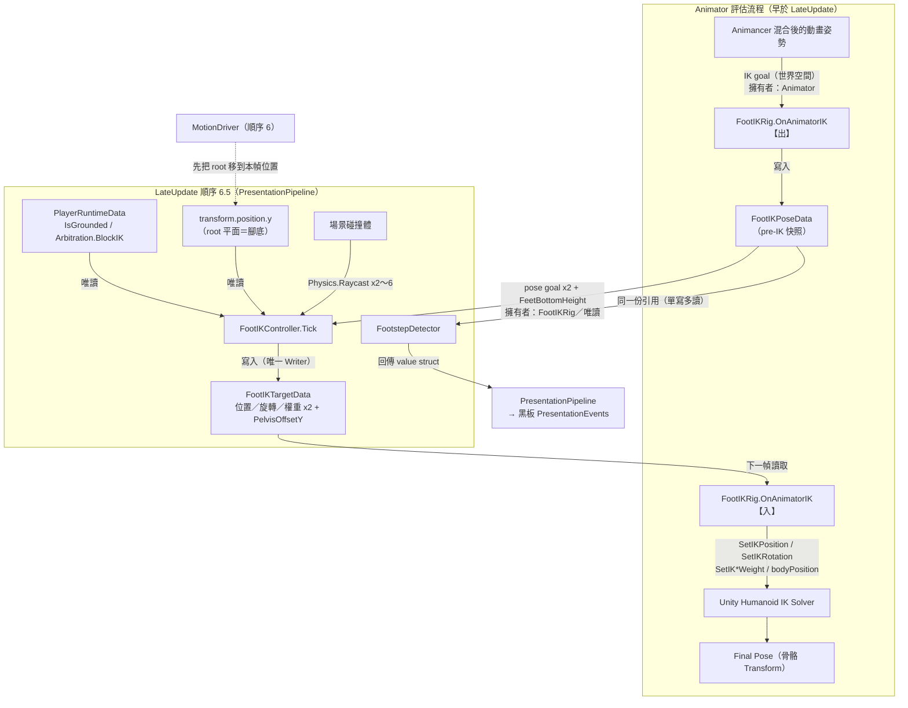
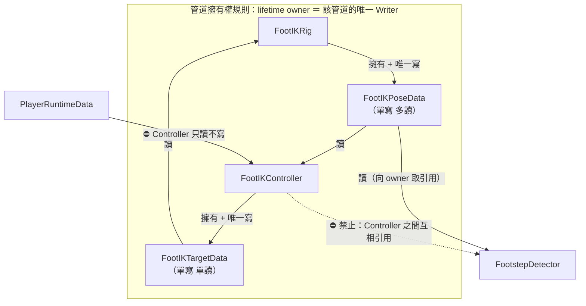

# 29 — Foot IK 架構理解指南（給人看的版本）

> **這份文件不是規格書。** 規格與歷史實驗紀錄在 `docs/05-foot-ik.md`；
> 這裡的目標是讓你**看完能自己口頭講一次**、能預測資料怎麼流、能在看到 bug 時說出「這是哪一層的問題」。
>
> 對應程式：
> `Assets/Scripts/Presentation/IK/FootIKController.cs`（決策）、
> `FootIKRig.cs`（轉接）、`FootIKPoseData.cs`／`FootIKTargetData.cs`（兩條管道）、
> `FootIKSettings.cs`（參數）、`Assets/Scripts/Presentation/Footstep/FootstepDetector.cs`（第二個 Pose 讀取者）。
>
> 本文所有數字若無特別註明，皆為 **2026-09-15 由 `X Bot.prefab` 與其 Avatar 實測**（探針用完即刪）。

---

## 0. 一句話講完這個系統在幹嘛

> 動畫是在**平地**上錄的，但遊戲裡的地面不是平的。
> 這套系統每一幀問地面「你在哪、朝哪」，然後把**腳踝**搬到正確高度、把**腳掌**轉到貼合坡面，
> 並在雙腳踩到不同高度時讓**骨盆下沉**去遷就比較低的那隻腳。
>
> 它**只改看得到的骨頭**。角色站在哪裡、能不能跳、有沒有踩到地，**完全不歸它管**。

最後那句是這整個系統最容易被誤解的地方，§C 整節在講它。

---

## A. 七個階段（這是理解本系統的骨架）

每一幀，一隻腳會依序經過七個階段。**它們是七件不同的事，有各自的擁有者與座標空間**——
把任兩個混為一談，就是這個子系統歷史上所有嚴重 bug 的來源。

| # | 階段 | 中文 | 這一階段回答什麼問題 | 誰算的 | 在哪一個時間窗 |
|---|---|---|---|---|---|
| 1 | **Animation Foot Goal** | 動畫腳目標 | 「**如果沒有地形**，動畫想把腳踝放在哪、轉成什麼角度？」 | `Animator`（Animancer 混合後） | `OnAnimatorIK` 開頭，**IK 套用之前** |
| 2 | **Ground Observation** | 地面觀測 | 「那個位置正下方，地面在哪、法線朝哪？」 | `FootIKController`（`Physics.Raycast`） | 順序 6.5（LateUpdate） |
| 3 | **Ankle / Base Target** | 腳踝基準目標 | 「腳底要貼在那個命中點上，**腳踝**該放在哪？」 | `ComputeAnkleTarget`（純函式） | 同上 |
| 4 | **Heel / Toe relationship** | 腳跟／腳尖關係 | 「照第 3 步放好之後，**腳掌的兩端**有沒有戳進地裡？」 | `ComputePenetrationLift`／`ComputeSoleHeight`（純函式） | 同上 |
| 5 | **Rotation / Surface Normal** | 旋轉／地面法線 | 「腳掌要轉多少才貼合坡面？踝關節轉得過去嗎？」 | `ClampGroundNormal` ＋ `Quaternion.FromToRotation` | 同上 |
| 6 | **IK Application** | IK 套用 | 「把目標與權重交給動畫系統」 | `FootIKRig` → `Animator.SetIK*` | **下一幀**的 `OnAnimatorIK` 結尾 |
| 7 | **Final Pose** | 最終姿勢 | 「解算後骨頭實際在哪」 | Unity Humanoid IK solver | 下一幀 Animator 評估完 |

### 🔴 為什麼「1」與「7」必須是兩個不同的東西

第 7 步的骨頭位置，是第 6 步的**輸出**。
如果第 1 步（輸入）改成去讀骨頭的 `Transform.position`，那就是 **output → input 的反饋迴路**。

這不是理論風險，是**本專案發生過的 bug**：M3 時期腳踝抽搐／腳黏在地上（changelog v0.18.1）。
修法就是 `FootIKPoseData` 這條管道的存在理由——`FootIKRig` 在 `OnAnimatorIK` 的**最開頭**、
還沒套任何 IK 之前，用 `GetIKPosition/GetIKRotation` 把「乾淨的動畫 goal」拍一張快照，
`FootIKController` 一律只讀那張快照。

> 📌 **這條是本子系統的第一鐵律：Controller 的任何輸入都不得來自骨骼 Transform 現值。**

---

## B. 整體 runtime data flow



### 每一條主要箭頭在傳什麼

| 箭頭 | 資料是什麼 | 擁有者（唯一 Writer） | 座標空間 | 更新時機 | 跨幀狀態？ |
|---|---|---|---|---|---|
| Animator → `FootIKPoseData` | 左右腳 IK goal 的**位置＋旋轉**；外加 Avatar 常數 `FeetBottomHeight` ×2 | `FootIKRig` | **世界空間** | 每幀 `OnAnimatorIK` 開頭（早於 LateUpdate） | ❌ 每幀整組覆寫。唯一跨幀的是 `IsWarm`（首次寫入後恆 true） |
| `FootIKPoseData` → Controller | 同上，唯讀 | — | 世界空間 | 順序 6.5 讀，**是本幀的新鮮值** | — |
| `FootIKPoseData` → `FootstepDetector` | 同一份引用（**單寫多讀**） | — | 世界空間 | 順序 6.5 | 偵測器自持 `FootPlantTracker`（跨幀），但不寫快照 |
| 黑板 → Controller | `IsGrounded`（bool）、`Arbitration.BlockIK`（bool） | `MotionDriver` ／ `ArbiterPipeline` | — | Controller 只讀 | ⚠️ `IsGrounded` 讀到的是**上一幀 `Move()` 之後**的結果（見 §C） |
| root transform → Controller | `transform.position.y` ＝ 角色腳底平面 | `MotionDriver`（位置的唯一寫入者） | 世界空間 | 順序 6 已更新，所以 6.5 讀到的是**本幀**的新位置 | — |
| 場景 → Controller | 每腳 1～3 次 `Physics.Raycast` 的命中點與法線 | Unity Physics | 世界空間 | 每幀 | ❌ 不快取、不濾波 |
| Controller → `FootIKTargetData` | 位置／旋轉／位置權重／旋轉權重 ×2，＋ `PelvisOffsetY` | `FootIKController` | **世界空間**（`PelvisOffsetY` 是純量，公尺） | 每幀整組覆寫 | ✅ **權重與 `PelvisOffsetY` 是跨幀的**——用 `MoveTowards` 從上一幀往目標走 |
| `FootIKTargetData` → Rig | 同上，唯讀 | — | 世界空間 | **下一幀** `OnAnimatorIK` | — |
| Rig → Animator | `SetIKPosition/Rotation/Weight` ＋ `bodyPosition += up * PelvisOffsetY` | `FootIKRig` | 世界空間 | 下一幀 | ❌ `bodyPosition` 每幀由動畫重算，疊加**不累積** |

### 跨幀狀態總表（整個子系統只有這四項）

| 跨幀的東西 | 持有者 | 為什麼需要跨幀 | 弄丟會怎樣 |
|---|---|---|---|
| 四個權重（左右腳 × 位置／旋轉） | `FootIKTargetData`（Controller 寫） | 權重必須平滑收斂，否則 IK **瞬切**，玩家看到腳彈一下 | 每次踩地／抬腳都跳變 |
| `PelvisOffsetY` | `FootIKTargetData`（Controller 寫） | 骨盆瞬移比腳瞬移更明顯 | 上下樓梯骨盆抽動 |
| `FootIKPoseData.IsWarm` | `FootIKRig` | 區分「全零是因為還沒寫過」與「真的是零」 | 開場第一幀拿全零座標去打 raycast |
| `FootPlantTracker` ×2 | `FootstepDetector` | Schmitt trigger 的上膛／擊發狀態 | 腳步聲在速度抖動時連發 |

> 📌 **除此之外沒有任何跨幀記憶。** 腳的**位置目標刻意不平滑**——
> 位置的連續性由「raycast 對連續地形連續」保證；台階邊緣的目標跳變由**權重**平滑吸收。
> 這是刻意的分工：平滑一個會瞬移的量，只會把瞬移變成滑移。

---

## C. 🔴 三個「接地」不是同一個 authority

這是本子系統**最重要的一節**。三個東西聽起來都在講「腳有沒有踩到地」，但它們是三個不同的權威，
服務三個不同的問題，而且**可以互相矛盾，那是正常的**。

| | ① Gameplay Grounded | ② Physics Observation | ③ Visual IK Correction |
|---|---|---|---|
| **是什麼** | `PlayerRuntimeData.IsGrounded` | `FootIKController` 每幀打的 `Physics.Raycast` | `FootIKTargetData` 的目標＋權重 |
| **誰寫** | `MotionDriver.SyncGroundedState()`（唯一） | 沒有人「寫」——一次查詢，用完即丟 | `FootIKController`（唯一） |
| **真相來源** | `CharacterController.isGrounded`（**整顆膠囊**） | 該條射線在該一幀的命中 | 前兩者的函數 |
| **粒度** | 整個角色一個 bool，**不分左右腳** | 單點、單幀 | 每腳一組 |
| **它決定什麼** | 能不能起跳、要不要套重力、落地事件 | 什麼都不決定，只是資訊 | 骨頭畫在哪裡 |
| **它不決定什麼** | 腳畫在哪裡 | ⛔ **不改變 ①** | ⛔ **不改變 ①，也不改變角色位置** |
| **時序** | 上一幀 `Move()` 之後的結果 | 本幀 | 本幀算、**下一幀**生效 |

### 三者如何互動（程式裡就這一行）

```csharp
bool ikAllowed = data.IsGrounded && !data.Arbitration.BlockIK;
```

① 是 ③ 的**閘門**，② 是 ③ 的**輸入**。反過來一律不成立：

- ⛔ IK 的 raycast 打到地面，**不會**讓 `IsGrounded` 變 true。
- ⛔ 骨盆下沉 0.35 m，**不會**讓膠囊變矮、**不會**改變接地判定。
- ⛔ 腳被 IK 拉低 0.2 m，角色的**位置一個公釐都不會動**。

### 為什麼刻意這樣切

如果讓 IK 的觀測回頭改變 gameplay grounded，就會有兩個 `IsGrounded` 的來源，
而它們必然在某些幀不一致（膠囊還浮著、但腳尖的 ray 打到了台階）。
那時「角色能不能跳」會取決於**元件執行順序**——那不是偶爾會錯，是**行為無法推理**。

### 這個切法產生的三個「看起來像 bug，其實是設計」的現象

| 現象 | 真正原因 | 屬於哪一層 |
|---|---|---|
| 起跳的那一幀腳突然回到動畫姿勢 | `IsGrounded` 一翻 false，`ikAllowed` 立刻 false ⇒ 權重開始往 0 走 | ①，刻意 |
| 站在台階邊緣，骨盆沉下去了，但角色看起來浮在邊緣 | 膠囊高度不隨骨盆變動——IK 是純視覺層 | ①③ 的邊界，已定義的天花板（`docs/05` §3.5.2 灰色地帶） |
| 斜坡上 `IsGrounded` 一直 true，但某隻腳的 ray 沒打到東西 | ② 是單點查詢，會落空；落空不代表沒接地 | ②，程式刻意**保留 ankle-only 結果而不關 IK** |

---

## D. Authority / Ownership 圖



### 權限表

| 角色 | 可以讀 | 可以寫 | ⛔ 絕對不可以 |
|---|---|---|---|
| `FootIKRig` | `Animator` 的 `GetIK*`／`feetBottomHeight`；`FootIKTargetData` | `FootIKPoseData`；`Animator` 的 `SetIK*`／`bodyPosition` | 打 raycast、讀黑板、判定 plant/lift、任何決策分支 |
| `FootIKController` | `FootIKPoseData`、黑板（`IsGrounded`／`BlockIK`）、`transform.position`、Physics | `FootIKTargetData` | ⛔ 讀骨骼 `Transform`（反饋迴路）；⛔ 寫黑板；⛔ 寫 `CharacterController`；⛔ 引用其他 `IPresentationController` |
| `FootstepDetector` | `FootIKPoseData`（向 `FootIKRig.PoseData` 取）、黑板 | 只有自己的 `FootPlantTracker` | ⛔ 寫黑板（它**回傳** struct，由 pipeline 寫）；⛔ 從 `FootIKController.PoseData` 取引用 |
| `PresentationPipeline` | 全部 controller 與 event source | 黑板的 `PresentationEvents` 區（唯一 Writer） | 做輸出仲裁（目前刻意沒有） |
| `MotionDriver` | — | `IsGrounded`／`VerticalVelocity`／`JustLanded`／角色位置 | ⛔ 碰任何 IK 資料 |

### 「最終決定權」在誰手上

**畫面上腳最後在哪裡，決定權在 Unity 的 Humanoid IK solver，不在我們。**
我們給的是**目標＋權重**，solver 在腿長可達範圍內盡量靠近。
所以當你看到「腳沒有到我要的位置」時，先問的不是「Controller 算錯了嗎」，
而是「**這個目標腿搆得到嗎**」。

---

## E. 類別責任表：可以做什麼 / 不可以做什麼

| Class | 中文責任 | ✅ 可以做 | ⛔ 不可以做 |
|---|---|---|---|
| `FootIKRig` | **Presentation Adapter**（動畫系統邊界上的雙向純轉接器） | 出：拍 pre-IK 快照；入：把 Target 原樣賦值進 Animator | ⛔ 任何決策分支（null 防護除外）；⛔ raycast；⛔ 讀黑板；⛔ 解讀自己寫的快照 |
| `FootIKController` | **決策端**：地面觀測 → 目標與權重 | raycast、幾何解算、權重與骨盆的平滑 | ⛔ 讀骨骼 Transform；⛔ 寫黑板或膠囊；⛔ 呼叫 Rig 的任何方法（執行期兩者只靠共享資料溝通） |
| `FootIKTargetData` | Controller → Rig 的**單向管道** | 以「值」表達語意（權重 0 ＝ 這隻腳不套 IK） | ⛔ 含任何邏輯；⛔ 進黑板（IK 目標是表現層內部產物，不是玩法契約） |
| `FootIKPoseData` | Rig → 各讀取者的**單向管道** | 承載 pre-IK goal ＋ Avatar 常數 | ⛔ 被 Rig 以外的任何人寫 |
| `FootIKSettings` | **純資料容器** | 集中所有可調參數 | ⛔ 含邏輯 |
| `FootstepDetector` | 落腳**事件**偵測（第二個 Pose 讀取者） | 自持跨幀 tracker、回傳 value struct | ⛔ 寫黑板；⛔ raycast；⛔ 讀 post-IK 位置（聲音會跟著地形漂移） |
| `PresentationPipeline` | 順序 6.5 的驅動者 ＋ 事件區唯一 Writer | 先驅動全部 controller，**再**統一發布事件 | ⛔ 做輸出仲裁（誰控制同一根骨頭）——那是未來的 ADR |

### 四個純函式（可獨立測試，這是它們被抽出來的理由）

| 函式 | 回答什麼 |
|---|---|
| `ComputeFootWeight(footHeightAboveRoot, min, max)` | 這隻腳現在是踩地相還是抬腳相 |
| `ClampGroundNormal(hitNormal, maxAngle)` | 踝關節轉得過去的最大對齊量 |
| `ComputeAnkleTarget(rayStart, hitPoint, hitNormal, bottomHeight)` | 腳底貼住命中點時腳踝在哪（泰勒斯修正，移植自 ozz-animation `foot_ik`） |
| `ComputeSoleHeight(...)` / `ComputePenetrationLift(...)` | 腳掌兩端戳進去多少、抬升後腳底平面在哪。**這支的連續性有專屬回歸測試**，見 §I |

---

## F. 關鍵 ordering constraint（哪些順序不能交換）

| # | 約束 | 交換之後會發生什麼 | 守在哪裡 |
|---|---|---|---|
| **O1** | `OnAnimatorIK` 裡**【出】必須在【入】之前** | 快照會拍到自己剛套上去的 IK 結果 ⇒ `output → input` 反饋迴路 ⇒ **腳踝抽搐／腳黏地**（實際發生過，changelog v0.18.1） | `FootIKRig.OnAnimatorIK` 的程式順序；`docs/05` §3.5.2 反饋禁令 |
| **O2** | Controller 的 Tick（順序 **6.5**）必須在 `MotionDriver`（順序 **6**）**之後** | root 還停在上一幀的位置 ⇒ `rootY` 與 raycast 原點都落後一幀 ⇒ **高速移動時腳往後拖** | `CharacterPipelineRunner.LateUpdate` |
| **O3** | `PresentationPipeline` 必須「**先驅動全部 controller，再發布事件**」 | 同一幀的 consumer 讀不讀得到事件，取決於 `GetComponentsInChildren` 的回傳順序＝**Hierarchy 誰被拖在上面** ⇒ 把拖動物件變成正確性條件 | `PresentationPipeline.Tick` 的兩段式 |
| **O4** | `lift` 必須**先算出來**，`TargetPosition` 與 `GroundY` 再**共用同一份** | 兩邊各算一次會漂移；更糟的是有人改用另一種取法 ⇒ 就是 §I 的 bug | `ComputeSoleHeight(..., out float lift)` 同行回傳 |
| **O5** | 骨盆補償（②）在兩腳採樣（①）**之後**、各腳解算（③）之前 | 骨盆要的是「兩腳的**最低**地面」，少一腳就不是最低 | `FootIKController.Tick` 的 ①②③ 編號 |
| **O6** | 「IK 結果一幀延遲」**不是可以交換的順序，是結構** | Controller 在 LateUpdate 算，`OnAnimatorIK` 在**下一幀**才跑到。想消掉它就得把決策搬進 `OnAnimatorIK`，那會讓決策端重新依賴 Animator ⇒ 違反 O1 的隔離 | 接受它（60 fps 下不可察，`docs/05` L4） |

---

## G. 重要 invariants（不變量）

| # | 不變量 | 破壞的後果 |
|---|---|---|
| **I1** | Controller 的輸入**只來自** `FootIKPoseData`，永不來自骨骼 Transform | 反饋迴路（O1） |
| **I2** | 每條管道**恰好一個 Writer**；`Target` 單寫單讀，`Pose` 單寫多讀 | 新增 Reader 時所有權錯置；Controller 互相引用 |
| **I3** | 新的 Pose 讀取者向 **owner**（`FootIKRig.PoseData`）取引用，不向其他 Reader 要 | 構成 Controller 互相引用，違反 `IPresentationController` 契約 |
| **I4** | `PelvisOffsetY ≤ 0`（骨盆只下沉，不上頂） | 上坡側把角色頂起來；抬升本來就該由 `CharacterController` 的地面跟隨負責 |
| **I5** | `lift ≥ 0`（戳穿修正只向上） | 端點懸空時把腳往下壓 ⇒ 腳插進地裡 |
| **I6** | 權重只經 `MoveTowards` 改變，**永不直接賦值** | IK 瞬切，腳彈一下 |
| **I7** | Root 原點 ＝ 腳底平面 ＝ 膠囊底（ADR-001） | `rootY` 不再是地面基準 ⇒ 權重門檻與骨盆補償**同時**失準 |
| **I8** | IK 不寫 `CharacterController`、不寫黑板、不改角色位置 | 出現第二個接地／位置權威（§C） |
| **I9** | 額外資訊不足**不是關 IK 的理由**——heel/toe ray 落空時保留 ankle-only 結果 | 邊緣地形上 IK 整個閃爍 |
| **I10** | 由「不連續選擇」導出的量，**不得**餵給被當成連續量使用的下游 | 就是 §I 的 bug。本 repo 有專屬記憶：`max()` 連續，「取 argmax 之後改讀它的別的欄位」不連續 |

---

## H. 真實 runtime case：X Bot 走上一道 12° 斜坡

以下數字全部來自 `X Bot.prefab` 與其 Avatar 的**實際 authored 值**。為了讀起來方便，
把 root 的世界 y 當成 0（root 原點＝腳底平面，I7）。

### 第 0 步：這隻角色的常數

```
FeetBottomHeight（左右相同）  = 0.0873   ← Avatar 量出來的，不是手填
膠囊 center=(0, 0.9134, 0)  radius=0.32  height=1.8266  skinWidth=0.03
slopeLimit = 45°            stepOffset = 0.3
```

`FootIKSettings`（`X Bot.prefab` 上實際序列化的值）：

```
GroundLayers          = Everything
RaycastUpOffset       = 0.25      RaycastDistance   = 0.85
HeelOffset            = 0.025     ToeOffset         = 0.17     ⇒ 跨距 0.195
UseTwoPointSampling   = true      MaxFootAlignAngle = 23°
FootGroundedHeightMin = 0.08      FootGroundedHeightMax = 0.25
WeightSmoothSpeed     = 8         MaxPelvisOffset = 0.35       PelvisSmoothSpeed = 5
```

### 第 1 步：先看平地——答案是「IK 什麼都不做」

踩穩的那隻腳，動畫 goal 大約落在 bind pose 的腳踝高度 `y ≈ 0.0873`。

- raycast 原點 ＝ `goal + up × 0.25` ⇒ `y = 0.3373`，向下打 0.85 m。
- 平地命中 `y = 0`，法線 ＝ `up`。
- `ClampGroundNormal(up, 23°)`：夾角 0° ≤ 23° ⇒ **原樣回傳**。
- `ComputeAnkleTarget`：ray 是垂直的，水平分量 `ib ≈ 0` ⇒ 走退化分支 ⇒
  `target = hitPoint + up × 0.0873 = (x, 0.0873, z)`。

> **這正好等於動畫 goal。** 平地上 IK 目標與動畫目標重合 ⇒ **看不出任何差別**。
> 這是正確的：IK 只有在「地面 ≠ 動畫假設的平面」時才有東西可修。

- Heel/Toe：腳底平面 `y = 0.0873 − 0.0873 = 0`，兩端都剛好在地面上 ⇒ `lift = 0`。
- `GroundY = 0`，兩腳相同 ⇒ `ComputePelvisOffset(0, 0, 0, 0.35) = 0` ⇒ **骨盆不動**。

### 第 2 步：權重——這裡有一個值得知道的細節

```
footHeightAboveRoot = 0.0873 − 0 = 0.0873
ComputeFootWeight(0.0873, min=0.08, max=0.25)
  = 1 − InverseLerp(0.08, 0.25, 0.0873)
  = 1 − (0.0073 / 0.17)
  = 0.957
```

> ⚠️ **注意：不是 1.0。** `FootGroundedHeightMin = 0.08` 被設在這隻 Avatar 自己的腳踝高度
> `0.0873` **下面** ⇒ 一隻「完美踩在地上、高度等於 bind pose」的腳，權重上限就是 0.957。
> 這是可驗算的事實，不是猜測。它是不是問題要看 Play——0.957 與 1.0 的視覺差極小，
> 但它意味著這個門檻**沒有留任何餘裕**：動畫踩地相只要比 bind 高 1 公分，權重就掉到 0.90。
> 想讓踩地相確實吃到權重 1，`FootGroundedHeightMin` 應該 ≥ `FeetBottomHeight`。
> **本文只陳述這個量測，不擅自改資產。**

權重的變化速率：`WeightSmoothSpeed = 8` ⇒ 從 0 走到 1 需要 `1 / 8 = 0.125 s`（約 7.5 幀 @60fps）。
**這就是起跳／落地時 IK 淡出淡入的實際時間。**

### 第 3 步：踏上 12° 斜坡（上坡方向為 +Z）

```
坡面法線 n = (0, cos12°, −sin12°) = (0, 0.9781, −0.2079)
坡度梯度 tan12° = 0.2126
```

- `ClampGroundNormal(n, 23°)`：12° ≤ 23° ⇒ **完全對齊**，`soleNormal = n`。
  （若是 30° 的坡，就會被夾到 23°，剩下的 7° 交給第 4 步的戳穿抬升去吸收——
  那正是「一端接觸、另一端浮空」的真人行為。）
- `TargetRotation = FromToRotation(up, n) × poseRotation`
  ——只把**世界 up 轉到法線**，動畫腳踝自己的俯仰／roll 原樣保留。
  這是設計哲學「腳踝自由旋轉、不強制壓平」的直接體現。
- `ComputeAnkleTarget` 的泰勒斯修正：沿法線保留 0.0873 的腳底間隙，
  同時抵消「沿法線退開」造成的水平位移，**讓結果留在原本那條垂直 ray 上**
  ⇒ 腳踝維持動畫的 XZ，不會被坡面法線橫推。

### 第 4 步：Heel / Toe 只做一件事——向上補戳穿

```
worldHeel = TargetPosition + TargetRotation × ( forward×(−0.025) − up×0.0873 )
worldToe  = TargetPosition + TargetRotation × ( forward×( 0.170) − up×0.0873 )
```

兩點各打一條垂直 ray，算出各自「在地面下多少」，取

```
lift = max(0, max(heelPenetration, toePenetration))
TargetPosition.y += lift
GroundY = (TargetPosition − soleNormal × 0.0873).y      ← 抬升後的實際腳底平面
```

> 📌 **Heel/Toe 不決定腳踝基礎高度，也不決定法線**——那兩件事在第 3 步就由 ankle ray 定案了。
> 它們只回答一個問題：「照那樣放，腳掌有沒有戳進去？」有的話整隻腳往上抬。
> 而且**只向上**（I5）：某一端懸空不會把腳往下壓。

### 第 5 步：骨盆

假設前後腳沿 Z 相距 0.30 m，斜坡上的地面高差 ＝ `0.30 × 0.2126 = 0.0638 m`。

```
ComputePelvisOffset(lowGroundY, highGroundY, rootY, 0.35)
  = Clamp( min(兩腳 GroundY) − rootY , −0.35, 0 )
```

若 root 落在兩腳之間，較低那腳的 `GroundY − rootY ≈ −0.032` ⇒ 骨盆下沉 3.2 公分，
以 `PelvisSmoothSpeed = 5`（0.2 s 走 1 m）的速率靠近 ⇒ 實務上約兩三幀就到位。

### 第 6 步：寫入與生效

Controller 把上面全部寫進 `FootIKTargetData`。**這一幀到此為止，畫面還沒變。**
**下一幀**的 `OnAnimatorIK` 才把它們交給 Animator，solver 在腿長可達範圍內解算 ⇒ 玩家看到。

### 你現在應該能口頭講一次

> 「Rig 在 IK 套用前把動畫的腳 goal 拍下來。Controller 拿那個 goal 往上抬 25 公分打一條 ray 找地面，
> 把法線夾在踝關節 23 度以內，算出腳底貼住坡面時腳踝該在哪；再用腳跟腳尖兩條 ray 看腳掌有沒有戳進去，
> 有就整隻往上抬。兩腳都算完之後，骨盆沉到比較低的那隻腳，最多 35 公分。
> 權重看動畫腳離 root 平面多高——8 公分以下算踩地、25 公分以上算抬腳，中間線性，再平滑。
> 全部寫進 Target，下一幀 Rig 套給 Animator。角色站在哪、能不能跳，這整套一個字都沒碰。」

---

## I. 真實 failure case：斜坡上骨盆在兩態之間反覆跳動

> **症狀**：角色**站在小斜坡上**時，在「骨盆高／膝蓋直」與「骨盆低／膝蓋彎」兩態間反覆跳動。
> **平地完全正常。**（2026-09-08，probe 實測確診並修正）

### 沿資料流找根因

| 階段 | 這一層的行為 | 是不是凶手 |
|---|---|---|
| 1 Animation Goal | idle 動畫的腳部有細微位移 | ❌ 正常（但它是**觸發器**） |
| 2 Ground Observation | probe 證明 `L.hit`／`R.hit` **全程未翻動** | ❌ 排除「raycast 間歇落空」 |
| ① Gameplay Grounded | probe 證明 `IsGrounded`／`ikAllowed` **全程未翻動** | ❌ 排除「`isGrounded` 在斜坡跳動」 |
| 4 Heel/Toe | `lift = max(0, max(heelPen, toePen))` | ❌ `max()` 對輸入**連續** |
| 4→5 交接 | 🔴 **`GroundY = heelPen >= toePen ? heelHit.point.y : toeHit.point.y`** | ✅ **就是這裡** |
| 5 骨盆 | 忠實地跟隨一個會跳的輸入 | ❌ 它沒錯，它被餵了錯的東西 |

### 真正的根因，一句話

**`max()` 是連續的；「選出 argmax 之後改讀它的別的欄位」不是。**

在 `heelPen == toePen` 的交叉點上，回傳值從 `heelHit.point.y` **跳到** `toeHit.point.y`。
跳幅 ＝ **heel-toe 跨距 × 坡度梯度**。

> ⚠️ **文件與程式的不一致（請以程式為準）**：`docs/05` §3.5.4.1 用當時的預設值
> `HeelOffset 0.1 + ToeOffset 0.15 = 0.25` 推導跳幅。
> **`X Bot.prefab` 現在 authored 的是 `0.025 + 0.17 = 0.195`。**
> 想重算該案例的反推坡度，必須用 0.195，不是 0.25：
> 實測震盪 `0.042`～`0.069 m` ÷ 0.195 ⇒ 梯度 `0.215`～`0.354` ⇒ **坡度 12.1°～19.5°**
> （原文以 0.25 推得 9.5°～15.5°）。兩者都與「小斜坡」相符，但**數字不同，別直接引用舊值**。

### 為什麼只有斜坡發作

平地上 `heelHit.point.y == toeHit.point.y` ⇒ 三元運算在兩個**相等**的值之間選 ⇒ 跳幅 0 ⇒ 不可觀察。
**這類缺陷天生只在非退化幾何下現形，因此極容易被誤判成環境問題。**

### 修法（以及為什麼它是對的，而不只是「比較平滑」）

```csharp
sample.GroundY = ComputeSoleHeight(TargetPosition, SoleNormal, footBottomHeight,
                                   worldHeel, heelHit.point, worldToe, toeHit.point,
                                   out float lift);
sample.TargetPosition.y += lift;
```

骨盆要問的不是「某一端底下的地面有多高」，而是**「這隻腳最後被放在多低」**——
那是**解算後的腳底平面**。新值是 `TargetPosition`（連續）與 `lift`（連續）的函數
⇒ **連續性由構造保證**。

⛔ 修法**不是**加遲滯／fade／降權重去掩蓋一個仍然存在的斷點——
那與本子系統的設計哲學禁令是同一條紀律（見 §J）。

- **平地逐字等價**：`lift = 0` 時結果 ＝ `hitPoint.y` ＝ 舊值 ⇒ 不是行為改變。
- **不變量由測試守住**：`FootIKTests.SoleHeight_SlopePenetrationCrossover_IsContinuous`
  以 12° 斜面掃過交叉點 40 步，斷言相鄰輸出差 ≤ 輸入步長（舊寫法會跳 ~5.3 cm ＝ 步長的 265 倍）。

### 這次診斷最值得學的方法論

三個假說裡**最直覺的兩個都是錯的**（raycast 落空、`isGrounded` 跳動），
真凶是**唯一一個不會讓任何 bool 翻動**的純幾何運算。
照直覺修會加兩層無效防呆而症狀照舊。
⇒ 在這個 repo，**先寫用完即丟的 probe 取數據再修，是更快的路徑，不是更慢的。**

### 第二個已發生的 failure case（簡版）

**M3 時期腳踝抽搐／腳黏地**（changelog v0.18.1）：Controller 當時直接採樣骨骼 `Transform`。
骨骼在 LateUpdate 的現值 ＝ **上一幀 IK 的輸出** ⇒ 目標由上一幀的目標決定 ⇒ 正反饋。
修法是引入 `FootIKPoseData` 快照管道（§A 的 O1）。**這條迴路現在由架構形狀擋住，不是由紀律擋住。**

---

## J. 錯誤理解 vs 正確理解

```
❌ Foot IK 讓角色「踩在地上」
✅ 角色踩不踩在地上是 CharacterController 決定的；Foot IK 只是把腳畫到看起來對的地方
   （骨盆沉 0.35 公尺，膠囊一動也不動）
```

```
❌ IK 的 raycast 打到地 ⇒ IsGrounded 應該是 true
✅ 那是兩個不同的 authority。IK 的觀測是單點單幀，IsGrounded 是整顆膠囊
   （而且反過來：IsGrounded 是 IK 的閘門，不是 IK 的輸出）
```

```
❌ Controller 要拿「現在腳骨在哪」來算修正量
✅ 那是上一幀 IK 的輸出，拿它當輸入就是反饋迴路（腳踝抽搐的根因）
   正確輸入是 OnAnimatorIK 開頭拍的 pre-IK 快照
```

```
❌ Heel/Toe 雙點採樣是用來決定腳踝高度與腳掌角度的
✅ 高度與法線的唯一權威是 ankle ray；Heel/Toe 只回答「腳掌有沒有戳進去」，而且只向上抬
```

```
❌ 腳在台階邊緣跳動 ⇒ 給目標位置加個平滑就好
✅ 平滑一個會瞬移的量，只會把瞬移變成滑移（腳拖尾）
   位置刻意不平滑；跳變由「權重」吸收——這是刻意的分工
```

```
❌ 兩態之間反覆跳動 ⇒ 是數值雜訊 ⇒ 加遲滯
✅ 先找硬分支（三元、if/else 回預設值、clamp）
   本 repo 一輪內抓到三個同類實例，全部是「不連續的選擇餵給連續量」
```

```
❌ MaxFootAlignAngle 是「腳掌貼合的品質旋鈕」，越大越好
✅ 它是「踝關節轉得過去的極限」。超過就不轉了，剩下的落差改用戳穿抬升吸收
   ——刻意做出「一端接觸、另一端浮空」的真人行為
```

```
❌ raycast 落空 ⇒ 應該把 IK 關掉
✅ 額外資訊不足不是關 IK 的理由。heel/toe 落空時保留 ankle-only 結果
   （關掉會讓邊緣地形上整隻腳閃爍）
```

```
❌ IK 結果晚一幀是 bug
✅ Controller 在 LateUpdate 算、OnAnimatorIK 下一幀才套，是 Unity Humanoid IK 的結構
   想消掉它就得把決策搬回 Animator 裡，那會重新打開反饋迴路
```

---

## K. Debug：該看哪些值，各代表哪一層出問題

按這個順序看，**第一個異常的就是問題所在的層**。

| # | 觀察什麼 | 正常值 | 異常 ⇒ 哪一層 |
|---|---|---|---|
| 1 | `FootIKPoseData.IsWarm` | `true` | `false` ⇒ **組裝層**：IK pass 沒開（`FootIKController.Start` 找不到 `AnimationFacadeBase`，或 Rig 沒掛在 Animator 同物件上） |
| 2 | `data.IsGrounded` | 站著時 `true` | `false` 但角色明顯站著 ⇒ **`MotionDriver`／膠囊層，不是 IK**。別在 IK 裡修 |
| 3 | `data.Arbitration.BlockIK` | 目前恆 `false` | `true` ⇒ **仲裁層**（目前沒有任何 source 會設它） |
| 4 | `sample.HasHit`（Scene View 的 ray 線） | 踩地時 `true` | `false` ⇒ **環境／設定層**：`GroundLayers` 沒含地形，或 `RaycastUpOffset 0.25` / `RaycastDistance 0.85` 不夠涵蓋落差 |
| 5 | `TargetPosition` vs `PosePosition` | 平地應**幾乎相等** | 平地上差很多 ⇒ **幾何層**（`ComputeAnkleTarget` 或 `FeetBottomHeight`）；斜坡上相等 ⇒ 第 4 項其實沒命中 |
| 6 | `PositionWeight` | 踩地相接近 1、抬腳相 0 | 在 0/1 間**快速來回** ⇒ 動畫 goal 高度正在 `0.08`～`0.25` 帶內震盪 ⇒ **動畫層或門檻設定**，不是 IK 幾何 |
| 7 | `PelvisOffsetY` | ≤ 0，平地為 0 | 恆 `−0.35` ⇒ **夾到上限**：兩腳高差超過設計能力（`docs/05` L3，不是 bug）。在**兩個值之間跳** ⇒ §I 的缺陷類型 |
| 8 | `TargetRotation` 與命中法線的夾角 | ≤ `MaxFootAlignAngle`(23°) | 剛好卡在 23° ⇒ `ClampGroundNormal` 生效中（**設計，不是限制失效**） |
| 9 | 腳掌中段穿進上一階 | — | **單點採樣的資訊量天花板**（`docs/05` L1）。升級路徑是採樣資訊量（CapsuleCast／Foot Contact），⛔ 不是降權重 |
| 10 | 腳尖在蹬地相少量穿模 | — | **設計接受**（哲學 P1 > P5，`docs/05` L2）。不修 |

### 可視化通道

| 通道 | 開關 | 特性 |
|---|---|---|
| Game View runtime lines | `drawFootIKRuntimeLines`（prefab 上 ＝ 開） | 用 `LineRenderer`，**不依賴 Gizmos 開關**，Play 時直接看得到 |
| Scene View gizmos | `drawFootIKSceneGizmos`（prefab 上 ＝ 開） | 詳查用 |

> 📌 兩條通道都**只讀 Tick 已完成的同一份快照**，⛔ 不重發 physics query、不重算 IK。
> 這條紀律的意思是：**你在畫面上看到的，就是程式當幀真的用的值**，不是另一次獨立取樣的結果。

---

## L. 你應該能自己口頭重述的版本

> **Foot IK 解決的問題**：動畫在平地錄，地形不是平的。
>
> **資料怎麼流**：每一幀 Animator 先算出「沒有地形的話腳該在哪」。`FootIKRig` 在套任何 IK 之前
> 把這個 goal 拍成快照——這一步是為了切斷反饋迴路，因為骨頭現值是上一幀 IK 的輸出。
> 到了 LateUpdate，`MotionDriver` 先把角色移到本幀位置，然後 `FootIKController` 讀快照，
> 從腳 goal 上方 25 公分打 ray 找地面，把法線夾在踝關節 23 度以內，用泰勒斯修正算出腳踝目標，
> 再用腳跟腳尖兩條 ray 補向上的戳穿量，最後骨盆沉到比較低的那隻腳。
> 結果寫進 `FootIKTargetData`，**下一幀** Rig 才套給 Animator。
>
> **誰說了算**：`IsGrounded` 是閘門，由 `MotionDriver` 擁有；raycast 是輸入，用完即丟；
> IK 目標是輸出，只影響骨頭。三者互不覆寫。腳最後畫在哪，最終決定權在 Unity 的 IK solver
> ——我們只給目標和權重。
>
> **跨幀的只有四樣**：四個權重、`PelvisOffsetY`、`IsWarm`、以及腳步偵測器的 Schmitt 狀態。
> 位置目標**刻意不跨幀平滑**。
>
> **破壞規則會怎樣**：讀骨頭現值 ⇒ 腳踝抽搐；把 6.5 移到 6 前面 ⇒ 腳拖尾；
> 把「取 argmax 之後讀它別的欄位」的結果餵給骨盆 ⇒ 斜坡上骨盆在兩態間跳。
> 最後那個真的發生過，跳幅就是 heel-toe 跨距乘上坡度梯度。

---

## 附錄 A：文件與程式不一致之處（2026-09-15 對照）

| 位置 | 文件怎麼寫 | 程式／資產實際是什麼 | 影響 |
|---|---|---|---|
| `docs/05` §3.5.4.1 跳幅公式 | `(HeelOffset + ToeOffset) = 0.25` | `X Bot.prefab` authored `0.025 + 0.17 = 0.195` | 該案例的**反推坡度數字失效**（9.5–15.5° → 12.1–19.5°）。結論不變，數字要重算 |
| `docs/05` §3.5.4 的「最終權重公式」表 | 列出 `IK Height Fade`／`雙腳高差 Fade`／`Reach Clamp`／`Slope Gate`／`Edge Filter ②③` | **程式裡全部不存在**（M3.5 已移除） | 表格自己標了「為歷史紀錄」，但它在文件正文中段，**極容易被當成現況**。讀 `FootIKSettings.cs` 才是現況 |
| `docs/05` §3.5.4 `FootIKPoseData` 擴充 | 髖位置 ×2 ＋ 腿長 ×2 | 已隨 Reach Clamp 一併移除 | 同上 |
| `docs/05` §3.5.2 L5／「遺留未解：階梯腳踝歪斜」 | 標為未解 | §3.5.3 已記錄真凶是**樓梯 collider 整面是斜坡**（環境資料錯誤），修正後消失 | 同一份文件內前後不一致；以 §3.5.3 的收案為準 |

> ⚠️ 上述四項**本文只標記、未修改** `docs/05`——那份是規格正本，
> 修它屬於另一個工作包（而且第 2、3 項是刻意保留的歷史紀錄）。

## 附錄 B：欄位中文對照

### `FootIKSettings`

| 欄位 | 中文 | 一句話 |
|---|---|---|
| `GroundLayers` | 地面圖層遮罩 | 留 `Nothing` ⇒ 所有 ray 落空 ⇒ 權重恆 0（靜默失效，第一個該查的） |
| `RaycastUpOffset` | ray 起點上抬量 | 需大於「單步抬升＋台階落差」，但**太高會誤中上一階頂**（`docs/05` L5） |
| `RaycastDistance` | ray 總長 | 至少 `RaycastUpOffset ＋ 預期最大向下落差` |
| `HeelOffset` / `ToeOffset` | 腳跟／腳尖端點距腳踝的距離 | **只用於戳穿量測**，⛔ 不決定腳踝高度或法線 |
| `UseTwoPointSampling` | 是否啟用雙點 | A/B 對照用。⚠️ 執行期品質**不得**依地形動態切換 |
| `MaxFootAlignAngle` | 踝關節對齊上限 | 23°。設 180 ＝ 完全貼合（A/B 用） |
| `FootGroundedHeightMin/Max` | 踩地／抬腳的高度門檻 | 單因子二態系統：窄帶外恆 0 或 1。**見 §H 第 2 步的量測** |
| `WeightSmoothSpeed` | 權重收斂速率 | 8 ⇒ 0→1 需 0.125 s |
| `MaxPelvisOffset` | 骨盆最大下沉 | 0.35。夾到上限 ＝ 已知限制 L3，不是 bug |
| `PelvisSmoothSpeed` | 骨盆收斂速率 | 5 |

### 執行期可觀察值

| 值 | 中文 | 怎麼讀 |
|---|---|---|
| `PoseData.IsWarm` | 快照是否已熱身 | `false` ⇒ IK pass 沒開 |
| `PoseData.Left/RightFootPosition` | 動畫原始 goal | **pre-IK**。與骨頭現值不同是正常的 |
| `TargetData.*PositionWeight` | 位置權重 | 0 ＝ 這隻腳完全交還動畫 |
| `TargetData.PelvisOffsetY` | 骨盆下沉 | 恆 ≤ 0 |
| `sample.HasHit` | ankle ray 是否命中 | 落空**不關 IK**，但會讓該腳權重為 0 |
| `sample.GroundY` | 解算後腳底平面高度 | 骨盆補償的輸入。**這個值的連續性有回歸測試守著** |

---

## 相關文件

- `docs/05-foot-ik.md` —— 規格正本（§3.5.2 已知限制 L1–L6、§3.5.4.1 斜坡震盪、§3.5.5 L1 約束模型）
- `docs/01-design-doc.md` §4.6 —— Foot IK 的設計哲學（Natural Pose > Terrain > Contact）
- `docs/artifacts/foot-ik.html` —— 同一子系統的圖解導覽
- `docs/28-dynamic-capsule-architecture-guide.md` §B —— 為什麼 `center.y` 不准動（那條禁令的理由正是 Foot IK 的二值開關）
- `Assets/_Project/Tests/EditMode/FootIKTests.cs` —— 純函式與連續性不變量
