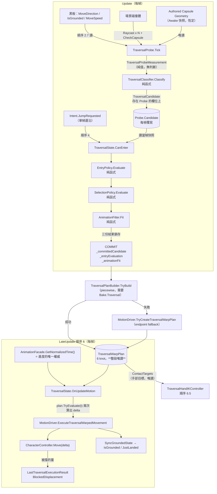
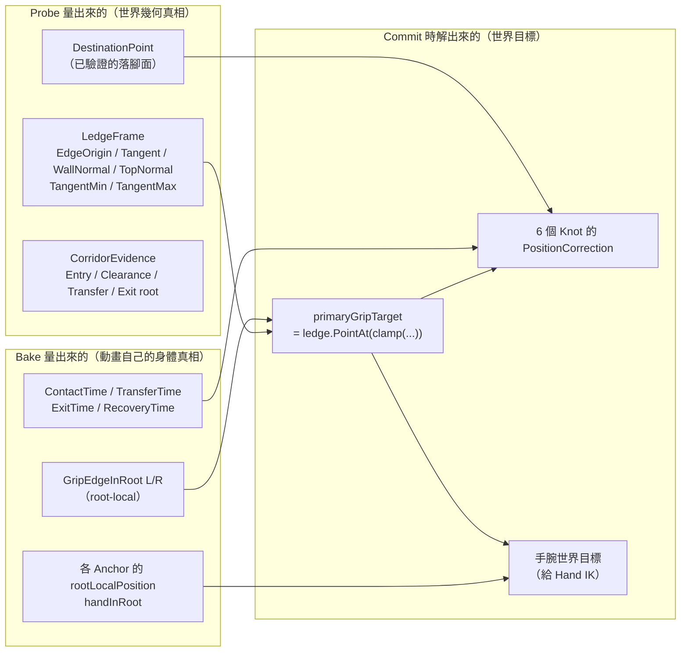
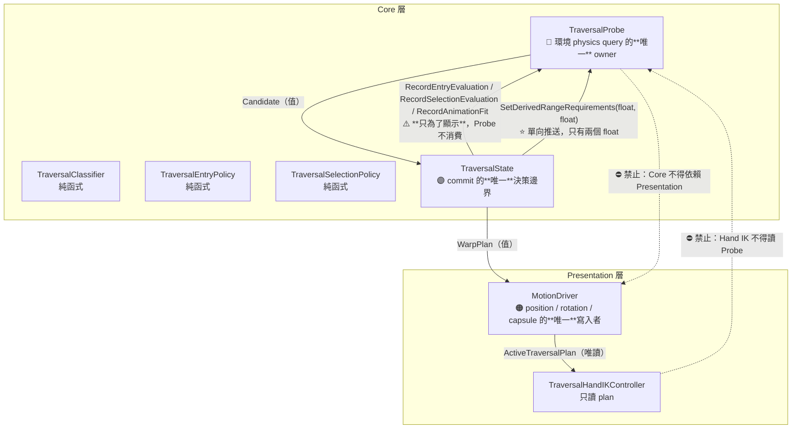

# 30 — Traversal 架構理解指南（給人看的版本）

> **這份文件不是規格書。** 規格正本是 `docs/22`（V1–V3 實作）、`docs/23`（模型正確性審查）、
> `docs/24`（參考實作研究＋鏈路診斷）；治理在 **ADR-008**。
> 這裡的目標是讓你**看完能自己口頭講一次**——尤其是能說出「這一層在回答什麼問題、
> 它憑什麼資料回答、它有沒有權力改別人的答案」。
>
> 對應程式：
> `Core/Environment/TraversalProbe.cs`／`TraversalClassifier.cs`／`TraversalCandidate.cs`、
> `Core/StateMachine/TraversalSelectionPolicy.cs`（內含 **EntryPolicy**）／
> `TraversalStateParamsSO.cs`（內含 **TraversalPlanBuilder**）／`TraversalAnimationFit.cs`／
> `States/TraversalState.cs`、
> `Presentation/Motion/TraversalWarpPlan.cs`／`MotionDriver.cs`、
> `Presentation/IK/TraversalHandIKController.cs`。
>
> 本文所有數字若無特別註明，皆為 **2026-09-15 由磁碟上的資產實測**
> （`TraversalStateParams.asset`、`Bake_*.asset`、`X Bot.prefab`）。

---

## 0. 一句話講完這個系統在幹嘛

> 角色前面有一堵 1 公尺高的矮牆。普通的跳躍表達不了「翻過去」這件事。
> 這套系統每一幀偷看前方的幾何，判斷「那是什麼、我的身體過不過得去」，
> 在你按下跳躍的那一瞬間把答案**鎖起來**，然後播一支翻越動畫，
> 並把那支動畫的 root 軌跡**重新映射**到現場真正的邊緣位置上。

關鍵詞是 **committed（已承諾）**：一旦開始，它就不再看環境、不再吃輸入，
直到 Recovery 為止。這與 locomotion（continuous，每幀重新吃輸入）是兩種完全不同的運動授權。

---

## A. 八個階段：每一層在回答一個**不同的問題**

**這是理解 traversal 唯一有效的骨架。** 把任兩層合成一個「TraversalState」方塊，
你就再也無法回答「為什麼畫面顯示 `Climb1m` 卻什麼都沒發生」。

| # | 階段 | 它回答的問題 | 誰回答 | 什麼時候 | 輸出 |
|---|---|---|---|---|---|
| 1 | **Observation / Probe**（觀測） | 「前面的幾何**長什麼樣**？」 | `TraversalProbe` | 每幀，管線順序 **2.7** | `TraversalProbeMeasurement`（純量測，無判斷） |
| 2 | **Candidate**（候選分類） | 「那是 Vault、Climb1m、Climb2m，還是不能過？」 | `TraversalClassifier`（**純函式**） | 同一幀，緊接 1 | `TraversalCandidate`（含 `RejectReason`） |
| 3 | **Entry Eligibility**（進場合法性） | 「我**現在站的位置與朝向**，做得了這個動作嗎？」 | `TraversalEntryPolicy`（**純函式**） | **只在按下跳躍那一幀**（`CanEnter`） | `TraversalEntryEvaluation`（含 `RejectReason` 與距離帶） |
| 3b | **Selection**（玩法取捨） | 「這個高度，該用 traversal 還是讓普通跳躍去？」 | `TraversalSelectionPolicy`（**純函式**） | 同上，Entry 通過之後 | `TraversalSelectionEvaluation`（含理由） |
| 3c | **Animation Fitting**（動畫配合） | 「這支動畫要**用多快的速率**播，才貼近現場尺寸？」 | `TraversalAnimationFitter`（**純函式**） | 同上，Selection 通過之後 | `TraversalAnimationFit`（`PlaybackRate` ＋ 落地深度預算） |
| 4 | **Commit**（承諾） | 「把上面全部**鎖存**。從現在起環境不再有發言權。」 | `TraversalState.CanEnter` 的最後三行 | 同上 | `_committedCandidate` / `_entryEvaluation` / `_animationFit` |
| 5 | **Motion Map / Warp Targets**（運動映射） | 「動畫的 root 軌跡要怎麼搬，才會落在現場真正的邊緣上？」 | `TraversalPlanBuilder`（piecewise）／`MotionDriver.TryCreateTraversalWarpPlan`（endpoint） | `OnEnter`／第一次 `OnUpdateMotion`，**只做一次** | `TraversalWarpPlan`（6 個 knot 或 1 組 endpoint correction） |
| 6 | **Execution**（執行） | 「這一幀角色該在哪裡？」 | `MotionDriver.ExecuteTraversalWarpedMovement` | 每幀，管線順序 **6** | `CharacterController.Move(delta)` |
| 7 | **Collision / Clearance**（碰撞與淨空） | 「真的過得去嗎？被擋掉多少？」 | `Physics`（查詢在階段 1 就做完了）＋ `CharacterController` | 查詢：階段 1；實際阻擋：階段 6 | `TraversalCorridorEvidence`（事前）／`BlockedDisplacement`（事後） |
| 8 | **Recovery**（恢復） | 「什麼時候可以放人回去正常控制？」 | `TraversalState.OnUpdateMotion` 的 `_canRecover` | 每幀，達到 recovery 時刻 | `CanTransitionAway = true`、還原碰撞 profile |

### 🔴 為什麼這八層不能合併

- **1 與 2 分開**：量測不能有判斷，否則 EditMode 測不了分類（`TraversalClassifier` 是純函式，
  完全不碰 Physics，所以 400 條分類測試不需要物理場景）。
- **2 與 3 分開**：candidate 回答「**那是什麼**」，entry 回答「**我站得對不對**」。
  同一堵牆對站在 0.5 m 的人合法、對站在 1.5 m 的人不合法，但它**還是同一堵牆**。
- **3 與 3b 分開**：entry 是**幾何**（站位），selection 是**玩法**（這個高度該不該用普通跳躍）。
  一個是「做不做得到」，一個是「該不該做」。
- **4 是一條線**：線之前環境說了算，線之後動畫說了算。
- **5 與 6 分開**：plan 是**絕對 pose 的函數**（給 t 回傳位置），execution 是**相對 delta**。
  被牆擋掉的部分**不會回授進 plan** ——這是刻意的，也是 §I 要講的失敗案例來源。

---

## B. 整體 runtime data flow



### 每一條主要箭頭在傳什麼

| 箭頭 | 資料是什麼 | 擁有者（唯一 Writer） | 座標空間 | 更新時機 | 跨幀狀態？ |
|---|---|---|---|---|---|
| 黑板 → Probe | `MoveDirection`（無移動時退回 `transform.forward`）、`IsGrounded`、`MoveSpeed` | `LocomotionModel` ／ `MotionDriver` | 世界空間 XZ | 順序 2.7 讀，**當幀值** | — |
| Authored geometry → Probe | `center` / `radius` / `height` | `CharacterController`（prefab），Probe 在 `Awake` 快照 | **local space**（center） | **一次**，之後恆定 | 🔒 常數 |
| 場景 → Probe | 最多 64 條前掃 ray ＋ top ray ＋ depth ray ＋ 落腳面續掃 ＋ `CheckCapsule` ＋ corridor 段檢 | Unity Physics | 世界空間 | 每幀全部重發 | ❌ 完全不快取幾何 |
| Probe → Classifier | `TraversalProbeMeasurement`（**readonly struct**，22 個欄位） | `TraversalProbe` | 世界空間 | 每幀 | ❌ |
| Classifier → `Probe.Candidate` | `TraversalCandidate`（kind ＋ 幾何 ＋ ledge frame ＋ corridor evidence ＋ **sensed root/facing**） | `TraversalProbe`（存在自己的 property） | 世界空間 | **每幀整個覆寫** | ⚠️ 只有 `_previousKind` 跨幀（供遲滯） |
| Candidate → EntryPolicy | 同上，**唯讀快照** | — | 世界空間 | **只在 JumpRequested 那一幀** | — |
| Bake → EntryPolicy | `TryGetDesiredEntryDistance()`（per-clip 理想進場距離） | `MotionBakeData` 資產 | 公尺（純量） | 每次 `CanEnter` | 🔒 資產常數 |
| Commit → PlanBuilder | 鎖存的 candidate ＋ entry ＋ bake 的 `Traversal` block | `TraversalState` | 世界空間 | **一次** | ✅ **整段 traversal 都不變** |
| Plan → Execution | `TryEvaluate(t) → (position, yaw)`，**絕對世界 pose** | `TraversalWarpPlan`（readonly struct） | **世界空間絕對座標** | 每幀查兩次（前一幀 t、當幀 t） | ✅ plan 本身是跨幀常數 |
| AnimationFacade → Execution | `GetNormalizedTime()` ∈ [0,1] | Animancer | 無量綱 | 每幀 | ✅ `_previousNormalizedTime` 跨幀 |
| Execution → `CharacterController` | `movementDelta = pos(t) − pos(t_prev)`，**相對量** | `MotionDriver`（位置唯一寫入者） | 世界空間 | 每幀 | ❌ |
| Plan → HandIK | `ContactTargets`（手腕世界目標 ＋ IK 窗） | plan（唯讀） | 世界空間 | 順序 6.5 | ❌ |

### 跨幀狀態總表

| 跨幀的東西 | 持有者 | 為什麼需要 | 弄丟會怎樣 |
|---|---|---|---|
| `TraversalProbe._previousKind` | Probe | 高度／深度分類的**遲滯**（`HeightHysteresis 0.1`／`DepthHysteresis 0.08`） | 邊界高度的牆會在 Vault／Climb 之間跳分類 |
| `_committedCandidate` / `_entryEvaluation` / `_animationFit` | `TraversalState` | commit 的定義就是「這些東西不再變」 | 每幀重算 ⇒ 回到 continuous，動畫與環境失去同步 |
| `_warpPlan` ＋ `_warpPlanCommitted` | `TraversalState` | plan 只能建一次 | 每幀重建 ⇒ root 目標抖動 |
| `_previousNormalizedTime` | `TraversalState` | delta 是兩個 pose 的差 | 位移量錯，或第一幀跳一大段 |
| `MotionDriver._traversalOriginalCenter/Height/Radius` | `MotionDriver` | 結束時要還原膠囊 | 帶著 traversal 尺寸的膠囊回到正常遊玩 |
| `_playbackSpeedApplied` | `TraversalState` | 速率只能在動畫真的開始播之後套一次 | 逐幀寫速率，或永遠套不上 |

---

## C. 空間 landmark：資料來源與 authority

這是本系統最容易誤解的部分。**四個 landmark 來自三個不同的來源，各自有不同的權威。**



### 四個 landmark 逐一拆解

| Landmark | 這是什麼 | **時間**從哪來 | **位置**從哪來 | 最終 authority |
|---|---|---|---|---|
| **Entry**（進場） | traversal 開始的那一刻與位置 | 固定 `t = 0` | **角色當下真正站的地方**（`candidate.SensedRootPosition`） | 🔵 **Probe**——entry knot 的 correction 恆為 0，因為起點就是角色自己 |
| **L / R Hand Contact**（左右手接觸） | 手抓住邊緣的時刻與世界位置 | 🟢 **Bake**（`leftHandContactNormalizedTime` 等） | 🔵 **Probe 的 `LedgeFrame`**——`ledge.PointAt(clamp(centerCoordinate + lateral, min, max))` | **混合**：時間屬動畫，位置屬世界，橫向偏移（哪隻手在左邊多少）屬動畫 |
| **Transfer / Clearance**（重心轉移／越過） | 「最後一隻手放開」的時刻 | 🟢 **Bake**（`transferNormalizedTime`） | ⭐ **刻意沿用 Right Contact 的 correction**——見下方 | 🟢 **動畫**（這一段 root 不額外修正） |
| **Exit**（脫離） | 動畫「爬完了／落地了」的時刻與落點 | 🟢 **Bake**（`exitNormalizedTime`；未 author 時由 `VerticalCurve` 平台起點推導） | 🔵 **Probe 的 `DestinationPoint`**，但若 🟢 bake 的自然落點**更近**則用 bake 的 | **兩者取近**——「再遠不保證還在已驗證的落腳面上」 |
| **Recovery**（恢復控制） | 交還玩家控制的時刻 | 🟢 **Bake**（`recoveryNormalizedTime`），與 binding 的 `RecoverNormalizedTime` 取大 | 同 Exit | 🟢 動畫 |

### 🔴 Transfer 為什麼**刻意不指向** corridor 的 clearance 點

這是 2026-09-13 Playtest 修掉的真實 bug，寫在 `TraversalPlanBuilder` 的註解裡：

> 手一旦植在牆／邊緣上，它的世界位置就是**硬約束**。
> 舊版把 Transfer knot 指向另一個空間目標（corridor clearance root），
> 於是 Contact→Transfer 這段——**也就是手正抓著的整段**——correction 會一路內插過去；
> 沒有 IK 釘住手時，**手就被 root 拖著在牆面上滑**。

修法是讓 Transfer knot 直接沿用最後一次接觸的 correction ⇒ **抓握期間零額外 root 位移**。
越過邊緣所需的位移交還給動畫自己——那支動畫本來就是在「手固定」的前提下把身體拉上去的。

> 📌 一句話：**Corridor 的四個 root 點是 query evidence（事前驗證用），不是 motion target（執行目標）。**
> 混用它們，就是把「我確認過這裡走得通」誤讀成「我必須精確走過這幾個點」。

---

## D. Authority / Ownership 圖



### 權限表

| 角色 | 可以做 | ⛔ 不可以做 |
|---|---|---|
| `TraversalProbe` | 發 physics query；快照 authored geometry；發布 `Candidate`；收下 debug 用的評估結果 | ⛔ **寫黑板**；⛔ 決定狀態轉移；⛔ 讀 **live** `characterController.center`；⛔ 依賴 `MotionDriver`（跨層）；⛔ 認識 bake／binding |
| `TraversalClassifier` | 純幾何分類、遲滯 | ⛔ 發 query；⛔ 讀時間或黑板 |
| `TraversalEntryPolicy` | 讀 candidate 快照 ＋ authored 容差 | ⛔ 發 Physics、讀 `Time`、讀 `Transform`、寫黑板。**它連「現在幾點」都不知道** |
| `TraversalSelectionPolicy` | 讀 candidate ＋ `JumpStateParams` | ⛔ 同上 |
| `TraversalState` | **鎖存** candidate／entry／fit；建 plan（一次）；驅動執行；決定 recovery | ⛔ 執行期重新 query／重新分類／回讀 `Probe.Candidate` |
| `TraversalPlanBuilder` | 在 committed ledge 區間上選手部目標、解一次 root 約束、產 6 個 knot | ⛔ 發 runtime Physics（secondary hand 的「查詢」是在**已 commit 的 ledge evidence** 上查，不是打 ray） |
| `MotionDriver` | 位置／旋轉／膠囊 center-height-radius 的唯一寫入者；建 endpoint plan | ⛔ 決定要不要 traversal；⛔ 在 traversal profile 生效時讓姿勢偏移也寫 `center` |
| `TraversalHandIKController` | 讀 `MotionDriver.ActiveTraversalPlan.ContactTargets`，只改手部骨骼 | ⛔ 讀 `TraversalProbe`；⛔ 改 root motion 或碰撞 |

### 「最終決定權」在誰手上

| 問題 | 誰說了算 |
|---|---|
| 這堵牆是什麼 | 🔵 Probe ＋ Classifier |
| 我能不能從這裡開始 | 🔵 Probe 的幾何 ＋ 🟡 authored 容差（EntryPolicy） |
| 這個高度該用 traversal 還是 jump | 🟡 authored（`normalJumpReachSafetyMargin`）＋ 🟢 Jump 的 bake |
| 動畫播多快 | 🟢 Bake ＋ 🔵 Probe 的落地深度，兩者取小 |
| 每一幀角色在哪 | 🟣 **committed plan**（一個跨幀常數） |
| 角色**實際上**移動了多少 | 🟠 `CharacterController.Move` ——**被牆擋掉的不會回授給 plan** |
| 什麼時候還玩家控制 | 🟢 Bake 的 recovery 時刻 |

---

## E. 關鍵 ordering constraint（哪些順序不能交換）

| # | 約束 | 交換之後會發生什麼 |
|---|---|---|
| **O1** | Probe（**2.7**）必須在狀態機（**4**）**之前** | `CanEnter` 會讀到上一幀的 candidate。角色跑動時一幀就差好幾公分，entry 距離帶只有 ±0.35/0.4 m，會出現「明明站對了卻被 `TooFar` 擋下」 |
| **O2** | Probe 必須在 Movement Model（**3**）**之後**？ **不——它在 2.7，比 3 早** | ⚠️ 這代表 Probe 讀到的 `MoveDirection` 是**上一幀** model 算出來的值。這是**現況**，不是 bug，但它是「站定轉身瞬間偵測方向落後一幀」的來源。程式對此有明確退路：`MoveDirection` 為零時改用 `transform.forward`（`DirectionSource` 欄位會告訴你用了哪一個） |
| **O3** | `Classifier` 的**拒絕順序是規格的一部分** | 程式註解明寫「不要把較晚的理由提前」。`NotGrounded` → `NoForwardHit` → `NoValidTop` → `TopTooSteep` → `TooHigh` → `DestinationBlocked` → `CorridorBlocked`。調換之後 debug 面板上顯示的理由會變成「最先撞到的那個」而不是「最根本的那個」 |
| **O4** | Entry **必須在** Selection **之前** | 程式刻意如此：Entry 擋下時直接清掉上一次的 selection 結果，避免面板顯示過期的 Select 行 |
| **O5** | Animation Fitting **必須在** PlanBuilder **之前** | 先讓動畫配合現場尺寸（改速率），**剩下的落差**才交給 root warp。反過來的話 warp 會去修一個動畫本來可以自己吸收的落差 ⇒ 滑步 |
| **O6** | `BeginTraversalCollisionProfile` 的**第一件事**必須是 `ResetCapsuleOffsetImmediate()` | 否則 `_traversalOriginalCenter` 會把當下的 locomotion 姿勢偏移一起吃進去；traversal 結束時「還原」那個偏移，偏移就變成**永久的**——而那時已經沒有任何人會把它改回來。**這是兩個 center 寫入者唯一會真正撞在一起的點** |
| **O7** | 播放速率只能在 `IsPlaying(key)` 為真之後套，且**只套一次** | Animancer 的 state 物件要播過一次才進快取；太早套會靜默失效 |
| **O8** | `OnExit` 必須把速率還原成 1 | Animancer 依 transition key 重用同一個 state 物件 ⇒ 這次 fit 出來的速率會原封不動留到下一次 traversal |
| **O9** | plan 的 `TryEvaluate` 必須查**兩個** t（前一幀與當幀），相減得 delta | 直接 `Move(絕對位置)` 是錯的——`CharacterController.Move` 收的是位移量 |

---

## F. 重要 invariants

| # | 不變量 | 破壞的後果 |
|---|---|---|
| **I1** | **Probe 是環境 physics query 的唯一 owner。** 下游一律消費快照，不重新查詢 | 兩份不一致的環境真相；entry 說可以、execution 說不行 |
| **I2** | **Probe 用 authored capsule geometry，不用 live center** | 已證實的真實 bug，見 §I 第二例 |
| **I3** | **Probe 不寫黑板、不決定狀態轉移** | traversal 變成「環境可以直接改角色狀態」，而環境是 Physics 決定的順序 |
| **I4** | **三支 Policy 都是純函式**：不碰 Physics／Time／Transform／黑板 | EditMode 測不了；分類與合法性變成需要物理場景才能重現的東西 |
| **I5** | **Commit 之後不再 query、不再分類、不再回讀 Probe** | committed 的語意消失，動畫與 root 會在執行中途被環境變化拉開 |
| **I6** | **plan 在一次 traversal 內是常數** | root 目標抖動 |
| **I7** | **plan 是絕對 pose 的函數；被碰撞擋掉的位移不回授進 plan** | 這是刻意的（可觀測），但你必須知道它，否則會誤以為「plan 錯了」 |
| **I8** | **每一個否決都必須留下理由**（`RejectReason` / `SelectionReason` / `FitReason` / `PlanRejection`） | 就是 `docs/23` §A10 記過的除錯黑洞：畫面顯示 `Climb1m` ＋ `Entry: Accept` 卻什麼都沒發生 |
| **I9** | **感測範圍由動畫需求推導，不是獨立常數**（`SetDerivedRangeRequirements` 單向推送） | 見 §I 第一例 |
| **I10** | **Core/Environment 不得依賴 StateMachine／Presentation** | 這就是為什麼推送的是兩個 `float` 而不是 bake 引用 |

---

## G. 真實 runtime case：X Bot 對著 1 公尺矮牆按下跳躍

以下每個數字都是磁碟上的實際 authored 值。

### 第 0 步：這個系統現在被設定成什麼樣子

`TraversalStateParams.asset`：

```
entryPolicy.desiredWallDistance        = 0.45      （全域退路，per-clip 推導優先）
entryPolicy.maximumFarError            = 0.35
entryPolicy.maximumCloseError          = 0.40
entryPolicy.unsafeCapsulePenetrationTolerance = 0.01
entryPolicy.maximumLateralError        = 0.20
entryPolicy.maximumFacingAngle         = 35°
entryPolicy.ledgeEndMargin             = 0.08
normalJumpReachSafetyMargin            = 0.15
vault1mEnabled = 1    climb1mEnabled = 0 🔴    climb2mEnabled = 1
animationFit: Enabled = true, rate ∈ [0.6, 1.6]
三個 binding 的 collisionProfile：enableCenterShift / Height / Radius **全部 = 0**
```

`X Bot.prefab` 的 `TraversalProbe.settings`：

```
obstacleMask = 19 (0b10011)   scanStep = 0.10   scanCeiling = 2.70
forwardScanDistance = 1.25    vault1mMaxDepth = 0.60
climb1mMaxHeight = 1.25       climb2mMaxHeight = 2.10
heightHysteresis = 0.10       depthHysteresis = 0.08
probeMinSpeed = 0.10          destinationClearanceMargin = 0.05
膠囊：center (0, 0.9134, 0)  radius 0.32  height 1.8266  skinWidth 0.03  slopeLimit 45  stepOffset 0.3
```

`Bake_Vault1m.asset`（實測）：

```
BakedDuration = 2.9000        HorizontalDisplacementAt(end) = 3.2585   VerticalAt(end) = 0
Traversal.enabled = true      HasValidBakedData = true
  UsesLeftHand = true         UsesRightHand = **false**
  leftHandContactNormalizedTime  = 0.2069
  rightHandContactNormalizedTime = 0.2069
  transferNormalizedTime         = 0.2529
  exitNormalizedTime             = 0.4598
  recoveryNormalizedTime         = 0.4598
  leftGripEdgeInRoot  = (−0.1654, 0.0279, 0.8835)
  handIKWindow(L/R)   = start 0.1724 / full 0.2069 / release 0.2529
TryGetDesiredEntryDistance() = **1.4017 m**
TryGetNaturalExitDepth()     = **1.1160 m**
GetVerticalSettleNormalizedTime() = 0.4598
```

### 第 1 步：感測範圍先被動畫「撐開」

`TraversalState.CanEnter` 每次都重推一次需求：

```
GetRequiredSensingReach()
  = max over 啟用中的 kind of (desiredEntry + MaximumFarError) / cos(MaximumFacingAngle)
  Vault1m : (1.4017 + 0.35) / cos(35°) = 1.7517 / 0.81915 = 2.1385
  Climb2m : (0.4615 + 0.35) / 0.81915 = 0.9907
  ⇒ 2.1385 m   ← 實測值一致

EffectiveForwardScanDistance = max(authored 1.25, 2.1385) = **2.1385 m**
EffectiveLandingScanDepth    = max(vault1mMaxDepth 0.60, GetRequiredLandingDepth 1.1160) = **1.1160 m**
```

> 🔴 **這一步的存在理由**：`forwardScanDistance` 原本是與動畫無關的 1.25 m 常數，
> 而 Vault1m 的理想站位在 1.40 m ⇒ **理想站位落在感測範圍之外**，
> 可執行區間只剩約 20 cm（`docs/24` §9.3 實測）。
> 修法不是把常數換成另一個常數，而是讓**擁有動畫資料的那一層**把需求推進來。

### 第 2 步：Probe 量（順序 2.7，每幀）

1. **前掃**：從膠囊底 `+stepOffset(0.3)` 開始，每 `0.1 m` 往上一條 ray，最多 64 條，
   掃到 `max(stepOffset, scanCeiling) = 2.7`，每條長 2.1385 m。
   第一條命中的成為 `forwardHit`；**第一條沒命中的高度**成為 `firstClearHeight`（＝牆頂在這附近）。
2. **頂面 ray**：從 `forwardHit.point` 往前 2 cm、抬到 `firstClearHeight` 之上，向下打 ⇒ `topHit`。
   `Height = dot(topHit.point − capsuleBottom, up)` ≈ **1.0 m**。
3. **深度 ray**：從 `topHit.point` 往前 `0.6 m` 向下打。
   - 打到的點與頂面**等高**（差 ≤ `scanStep`）⇒ 表面延續 ⇒ `Depth = 0.6+ε` ⇒ 判為 **Climb**。
   - 打到的是**牆後的地面**（低很多）⇒ 表面不延續 ⇒ `Depth = 0.6−ε` ⇒ 判為 **Vault**。

   > 📌 `Depth` 是一個**二元證據**，不是距離。它只回答「頂面有沒有延續」。
4. **落腳面續掃**：從 0.7 m 起每 0.1 m 往內掃到 1.1160 m，找出**最遠仍連續**的落腳點。
   這才是「落地預算」。
5. **落點膠囊檢查**：把 authored 膠囊放到落點（抬高 `destinationClearanceMargin 0.05` **只為了查詢**）
   ⇒ `Physics.CheckCapsule` ⇒ `DestinationBlocked`。
   ⚠️ committed 終點用的是**沒有抬升**的 `destinationRoot`——抬升只屬查詢。
6. **Ledge frame**：`EdgeOrigin = topHit.point`、`WallNormal = 前掃命中法線投影`、
   `TopNormal = topHit.normal`、`Tangent = cross(topNormal, wallNormal)`，
   再沿切線量出這道邊緣的左右可用區間 `[TangentMin, TangentMax]`。
7. **膠囊對牆淨空**：
   `EntryCapsuleWallClearance = dot(capsuleCenter − forwardHit.point, wallNormal) − 0.32 + 0.03`
   （負值＝已經穿進去了）。
8. **Corridor**：用**固定的 authored 膠囊**沿 Entry → Clearance → Transfer → Exit 四段做段檢。

### 第 3 步：分類（純函式，同一幀）

```
IsGrounded ✓ → HasForwardHit ✓ → HasTop ✓ → TopNormal 與 up 夾角 ≤ slopeLimit(45°) ✓
→ Height 1.0 ≤ Climb2mMaxHeight 2.1 ✓ → DestinationBlocked ✗ → Corridor.IsClear ✓
→ Height 1.0 ≤ Climb1mMaxHeight 1.25 ⇒ 一公尺層
→ Depth 0.6−ε ≤ Vault1mMaxDepth 0.6 ⇒ **Vault1m**
```

### 第 4 步：按下跳躍（順序 4，`CanEnter`）

**Entry**（per-clip 進場距離生效）：

```
desiredWallDistance = 1.4017   （來自 Bake_Vault1m，不是 asset 上的 0.45）
minimumWallDistance = 1.4017 − 0.40 = 1.0017
maximumWallDistance = 1.4017 + 0.35 = 1.7517

longitudinalDistance = dot(root − EdgeOrigin, wallNormal)      ← 站在牆前多遠
lateralError         = |切線座標 − clamp(切線座標, min+0.08, max−0.08)|
facingError          = angle(facing, −wallNormal)

合法帶：站在牆前 1.00 ～ 1.75 m、橫向不超出邊緣可用區間 0.20 m、朝向誤差 ≤ 35°
```

> 📌 **可執行區間只有 75 公分寬，而且中心在 1.4 m 而不是貼著牆。**
> 這是本系統「感覺很難觸發」的直接原因，而它是**設計**：Vault 是跑動翻越，自帶助跑。

**Selection**：`Vault1m` ⇒ 永遠 `ContextualVault` ⇒ 接受（普通跳躍無法表達「越過」）。

> 對照 Climb：`Bake_Jump_place_ALL_short` 的 `AutoApexHeight = 0.9535`、multipliers 全為 1
> ⇒ `theoreticalApex = 0.9535`、`safeReach = 0.9535 − 0.15 = **0.8035 m**`。
> 任何 **≤ 0.80 m 的 Climb 候選都會被讓給普通跳躍**（`ClimbWithinJumpReach`）。

**Animation Fitting**：`Enabled = true`，算出接近段的動畫距離 vs 實際需求 ⇒ rate，夾在 [0.6, 1.6]。

**Commit**：三份結果鎖存。**從這一行之後，環境不再有發言權。**

### 第 5 步：建 plan（`OnEnter` / 第一次 `OnUpdateMotion`，只做一次）

`Bake_Vault1m.Traversal.HasValidBakedData = true` ⇒ 走 **piecewise**：

```
primary hand      = Left（UsesRightHand = false）
primaryGripTarget = ledge.PointAt(clamp(centerCoordinate + gripLeft.x(−0.1654), min, max))
primarySolve      = worldTarget − rot(targetYaw) × leftGripEdgeInRoot
                    然後沿 wallNormal 夾住，不讓 root 穿過牆面
primaryCorrection = primaryRootTarget − primaryOriginalRoot

exitTarget        = min(bake 自然落點 1.1160, Probe 驗證落點) 的那一個，
                    高度沿用 Probe 驗證過的落腳面

六個 knot：
  Entry    t=0.0000   correction = 0（起點就是角色自己）
  LContact t=0.2069   correction = primaryCorrection
  RContact t=0.2069   correction = primaryCorrection
  Transfer t=0.2529   correction = **沿用 RContact 的**（抓握期間零額外位移）
  Exit     t=0.4598   correction → exitTarget
  Recovery t=0.4598   correction → exitTarget
```

同時 `BeginTraversalCollisionProfile` ——但**本專案三個 binding 的 profile 全部關閉**，
所以實際效果只有「把姿勢偏移收乾淨並鎖住 `center` 的寫入權」，沒有任何形狀變化。

### 第 6 步：執行（順序 6，每幀）

```
t      = AnimationFacade.GetNormalizedTime()          ← 進度的唯一權威
plan.TryEvaluate(t_prev) → pos_prev
plan.TryEvaluate(t)      → pos_now
delta  = pos_now − pos_prev
if (t ≥ ExitKnot.t) delta.y += reboundForce × dt      ← 見下方
CharacterController.Move(delta)
```

> ⭐ **`reboundForce` 那一行是修一個真實 bug**：Exit 之後 plan 的位置是**凍結**的
> ⇒ `delta` 恆為零 ⇒ `Move(Vector3.zero)` **不回報觸地** ⇒ `isGrounded` 整段 false
> ⇒ ① Foot IK 全程關閉（它的閘門是 `IsGrounded`），而 clip 最後一格腳趾比 Idle 站姿高 **1.2 cm**
> ⇒ 看起來就是浮著；② 離開 traversal 第一幀重力把角色壓下去 ⇒ `JustLanded` ⇒ **多一聲落地音**。
> 修法不是宣稱自己觸地，而是**真的貼上去**，讓 grounded 由物理回答。

### 第 7 步：Recovery

`t ≥ max(binding.RecoverNormalizedTime, plan.RecoveryKnot.t)` ⇒ 還原碰撞 profile、
`_canRecover = true` ⇒ `CanTransitionAway` ⇒ 狀態機可以轉走。
`t ≥ 1` ⇒ `_isFinished`。

### 你現在應該能口頭講一次

> 「Probe 每幀從膠囊底往上一層一層打 ray 找牆，找到第一個沒打中的高度就知道牆頂在哪，
> 再往下打確認頂面，再往內打確認能不能落腳，最後用 authored 膠囊沿四段走廊做段檢。
> 分類器把這些純量測分成 Vault／Climb1m／Climb2m，帶遲滯。
> 按下跳躍那一幀，Entry 看我站得對不對——Vault 要求站在牆前 1.0 到 1.75 公尺，
> 因為那支動畫自帶助跑；Selection 看這個高度該不該讓給普通跳躍；
> Fitting 算播放速率。三個都過就鎖存，然後建一份六個 knot 的 plan。
> 之後每一幀拿動畫進度去查 plan 的兩個 pose，相減得到位移，交給 MotionDriver。
> 執行期完全不再看環境。」

---

## H. 真實 failure case ①：站對了卻爬不上去（感測距離 < 理想進場距離）

> **症狀**：明明對著牆、明明按了跳躍，大部分站位都不觸發；只有很窄的一小段站位會成功。

### 沿資料流找根因

| 階段 | 觀察到什麼 | 是不是凶手 |
|---|---|---|
| 1 Observation | `forwardScanDistance` 是 authored 常數 **1.25 m** | ⚠️ 記著 |
| 2 Candidate | 站遠一點 ⇒ ray 打不到 ⇒ `NoForwardHit` ⇒ `Kind = None` | ❌ 症狀，不是根因 |
| 3 Entry | Vault1m 由 bake 推導的理想進場距離是 **1.4017 m**，帶寬 [1.00, 1.75] | 🔴 **就是這裡** |

### 根因，一句話

**理想站位（1.40 m）落在感測範圍（1.25 m）之外。**

兩個區間的交集只有 `[1.00, 1.25]` ⇒ 可執行站位只剩約 **25 cm**，
而其中還要扣掉玩家很難精準停下的部分。實測「可執行區間只剩約 20 cm」（`docs/24` §9.3）。

### 為什麼這個 bug 很難看出來

因為**每一層看起來都沒錯**：
- Probe 忠實回報「我沒看到東西」。
- Classifier 忠實回報 `NoForwardHit`。
- Entry 根本沒被呼叫到（candidate 是 `None`）。

**沒有任何一層說謊，錯的是兩個常數之間的關係**——而那個關係在程式裡原本**不存在**。

### 修法：讓需求從有資料的那一層推過來

```csharp
// TraversalState.CanEnter 每次都重推
_probe.SetDerivedRangeRequirements(
    _params.GetRequiredSensingReach(),     // 2.1385 m
    _params.GetRequiredLandingDepth());    // 1.1160 m

// TraversalProbe
public float EffectiveForwardScanDistance =>
    IsFinitePositive(_requiredForwardReach)
        ? Mathf.Max(settings.ForwardScanDistance, _requiredForwardReach)
        : settings.ForwardScanDistance;
```

⚠️ 注意**方向**：`StateMachine → Environment` 的**單向推送**，而且只傳兩個 `float`。
Probe 不會因此認識 bake 或 binding——`Core/Environment` 依然不依賴 StateMachine／Presentation。

⚠️ 也注意它**每次 `CanEnter` 都重推**，而不是只在 `Initialize` 推一次：
這樣在 Inspector 上臨時勾掉某個 kind 之後，感測範圍會自己跟上。
理由寫在註解裡——避免又出現「推導值從來沒生效」那類靜默失效。

---

## I. 真實 failure case ②：起攀完全不觸發，而且只在跑動之後（live capsule center）

> **症狀**：同一個站位，有時 `Climb2m`、有時 `CorridorBlocked`。
> 2026-09-15 由 PlayMode 探針證實。

### 沿資料流找根因

| 階段 | 這一層做了什麼 | 是不是凶手 |
|---|---|---|
| Dynamic Capsule（另一個子系統） | 跑步時把 `characterController.center` 往前偏移最多 0.18 m | ❌ 它做的是對的事 |
| 1 Observation | Probe 當時讀的是 **live** `characterController.center` | 🔴 **就是這裡** |
| Corridor 段檢 | 膠囊整體被推走 ⇒ `IsCapsuleSegmentClear` 在 entry→clearance 段撞牆 | ❌ 忠實回報 |
| 2 Candidate | `CorridorBlocked` ⇒ `Kind = None` | ❌ 症狀 |

### 根因，一句話

**環境查詢問的是「這個角色的基準身體能不能通過」，不是「這個角色現在被動畫推到哪」。**

### 修法

`TraversalProbe` 在 `Awake` 把 authored geometry 快照下來，之後永遠用快照：

```csharp
private void Awake()
{
    _characterController = GetComponent<CharacterController>();
    // ⚠️ 必須在 Awake 就擷取：任何動態偏移最早也要到第一次 Update／LateUpdate 才會寫 center
    CaptureAuthoredGeometry();
}
```

⛔ **刻意不向 `MotionDriver` 要這個值**：`MotionDriver` 在 Presentation 層、`TraversalProbe` 在 Core 層。
Core 去問 Presentation 拿自己的基準幾何會把依賴方向反轉，而且會讓「traversal 能不能運作」
取決於一個表現層元件存不存在。
**兩邊各自在 `Awake` 快照同一個 authored 常數——那不是兩個 writer，是兩個 reader 讀同一個不變量。**

由 EditMode `A45` 與 PlayMode `TR1` 兩條測試守住。

### 同一條裂縫的第二面：`center` 的還原

`MotionDriver.BeginTraversalCollisionProfile` 的第一行是 `ResetCapsuleOffsetImmediate()`。
不這麼做的話 `_traversalOriginalCenter` 會把當下的姿勢偏移一起吃進去，
traversal 結束時「還原」它 ⇒ **偏移變成永久的**，而那時已經沒有人會把它改回來。

---

## J. 錯誤理解 vs 正確理解

```
❌ TraversalState 是一個方塊，裡面判斷能不能爬然後爬上去
✅ 它是八層裡的一層半：它只負責「鎖存」與「驅動」
   量測屬 Probe、分類屬 Classifier、合法性屬 EntryPolicy、取捨屬 SelectionPolicy、
   映射屬 PlanBuilder、位移屬 MotionDriver
```

```
❌ Candidate 說可以，就表示按下跳躍會爬
✅ Candidate 只回答「那是什麼」。還要過 Entry（站位）、Selection（該不該）、
   kind 開關（內容決策），而且每一關都會靜默地讓給普通跳躍
   （這就是為什麼每一關都被強制要求留下 RejectReason）
```

```
❌ Depth 是「平台有多深」
✅ Depth 是一個二元證據，只回答「頂面有沒有延續到 0.6 m」
   真正的落地預算是另一個欄位 LandingSurfaceDepth，掃描上限由動畫推導
```

```
❌ Corridor 的四個 root 點就是角色會走過的路徑
✅ 它們是 query evidence（事前驗證），不是 motion target
   把 Transfer knot 指向 corridor 的 clearance root，會讓抓著牆的手被 root 拖著滑
```

```
❌ Probe 應該用角色現在的碰撞膠囊做查詢
✅ 必須用 authored（基準）膠囊。動態偏移是「動畫把身體推到哪」，
   不是「這個角色的身體有多大」
```

```
❌ warp 的責任是把動畫拉到目標位置
✅ 先由 Animation Fitting 讓動畫配合尺寸（播放速率），
   剩下的落差才交給 warp。rate 不改變位移量，它改變走完那段位移花多少時間
```

```
❌ plan 算出來的位置就是角色最後的位置
✅ plan 是絕對 pose，執行是相對 delta。被碰撞擋掉的部分不會回授
   「計畫對但結果不對」要看 BlockedDisplacement，那是另一個量
```

```
❌ traversal 途中角色是浮空的，所以 Foot IK 關掉是對的
✅ 那是 bug 的症狀。Exit 之後 plan 位置凍結 ⇒ Move(zero) ⇒ isGrounded 永遠 false
   修法是真的把角色貼到已驗證的落腳面上，讓物理回答 grounded
```

```
❌ 某個 kind 沒反應，是因為壞了
✅ 先看是不是 IsKindEnabled 回 false（目前 Climb1m 就是關的）
   那是刻意的內容決策，Probe 仍會分類、debug 仍看得到，只是 selection 讓給普通跳躍
```

---

## K. Debug：該看哪些值，各代表哪一層出問題

Traversal 的可視化通道（`X Bot.prefab` 上的實際設定）：

| 開關 | 目前 | 內容 |
|---|---|---|
| `TraversalProbe.drawTraversalRuntimeLines` | ✅ 開 | 前掃 ray、top probe、depth probe、落點膠囊 |
| `TraversalProbe.drawTraversalSceneGizmos` | ✅ 開 | Scene View 詳查 |
| `TraversalProbe.drawTraversalPanelText` | ❌ 關 | Game View 文字面板 |
| `MotionDriver.drawTraversalPanelText` | ❌ 關 | plan／執行的文字面板 |

### 診斷順序（第一個異常的就是問題所在的層）

| # | 觀察 | 正常 | 異常 ⇒ 哪一層 |
|---|---|---|---|
| 1 | `Candidate.Kind` | 對著牆時非 `None` | `None` ⇒ 看 `RejectReason`（下一列） |
| 2 | `Candidate.RejectReason` | `None` | `NotGrounded` ⇒ 接地層；`NoForwardHit` ⇒ **感測距離或 obstacleMask**；`NoValidTop` ⇒ 頂面幾何；`TopTooSteep` ⇒ 頂面 > 45°；`TooHigh` ⇒ 超過 2.1；`DestinationBlocked` ⇒ 落點放不下膠囊；`CorridorBlocked` ⇒ 四段走廊有一段過不去 |
| 3 | `Candidate.DirectionSource` | 移動中 = `Move` | `Facing` ⇒ 目前用的是**朝向**而不是移動方向（站定時正常；移動中出現代表 `MoveDirection` 是零） |
| 4 | `EntryEvaluation.RejectReason` | `None` | `TooFar` / `TooCloseUnsafe` ⇒ **站位**；`LateralOutOfRange` ⇒ 站在邊緣太靠邊；`FacingOutOfRange` ⇒ 沒對準（>35°）；`InvalidLedgeFrame` ⇒ 邊緣幾何退化 |
| 5 | `EntryEvaluation.DistanceBand` ＋ `LongitudinalDistance` vs `IdealLongitudinalDistance` | 落在帶內 | 這兩個數字直接告訴你「該往前還是往後站多少」 |
| 6 | `SelectionEvaluation.Reason` | `ContextualVault` / `ClimbAboveJumpReach` | 🔴 `ClimbWithinJumpReach` ⇒ **被靜默讓給普通跳躍**（`safeReach = 0.8035 m`）；`KindDisabled` ⇒ 內容開關關著 |
| 7 | `AnimationFit.Reason` | `Fitted` | `MissingBakeData` ⇒ bake 沒有 `Traversal` block；`RateClampedFast/Slow` ⇒ 現場尺寸超出 [0.6, 1.6] 能吸收的範圍 |
| 8 | `TraversalWarpPlanDiagnostics.Mode` | `Piecewise` | `EndpointFallback` ⇒ **沒有手部接觸、沒有 Hand IK**（看 `PiecewiseRejection`）；`Failed` ⇒ 跑純 baked 曲線，**完全沒有 warp** |
| 9 | `PiecewiseRejection` | `None` | `MissingTraversalBlock` ⇒ 該支 bake 沒烘 traversal 資料（**目前 `Bake_Climb1m` 就是**）；`HorizontalCorrectionExceeded` ⇒ 需要的修正超過 binding 上限（1.5 / 0.75） |
| 10 | `LastTraversalMaxBlockedDisplacement` | ≈ 0 | > 0 ⇒ **plan 是對的，但被碰撞擋掉了**。這區分「計畫錯」與「被擋」 |
| 11 | `HandIKStatus` | `Active` | `RootMappingUnavailable` ⇒ 沒有 plan；`NotConfigured` ⇒ bake 沒有 Hand IK 窗；`OutsideContactWindow` ⇒ 不在 IK 窗內（正常）；`ResidualTooLarge` ⇒ 誤差 > 0.35 m，IK 放棄 |

### 「畫面全綠卻什麼都沒發生」的標準排查

這是本系統歷史上最誤導的狀態。按順序問四個問題：

1. `SelectionEvaluation.Reason` 是不是 `ClimbWithinJumpReach`？（高度 ≤ 0.8035 m）
2. 是不是 `KindDisabled`？（Climb1m 目前就是）
3. `WarpPlanDiagnostics.Mode` 是不是 `Failed`？
4. `LastTraversalMaxBlockedDisplacement` 是不是很大？

---

## L. 你應該能自己口頭重述的版本

> **Traversal 解決的問題**：普通跳躍表達不了「翻過去／爬上去」。
>
> **它的結構是八層，每層回答一個不同的問題**：Probe 量、Classifier 分類、
> EntryPolicy 問我站得對不對、SelectionPolicy 問該不該讓給普通跳躍、
> Fitting 問動畫該播多快、Commit 把答案鎖住、PlanBuilder 把動畫軌跡映射到現場、
> MotionDriver 逐幀執行、Recovery 把控制還給玩家。
>
> **Commit 是一條線**：線之前環境說了算，線之後動畫說了算。
> 執行期完全不再 query、不再分類、不再回讀 Probe。
>
> **空間 landmark 的來源是混的，這很重要**：接觸的**時間**來自 bake，
> 接觸的**位置**來自 Probe 的 ledge frame，手的**橫向偏移**又來自 bake。
> Exit 是「動畫自然落點」與「Probe 驗證落點」取近的那個。
> Transfer 刻意不指向任何新目標——抓握期間 root 不能再動，否則手會在牆上滑。
>
> **Corridor 的四個點是事前驗證，不是行走路徑。**
>
> **誰說了算**：Probe 是環境查詢的唯一 owner，用的是 authored 膠囊不是 live 的；
> 三支 policy 都是純函式，連時間都不知道；plan 是跨幀常數；
> 位置的唯一寫入者是 MotionDriver；被碰撞擋掉的位移不回授進 plan。
>
> **破壞規則會怎樣**：Probe 讀 live center ⇒ 跑動後起攀完全失效；
> 感測距離小於動畫理想進場距離 ⇒ 可執行站位只剩 20 公分；
> Transfer 指向另一個空間目標 ⇒ 手被 root 拖著滑；
> 忘了在 profile 開始前收乾淨姿勢偏移 ⇒ 偏移變永久。

---

## 附錄 A：文件與程式／資產不一致之處（2026-09-15 對照）

| 位置 | 文件怎麼寫 | 磁碟上實際是什麼 | 影響 |
|---|---|---|---|
| `docs/23` §A「三支正式 Bake **無** `Traversal` block ⇒ piecewise／contact／IK 全為 dead path」 | 三支都沒有 | 🔴 **已部分過期**：`Bake_Vault1m` 與 `Bake_Climb2m` 的 `HasValidBakedData = true`（含 grip edge、contact time、Hand IK 窗）；**只有 `Bake_Climb1m` 仍是 `enabled = false`** | 讀該節時不要再假設「全部 dead」。Climb1m 現在會走 endpoint fallback，理由是 `MissingTraversalBlock` |
| `docs/24` §19「`RootReachConstraint` 現為**全零 no-op**」 | 全零 | 🔴 **已過期**：`Bake_Climb2m.Traversal.rootReachConstraint` 現為 `enabled = true`、`maximumReachRatio = 0.95`、`anchorRelease = 0.2130`、`correctionEnd = 0.3796`；`Bake_Vault1m` 仍是關的 | 診斷 Climb2m 的 root 行為時，這一層**現在會作用** |
| `docs/22`／`docs/23` 談 traversal collision profile 的三個通道 | 描述 center-shift / height / radius 曲線 | 🟡 `TraversalStateParams.asset` 三個 binding 的 `enableCenterShift` / `enableHeightAdjustment` / `enableRadiusAdjustment` **全部 = 0** | **目前 traversal 完全不改膠囊形狀**。`BeginTraversalCollisionProfile` 的實際作用只剩「收乾淨姿勢偏移並鎖住 `center` 寫入權」 |
| 各處預設 `forwardScanDistance = 1.25` | 常數 1.25 | 執行期實際是 `max(1.25, GetRequiredSensingReach()) = **2.1385**` | 拿 1.25 去推算可執行範圍會得到錯的結論 |
| `TraversalMotionBinding` 的 `warpEndNormalizedTime = 0.8` | asset 裡確實是 0.8 | `overrideWarpWindowEnd = 0` ⇒ **這個值沒有生效**，實際由 bake 的 `GetVerticalSettleNormalizedTime()` 推導（Vault1m 0.4598 / Climb1m 0.5692 / Climb2m 0.8333） | 看 Inspector 上的 0.8 會誤判 correction 窗 |

> ⚠️ 上述五項**本文只標記，未修改** `docs/22`～`docs/24`——那些是規格與研究正本，
> 其中前兩項是「研究輪當時的實測」，性質上屬歷史紀錄。

## 附錄 B：目前 authored 值速查

### `TraversalStateParams.asset`

| 欄位 | 值 |
|---|---|
| `entryPolicy.desiredWallDistance` | 0.45（**per-clip 推導優先，實際極少用到**） |
| `entryPolicy.maximumFarError` / `maximumCloseError` | 0.35 / 0.40 |
| `entryPolicy.maximumLateralError` / `maximumFacingAngle` | 0.20 / 35° |
| `entryPolicy.ledgeEndMargin` | 0.08 |
| `normalJumpReachSafetyMargin` | 0.15 ⇒ `safeReach = 0.8035 m` |
| `vault1mEnabled` / `climb1mEnabled` / `climb2mEnabled` | 1 / **0** / 1 |
| 三個 binding 的 `maxHorizontal/VerticalCorrection` | 1.5 / 0.75 |
| `animationFit` | Enabled，rate ∈ [0.6, 1.6] |

### 三支 bake 的 traversal 資料

| | Vault1m | Climb1m | Climb2m |
|---|---|---|---|
| `Traversal.enabled` | ✅ | ❌ | ✅ |
| `HasValidBakedData` | ✅ | ❌ | ✅ |
| 使用的手 | 只有左手 | — | 左右手 |
| Contact t | 0.2069 | — | 0.0648 |
| Transfer t | 0.2529 | — | 0.2685 |
| Exit t | 0.4598 | — | 0.8333 |
| Recovery t | 0.4598 | — | 0.8704 |
| `DesiredEntryDistance` | **1.4017 m** | 推不出（退回 0.45） | 0.4615 m |
| `NaturalExitDepth` | 1.1160 m | 推不出 | 0.2129 m |
| `VerticalSettle`（warp end） | 0.4598 | 0.5692 | 0.8333 |
| Duration | 2.90 s | 2.1667 s | 3.60 s |
| 末端水平／垂直位移 | 3.2585 / 0.0000 | 1.3677 / 1.0134 | 0.6745 / 1.9781 |
| `RootReachConstraint` | 關 | 關 | **開**（ratio 0.95） |

---

## 相關文件

- **ADR-008** —— traversal 的治理決策
- `docs/22-traversal-v1.md` —— V1→V3 實作與 integration 正本（§9 Probe／§11 V2／§12 V3）
- `docs/23-traversal-motion-mapping-review.md` —— 模型正確性審查（**部分結論已過期，見附錄 A**）
- `docs/24-traversal-reference-study.md` —— 參考實作研究（§10–§11 感測範圍、§14–§17 contact／錨定、**§19 回頭檢查必讀**）
- `docs/18-benchmark-convergence.md` §3 —— Continuous／Committed／Suspended 運動授權分類
- `docs/01-design-doc.md` §2.9 —— committed vs continuous 的詞彙
- `docs/28-dynamic-capsule-architecture-guide.md` §E —— 同一顆膠囊的另一個寫入者
- `docs/29-foot-ik-architecture-guide.md` §C —— 為什麼 traversal 期間 Foot IK 會關掉
