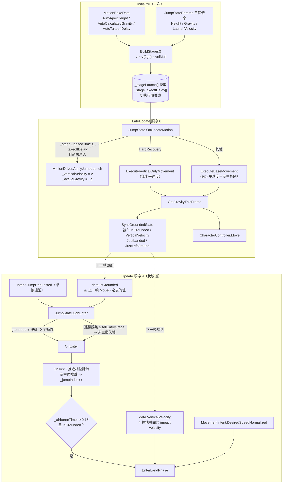
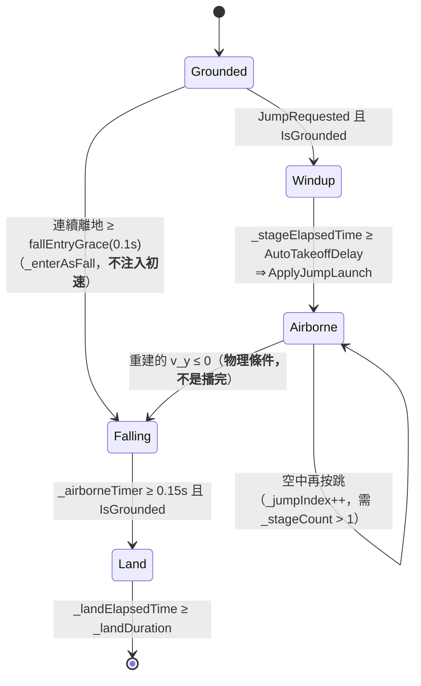
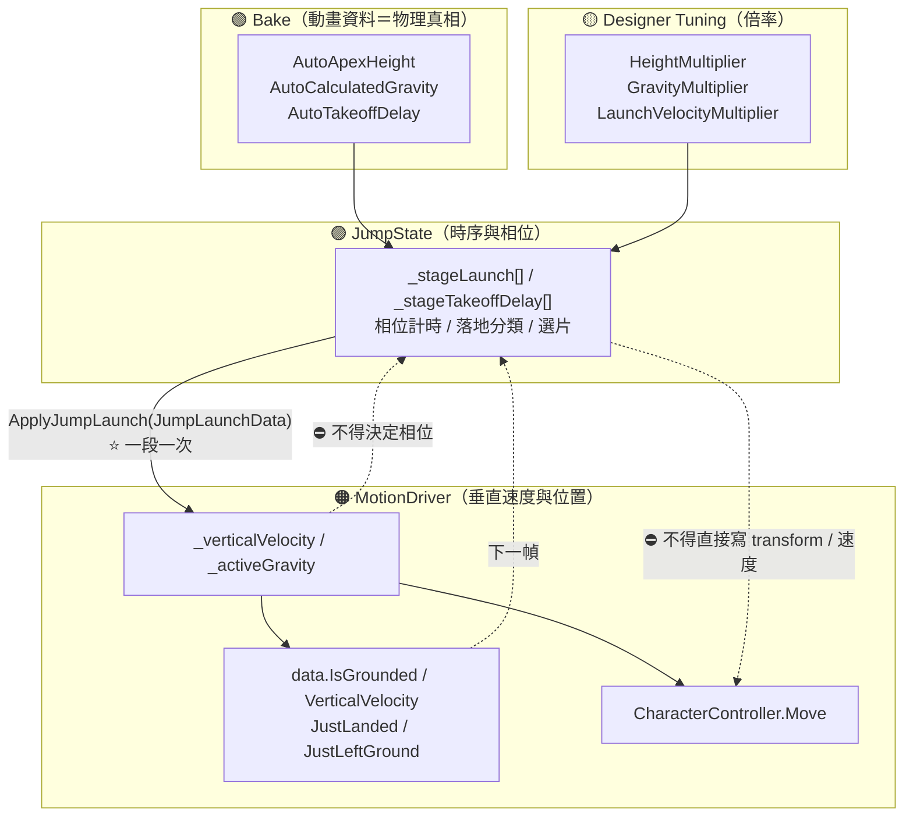

# 31 — Jump / Falling / Landing 架構理解指南（給人看的版本）

> **這份文件不是規格書。** 決策正本是 **ADR-002**；契約在 `docs/02-dev-spec.md` §3.2。
> 這裡的目標是讓你**看完能自己口頭講一次**，並在看到「跳太高／落地卡住／空中被打沒反應」時，
> 一句話說出那是哪一層的問題。
>
> 對應程式：
> `Core/StateMachine/States/JumpState.cs`、`Core/StateMachine/JumpStateParams.cs`、
> `Presentation/Motion/JumpLaunchData.cs`、`Presentation/Motion/MotionDriver.cs`
> （`ApplyJumpLaunch` / `GetGravityThisFrame` / `SyncGroundedState` / `ExecuteVerticalOnlyMovement`）、
> `Core/Movement/Models/LocomotionStopSelector.cs`（腳相選片，Jump 沿用）。
>
> 本文所有數字若無特別註明，皆為 **2026-09-15 由磁碟上的資產實測**
> （`JumpStateParams.asset`、`Bake_Jump_place_ALL_short.asset`、`PlayerStateMachineConfig.asset`、`X Bot.prefab`）。

---

## 0. 一句話講完這個系統在幹嘛

> 角色離地之後，**沒有人在控制他的垂直位置**——只有一個初速和一個重力常數。
> 這套系統做三件事：
> ① 從**動畫烘焙資料**逆推出「這支跳躍動畫本來會跳多高」，把那個高度變成物理初速；
> ② 承載**所有**滯空時間（主動跳躍與走著走著掉下去都算）；
> ③ 落地時依**實際撞地速度**與**當下移動意圖**挑一支落地動畫，並在重落地時鎖住玩家一小段時間。

> ⚠️ **命名警告**：`StateType.Jump` 這個名字與它承載的範圍有落差——
> **走下平台的自由落體也住在 `JumpState` 裡**。
> 程式註解明寫這是「命名問題、不是結構問題；本輪刻意不新增 `Falling`／`Airborne` StateType」。

---

## A. 系統邊界：哪些事**不**歸它管

先講這個，因為一半的誤判來自這裡。

| 事情 | 歸誰 |
|---|---|
| 角色現在有沒有踩到地 | `MotionDriver.SyncGroundedState()`（`CharacterController.isGrounded` 的唯一轉發者） |
| 重力積分本身 | `MotionDriver.GetGravityThisFrame()` |
| 空中的**水平**移動 | `LocomotionModel`（管線順序 3，**每幀無條件**推進，不看狀態） |
| 角色實際移動到哪裡 | `MotionDriver` ＋ `CharacterController.Move` |
| 「按了跳躍該進 Jump 還是 Traversal」 | `FullBodyStateMachine` 的優先級（Traversal 30 > Jump 10） |
| **跳多高** | 🟢 **`MotionBakeData`**——`AutoApexHeight` / `AutoCalculatedGravity` / `AutoTakeoffDelay` |
| 起跳前搖多久 | 同上，`AutoTakeoffDelay` |
| 怎麼分類落地、播哪一支落地動畫、鎖多久 | 🟣 **`JumpState`**（本系統） |

`JumpState` 自己擁有的東西只有一組：**時序與相位**。
它不擁有位置、不擁有速度、不擁有接地真相。

---

## B. 整體 runtime data flow



### 每一條主要箭頭在傳什麼

| 箭頭 | 資料是什麼 | 擁有者（唯一 Writer） | 單位／空間 | 更新時機 | 跨幀狀態？ |
|---|---|---|---|---|---|
| Bake → `BuildStages` | `AutoApexHeight`（m）、`AutoCalculatedGravity`（m/s²，正值）、`AutoTakeoffDelay`（s） | `MotionBakeData` 資產 | 公尺／秒 | **Initialize 一次** | 🔒 資產常數 |
| `BuildStages` → `_stageLaunch[]` | `JumpLaunchData(初速, 重力)` | `JumpState` | m/s、m/s²（正值大小） | **一次性配置**，執行期唯讀 | ✅ 但是常數 |
| `Intent.JumpRequested` → `CanEnter` | bool，**單幀邊沿**（`WasPressedThisFrame`） | 順序 2 的 Intent Processor | — | 每幀，順序 7 復位 | ❌ |
| `data.IsGrounded` → `CanEnter` / `OnTick` | bool | `MotionDriver` | — | ⚠️ **讀到的是上一幀 `Move()` 之後的結果** | — |
| `JumpState` → `MotionDriver.ApplyJumpLaunch` | `_verticalVelocity = +v`、`_activeGravity = −g`、`_gravityFrame = −1`（強制重算） | `MotionDriver`（垂直速度唯一擁有者） | m/s | **每段恰好一次** | ✅ `_verticalVelocity` 是 MotionDriver 的跨幀狀態 |
| `MotionDriver` → `data.VerticalVelocity` | float，**撞地那一幀 ＝ impact velocity** | `MotionDriver`（`SyncGroundedState`） | m/s | 每幀 | — |
| `MovementIntent.DesiredSpeedNormalized` → 選片 | float [0,1] | `PlayerLocomotionPolicy`（順序 2.5） | 無量綱 | 每幀 | — |
| 選片 → `_currentAnimationKey` | **既有的字串參考**（不組字串、不 `ToString`） | `JumpState` | — | 相位切換時 | ✅ |

### 跨幀狀態總表

| 跨幀的東西 | 持有者 | 為什麼需要 | 弄丟會怎樣 |
|---|---|---|---|
| `_verticalVelocity` / `_activeGravity` / `_gravityFrame` / `_cachedGravity` | `MotionDriver` | 重力是積分，必須有速度狀態；`_gravityFrame` 保證一幀只積分一次 | 一幀被積分兩次 ⇒ 重力加倍 |
| `_wasGrounded` | `MotionDriver` | `JustLanded` / `JustLeftGround` 是**邊沿**，需要前一幀 | 落地音效不響或連響 |
| `_jumpIndex` | `JumpState` | 現在是第幾段跳 | 無限空中跳 |
| `_isVelocityInjected` | `JumpState` | 這一段的初速注入過了沒 | 每幀注入 ⇒ 飛天 |
| `_stageElapsedTime` | `JumpState` | 對齊該段的起跳前搖 | 前搖失效，動畫與物理不同步 |
| `_airborneTimer` | `JumpState` | 落地保護（≥ 0.15 s 才判落地） | 離地當幀就被判成落地 |
| `_ungroundedSince` | `JumpState` | 非主動失地的 grace 計時 | 斜坡上的 `isGrounded` 抖動會被誤判成掉下去 |
| `_enteredFromFall` | `JumpState` | 非主動失地**不得**取得空中跳 | 重新打開 ADR-002 已封住的無限空中跳 |
| `_takeoffTier` / `_takeoffFootPhase` | `JumpState` | 落地要沿用**起跳時承諾的**速度家族與腳相 | 用 Run 起跳、用 Idle 落地 |
| `_landingPhase` / `_landElapsedTime` / `_landDuration` | `JumpState` | 落地鎖定 | HardRecovery 沒有鎖定效果 |

> 📌 **`JumpState` 的所有執行期狀態都不進黑板。** 落地相位是 Jump 自己的事，不是全域狀態。

---

## C. 六個相位：每一個的**進入條件**與**離開條件**



| 相位 | 進入條件 | 離開條件 | 位移路徑 |
|---|---|---|---|
| **Windup**（起跳前搖） | `JumpRequested && IsGrounded` | `_stageElapsedTime ≥ _stageTakeoffDelay[i]` | `ExecuteBaseMovement`（**還在地上，正常走**） |
| **Airborne / Start**（上升） | `ApplyJumpLaunch` 注入初速 | `CalculateVerticalVelocity(...) ≤ 0` | `ExecuteBaseMovement`（**有完整空中控制**） |
| **Falling**（下降） | 上一列，或非主動失地 | `_airborneTimer ≥ 0.15 && IsGrounded` | 同上 |
| **Land / NormalStop** | 落地，`|v_y| ≤ hardLandingSpeed`，且**無**移動意圖 | 時間到，**或**出現新的移動意圖（可提前結束） | `ExecuteBaseMovement` |
| **Land / NormalContinue** | 落地，`|v_y| ≤ hardLandingSpeed`，且**有**移動意圖 | 時間到（⛔ 不接受提前結束） | `ExecuteBaseMovement` |
| **Land / HardRecovery** | 落地，`|v_y| > hardLandingSpeed` | 時間到（⛔ 不接受提前結束） | 🔴 `ExecuteVerticalOnlyMovement`——**沒有水平速度** |

### 🔴 `Start → Falling` 為什麼是物理條件，不是「動畫播完」

```csharp
internal static bool ShouldEnterFalling(
    float initialVerticalVelocity, float gravity,
    float elapsedTime, float takeoffDelay, bool isLanded)
```

**簽名裡刻意沒有 clip duration。** 註解寫得很清楚：
「Start→Falling 是**物理條件**，不是播放完成條件。」

它用 `JumpState` 自己擁有的拋體參數**重建**該時刻的垂直速度，`≤ 0` 就切 Falling。
這不是第二份物理狀態——函式無跨幀儲存、不寫黑板，只是讓動畫分類與 `MotionDriver`
接到的**同一份 `JumpLaunchData`** 保持同源。

### 🔴 HardRecovery 為什麼是 gameplay phase 而不是「等動畫播完」

```csharp
if (_landingPhase == LandingPhase.HardRecovery)
{
    motionDriver.ExecuteVerticalOnlyMovement(data);   // 保留 facing／重力／grounded／碰撞
    return;                                          // 但不施加 Movement Output 的水平速度
}
```

⛔ **不得藉由清空 `MoveDirection` 來達成鎖定**——那會破壞黑板的單一寫入者契約。
鎖定是「這一幀我不消費水平輸出」，不是「把水平輸出擦掉」。

`_landDuration` 由 `JumpState` 自己計時並擁有。Bake duration 只是目前沿用的 authored 秒數來源，
**不是** Animation callback，也不是「clip 播完」事件。

---

## D. Authority / Ownership



### 權限表

| 角色 | 可以做 | ⛔ 不可以做 |
|---|---|---|
| `MotionBakeData` | 提供 apex／重力／前搖三個物理量 | ⛔ 含邏輯；⛔ 被手動覆寫（它是量測值） |
| `JumpStateParams` | 三個倍率、動畫變體表、四個門檻 | ⛔ 直接放硬編碼的 `TakeoffDelay` / `ImpulseForce`（ADR-002 已拔除） |
| `JumpState` | 擁有相位、計時、落地分類、選片；呼叫 `ApplyJumpLaunch` | ⛔ 寫黑板（相位不進黑板）；⛔ 直接改 `transform` 或速度；⛔ 清空 `MoveDirection` 來鎖定 |
| `MotionDriver` | 垂直速度、重力、位置、grounded 發布的**唯一**擁有者 | ⛔ 決定相位；⛔ 知道 Jump 或 recovery 是什麼（`ExecuteVerticalOnlyMovement` 的註解明寫「本方法不認識 Jump」） |
| `LocomotionModel` | 空中期間照常推進水平輸出 | ⛔ 因為在空中就停止（否則落地會拿起跳時的殘值續走＝滑步） |

### 「最終決定權」

| 問題 | 誰說了算 |
|---|---|
| 跳多高 | 🟢 Bake（三個倍率為 1 時，apex **精準命中** `AutoApexHeight`——ADR-002 §2.3 自洽性） |
| 什麼時候真的離地 | 🟢 Bake 的 `AutoTakeoffDelay` |
| 什麼時候切 Falling | 🟣 `JumpState` 用同一份 launch data 重建的速度 |
| 什麼時候算落地 | 🟠 `CharacterController.isGrounded`（＋ 0.15 s 保護） |
| 落地算不算「重」 | 🟠 `MotionDriver` 發布的 `VerticalVelocity` vs 🟡 `hardLandingSpeed` |
| 落地後鎖多久 | 🟣 `JumpState`（`_landDuration`），資料來源是 bake duration |
| 按了跳躍會進 Jump 還是 Traversal | 🔵 FSM 優先級：**Traversal 30 > Jump 10** |

---

## E. 關鍵 ordering constraint

| # | 約束 | 交換之後會發生什麼 |
|---|---|---|
| **O1** | Movement Model（順序 **3**）必須**每幀無條件**推進，**不看當前狀態** | 程式註解直接寫了：Jump／Roll 期間仍須推進，因為 JumpState 的空中控制吃的正是 model 的運動輸出；**若隨 ambient 狀態才更新，落地會拿起跳時的殘值續走＝滑步** |
| **O2** | `SyncGroundedState` 必須在 `reboundForce` 貼地夾持**之前**發布 `VerticalVelocity` | 🔴 落地幀的 **impact velocity 會被銷毀**，所有落地都只會拿到貼地力（−2 m/s）⇒ **永遠不會判成重落地** |
| **O3** | `GetGravityThisFrame` 必須用 `_gravityFrame` 做單幀快取 | 一幀被多處呼叫 ⇒ 積分多次 ⇒ 重力倍增 |
| **O4** | `ApplyJumpLaunch` 必須設 `_gravityFrame = −1` | 本幀已快取的舊重力會蓋掉剛注入的初速 |
| **O5** | 落地判定必須等 `_airborneTimer ≥ 0.15 s` | 離地瞬間 `isGrounded` 尚未切 false ⇒ 起跳當幀就被判成已落地 |
| **O6** | `CanEnter` → `OnEnter` 必須在**同一幀**、且 `OnEnter` **不得**重新推導進入原因 | `_enterAsFall` 是 `CanEnter` 已提交的裁決。`OnEnter` 若從 `data` 重新推導，就是「下游重新推導已 commit 的狀態」——本 repo review protocol 的加重項 |
| **O7** | `IsTimeFrozen`（`Time.deltaTime ≤ 0`）時所有位移路徑**直接 return** | 註解明寫：**零位移的 `Move()` 會毀掉 `isGrounded`**。暫停時角色會瞬間變成「不在地上」 |
| **O8** | 空中再按跳必須在 `JumpState` **內部**消化 | interrupt 系統預設不自我重入（`CanReenter` 預設 false），靠狀態轉移做不到 |

---

## F. 重要 invariants

| # | 不變量 | 破壞的後果 |
|---|---|---|
| **I1** | **物理量的唯一真相是 `MotionBakeData`**，程式裡沒有硬編碼的高度／重力（除 fallback） | 「先蹲下再往上」——動畫時間軸與物理不同步 |
| **I2** | 三個倍率皆為 1 時，**apex 精準命中 `AutoApexHeight`** | 自洽性破了，bake 就不再是真相 |
| **I3** | 每一段的初速**恰好注入一次**（`_isVelocityInjected`） | 飛天 |
| **I4** | **非主動失地不得取得空中跳**（`_enteredFromFall`） | 無限空中跳（ADR-002 已封住的漏洞） |
| **I5** | `fallEntryGrace` **不是 Coyote Time**——期間**不放寬起跳資格** | 走出平台後還能跳＝改變了遊戲規則，而那需要一個決策 |
| **I6** | `JumpState` 的相位狀態**不進黑板** | 落地相位變成全域狀態，所有人都能讀都能依賴 |
| **I7** | `AnimationKey` 每幀 getter **不組字串、不 `ToString`** | 每角色每幀配置 40 B（A23 守著） |
| **I8** | 落地鎖定用「不消費水平輸出」達成，**不清空 `MoveDirection`** | 黑板出現第二個寫入者 |
| **I9** | 落地分類**只讀** `MotionDriver` 發布的 `VerticalVelocity` | 舊公式假設已知 launch，**無法描述沒有發射初速的非主動失地** |
| **I10** | `_verticalVelocity` 的唯一擁有者是 `MotionDriver` | 兩份垂直速度 |

---

## G. 真實 runtime case：X Bot 站著按下跳躍

### 第 0 步：資料

`JumpStateParams.asset`：

```
Stages[0].Bake = Bake_Jump_place_ALL_short
HeightMultiplier = 1    GravityMultiplier = 1    LaunchVelocityMultiplier = 1
movementIntentThreshold = 0.20      runIntentThreshold = 0.75
hardLandingSpeed = 8.0              landFallbackDuration = 0.10
fallEntryGrace = 0.10
```

`Bake_Jump_place_ALL_short.asset`（實測）：

```
AutoTakeoffDelay      = 0.0873 s
AutoApexHeight        = 0.9535 m
AutoAirTime           = 0.6743 s
AutoCalculatedGravity = 16.7770 m/s²
```

`MotionDriver`（`X Bot.prefab`）：

```
gravity       = −9.81    ← 「沒有人指定時」的預設重力
reboundForce  = −2.0     ← 踩在地面時的固定貼地力
```

`PlayerStateMachineConfig.asset` 的 Jump 規則：

```
Jump(3)  Priority 10   CanBeInterruptedBy = [Hurt(8), Death(7)]   ValidTransitions = [Move(2), Idle(1)]
```

### 第 1 步：Initialize 時逆推初速（只算一次）

```
g = AutoCalculatedGravity × GravityMultiplier = 16.7770 × 1 = 16.7770
h = AutoApexHeight × HeightMultiplier         = 0.9535 × 1  = 0.9535
v = √(2gh) × LaunchVelocityMultiplier
  = √(2 × 16.7770 × 0.9535) = √31.994 = **5.6564 m/s**
takeoffDelay = 0.0873 s
```

**驗算自洽性**：apex = v²/(2g) = 31.994/(2×16.7770) = **0.9535 m** ✓ 逐字命中 `AutoApexHeight`。

**驗算滯空時間**：上升 `v/g = 5.6564/16.777 = 0.3372 s`，對稱下降同樣 0.3372 s
⇒ 總滯空 **0.6744 s**，而 bake 量到的 `AutoAirTime = 0.6743 s`。**差 0.1 毫秒。**
這不是巧合——它就是 §F 的 I2。

### 第 2 步：按下跳躍

- 順序 2：`Intent.JumpRequested = true`（單幀邊沿）。
- 順序 4：`FullBodyStateMachine.EvaluateInterrupts` 掃描**所有** state：
  - `TraversalState.CanEnter` ⇒ 前面沒牆 ⇒ `Candidate.Kind == None` ⇒ false。
  - `JumpState.CanEnter` ⇒ `JumpRequested && IsGrounded` ⇒ true，`_enterAsFall = false`。
  - Idle 的 `CanBeInterruptedBy` 含 Jump ⇒ 通過。
  - 優先級比較 ⇒ Jump(10) 勝出（若前面有牆，Traversal(30) 會勝出）。
- `OnEnter`：`_jumpIndex = 0`、`_isVelocityInjected = false`、`_airborneTimer = 0`，
  `SnapshotTakeoffContext` 依 `DesiredSpeedNormalized`（站著 ⇒ 0）選 Idle 家族的起跳動畫。

### 第 3 步：前搖 0.0873 s（約 5 幀 @60fps）

這段期間**角色還在地上**，`OnUpdateMotion` 走 `ExecuteBaseMovement`：正常走、正常重力（−9.81）。

```csharp
if (!_isVelocityInjected && _stageElapsedTime >= 0.0873f)
{
    motionDriver.ApplyJumpLaunch(_stageLaunch[0]);   // v=+5.6564, activeGravity=−16.777
    _isVelocityInjected = true;
    _airborneTimer = 0f;                            // 從真正離地才開始算滯空
}
```

> 📌 **前搖存在的理由**：動畫有一個下蹲預備。如果離地瞬間就注入初速，
> 角色會「先飛起來再做下蹲動作」。前搖是從 bake 量出來的，不是手調的。

### 第 4 步：上升 0.3372 s

每幀 `GetGravityThisFrame`：

```csharp
_verticalVelocity += _activeGravity × Time.deltaTime;   // −16.777 × dt
```

水平方向**完全正常**：`ExecuteBaseMovement` 照常消費 `data.MoveDirection × data.MoveSpeed`，
而 `data.MoveSpeed` 由 `LocomotionModel` 在**順序 3 每幀無條件**更新 ⇒ **完整空中控制**。

`OnTick` 每幀用同一份 launch data 重建速度，`≤ 0` 時切 Falling ⇒ 約在 `t = 0.0873 + 0.3372 = 0.4245 s`。

### 第 5 步：下降與落地

下降 0.3372 s 後撞地，速度 `−5.6564 m/s`。這一幀：

```
SyncGroundedState:
  grounded = true
  JustLanded = (!_wasGrounded && true) = true       ← 落地音效在此觸發
  data.VerticalVelocity = _verticalVelocity = −5.6564   ⭐ 先發布
然後才：
  if (IsGrounded && _verticalVelocity < 0) _verticalVelocity = reboundForce(−2)
```

> 🔴 **O2 就是這兩行的順序。** 反過來的話 `VerticalVelocity` 發布的會是 −2，
> **所有落地都會被分類為 Normal**。

`JumpState.OnTick` 看到 `_airborneTimer(0.674) ≥ 0.15 && IsGrounded` ⇒ `EnterLandPhase`：

```
|−5.6564| = 5.6564  vs  hardLandingSpeed 8.0   ⇒  **不是**重落地
DesiredSpeedNormalized = 0  <  0.20            ⇒  無移動意圖
⇒ LandingPhase.NormalStop，選 Idle 家族的 JumpIdleLand
_landDuration = Bake_JumpIdleLand.Duration = 1.0333 s
```

**`NormalStop` 可以被打斷**：落地後任何一幀只要出現移動意圖，`_landingPhase` 立刻回 `None`
⇒ `CanTransitionAway` 為真 ⇒ 轉走。**這是刻意的**：落地後立刻想跑，不應該被站定動畫綁住 1 秒。

### 第 6 步：重落地的門檻在哪

```
hardLandingSpeed = 8 m/s
落後重力 = 16.777（跳躍注入的）  ⇒  h = v²/(2g) = 64/(2×16.777) = **1.907 m**
```

⇒ 從比自己正常跳躍（0.95 m）**更高兩倍**的地方跳下來才算重落地。這與 tooltip 的推導一致。

> ⚠️ **但走下平台的自由落體是另一個數字。** 落地時 `_activeGravity` 會被**還原成預設的 −9.81**，
> 而非主動失地**不注入任何 launch**，所以整段自由落體用的是 **9.81**，不是 16.777：
> ```
> h = 64 / (2 × 9.81) = **3.26 m**
> ```
> **同一個 `hardLandingSpeed = 8`，主動跳躍在 1.91 m 觸發、走下平台要 3.26 m 才觸發。**
> 這是兩條路徑重力不同造成的，**不是 bug，但它不是直覺的**。要改的話動的是重力來源，不是門檻。

### 你現在應該能口頭講一次

> 「跳多高不是程式決定的，是從跳躍動畫烘焙出來的：apex 0.9535 公尺、重力 16.78，
> 逆推初速 5.66。Initialize 時算一次，之後唯讀。
> 按下跳躍先過前搖 0.0873 秒——那也是從動畫量的——然後 `ApplyJumpLaunch` 把速度和重力交給 MotionDriver。
> 上升下降各 0.337 秒，加起來剛好等於 bake 量到的滯空時間。
> 空中水平控制照常，因為 movement model 在管線順序 3 每幀無條件跑，不看狀態。
> 撞地那一幀 MotionDriver 先發布 impact velocity 再套貼地力——順序反了就永遠判不出重落地。
> JumpState 拿那個速度和當下的移動意圖去分類落地，挑動畫、決定鎖多久。
> 走下平台也走同一顆 state，只是不注入初速，而且不准空中跳。」

---

## H. 真實 failure case ①：落地永遠判不出「重落地」

> **症狀**：從很高的地方跳下來，播的還是普通落地動畫，沒有 recovery 鎖定。

### 沿資料流找根因

| 階段 | 這一層 | 是不是凶手 |
|---|---|---|
| 物理 | `_verticalVelocity` 在撞地前確實是 −12 m/s | ❌ |
| `GetGravityThisFrame` | `if (IsGrounded && _verticalVelocity < 0) _verticalVelocity = reboundForce(−2)` | ⚠️ 它做的是對的事（貼地） |
| `SyncGroundedState` | 發布 `data.VerticalVelocity = _verticalVelocity` | 🔴 **如果它排在貼地夾持之後，發布的就是 −2** |
| `EnterLandPhase` | `|−2| > 8`？否 ⇒ 永遠 `Normal` | ❌ 症狀 |

### 根因，一句話

**「貼地力」與「撞地速度」是同一個變數的兩個不同語意，而發布時機決定你拿到哪一個。**

程式裡的註解就是這條：

```csharp
// 必須在 reboundForce 貼地夾持前發布；否則落地幀的 impact velocity 會被銷毀，
// 所有落地都只會拿到貼地力並被誤分為 Normal。
data.VerticalVelocity = _verticalVelocity;
```

### 為什麼這個 bug 特別難抓

- **沒有任何錯誤訊息**，也沒有任何 bool 翻錯。
- 你在 Inspector 上看 `VerticalVelocity` 會看到 −2，然後合理地以為「角色落地時本來就接近 0」。
- 唯一的症狀是「一個功能從來沒有觸發過」——而**從來沒觸發過的功能，最容易被當成沒做**。

### 這條裂縫的第二面

`EnterLandPhase` 讀 `data.VerticalVelocity` **只在第一個 grounded 幀正確**。
程式對此有明確的雙重保證（註解逐字寫出）：

- 主動跳躍：滯空遠超 `MinAirborneTimeBeforeLandingCheck (0.15 s)`。
- 非主動失地：`OnEnter` 直接把 `_airborneTimer` **預先設成 0.15**，讓它一落地就能判。

---

## I. 真實 failure case ②：空中被打完全沒有受擊反應

> **症狀**：角色在空中被敵人打到，血扣了，但**完全沒有受擊動畫**。

### 沿資料流找根因

| 階段 | 這一層 | 是不是凶手 |
|---|---|---|
| 傷害 | `CharacterHealth` 在 Physics 階段結算，順序 0.5 發布到黑板 | ❌ 正常 |
| `HurtState.CanEnter` | 讀 `Survivability.JustTookDamage` ⇒ true | ❌ 它想進來 |
| `EvaluateInterrupts` | `_currentState.CanBeInterruptedBy(Hurt)` ⇒ 查 config | 🔴 **就是這裡** |
| config | `Jump` 的 `CanBeInterruptedBy` **是空清單** | ✅ |

### 根因，一句話

**這是「Jump 不可打斷」這個設計的無意副作用。**

有人（很合理地）決定「跳到一半不該被打斷」，於是把 Jump 的 `CanBeInterruptedBy` 清空。
但那個清單同時管的是**受擊**與**死亡**——於是空中角色連死都死不了。

### 現況（2026-09-15 實測，**文件已過期**）

`PlayerStateMachineConfig.asset` 現在是：

```
Jump(3)  CanBeInterruptedBy = [Hurt(8), Death(7)]
```

**已經修好了。** `docs/26` §B 記載的「Jump 的 `CanBeInterruptedBy` 是空清單」**不再是現況**。

### 為什麼這個案例值得留著

因為它示範了一種特定的架構風險：
**一個清單同時承載兩種語意（「玩法上的打斷」與「系統級的強制接管」），
而只有其中一種會被想到。**

`docs/26` 對此的處置是把 Hurt 抽成獨立的 `StateType`（Model B），
讓「受擊」不再借住在 `ActionState` 裡靠兩處反轉來表達。

---

## J. 錯誤理解 vs 正確理解

```
❌ JumpState 只管跳躍
✅ 它承載**所有滯空時間**，包含走下平台的自由落體
   （命名與範圍的落差是已知的，刻意不新增 Falling StateType）
```

```
❌ 跳躍高度是 JumpStateParams 上的一個數字
✅ 高度來自 MotionBakeData 的 AutoApexHeight（動畫量出來的）
   JumpStateParams 上只有倍率；三個倍率為 1 時 apex 精準命中 bake 值
```

```
❌ 按下跳躍就會離地
✅ 中間有一段從動畫量出來的前搖（0.0873 s），那段仍在地上、仍走一般移動
   前搖存在的理由是動畫有下蹲預備
```

```
❌ Start → Falling 是「起跳動畫播完了」
✅ 是「重建出來的垂直速度 ≤ 0」。函式簽名裡刻意沒有 clip duration
```

```
❌ 空中不需要更新 movement model
✅ 順序 3 每幀無條件推進，不看狀態
   停掉的話落地會拿起跳時的殘值續走 ⇒ 滑步
```

```
❌ 落地時 VerticalVelocity 本來就接近 0
✅ 撞地那一幀它是 impact velocity（−5.66 m/s）
   接近 0（−2）的是之後的貼地力。兩者是同一個變數的兩個語意
```

```
❌ hardLandingSpeed = 8 代表「掉超過某個固定高度就算重落地」
✅ 高度取決於當時的 activeGravity：主動跳躍後是 1.91 m，走下平台是 3.26 m
   （兩條路徑用不同的重力）
```

```
❌ fallEntryGrace 是 Coyote Time
✅ 它只過濾斜坡／樓梯上 isGrounded 的抖動
   期間**不放寬起跳資格**——走出平台之後仍然跳不了
```

```
❌ HardRecovery 是「等落地動畫播完」
✅ 是 gameplay phase，由 JumpState 自己計時。動畫只負責表現它
   鎖定的方式是「不消費水平輸出」，⛔ 不是清空 MoveDirection
```

```
❌ 按了跳躍前面有牆，會先跳起來再爬
✅ 同一幀 Traversal(P30) 與 Jump(P10) 都可能 CanEnter，優先級決定誰贏
   Traversal 贏 ⇒ 根本不會進 Jump
```

---

## K. Debug：該看哪些值，各代表哪一層出問題

| # | 觀察 | 正常 | 異常 ⇒ 哪一層 |
|---|---|---|---|
| 1 | `data.IsGrounded` | 站著 true | 站著 false ⇒ **膠囊／地形層**（`CharacterController` 或 `Time.deltaTime ≤ 0`）。⚠️ 它落後一幀是正常的 |
| 2 | `data.VerticalVelocity`（撞地那一幀） | ≈ −5.66（正常跳） | ≈ −2 ⇒ 🔴 你讀的是**貼地力**，不是 impact velocity（見 §H） |
| 3 | `_stageLaunch[0]` | v 5.6564 / g 16.777 | v 7.5 / g 9.81 ⇒ **fallback 生效**：`JumpStateParams` 沒綁上，或該段 bake 的 apex/gravity ≤ 0（Console 會有 Warning） |
| 4 | 跳起來的實際最高點 | ≈ 0.95 m | 明顯不同 ⇒ 先查三個倍率，再查 bake（**不要**先懷疑程式；自洽性是有保證的） |
| 5 | 起跳瞬間角色「先飛再蹲」 | — | `AutoTakeoffDelay = 0` ⇒ **bake 沒烘到前搖**，或走了 fallback（前搖 0s） |
| 6 | `_animationPhase` 停在 `Start` | 應在約 0.42 s 切 Falling | 不切 ⇒ `gravity ≤ 0`（`ShouldEnterFalling` 的守衛直接 return false） |
| 7 | 起跳當幀就落地 | — | `_airborneTimer` 保護失效（正常是 0.15 s） |
| 8 | 走下小台階就進 Falling | — | `fallEntryGrace (0.1 s)` 太短，或地形 collider 讓 `isGrounded` 抖動 |
| 9 | 空中一直跳 | 只能跳 `Stages.Count` 段 | 🔴 `_isVelocityInjected` 或 `_enteredFromFall` 失效 |
| 10 | 落地後卡住不能動 | `NormalStop` 應可被移動意圖提前結束 | 卡住 ⇒ 看是不是 `NormalContinue`／`HardRecovery`（**這兩個刻意不接受提前結束**），或 `_landDuration` 取到了很長的 bake duration |
| 11 | 空中被打沒反應 | 應進 Hurt | 查 config 的 `Jump.CanBeInterruptedBy`（現況已含 Hurt/Death，見 §I） |
| 12 | 按跳躍進了 Traversal 而不是 Jump | 前面有牆時這是**正確**的 | 不想要的話看 `docs/30` §K 的 Selection 排查 |

---

## L. 你應該能自己口頭重述的版本

> **Jump 解決的問題**：讓「跳多高」由動畫資料決定，而不是由一個手調的魔術數字決定；
> 並且用同一顆 state 承載所有滯空時間。
>
> **資料怎麼流**：Initialize 時從 bake 的 apex 與重力逆推初速，存成唯讀陣列。
> 按下跳躍 ⇒ FSM 依優先級決定是 Jump 還是 Traversal ⇒ 進 Jump ⇒ 先過從動畫量出來的前搖 ⇒
> `ApplyJumpLaunch` 把初速與重力交給 MotionDriver。之後每一幀 MotionDriver 積分重力、
> 移動、並發布 grounded 與垂直速度。JumpState 只負責看那些發布值來推進相位。
> 撞地時拿 impact velocity 與移動意圖去分類落地，選片、計時、決定要不要鎖住水平移動。
>
> **誰說了算**：物理量屬 bake，垂直速度與位置屬 MotionDriver，相位與計時屬 JumpState。
> 空中的水平移動屬 LocomotionModel，而它在管線順序 3 每幀無條件跑，不看狀態。
>
> **跨幀的東西**都在兩個地方：MotionDriver 的垂直速度與 `_wasGrounded`，
> 以及 JumpState 的相位計時與起跳承諾（tier / 腳相）。相位**不進黑板**。
>
> **破壞規則會怎樣**：發布垂直速度排在貼地力之後 ⇒ 重落地永遠判不出來；
> 讓 movement model 只在 ambient 狀態更新 ⇒ 落地滑步；
> 讓非主動失地也能空中跳 ⇒ 無限空中跳；
> 把 Jump 的可打斷清單清空 ⇒ 空中連死都死不了。

---

## 附錄 A：文件與程式／資產不一致之處（2026-09-15 對照）

| 位置 | 文件怎麼寫 | 磁碟上實際是什麼 | 影響 |
|---|---|---|---|
| `docs/26` §B 關鍵事實 ② | 「`Jump` 的 `CanBeInterruptedBy` 是**空清單** ⇒ 空中被打完全沒有受擊反應」 | 🔴 **已過期**：`PlayerStateMachineConfig.asset` 現為 `[Hurt(8), Death(7)]` | 該節的診斷仍有教學價值（§I 保留），但**不要再當成待修項** |
| `JumpStateParams` 的 `hardLandingSpeed` tooltip | 「預設 8 m/s 對應 h = v²/(2g) ≈ 1.9 m」 | ✅ 對——**但只對主動跳躍**（g = 16.777）。走下平台用 g = 9.81 ⇒ **3.26 m** | tooltip 沒說這件事，容易讓人以為門檻對兩條路徑一致 |
| ADR-002 §6-1「延後至出現第二個垂直速度消費者」 | 待兌現 | ✅ **已兌現**：walk-off falling 的落地分類就是第二消費者（`PlayerRuntimeData.VerticalVelocity` 的註解已記錄） | 無 |
| ADR-002 §6-4 Coyote Time / Jump Buffer / Variable Jump | 留待後續 ADR | ✅ 仍未實作。`fallEntryGrace` **不是** Coyote Time | 別把 `fallEntryGrace` 當成已經有 Coyote Time |

## 附錄 B：目前 authored 值速查

| 來源 | 欄位 | 值 |
|---|---|---|
| `Bake_Jump_place_ALL_short` | `AutoTakeoffDelay` | 0.0873 s |
| | `AutoApexHeight` | 0.9535 m |
| | `AutoCalculatedGravity` | 16.7770 m/s² |
| | `AutoAirTime` | 0.6743 s |
| 推導 | 初速 v | **5.6564 m/s** |
| | 上升／下降各 | 0.3372 s |
| `JumpStateParams` | 三個倍率 | 全部 1 |
| | `movementIntentThreshold` | 0.20 |
| | `runIntentThreshold` | 0.75 |
| | `hardLandingSpeed` | 8.0 m/s |
| | `landFallbackDuration` | 0.10 s |
| | `fallEntryGrace` | 0.10 s |
| `JumpState`（常數） | `MinAirborneTimeBeforeLandingCheck` | 0.15 s |
| | fallback 初速／重力 | 7.5 m/s／9.81 m/s² |
| `MotionDriver`（X Bot） | `gravity` | −9.81 |
| | `reboundForce` | −2.0 |
| FSM config | Jump 優先級 | 10（Traversal 30／Roll 20／Hurt 15／Action 10／Death 100） |
| | Jump `CanBeInterruptedBy` | Hurt, Death |
| | Jump `ValidTransitions` | Move, Idle |

---

## 相關文件

- **ADR-002** —— 跳躍物理的決策正本（§2.3 自洽性、§6-1／§6-4 的延後項）
- `docs/02-dev-spec.md` §3.2 —— 跳躍注入 API
- `docs/26-fsm-interruption-review.md` —— FSM 中斷矩陣與 Model B（§B 的 Jump 條目已過期，見附錄 A）
- `docs/30-traversal-architecture-guide.md` —— 同一顆跳躍鍵的另一個接收者
- `docs/29-foot-ik-architecture-guide.md` §C —— `IsGrounded` 為什麼是 Foot IK 的閘門
- `docs/07-locomotion-transitions.md` —— 起跳／落地選片沿用的 `LocomotionStopSelector`
