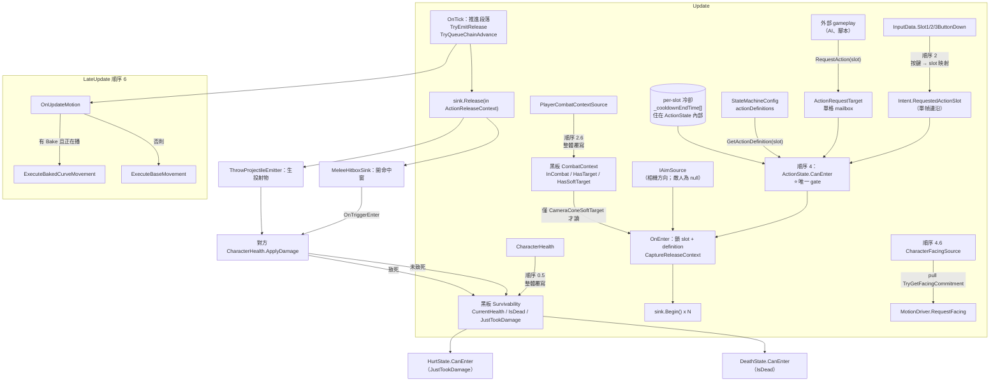
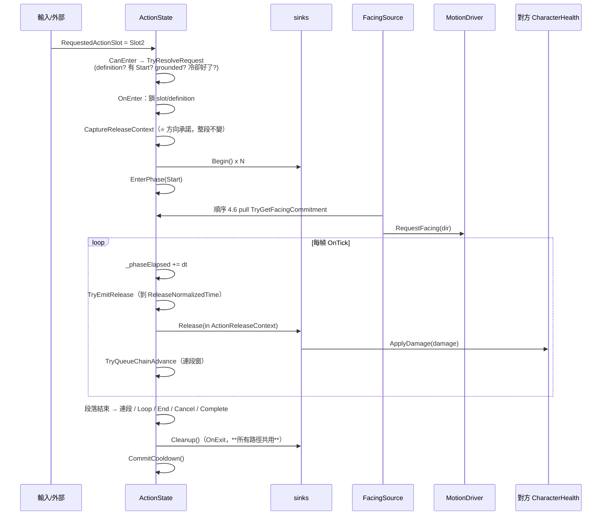
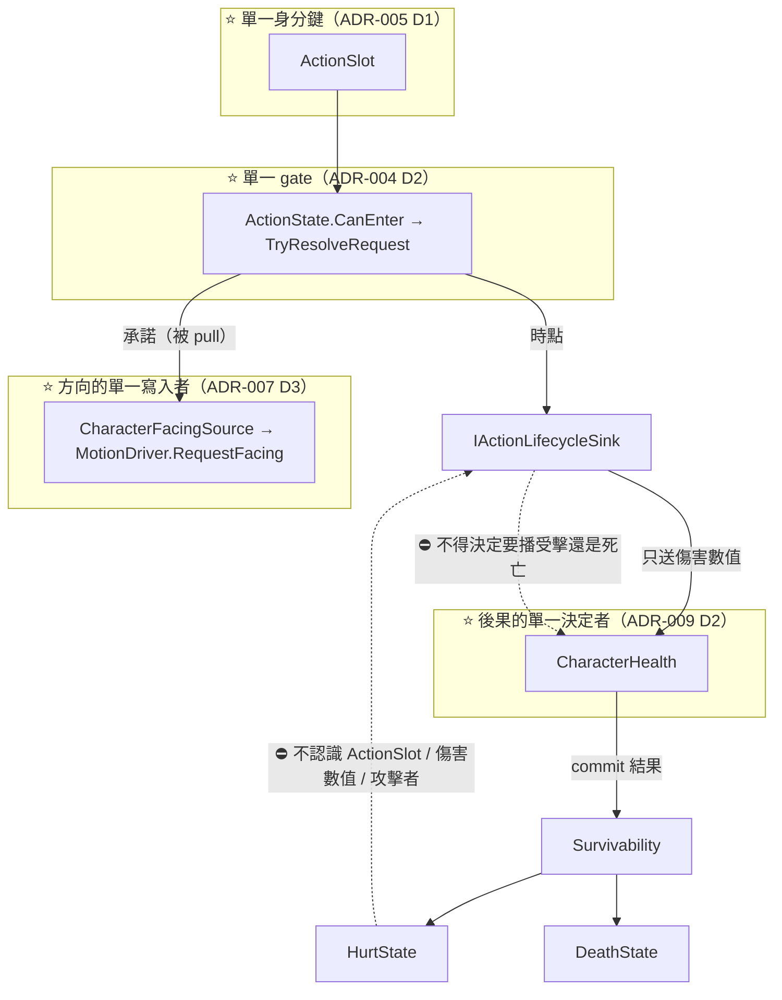

# 32 — Action / Combat 架構理解指南（給人看的版本）

> **這份文件不是規格書。** 決策正本是 **ADR-004**（Action 進 FSM）、**ADR-005**（多 Action／身分）、
> **ADR-007**（方向權威）、**ADR-009**（傷害與死亡）；Living Spec 在
> `docs/08`（Throw 垂直切片）、`docs/11`（Multi-Action）、`docs/15`（Combat Context）、
> `docs/26`（FSM 中斷審查／Model B）。
> 這裡的目標是讓你**看完能自己口頭講一次**，並在看到「招式沒出來／打不到人／被打沒反應」時，
> 一句話說出那是哪一層。
>
> 對應程式：
> `Core/StateMachine/States/ActionState.cs`、`Core/StateMachine/Actions/ActionDefinitionSO.cs`、
> `Core/Actions/`（`ActionSlot` / `ActionRequestTarget` / `ActionReleaseContext` / `IActionLifecycleSink`）、
> `Core/Combat/PlayerCombatContextSource.cs`、`Core/Survivability/CharacterHealth.cs`、
> `Core/StateMachine/States/HurtState.cs`／`DeathState.cs`、
> `Presentation/Actions/`（`MeleeHitboxSink` / `ThrowProjectileEmitter` / `GroundEffectSink`）。
>
> 本文所有數字若無特別註明，皆為 **2026-09-15 由磁碟上的資產實測**。

---

## 0. 一句話講完這個系統在幹嘛

> 「出招」在這個專案裡不是一個腳本，是**一顆 FSM state 讀一份資產**。
> 一顆 `ActionState` 承載所有招式，用 `ActionSlot` 當身分去查 Definition；
> Definition 說有哪些段、每段播什麼、哪一格發生效果、能不能被打斷、冷卻多久。
> 招式的**世界副作用**（開命中窗、生火球、顯示武器）由 sink 接，
> sink 只知道三個時點：`Begin` / `Release` / `Cleanup`。
>
> 而「被打」**刻意不是**一個 Action——它是獨立的 `StateType.Hurt`。

---

## A. 五個概念，別把它們混成一個

| 概念 | 是什麼 | 誰擁有 | ⚠️ 常見誤解 |
|---|---|---|---|
| **Slot（身分）** | `ActionSlot` enum，**數值就是身分** | `Core/Actions` | ❌ 不是「哪顆按鍵」。按鍵→slot 的映射住在管線順序 2 |
| **Definition（內容）** | `ActionDefinitionSO`：段落、動畫鍵、冷卻、中斷、targeting | 資產 | ❌ 不是 state。一顆 state 承載多份 Definition |
| **Phase（段落）** | `Start` / `Loop` / `End` / `Cancel`；連段是「Start 換素材重播」 | `ActionState` | ❌ 連段**不是**新的 phase |
| **Release（生效時點）** | 段落播到 `ReleaseNormalizedTime` 的那一瞬間 | `ActionState` | ❌ 不是動畫事件、不是粒子碰撞 |
| **Commitment（方向承諾）** | 段落邊界取得一次的世界方向快照 | `ActionState`（`ActionReleaseContext`） | ❌ 不是每幀重算的瞄準 |

### 🔴 為什麼「一顆 state 承載多份 Definition」

如果每個技能一顆 state，那麼：
- `StateType` 會隨內容成長（而 `StateType` 是架構不變量）；
- 「能不能出手」會有 N 個回答者。

ADR-004 D2 的規則是：**能不能出手只由 `ActionState.CanEnter` 回答，不得有第二個 gate。**
ADR-005 D1 的規則是：**身分只有一把鍵（`ActionSlot`），輸入映射／冷卻／external request／
Action↔Action 中斷全部用它，不得有第二把。**

---

## B. 整體 runtime data flow



### 每一條主要箭頭在傳什麼

| 箭頭 | 資料 | 擁有者（唯一 Writer） | 空間／單位 | 更新時機 | 跨幀？ |
|---|---|---|---|---|---|
| 輸入 → `Intent.RequestedActionSlot` | `ActionSlot` enum | 順序 2 Intent Processor | — | 每幀，順序 7 復位 | ❌ **單幀邊沿** |
| 外部 → `ActionRequestTarget` | `ActionSlot` | 呼叫方 | — | 任意；FSM 每次 Tick 後 `ClearAfterEvaluation` | ⚠️ 單格 mailbox，**不排隊、不重試** |
| `CharacterHealth` → `Survivability` | `CurrentHealth` / `MaxHealth` / `IsDead` / `JustTookDamage` | `CharacterHealth`（唯一） | 公尺無關，純量 | **順序 0.5**（最早） | `IsDead` 持續型；`JustTookDamage` 單幀，**整體覆寫即復位** |
| `PlayerCombatContextSource` → `CombatContext` | `InCombat` / `HasTarget` / `TargetPosition` / `HasSoftTarget` / `SoftTargetPosition` | 該 producer（唯一） | **世界座標** | 順序 2.6，**整體覆寫** | 內部有 `disengageSeconds` 計時 |
| `IAimSource` → `ActionReleaseContext` | `AimPoint`（世界點，保留高度）＋ `Direction`（正規化） | `ActionState`（快照） | **世界空間** | **段落邊界一次** | ✅ **整段不變** |
| `ActionState` → sink | `Begin()` / `Release(in ctx)` / `Cleanup()` | `ActionState`（時點單一持有） | — | 段落事件 | ❌ |
| sink → `CharacterHealth` | `ApplyDamage(float)` | 呼叫方只送**數值** | 純量 | 命中時 | ❌ |
| `ActionState` → `MotionDriver` | 走 `ExecuteBakedCurveMovement` 或 `ExecuteBaseMovement` | `MotionDriver` | 世界空間 | 順序 6 | ❌ |
| `ActionState` → `CharacterFacingSource` | `TryGetFacingCommitment(out dir)`，**被 pull** | `ActionState` 持有承諾 | 世界 XZ | 順序 4.6 | — |

### 跨幀狀態總表

| 跨幀的東西 | 持有者 | 為什麼 | 弄丟會怎樣 |
|---|---|---|---|
| `_cooldownEndTime[]` / `_cooldownDuration[]` | `ActionState`（**per-slot**） | 冷卻必須跨招式執行存活 | 無冷卻 |
| `_activeSlot` / `_definition` / `_phase` / `_currentEntry` | `ActionState` | 當前執行中的招式身分與段落 | 段落推進失效 |
| `_phaseElapsed` | `ActionState` | 段落計時、release 時點、連段窗 | 同上 |
| `_releaseContext` | `ActionState` | **方向承諾整段不變**（ADR-007 D4/D5） | 火球會在飛出前跟著滑鼠轉 |
| `_releaseEmittedThisExecution` | `ActionState` | 一次執行只發一次 Release（連段時每段重置） | 一次揮擊生兩顆投射物 |
| `_chainIndex` / `_chainQueued` | `ActionState` | 連段推進 | 連段永遠停在第 1 段 |
| `CharacterHealth._currentHealth` / `_isDead` / `_pendingHurt` | `CharacterHealth` | 生命值是持續真相 | — |
| `PlayerCombatContextSource` 的脫離計時 | 該 producer | `disengageSeconds = 5` | 戰鬥語境瞬開瞬關 |
| `MeleeHitboxSink._hitTargets[]` | 該 sink | **單次揮擊每目標只結算一次** | 同一刀打十下 |

---

## C. 一次 Action 的完整生命週期



### 段落轉移規則

| 目前 phase | 條件 | 下一步 |
|---|---|---|
| `Start` | `_phaseElapsed ≥ duration` 且 `_chainQueued` | **換下一段 ChainSegments，phase 仍是 Start** |
| `Start` | `_phaseElapsed ≥ duration`，沒排到連段 | `EnterAfterStart()`（Loop → End → 結束） |
| `Loop` | `DesiredSpeedNormalized ≥ CancelMoveIntentThreshold` | `Cancel` |
| `Loop` | `WaitForTrigger` 且**同一個 slot** 再次被請求 | `End` |
| `Loop` | 非 `WaitForTrigger` 且時間到 | `End` |
| `End` / `Cancel` | 時間到 | `Complete()` |

> 📌 **`duration` ＝ `Bake.Duration`（有 bake 時）否則 `FallbackDuration`。**
> 秒數住在資產，不在程式。

### 🔴 連段為什麼「只排隊，不立刻切段」

```csharp
// 切段固定發生在當前段播完，否則第 2 段會從第 1 段的中途插進來，動作看起來像被吃掉。
if (IsRetriggeredThisFrame(data)) _chainQueued = true;
```

而且**不需要**防「進場那一幀的按鍵被誤判成連按」——理由是時序：
`IntentData` 的 trigger 旗標是「當幀生、當幀死」（順序 7 復位），
而 `FullBodyStateMachine.Tick` 是**先 `OnTick` 才 `OnEnter`**
⇒ 新進入的 state 第一次 `OnTick` 已經是下一幀，進場那次按壓早被清掉了。

---

## D. Authority / Ownership



### 權限表

| 角色 | 可以做 | ⛔ 不可以做 |
|---|---|---|
| `ActionState` | 擁有 gate、段落時點、per-slot 冷卻、方向承諾；派送 sink | ⛔ 播放動畫（只給 `AnimationKey`）；⛔ 建立 GameObject；⛔ 直接寫 `transform`；⛔ 為某個 slot 開語意特例 |
| `ActionDefinitionSO` | **資料**：段落、動畫鍵、bake、冷卻、targeting、中斷旗標 | ⛔ 含邏輯；⛔ 兩份 Definition 共用同一個 Slot |
| `ActionRequestTarget` | 單格 mailbox，合併重複提交 | ⛔ 排隊、重試；⛔ 決定能不能出手 |
| `IActionLifecycleSink` 實作 | 管理**自己的**本地 Unity 物件；只送傷害數值 | ⛔ 擁有 lifecycle／FSM transition／animation authority；⛔ 決定「要播受擊還是死亡」 |
| `CharacterHealth` | **唯一**決定受傷後果；發布 `Survivability` | ⛔ 認識 `ActionRequestTarget` 或任何 Action 概念（2026-09-14 起） |
| `HurtState` | 讀 `JustTookDamage`、計時、只結算垂直位移 | ⛔ 認識 `ActionSlot`／傷害數值／攻擊者；⛔ 決定「能不能進」（那在 config 的 `CanBeInterruptedBy`） |
| `PlayerCombatContextSource` | 寫 `CombatContext` 全區 | ⛔ 被當成第二個 target authority（soft target 是**無記憶候選**，不是 lock-on） |
| `CharacterFacingSource` | 角色朝向的**唯一** request 發送者 | ⛔ 自己決定方向（它 pull 承諾） |

### 「最終決定權」

| 問題 | 誰說了算 |
|---|---|
| 這一幀能不能出手 | 🟣 `ActionState.CanEnter`（**唯一**） |
| 這是哪一招 | 🔑 `ActionSlot` → `Config.GetActionDefinition(slot)` |
| 每段多長 | 🟢 `Bake.Duration`，否則 🟡 `FallbackDuration` |
| 什麼時候生效（開窗／發射） | 🟣 `ActionState` 的 `ReleaseNormalizedTime` |
| 這一擊朝哪 | 🟡 `ActionTargetingPolicy`（authored）＋ 🟠 `IAimSource`（＋只有 soft-target 才讀 `CombatContext`） |
| 能不能被打斷 | 🟡 **兩層**：資產的 `Interruptible`（普通）＋ config 的 `CanBeInterruptedBy`（狀態層／lethal） |
| 打中之後會發生什麼 | 🔴 **對方的 `CharacterHealth`**，不是攻擊者 |
| 角色最後朝哪 | 🟠 `MotionDriver`（rotation 的唯一寫入者） |

---

## E. 關鍵 ordering constraint

| # | 約束 | 交換之後會發生什麼 |
|---|---|---|
| **O1** | `CharacterHealth.PublishTo`（順序 **0.5**）必須在輸入（1）與狀態機（4）**之前** | 傷害在 Physics 階段（早於 Update）結算，順序 0.5 發布的就是最新真相 ⇒ 死亡能在**同一幀**同時封鎖輸入並讓 `DeathState` 接管。移後就會「死了還走一幀」或「死後又出手一次」 |
| **O2** | Combat Context producer（**2.6**）必須在 Intent（2）**之後**、狀態機（4）**之前** | 順序 2 已寫好 action intent，external mailbox 也還沒被順序 4 評估後清除——2.6 因此看得到完整的「這一幀誰想出手」 |
| **O3** | `CaptureReleaseContext` 在 **`OnEnter`／段落邊界**，不是每幀 | 方向承諾會跟著滑鼠一路飄 ⇒ ADR-007 要解的「連段的人與火球分家」原樣重現 |
| **O4** | Facing source（**4.6**）必須在 FSM（4）**之後**、LateUpdate（6）**之前** | 在後，才讀得到當幀已確定的 commitment；在前，request 才來得及被順序 6 消費 |
| **O5** | `sink.Cleanup()` 必須在 `OnExit`，**所有結束／中斷路徑共用** | 被打斷時命中窗不會關 ⇒ 命中窗一直開著 |
| **O6** | `CommitCooldown()` 在 `OnExit`，且連段**整條共用一次** | 每段各算一次冷卻 ⇒ 連段第 2 段就進冷卻 |
| **O7** | `_releaseEmittedThisExecution` 在**換段時**重置，單段不重置 | 連段每段各出一顆投射物 vs Throw 只丟一顆——兩者都要對 |
| **O8** | `MeleeHitboxSink.Begin()` 必須先 `Cleanup()` 再清去重表 | 上一次揮擊的窗或命中紀錄殘留 |
| **O9** | 致死時**不抬起** `JustTookDamage` | Hurt 與 Death 在同一幀爭同一顆 FSM |

---

## F. 重要 invariants

| # | 不變量 | 破壞的後果 |
|---|---|---|
| **I1** | **能不能出手只有一個回答者**（`ActionState.CanEnter`） | 兩個 gate ⇒ 冷卻可以被繞過 |
| **I2** | **身分只有一把鍵**（`ActionSlot`） | 輸入、冷卻、中斷各說各話 |
| **I3** | `ActionSlot` 的**數值即身分**，改名安全、**改值不安全**；且**不要求連續** | 既有資產默默指向別的 slot |
| **I4** | `ActionState` **不為任何 slot 開語意特例** | 2026-09-14 之前有兩處「如果是 Reaction 就反過來」——那是「受擊根本不該是 Action」的訊號 |
| **I5** | sink **只送傷害數值**，不決定後果 | 攻擊者不知道會不會致死 ⇒ 致死幀「受擊先播、死亡再蓋上去」 |
| **I6** | `IsDead` 是 **commit 的結果**，讀者不得自己算 `CurrentHealth <= 0` | 下游重新推導已 commit 的狀態（本 repo review protocol 的加重項） |
| **I7** | `JustTookDamage` **不排隊、不補播** | 翻滾無敵幀結束後補播一次踉蹌＝錯的行為 |
| **I8** | 方向承諾在**段落邊界取得一次**，執行期唯讀 | 火球與角色朝向分家 |
| **I9** | `ActionTargetingPolicy` 是**帶預設值的 enum，不是布林** | 布林忘了勾 ⇒ 不可預測；enum 忘了填 ⇒ 與所有普通招式一致 |
| **I10** | 中斷權限 **100% authored**（兩層：資產 `Interruptible` ＋ config `CanBeInterruptedBy`） | 程式裡出現「哪些狀態比較特別」的硬編碼 |
| **I11** | 每目標每次揮擊只結算一次（固定容量去重表，零 GC） | 一刀打十下 |
| **I12** | `AnimationKey` 只指向 authored data 內**已存在的字串參考** | 每幀配置字串（A23 守著） |

---

## G. 真實 runtime case：玩家按 Q 放火球連段

### 第 0 步：資料

`PlayerStateMachineConfig.asset` 綁三份 Definition：

| Slot | Definition | Targeting | Interruptible | Cooldown | 連段 |
|---|---|---|---|---|---|
| 1 | `MeleeSlash1Definition` | （未填 ⇒ `CameraForward`） | **0** | 0.5 | 無 |
| 2 | `FireballDefinition` | **1 `CameraConeSoftTarget`** | 1 | 0.4 | **3 段** |
| 3 | `IceSpellDefinition` | **1 `CameraConeSoftTarget`** | **0** | 1.5 | 無 |

`FireballDefinition` 展開：

```
Phases[0]      Phase=Start  Key=Spell_Fireball_1  Bake=null  FallbackDuration=1.2000
               Interruptible=1  EmitsRelease=1  ReleaseNormalizedTime=0.35
ChainSegments[0]            Key=Spell_Fireball_2  Bake=null  FallbackDuration=1.2000  Release=0.35
ChainSegments[1]            Key=Spell_Fireball_3  Bake=null  FallbackDuration=1.6000  Release=0.35
ChainInputOpenNormalized = 0.25
Cooldown = 0.4    CooldownVariance = 0    RequiresGrounded = 1
CancelMoveIntentThreshold = 0.1
```

`PlayerCombatContextSource`（`X Bot.prefab`）：

```
enterRadius = 6    leaveRadius = 9    disengageSeconds = 5
targetMask = 128（Layer 7）   selectionConeAngle = 25°
softTargetRange = 12   softTargetConeHalfAngle = 25°
```

FSM 規則：`Action(5)` Priority **10**，`CanBeInterruptedBy = [Roll(4), Jump(3), Hurt(8), Death(7)]`，
`ValidTransitions = [Move(2), Idle(1)]`。

### 第 1 步：按下 Q

- 順序 2：`Slot2ButtonDown` → `Intent.RequestedActionSlot = Slot2`（單幀邊沿）。
- 順序 2.6：`PlayerCombatContextSource` 整體覆寫 `CombatContext`
  （敵人在 12 m 內、鏡頭前方 25° 半角錐內 ⇒ `HasSoftTarget = true`）。
- 順序 4：`EvaluateInterrupts`
  - `ActionState.CanEnter` → `TryResolveRequest`：
    ```
    slot = Slot2（玩家意圖優先於 external mailbox）
    definition = FireballDefinition                    ✓
    HasPhase(Start)                                    ✓
    RequiresGrounded=1 且 data.IsGrounded              ✓
    Time.time >= _cooldownEndTime[2]                   ✓
    ```
  - Idle 的 `CanBeInterruptedBy` 含 Action ⇒ 通過，Priority 10 勝出。

### 第 2 步：`OnEnter` 取得方向承諾（整段不變）

```
policy = CameraConeSoftTarget（authored = 1）
aimSource.TryGetAimPoint(out aimPoint)        ← 相機方向
origin = aimSource.CommitmentOrigin
policy == CameraConeSoftTarget 且 TrySoftTarget(CombatContext, origin, out p)
   ⇒ aimPoint = p                             ← ⭐ 只有這個 policy 才會被改寫
_releaseContext = new ActionReleaseContext(aimPoint, aimPoint − origin)
```

> 🔴 **如果 `Targeting` 沒填（＝`CameraForward`，`MeleeSlash1` 就是），
> 這一段完全不會讀 `CombatContext`。** 這是 2026-09-08 的裁決：
> **吸敵不再是預設；普通招式永遠可預測地朝鏡頭。**

然後 `sink.Begin()` 派送給 Slot2 綁的**所有** sink（2026-09-14 起 per-slot 可有多顆）。

### 第 3 步：順序 4.6，朝向

`CharacterFacingSource` **主動 pull** `TryGetFacingCommitment` ⇒ 拿到承諾的水平投影
⇒ `MotionDriver.RequestFacing(dir)`。

⚠️ **`ActionState` 不會自己去轉角色。** 它只持有承諾，等人來拿。
角色 rotation 的唯一寫入者是 `MotionDriver`。

### 第 4 步：第 1 段，Release 在 35%

```
duration = FallbackDuration = 1.2000 s（Bake 是 null）
release  = 1.2000 × 0.35 = **0.4200 s**
```

`_phaseElapsed ≥ 0.42` 的那一幀 ⇒ `NotifyRelease()` ⇒ 每顆 sink 收到
`Release(in _releaseContext)` ⇒ `ThrowProjectileEmitter` 用**承諾的方向**生出火球。

> 📌 **火球飛的方向是 0.42 秒前鎖定的那個方向，不是當下的滑鼠方向。**
> 這就是承諾的意義——而且角色朝向也來自同一份承諾，所以人和火球不會分家。

### 第 5 步：連段窗

```
連段窗起點 = duration × ChainInputOpenNormalized = 1.2000 × 0.25 = **0.3000 s**
窗的終點 = 該段結束（1.2000 s）
```

在 `[0.30, 1.20]` 內再按一次 Q ⇒ `_chainQueued = true`（**只排隊**）。
段落播完的那一幀 ⇒ `TryAdvanceChain` ⇒ 換 `Spell_Fireball_2`，
`_phase` **仍是 `Start`**，`_releaseEmittedThisExecution` 重置 ⇒ 第 2 顆火球。

第 3 段 `Spell_Fireball_3` 的 `FallbackDuration = 1.6` ⇒ release 在 `1.6 × 0.35 = 0.56 s`。

### 第 6 步：結束與冷卻

不論走哪一條路徑（播完／被 Roll 打斷／被 Hurt 打斷），`OnExit` 都會：

```
NotifyCleanup()     ← 所有 sink 關窗／清理
CommitCooldown()    ← _cooldownEndTime[2] = Time.time + 0.4 + Random[0, 0]
ResetExecutionState()
```

> 📌 **整條連段共用一次冷卻**，在最後一段結束時才提交——不是每段各算一次。

### 第 7 步：如果打中了

```
MeleeHitboxSink.OnTriggerEnter → GetComponentInParent<CharacterHealth>()
  → 排除自己（health.transform.root == transform.root）
  → 去重表檢查（固定 16 格，零 GC）
  → health.ApplyDamage(damage)
```

對方的 `CharacterHealth`：

```
if (_isDead) return false;                 ← 屍體不再結算
_currentHealth = max(0, hp − amount);
if (_currentHealth <= 0) { _isDead = true; _pendingHurt = false; }   ← 致死不抬 hurt
else                     { _pendingHurt = true; }
```

下一幀順序 0.5 發布 ⇒ `HurtState.CanEnter`（`JustTookDamage`）或
`DeathState.CanEnter`（`IsDead`）。

> ⭐ **攻擊者只說「打多少」，不說「要播什麼」。**
> 理由是攻擊者**不知道這一下會不會致死**——讓不掌握資訊的一方做決定，
> 就會在致死幀出現「受擊動畫先播、死亡再蓋上去」。

### 你現在應該能口頭講一次

> 「按 Q 變成 `Intent.RequestedActionSlot = Slot2`，那是單幀邊沿。
> 順序 4 `ActionState.CanEnter` 用那個 slot 查 Definition、檢查有沒有 Start 段、要不要著地、冷卻好了沒
> ——這是唯一的閘門。進去之後第一件事是取得方向承諾，整段不再變；
> 只有標了 `CameraConeSoftTarget` 的招式才會讓戰鬥語境改寫它。
> 段落播到 35% 時派送 `Release`，sink 拿著那份承諾生火球或開命中窗。
> 在 25% 之後再按一次會排隊，等這段播完才換下一段，phase 仍是 Start。
> 結束時所有路徑共用 `Cleanup` 和一次冷卻。
> 打中之後只送傷害數值，要播受擊還是要死由對方的 `CharacterHealth` 決定。」

---

## H. 真實 failure case ①：敵人的攻擊打不斷（一個布林值）

> **症狀**：敵人一出拳就進入無敵霸體，玩家怎麼打都打不斷，直到那一拳播完。

### 沿資料流找根因

| 階段 | 這一層 | 是不是凶手 |
|---|---|---|
| `MeleeHitboxSink` | 傷害有送到 | ❌ |
| `CharacterHealth` | `_pendingHurt = true` | ❌ |
| `HurtState.CanEnter` | `JustTookDamage` ⇒ true | ❌ 它想進來 |
| `EvaluateInterrupts` | `_currentState.CanBeInterruptedBy(Hurt)` | ⚠️ 兩層判斷 |
| config | 敵人的 `Action(5).CanBeInterruptedBy` 含 `Hurt(8)` | ✅ 第一層過 |
| `ActionState.CanBeInterruptedBy` | `return _phase == None \|\| _currentEntry.Interruptible;` | 🔴 **就是這裡** |
| 資產 | `EnemyPunchDefinition.Phases[0].Interruptible` | 🔴 **一個布林值** |

### 根因，一句話

**「這招不可被打斷」的 policy 欄位已經存在，而它被設成了 `false`。**
Super Armor 零新程式——它是一個資產欄位。

### 現況（2026-09-15 實測，**文件已過期**）

```
EnemyPunchDefinition.Phases[0].Interruptible: **1**
Cooldown: 2    CooldownVariance: 1.2
```

**已經改成可打斷了。** `docs/25` §1 記載的「🔴 敵人攻擊打不斷的根因是
`EnemyPunchDefinition.Interruptible: 0` 一個布林值」**不再是現況**。

### 這條裂縫的第二面：霸體 ≠ 打不死

`Interruptible = false` 原本會連**死亡**一起擋掉。ADR-009 D4 的修法是**收窄語意**：

```csharp
public override bool CanBeInterruptedBy(BaseState other)
{
    if (!base.CanBeInterruptedBy(other)) return false;          // config 的狀態層授權
    if (other != null && other.Type == StateType.Death) return true;   // ⭐ lethal 層只受 config 管
    return _phase == ActionPhase.None || _currentEntry.Interruptible;  // 資產的普通層
}
```

> ⚠️ **中斷權限仍然 100% authored**：想讓某個狀態連死亡都擋掉，
> 就把 `Death` 從該狀態的 `CanBeInterruptedBy` 清單裡拿掉——那是資產的決定，不是程式的。
>
> ⛔ 刻意**不**引入通用的 `InterruptAuthority` 分級：目前只有兩級（normal／lethal），
> 為兩級建通用分級制＝在沒有第二個非致死高權中斷的情況下把介面定死。

---

## I. 真實 failure case ②：「受擊」借住在 Action 裡（語意錯位）

> **症狀**：沒有可見的 bug——但 `ActionState` 裡出現了**兩處**「如果是 `Reaction` 就反過來」。

### 兩處反轉

| 位置 | 當時的特例 | 註解自己寫了什麼 |
|---|---|---|
| `ShouldFaceTargetOnEnter(slot)` | `&& slot != ActionSlot.Reaction` | 「受擊不是出手，被打的人不該自己轉去面對攻擊者」 |
| `AllowsSameSlotReentry` | 只允許 `Reaction` 自我重入 | 「硬直中再被打要再踉蹌一次」 |

### 根因，一句話

**程式自己說了兩次「受擊不是出手」。** 正確的結論不是加第三個例外，而是**受擊根本不該是 Action**。

「受擊」與「出手」的差異是結構性的：

| | 出手（Action） | 受擊（Hurt） |
|---|---|---|
| 觸發者 | 自己 | **別人** |
| 方向承諾 | 有 | 無 |
| 自我重入 | ⛔ 不允許（防連段被吃） | ✅ 必須允許（再被打要再踉蹌） |
| 冷卻 | 有 | 無 |
| Release window | 有 | 無 |
| 連段 | 有 | 無 |

**六項裡有五項相反。** 那不是「一個特殊的 Action」，那是另一個東西。

### 修法（`docs/26` Model B，2026-09-14 使用者裁決）

1. 新增 `StateType.Hurt = 8`（**加在最後，不遞補**——config 以 int 序列化）。
2. 准入來源是 `SurvivabilityData.JustTookDamage`，與 `DeathState ← IsDead` **完全對稱**。
3. `ActionSlot.Reaction = 100` **退役但保留數值**（移除或回收會讓殘存資產默默指向別的 slot），
   標 `[Obsolete]`，由測試守住「runtime 不得再引用」與「沒有資產使用它」。
4. `ActionState` 的兩處反轉**刪除**。

### 為什麼 Hurt 的准入不走 mailbox

`docs/26` §I 逐條淘汰了三個候選：

| 候選 | 為什麼不行 |
|---|---|
| `IntentData` | 撞架構不變量 `A5`＋`A21`，而且語意錯（受擊不是「我想做的事」） |
| 注入 `CharacterHealth` | 撞 ADR-009 D3（state 不得取得第二個真相來源） |
| `PresentationEvents` | 層級與時序皆錯（那是表現層事件，順序 6.5 才發布） |

> 🔴 **順帶發現的最重要一件事**：`docs/15` §4.1 明文把 `ActionRequestTarget.PendingSlot`
> 當成「進入戰鬥語境」的條件。離開 mailbox 必須**同步遷移** `PlayerCombatContextSource.cs:52`，
> 否則會出現「被圍毆時反而提早脫離戰鬥」——**而且沒有任何錯誤訊息**。

---

## J. 錯誤理解 vs 正確理解

```
❌ 一個技能 = 一顆 state
✅ 一顆 ActionState 承載所有技能，用 ActionSlot 當身分查 Definition
   （StateType 是架構不變量，不該隨內容成長）
```

```
❌ ActionSlot 代表按哪顆鍵
✅ 它是身分。按鍵→slot 的映射住在管線順序 2
   （原本的 Primary/Secondary/Tertiary 就是「自稱有語意的拉丁文序號」，所以被換掉）
```

```
❌ 招式會自動朝向敵人
✅ 預設是 CameraForward——永遠朝鏡頭。只有顯性標了 CameraConeSoftTarget 的才會被吸敵改寫
   （這是帶預設值的 enum，不是布林：忘了填得到的是「與所有普通招式一致」）
```

```
❌ 瞄準方向每幀更新
✅ 段落邊界取得一次，整段不變。人和火球共用同一份承諾，所以不會分家
```

```
❌ Release 是動畫事件
✅ 是 ActionState 依 ReleaseNormalizedTime 算出來的時點
   命中窗只由它開啟，⛔ 不觀察動畫、VFX 或 particle collision
```

```
❌ 連段是新的 phase
✅ 連段期間 _phase 一直是 Start——它是「同一個 Start 換素材重播」
   這讓 CanTransitionAway / CancelMoveIntentThreshold / Loop 的語意一字不必改
```

```
❌ 連段每段各算一次冷卻
✅ 整條連段共用一次，在最後一段結束時才提交
```

```
❌ 攻擊方 sink 應該決定「要播受擊還是死亡」
✅ 攻擊方只知道「我打中了、打多少」，不知道會不會致死
   讓它決定 ⇒ 致死幀出現「受擊先播、死亡再蓋上去」
```

```
❌ 讀者可以自己算 CurrentHealth <= 0 判斷死亡
✅ IsDead 是 CharacterHealth 做出的**決定**（含「已經死了就不再重複結算」）
   下游重新推導已 commit 的狀態，是本 repo review protocol 點名的加重缺陷
```

```
❌ 被 Roll 擋掉的受擊反應應該事後補播
✅ JustTookDamage 不排隊、不補播——那是語意不是簡化
   翻滾無敵幀結束後補播一次踉蹌是錯的（傷害與扣血照常成立，只有**表現**被丟棄）
```

```
❌ Super Armor 需要新程式
✅ 它是 ActionPhaseEntry.Interruptible 這個 authored 布林值
   （但它只管普通中斷；死亡屬 lethal 層，只受 config 的 CanBeInterruptedBy 管）
```

```
❌ ActionRequestTarget 會排隊，晚一點會被處理
✅ 單格 mailbox：同幀後續提交**覆蓋**前一筆；FSM 每次 Tick 評估後即清除，不排隊不重試
```

---

## K. Debug：該看哪些值，各代表哪一層出問題

| # | 觀察 | 正常 | 異常 ⇒ 哪一層 |
|---|---|---|---|
| 1 | Console 有 `ActionSlot.X 沒有對應的 ActionDefinitionSO` | 無 | 有 ⇒ **資產接線**：`StateMachineConfig.actionDefinitions` 沒收錄，或 Definition 的 `Slot` 欄位填錯（每個 slot 只警告一次） |
| 2 | `Intent.RequestedActionSlot` | 按鍵那一幀非 `None` | 恆 `None` ⇒ **輸入層**：`InputAction` 沒綁，或順序 2 的映射沒寫 |
| 3 | `GetCooldownRemaining(slot)` | 0 | > 0 ⇒ **冷卻中**（這是最常見的「按了沒反應」） |
| 4 | `RequiresGrounded` ＋ `data.IsGrounded` | — | 空中按 ⇒ `TryResolveRequest` 直接 false |
| 5 | `ActiveSlot` / `CurrentPhase` | 出招時非 `None` | `Phase = None` 但動畫在播 ⇒ 動畫層與 state 不同步 |
| 6 | 招式方向不對 | — | 先看 Definition 的 `Targeting`：`0` ⇒ **設計就是朝鏡頭**，不是 bug；`1` 但沒吸到 ⇒ 看 `CombatContext.HasSoftTarget`（12 m / 25°） |
| 7 | 人轉了但火球沒跟著轉（或相反） | 兩者同源 | 不同 ⇒ 有人沒用 `_releaseContext`（**這正是 ADR-007 要解的 FU-6**） |
| 8 | 打不到人 | — | ① `Release` 有沒有發（看 `ReleaseNormalizedTime` × duration）② `hitbox` 有沒有綁（Console 會警告）③ Physics layer ④ `GetComponentInParent<CharacterHealth>()` 找不到 |
| 9 | 一刀打很多下 | 每目標一次 | ⇒ 去重表或 `Begin()` 的重置失效 |
| 10 | 打斷不了 | — | **兩層都要看**：資產 `Interruptible`（普通層）＋ config `CanBeInterruptedBy`（狀態層） |
| 11 | 被打沒反應 | 進 Hurt | ① `Survivability.JustTookDamage` 有沒有抬起（順序 0.5）② 當前狀態的 `CanBeInterruptedBy` 含不含 `Hurt(8)` ③ 是不是**致死**（致死走 `IsDead`，刻意不抬 hurt） |
| 12 | 死了還在動 | — | `Arbitration.BlockInput` 應由 `DeathArbiterSource` 設起。⚠️ 它有**一幀延遲**（順序 4.5 寫、下一幀順序 2 的閘門才看到），這是刻意的取捨 |
| 13 | 連段接不上 | — | 窗是 `[duration × ChainInputOpenNormalized, duration]`。Fireball ＝ `[0.30, 1.20]` |
| 14 | 招式被移動取消 | — | `CancelMoveIntentThreshold`（Fireball / IceSpell ＝ 0.1，`MeleeSlash1` ＝ 0.1，`EnemyPunch` ＝ **0 ＝ 關閉**）。⚠️ 只在 `Loop` phase 檢查 |
| 15 | HUD 冷卻條不準 | — | 用 `GetCooldownNormalized`，**不要**自己拿 `Definition.Cooldown` 當分母——`CooldownVariance` 讓每次長度不同（`EnemyPunch` 就是 2 + [0, 1.2]） |

---

## L. 你應該能自己口頭重述的版本

> **Action 解決的問題**：讓「出招」變成一份資產，而不是一顆新的 state 或一段新的程式。
>
> **資料怎麼流**：按鍵在順序 2 變成 `Intent.RequestedActionSlot`（單幀邊沿）；
> 外部要求走 `ActionRequestTarget` 這個單格信箱。順序 4 `ActionState.CanEnter` 用 slot 查 Definition
> ——那是**唯一**的閘門，冷卻也住在它裡面。進去之後在段落邊界取得一次方向承諾，整段不變；
> 順序 4.6 的 facing source 主動來拿，轉向的執行者是 MotionDriver。
> 段落播到 `ReleaseNormalizedTime` 派送 `Release`，sink 拿著承諾去開命中窗或生投射物。
> 打中之後 sink **只送傷害數值**，後果由對方的 `CharacterHealth` 決定並 commit 到黑板，
> `HurtState` 讀 `JustTookDamage`、`DeathState` 讀 `IsDead`，兩者對稱、不可能同幀相爭。
>
> **誰說了算**：gate 只有一個、身分只有一把鍵、傷害後果只有受害者能決定、
> 方向只有一個寫入者、中斷權限 100% 在資產（分普通層與 lethal 層兩層）。
>
> **跨幀的東西**：per-slot 冷卻、當前段落與計時、方向承諾、連段索引、命中去重表。
>
> **破壞規則會怎樣**：讓 sink 決定後果 ⇒ 致死幀受擊動畫先播再被死亡蓋掉；
> 每幀重算方向 ⇒ 人和火球分家；把受擊塞進 Action ⇒ 程式裡開始長出「如果是受擊就反過來」；
> 讓 HUD 自己算冷卻進度 ⇒ 只有在冷卻有變異時才發作的靜默錯誤。

---

## 附錄 A：文件與程式／資產不一致之處（2026-09-15 對照）

| 位置 | 文件怎麼寫 | 磁碟上實際是什麼 | 影響 |
|---|---|---|---|
| `docs/25` §1 關鍵現況 ③ | 「🔴 敵人攻擊打不斷的根因是 `EnemyPunchDefinition.Interruptible: 0` 一個布林值」 | 🔴 **已過期**：現為 `Interruptible: 1` | 不要再當成待修項。§H 保留該案例是因為它的**推理過程**仍然有效 |
| `docs/25` §1 關鍵現況 ① | 「受擊反應已經是一個 Action（`ActionSlot.Reaction` ＋ `DamageDefinition.asset`）⇒ 不需要新的 Hurt state」 | 🔴 **已被推翻**：`docs/26` Model B 已落地，`StateType.Hurt = 8` 存在且被 config 引用；`DamageDefinition.asset` **已從磁碟刪除**；`ActionSlot.Reaction` 標記 `[Obsolete]` | 讀 `docs/25` 時要知道它的前提已經改變 |
| `docs/26` §B 關鍵事實 ② | 「`Jump` 的 `CanBeInterruptedBy` 是空清單」 | 🔴 **已過期**：現為 `[Hurt(8), Death(7)]` | 見 `docs/31` §I |
| `docs/15` §4.1 | 把 `ActionRequestTarget.PendingSlot` 當成戰鬥語境的進入條件 | ⚠️ 需核對 `PlayerCombatContextSource.cs` 現況——`docs/26` §I 已警告「離開 mailbox 必須同步遷移，否則被圍毆時反而提早脫離戰鬥，且無任何錯誤訊息」 | **這一項本文未逐行驗證**，列為需要確認的項目而非已知缺陷 |
| `docs/08`／ADR-004 的 Throw 切片 | `ThrowDefinition` 是 Slot1 | `ThrowDefinition.asset` 的 `Slot` 欄位**未序列化**（⇒ 預設 `Slot1`），但它**不在** `PlayerStateMachineConfig.actionDefinitions` 裡；Slot1 現在是 `MeleeSlash1Definition` | Throw 目前**沒有掛在玩家身上**。資產還在，但不是現行內容 |

## 附錄 B：目前 authored 值速查

### 玩家三格

| | Slot1 `MeleeSlash1` | Slot2 `Fireball` | Slot3 `IceSpell` |
|---|---|---|---|
| Targeting | `CameraForward`（未填） | `CameraConeSoftTarget` | `CameraConeSoftTarget` |
| Start 動畫鍵 | `Melee_Slash1` | `Spell_Fireball_1` | `Spell_Ice` |
| Bake | ✅ 有 | ❌ 無（用 fallback 秒數） | ❌ 無 |
| 段長 | 0.6 s | 1.2 s | 1.3667 s |
| `Interruptible` | **0** | 1 | **0** |
| `EmitsRelease` / `ReleaseNormalizedTime` | ✅ / 0.40 ⇒ **0.24 s** | ✅ / 0.35 ⇒ **0.42 s** | ✅ / 0.35 ⇒ **0.478 s** |
| 連段 | 無 | **3 段**（1.2 / 1.2 / 1.6 s） | 無 |
| `ChainInputOpenNormalized` | 0.25 | 0.25 ⇒ 窗 `[0.30, 1.20]` | 0.25 |
| `Cooldown` / `Variance` | 0.5 / 0 | 0.4 / 0 | 1.5 / 0 |
| `CancelMoveIntentThreshold` | 0.1 | 0.1 | 0.1 |

### 敵人

| | `EnemyPunch`（Slot1） |
|---|---|
| Targeting | `CameraForward` |
| 段長 | fallback 0.8 s（有 Bake） |
| `Interruptible` | **1** |
| Release | 0.40 ⇒ 0.32 s |
| `Cooldown` / `Variance` | **2.0 / 1.2**（⇒ 實際 2.0–3.2 s，避免像節拍器） |
| `CancelMoveIntentThreshold` | **0**（關閉） |

### FSM 規則（玩家）

| State | Priority | CanBeInterruptedBy | ValidTransitions |
|---|---|---|---|
| Idle(1) | 0 | Roll, Jump, Action, Traversal, Hurt, Death | Move |
| Move(2) | 0 | Jump, Roll, Action, Traversal, Hurt, Death | Idle |
| Jump(3) | 10 | Hurt, Death | Move, Idle |
| Roll(4) | 20 | Death | Move, Idle |
| **Action(5)** | **10** | **Roll, Jump, Hurt, Death** | Move, Idle |
| Traversal(6) | 30 | Death | Jump, Move, Idle |
| **Hurt(8)** | **15** | **Hurt, Death** | Move, Idle |
| Death(7) | 100 | （空） | Idle, Move |

> 📌 敵人的 config 幾乎相同，差別是**沒有 Traversal(6)**，且 Action(5) 的可打斷清單是 `[Hurt, Death]`
> （玩家多了 Roll 與 Jump）。

### 戰鬥語境（`X Bot.prefab`）

```
enterRadius 6 / leaveRadius 9 / disengageSeconds 5
targetMask = Layer 7    selectionConeAngle 25°
softTargetRange 12      softTargetConeHalfAngle 25°
```

---

## 相關文件

- **ADR-004** —— Action 進 FSM（D2：單一 gate）
- **ADR-005** —— 多 Action／身分（D1：單一身分鍵）✅ Accepted 2026-09-06
- **ADR-007** —— 方向權威（🟡 Trial；D3 facing 單一寫入者、D4/D5 段落承諾）
- **ADR-009** —— 傷害與死亡（D1 Survivability、D2 後果決定權、D3 單一真相、D4 兩層中斷）
- `docs/11-multi-action.md` —— Multi-Action Living Spec（§4.3 連段、§8.3 targeting policy）
- `docs/14-direction-authority.md` —— 方向權威 Living Spec
- `docs/15-combat-context.md` —— Combat Context Living Spec（⚠️ §4.1 見附錄 A）
- `docs/26-fsm-interruption-review.md` —— FSM 中斷矩陣、Model B、§I Hurt seam 專查
- `docs/31-jump-falling-landing-architecture-guide.md` §I —— 同一張中斷表的另一面
