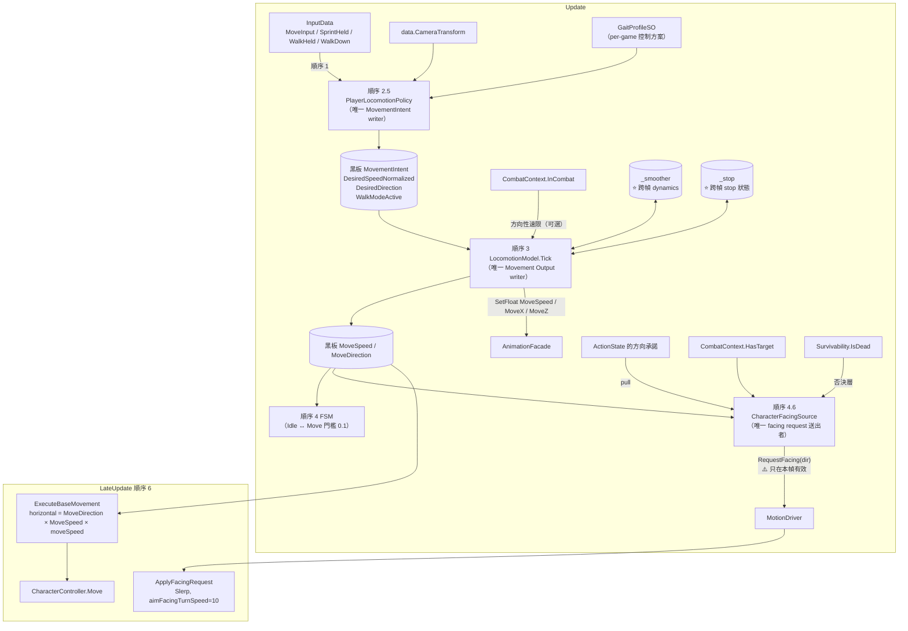
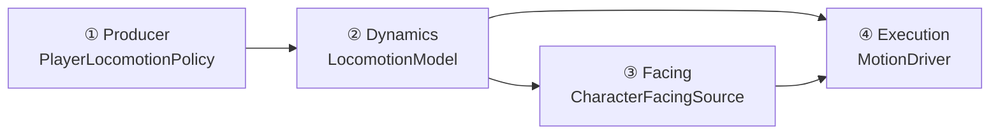
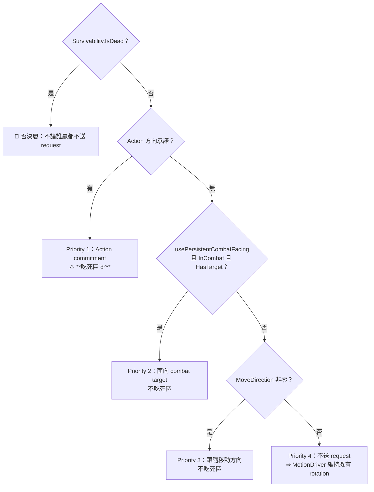

# 33 — Locomotion / Direction Authority 架構理解指南（給人看的版本）

> **這份文件不是規格書。** 決策正本是 **ADR-003**（Movement 分層）與 **ADR-007**（方向權威，🟡 Trial）；
> Living Spec 在 `docs/04`（Locomotion 基礎）、`docs/07`（過渡段）、`docs/13`（戰鬥移動）、
> `docs/14`（Direction Authority）。
> 這裡的目標是讓你**看完能自己口頭講一次**，並且能回答本專案最容易搞混的一件事：
> **「角色往哪走」與「角色面向哪」是兩件不同的事，而歷史上它們共用過同一個載體。**
>
> 對應程式：
> `Core/Movement/`（`IMovementIntentSource` / `PlayerLocomotionPolicy` / `GaitProfileSO` /
> `LocomotionSpeedSmoother`）、`Core/Movement/Models/`（`IMovementModel` / `LocomotionModel` /
> `LocomotionStopRuntime` / `LocomotionStopSelector` / `CombatDirectionalSpeedProfileSO`）、
> `Core/Facing/CharacterFacingSource.cs`、`Presentation/Motion/MotionDriver.cs`、
> `Presentation/Camera/AimResolver.cs`。
>
> 本文所有數字若無特別註明，皆為 **2026-09-15 由磁碟上的資產實測**
> （`X Bot.prefab`、`Gait_ActionRPG.asset`、`Locomotion.asset`、`Bake_*FwdLoop.asset`）。

---

## 0. 一句話講完這個系統在幹嘛

> 玩家推搖桿 → 有人把它翻成「往哪、多用力」（**意圖**）→ 有人把意圖平滑成「實際速度與方向」
> （**運動輸出**）→ 有人照著它移動角色（**執行**）。
>
> 而「角色臉朝哪」是**第四件事**，它有自己的優先序，而且**不一定等於移動方向**。

---

## A. 🔴 三個方向概念（這一節是本文存在的理由）

| # | 概念 | 中文 | 它回答什麼 | 載體 | 誰寫 |
|---|---|---|---|---|---|
| 1 | **Movement Direction** | 移動方向 | 角色的**身體往哪位移** | `PlayerRuntimeData.MoveDirection` | `LocomotionModel`（唯一） |
| 2 | **Facing** | 朝向 | 角色的**模型正面朝哪** | `transform.rotation` | `MotionDriver`（唯一） |
| 3 | **Aim** | 瞄準 | 這一擊的**世界方向** | `ActionReleaseContext` / `IAimSource` | `ActionState` 在段落邊界快照 |

### ADR-007 要解的問題，一句話

> **三個方向概念共用兩個載體。**

具體是：`transform.forward`（本該只表達 ② Facing）被拿來冒充 ① Movement Direction。
兩個可觀察的後果：

| 後果 | 為什麼 |
|---|---|
| **Strafe（側移）不可能** | 如果移動方向 ≡ `transform.forward`，那「面向敵人同時往左走」在數學上無法表達 |
| **連段的人與火球分家** | 承諾（人要轉去哪）與發射（火球往哪飛）各自解讀當下方向 ⇒ 兩者會漂開 |

### 現在的規則

```
① Movement Direction  ← 相機投影 ＋ 角速度限制，是 XZ 平面的世界向量，與 transform 無關
② Facing              ← 由 CharacterFacingSource 解出「該朝哪」，交給 MotionDriver 執行
③ Aim                 ← 段落邊界取得一次的快照，人與效果**共用同一份**
```

> 📌 **`transform.forward` 從此只表達 ②。** 任何地方用它當移動方向都是 bug。

---

## B. 整體 runtime data flow



### 每一條主要箭頭在傳什麼

| 箭頭 | 資料 | 擁有者（唯一 Writer） | 空間／單位 | 更新時機 | 跨幀？ |
|---|---|---|---|---|---|
| 輸入 → Policy | `MoveInput`（Vector2）、三顆修飾鍵訊號 | `PlayerInputSource` | 搖桿空間 [-1,1] | 順序 1，`ref struct` **只能沿呼叫堆疊傳遞** | ❌ |
| 相機 → Policy | `CameraTransform.forward/right` | `ThirdPersonCamera` | 世界 | 每幀讀 | ❌ |
| Policy → `MovementIntent` | `DesiredSpeedNormalized` [0,1]、`DesiredDirection`（**世界 XZ，已正規化**）、`WalkModeActive` | `PlayerLocomotionPolicy`（唯一） | **世界空間** | 順序 2.5，**每幀整體覆寫** | ⚠️ `WalkModeActive` 是**持久 mode**，刻意**不**參與順序 7 復位 |
| `MovementIntent` → Model | 同上 | — | 世界 | 順序 3 | — |
| `CombatContext` → Model | `InCombat`（只有裝了 profile 才讀） | `PlayerCombatContextSource` | — | 順序 3 | — |
| Model → `MoveSpeed`/`MoveDirection` | float [0,1]、Vector3（世界 XZ，y=0） | `LocomotionModel`（唯一） | **世界空間** | 順序 3 | ✅ `_smoother` 內部有速度／SmoothDamp 緩存／最後方向 |
| Model → Animator 參數 | `MoveSpeed`、`MoveX`、`MoveZ` | `LocomotionModel` | `MoveX/Z` 是**角色本地** XZ | 順序 3（**刻意不在 LateUpdate**） | ❌ |
| 承諾／戰鬥目標／移動方向 → FacingSource | 三個候選方向 | 各自 | 世界 XZ | 順序 4.6 | ❌ |
| FacingSource → MotionDriver | `RequestFacing(worldDirection)` | `MotionDriver` 持有 | 世界 XZ（**y 被壓平**） | 順序 4.6 | ⚠️ **只在本幀有效**（`_facingRequestFrame`） |
| `MoveDirection`×`MoveSpeed` → Move | `horizontal = dir × MoveSpeed × moveSpeed` | `MotionDriver` | 世界，m/s | 順序 6 | — |

### 跨幀狀態總表

| 跨幀的東西 | 持有者 | 為什麼 | 弄丟會怎樣 |
|---|---|---|---|
| `_smoother._speed` / `_smoothVelocity` | `LocomotionModel`（值型別內嵌） | B9 平滑必須有狀態 | 鍵盤 0/1 直送 ⇒ 一幀從 Idle 跳 Sprint，中間 tier 踩不到 |
| `_smoother._lastDirection` | 同上 | 放開之後的**滑行方向** | 放開瞬間方向歸零 ⇒ 殘速沒有方向可走 |
| `_smoother._direction` | 同上 | 角速度限制的起點 | 轉向瞬移 |
| `MovementIntent.WalkModeActive` | **黑板**（不是 policy 私有欄位） | toggle 是持久型態；ADR-003 D5 明文「mode/toggle state 進黑板」 | netcode rewind 後角色型態與紀錄不一致 |
| `_stop`（`LocomotionStopRuntime`） | `LocomotionModel` | 收步段的相位／計時 | 停步動畫接不上 |
| `_wasIntending` / `_lastMotionFrame` | `LocomotionModel` | 偵測「放開」這個邊沿 | 收步永遠不觸發 |
| `_requestedFacingDirection` / `_facingRequestFrame` | `MotionDriver` | facing request 的**單幀信箱** | 上一幀的請求會殘留 |

> 🔴 **`PlayerLocomotionPolicy` 刻意沒有任何私有欄位。** toggle 狀態「讀黑板 → 翻轉 → 寫回黑板」，
> 因為 ADR-003 §9-L5 的 snapshot-able 前提要求**無隱藏態**。

---

## C. 四層的職責邊界



| 層 | 回答什麼 | ✅ 可以 | ⛔ 不可以 |
|---|---|---|---|
| **① Producer** | 「玩家**想**往哪、多用力」 | 讀輸入、讀相機、讀 GaitProfile、解析 toggle | ⛔ **回讀 gameplay state 或當前 model**（會造成 producer → state 的同幀回圈）；⛔ 判斷「這顆 Shift 現在是不是給移動用的」（那是上游 Input action map 的事）；⛔ 持有私有狀態 |
| **② Dynamics** | 「實際上在以什麼速度、什麼方向移動」 | B9 平滑、角速度限制、收步段、戰鬥方向性速限、驅動自己的動畫參數 | ⛔ 讓 `MoveSpeed` 有第二個來源（它必須恆可由 intent 重新導出）；⛔ 認識任何 Mixer（tier 門檻是資料） |
| **③ Facing** | 「角色臉該朝哪」 | 三段優先序 ＋ 死亡否決層 ＋ 死區 | ⛔ 自己決定方向（它 pull 承諾）；⛔ 直接改 rotation |
| **④ Execution** | 「把它變成真的位移與旋轉」 | `Move()`、`Slerp` 旋轉、重力、膠囊偏移 | ⛔ 決定方向；⛔ 決定速度大小的來源 |

### 🔴 為什麼「移動控制方案」住在 Producer

「預設 Run／Shift=Sprint／Ctrl=Walk」這類規則：

- **不屬 State**——會把控制方案焊進 FSM 拓撲；
- **不屬 Input**——會把 gameplay 語意烤進 raw input；
- **不屬 Runner**——會讓通用管線認識 locomotion 概念。

所以它住在 `PlayerLocomotionPolicy` ＋ `GaitProfileSO`。
**換玩法控制方案 ＝ 換一顆 asset**，管線核心零改。

---

## D. Facing 的四段優先序



### 為什麼只有 Priority 1 吃死區

| 來源 | 性質 | 死區政策 | 理由 |
|---|---|---|---|
| Action commitment | **站定姿勢** | ✅ 8° 死區 | 避免半蹲的腳掌被連續微轉拖著扭 |
| Combat target | **continuous dynamics** | ❌ 不吃 | 即使角差很小也必須逐幀送出，否則會累積成「停住 → 飄出死區 → 猛轉」的**極限環** |
| MoveDirection | 同上 | ❌ 不吃 | 同上 |

> 📌 程式把這條規則抽成可測的純函式 `ShouldRequestFacing(...)`：
> 「**只回答兩個方向是否落在同一個死區內，不決定哪一種來源該使用死區**」。
> 來源政策留在 `Tick`，**避免 movement 與站定 Action 再次共享一套錯誤規則**。

### 🔴 死亡是**否決層**，不是 Priority 0

```csharp
bool isDead = data.Survivability.IsDead;
...
bool requestSent = !isDead && resolved && ShouldRequestFacing(...);
```

註解記錄了為什麼 `DeathArbiterSource` 擋不住這件事（2026-09-14 使用者 Play 回報：**屍體會不斷面向玩家**）：

> `DeathArbiterSource` 封鎖的是 `BlockInput`，也就是**輸入產生的意圖**。
> 但 facing 的第二順位讀的是 `CombatContext`，由 `AIMovementSource` 在順序 2.5 **直接寫入黑板**，
> **根本不經過輸入** ⇒ 封鎖輸入對它毫無作用。

修法是**不送 request** ⇒ `MotionDriver` 維持既有 rotation ⇒ 這正是 Priority 4 既有的語意。
⛔ 因此**不需要**新增任何「凍結朝向」機制或 `MotionDriver` 側的旗標。

---

## E. 關鍵 ordering constraint

| # | 約束 | 交換之後會發生什麼 |
|---|---|---|
| **O1** | Producer（**2.5**）→ Model（**3**）→ FSM（**4**）→ Facing（**4.6**）→ 動畫（**5**）→ 位移（**6**） | 這是整條鏈的骨幹，任一段前移都會讓下游讀到上一幀的值 |
| **O2** | Model Tick（3）**每幀無條件**，**不看當前狀態** | Jump／Roll 期間仍須推進——JumpState 的空中控制吃的正是 model 的運動輸出；否則**落地會拿起跳時的殘值續走＝滑步** |
| **O3** | 動畫參數在 **Update（順序 3）** 驅動，⛔ 不搬到 LateUpdate | Animator 評估卡在 Update 與 LateUpdate 之間 ⇒ 搬過去會讓**動畫參數比位移晚一幀** |
| **O4** | `CaptureLocomotionTime` 在 `Tick` 的**最開頭** | 順序 3 早於 FSM 切入 Jump；等到順序 6 時順序 5 已開始 cross-fade 到 Jump，**腳相來源可能消失** ⇒ LU/RU 承諾不了 |
| **O5** | Facing（4.6）在 FSM（4）**之後**、LateUpdate（6）**之前** | 在後才讀得到當幀已確定的 Action commitment；在前 request 才來得及被順序 6 消費 |
| **O6** | `RequestFacing` 是**單幀信箱**，`ApplyFacingRequest` 先檢查 `_facingRequestFrame == Time.frameCount` | 不檢查 ⇒ 上一幀的請求殘留 ⇒ 沒人請求時角色還在轉 |
| **O7** | BlockInput 把**輸入**歸零，⛔ 不是跳過順序 2.5 | `MovementIntent` 是**連續型**、刻意不參與順序 7 復位。跳過 producer ≠ 意圖歸零，而是**意圖凍結在最後一幀** ⇒ 封鎖瞬間正按著 W 全速跑的話，角色會**以全速無限前進且放不下來** |
| **O8** | 歸零的是 `InputData` 而不是 `MovementIntent` | 後者需要 `MovementIntent` 的第二寫入者（直接違反 §7-A5）；歸零輸入則讓 producer **完全不需要知道「封鎖」這個概念存在** |
| **O9** | 收步的「入場強度」必須在 `_smoother.Tick` **之前**快照 | 否則 0.75 的 Run 在 60/120 FPS 首幀分別掉到約 0.739/0.747 ⇒ **錯過 0.75 下界** ⇒ tier 選擇變成幀率相依 |

---

## F. 重要 invariants

| # | 不變量 | 破壞的後果 |
|---|---|---|
| **I1** | **每個 domain 任一時刻只有一個 active producer** 寫該 intent region | 兩份意圖 |
| **I2** | **Producer context-free**：不回讀 gameplay state | producer → state 的同幀回圈 |
| **I3** | `MoveSpeed` / `MoveDirection` 是**衍生值**，恆可由 `MovementIntent` ＋ dynamics 重新導出。**禁止任何路徑繞過 intent 直寫** | 兩個真相來源 |
| **I4** | `MovementIntent` 是**連續型**，⛔ 不參與順序 7 復位 | producer 缺席的幀會產生「意圖瞬間歸零」的假訊號 |
| **I5** | `WalkModeActive` 這類 **mode/toggle state 進黑板**，不藏在元件私有欄位 | netcode rewind 後型態不一致 |
| **I6** | `DesiredDirection` 在**producer 邊界**就完成相機投影；下游一律只接觸**水平、正規化的世界方向** | 相機空間洩漏到下游 |
| **I7** | `transform.forward` **只表達 Facing**，⛔ 不得冒充移動方向 | strafe 不可能（ADR-007 的起點） |
| **I8** | 角色 rotation 的**唯一寫入者是 `MotionDriver`**；facing request 的**唯一送出者是 `CharacterFacingSource`** | 兩個人轉同一顆角色 |
| **I9** | 人與效果**共用同一份方向承諾** | 連段的人與火球分家（FU-6） |
| **I10** | 角速度限制用 **yaw 推進再重建向量**，⛔ 不用 `Vector3.RotateTowards` | 恰好 180° 反向時旋轉平面未定義 |
| **I11** | 轉到位時**直接採用目標向量**，不再經 `Atan2 → Sin/Cos` 往返 | 直線前進時方向會停在 `(1, 0, −4.37e−8)`，讓「安定後方向恆等於意圖方向」不成立 |
| **I12** | `LocomotionModel` **不認識任何 Mixer**——tier 門檻是資料，住在 `Locomotion.asset` | 呈現參數焊進程式 |

---

## G. 真實 runtime case：X Bot 從站定推滿前進

### 第 0 步：資料

`Gait_ActionRPG.asset`：

```
defaultIntensity = 0.7500     ← 無修飾鍵
sprintIntensity  = 1.0000     ← 按住 Sprint
walkIntensity    = 0.3651     ← Walk 型態
respectAnalogMagnitude = true
walkIsToggle     = **true**   ← Ctrl 是「按一下切換」，不是按住
```

`LocomotionModel`（`X Bot.prefab`）：

```
moveSpeedAccelTime = 0.12    moveSpeedDecelTime = 0.18
directionTurnDegreesPerSecond = 720
combatDirectionalSpeedProfile = **null**（玩家維持 1D；Y Bot 才有 2D cardinal）
walkStop [0.35, 0.50]    runStop [0.75, 0.875]    stopTimeoutMargin = 0.25
```

`MotionDriver`（`X Bot.prefab`）：

```
moveSpeed（Inspector 顯示）= 5.66
moveSpeedSource = Bake_SprintFwdLoop     overrideMoveSpeed = 0
aimFacingTurnSpeed = 10
```

> 🔴 **Inspector 上的 `5.66` 在執行期不成立。**
> `Awake` 會用 `moveSpeedSource.GetRepresentativeSpeed()` 覆寫它：
> `Bake_SprintFwdLoop` 的代表速度是 **6.2614 m/s** ⇒ 執行期 `moveSpeed = 6.2614`。
> 這是「動畫數據 → 配置」的刻意設計（讓「動畫天生跑多快」成為速度真相，根除滑步），
> 但它意味著**你在 Inspector 讀到的值是舊的**。

三支 loop 的烘焙代表速度（實測）：

```
Bake_WalkFwdLoop   = 1.6443 m/s
Bake_RunFwdLoop    = 3.5781 m/s
Bake_SprintFwdLoop = 6.2614 m/s   ← speed_max
```

`Locomotion.asset`（1D Mixer，實測）：

```
_Thresholds = [ 0 ,  0.35  ,  0.75  ,  1 ]
_Speeds     = [ 1 ,  1.3328,  1.3125,  1 ]
              Idle   Walk     Run      Sprint
```

### 第 1 步：⭐ 驗算「為什麼不會滑步」

這是整個 locomotion 最漂亮的一件事，而且**可以用計算機驗算**：

| Mixer 節點 | threshold t | clip 原生速度 | `_Speeds` 補償 | **補償後世界速度** | `t × moveSpeed(6.2614)` |
|---|---:|---:|---:|---:|---:|
| Idle | 0 | 0 | 1 | 0 | 0 |
| Walk | 0.35 | 1.6443 | 1.3328 | **2.1917** | **2.1915** |
| Run | 0.75 | 3.5781 | 1.3125 | **4.6963** | **4.6961** |
| Sprint | 1.00 | 6.2614 | 1 | **6.2614** | **6.2614** |

> ⭐ **每一個節點的「補償後腳步速度」都等於「threshold × moveSpeed」。**
> 因為 mixer 在 threshold 之間是線性內插，所以這個等式在**軸上每一點**都成立
> ⇒ **不論 `MoveSpeed` 是多少，腳步速度永遠等於世界速度。零滑步。**
>
> 📌 這就是 `docs/04` §10 那條公式的實際兌現方式：
> 校準不一定要靠移動 threshold，也可以靠 `_Speeds` 補償。兩種做法只要滿足上面那條等式都對。

### 第 2 步：按下 W（無修飾鍵）

順序 2.5，`PlayerLocomotionPolicy.ProduceIntent`：

```
magnitude = clamp01(|MoveInput|) = 1
walkActive = (walkIsToggle) ? (黑板現值 XOR WalkButtonDown) : WalkButtonHeld
           = false XOR false = false
DesiredSpeedNormalized = gaitProfile.ResolveIntensity(1, sprint=false, walk=false)
                       = defaultIntensity × magnitude = 0.75 × 1 = **0.75**
DesiredDirection = ProjectInputToWorld(MoveInput, camera.forward, camera.right)
                 → 壓平 y、正規化 → **世界 XZ 單位向量**
```

> 📌 **相機只是投影基底，不是角色方向真相。** 投影在 producer 邊界完成，
> 下游一律只接觸水平、正規化的世界方向。相機缺席時退化為無方向意圖。

### 第 3 步：順序 3，B9 平滑

```
desired = 0.75 > _speed(0) ⇒ smoothTime = moveSpeedAccelTime = 0.12
_speed = SmoothDamp(_speed, 0.75, ref _smoothVelocity, 0.12, ∞, dt)
```

`SmoothDamp` 的時間常數 0.12 s ⇒ 大約 **0.12 s 走完 63%**、約 0.25 s 接近目標。
這段期間 `MoveSpeed` 會**連續經過 0.35（Walk 節點）**
⇒ Mixer 依序踩過 Idle → Walk → Run，而不是一幀跳過去。

方向：從靜止起步時 `_direction` 是零 ⇒ **第一幀直接採用 desired**（沒有合理的旋轉起點）；
之後才套 `720°/s` 的角速度上限。

寫出：

```
data.MoveSpeed     = _smoother.Speed
data.MoveDirection = _smoother.Direction
animationFacade.SetFloat(MoveSpeed, _smoother.Speed)
animationFacade.SetFloat(MoveX / MoveZ, ProjectMoveParameters(transform.rotation, MoveDirection, Speed))
```

> 📌 `MoveX` / `MoveZ` 是**角色本地** XZ（世界方向投影回角色座標系）。
> 這就是 strafe 的資料基礎：`MoveZ = 1, MoveX = 0` 是前進，`MoveZ = 0, MoveX = −1` 是往左側移
> ——**而角色朝向不變**。

### 第 4 步：順序 4，FSM

`LocomotionModel.MoveThreshold = 0.1` ⇒ `MoveSpeed ≥ 0.1` 視為 Move，否則 Idle。

> 📌 這個 0.1 原本硬編在 `IdleState/MoveState.CanEnter` 裡。
> 數值與行為完全等價，**差別只在歸屬**——它是 locomotion 的內部門檻，不該長在狀態機裡。

### 第 5 步：順序 4.6，Facing

```
isDead = false
hasCommitment = false（沒在出招）
hasCombatFacing = false（玩家 usePersistentCombatFacing 預設 false）
⇒ Priority 3：跟隨 data.MoveDirection
⇒ fromActionCommitment = false ⇒ **不吃死區** ⇒ 每幀都送 request
```

### 第 6 步：順序 6，執行

```
ApplyFacingRequest：
  _facingRequestFrame == Time.frameCount ✓
  transform.rotation = Slerp(current, target, aimFacingTurnSpeed(10) × dt)
      ⇒ 每幀補上剩餘角差的 ~16.7%（60 fps）

ExecuteBaseMovement：
  horizontalVelocity = MoveDirection × MoveSpeed × moveSpeed
                     = dir × 0.75 × 6.2614 = **4.696 m/s**
  finalMovement = horizontalVelocity + GetGravityThisFrame(data)
  characterController.Move(finalMovement × dt)
```

### 第 7 步：放開 W——收步是另一條路徑

```
LocomotionStopSelector.IsReleaseRequest(_wasIntending=true, desired≈0, grounded, ...) ⇒ true
releaseEntryIntensity = _smoother.Speed（⭐ 在 SmoothDamp 之前快照）
SelectTier(0.75, walk[0.35, 0.50], run[0.75, 0.875]) ⇒ **Run tier**
⇒ TryStartStop → 找腳相對得上的 RunStop_LU / RunStop_RU
```

Pending stop 期間 **`_smoother.Tick` 不跑**——維持 release-entry 的速度與方向走到最近的 authored 入場相位，
避免「先 B9 減速、播放 Stop 時又被曲線重新推動」。

> 📌 **入場強度必須在平滑之前快照**（見 §E 的 O9）：
> 0.75 的 Run 在 60/120 FPS 首幀會分別掉到約 0.739 / 0.747 ⇒ **錯過 0.75 這個下界**
> ⇒ tier 選擇變成幀率相依。

### 你現在應該能口頭講一次

> 「Policy 在順序 2.5 把搖桿量乘上 gait 檔位，變成 0–1 的強度，再把 2D 輸入用相機的水平基底
> 投影成世界方向——相機只是投影基底，不是角色方向。
> 順序 3 的 model 用 SmoothDamp 把強度平滑（加速 0.12 秒、減速 0.18 秒），
> 方向用 720 度/秒的角速度限制推進，寫成黑板的 MoveSpeed 與 MoveDirection，
> 同時驅動自己的動畫參數——而且必須在 Update 驅動，因為 Animator 評估卡在 Update 和 LateUpdate 之間。
> 順序 4.6 的 facing source 依四段優先序解出角色該朝哪：Action 承諾最優先且吃 8 度死區，
> 其次是戰鬥目標，再其次才是移動方向，都沒有就不送 request；死亡是否決層。
> 順序 6 MotionDriver 把方向 Slerp 過去、把速度乘上 6.2614 交給 CharacterController。
> 不會滑步的原因是：mixer 每個節點補償後的腳步速度剛好等於 threshold 乘上 6.2614。」

---

## H. 真實 failure case ①：Strafe 在架構上不可能（ADR-007 的起點）

> **症狀**：不是一個 bug report，是一個**做不出來的功能**——「面向敵人同時往左走」。

### 沿資料流找根因

| 階段 | 當時的做法 | 是不是凶手 |
|---|---|---|
| Producer | 產生世界方向意圖 | ❌ |
| Model | 平滑成 `MoveDirection` | ❌ |
| 執行 | 🔴 **位移沿 `transform.forward` 積分** | ✅ |
| Facing | 🔴 **角色永遠轉向移動方向** | ✅ |

### 根因，一句話

**移動方向與朝向共用了同一個載體（`transform.forward`）。**

一旦位移是「沿著角色正面」算的，那麼「往左走」的唯一實現方式就是「把角色轉向左邊」
⇒ **side-step 在數學上不可表達**。這不是「還沒做」，是**目前的資料形狀不允許**。

### 為什麼它會長成這樣

因為在只有前進的原型階段，`MoveDirection` 與 `transform.forward` **永遠相等**
⇒ 兩者的差別不可觀察 ⇒ 用哪一個都「對」。
**差別要到第三個需求（側移）出現時才顯現。**

> 📌 這是本專案的一個反覆模式：**兩個概念在早期恰好同值，於是被合併；
> 合併的代價要到第三個使用者出現才付。**

### 修法（ADR-007）

```
位移   ：一律沿 data.MoveDirection（世界向量），與 transform 無關
朝向   ：由 CharacterFacingSource 解出，MotionDriver 執行
動畫   ：MoveX / MoveZ ＝ 世界方向投影回角色本地座標
```

三者分開之後，strafe 只是「facing 來源 ≠ movement 來源」的一個自然結果——
**不需要新機制**。目前 `usePersistentCombatFacing` 為 true 的敵人已經在跑這條路徑。

### 同一條裂縫的第二面：連段的人與火球分家

如果承諾（人要轉去哪）與發射（火球往哪飛）各自解讀當下方向，兩者必然漂開。
修法是 `ActionReleaseContext`——**段落邊界取得一次，人與效果共用同一份**（見 `docs/32` §C）。

---

## I. 真實 failure case ②：屍體會不斷面向玩家

> **症狀**（2026-09-14 使用者 Play 回報）：敵人死了、倒在地上，但**還在持續轉頭面向玩家**。

### 沿資料流找根因

| 階段 | 這一層 | 是不是凶手 |
|---|---|---|
| `CharacterHealth` | `IsDead = true`，順序 0.5 發布 | ❌ 正常 |
| `DeathArbiterSource` | 設 `Arbitration.BlockInput = true` | ⚠️ **它做的事是對的，但管不到這裡** |
| 順序 2 閘門 | `if (BlockInput) inputData = default;` | ❌ 對輸入有效 |
| `AIMovementSource`（順序 2.5） | 🔴 **直接寫黑板，根本不經過輸入** | ✅ |
| `CharacterFacingSource` Priority 2 | 讀 `CombatContext` ⇒ 解出面向玩家的方向 ⇒ 送 request | ✅ |

### 根因，一句話

**`BlockInput` 封鎖的是「輸入產生的意圖」，而敵人的戰鬥語境根本不經過輸入。**

這是一個**封鎖機制的覆蓋範圍**問題，不是 facing 的邏輯錯誤。
`DeathArbiterSource` 的設計假設是「所有意圖都源自輸入」——對玩家成立，對 AI 不成立。

### 修法：在 facing 加**否決層**，而不是加新機制

```csharp
bool isDead = data.Survivability.IsDead;
...
bool requestSent = !isDead && resolved && ShouldRequestFacing(...);
```

三個值得注意的細節：

1. **它是否決層，不是 Priority 0。** 「不論哪一順位贏，都不送 request」，
   與三段優先序**正交**——如果做成 Priority 0，就得為它想一個「死人該朝哪」的方向，而那個問題不存在。
2. **不送 request ⇒ `MotionDriver` 維持既有 rotation**，這正是 Priority 4 既有的語意
   ⇒ ⛔ **不需要**新增任何「凍結朝向」機制或 `MotionDriver` 側的旗標。
3. **只讀已 commit 的 `IsDead`**，⛔ 不重算 `CurrentHealth <= 0`
   ——那是本專案 review protocol 點名的加重缺陷。

---

## J. 錯誤理解 vs 正確理解

```
❌ 角色往哪走 = 角色面向哪
✅ 那是兩個概念、兩個載體、兩個寫入者
   （合併的代價要到「側移」這第三個需求出現時才付）
```

```
❌ MoveDirection 是相機空間的
✅ 相機只是 producer 邊界的投影基底。下游一律只接觸「水平、正規化的世界方向」
```

```
❌ MoveSpeed 是一個可以直接寫的欄位
✅ 它是衍生值——恆由 MovementIntent 經 dynamics 導出
   ⛔ 禁止任何路徑繞過 intent 直寫（防「兩個真相來源」病）
```

```
❌ GaitProfile 的三個數字是手感旋鈕
✅ 它們是 intensity = speed_i / speed_max 的校準值，speed_i 從 MotionBakeData 讀
   填錯的後果是滑步，而且只會在特定 gait 檔位發作
```

```
❌ MotionDriver Inspector 上的 moveSpeed 就是執行期的值
✅ moveSpeedSource 會在 Awake 覆寫它（X Bot：5.66 → 6.2614）
   除非勾了 overrideMoveSpeed
```

```
❌ 不滑步要靠把 mixer threshold 填成 speed_i / speed_max
✅ 那是其中一種做法。現行的 Locomotion.asset 用的是 _Speeds 補償
   真正的不變量是「每個節點補償後的世界速度 = threshold × moveSpeed」
```

```
❌ 封鎖輸入就等於封鎖了所有意圖
✅ AI 的 producer 直接寫黑板，根本不經過輸入
   （屍體會轉頭就是這個假設失效的結果）
```

```
❌ WalkModeActive 可以放在 policy 的私有 bool 裡
✅ mode/toggle state 必須進黑板——netcode rewind 的前提是所有狀態皆可 snapshot
   而且 policy 刻意不持有任何私有欄位
```

```
❌ MovementIntent 應該跟 Intent 一樣每幀復位
✅ 它是連續型，不是 trigger 邊沿。每幀清零會在 producer 缺席的幀產生「意圖瞬間歸零」的假訊號
   BlockInput 也因此歸零的是 InputData 而不是 MovementIntent
```

```
❌ 空中不需要更新 locomotion model
✅ 順序 3 每幀無條件推進。停掉的話落地會拿起跳時的殘值續走 ⇒ 滑步
```

```
❌ facing 的死區應該一視同仁
✅ 只有 Action commitment 吃死區。continuous 的來源吃死區會產生
   「停住 → 飄出死區 → 猛轉」的極限環
```

```
❌ 角速度限制用 Vector3.RotateTowards 比較直覺
✅ 恰好 180° 反向時旋轉平面未定義。改用 yaw 推進再重建向量，y 恆為 0 且反向路徑確定
```

---

## K. Debug：該看哪些值，各代表哪一層出問題

**沿著鏈往下看，第一個不對的地方就是問題所在的層。**

| # | 觀察 | 正常 | 異常 ⇒ 哪一層 |
|---|---|---|---|
| 1 | `_inputDebug.MoveInput`（Runner 的快照） | 推搖桿時非零 | 零 ⇒ **輸入層**。⚠️ 這個快照刻意留在 `BlockInput` 閘門**之前**＝永遠是原始輸入，所以封鎖期間你仍看得到「我按著 W 但被擋下」 |
| 2 | `Arbitration.BlockInput` | false | true ⇒ **仲裁層**（暫停／死亡／UI 模式）。⚠️ 它有**一幀延遲**（順序 4.5 寫、下一幀順序 2 才看到），刻意的 |
| 3 | `MovementIntent.DesiredSpeedNormalized` | 推滿 = 0.75（預設 gait） | 0 ⇒ producer 沒跑或輸入被歸零；**不是 1** 是正常的——1 要按 Sprint |
| 4 | `MovementIntent.WalkModeActive` | Ctrl 切換 | 卡住 ⇒ `walkIsToggle` 是 **true**，它是切換不是按住 |
| 5 | `MovementIntent.DesiredDirection` | 世界 XZ 單位向量 | 零 ⇒ **相機缺席**（`data.CameraTransform == null`）⇒ producer 退化為無方向意圖 |
| 6 | `MoveSpeed`（黑板） | 平滑爬到 0.75 | 一幀就跳到 0.75 ⇒ 平滑失效；永遠上不去 ⇒ 看第 3 項 |
| 7 | `MoveDirection`（黑板） | 跟隨意圖，轉向有延遲 | 轉向瞬移 ⇒ `directionTurnDegreesPerSecond` 太大；安定後不完全等於意圖 ⇒ I11 的三角函數往返回來了 |
| 8 | **角色走得比腳步快／慢** | — | 檢查 §G 第 1 步那張表：`threshold × moveSpeed` 是否等於 `clip 速度 × _Speeds`。⚠️ `moveSpeed` 要用**執行期**的 6.2614，不是 Inspector 的 5.66 |
| 9 | 角色**不轉向** | — | 依序看：`Survivability.IsDead`（否決層）→ `TryResolveFacing` 有沒有解出方向（Priority 4 就是不送）→ 是不是落在 8° 死區（**只有 Action commitment 會**） |
| 10 | 角色**轉個不停／抖動** | — | 若來源是 combat/movement 卻吃了死區 ⇒ 極限環。看 `_debugOutcome` 是不是在 `RequestSent` 與 `DeadzoneSuppressed` 之間來回 |
| 11 | 屍體還在轉 | — | `IsDead` 否決層（見 §I）。⚠️ **`BlockInput` 管不到 AI producer** |
| 12 | 收步動畫接不上 | — | ① tier 區間（walk [0.35,0.50]／run [0.75,0.875]）——**預設 gait 0.75 恰好落在 run 下界上**，所以入場強度的快照時機很關鍵（O9）② 腳相來源（`CaptureLocomotionTime` 的 O4）③ `stopTimeoutMargin` |
| 13 | 戰鬥中側移速度沒被限制 | — | `combatDirectionalSpeedProfile` 在 `X Bot.prefab` 上是 **null** ⇒ 玩家目前**沒有**方向性速限，只有 Y Bot 有 |
| 14 | `MoveX`/`MoveZ` 恆為 (0, MoveSpeed) | 前進時正常 | 側移時仍如此 ⇒ facing 跟著移動方向轉了（Priority 3）。要 strafe 必須讓 facing 有**更高優先序**的來源 |

### Editor-only 的 Direction Authority 快照

`CharacterFacingSource` 在 `#if UNITY_EDITOR` 下記錄五個值：
`DesiredDirection`（意圖）／`MoveDirection`（model 輸出）／決策當下的 `transform.forward`／
解出的方向／贏的是哪個優先序，以及一個 `FacingDebugOutcome` 分類：

```
NotTicked / NoDirection / DeadzoneSuppressed / DeathSuppressed / RequestSent
```

> 📌 紀律：**「記錄，不重算」**——`RecordFacingDebug` **只賦值、不判斷**，
> 那個 outcome 是既有回傳值的**編碼**，不是重新判定。由 `A33` 機器化守著。
> ⇒ **你在面板上看到的就是程式當幀真的走的那條路。**

---

## L. 你應該能自己口頭重述的版本

> **Locomotion 解決的問題**：把「玩家想怎麼動」與「角色實際怎麼動」分開，
> 讓換一套移動控制方案等於換一顆資產。
>
> **四層**：Producer 把輸入 ＋ gait profile 翻成 0–1 強度與世界方向（相機只是投影基底）；
> Model 把它平滑成實際速度與方向、驅動自己的動畫參數；
> FacingSource 依四段優先序決定角色臉朝哪；MotionDriver 執行位移與旋轉。
> Producer 是 context-free 的、沒有私有欄位；Model 的輸出恆可由意圖重新導出。
>
> **方向有三個概念**：移動方向、朝向、瞄準。歷史上前兩個共用 `transform.forward`，
> 結果是側移在數學上不可表達、連段的人和火球會分家。現在它們是三個載體。
>
> **Facing 的優先序**是 Action 承諾（吃 8 度死區）→ 戰鬥目標 → 移動方向 → 不送；
> 死亡是**否決層**不是優先序。只有站定的 Action 姿勢吃死區，
> 因為對連續量用死區會做出「停住、飄出去、猛轉」的極限環。
>
> **不滑步的原因可以驗算**：mixer 每個節點補償後的腳步速度都等於 threshold 乘上 6.2614，
> 而 6.2614 是 Sprint 動畫烘焙出來的代表速度，在 Awake 覆寫掉 Inspector 上的值。
>
> **破壞規則會怎樣**：用 `transform.forward` 當移動方向 ⇒ 側移做不出來；
> 讓 model 只在 ambient 狀態更新 ⇒ 落地滑步；
> 封鎖時跳過 producer 而不是歸零輸入 ⇒ 意圖凍結在最後一幀，角色全速無限前進；
> 把 toggle 狀態藏在 policy 私有欄位 ⇒ 狀態不可 snapshot。

---

## 附錄 A：文件與程式／資產不一致之處（2026-09-15 對照）

| 位置 | 文件怎麼寫 | 磁碟上實際是什麼 | 影響 |
|---|---|---|---|
| `GaitProfileSO` 的 remarks ＋ `docs/04` §10 | 「公式為 `intensity_i = speed_i / speed_max`」 | 以 `speed_max = Bake_SprintFwdLoop (6.2614)` 代入得 walk **0.2626** / run **0.5715**；asset 實際是 **0.3651 / 0.75** | ⚠️ **不是錯**——`Locomotion.asset` 用 `_Speeds` 補償（1.3328 / 1.3125）把兩種校準拉回一致（§G 第 1 步驗算相符）。但**文件只寫了其中一種做法**，照字面對照資產會以為填錯了 |
| `MotionDriver` Inspector 的 `moveSpeed` | 5.66 | 執行期被 `moveSpeedSource` 覆寫為 **6.2614** | 拿 5.66 去驗算速度會得到錯的結論 |
| `docs/13` §11 戰鬥移動 | 描述方向性速限 | `X Bot.prefab` 的 `combatDirectionalSpeedProfile` 是 **null** | **玩家目前沒有方向性速限**，只有 Y Bot 有 |
| ADR-007 狀態 | 🟡 **Trial**（已裁決為實作基線，**尚未由 vertical slice 驗證**） | 不變 | 引用時**必須註明狀態**：使用者已裁決 ≠ 工程上已驗證 |
| `IMovementIntentSource` 的 remarks | 「待第二個 producer 真正進場時再複驗是否改為無參數簽名」 | `AIMovementSource` **已經存在**（第二個 producer 已進場） | 那條「待複驗」的條件已經達成，是一個可以收掉的待辦 |

## 附錄 B：目前 authored 值速查

### `Gait_ActionRPG.asset`

| 欄位 | 值 | 代入 `moveSpeed = 6.2614` 的世界速度 |
|---|---:|---:|
| `defaultIntensity` | 0.7500 | 4.696 m/s |
| `sprintIntensity` | 1.0000 | 6.261 m/s |
| `walkIntensity` | 0.3651 | 2.286 m/s |
| `respectAnalogMagnitude` | true | 類比推桿量會再乘進去 |
| `walkIsToggle` | **true** | Ctrl 是**切換**，不是按住 |

### `LocomotionModel`（`X Bot.prefab`）

| 欄位 | 值 |
|---|---|
| `moveSpeedAccelTime` / `moveSpeedDecelTime` | 0.12 / 0.18 s |
| `directionTurnDegreesPerSecond` | 720 |
| `combatDirectionalSpeedProfile` | **null**（玩家維持 1D） |
| `walkStopMin/Max` | 0.35 / 0.50 |
| `runStopMin/Max` | 0.75 / 0.875 |
| `stopTimeoutMargin` | 0.25 |
| `MoveThreshold`（常數） | 0.1（Idle ↔ Move） |

### `MotionDriver`（`X Bot.prefab`）

| 欄位 | 值 |
|---|---|
| `moveSpeed`（Inspector） | 5.66 → **執行期 6.2614** |
| `moveSpeedSource` | `Bake_SprintFwdLoop` |
| `aimFacingTurnSpeed` | 10 |

### `CharacterFacingSource`

| 欄位 | 玩家 | 敵人 |
|---|---|---|
| `facingAngleDeadzone` | 8° | 8° |
| `usePersistentCombatFacing` | **false**（預設，保證玩家 facing 路徑不變） | **true**（顯式啟用） |

### `Locomotion.asset`（1D Mixer）

| 節點 | threshold | `_Speeds` | clip 原生 | 補償後 |
|---|---:|---:|---:|---:|
| Idle | 0 | 1 | 0 | 0 |
| Walk | 0.35 | 1.3328 | 1.6443 | 2.1917 |
| Run | 0.75 | 1.3125 | 3.5781 | 4.6963 |
| Sprint | 1.00 | 1 | 6.2614 | 6.2614 |

---

## 相關文件

- **ADR-003** —— Movement 分層（D1 domain intent、D2 producer、D3/D4 model、D5 mode state 進黑板）
- **ADR-007** —— 方向權威（🟡 **Trial 2026-09-06，尚未驗證**）
- `docs/04-locomotion-foundation.md` —— 資產盤點 ＋ §10 校準公式 ＋ §14.2 兩類 intent 的區別
- `docs/07-locomotion-transitions.md` —— 收步段（Phase C1／C1.1）
- `docs/13-combat-locomotion.md` §11 —— 戰鬥中的方向性速度
- `docs/14-direction-authority.md` —— Direction Authority Living Spec
- `docs/21-enemy-ai-baseline.md` —— `AIMovementSource`（第二個 producer）
- `docs/32-action-combat-architecture-guide.md` §C —— 方向承諾怎麼取得
- `docs/31-jump-falling-landing-architecture-guide.md` §E-O1 —— 為什麼 model 空中也要跑
