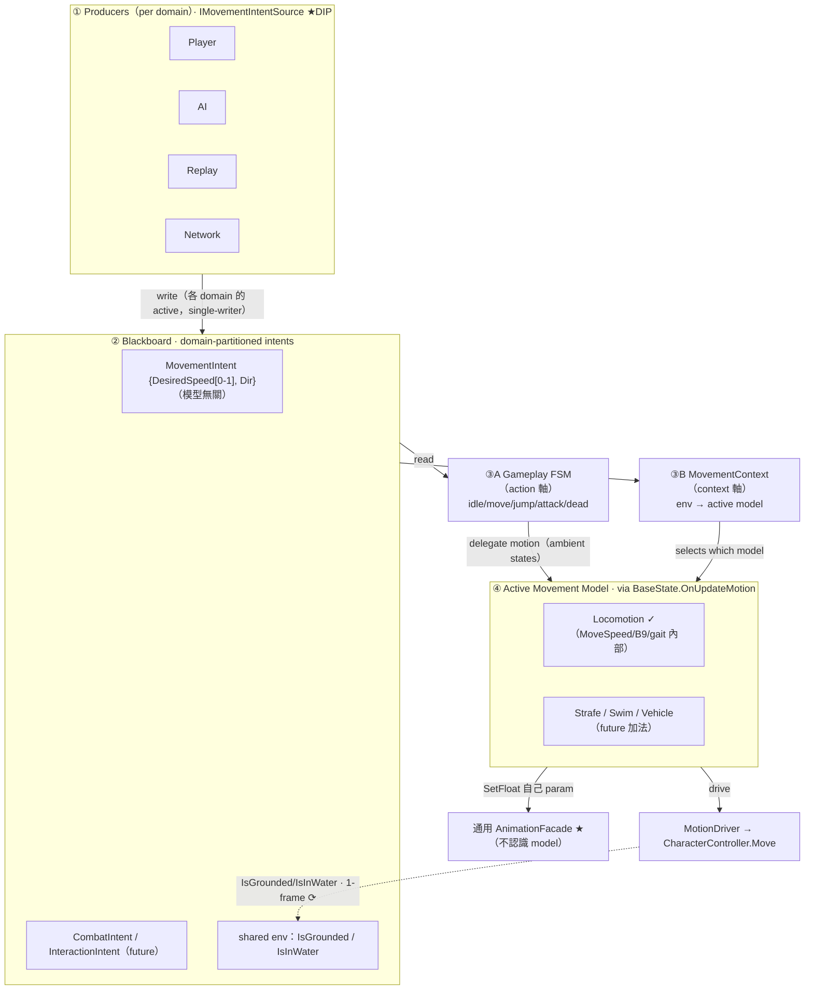

# ADR-003：Movement Intent 分層（Producer 介面 × 黑板契約 × Model via State）

| 欄位 | 內容 |
|---|---|
| 狀態 (Status) | **Accepted**（契約定案；落地採 YAGNI staging 分階段——本 ADR 只固定**契約**，程式尚未實作。比照 ADR-002「設計已定案、尚未實作」style） |
| 日期 | 2026-07-21 |
| Supersede | **無**——本 ADR 新增一個架構層（Movement 意圖分層），不取代任何既有決策，與 ADR-001／ADR-002 並列 |
| 關聯文件 | `docs/ADR/001-root-model-hierarchy.md`、`docs/ADR/002-data-driven-jump.md`、`docs/01-design-doc.md`、`docs/02-dev-spec.md`、`docs/04-locomotion-foundation.md` §11–14（**設計評審全紀錄／推導過程**）、`docs/changelog.md` |
| 影響模組 | `PlayerRuntimeData`（新增 `MovementIntent` region）、`CharacterPipelineRunner`（Parameter 層改為驅動 producer）、新增 `IMovementIntentSource` / `PlayerLocomotionPolicy` / `GaitProfileSO` / `MovementContext`、`BaseState.OnUpdateMotion`（ambient state delegate to model）、`MotionDriver`（唯讀 model 給的意圖）、`AnimationFacadeBase`（維持通用、不變） |
| 前置事實 | B9 MoveSpeed 平滑已落地於 `Runner.ProcessParameters`；Locomotion Foundation（4-tier 1D Mixer）已建；設計經 `docs/04` §11–14 **四輪對抗式評審**收斂為 v3「三軸分離」 |

> **本 ADR 的定位**：記錄**決策與否決理由**（immutable log）。完整推導、被推翻的中途方案、逐輪挑戰見 `docs/04` §11–14；此處固定收斂後的契約。
> **§13 補述四點責任邊界**（`MovementIntent` schema 適用範圍、**MovementContext 的責任邊界**、Producer 與 Input Routing 的分工、**Stage 1 的 Source of Truth**）——釐清語意邊界，**不改 §3 決策**。讀 §3 決策時請一併參照 §13。

---

## 1. Context（背景）

Locomotion Foundation 完成後，出現一個看似小的需求：切換移動控制方案（例：預設 Run、Shift = Sprint、Ctrl = Walk）。但不同遊戲對同一顆鍵的定義完全不同（A：Walk＋Shift=Run；B：Run＋Shift=Sprint＋Ctrl=Walk；C：永遠 Run＋體力衝刺；D：平台遊戲無 Walk；E：Souls-like Hold-Sprint vs ARPG Toggle-Sprint）。

專案的**終極目標**（`docs/01` §1）是：同一套控制器撐起 ARPG／射擊／平台等**不同玩法**，切換玩法時**不改 Pipeline（C# 核心）**，而是換 Profile。因此「移動控制方案」不是一次性功能，而是**跨玩法的可配置策略**。

現況（`docs/04` §11.1 盤點）：
- `InputData` 只有 `MoveInput`/`LookInput`/`Jump·Roll·FireButtonDown`——**無任何速度模式通道**。
- `Runner.ProcessParameters` **寫死** `MoveSpeed = MoveInput.magnitude`（B9 平滑後），無注入策略的縫。
- FSM 只有 `Idle`(MoveSpeed<0.1)/`Move`(≥0.1)——只管「動/不動」，不含 gait。
- 「速度模式選擇」層根本不存在。

---

## 2. Problem（問題）

**「input＋modifier → 想要的移動速度/模式」是一條 per-game 的 RULE（Movement Policy），目前無家可歸。** 若把它塞進任一現有層，都會撞牆：

1. 塞進 **State**：State 是 FSM 拓撲、遊戲無關；讓它讀 raw input/modifier 違反依賴方向，且把拓撲耦合到某遊戲控制方案 → 破壞多玩法目標。
2. 塞進 **Input**：把「這是移動修飾鍵」的 gameplay 語意烤進 raw input 層，且 AI／replay／netcode 無法產生「按鍵」。
3. 塞進 **通用 Runner**：Runner 開始知道「MoveSpeed／gait」這類 locomotion 概念，Swim（只有 StrokeRate）、Vehicle（RPM）一進場就露餡。

更深一層（`docs/04` §14 揭露的三軸混淆）：**Movement Model**（locomotion/swim/vehicle，*怎麼移動*）與 **Gameplay State**（idle/move/attack，*在做什麼*）是**正交**的兩軸，不能壓進同一個 FSM（否則 SwimAttack/LandAttack 笛卡兒積爆炸）。而動畫參數（MoveSpeed vs StrokeRate）是 model 專屬的，不該由通用層驅動。

**核心問題**：需要一個**放對位置的 seam**，讓「意圖的產生（誰決定要多快）」「意圖的內容（黑板契約）」「意圖的執行（哪個 model 怎麼動＋怎麼播）」三者解耦，且對 AI／Replay／Network／未來 model 與 domain 都是**加法擴充、不改核心**。

---

## 3. Decision（決策）

固定以下 **5 條契約**（seam 位置經 `docs/04` §12→§14 對抗式評審收斂，v3 通過 6 準則複驗）：

**D1 — 黑板 seam：`MovementIntent`（模型無關）＋ domain-partitioned intents**
- 新增黑板 region `MovementIntent = { float DesiredSpeedNormalized[0–1], <Direction> }`——**模型無關**（純意圖，非 gait）。Walk/Run/Sprint 只是 Locomotion model 對 [0–1] 的命名門檻（`docs/04` §10），**不屬 seam**。
- 黑板採 **domain-partitioned intents** 原則：`MovementIntent`／（未來）`CombatIntent{Facing,Aim,Target}`／`InteractionIntent`——各 domain 一個 region、**各自 single-writer**。取代扁平的單一 `IntentData`。**現在只落 `MovementIntent`，pattern 先定。**

**D2 — Producer 介面：`IMovementIntentSource`（DIP，每 domain 單一 active writer）**
- `IMovementIntentSource` 為抽象；`PlayerLocomotionPolicy`（讀 input＋`GaitProfileSO`）／`AIMovementSource`／`ReplaySource`／`NetworkSource` 各為實作。
- **同一 domain 任一時刻只有一個 active producer 寫該 region**（single-writer 不破）。Runner 依賴介面、注入具體實作。新 producer ＝加 class，不改 Runner（DIP＋OCP）。
- **Producer context-free**：input→intensity 走**固定 profile**、不每幀讀 state（避免 producer→state 回圈）。modifier 語意跨 model 一致（Shift＝更高 intensity），由 model 各自解讀。

**D3 — Model via State；MovementContext 為獨立正交軸**
- **Movement Model**（locomotion/swim/vehicle）走既有 `BaseState.OnUpdateMotion`（virtual）——非新機制。
- **哪個 model active** 由**獨立的 `MovementContext`**（env-driven：讀水體/地面/載具/梯子）決定，**與 gameplay FSM 正交**。
- **ambient 狀態**（Idle/Move）`OnUpdateMotion` **delegate 給 active model**；**intrinsic-motion 狀態**（Roll/Jump/Attack-lunge）維持既有 **override** 自帶位移。需 context 感知的 action 讀 env（黑板）自選——讀 env 非讀 raw input，合法。

**D4 — MoveSpeed/gait/B9 歸 Locomotion model；Facade 維持通用**
- `MoveSpeed`、gait→tier 映射、**B9 平滑**皆為 **Locomotion model 的內部 dynamics**，不再是黑板欄位、不在通用 Runner。
- **每個 model 驅動自己的動畫參數**（Locomotion→`SetFloat("MoveSpeed")`、Swim→`SetFloat("StrokeRate")`）走**同一支通用 `AnimationFacadeBase`**。
- **Facade 維持通用抽象、不加 `IAnimationModel`**——它本就是 generic `SetFloat`/`Play` sink、不認識 model；缺的是「把 param 驅動的責任移進各 model」，不是「Facade 再加一層抽象」。

**D5 — YAGNI staging**
- 現在只落**最小正確 seam**（D1 的 `MovementIntent`＋D2 的 `IMovementIntentSource`＋一個 `PlayerLocomotionPolicy`＋`GaitProfileSO`；mode/toggle state 進黑板）。
- AI／Replay／Network producer、Strafe/Swim/Vehicle model、Combat/Interaction domain、B9→model 遷移——**皆待真需求，加法擴充**。seam 已保證它們是加法。

---

## 4. Architecture Diagram

> 兩條正交軸（③A Gameplay FSM／③B MovementContext）是本設計的核心：*在做什麼* 與 *怎麼移動* 分離。視覺版與逐輪推導見 `docs/04` §13–14。

---

## 5. Responsibility Matrix

**Ownership（單一 writer）＋ Lifetime**
| 資料 | Writer（唯一） | Readers | Lifetime |
|---|---|---|---|
| `MovementIntent`（speed[0-1]＋dir） | 該 domain 的 active `IMovementIntentSource` | Locomotion model（＋FSM 轉換判斷） | 每幀重算；值＝「當前意圖」 |
| mode / toggle state | active producer（如 `PlayerLocomotionPolicy`） | 該 producer、netcode snapshot | 持續、**snapshot-able**（顯式在黑板） |
| `MoveSpeed`（平滑後）＋B9 state | **Locomotion model**（內部） | 該 model 的 mixer 驅動／velocity | 持續、snapshot-able（model 內態） |
| `IsGrounded` / `IsInWater` / transform | `MotionDriver`／physics | FSM、MovementContext、producer（下一幀） | 持續（延遲一幀） |
| `InputData` | `PlayerInputSource` | `PlayerLocomotionPolicy`（唯一） | 每幀、stack（`ref struct`） |

**R/W 權限（誰可寫／誰唯讀）**
| 層 | 可寫 | 只讀 |
|---|---|---|
| Producer | 自己 domain 的 intent region、自己的 toggle state | `InputData`、`GaitProfileSO` |
| Gameplay FSM | （選 state；不寫黑板業務欄位） | 黑板信號 |
| MovementContext | （選 active model；不寫黑板業務欄位） | env 信號 |
| Movement Model（`OnUpdateMotion`） | 內部 MoveSpeed、驅 MotionDriver、驅 Facade 自己的 param | **`MovementIntent`（唯讀）** |
| MotionDriver | `IsGrounded`/`IsInWater`/transform | model 給的 velocity |
| AnimationFacade / Mixer | animator 參數 | model 傳入的 param 值 |

**DIP 逐邊**
| 依賴邊 | 抽象？ | 判定 |
|---|---|---|
| Runner → Producer | `IMovementIntentSource`（介面） | ✅ 反轉 |
| State/Model → Animation | `AnimationFacadeBase`（抽象） | ✅ 反轉（既有） |
| MovementContext → model 選擇 | 建議資料驅動（condition→model 表）或介面 | ✅（新 model 加法） |
| State/Model → MotionDriver | 具體 | ⚠️ 可接受例外（單一 engine 元件；多後端才抽象，見 §9-L3） |

---

## 6. Alternatives Considered（含**明確保留的否決理由**）

> 本節依 `docs/04` §11→§12→§14 的評審軌跡，永久保留三個被否決的方案與**為什麼沒選**——避免未來重蹈。

### 6.1 ❌ 直接改 `BaseState`（把 Shift=Run 寫死進 State）
**為什麼沒選**：
- **違反依賴方向**：允許方向是 `Input → Pipeline → RuntimeData → StateMachine`；State **只讀黑板、不得讀 raw input/modifier**。State 讀 Shift ＝ 反向跨層。
- **拓撲耦合控制方案**：把某遊戲的鍵位策略烤進 FSM 拓撲 → 破壞「同一 FSM 撐 ARPG/射擊/平台」的終極目標。
- **維度錯置**：gait（Walk/Run/Sprint）是連續/混合維度，本就由 Mixer（MoveSpeed）承載；做成 State 會拓撲爆炸（且與 `docs/01` §2.7「拓撲與模式無關」相悖）。
- **語意錯層**：Walk/Run/Sprint 的定義是 **per-game Movement Policy**，不是 gameplay 拓撲——放進 State 等於把「規則」焊進「引擎」。

### 6.2 ❌ `MovementModeResolver ＋ MovementProfileSO`（本專案 §11.4 曾提、§12 對抗式評審後推翻）
> 這是**我方自己先提、又自己推翻**的方案，保留以誠實記錄。
**為什麼沒選**：
- **Overfit（致命）**：profile 為 1D-speed-centric，**擴不到** strafe（2D）/swim（3D＋浮力）/vehicle/ladder/lockon——把「movement policy（泛）」與「on-foot gait policy（特定）」混為一談。
- **seam 放錯位置**：意圖解析綁在 **input＋modifier**；toggle state 藏在 Resolver 私有欄位 → **netcode 無法 snapshot/rollback**；**AI 得偽造 modifier bit** 才能驅動。
- **God-object 風險**：`ResolveTargetSpeed(mag, mod, caps)` 的 `caps` 隨 stamina/lock-on/water/vehicle 膨脹成雜物袋，method 長出 special-case 分支。
- **OCP 只達 parametric**：換速度值可、換 resolution 邏輯/新 model 要改碼；DIP 弱（Runner→具體 Resolver，無介面可反轉）。
- **修正落點**：seam 應上移到**黑板中性 `MovementIntent`**、producer **介面化**、model 走 **state seam**、gait/B9 收進 **Locomotion model**（即本 ADR D1–D4）。

### 6.3 ❌ `Input Modifier`（在 `InputData` 加 `MovementModifier` 通道並就地解讀）
**為什麼沒選**：
- **gameplay 語意洩漏**：`MovementModifier` 把「這些輸入是為了 movement」的**領域分類**烤進 raw input 層；`InputData` 應保持中性 raw 輸入。
- **seam 又放錯**：正確 seam 是**黑板 intent（模型無關）**，不是 input。把解讀放 input 層，等於讓 AI/replay/netcode 都得先「假裝有按鍵」才能產生意圖。
- **寫死 slot/domain**：固定 `[Flags] MovementModifier` 綁死 modifier 數量與領域。
- **正確做法**：`InputData` 維持中性（若需額外訊號，比照既有 Jump/Roll/Fire 的**中性 action 邊沿**，不加領域標籤）；**modifier→gait intensity 的解讀在 `PlayerLocomotionPolicy`＋`GaitProfileSO`**，跨過黑板 seam 的是 `DesiredSpeedNormalized`（模型無關），非 modifier。

---

## 7. Trade-offs

| 面向 | 得 | 失／代價 |
|---|---|---|
| 多玩法 | 換 `GaitProfileSO`／換 producer／加 model ＝加法，**Pipeline 核心零改** | 首次落地要建立三個新概念（intent region／producer 介面／context 軸） |
| 解耦 | input/policy/model/animation 各自單一責任、seam 模型無關 | 多一層間接（input→producer→intent→model），追流程要理解分層 |
| netcode/AI/replay | intent 為多 producer 共用契約、state 顯式可 snapshot——三者皆加法 | 現在無此需求（YAGNI）；設計為它保留但不實作，需未來 audit「無隱藏狀態」 |
| 一致性 | 與既有 SO 配置模式（`StateMachineConfigSO`/`StateParamsSO`/`AudioDefinitionSO`）同款；沿用 `OnUpdateMotion` virtual | `MovementContext` 在只有 Locomotion 一個 model 時**未被實質行使**（潛在 over-design，見 §9-L2） |
| 資料驅動 | 「速度段數/門檻由資產決定」（延續 Jog 裁決）；gait profile 資料化 | `MovementIntent` 加黑板 region ＝資料格式變更（需一次遷移） |

---

## 8. Consequences（後果）

**正面**
- 「移動控制方案」成為**可換的資料/實作**，不再是核心程式的修改點——兌現 `docs/01` §1「多玩法不改 Pipeline」願景的第一塊基石。
- 三軸（producer/context/action）分離，SRP 清楚；未來 Combat/Camera 等策略可沿用同款 producer-intent 模式（GameplayProfile 家族）。
- AI/Replay/Network 從 day-1 就有正確接點（黑板 intent＋producer 介面），不需回頭重構 seam。

**負面／成本**
- 一次性引入三個新概念與一次黑板 schema 遷移。
- `Runner.ProcessParameters` 現行邏輯需重構進 `PlayerLocomotionPolicy`（行為等價的搬遷）。
- B9 現在在 Runner，正確歸屬是 Locomotion model → 產生一個**已知遷移項**（§10）。

---

## 9. Known Limitations（已知限制）

- **L1（B9 殘餘耦合）**：B9 平滑目前在 `Runner.ProcessParameters`，正確歸屬為 Locomotion model 內部 dynamics。遷移前，通用 Runner 仍知道一個 locomotion 概念（MoveSpeed）。非 blocker（值域明確可搬），列 §10 遷移。
- **L2（context 軸未被行使）**：`MovementContext` 與「model 正交於 FSM」在**只有 Locomotion 一個 model** 時是**潛在**能力，尚未被第二個 model 壓測。風險：介面可能設計得不夠貼實需求。**緩解**：第二個 model（Strafe/Swim）進場時，以它複驗 context 軸是否真的零改核心（同「先驗證再定調」紀律）。
- **L3（MotionDriver 具體）**：`State/Model → MotionDriver` 為具體依賴、非介面。單一 engine 元件下可接受；若未來出現多物理後端才抽象 `IMotionBackend`。
- **L4（intensity 校準責任）**：`MovementIntent` 是模型無關 [0–1]；**各 model 需自行校準 [0–1]→實際值**（Locomotion 的 mixer 門檻＝speedᵢ/speed_max）。校準錯 ＝滑步，屬各 model 責任。
- **L5（netcode 決定性未 audit）**：本 ADR 為 snapshot-able 而設計（state 顯式在黑板），但**未實作 netcode**；真正接入時須 audit「所有 mode/toggle/smoothing state 皆在 rewindable buffer、無隱藏私有態」。
- **L6（modifier 跨 model 一致假設）**：假設 modifier 語意跨 model 一致（Shift＝更高 intensity）。若某遊戲需 per-context 不同義（水下 Shift ≠ 陸上 Shift），需 context-swapped profile（edge case，非核心，加法處理）。

---

## 10. Migration Plan（遷移計畫）

> 分階段、行為等價優先；每階段可獨立驗收。**本 ADR 只固定契約，程式待使用者核可後分階段落地。**

- **Stage 0（本 ADR）**：固定 5 契約（D1–D5）。程式不動。
- **Stage 1（最小 seam；行為等價重構）**：
  1. `PlayerRuntimeData` 加 `MovementIntent` region（`DesiredSpeedNormalized` ＋ dir；toggle/mode state）。既有 `MoveDirection`/`MoveSpeed` 逐步由其涵蓋。
  2. 定義 `IMovementIntentSource`；把 `Runner.ProcessParameters` 現行 input→speed 邏輯搬進 `PlayerLocomotionPolicy`（讀 `InputData`＋`GaitProfileSO`）→ 寫 `MovementIntent`。Runner 注入此 source（DIP）。
  3. Locomotion 的 gait 選擇（含最初想做的「預設 Run／Shift=Sprint／Ctrl=Walk」）落在 `GaitProfileSO`（modifier→intensity 映射），modifier 由中性 action 訊號提供、policy 解讀。
  - *驗收*：行為與現況等價（＋新增可配置 gait）；測試全綠；Profiler 0 GC。
- **Stage 2（B9/MoveSpeed 歸位；L1 收尾）**：把 B9 平滑＋MoveSpeed 計算＋gait→tier 從 Runner 移進 Locomotion model（`OnUpdateMotion` 路徑），model 自驅 Facade 的 `MoveSpeed` param。Runner 去除 locomotion 知識。
  - *時機*：可與 Stage 1 合併，或待第二個 model 逼近時；YAGNI 下不強制立刻。
- **Stage 3＋（加法，待真需求）**：`MovementContext` resolver（第二個 model 出現時）／`AIMovementSource`・`ReplaySource`・`NetworkSource`（AI/netcode 出現時）／`CombatIntent`・`InteractionIntent`（Combat 輪）。**皆不改 Stage 1–2 的核心契約。**

**落地時的文件責任**：`docs/02-dev-spec.md` 補 `MovementIntent` schema／`IMovementIntentSource` 契約／§1.1 黑板權限表更新；`docs/01-design-doc.md` Trade-off 表補列；`docs/changelog.md` 對應版本條目。

---

## 11. Future Extension（未來擴充——全部加法）

| 擴充 | 做法（不改核心契約） |
|---|---|
| 新玩法控制方案（Souls/ARPG/Platform…） | 換 `GaitProfileSO` asset（modifier→intensity 映射） |
| AI 驅動 | 加 `AIMovementSource : IMovementIntentSource`（planner→intent），Runner 注入它取代 player source |
| Replay / Network Prediction | 加 `ReplaySource`／`NetworkSource`（錄製/replicate intent，或錄 input 決定性 re-sim）；state 已 snapshot-able |
| Strafe(2D) / Swim / Vehicle / Ladder | 各加一個 Movement Model（新 state＋`OnUpdateMotion`＋自己的 anim param）；`MovementContext` 加一條 env→model 規則 |
| Combat / Interaction 意圖 | 加 `CombatIntent{Facing,Aim,Target}`／`InteractionIntent` region＋各自 producer（domain-partitioned 原則已定） |
| 體力/能力門檻（如 C 的 stamina-sprint） | 由需要的 policy 自行查該能力信號（不進 universal caps 雜物袋） |
| 多來源同時驅動 Facade（上身/表情） | 走既有規劃的 F4 Upper Body Layer／F6 ArbiterPipeline 仲裁，與「model 各自驅動」一致 |

---

## 12. Zero-GC ＆ 依賴合規（專案慣例）

- `MovementIntent` 為黑板 region（一次配置）；producer 每幀寫值（value type，無 heap）；`SmoothDamp` 等為 stack 數學運算。熱路徑零 `new`。
- 依賴方向：`Input → Producer(介面) → Blackboard → State/Model → MotionDriver/Facade(抽象)`——無 `Motion→Input`、`State→Controller`、`Controller→Animation API` 違規。唯一 back-edge＝env 信號經黑板延遲一幀（同 M2 既有模式，非同幀 cycle）。
- 單一寫入者：每個 intent region、每個 env 欄位皆單一 writer；`MovementContext`/FSM 只選擇不寫業務欄位。

---

## 13. 補充說明：責任邊界釐清（2026-07-21 補述）

> 定位：對 §3 決策與 §10 遷移的**責任邊界收緊**，防止四類常見誤解。**決策內容不變**，此為邊界釐清。

### 13.1 `MovementIntent` schema 的適用範圍（**非「所有 model 永遠通用」**）
§3-D1 稱 `MovementIntent{DesiredSpeedNormalized[0–1], Direction}` 為「模型無關」，需**收緊語意**：它是「**方向性移動家族**」（walk/run/sprint/strafe/swim——凡可化約為「往某方向、以某強度移動」者）的**共通 schema**，**不主張對所有 model 永遠適用**。控制不化約為「速度＋方向」的 model（例：Vehicle＝throttle/brake/steer；tank-control；grid-based）**應定義自己的 intent schema**——依 D1 的 **domain-partitioned** 原則，作為**兄弟 region**（如 `VehicleIntent`），而非把異質欄位硬塞進 `MovementIntent`。**紀律**：`MovementIntent` 是「方向性移動」這一類的契約，不是萬用袋；擴到不同控制範式時**開兄弟 schema，不擴脹本 schema**（否則本 schema 退化成 God-object）。

### 13.2 MovementContext 的責任邊界（**描述性；Gameplay Authority 屬 Capability/Profile，Context 不否決 State**）
**MovementContext 只回答「當前環境該用哪個 movement model」（locomotion vs swim vs vehicle）＝描述性選擇，不具 gameplay 權威。** 它**不否決、不覆寫** gameplay FSM 對「角色在做什麼／允不允許做」的決定。**「能不能衝刺／能不能水下攻擊／這個 action 是否被允許」的權威屬 Capability／Profile（能力與玩法規則）層**，與 FSM 協作裁定，**非 MovementContext**。
- 具體：MovementContext 偵測「在水中」→ 提供 Swim model 給 motion 執行；它**不會**把 FSM 踢出 `Attack`、也**不否決**攻擊——是否允許水下攻擊由 Capability／FSM 判。
- 為何重要：若讓 MovementContext 兼管「允許/禁止」，它會退化成橫跨 model 與 gameplay 的**隱形 god-authority**，破壞 D3 正交性。**三者權責不重疊**：`MovementContext`＝「**how**（怎麼移動）」、Capability/Profile＝「**what's allowed**（能不能）」、Gameplay FSM＝「**what/doing**（在做什麼）」。**兩軸（FSM／Context）互不否決；『允許與否』是第三者（Capability）的事。**

### 13.3 Producer 不負責 Context-Sensitive Input（**Input Routing 在更上游完成**）
D2 的 producer（`PlayerLocomotionPolicy`）**只消費「已被路由好、對當前情境正確」的 movement 相關輸入**，**不處理 context-sensitive input**——「同一顆實體鍵在不同情境代表不同意義」（選單 vs 遊戲；「互動」vs「攻擊」依目標而定；載具 vs 徒步）的切換，**在更上游的 Input 層完成**（Unity Input System 的 action map 切換，或專責 **Input Router** 依情境 enable/disable action map）。輸入抵達 movement producer 時，其語意已定。
- 為何：維持 D2 的「producer context-free」——producer **不判**「這個 Shift 是給移動還是別的」；input 的**情境歸屬是 input 層職責**。把 input routing 塞進 producer 會讓 producer 開始認識 gameplay 情境，重蹈耦合。

### 13.4 Stage 1 的 Source of Truth（**`MovementIntent` 唯一真相；`MoveSpeed` 僅過渡衍生值**）
遷移 Stage 1 期間 `MovementIntent` 與 legacy `MoveSpeed` 並存，**須明確單一真相，以免重演「兩個真相來源」病**（＝ ADR-002 為 jump 物理奮戰的同型問題）：
- **`MovementIntent`（producer 寫入）＝唯一真相（authoritative）。**
- **`MoveSpeed`（若為相容現行 mixer／MotionDriver 消費端而暫留）＝從 `MovementIntent` **下游衍生**的過渡值**（例：經 B9 平滑後導出），**非獨立真相、不得與 intent 分岔**。
- Stage 2 後 `MoveSpeed` 完全內化進 Locomotion model，過渡 shim 消失。
- **紀律**：Stage 1 任何時刻，`MoveSpeed` 必須**可由 `MovementIntent`（＋model dynamics）重新導出**；**禁止任何路徑直接寫 `MoveSpeed` 而繞過 `MovementIntent`**。這條紀律讓 Stage 1 即使雙欄位並存，真相仍單一、可驗證。
