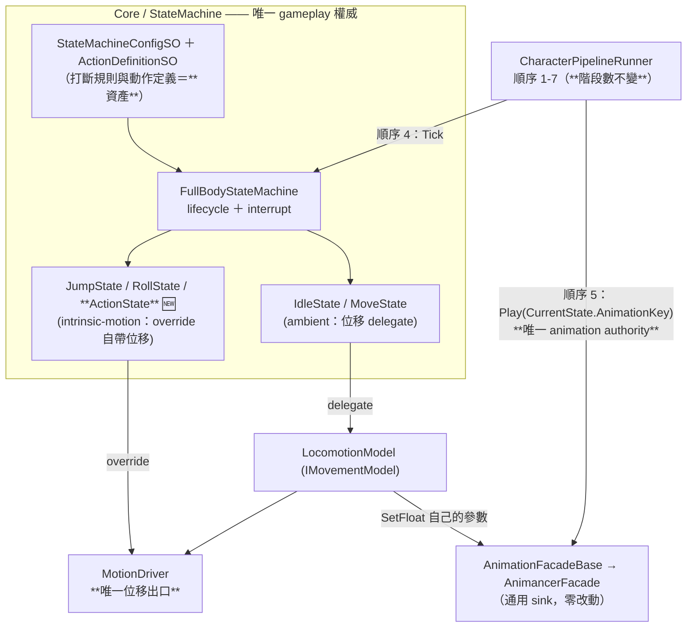

# ADR-004：Action 進 FSM 拓撲（單一 Action State × 資料驅動）

| 欄位 | 內容 |
|---|---|
| 狀態 (Status) | 🟡 **Trial**（2026-08-29 使用者裁決 D4-(a)）——**本專案第一個使用 Trial 狀態的 ADR，語意見下方「§0 Trial 的意思」** |
| 日期 | 2026-08-29（Trial 開始） |
| Acceptance Review | ⏳ 未進行。條件見 **§10**；通過後才改為 `Accepted` |
| Supersede | **無 ADR 被取代**——與 ADR-001／002／003 並列。測試不變量 **A13（`StateType` 恆五員）自本 ADR 進入 Trial 起即被新 baseline 正式取代**（不是「暫停」，見 §3-D3 與 CLAUDE.md「Architecture Invariants Track the Effective Baseline」），其防護目的由 A13′＋A19 承接 |
| 關聯文件 | `docs/ADR/003-movement-intent-layering.md`（**D3 已預先定義 intrinsic-motion 類別並點名 Attack-lunge**）、**`docs/08-skill-system.md`（本 ADR 的 Living Spec；所有實作細節在該檔，見 §9）**、`docs/02-dev-spec.md` §2.1／§3.1／§3.3／§7、`WORKLOG.md`「作品集最低限度衝刺」 |
| 影響模組 | `StateType`（+1 成員）、新增 `ActionState`／`ActionDefinitionSO`、`FullBodyStateMachine.Initialize`、`CharacterPipelineRunner.SyncAnimation`、`BaseState.AnimationKey`（語意擴張）、`ArchitectureRegressionTests`、`StateMachineConfigSO` 資產 |
| 前置事實 | `docs/08` 初稿（2026-08-29 上午）提出獨立 `SkillDriver`；同日題材由 `Fists_Punch_R`（全可取消）改為 Throw 三段（含 authored `ThrowCancel`）；架構評審提出「Action 應沿用既有 FSM lifecycle」 |

---

## 0. Trial 的意思（🆕 治理狀態，2026-08-29 引入）

> **`Trial` ＝「這是目前的實作依據，但它還沒有被任何真實實作驗證過。」**

| | `Trial` | `Accepted` |
|---|---|---|
| 效力 | **是**實作基線——Codex／實作者依它動手 | 同左 |
| 可變性 | **允許因實作發現而修改**（改本檔，不必開新 ADR） | **凍結**——要改決策必須開新 ADR 取代（CLAUDE.md Immutable Log 規則） |
| 依據 | 使用者裁決 ＋ 靜態分析 | 使用者裁決 ＋ **第一個真實 vertical slice 的實作與 Play／Test 驗證** |

**為什麼引入這個狀態**：原本的治理是 `Design → Freeze → Implement`——決策一旦 Accepted 就凍結，實作只能遵守。對單人開發而言這會產生一個壞誘因：**實作撞到問題時，補 workaround 比修文件便宜**，因為修文件要開新 ADR。結果是文件維持整潔、程式累積歪斜。

改為 **`Design → Trial → Implement → Observe → Revise → Accept`**：**第一個真實 vertical slice 本身就是架構驗證的一部分**。

**Trial 期間的規則**
1. 本檔可被修改，但**修改必須留下紀錄**（§11 修訂紀錄），且不得悄悄放寬 §3 的核心主張。
2. **實作暴露問題時，先修 Trial ADR／Living Spec，再驗證——不得為了維護舊文字補 workaround。**
3. Trial baseline **取代**既有不變量時必須在 §3 明列（**不是暫停，是取代**——架構測試驗證的是「目前有效的 baseline」，而 Trial baseline 就是有效的）。**不建立任何 generic 的測試暫停／停用機制**；Trial 失敗時 code／ADR／invariant **一起 revert**。
4. **⚠️ 使用者已裁決 ≠ 工程上已驗證。** 本檔的存在不代表方向正確，只代表方向已被選定並開始承擔驗證責任。

---

## 1. Context（背景）

專案有四個 gameplay 狀態 `{Idle, Move, Jump, Roll}`：Idle／Move 是 **ambient**（位移 delegate 給 active Movement Model），Jump／Roll 是 **intrinsic-motion**（`OnUpdateMotion` override 自帶位移）。這個二分法由 **ADR-003 D3** 定義，原文即列出三個 intrinsic-motion 範例：**Roll / Jump / Attack-lunge**。

2026-08-29 進入作品集衝刺，需要一個「用看的就知道是技能」的動作。`docs/08` 初稿為當時的題材（`Fists_Punch_R`：站定、瞬發、**全可取消、無承諾窗**）設計了獨立的 `SkillDriver`，掛在新的管線順序 4.6——理由是該切片對 `docs/03` §6.4 的 G1 三判準「只中一項」，不值得付新增 `StateType` 的代價。

該文件同時在 §4.3-G1 寫下自己的失效條件：「**只要未來任一技能需要不可取消窗，②變成「有」，本裁決必須回到 §9.1 重跑**」。

同日題材改為 **Throw**（`Throw_Start` → `ThrowLoop` → `ThrowEndClose`／`ThrowEndFar`／`ThrowCancel`），該條件即刻成立：有蓄力段、有不可取消的投出段、有 **authored 的取消動畫**。加上同日裁決 D2「敵人完整使用既有 `FullBodyStateMachine`」，維持 `SkillDriver` 意味著未來敵人要動作時得再複製一套平行權威。

---

## 2. Problem（問題）

**`SkillDriver` 會在 FSM 旁邊長出第二套 gameplay 權威。**

| 權威 | FSM 既有機制 | `SkillDriver` 的平行機制 | 後果 |
|---|---|---|---|
| **lifecycle** | `OnEnter`／`OnTick`／`OnExit`／`CanTransitionAway` | `SkillRuntime` 的 Begin／Invalidate／Complete | 兩套生命週期，語意需人工對齊 |
| **animation** | 順序 5 `SyncAnimation` → `Play(state.AnimationKey)` | 順序 4.6 自行 `PlayWithCallback`／`Play` | **兩個播放權威**。初稿甚至以「把技能排在順序 5 之前，讓順序 5 蓋掉它」為設計依據——那是挑排序讓一方輸，不是消除衝突 |
| **interrupt** | `StateMachineConfigSO` 的 `CanBeInterruptedBy`／`Priority`／`ValidTransitions`（**資產**） | 初稿 §8.3 的中斷矩陣（**程式碼**） | 規則一半在資產、一半在程式，改一邊不會讓另一邊變紅 |

初稿把第 2 條記為「隱含耦合」風險。**那是誤判**：技能動畫能存活，依賴的是「`SyncAnimation` 只在狀態變更時 `Play`」這個實作細節；任何人把它改成每帧無條件 `Play`，技能會**靜默**失效。

**核心問題**：專案的既有原則是**單一權威**（單一寫入者、單一位移出口、單一動畫 sink）。動作系統必須落在既有 FSM 內，否則第一個平行權威會成為往後每個動作的模板。

---

## 3. Decision（Trial 期間的實作基線）

> **本節只保留「改錯會造成架構污染」的決策。** 具體欄位、計時方式、冷卻細節、注入路徑等**實作細節一律在 `docs/08`**，且**允許被 Throw 實作推翻**（§9 有明確清單）。

### D1 — Action 進**既有** `FullBodyStateMachine`，**不建立平行的 `SkillDriver`**

動作的「能不能做、能被誰打斷、何時結束」屬 gameplay 權威，而 gameplay 權威在本專案只有一個家：`FullBodyStateMachine`。
⇒ **不新增管線階段**（無順序 4.6），管線階段數維持 1–7。

### D2 — lifecycle／animation／interrupt **維持單一 authority**

| 權威 | 唯一持有者 |
|---|---|
| lifecycle | `BaseState` 的 `OnEnter`／`OnTick`／`OnExit`／`CanTransitionAway` |
| animation | **管線順序 5**（`CharacterPipelineRunner.SyncAnimation`） |
| interrupt | `FullBodyStateMachine.EvaluateInterrupts` ＋ `StateMachineConfigSO` 資產 |

> 🔄 **可修訂的實作機制（Trial）**：為了讓多 phase 的 Action 在**不新增播放權威**的前提下切換動畫，目前選定的機制是「**順序 5 改為追蹤 `AnimationKey` 而非 `StateType`**」（`BaseState.AnimationKey` 由常數擴為「該狀態此刻請求的鍵」）。
> **不可變的是「animation authority 只有一個」；達成它的機制若被實作證明有更好的做法，改本節即可，不必開新 ADR。**

### D3 — 動作**優先資料驅動**，不是一招一個 State subclass

- 具體動作由資產描述，**一顆** `ActionState` 執行。
- **A13**（`StateType` 恆五員）**自本 ADR 進入 Trial 起即被取代**——不是暫停。架構測試驗證的是「目前有效的 architecture baseline」，而 Trial baseline 就是目前有效的（CLAUDE.md「Architecture Invariants Track the Effective Baseline」）。**同一工作包內**把測試換成下列兩條；允許交接過程短暫紅燈，但**交付驗收時必須全綠**：
  - **A13′**：`StateType` 恆為 `{None, Idle, Move, Jump, Roll, Action}` 六員。新增成員必須同步改測試與 dev-spec §3.3，讓遺漏現形。
  - **A19**：**禁止為每個 Action 建立獨立的 `ActionState` 子類別；Action 之間的差異優先由 Definition／policy 資料描述。**
    判定＝掃描 `ActionState` 子類別，每一個都必須在測試內的 allowlist 且**附書面理由**（形態比照既有 `LayerRule.Reason`）。allowlist 現為空。
    ⚠️ **A19 不是永久禁令**：未來若出現 **lifecycle 本質不同**的 Action，允許開子類別，但必須寫下理由——它擋的是 `PunchState`／`ThrowState`／`ClimbState` 爆炸與「我懶得資料化」，不是擋演進。
- **enum 數值只增不改不重排**（`StateMachineConfigSO` 以整數序列化 rules，重排會靜默改變所有已存資產的語意）。實際數值屬實作細節，見 `docs/08`。

### D4 — Action 屬 **intrinsic-motion**；`MotionDriver` 維持**唯一位移出口**

- 依 ADR-003 D3 既有分類（原文即列 `Roll/Jump/Attack-lunge`），`ActionState` **override `OnUpdateMotion` 自帶位移**，與 `RollState` 同類。
- **位移一律經 `MotionDriver`**，不得新增任何 `CharacterController` 引用。
- 位移的**資料來源**（烘焙曲線／程序式／零位移）屬實作細節，見 `docs/08`。

### D5 — **Cancel ≠ Interrupt**

| | 定義 | 誰決定 | 表現 |
|---|---|---|---|
| **Cancel** | 動作**自己**的一個結束分支（例：蓄力中放棄投擲） | `ActionState` 內部 | 播 Cancel 的動畫（`ThrowCancel`），**FSM 不換 state** |
| **Interrupt** | **別的 state** 取得控制權（Roll／Jump／Move） | `FullBodyStateMachine` | 播新 state 的鍵；`ThrowCancel` **不播**，也不該播 |

⚠️ 把「被 Roll 打斷」接到 `ThrowCancel` 是錯的：取消動畫會在角色已開始翻滾時搶播。**兩者是不同事件，各有各的表現。**

### D6 — 打斷三機制的分工（防止互相代替）

| 機制 | 回答的問題 | 住在哪 |
|---|---|---|
| `BaseState.CanBeInterruptedBy(other)` | **「它有沒有資格中斷我」**——閘門 | `StateMachineConfigSO` 資產；子類別可 override 疊加更嚴的條件（`BaseState` 原註解即寫明「子類別可 override 處理特殊情況（如無敵幀不可打斷）」） |
| `StateMachineConfigSO.GetPriority` | **「多個都有資格時誰贏」**——競爭排序 | 同資產 |
| `BaseState.CanTransitionAway` | **「我能不能自然離開」**——自我承諾（＝不可取消窗） | State 自身（`RollState.IsRollFinished` 為先例） |

⚠️ **`Priority` 不得用來表達「誰能中斷誰」**。實碼 `EvaluateInterrupts` 先以 `CanBeInterruptedBy` 過閘門、通過者才比 `Priority`；用 Priority 表達資格，會在「兩個候選都有資格」時產生非預期結果，且語意無法從資產讀懂。（2026-08-29 使用者指正，永久紀錄於此與 §5.4。）

### D7 — YAGNI staging

Trial 期間只落**一個**動作（Throw）。**不做** Action 查表／多動作、combo、蓄力以外的通道機制、資源消耗、傷害／命中、上身層、通用 Effect Framework。第二個動作出現時才談抽象。

---

## 4. Architecture Diagram（權威歸屬）

> 逐步呼叫鏈與 phase 生命週期圖屬實作層，見 `docs/08`。本圖只回答「**誰擁有什麼權威**」。

**與被否決方案的差異（一眼可辨）**：沒有 `SkillDriver`、沒有順序 4.6、**沒有第二條指向 `AnimationFacadeBase` 的箭頭**。

---

## 5. Alternatives Considered（含明確保留的否決理由）

### 5.1 ❌ 獨立 `SkillDriver` ＋ 管線順序 4.6（`docs/08` 初稿）

**為什麼沒選**：§2 的三重權威。

**但它在當時的前提下是正確的**，這點必須留在紀錄裡：原題材全可取消、無承諾窗、零位移，G1 三判準只中一項。初稿並在 §4.3-G1 寫下自己的失效條件，題材改為 Throw 後條件成立。
⇒ **不是判斷失誤，是前提變更；而該文件自帶失效觸發器，機制如設計般運作。** 未來設計文件應延續這個做法。

**唯一與前提無關的缺陷**：animation authority 的重複。即使題材沒變也成立——這一條是初稿的真實錯誤。

### 5.2 ❌ 每個動作一個 `StateType`（`PunchState`／`ThrowState`／`ClimbState`）

拓撲爆炸。ADR-003 §6.1 已為 gait 否決過同型做法；差別在當時理由是「gait 是**連續維度**」，此處理由是「動作是**同構的離散生命週期**」——同一顆 state ＋不同資料即可表達，開 N 個類別只是把資料寫成程式碼。由 **A19** 機器化守住。

### 5.3 ❌ 讓 `ActionState` 自己呼叫 `AnimationFacadeBase.Play`

那會**保留** §2 的第二個動畫權威，只是把它從 `SkillDriver` 搬進 state。且 `BaseState.OnTick(data, deltaTime)` 簽名不帶 facade，唯一拿得到 facade 的入口 `OnUpdateMotion` 在 **LateUpdate**——動畫指令落在那裡會比位移晚一帧（dev-spec §2.1 脆弱點第 6 條）。

### 5.4 ❌ 用 `Priority` 表達「Roll 能不能取消 Throw」

機制錯位，理由見 D6。

### 5.5 ❌ 把 Action 做成 ambient state（位移 delegate 給 `IMovementModel`）

ambient 的定義是「位移由當下 active Movement Model 決定」。動作的位移是 **authored**，不是 locomotion dynamics 導出的。硬做成 ambient 會迫使 model 認識動作，重蹈 §5.1 的跨 domain 汙染。ADR-003 D3 的分類已經給了正確答案。

---

## 6. Trade-offs

| 面向 | 得 | 失／代價 |
|---|---|---|
| 權威 | lifecycle／animation／interrupt 回歸**單一來源**；打斷規則從程式碼變成**資產** | 一次性的 `StateType` 擴張，且需暫停一條使用者親自設下的紅線（A13） |
| 管線 | **階段數不變**；`SyncAnimation` 的改動是淨減少（移除一個權威） | `AnimationKey` 由常數變為每帧求值 ⇒ 必須零配置 |
| 位移 | 位移型動作**免費支援**（`ActionState` 本就是 intrinsic-motion） | Action 的位移正確性依賴其資料來源品質（同 `RollState` 既有風險） |
| 擴充 | 第二個動作 ＝ 一份資產（A19 守著不長出第二個類別） | 多動作查表尚未設計（D7 延後） |
| 治理 | Trial 讓實作可以修正設計，而不是繞過設計 | 文件在 Trial 期間**不是穩定真相**，引用時要看狀態欄 |

---

## 7. Consequences（後果）

**正面**
- 動作系統**沒有自己的架構**——它只是 FSM 的一個資料驅動狀態。「加動作」的成本從「加一套子系統」降為「加一份資產」。
- 敵人（D2 裁決走同一台 FSM）未來要動作時，**不需要任何新程式**。
- ADR-003 D3 定義但從未落地的 intrinsic-motion 類別首次被行使，`Attack-lunge` 這一格終於有實作。

**負面／成本**
- Trial 期間 A13 暫停：測試需改寫，`StateMachineConfigSO` 資產需增列 Action 的 rules（**使用者側資產工作**）。
- `BaseState.AnimationKey` 的語意擴張是**跨領域契約變更**，dev-spec §3.1／§2.1 順序 5 需同步。
- 在 Acceptance 之前，任何引用本 ADR 的文件都必須註明其 Trial 狀態。

---

## 8. Known Limitations（架構層；實作層限制見 `docs/08`）

- **L1（單一權威的代價尚未被壓測）**：把三種權威收回 FSM 是靜態分析的結論，**尚未有任何實作證明 `BaseState` 的既有介面撐得住多 phase 動作**。這正是 Trial 存在的理由；由 §10 的 Acceptance Criteria 驗證。
- **L2（`AnimationKey` 每帧求值）**：D2 的機制讓順序 5 每帧比對字串引用。實作必須回傳**快取欄位**，禁止字串內插；由零 GC SOP（dev-spec §7.4）複驗。
- **L3（新 baseline 尚未被實作驗證）**：`StateType` 的保護在 Trial 期間由 A13′＋A19 提供，而它們本身也是 Trial 期產物——**測試變綠只代表符合新 baseline，不代表新 baseline 是對的**。這是 Trial 的本質，不是缺陷。**若 Trial 失敗，code／ADR／invariant 一起 revert**（§10）。
- 🆕 **L4（同型別 Action 之間無法互相中斷——D3 資料驅動的結構性代價，2026-08-30 發現）**：`FullBodyStateMachine.EvaluateInterrupts` 以 `if (targetState.Type == _currentState.Type) continue;` 排除同型別候選，而 D3 讓**所有動作共用 `StateType.Action`** ⇒ **Action → Action 的中斷在本 ADR 的拓撲下結構性不可能**（例：敵人 `Telegraph` 被命中改播 `Damage`、玩家動作中被打斷）。
  - **這不是 bug，是 D3 與既有 interrupt 機制的交互後果**：把「一招一個 State」壓成「一顆 State ＋ 資料」，同時也把 FSM 用來分辨「誰能中斷誰」的鍵壓沒了。**A13′ 與 D3 的收益（狀態不爆炸）與此代價是同一枚硬幣的兩面**，記於此以免日後誤診為實作疏漏。
  - **不影響本 ADR 的 Acceptance**：D7 的 YAGNI staging 使 Trial 期間每個角色只有一份 Definition，同型別互斥**不會被觸發**；§10 的 A–F 亦無一條要求多 Action。
  - **觸發時機明確**：敵人同時需要 `Attack` ＋ `Damage`、或玩家同時需要 `Throw` ＋ 近戰的那一刻。
  - **候選解與其架構後果**（三者不等價，屬 **ADR 級裁決**，**不得**當成實作細節在 Trial 期間順手處理）：①`ActionState` 內部自行換 Definition ⇒ 在 State 內長出**第二個 interrupt 權威**，**直接違反 D2**；②中斷規則表改以 **Action 身分**為鍵（`StateType` 不變）⇒ 需擴張 `StateMachineConfigSO` 的索引形狀；③每個 Action 一個 `StateType` ⇒ **已由 §5.2 否決**，且 A13′ 會紅。
  - **處置**：登記於 `docs/08` §11.1（FU-1），與 FU-2（一角色一份 Definition）／FU-3（mailbox 無身分）**同源**，一併留給下一個工作包以新 ADR 裁決。⚠️ **同一時間只允許一個 Trial**——本 ADR 必須先 `Accepted`。

---

## 9. 明確**不**在本 ADR 凍結的項目（下放至 `docs/08` Living Spec）

> 本節存在的理由：讓「哪些能改、哪些不能改」可稽核，而不是靠讀者自行判斷。
> **下列項目允許在 Trial 期間因實作發現而修改，只要不違反 §3 的 D1–D7。**

| 項目 | 為什麼是實作細節 |
|---|---|
| `ActionPhase` 的具體成員與 phase 序列結構 | Throw 的實際分段可能與預想不同（例：Start 與 Loop 是否需要分開） |
| `ActionDefinitionSO` 的欄位組成 | 第一個真實動作會告訴我們哪些欄位是必要的、哪些是想像的 |
| **phase 推進的計時方式**（烘焙時長／動畫回調／固定秒數） | 三種都不影響權威歸屬；哪種可靠只有 Play 測得出來 |
| **Cooldown 的存放位置與生命週期細節** | 只要不新增黑板欄位、不新增第二個權威，怎麼存都是實作 |
| `ActionDefinitionSO` 的注入路徑（`StateParamsSO` 或其他） | 屬既有機制的選用 |
| `StateType.Action` 的實際 enum 數值 | 「只增不改不重排」是決策，數字是細節 |
| 位移的資料來源（烘焙曲線／零位移） | D4 只凍結「經 `MotionDriver`、屬 intrinsic-motion」 |
| 中斷矩陣的逐列行為 | 只要來源是資產與既有 FSM 機制 |
| Cancel 的觸發輸入（再按一次／另一顆鍵） | 屬控制方案，per-game |

---

## 10. Acceptance Criteria（`Trial → Accepted` 的條件）

> **在 Throw vertical slice 完成之前，本 ADR 不得改為 `Accepted`。**
> 全部通過後，由使用者確認並更新狀態欄、記入 §11、同步 `docs/changelog.md`。

- [ ] **A. Throw 在 Unity Play 實際跑通**（Start → Loop → End／Cancel 全程）
- [ ] **B. 三個權威與設計一致**：動畫只由順序 5 播放；打斷只由 FSM ＋資產決定；lifecycle 只有 `BaseState` 一套
- [ ] **C. 既有 Idle／Move／Jump／Roll 無回歸**（動畫播放序列與位移路徑逐字不變）
- [ ] **D. EditMode 測試全綠**，含 A13′／A19 與行為等價回歸測項
- [ ] **E. 零 GC 通過**（dev-spec §7.4 SOP；穩態 `0 B/frame`）
- [ ] **F. 實作沒有逼出第二套 authority 或明顯 workaround**——**這一條是本 Trial 的真正目的**。若實作過程中出現「為了讓它動起來只好在 X 旁邊再加一個判斷」，即為未通過

**未通過時的處置**（依序，不得跳過）：
1. **先修 Trial ADR ／ `docs/08`**，把實作發現寫進去；
2. 再驗證；
3. **不得為了維護舊文字而在程式裡補 workaround。**
4. 若 D1／D2 本身被證偽（例：單一 authority 撐不住多 phase 動作），則本 ADR 轉為 `Rejected`，**code／ADR／invariant 一起 revert**（A13′／A19／A20 退回 A13），並開新 ADR 記錄失敗原因與新方向——失敗的 Trial 與成功的 Trial 一樣有紀錄價值。

**通過時**：測試中的 A13′／A19／A20 **直接成為 Accepted baseline，不需要恢復任何舊不變量**。

---

## 11. 修訂紀錄（Trial 期間的每一次修改都必須記在此）

| 日期 | 修改 | 原因 |
|---|---|---|
| 2026-08-29 | 建立（狀態 `Accepted`） | 使用者裁決 D4-(a) |
| 2026-08-29 | 狀態改為 **`Trial`**；新增 §0／§9／§10／§11；實作細節（phase 欄位、計時、冷卻、注入路徑、逐步呼叫鏈與生命週期圖）下放 `docs/08` | 治理方式調整：**使用者已裁決 ≠ 工程上已驗證**。改為 `Design → Trial → Implement → Observe → Revise → Accept`，避免單人開發被「先凍結才能實作」逼出 workaround |
| 2026-08-30 | **§8 新增 L4**（同型別 Action 之間無法互相中斷）。**僅補記已知限制，D1–D7 與 §10 的 Acceptance Criteria 一字未動** | Planning review 於磁碟現況發現 `EvaluateInterrupts` 的同型別排除與 D3「所有動作共用 `StateType.Action`」相乘，使 Action → Action 中斷結構性不可能。屬 **D3 的結構性代價**而非實作疏漏，依 §0 規則「先修文件再驗證」記於此；**不觸發本輪任何程式改動**（D7 使其在 Trial 期不會被觸發），候選解留給下一個 ADR |

---

## 12. Zero-GC ＆ 依賴合規（架構層）

- 動作的跨帧狀態必須是**值型別、顯式、無隱藏靜態態**（延續 ADR-003 §9-L5 的 snapshot-able 前提）。
- 熱路徑禁 `new`／LINQ／介面型 `foreach`；`AnimationKey` 每帧求值必須零配置（§8-L2）。
- 依賴方向：`Core/StateMachine → Presentation` 為既有放行（`OnUpdateMotion` 本就收 `MotionDriver`／`AnimationFacadeBase`）；Core 仍不認識 Animancer（A4）；`Core/StateMachine ✗ Pipeline` 不變。
- **不新增 `PlayerRuntimeData` 欄位或寫入者**（A5 白名單零改動）。
