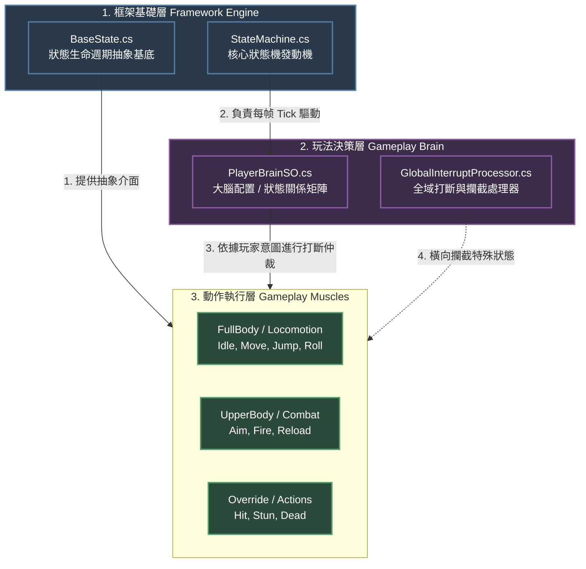

# 專案開發更新日誌 (Changelog & Learning Record)

---

## [v0.18.6] - M3.5 最終形：字面回歸 M3.1，實驗代碼清除（2026-07-18）

> v0.18.5 flag 版驗收未過：flag 全關＋ReachRatio→1.0 後階梯腳踝**仍歪，且踏面中央亦歪**——兩快篩排除了全部 M3.5 新增項（Reach Clamp／法線毛刺假說雙雙不成立），邏輯結論＝**此歪斜極可能 M3.1 即存在**（當時場景／觀察精細度不同而未察覺）。依裁決：字面退回 M3.1、實驗代碼全數清除（不留 flag）、後續優化入路線圖，建立可 push 的乾淨基線。

### 1. 變更內容
* **四檔回歸 M3.1 本體**：`FootIKController`（單因子 Pose 權重、無條件接受命中、無 fade／clamp／濾波）；`FootIKSettings` 精簡為 8 參數（實驗參數與 5 個 `Enable*` flag 全刪）；`FootIKPoseData` 移除髖位置／腿長（Reach Clamp 專用輸入）；`FootIKRig` 移除腿骨快取與量測。
* **保留的兩項非 M3.1 改良**（實測驗證乾淨、且兩快篩證明與歪斜無關）：目標沿地面法線抬升（M3.3 幾何正解，踏面上與 M3.1 的 up 抬升等價）；`FeetBottomHeight`（M3.1 本有）。
* **測試 49→42**：`ComputeHeightFade`／`ClampReach` 7 條隨純函數退場。
* 雙管道架構（M3.1 裁決）、Presentation Adapter 定位、反饋禁令——全部不動。

### 2. 遺留未解（誠實記錄，下一輪 IK 工作的起點）
* **階梯腳踝歪斜（踏面中央亦現）**：不是 M3.2~M3.5 任何機制造成。首查項＝`GetIKRotation/GetIKPosition` 在 Animancer（Playables）下的**值域正確性**——M3 交付時標註的唯一外部 API 風險（若 goal rotation 與當幀混合姿勢有固定偏差，SetIKRotation 會把腳踝轉向錯誤基準，平地小到不察、階梯對比下顯眼）。驗法：OnAnimatorIK 內比對 goal rotation 與骨骼當幀動畫旋轉。

### 3. 反思（Why）
* **快篩的價值在排除**：兩個 10 秒快篩沒找到根因，但把「哪裡不是」釘死了——避免又一輪對著錯誤標的修補（M3.2~M3.4 的核心教訓正是如此）。
* **「印象中的基線」也要驗證**：regression 對比的參照系（M3.1 手感）本身可能就含著未察覺的缺陷；乾淨基線 push 進版控後，未來的對比才有客觀錨點——這正是本輪堅持先回歸再 push 的理由。

---

## [v0.18.5] - M3.5 Regression Recovery：回歸 M3.1 基線（2026-07-18）

> v0.18.4 後實測仍 regression → 使用者裁定純分析輪 → 結論被接受 → 本輪依 Regression Workflow 落地：**不是新功能版本，是回歸穩定版**。版本語義自此定調：**M3.1＝第一個成熟基線（Baseline）／M3.2~M3.4＝探索實驗版（Experimental）／M3.5＝回歸穩定版（Regression Recovery）**。

### 1. Regression 分析核心結論（本輪的依據）
* **M3.1 是二態權重系統**：單因子 PoseHeuristic＋窄帶（0.08~0.25）→ 腳絕大多數時間「全 IK」或「全動畫」，中間態只在抬放腳瞬間短暫經過——乾淨。M3.2 起的 Height Fade × Difference Fade × PoseWeight **三因子疊乘**把系統推進「半 IK」常態，而半權重恰是視覺最不自然的區間。
* **三組交互放大**：Slope Gate（硬 on/off）× 三條平滑鏈＝邊緣權重／骨盆／目標震盪；法線低通 × 邊緣交替命中＝離散面選擇被混成「持續微斜」；目標修正量平滑 × Gate 落空歸零＝懸空插值目標。
* **Slope Gate 的幾何誤區**：垂直向下的 ray 與垂直立面平行、根本不相交——gate 想防的情境打不中，實際攔的是稜線 normal 與合法陡坡。

### 2. M3.5 內容（Phase 1 落地）
* **保留的 M3.1 行為（預設路徑）**：雙管道快照採樣（無反饋）、raw hit.normal 對齊、raw 目標（無濾波）、單因子 Pose 權重、無條件接受 raycast 命中、骨盆補償＋Clamp、`WeightSmoothSpeed` 收斂平滑。Ground Detection 本體（origin／distance／layers）未動。
* **保留的後續改良（非 M3.1 但已驗證乾淨）**：Pose 快照含 `FeetBottomHeight`（avatar 真值取代手填）；**法線抬升**（M3.3，`hit + normal × bottomHeight`，幾何正解）；**Reach Clamp 0.98 恆開**（M3.2 引入、M3.3 校正後唯一乾淨倖存的防護）。
* **停用（Experimental A/B flag，預設 false，不刪除）**：`EnableHeightFade`／`EnableDifferenceFade`／`EnableSlopeGate`／`EnableNormalFilter`／`EnableTargetFilter`——五個 flag 各自獨立可開，供 A/B Test；相關參數與純函數全數保留（測試 49 條不動）。
* flag 全關時權重公式：`goalWeight = PoseHeuristic`（×1×1，編譯器層面等價單因子）。

### 3. 為什麼 Reach Clamp 單獨足以處理人體極限
* **直接建模 vs 代理指標**：人體極限的本質是「幾何可達性」（腿長），不是「地形高度差」——fade 族用高差去**猜**可達性（代理指標，天然誤殺／漏殺）；Reach Clamp 直接量測「目標−髖」距離對腿長，就是極限本身。
* **介入式 vs 放棄式**：clamp 讓 IK 工作到極限邊界——不可達時 solver 輸出＝腿伸直朝目標「努力搆」，視覺自然且無爆炸；fade 在極限前就放棄——動畫原樣與幾何衝突（穿模）或半權重懸浮，兩者都比「努力搆」難看。
* **fade 想防的「過度彎曲」在 clamp 後不會發生**：彎曲來自可達範圍內的正常解算（屈髖抬腿＝好看的那種）；超出範圍的部分已被球面夾住，根本輪不到 solver 做出怪姿勢。

### 4. 反思（Why）
* **Baseline 的價值在「可回去」**：M3.1→M3.4 每輪都「合理地」加一個機制，沒有一輪重新驗證整體——疊加的合理小改共同組成 regression。flag 化保留而非刪除，讓每個實驗機制可單獨與 baseline A/B，把「感覺變好／變差」變成可實驗的命題。
* **提升品質的路不在權重公式裡**：單點採樣＋權重調製的天花板已到；真正的下一步是資訊量升級（Heel/Toe 雙點、CapsuleCast、Foot Contact 狀態機）——與其把單點的權重公式越調越複雜，不如換更高解析度的輸入。

---

## [v0.18.4] - M3.4 方向性修正＋Edge Filter 完成（2026-07-18）

> 裁決：P1 核可（Fade 僅向下）、P3 核可（Fade 套遠腳）、P2 暫緩（Heel＋Toe 雙點採樣延至 M4）＋新增 Edge Filter＝單點採樣的最後穩定化。與 v0.18.3（使用者側四根因校正）合力關閉「M3.2 貼合劣化」事件。

### 1. P1——深度 Fade 僅對「向下探深」生效（方向性錯誤修正）
v0.18.2 用絕對值統一「高差」，把物理意義相反的兩側混為一談：向下＝腿拉直下夠（搆不到，該退）；向上＝IK 拉腳踩高階、屈髖屈膝（**IK 最好的表現**，該保留）。絕對值把大階梯上的高腳一併 fade 掉——「原本能抬大腿至接近水平」的能力就是這樣喪失的。修正為 `max(0, rootY−groundY)` 僅向下計；向上極限由 Reach Clamp＋遠腳 Fade 把守。

### 2. P3——雙腳差 Fade 改套「距 Root 平面較遠」的腳
原「固定放低腳」在踩高階情境放錯腳：root 在低處時跨不上去的是**高腳**。改為距 Root 較遠者退出——root 在高處＝放低腳（深不可及）、在低處＝放高腳（跨不上去），上下方向的極限處理一致。

### 3. Edge Filter（裁決新增；不偷跑雙點採樣）
* **①Slope Gate**（v0.18.3 已入，收編為第一塊）：立面／陡壁不可站 → 命中無效化。
* **②法線低通**：`Slerp` 連續收斂——樓梯邊緣／碰撞體稜角的單幀法線毛刺（斜腳底板來源）被濾除，持續坡面變化仍跟得上。以濾波取代「突變檢測＋分支」：無粘滯、無新分支、一個參數（`NormalFilterSpeed` 12）。
* **③目標修正量平滑**：平滑「相對動畫 goal 的偏移」而非世界位置（`TargetFilterSpeed` 3）——邊緣 ray 在高低階之間跳動的目標瞬移被拉勻；目標隨 pose 前移零滯後，奔跑中不產生腳部拖尾。
* 落空／禁用時濾波態回歸中性（normal→up、offset→0），下次命中從乾淨狀態重啟。跨幀濾波態＝演算法內態（同 `MotionDriver._wasGrounded` 性質，非幀局部數據跨幀持有）。
* 殘餘極限（單點採樣本質）：腳跨台階邊緣的「高面／低面裁定」單點無法表達——P2 裁決＝先把單點做穩，M4 以 Heel＋Toe 雙點採樣解，已列 Future Work。

### 4. 反思（Why）
* **對稱抽象套在不對稱語義上＝隱藏的方向性錯誤**：絕對值在數學上優雅，但「向下搆不到」與「向上踩得上」物理意義相反——抽象化之前先確認兩側語義真的相同。
* **濾波勝過檢測**：「突變檢測＋特殊處理」需要閾值、分支與粘滯管理；連續低通只要一個速率參數，毛刺與真實變化用同一條路徑自然分離——能用濾波解的訊號問題不要用 if 解。

---

## [v0.18.3] - M3.3 實測校正：v0.18.2 四根因修正（2026-07-18）

> v0.18.2 實測回饋：斜坡／大高差階梯貼合反而變差、腳背穿模、樓梯上腳背歪斜。四個症狀全數對應到 M3.2 引入的調參與幾何失誤（非架構問題），逐一根治：

### 1. 四根因 → 四修正
* **貼合整體劣化＝`ReachRatio` 0.95 過緊**（主因）：站立／蹬伸時腿本來就接近全直（髖→踝 ≈ 腿長 96~99%），正常踩地目標動輒超限被 clamp 往髖收→腳被系統性拉離地面。→ **0.98**，並修 Tooltip：Reach Clamp 只防「數學上不可達」，不得主動縮短正常步態。
* **大高差階梯穿模＝`MaxFootHeightDifference` 0.45 誤殺**：大階梯（0.4~0.6）觸發低腳 fade→IK 被關→動畫平地姿勢直接插進階梯幾何——而 v0.18.1 的 IK 硬拉本來貼得好。→ **0.6**（超過「骨盆補償＋腿部伸展」合計能力才放棄）。
* **樓梯腳背歪斜＝立面／邊緣法線被拿去對齊**：踏面 normal=up 腳本該是平的；斜的來源是 ray 命中垂直立面或邊緣（水平向 normal）——根因一把踩點拉偏後更常中招。→ 新增 **Slope Gate**（`MaxGroundAngle` 45°，語義對齊 `CharacterController.slopeLimit`）：夾角超限＝不可站表面→命中無效化、交還動畫。
* **斜坡腳背穿模＝目標抬升沿世界 up**：腳掌已對齊斜面，腳踝抬升卻沿垂直方向→前腳掌幾何性插入坡面。→ 改沿 **`hit.normal`** 抬升（腳踝間隙垂直於接觸面才是幾何正解）。

### 2. 反思（Why）
* **「防護」的預設值必須從動作的真實幾何出發**：0.95 的 ReachRatio 看似保守，實際上落在正常步態的工作區間內——防護參數若不先量測被防護對象的正常範圍（站立腿伸幾乎全直），保守值反而成為系統性干預。
* **放棄式防護（fade out）的殺傷力大於介入式防護（clamp）**：關掉 IK 的代價是「動畫原樣直接與幾何衝突」（穿模），比 IK 硬拉的「姿勢不自然」更糟——所以放棄閾值必須設在能力的真實極限之外，而非美觀偏好之內。

---

## [v0.18.2] - M3.2 Foot IK 極端案例收束：Fade／Reach Clamp／參數集中（2026-07-18）

> 前提：平地／一般斜坡／一般樓梯已實測正常，僅剩極端高差（左右腳超過正常步高）的腿部過度彎曲。本輪目標＝作品集展示品質、只收束**已驗證**的案例，不為未驗證問題加架構。零新系統、零 Runner／管線改動。

### 1. 三機制＋參數集中（規格詳 dev-spec §3.5.4）
* **IK Height Fade**：單腳地面深度（|groundY−rootY|）進入 `IKFadeStart(0.35)~IKFadeEnd(0.6)` 帶 → SmoothStep 平滑退出該腳 IK——骨盆補償吃得下的範圍內不退，超過則交還動畫姿勢而不是硬拉。目標值再經 `WeightSmoothSpeed` 收斂（雙層平滑，保證不瞬切）。
* **雙腳高差 Fade**：|左右腳地面差| > `MaxFootHeightDifference(0.45)` ＝超出正常步高的極端地形 → **較低腳**平滑放棄 IK、骨盆補償同步乘同一 fade（腳都放了就不再為它下沉）；過渡帶寬沿用 `FadeEnd−FadeStart`，零新參數。
* **Reach Clamp**：目標與髖錨點（動畫髖位置＋當前骨盆偏移）距離 > 腿長×`ReachRatio(0.95)` → 沿原方向夾回可達球面。腿長＝大腿＋小腿骨段和、髖位置＝IK 套用前值——皆由 Rig 於 OnAnimatorIK 開頭量測寫入 `FootIKPoseData`（純賦值無判斷），Controller 維持對 Animator 零依賴。只 clamp Target，不動 Animator／Solver。
* **Pelvis Clamp**：既有 `maxPelvisDrop` 更名 `MaxPelvisOffset` 並與 Fade 銜接（FadeStart ≈ MaxPelvisOffset：補償極限即退出起點）。
* **`FootIKSettings`**（Serializable 集中容器）：全部 12 個參數收攏、含銜接關係 Tooltip，杜絕 Magic Number 散落。⚠️ 序列化路徑改變——Inspector 需重新確認（尤其 `GroundLayers`）。

### 2. 測試與文件
* 純函數 `ComputeHeightFade`／`ClampReach` 入 `FootIKTests`（+7 條：fade 帶兩端／SmoothStep 中點／退化硬切；reach 範圍內原樣／球面夾回方向不變／零距離安全），總數 42→49。
* dev-spec §3.5.4＋修訂 v0.18.2；WORKLOG；Future Work 補 IK Hint（膝蓋極向，AAA 級範疇）。

### 3. 能力邊界（驗收說明，詳見交付訊息）
* **已解決**：平地／斜坡／樓梯（前輪）＋深地形不硬拉、極端高差低腳優雅退出、腿部過度拉伸／鎖死（Reach Clamp）、高台階邊過度屈膝（深度 fade 對稱涵蓋高低兩向）。
* **未解決（明確不做）**：低腳退出後懸空（動畫無探底姿勢，IK 只能誠實放棄）；跨步落點預測與吸附＝**Motion Warping 範疇**；膝蓋極向偶發側偏＝IK Hint（Future）；極端地形自然感的根本解＝**Animation 資產不足**（缺斜坡／樓梯專用 locomotion，屬 M4）。

---

## [v0.18.1] - M3.1 Foot IK 反饋迴路修正：雙管道＋Presentation Adapter（2026-07-18）

> 實測發現腳踝旋轉抽搐 → 使用者裁定純 Review 輪（禁改碼）→ 根因定位 → 裁決 → 本輪修正落地。⚠️ 程式碼未經 Unity 編譯，抽搐複測待使用者。

### 1. 根因（Review 輪定位，抽搐不是 API 用錯而是資料流漏洞）
單幀時序＝`Animator 評估 → OnAnimatorIK（套 IK，骨骼被改寫）→ LateUpdate 6.5（Controller 採樣骨骼）`。初版 Controller 以骨骼 Transform 現值當「動畫 pose」——實際讀到的是**上一幀 IK 的輸出**，形成兩條反饋迴路：
* **旋轉環（腳踝抽搐主因）**：`FromToRotation(up, normal) × foot.rotation`——平地＝每幀追逐上一幀的自己（高頻微抖）；斜坡＝法線對齊逐幀疊乘（傾角累積後跳回，大幅抽搐）。
* **權重環（腳黏地次因）**：權重 1 時腳被 IK 拉在地面 → 採樣高度恆低 → 權重恆 1——pose heuristic 量到的是 IK 自己的輸出，動畫抬腳被黏住。
Q3「依混合後 Pose 決定權重」裁決本身正確；錯在「Pose」的採樣源。動畫原始 pose 的唯一無污染來源＝OnAnimatorIK 當下的 `GetIKPosition/GetIKRotation`（IK 套用前），而該時間點只有 Rig 在場。

### 2. 裁決（方案 A＋使用者四項調整）
* **獨立 `FootIKPoseData`**（不併入 Target 結構）：Target 與 Pose 屬不同資料流，不得混合。
* **雙管道、各自單寫單讀**：`FootIKTargetData`（Controller 唯一 Writer → Rig 唯一 Reader）＋`FootIKPoseData`（Rig 唯一 Writer → Controller 唯一 Reader）。仍符合 Single Writer——是兩條獨立單向資料流，非雙向亂流。
* **Rig 重定位＝Presentation Adapter**（非單純 Reader）：動畫系統邊界上的雙向轉接器；新增職責僅限「OnAnimatorIK 開頭 `GetIK*` → 寫 PoseData」，仍禁 raycast／黑板／狀態判斷／權重演算法／任何額外判斷。
* **Controller 對 Animator 零依賴**：移除 `GetBoneTransform`／腳骨 Transform 引用，pose 一律讀快照。

### 3. 變更內容
* `FootIKRuntimeData` **更名 `FootIKTargetData`**（Target/Pose 對稱命名；純 C# 類無資產引用，改名零風險）；新增 `FootIKPoseData`（動畫原始 goal ×2 腳＋avatar `FeetBottomHeight` ×2＋`IsWarm` 初始化標記）。
* `FootIKRig`：OnAnimatorIK 開頭寫快照（`GetIKPosition/GetIKRotation`＋`left/rightFeetBottomHeight`）→ 再套用 TargetData；`Bind(targetData, poseData)` 雙注入。
* `FootIKController`：pose 輸入全面改讀快照（raycast 起點／旋轉基準／權重高度）；**刪除手填 `footHeight` 欄位**改用 avatar 內建 `FeetBottomHeight`（Review 發現的「手抄 vs 讀真相」同型病，比照 v0.16.2 moveSpeed 教訓）；Awake 不再觸碰 Animator（Humanoid 驗證依賴 `AnimancerFacade.ValidateHierarchy` 既有 Fail-Fast，不重複）。
* 測試：`FootIKTests` 8 條純函數簽名未變，零改動、應維持全綠（總數 42 不變）。
* 文件：dev-spec §3.5 雙管道圖＋職責表四列＋§3.5.2「反饋禁令」＋v0.18.1；design-doc §4.6 Adapter 定義＋Trade-off 列升級＋§9；**ADR-001 §5 機械性補記**（Presentation Adapter 兌現紀錄——依 Immutable 原則以 cross-reference 補記處理，不動決策內容）。

### 4. 反思（Why）
* **「唯讀採樣」不等於「無副作用輸入」**：初版自認骨骼讀取無害（讀不是寫），忽略了讀到的值是**自己上一幀的輸出**——反饋迴路不需要寫入權，只需要一條把輸出接回輸入的路。判斷資料流健康，看的是「值的來源鏈」，不是存取修飾詞。
* **時間點就是架構**：`GetIK*` 只在 OnAnimatorIK 期間有效＝「動畫原始 pose」這種資料**天生只存在於特定時間窗**。與其讓 Controller 穿越到那個時間點（做不到），不如讓在場的 Rig 把資料帶出來——Adapter 的「出」方向不是妥協，是對 Unity 執行模型的誠實建模。

---

## [v0.18] - M3 Foot IK：Presentation Pipeline 第二個 Controller（2026-07-18）

> Foot IK＋Pelvis Compensation 一體落地。Presentation Pipeline 骨架的**首次回收驗證**：Runner／MotionDriver／黑板 schema 零改動。⚠️ 程式碼未經 Unity 編譯；Rig 掛載與測試地形屬 Unity 人工作業（見 §4）。

### 1. 裁決（2026-07-18，四項＋一項新增架構要求）
* **Q1 IK Solver＝Unity Humanoid IK**（OnAnimatorIK）：專案重點是 Character Architecture、不是 IK Solver；不自寫 Two-Bone。`FootIKRig` 作為 Animator 同物件上的薄執行元件（OnAnimatorIK 回呼的 Unity 硬性限制＝ADR-001 預留的 Model 層掛點）。
* **Q2 範圍＝Foot IK＋Pelvis Compensation 一體**，不拆里程碑。
* **Q3 權重＝Runtime Pose Heuristic**（混合後 pose 的腳骨高度 → `min~max` 線性權重帶）：**禁** MotionBake 新增 Foot Phase Curve／Bake Metadata 擴充／Mixer 介面外露——Foot Phase Curve 留 Footstep／Audio 輪再評估。
* **Q4 Roll/Jump＝不特判**：`IsGrounded`＋pose 權重自然關閉；**禁**提前 Mini Arbiter／`BlockIK` Writer（reader 契約保留，現值恆 false）。日後實測 Roll 吸地明顯，回 Arbiter Pipeline 解決。
* **新增架構要求：`FootIKRuntimeData` 單向資料管道**——Controller 唯一 Writer、Rig 唯一 Reader、Rig 零判斷零 raycast 零權重計算；執行期兩者間**無任何方法呼叫**（禁 Event Bus／Message System／Callback），與黑板／MotionDriver 同款資料流。不進 `PlayerRuntimeData`（IK 目標是表現層中間產物，非玩法契約，進黑板徒增 Owner/Writer/Readers 治理成本）。

### 2. 變更內容
* **新檔 3 支**（`Assets/Scripts/Presentation/IK/`）：
  - `FootIKRuntimeData`——值語義數據（權重 0＝不生效、PelvisOffsetY 0＝不補償），Reader 因此零布林判斷；
  - `FootIKController`（Root，`IPresentationController`，順序 6.5）——讀黑板、雙腳 raycast（地面點＋法線）、權重計算與平滑（MoveTowards）、骨盆補償；骨骼 Transform 僅初始化快取、執行期**唯讀 pose 採樣**（Q3 的必要輸入，讀取非修改）；`ComputeFootWeight`／`ComputePelvisOffset` 抽純函數（比照 `ComputeAverageSpeed` 先例）；
  - `FootIKRig`（Model，`[RequireComponent(Animator)]`）——`OnAnimatorIK` 原樣套用 RuntimeData（SetIK×8＋bodyPosition 骨盆疊加），組裝期 `Bind()` 注入一次。
* **Facade**：`AnimationFacadeBase` 新增 `SetApplyAnimatorIK(int, bool)` **virtual no-op**（非所有動畫後端有 IK pass 概念）；`AnimancerFacade` 覆寫為 `Layers[i].ApplyAnimatorIK`（Playables 下 OnAnimatorIK 的觸發前提）。Controller 於 **Start** 呼叫——確保 Facade 的 Awake（animancer 引用補洞）已完成，不賭同幀 Awake 順序。
* **測試**：`FootIKTests` 8 條（權重曲線 4：低於閾值／高於閾值／線性中點／退化配置硬切；骨盆補償 4：平地零／低腳負差／maxDrop 夾限／上坡不上抬），總數 34→42。
* **文件**：dev-spec §3.5（資料流／三類別職責表／已知時序限制／Future Work）＋修訂紀錄 v0.18；design-doc §4.6 第二實例＋Trade-off「Foot IK 溝通方式」列＋§9 v0.18；WORKLOG 翻新。

### 3. 已知限制（時序，全文另見 dev-spec §3.5.2）
`OnAnimatorIK` 發生於 Animator 評估流程（早於 LateUpdate）；Presentation Pipeline 於 LateUpdate 順序 6.5 寫入——Controller 本幀計算結果**下一幀** IK pass 才生效。一幀延遲屬 Unity Humanoid IK 正常行為；權重平滑降低視覺影響，站立／慢移不可察覺。

### 4. 待辦（Unity Editor 人工作業）
* Model 子物件（Animator 那顆）掛 `FootIKRig`；Root 掛 `FootIKController`（`groundLayers` 須含地形 Layer）。
* 場景搭斜坡＋台階測試區（floor 是平地，IK 效果在不平地形才可見）；驗收含 Runtime 零 GC 複測與 42 條測試綠。

### 5. 反思（Why）
* **骨架的回收測試**：M2 建 `PresentationPipeline` 時「新增 Controller 零 Runner 改動」是承諾，M3 是第一次兌現——`FootIKController` 掛上即被收集，Runner／管線一行未動。架構投資的回報以「第二個使用者出現」為證，而非以設計文件自證。
* **決策／執行分離的資料載體**：把「Controller 直呼 Rig」改成共享數據管道，表面多一個類別，實質是把 Root→Model 的跨層執行期耦合壓成純值傳遞——Rig 因值語義做到字面意義的零分支 Thin Executor，可獨立測試、可整組替換。

---

## [v0.17] - M2 Presentation Pipeline + Landing Audio（2026-07-18）

> M2 最小版落地：`JustLanded` 單幀事件（第一個消費者出現，YAGNI 閘門通過）＋表現層集中驅動骨架＋Landing Audio。非架構變更（依 Document Consolidation Policy 走 Living Docs，不開 ADR）。⚠️ 程式碼尚未經 Unity 編譯驗證，資產建立與接線（Phase 5）待使用者在 Editor 完成。

### 1. 四項設計裁決（2026-07-17 已裁決，本輪照做）
* **驅動方式＝集中 `PresentationPipeline`**：Runner Start 一次性 `GetComponentsInChildren<IPresentationController>()` 收集，LateUpdate 順序 **6.5**（MotionDriver 之後、統一復位之前）統一 Tick；Runner 不認識任何具體 Controller，後續 IK／Facial／VFX 沿用同一介面零 Runner 改動。Controller 不得自帶 Update（時序由管線保證）。
* **`JustLanded`／`JustLeftGround` 生命週期**：MotionDriver 唯一觸發源（`GetGravityThisFrame` 內比較前後幀 `IsGrounded`，新增 `_wasGrounded` 基準）；復位收斂進黑板 `ResetTransientState()`（意圖＋邊沿旗標一致生命週期），Runner 順序 7 呼叫——統一復位屬生命週期管理，不視為第二寫入者。生命週期：6 生 → 6.5 消費 → 7 死。
* **Audio 結構＝Event → Definition 解耦**：`AudioEventId`（enum 語義鍵，顯式數值＝查表索引）→ `AudioDefinitionSO`（怎麼播：clip 池／音量／音高範圍，隨機微變化抗重複疲勞）→ `AudioLibrarySO`（Inspector 清單維護、執行期攤平成 enum 值索引陣列：O(1)、零 boxing）；`AudioController : IPresentationController` 讀 `JustLanded`＋`BlockAudio`（讀取契約先行，writer 到仲裁層接入才存在）。
* **範圍最小化**：只做 Landing；腳步音延後（需腳相事件源，屬 Foot IK 週邊）；單一 `AudioSource`＋`PlayOneShot`（pitch 相互干擾／重疊播放限制記入 dev-spec §5 Future Work，等第一個真實劣化案例再上多音軌）。

### 2. 變更內容
* **黑板 `PlayerRuntimeData`**：新增 `JustLanded`／`JustLeftGround` 欄位＋`ResetTransientState()`（內含 `Intent.Reset()`）。
* **`MotionDriver`**：`GetGravityThisFrame` 內新增前後幀邊沿偵測（`_wasGrounded`）——觸地同步與事件觸發同點收斂，未來新增移動路徑自動涵蓋。
* **`CharacterPipelineRunner`**：Start 建 `PresentationPipeline`；LateUpdate 插入順序 6.5；順序 7 由 `Intent.Reset()` 改呼叫 `ResetTransientState()`。
* **新檔 6 支**：`Presentation/IPresentationController.cs`、`Presentation/PresentationPipeline.cs`＋`Presentation/Audio/` 四檔（`AudioEventId`／`AudioDefinitionSO`／`AudioLibrarySO`／`AudioController`）。
* **文件**：dev-spec §1.1（欄位轉正＋讀寫表＋`ResetTransientState()`）、§2.1（順序 6.5／7＋脆弱點第 4 條）、新增 §3.4（表現層管線＋Audio 規格）、§5（邊沿旗標待辦勾銷＋Future Work 補多音軌）；design-doc §4.2／§4.6 具體化＋Trade-off 兩列；本 changelog。
* **（2026-07-18 補）EditMode Warning 治理**：①RollState「資產斷鏈」警告補 `Application.isPlaying` 條件——防線守護的是「進 Play 後 Roll 退化」，產品組裝只發生在 Play 中（Runner.Start → 狀態機 Initialize）；EditMode 測試以最小拓撲 config（無 bakeMappings）組裝狀態機是**有意的合法輸入**、非斷鏈，防線對其誤鳴屬「共用程式碼的環境語義未寫精確」。Player build 整段已被 `UNITY_EDITOR` 排除，此條件唯一排除的就是 EditMode 測試環境——Play 偵測力零損失。②據此撤銷 StateMachineTests 以 LogAssert 耦合警告全文的作法（拓撲測試不該關心資產層警告的措辭）。③測試**親手觸發的契約輸出**類警告（MotionFeatureAnalysis 的 test double 容錯、AudioLibrary 重複覆蓋）維持 `LogAssert.Expect` 宣告——那是斷言「警告必須出現」而非消音——並一律改用鬆耦合 Regex 關鍵詞，訊息措辭調整不誤傷測試。
* **（2026-07-18 補）M2 測試**：新增 `PresentationPipelineTests`（3 條：註冊順序驅動＋同一黑板實例傳遞、null／空陣列安全）與 `AudioSystemTests`（9 條：Library 註冊查得／未初始化安全／未註冊回 null／重複後者覆蓋＋警告契約／冪等；Definition clip 池空回 null／單 clip 必中／音高範圍內／預設恆 1），測試總數 22→34。
* **（2026-07-18 補，M1 收案輪）JumpState 防線補齊（防呆對稱）**：`Initialize` 查無 `JumpStateParams` 時比照 RollState 加 Editor 警告（含 `Application.isPlaying` 條件）。退化行為（硬編碼初速 7.5／重力 9.81／前搖 0s）原本完全靜默，且 `GetStateParams<T>` 在「未綁定／引用失效／型別不符」三情境都靜默回 null（v0.10 記錄的防呆缺口）——本防線即其輕量落地；段級 Bake 缺失**不**加警告（屬 ADR-002 既定安全退化矩陣，且無法與「刻意漸進配置」區分，先驗證再防呆）。dev-spec §5 的「型別驗證 Editor 工具」評估項據此收掉（雙 Gate 不過，不建工具）。

### 3. 反思（Why）
* **「等第一個消費者」紀律的完整兌現**：`JustLanded` 從 v0.9 提出 → v0.10 定案 → 2026-07-14 定調延後 → M2 消費者出現才落地，走完「設計定案與落地時機分離」的完整生命週期——證明 YAGNI 閘門不是拖延，而是讓欄位誕生當天就有真實讀者。
* **時序契約要有物理載體**：「單幀事件當幀生滅」不是註解就能保證的——6（生）→ 6.5（消費）→ 7（死）的相對順序由 Runner 的呼叫順序物理保證；消費點若散落在各 Controller 自己的 Update，契約立刻失效。集中驅動骨架的真正價值在此，省掉的 Update 呼叫只是附帶收益。

### 4. Phase 5 驗收（2026-07-18 完成，M2 收案）
* 資產鏈：`MainAudioLibrary`（Landing → `Audio_Landing`）＋`Audio_Landing`（clip：`Floor_step0.wav`、volume 1、pitch (1,1)）；Prefab Root 掛 `AudioController`＋`AudioSource`（已啟用）＋`library` 接線。
* ✅ 驗收通過：編譯 0 error＋EditMode **34 條全綠**＋Play 實測**落地音正常**。M2 全流程（MotionDriver 邊沿觸發 → 黑板單幀事件 → 順序 6.5 管線消費 → Audio 三層查表 → PlayOneShot）跑通。

### 5. M1 DoD 正式收案（2026-07-18，五項全過）
* ① 0 error＋測試全綠（34 條）✅；② Play 實測（Idle↔Move 無重播、無滑步、腳步相位同步、Roll≈2.38s＋曲線位移、Console 乾淨）✅；③ Profiler 玩法路徑 GC 0B/frame ✅；④ `moveSpeedSource` 接 `Bake_Fast Run`（override 未勾，滿速＝動畫天生 5.66 m/s，prefab 磁碟實證）✅；⑤ Roll fade 調整實測隨資產變（Transition 資產＝唯一真相，Q1 裁決兌現）✅。
* 附帶：JumpState 防線補齊（見上方 Warning 治理補記）。**M1（v0.16 家族）至此正式關閉，Locomotion 基線固定；下一里程碑 M3 Foot IK。**

---

## [v0.16.3] - B11 裁決收錄＋Editor Tool 長期準則（2026-07-17）

> 純裁決／文件輪，零程式碼變更。承接 v0.16.2 提出的 B11（Locomotion 門檻自動化）與代表速度統計方式兩個待決點。

### 1. 裁決內容
* **B11 → 方案 A（維持手填＋公式文件，不做 Editor 自動化）**，保留 Backlog 待未來重評。理由：①門檻數量極少、自動化收益不足；②不願 Editor Tool 依賴 Animancer 內部序列化欄位（`_Thresholds`），降第三方升級風險；③門檻本屬可調表現參數，非必須由 Bake Data 唯一決定；④公式 `threshold=speed_i/speed_max` 已入文、來源可追溯。**重評觸發**：Strafe 2D、多套 Locomotion，或門檻數量明顯增加。
* **代表速度維持 `SpeedCurve` 平均（mean）**：對現有 loop locomotion（穩態）準確。未來若導入含起步／停止／Pivot 的非循環移動動畫，再評估改穩態區段平均或其他統計，現階段不提前設計。

### 2. 長期準則入 CLAUDE.md
* 新增「**Editor Tool vs Documented Process**」章：預設採文件化 SOP，僅當通過**雙 Gate** 才建 Tool——Gate A（收益，任一：高頻重複／人工易錯／省大量重複輸入或維護）＋ Gate B（不依賴第三方內部序列化或私有結構）。Gate A 成立但 Gate B 失敗時仍優先文件化。B11 即此準則的結晶活例。
* 使用者原文四點中，前三為 Gate A 收益、第四（不依賴第三方內部結構）重構為 Gate B 硬約束——避免並列成「任一符合即建」而架空準則（幾乎所有工具都符合「不依賴第三方」）。

### 3. 反思（Why）
* **抑制過度產出的準則家族**：本準則與既有「Document Consolidation Policy（防 ADR 爆炸）」同源——都是「預設採輕量選項，重量級產出需先過門檻」。工具、ADR、抽象層都適用同一種節制。

---

## [v0.16.2] - MotionBakeData 定位升級：動畫數據 → 配置資料流（2026-07-17，已驗收）

> 使用者新架構方向：`MotionBakeData` 不再只是「人工查看後抄數字」的分析工具，而演進為系統配置的可靠**資料真相來源**——`AnimationClip 是表現資源，Bake Data 是動畫真實數據來源`。資料流 `Clip → MotionBake/Analysis → Runtime/Config Data → MotionDriver + Locomotion + Presentation` 打通。全在 `Presentation.Motion` 層內，未觸及核心架構／Data-Presentation 邊界／ADR。

### 1. MotionBakeData 資料鏈盤點
* **生命週期**：`MotionBakeEditor` 採樣（Humanoid 替身、`applyRootMotion=true`）→ `SaveAsset` 寫曲線＋特徵 → `MotionFeatureAnalysisStage` 提取跳躍特徵 → 存 `Bake_<clip>.asset`。
* **讀取端**：`RollState` ← `Config.GetBakeData(Roll)`（曲線位移＋時長）；`JumpState` ← `JumpStateParams.Stages[].Bake`（逆推重力）。
* **「分析存在但無消費者」缺口（本輪填補）**：`SpeedCurve` 蘊含的「動畫天生速度」過去只能人工手抄進 `moveSpeed`（5.66）與 Mixer 門檻（0.3）——數字與來源脫鉤，同 v0.15 快照分岔、v0.15.1 skin/center 脫鉤的病型。`Bake_Idle` 更全無消費者。

### 2. 變更內容（程式碼，全在 `Presentation.Motion` 層內）
* **`MotionBakeData`**：新增 `AutoAverageSpeed`（代表速度＝`SpeedCurve` 平均，烘焙時寫入）＋ `GetRepresentativeSpeed()`（欄位優先、為 0 時即時回退算曲線平均，舊資產免立即重烘焙）＋ `static ComputeAverageSpeed`（烘焙寫入與執行期回退共用，杜絕定義分歧）。
* **`MotionBakeEditor.SaveAsset`**：寫入 `SpeedCurve` 後填 `AutoAverageSpeed`。
* **`MotionDriver`**：新增 `moveSpeedSource`（`MotionBakeData`，通常指 Fast Run）＋ `overrideMoveSpeed`；`Awake` 時若有來源且未 override，以其代表速度覆寫 `moveSpeed`（滿速＝動畫天生速度、根除滑步）。**唯一寫入在啟動**，執行期熱路徑零新增成本；留空 = 向後相容用手填值。
* **`RollState`**：`Initialize` 查無 `MotionBakeData` 時 `#if UNITY_EDITOR` 警告（設計問題提示，非限制）；`0.5f` fallback 抽為 `FallbackDuration` 常數與訊息共用。
* **測試**：新增 `MotionBakeDataTests`（6 條，`ComputeAverageSpeed` 邊界＋`GetRepresentativeSpeed` 雙路徑），測試總數 16→22。（2026-07-18 更正：原誤記「7 條／總數 23」，經 Test Runner 實測全綠與 `[Test]` 屬性計數校準為 6 條／22。）
* **文件**：CLAUDE.md「Animation Assets」章補「Clip＝表現資源、Bake Data＝數據真相」定位＋四層數據↔表現連動 escalation；dev-spec §3.2 資料流小節／§4.3 曲線聚合類特徵／§0.4 規則 4／Mixer 門檻改推導；design-doc §5 Trade-off 兩列。

### 3. Locomotion 流程檢查
* Walking／Running／Idle 已直引 FBX、烘出真實速度（Walk 1.677／Run 5.66／Idle 0.004 雜訊）。兩個 hardcode（`moveSpeed`／`threshold`）的**來源**現已可程式化取得，門檻公式入文。手動調整能力全保留。⚠️ 速度來源生效需 Prefab 接 `moveSpeedSource`（不接則維持手填 5.66，向後相容）。

### 4. 反思（Why）
* **「讀取」勝過「抄寫」**：手抄是一次性快照，來源一改就過期無人察覺——同 v0.15 的 `.anim` 快照。讓配置直接引用 Bake 存取器，是把「數據真相」單一來源原則從資產層延伸到配置層。
* **刻意不原子綁定的分寸**：CapsuleFitter 的 skin/center 是幾何約束故必須原子綁定；速度是設計手感參數，保留「gameplay 天生速度可分離」（override）才對——綁定強度依參數性質而定。

---

## [v0.16.1] - 動畫資產治理：FBX 子 Clip 直引定調（2026-07-17）

> 使用者裁決：動畫資產管理策略改為 **(a) FBX 子 Clip 直引**，正式規範四條：①預設一律直引 FBX 子 clip，Ctrl+D 重萃取廢止；②AnimationClip 視為 Presentation Resource，一般調整不得複製 clip；③數據與表現不一致優先在 Data／Presentation 層解決（MotionDriver／TransitionAsset／Mixer／播放速度）；④僅內容修改（Events／Curves／Keyframes／特殊 Variant）允許建立獨立 clip，且必須註明原因。已收錄至 **CLAUDE.md（Animation Assets: Immutable by Default）** 與 **dev-spec §0.4 規則 0**。

### 1. `.anim` 盤點結論（磁碟證據）
* 全專案五支 `.anim`（Idle／Walking／FastRun／Jump／Roll）逐一檢查：**`m_Events` 全空、零自訂曲線、零 keyframe 修改**——全數為純「匯入設定快照」，不含任何內容修改。**依規範第 4 條反面：無一符合保留條件，五支全數退場**（遷移完成、引用歸零後刪除）。
* 快照流的兩類實害已各發生一次：①**設定分岔**——v0.15 preset 只落在 FBX，Idle／FastRun 執行期快照未重萃取而過期（Walking 亦曾以過期慣例下載 In Place 版）；②**GUID 更替斷引用**——Walking 重萃取產生新檔（`eec7cb4b→46d36c8a`），`Locomotion.asset` 的 Walking child 隨即成為 Missing。
* FBX 子 clip 具名確認：`X Bot@動作名` 命名慣例使子 clip 自動命名為 @ 後的動作名（Idle／Jump／Stand To Roll／Walking 皆已如此），直引無命名障礙。

### 2. 引用風險盤點（遷移前現況）
| 風險 | 位置 | 處置 |
|---|---|---|
| 🔴 映射鍵錯誤 | Prefab `transitionMappings` 僅一條 `StateKey: "Idle/Move"`（合併鍵）——查表比對完整字串，`Play("Idle")`／`Play("Move")` 皆查無此鍵，**兩狀態動畫都播不出來** | 拆成 `Idle`、`Move` 兩條，各指 Locomotion.asset |
| 🔴 Missing 引用 | `Locomotion.asset` Walking child 指向已死 GUID | 重指 FBX 子 clip（遷移一併完成） |
| 🟡 未接線 | Prefab `Jump`／`Roll` 兩條映射為 None；Roll 的 Transition 資產尚未建立 | 依遷移 SOP 補上 |
| 🟡 preset 未套 | `X Bot@Fast Run.fbx` 為 `clipAnimations: []`（出廠預設，Loop 未開） | 套 Locomotion-位移 preset |
| 🟢 Bake SourceClip | 五份 Bake 均指向 `.anim` 快照 | 重指 FBX 子 clip 後重烘焙 |

### 3. 變更內容（本輪 AI 側）
* **`MotionClipImportSOP` v2**：Locomotion preset 拆為兩個——`Locomotion-原地`（Idle 類；XZ·Y·Rot 全 Bake＋Loop，即原 preset）與 **`Locomotion-位移`（新增：Walk/Run 類；XZ 不 Bake 供採速度＋Y·Rot Bake＋Loop）**；工具註解同步新流程（工具改的就是執行期 clip，套用即生效）。
* **文件**：CLAUDE.md 新增 Animation Assets 規範章；dev-spec §0.4 新增規則 0（不可變原則）、矩陣拆原地／位移兩列、規則 3 反轉（**Mixamo 一律不勾 In Place**——In Place 版 Walking 烘出 0.1 m/s 雜訊 vs 非 In Place 版 1.677 m/s 的源頭銷毀實證）；design-doc §5 新增「動畫資產管理策略」Trade-off 列。

### 4. 遷移 SOP（Unity Editor 作業，取代 v0.16 §4 的接線步驟）
1. **套 preset**：選 `X Bot@Walking.fbx`＋`X Bot@Fast Run.fbx` → 右鍵 `套用 Locomotion-位移 設定`（Walking 的 Loop 在源頭修正、Fast Run 首次獲得正式設定；Idle／Jump／Roll 的 FBX 已就緒不動）。
2. **Transition 接線（全部直指 FBX 子 clip）**：`Locomotion.asset` 三個 child 重指（Idle→`X Bot@Idle` 的 Idle、Walking→`X Bot@Walking` 的 Walking、Fast Run→`X Bot@Fast Run` 的 Fast Run），同時 **Walk threshold 0.5→0.3、FadeDuration 0.25→0.15**；`Jump.asset` 的 Clip 重指 `X Bot@Jump` 的 Jump 子 clip；**新建 Roll 的 Transition 資產**（選 FBX 子 clip → 右鍵 Create→Animancer→Transition Assets From Selection）放 `ScriptableObjects/Animation/`。
3. **Prefab 修正為四條映射**：`Idle`→Locomotion、`Move`→Locomotion（🔴 取代現有的 `"Idle/Move"` 合併鍵）、`Jump`→Jump、`Roll`→Roll。
4. **Bake 重指＋重烘焙**：`Bake_Anim_Walking`／`Bake_Anim_FastRun`／`Bake_Anim_Jump`／`Bake_Anim_Roll` 的 SourceClip 重指對應 FBX 子 clip 後重烘焙（一致性驗證：Walking 應重現 ≈1.68 m/s、FastRun ≈5.66 m/s、Jump 特徵值不變）；`Bake_Anim_Idle`（0.004 m/s 雜訊，無資訊價值）**直接刪除**，Config `bakeMappings` 若有殘留條目順手清（含 B4 的 Jump 舊條目）。
5. **刪除五支 `.anim`**：確認引用歸零後（Project 視窗搜尋引用），刪 `Anim_Idle/Walking/FastRun/Jump/Roll.anim`。
6. **調參**：Prefab `MotionDriver.moveSpeed` **5 → 5.66**（來源：`Bake_Anim_FastRun`）。
7. **驗收**：v0.16 §4 第 5 點六項清單＋確認 Idle↔Run 動畫恢復播放（修正合併鍵後）＋Walk 混合區（Play mode 滑 mixer 參數）＋EditMode 測試 16 條。

### 5. 反思（Why）
* **「衍生快取必須有同步機制，否則不該存在」**：`.anim` 快照對 FBX 設定的關係，同 center 對 skinWidth 的關係（v0.15.1）——這次選擇不是「幫快取加同步」而是「刪掉快取直用源頭」，是同一教訓更徹底的解。
* **資料真相要在最源頭守住**：In Place 在 Mixamo 下載頁就銷毀了步速資料，後端管線再完備也救不回；治理規則因此要覆蓋到「下載慣例」這一層。
* **規範寫成「預設禁止＋白名單例外」比「建議」有效**：「AnimationClip 預設不可變」讓每一次建 clip 都需要說出理由，而不是事後盤點誰忘了同步。

---

## [v0.16] - M1 Locomotion：Transition 資產機制＋1D Mixer（2026-07-17）

> 設計輪（提案＋API 查證）→ 裁決（Q1~Q3）→ 實作輪同日完成。程式碼變更集中三檔（`AnimationFacadeBase`／`AnimancerFacade`／`CharacterPipelineRunner`）；**FSM 拓撲、全部 State、MotionDriver、黑板 schema 零改動**，16 條 EditMode 測試零觸及。

### 1. 變更內容
* **F1 Transition 資產機制**：`AnimancerFacade` 映射由 `ClipMapping`（string → `AnimationClip`）乾淨替換為 `TransitionMapping`（string → `TransitionAssetBase`），過渡時長／播放速度／循環／事件全數改由 `TransitionAsset` 承載；`Play`／`PlayWithCallback` 簽名拔除 `transitionDuration`；Awake 一次性建表＋`States.GetOrCreate` 預熱（首播堆配置移到初始化，熱路徑零 GC，`IsPlaying` 首播前即可用）；`TryGetTransition` 雙防線（查表失敗／資產無效均警告後安全返回，`RollState` 的 IsPlaying 防呆鏈不受影響）；移除 `SetLayerWeight` 的 Lite 時代警報（Pro 已解除限制，多層混合屬 F4）。
* **F2 Locomotion 1D Mixer（資料流側）**：`SetFloat`／`SetBool` 由空殼轉正——寫入 Animancer v8 參數字典（`ParameterDictionary`，型別化容器無裝箱、string→StringReference 隱轉走 intern 快取，穩態零 GC）；`CharacterPipelineRunner.SyncAnimation()` 每幀 `SetFloat(ParamMoveSpeed, MoveSpeed)`，兌現 dev-spec §1.1 權限表自 v0.1 即定的「MoveSpeed Reader＝AnimationFacade」。**Facade 不持有任何 Mixer 引用**：「哪個 Mixer 訂閱哪個參數」由 Transition 資產內序列化的 `ParameterName`（StringAsset）決定，資料流＝黑板 → 參數字典 → 資產綁定。
* **文件**：dev-spec v0.16（§3.1／§3.2 Facade 契約與運作規則、Locomotion Mixer 規格、§0.2 `ScriptableObjects/Animation/`、§2.1 順序 5、§1.1、§5）；design-doc v0.16（Trade-off 表新增四列＋「動畫系統」列狀態更新）。**不開 ADR**：共用既有 Facade／資料驅動模式，屬 incremental API／資產結構變更，依 CLAUDE.md 路由規則進 Living Docs。

### 2. 裁決紀錄（2026-07-17，設計輪 Q1~Q3）
* **Q1 簽名**：同意拔除 `transitionDuration`——Transition 資產為單一真相，杜絕程式碼靜默覆寫資產；未來執行期動態 fade 需求出現時另開專用重載，不回頭加預設參數。
* **Q2 參數平滑**：M1 **不加任何 SmoothDamp**，先完成資料流與 Mixer；Game Feel（平滑／加減速）留後續專門輪調整。`SyncAnimation` 原值直送。
* **Q3 Clamp01**：先查證再決定、不預先加防呆。**查證結果（磁碟證據）**：`X Bot.prefab` 的 Move action 僅 WASD 四鍵，`2DVector` composite 未帶 mode 參數＝Unity 預設 `DigitalNormalized`，對角線輸出 (±0.707, ±0.707)、模長恆為 1 → **免 Clamp01，未加任何程式碼**。⚠️ 複查觸發條件：未來新增搖桿綁定、或 composite 改 Analog 模式時，MoveSpeed 可能 >1（對角加速＋Mixer 外插），屆時再評估。

### 3. 架構設計理由（Why）
* **過渡時長歸資產**：duration 硬編碼在簽名預設值＝表現參數活在程式碼裡，策劃不可調、不能隨動作差異化；資產化後與 `StateParamsSO`／`MotionBakeData` 同屬「內容進資產、程式管流程」的既有設計語言。
* **FSM 拓撲零改動**：「兩個邏輯狀態共用一個表現資產」純由映射表達成（Idle／Move 兩鍵指向同一資產），Animancer 對同一 transition 的重複 Play 冪等（依 `transition.Key` 對應同一 state，不重頭播放）→ 狀態切換動畫層無縫。合併 LocomotionState 的替代案要動 enum＋Config＋測試，收益只省一條映射，違反最小變更。
* **映射鍵維持 `string`（複核 v0.4 既定）**：`StateType` 當鍵會建立 Animation → StateMachine 的反向依賴（CLAUDE.md 禁止邊）；且動畫鍵與狀態非 1:1（本輪的多鍵→一資產、未來 Combat 的一狀態→多 combo 鍵）；代價是編譯期安全換執行期查表警告，防線已在。詳 design-doc §5。
* **`AnimationSetSO` 延後（YAGNI）**：單一角色下映射表資產化零當下收益；`TransitionMapping` 型別與建表迴圈已按「可原樣搬進 SO」設計，屆時 Facade 僅一欄位型別替換、外部契約零改。觸發條件＝第二個角色或模式需整組共享／切換動畫集。

### 4. 需手動操作（Unity Editor，M1 收尾）
1. **下載 Walk clip**：Mixamo「Walking」（X Bot、without skin、FBX for Unity、30fps、勾 In Place）→ 匯入後 Project 視窗右鍵 `Project 動畫匯入 SOP → 套用 Locomotion 設定`（§0.4 規則 1）。若循環有接縫 → 啟動 WORKLOG B8（Loop Pose 評估）。
2. **建參數名資產**：`Create → Animancer → String Asset`，命名 **`MoveSpeed`**（須與 `AnimationFacadeBase.ParamMoveSpeed` 常數一致）。
3. **建 Transition 資產**（統一放 `Assets/ScriptableObjects/Animation/`）：
   * 選 Jump clip → 右鍵 `Create → Animancer → Transition Assets From Selection` → 更名 `Transition_Jump`；Stand To Roll 同法 → `Transition_Roll`。
   * `Create → Animancer → Transition Asset` → 命名 `Transition_Locomotion` → Inspector 將 Transition 型別切換為 **LinearMixerTransition** → 加入三個 child：Idle（threshold 0）／Walking（0.5）／Fast Run（1.0）→ **Synchronize Children 取消勾選 Idle** → Parameter Name 掛上步驟 2 的 `MoveSpeed` StringAsset。
   * Fade Duration 初值建議：Locomotion 0.15／Jump 0.1／Roll 0.05，之後直接在資產上調。
4. **重接 Prefab**：`X Bot.prefab` → `AnimancerFacade` → Transition Mappings 四條：`Idle` → Transition_Locomotion、`Move` → Transition_Locomotion、`Jump` → Transition_Jump、`Roll` → Transition_Roll。（舊 Clip Mappings 欄位已隨程式碼移除，原資料消失屬預期。）
5. **實測驗收**：①起步／停步過渡正常、Idle↔Move 切換動畫無重播跳變；②Walk↔Run 混合區腳步不跳相（鍵盤參數為 0/1 二值，中間值請在 Play mode 於 Animancer Inspector 手動滑 mixer 參數驗證，或待未來搖桿綁定）；③Jump／Roll 進出正常、fade 時長＝資產值、Roll 位移正常；④Console 零警告；⑤Profiler 穩態 GC 0B/幀；⑥Test Runner 跑 16 條 EditMode 測試。

### 5. 反思（Why）
* **「先查證、再防呆」與「先驗證、再定調」是同一條紀律**：Q3 的 Clamp01 一行之差，查證（讀 Prefab 序列化的 composite mode）證明不需要——防呆碼也是複雜度，沒有證據支撐的防禦跟沒有證據支撐的功能一樣該被擋下。
* **第三方 API 逐條驗證的價值**：設計輪對 Animancer v8 的四個關鍵假設（TransitionAssetBase 實作 ITransition、Play(ITransition) 重載、ParameterDictionary 型別化無裝箱、LinearMixerTransition 序列化 ParameterName）全部讀原始碼確認後才定案，避免把設計蓋在印象中的 API 上。
* **「介面先行」的複利**：`SetFloat` 空殼與黑板權限表的 MoveSpeed Reader 是 v0.1～v0.5 就畫好的線，本輪只是接上——當初多想一步的抽象，讓 F2 的 Core 側變更縮到兩行。

---

## [v0.15.1] - Step 1 收案：匯入矩陣定調＋CapsuleFitter v1.1（2026-07-14）

### 1. 驗證結果與最終根因鏈
* **Step 1 三次迭代全數通過**：跳躍前搖蹲下正常且腳底穩定（迭代 1：Jump 的 Y Based Upon＝Feet）、翻滾貼地翻（迭代 3：Roll 套 BakedCurve preset）、跑步無滑步（Fast Run 套 Locomotion preset）、腳底貼地（Capsule 對齊）。**Step 2（Runtime 共因分析）未啟動即不需要——腳滑/懸浮問題全數在匯入層與膠囊幾何層根治，Runtime 程式碼零修改**，符合本輪「若 Step 1 已能解決即停止」的範圍紀律。
* **懸浮迷航的最終根因（兩層）**：①幾何層——CharacterController（PhysX CCT）落地間隙 G＝skinWidth（掃掠停距），使用者以 skin 0/0.03/0.08 三點實測（貼地/浮3cm/浮8cm，斜率 1）意外完成了此定律的實證；②流程層——**測試時一直修改場景實例、未 Apply 回 Prefab**，CapsuleFitter 的補償結果從未真正生效（磁碟證據：Prefab 全為舊值、場景零 override），導致「補償公式無效」的假象。教訓：Editor 工具寫入場景實例的結果不會回寫 Prefab 依賴，驗證前必先確認持久化狀態。
* **排除的假設（代數證明）**：「bounds 高度高估 → 浮空」不成立——膠囊底局部高度 B=(h/2+skin)−h/2=skin，height 在底面位置中消去，高度誤差只影響膠囊頂（頭頂穿模/過梁），與腳底貼地無關。

### 2. 變更內容
* **`docs/02-dev-spec.md` 新增 §0.4「Humanoid 動畫匯入規範」**：Root Transform 矩陣（Locomotion／Jump／BakedCurve 三類 × Bake/Based Upon/Loop）依「先驗證後定調」閘門正式入文，含 Jump 家族 Y Based Upon＝Feet 的機制說明與 Mixamo 下載慣例。
* **`CharacterCapsuleFitter` v1.1**：skinWidth 改由工具寫入（radius×10%）並與 `center = (0, h/2 + skinWidth, 0)` **原子綁定**——根絕「事後手調 skin 忘重跑工具」的狀態脫鉤（腳底偏移＝當前 skin − center 內嵌 skin 項）；移除因此失效的 skin 過大/過小警告，改為寫入報告（含原值）；報告與註解補「場景實例執行後務必 Apply Prefab」警語；選單更名去版本號（`Tools/Project/角色 Capsule 自動對齊 (CapsuleFitter)`）。§0.3 規則 6 同步定稿。

### 3. 反思（Why）
* **「原子綁定」勝過「使用提醒」**：v1 曾在報告中提醒「改 skin 請重跑工具」，實測證明活欄位與快照值的一致性交給人記憶必然失守——凡是「A 由 B 推導」的配置，工具就該同時擁有 A 與 B 的寫入權，否則遲早脫鉤。
* **驗證要先驗證「狀態有沒有生效」**：本輪繞的最大彎路不是幾何錯誤，而是拿舊幾何測新公式。任何「修改→實測」迴圈，第一步應是確認修改真的持久化到了受測對象（Inspector 數值 spot-check），再談結果解讀。

---

## [v0.15] - Jump 腳滑修正工具鏈與 Capsule 對齊規範（2026-07-14）

### 1. 變更內容（僅 Editor 層，零 Runtime 程式碼變更）
* **問題背景**：整合 Mixamo 動畫後出現「Jump 前搖腳掌滑移、不像從地面起跳」與「換模型都要手調 CharacterController」。根因盤查證據：四支動畫 FBX `clipAnimations: []`（全預設匯入——XZ Based Upon＝Center of Mass、Bake Into Pose 全關、Loop Time 全關），在 ADR-001 的 `applyRootMotion = false` 之下，未 Bake 的 XZ／旋轉 root motion 被引擎抽出丟棄 → hips 錨定、雙腳反向滑動；Prefab 膠囊為出廠預設（H2/R0.5/C0）且以 Model `localPosition.y = -0.996` 手動補償 → Root 原點懸在胸口。
* **新增 `MotionClipImportSOP`**（`Editor/Tools/`）：三個 Project 視窗右鍵 preset（Locomotion＝XZ·Y·Rot 全 Bake＋Loop；Jump＝XZ·Rot Bake、Y 不 Bake 供烘焙採 apex；BakedCurve＝XZ·Rot 不 Bake 供採樣、Y Bake；Based Upon 一律 Original）。經 `ModelImporter.defaultClipAnimations` 覆寫、不手改 .meta，take 名稱與影格範圍由 Unity 填入，既有 clip 引用（`MotionBakeData.SourceClip`／`ClipMappings`）不斷鏈。**依「先驗證、再定調」紀律：匯入矩陣需 Step 1 實測通過後才寫入 dev-spec 成為正式 SOP**；若實測仍有殘留滑移，啟動 Step 2（MotionDriver／JumpState／Input 共因分析，決策樹已備於 WORKLOG）。
* **新增 `CharacterCapsuleFitter` v1**（`Editor/Tools/`）＋ **dev-spec §0.3 規則 6「Capsule 對齊規範」**：Root 原點＝腳底＝膠囊底（`center=(0,h/2,0)`）、Model 必為 identity、廢止 -0.996 偏移補償。一鍵匹配 Height（rest pose 網格 bounds）／Radius（基準 0.3 × `Animator.humanScale`，gameplay 統一半徑）／Center／Model 歸零，含 Undo 與必要警告（腳底不在原點、bounds 與 humanScale 推估身高差異過大、skinWidth 建議值）。v1 依範圍紀律**排除**：Head/Neck 骨骼推估、髖寬下限驗證、bounds 條件精化、skinWidth/stepOffset 自動化——列 WORKLOG Backlog 為 v2。

### 2. 架構設計理由（Why）
* **匯入層是 v0.9「位移權威＝MotionDriver」決策的最後一塊拼圖**：程式端已做到 root motion 不進位移管線，但匯入端從未同步規範，未 Bake 的成分不是「消失」而是「被反向補償」——腳滑正是架構決策沒有貫穿到資產配置層的症狀。工具化（而非手改 .meta）是因為 clipAnimations 覆寫牽涉 take 影格範圍與 fileID 映射，手寫 YAML 有斷引用風險。
* **膠囊錨定腳底不是美觀問題**：Root 原點是全專案的邏輯錨點（相機瞄點、未來 IK、落點計算都以它推理），懸在胸口的錨點會讓每個下游模組各自補償。Editor-time 一次性工具符合「零 Runtime 成本」與 ADR-001（Editor 工具讀 Model 屬離線配置，比照烘焙工具先例）。
* **半徑用 humanScale 而非 bounds**：碰撞半徑是 gameplay 一致性參數（通道寬、命中判定），bounds 會被 T-pose 臂展與披風/武器污染；身高的 bounds 量測在 v1 可接受（Mixamo 無配件），配件防污染的骨骼權威方案留 v2。

### 3. 需手動操作（Unity Editor，Step 1 驗證流程）
1. Project 視窗選 `X Bot@Idle.fbx` → 右鍵 `Project 動畫匯入 SOP → 套用 Locomotion 設定`；選 `X Bot@Jump.fbx` → `套用 Jump 設定`（變因隔離：Run/Roll 等驗證通過後再套）。
2. 重烘焙 Jump（`Bake_Anim_Jump.asset`）——Y 設定未動，特徵值理論上不變，一致即反向驗證演算法穩定。
3. 依驗證協議實測：零輸入跳（前搖腳應釘住、Model 世界 XZ 漂移 <1cm）、切換瞬間無水平彈跳、持 W 跳（預期仍滑，屬 Step 2 範疇的既有設計現狀）。
4. 選場景中角色 Root → `Tools/Project/角色 Capsule 自動對齊 (CapsuleFitter v1)` → Apply 到 Prefab；套用後 Root 錨點改為腳底，場景角色會浮空約 1m，下移貼地（或進 Play 落地）。

### 4. 同日修正補記（Step 1 兩次迭代，2026-07-14）
* **迭代 1 — 蹲下被抹平（垂直軸）**：首輪套用後水平滑移消除，但殘留「蹲下階段身體向腰/骨盆收攏」。根因可自證：Y 的 Based Upon＝Original 時，整段垂直運動（含前搖下沉）被歸入 root motion Y——證據即烘焙器能從 root 世界 Y 量到 apex；執行期 `applyRootMotion = false` 丟棄整條 → 下沉被抹平、雙腿向骨盆折疊。**修正：Jump preset 的 Y Based Upon 改為 Feet**（Y 的 Based Upon 是全程連續追蹤而非僅起始對齊：貼地段 root Y 持平、下沉保留在姿勢；滯空段腳升高才進 root Y，烘焙可量、執行期由物理接管；apex 語意升級為「腳底淨空高度」，與 `g=8h/t²`／`v=√(2gh)` 的自洽性不受影響）。**實測確認：蹲下正常、腳底穩定。**
* **迭代 2 — 全狀態均勻懸浮（CapsuleFitter Center 公式缺陷）**：Capsule 對齊後所有狀態懸浮約 8cm，但 Model 底與膠囊底彼此貼合（空中放下驗證）。根因：CharacterController 落地時膠囊表面與地面恆保持約 `skinWidth`（0.08）的緩衝間隙（引擎防穿插設計），「膠囊底＝腳底」的對齊法必然整體懸浮該距離（舊配置其實也有這個懸浮，僅因對位混亂而不明顯）。**修正：`center = (0, height/2 + skinWidth, 0)`**（膠囊上抬 skinWidth，落地時 Root 原點＝腳底恰好貼地），工具與 dev-spec §0.3 規則 6 同步更新；skinWidth 欄位依 v1 範圍約定仍不自動修改，建議手動調為 radius×10%（≈0.03）後重跑工具。

---

## [v0.14.2 決策收錄] - 結構定調／命名豁免／黑板欄位排程（2026-07-14）

> 純文件輪：收錄專案負責人對 v0.14.1 維護輪四項待決事項（Q1~Q4）的裁決，**零程式碼變更**。

### 1. 決策內容
* **Q1 資料夾結構正式定調現狀**：`Assets/Scripts/`／`Assets/ScriptableObjects/` 直掛 `Assets/` 為最終形，早期 `_Project/` 統一收攏規劃**廢止**，不做 Asset 遷移（避免 GUID／`.meta` 搬移風險，零架構收益）。`CLAUDE.md` 新增 Project Structure 章節、dev-spec §0.2 由「待決」改為「定調」。
* **Q2 `JustLanded`／`JustLeftGround` 延後實作**：比照 `VerticalVelocity`（ADR-002 §6-1）的 YAGNI 紀律，等**第一個**下游消費者（落地音效／鏡頭震動／特效 Controller）真正出現再引入，避免黑板承載無消費者的欄位（Speculative Design）。介面設計保留於 dev-spec §1.1；design-doc §4.2／§5／§8.2 與 dev-spec §1.1／§5 同步標註。
* **Q3 命名規範明文豁免序列化欄位**：`[SerializeField]` 私有欄位豁免 `_camelCase` 底線規範，統一 `camelCase`——全案自 v0.1 起既有程式碼一致如此，事後改名會破壞 Inspector 序列化並被迫引入 `FormerlySerializedAs` 冗餘。`CLAUDE.md` AI Coding Rules 與 dev-spec §0.1 已加條款。
* **Q4 Backlog B1（`CalculateRotationFinishedTime` 的 DeltaAngle 收斂疑慮）暫不修正**：僅影響 Roll 類短旋轉動畫、實害機率低、修正需重烘焙資產成本過高，維持 `WORKLOG.md` Backlog 紀錄。

### 2. 反思（Why）
* **「定調現狀」勝過「懸置理想」**：v0.5 的 `_Project/` 收攏規劃懸置了九個版本，期間每次盤點都要重新解釋一次「文件與磁碟為何不同」。正式廢止後，結構問題從「永遠的待辦」變成「明文規範」，後續 AI／人類協作不再各自猜測哪邊是對的。
* **黑板欄位引入紀律收斂成一句話**：v0.10「提前開放」與 ADR-002／本輪「延後」看似立場反覆，實際是把**設計定案**（介面長什麼樣，寫進 §1.1）與**落地時機**（欄位何時真正進黑板）分離——設計可以先想清楚，欄位永遠跟著第一個真實消費者一起進場。
* **規範與現實衝突時，優先讓文件誠實**：命名豁免不是降低標準，而是承認「Unity 依欄位名序列化」這個工程現實的約束成本高於底線一致性的美觀收益；把豁免寫成明文條款，比讓每個讀者自行發現「文件說一套、全案寫另一套」健康得多。

---

## [v0.14.1 維護輪] - 文件一致性修正與測試補強（2026-07-13）

> 本條目為維護紀錄（純文件同步＋測試＋log 清理，**零架構變更、零 Runtime 行為變更**），置於最上方；版本條目維持原始時序不動。

### 1. 變更內容
* **Living Docs 追平 ADR-002**：`VerticalVelocity` 在 dev-spec §1.1（code block＋讀寫權限表）、§5 待補清單與 design-doc §4.2、§5 Trade-off 表中仍寫「v0.10 定案、尚未實作」，未反映 ADR-002 §6-1 已把實作時機延後至「出現第二個垂直速度消費者」。已全數補上延後註記，消除 Living Docs 與 ADR 的表述矛盾。
* **dev-spec 對齊實碼**：§0.2 資料夾結構改記載實際磁碟佈局（`Assets/Scripts/` 等直掛，原 `_Project/` 收攏規劃標註為待決）；§1.1 黑板 code block 對齊實碼簽名；§2.1 順序 6a 輸入欄修正過時的「Animancer 根運動增量」（v0.9 起全程式碼驅動）；§3.1 `BaseState` 補上實碼既有的 `AnimationKey` 與 `OnUpdateMotion`。
* **文件版本狀態修復**：design-doc／dev-spec 頭部版本號（停在 v0.11）追平自身修訂紀錄；design-doc 修訂紀錄 v0.11～v0.13 三行排序錯置修正。
* **測試補強（v0.14 演算法原本零覆蓋）**：新增 `MotionFeatureAnalysisTests`（9 條）——完整閉環子影格精度、g=8h/t² 自洽、走路循環退化、jump-loop 誠實退化、短騰空過濾、單幀擦地／單幀騰空雜訊、片尾落地邊界、Stage 例外隔離與 null 安全；新增 `StateMachineConfigTests`（3 條）驗證 `GetStateParams<T>` 正取／型別不符回 null／未綁定回 null。`Project.Tests.EditMode.asmdef` 補 `Project.Editor` 引用。
* **Log 與註解清理**：`IdleState`／`MoveState`／`RollState` 的富文本 `Debug.Log` 依 ADR-002 §3 慣例包進 `#if UNITY_EDITOR`（Jump／Runner 早已如此）；`AnimancerFacade.PlayWithCallback` 註解原宣稱「防止每次 new 的 GC Alloc」與事實不符（lambda 閉包仍配置），改為誠實描述並指向 §5 既有 ObjectPool 待辦。
* **資產狀態確認（未改動資產）**：`Bake_Anim_Jump.asset` 已由開發者以 v0.14 新演算法重烘焙（AutoAirTime=0.677s、g=10.277 m/s²，與 8h/t² 自洽）；`JumpStateParams.Stages[0]` 與 Config `paramsMappings` 接線正確。v0.14 條目的「需手動重烘焙」待辦已完成。

### 2. 反思（Why）
* **ADR 定案後，Living Docs 的同段落要當場回寫**：ADR-002 §7 列了文件責任清單且 changelog 有跟上，但 design-doc／dev-spec 裡「同一顆欄位」的舊敘述沒有逐處掃過，留下「§1.1 說定案待做、ADR 說延後」的矛盾。教訓與 v0.6「文件也會腐化」相同，但這次腐化的形態是「兩份文件對同一決策的表述分岔」，比單純過時更危險——讀者依哪一份行動會得出不同結論。
* **演算法修復當輪就該附測試**：v0.14 的分析器是純數學、無 Unity 場景依賴，本就是最容易單元測試的形態，卻在修復當輪未附測試。這輪補上的 9 條測試以合成採樣緩衝直接驗證規格 §4.3 的每一格退化矩陣，之後任何人動這顆演算法都有安全網。

---

## [文件架構重構] - docs/ 目錄收攏與 ADR 同步（2026-07-12）

> 本條目為文件維護紀錄，置於最上方；下方 v0.1～v0.13 版本條目維持原始時序不動。

### 1. 變更內容
* **目錄收攏**：`01-design-doc.md`／`02-dev-spec.md` 移入 `docs/`；本日誌移入並更名為 `docs/changelog.md`；ADR 續留 `docs/ADR/`（`001-root-model-hierarchy.md`、`002-data-driven-jump.md`）。
* **交叉引用修正**：全文件改採 repo-root 相對路徑慣例（`docs/01-design-doc.md`、`docs/02-dev-spec.md`、`docs/changelog.md`、`docs/ADR/00X-...`）；ADR 僅做機械性路徑更新，決策內容未動。
* **Living Document 同步**：`docs/01-design-doc.md` 新增 §2.8、`docs/02-dev-spec.md` 新增跳躍注入 API 小節，將 ADR-001／ADR-002 已 **Accepted** 的決策與 API 契約同步入主文件（僅同步定案內容；`Coyote`／`Jump Buffer`／`Variable Jump`／能力系統等 Deferred 項目未納入）。
* **CLAUDE.md**：加入「主文件為 Living Document、ADR 為 Immutable Log」的維護守則，並修正 Source of Truth 路徑。

### 2. 文件版本狀態
* 主文件（Design Doc / Dev Spec）版本狀態追平至架構現狀 **v0.13**（ADR-001 + ADR-002 已同步入 Living Docs）。
* 本次為純文件重構：未修改任何程式碼（`.cs`）、未延伸任何未定案設計。

---

## [v0.1] - 地基建設與基礎資料流驗證

### 1. 變更內容

* **核心資料結構建立**：實作了 `InputData` 類別、`IntentData` 結構體與資料中心黑板 `PlayerRuntimeData`。
* **輸入源與驅動器解耦**：定義 `IInputSource` 介面，並透過 Unity New Input System 實作 `PlayerInputSource`。
* **管線驅動核心**：建立 `CharacterPipelineRunner`，在 `Update` 中依序執行「採樣 $\rightarrow$ 轉化意圖 $\rightarrow$ 處理參數」，並在 `LateUpdate` 幀尾清空意圖。
* **簡易除錯器**：透過 `OnGUI` 實作初版 `BlackboardDebugViewer` 即時監控數據流。

### 2. 架構設計理由（Why）

* **意圖與參數分離**：`IntentData` 處理單幀觸發事件（如跳躍），其餘欄位處理連續數值（如移動速度），這能讓狀態機與動畫層各自獲取乾淨的資料。
* **結構體整體覆寫（零 GC）**：`IntentData` 採用 `struct` 設計，在幀尾透過 `Reset()` 覆寫欄位，完全避免了每幀產生的記憶體垃圾（GC Alloc）。

---

## [v0.2] - 命名規範落實與黑板封裝加固

### 1. 變更內容

* **程式碼命名規範嚴格化**：私有欄位全面重構為 `_camelCase`，公開屬性與欄位維持 `PascalCase`。
* **唯讀引用防護**：黑板新增 `CurrentWeapon` 與 `AimTarget` 引用欄位。將 `CurrentWeapon` 的 setter 權限設為 `internal`，嚴格限制外部模組的修改權限。
* **基礎 Dummy 類別補全**：新增 `ItemInstance` 空類別，確保專案在地基階段能直接通過編譯。

### 2. 架構設計理由（Why）

* **維護資料寫入邊界**：遵循規格書「新增黑板欄位必須明確誰寫誰讀」的規範，透過 `internal set` 鎖定寫入權，防止日後多處模組同時改寫同一數據而導致 Race Condition（競爭條件）。
* **防範 C# 結構體複製陷阱**：黑板中的 `Intent` 必須維持 **公開欄位 (Public Field)**。如果將其改成公開屬性 (Property)，C# 的 Property 語意會觸發 `struct` 的值複製機制，導致 `data.Intent.JumpRequested = true` 這類寫法直接編譯失敗（無法修改表達式產生的副本）。

---

## [v0.3] - 記憶體極致優化與除錯工具升級

### 1. 變更內容

* **InputData 破壞性升版**：將 `InputData` 由 class 改為 **`ref struct`**。
* **管線介面與驅動器重構**：
* `IInputSource` 簽名由回傳值改為傳址寫入：`void FetchRawInput(ref InputData data)`。
* `CharacterPipelineRunner` 的內部處理方法皆改為 `ref` 傳參。

* **黑板仲裁區配置**：引入 `ArbiterData` 結構體並嵌入黑板，預留第四階段（狀態打斷與表現層封鎖）的仲裁旗標。
* **管線順序加固**：在 `Update` 中加入 `BlockInput` 防禦線；在 `LateUpdate` 設立順序脆弱點防禦註解。
* **除錯面板重構（解決爆量塞不下問題）**：
* *方案 A*：在 `OnGUI` 中引入 `GUILayout.BeginScrollView` 與 `GUILayout.Toolbar`（分頁），解決固定佈局（Fixed Layout）無法承載維度增長的問題。
* *方案 B*：引入 `CustomEditor` 擴充，將運行時的數據流監視完全移交給 Unity Inspector，關閉 Runtime OnGUI 達到零效能損耗。

### 2. 架構設計理由（Why）

* **消滅鬼影資料風險 (Aliasing)**：在舊版本中，`InputData` 是 class，回傳的是記憶體參考。如果下游某個不守規矩的模組悄悄把這個參考存成成員變數，它就會在下一幀讀到被覆寫過的過期資料。
* **強迫編譯器當糾察隊**：`ref struct` 具有 **Stack-only（只能存活於堆疊）** 的特性。它不能被 class 持有、不能被裝箱 (Boxing)、不能用於 async。這等同於直接利用 C# 編譯器在底層建立一道防火牆，**100% 保證這份原始輸入資料絕不可能跨幀殘留**，且完全不消耗任何 Heap 記憶體。
* **面對資料維度爆量的 UI 哲學**：專案初期的 `OnGUI` 採用固定範圍，當黑板從原本的 3 個變數暴增到包含引用區、仲裁區等十幾個變數時，畫面必然重疊。透過 **Custom Editor** 把黑板可視化移到 Inspector，利用了編輯器原生自帶的滾動條與階層折疊特性。這不僅讓 Game 畫面回歸乾淨，更避免了 `OnGUI` 每幀因字串拼接（String Interpolation）而產生的垃圾記憶體（GC Alloc），是邁向 AAA 級工具鏈開發的重要思維。

---

## [v0.4] - 資料驅動分層狀態機與極致除錯整合（2026-07-02 ~ 2026-07-03）

### 1. 變更內容

* **分層狀態機骨架落地**：實作了 `FullBodyStateMachine` 主體與 `BaseState` 基底，並將其 Tick 正式接入 `CharacterPipelineRunner` 的【順序 4】。
* **資料驅動打斷系統**：實作 `StateMachineConfigSO` 藍圖，並建立實體檔案 `PlayerStateMachineConfig.asset`，允許透過 ScriptableObject 配置與共享狀態間的 `CanBeInterruptedBy`（主動意圖打斷）與 `ValidTransitions`（自然過渡順序）。
* **四大基礎狀態實作**：完成了 `Idle`、`Move`、`Jump`、`Roll` 狀態。在 `Jump` 與 `Roll` 中加入**時鐘模擬計時器**，在不接物理與動畫的前提下跑通狀態切換資料流。
* **模組目錄結構收攏重構**：為防範後續表現層與裝備系統接入時目錄失控，將所有檔案依據規格書向內收攏至 `Scripts/Core/` 目錄下（區分 `Blackboard`、`Pipeline`、`StateMachine/States`、`Arbitration`、`Editor`）。
* **解耦調試：原始輸入快照化**：因應 `InputData` 的 `ref struct` 限制，在 Runner 內部建立 `InputDebugSnapshot` 普通結構體，於每幀採樣完畢後進行值複製拷貝。
* **Inspector 高級擴充**：更新 `CharacterPipelineRunnerEditor`，新增「第 0 區：核心運行狀態與原始輸入」，利用亮色（Cyan）在編輯器端即時呈現角色當前所在的狀態機位置。
* **Animancer Lite v8 技術評估**：確認其在發行產品（Build）中**僅支援 Layer 0、不允許動態 new Mixer** 的底層限制。

### 2. 架構設計理由（Why）

* **狀態機的雙向評估思維**：在 `FullBodyStateMachine` 中，將狀態切換拆解為「主動意圖打斷（由 Input 驅動）」**與**「被動自然過渡（由狀態自身時鐘或參數驅動）」。這避免了在每個狀態內部寫死大量切換邏輯。
* **突破 ref struct 的記憶體邊界限制**：`ref struct` 無法作為 class 欄位且生命週期結束於 Stack 彈出，導致 Unity 的 `OnInspectorGUI` 循環根本摸不到它。透過在 Runner 中建立快照（`InputDebugSnapshot`）並在安全期「拓印」數值，**既保留了底層核心管線零 Heap GC 的極致效能，又完美解耦並滿足了開發時的可視化調試需求**。
* **資料與代碼完全分離（SO 哲學）**：`StateMachineConfigSO` 是食譜（代碼藍圖），而 `PlayerStateMachineConfig` 是蛋糕（資料檔案）。這樣設計能讓場景上 100 隻怪物共同引用同一個記憶體資產，達成零複製、完全共享的單一真理源（Single Source of Truth）。

---

### 3. 進階架構源碼研析：雙層 Core 與決策層解耦探討

透過對中大型先進控制器專案的目錄結構研析，發現其將狀態機拆分為：

1. `Character/Core/StateMachine` (內含抽象發動機與生命週期介面)
2. `Character/States/Core` (內含打斷處理器、大腦配置與狀態攔截器)
3. `Character/States/FullBody` (具體動作狀態實作)

## [v0.4.3] - 2026-07-04
### 狀態機核心加固：確定性、合約安全性與開放封閉原則落地

#### 1. 變更內容
* **確定性打斷仲裁 (Deterministic Arbitration)**：重構 `FullBodyStateMachine.EvaluateInterrupts`，移除潛在引發 GC 的 LINQ 語意，改用手動 foreach 結構體迭代比大小，實現本地端零 GC Alloc 的最高優先級動態篩選。
* **合約安全性保障 (Contract Safety)**：將狀態機的 Initialize 時機點由 Runner 的 `Awake()` 移至 `Start()`，確保黑板實例已百分之百就緒，安全傳遞引用，徹底消除 `OnEnter(null)` 的隱性 NullReferenceException 風險。
* **多型鎖定語意抽象 (OCP 實踐)**：於 `BaseState` 引入 `CanTransitionAway` 虛擬布林屬性。`JumpState` 與 `RollState` 自行複寫該屬性以控制自身的動作鎖定區間。狀態機主體全面移除 `is JumpState` 等具體型別硬編碼硬檢查。
* **配置層升版**：`StateRule` 結構體與 `StateMachineConfigSO` 新增 `Priority`（優先級）核心欄位與運行時字典快速查表優化。

#### 2. 架構設計理由與反思（Why & Refactoring Rationale）
* **消滅架構層面的不確定性**：
  雖然當前四個基礎動作在同幀同時觸發的機率極低，但 C# `Dictionary` 遍歷順序不穩定的底層特性，是動作框架未來擴展到複雜戰鬥系統時的致命隱患。透過資料化 `Priority` 欄位並手動迴圈比大小，以零效能代價換取了絕對確定的狀態切換結果。
* **守護開放封閉原則 (Open-Closed Principle)**：
  原本狀態機內部包含 `is JumpState && !jump.IsLanded` 的型別檢查，這是一種嚴格的「架構壞味道（Code Smell）」。這代表每當遊戲新增一個具備鎖定期的特殊狀態（如攀爬、受擊硬直），都必須被迫改寫狀態機主體的 switch/if 邏輯。
  * **思維核心**：透過將「我現在能不能被自然過渡切換走」這個職責收攏回狀態自身（透過 `CanTransitionAway` 曝露），狀態機成功實現了「對擴充開放，對修改封閉」的頂級彈性，完美達成邏輯層的解耦。

#### 心得分流與對齊策略：

* **實現依賴倒置原則 (DIP)**：最頂層的 `Core/StateMachine` 屬於通用框架，不應該依賴具體玩法。抽離後，狀態機發動機成為完全泛用的工具。
* **打斷邏輯的制高點仲裁**：若將打斷邏輯寫在動作內部會導致高度耦合。獨立出玩法決策層（大腦），動作腳本只需專注於自身的物理與表現。
* **對齊策略**：目前專案處於地基驗證階段，戰術性地將決策簡化封裝在 `StateMachineConfigSO` 中。當未來第三、四階段引入複雜的複合按鍵、換彈、硬直打斷導致配置條目超過 15 筆時，將嚴格執行此重構，拆分出獨立的玩法大腦目錄。

---

## [v0.5.1] - 根運動執行期驅動除錯與規格落差盤點（2026-07-08）

### 1. 變更內容

* **排查 `OnAnimatorMove` 收不到呼叫的階層問題**：確認 `CharacterController`、`Animator`、`MotionDriver`、`AnimancerComponent` 皆掛在同一個 GameObject（X Bot）上，排除訊息無法跨物件傳遞的假設。
* **清除 `Controller` 欄位 Missing 參照**：`Animator.Controller` 指到一個已遺失的 Runtime Animator Controller 資產，雖不影響 Animancer 運作，但已清空以排除干擾變因。
* **發現重力系統設計前提被誤用**：`MotionDriver` 的重力邏輯（`_verticalVelocity`）從設計上只有「貼地保底」與「持續下墜」兩態，從未有任何程式碼賦予其正值，代表原設計是「起跳的上升段完全交給動畫根運動的 Y 軸」，而非程式碼發射角色。若 `JumpState` 改走 `ExecuteBakedCurveMovement`（該方法完全不處理 Y 軸），會導致重力與跳躍衝量邏輯整段失效，這是「跳不起來」的根因，需另外設計 `ApplyJumpImpulse` 之類的垂直初速度注入口，而非直接套用 Roll 的曲線移動模式。
* **確認 `MotionBakeEditor.cs` 與 `docs/02-dev-spec.md §4.1` 規格脫鉤（技術債，需標記）**：規格書 4.1 節明確要求烘焙工具「實例化臨時角色 Model，注入 Humanoid Avatar，設 `applyRootMotion = true`」後再採樣，但目前 `MotionBakeEditor.cs` 的實作是對一個空的 `new GameObject("BakeDummy")`（沒有 `Animator`、沒有 `Avatar`）直接呼叫 `AnimationClip.SampleAnimation`。Humanoid 根運動仰賴 Avatar 重定向計算，空物件採樣不出真實水平位移，這正是 `SpeedCurve` 曲線趨近全零、Roll 视觉上完全靠殘留 `_rootMotionDelta` 硬撐的根本原因。**目前程式碼並未落實既有規格**，非新發現的規格缺口，列為優先技術債。
* **評估中期重構方向（尚未定案，見 `docs/01-design-doc.md` Trade-off 表新增列）**：對照另一份參考架構（`MotionDriver` 完全不依賴執行期 `OnAnimatorMove`，改用「輸入驅動速度 + 烘焙曲線速度」統一收斂成單一 `CharacterController.Move()` 呼叫，重力每幀快取一次、任何模式都會疊加），評估是否要把「即時根運動」整個從執行期拔除，改成單一由烘焙資料 + 程式碼算速度的模型。

### 2. 架構設計理由與反思（Why & Refactoring Rationale）

* **`OnAnimatorMove` 依賴鏈過於脆弱**：今天一路排查下來，`_rootMotionDelta` 要能正確運作，必須同時滿足：GameObject 階層正確、`Apply Root Motion` 勾選、`Animate Physics` 不勾選、匯入設定 `Bake Into Pose` 沒勾、且所有消耗它的路徑（`ExecuteBaseMovement` / `ExecuteBakedCurveMovement`）都要在正確時機歸零——任何一環斷掉，症狀都是「原地動作／瞬移／跳不起來」這幾種表面現象的排列組合，難以從單一症狀直接反推根因，只能逐層排除。這暴露出「執行期即時根運動」作為位移唯一真相來源，隱含了太多外部設定耦合，與規格書 2.2 節「資料中心黑板」想要的單一決策點精神有落差。
* **規格書寫對了，實作沒跟上**：`docs/02-dev-spec.md` 4.1 節其實已經預先設計了正確的 Humanoid 取樣流程，但 `MotionBakeEditor.cs` 目前是一份更早期、更簡化的版本，兩者從未對齊過。這次順帶排查才發現這個落差，之後任何工具鏈檔案完工時，應該回頭對照規格書章節打勾，避免文件與程式碼各自漂移。
* **修 bug 與規格對齊分開處理**：本輪僅先修復立即影響體驗的部分（歸零缺失、Animator 設定錯誤），`MotionBakeEditor.cs` 改用真實 Humanoid Avatar 環境取樣、以及是否要移除執行期 `OnAnimatorMove` 依賴，列入下一輪重構排期，不在本次一次到位，避免除錯範圍失控。

---

## [v0.6] - 全面 Code Review 與文件同步盤點（2026-07-08）

### 1. 變更內容

* **重新複查 `MotionBakeEditor.cs` 技術債狀態**：v0.5.1 記錄的「對空 `GameObject`（無 `Animator`／`Avatar`）直接 `SampleAnimation`」問題，經複查**已在程式碼中解決**——目前 `ExecuteBakePipeline()` 會 `Instantiate(characterPrefab)`、驗證 `animator.avatar.isHuman`、設定 `applyRootMotion = true` 後才進入 `BakeCoreProcessor` 採樣。`docs/02-dev-spec.md` §4.1 的落差警告與本檔 v0.5.1 的「所有既有資產視為不可信」結論已更新為「取樣來源問題已解決，Pass 分離／腳相／濾波仍待補」。
* **盤點 `JumpState` 落地判定的資料流缺口**：目前 `IsLanded` 由寫死的 `_airTimer = 1.0f` 倒數決定，與角色實際物理滯空時間（受 `jumpImpulseForce`、重力影響）脫鉤；黑板 `PlayerRuntimeData` 也還沒有 `IsGrounded` 欄位可讀。列為 v0.7 規劃項目：由 `MotionDriver` 寫入黑板 `IsGrounded`，`JumpState` 改讀黑板而非自行計時。
* **發現 `JumpState.jumpImpulseForce` 的 `[SerializeField]` 是死碼**：`BaseState` 為純 C# 類別、非 `MonoBehaviour`／`ScriptableObject`，此欄位不會被 Unity 序列化，Inspector 無法調整，永遠吃預設值 `7.5f`。規劃比照 `RollState` 改走 Config SO 查表。
* **盤點其餘小型防禦性缺口**：`MotionDriver.Awake()` 對 `characterController` 缺 null 防禦線；`RollState.OnUpdateMotion` 無條件信任 `AnimationFacade.GetNormalizedTime()`，若 `Play()` 失敗（clip mapping 查表 miss）會拿舊動畫的進度值驅動位移；`CharacterPipelineRunner` 熱路徑上的富文本 `Debug.Log` 有 GC Alloc 疑慮；`AnimancerFacade.SetLayerWeight` 缺負數 index 防呆。全數列入 `docs/02-dev-spec.md` §5 待補清單追蹤。

### 2. 架構設計理由與反思（Why & Refactoring Rationale）

* **文件也會腐化，需要定期跟程式碼對帳**：這次盤點最大的收穫不是找到新 bug，而是發現**文件本身落後於程式碼**——`MotionBakeEditor.cs` 明明已經修好了，但兩份規格文件都還停在「未修復」的敘述。這正是 v0.5.1 反思裡提到「文件與程式碼各自漂移」的風險活生生發生在自己身上。以後每完成一項標記為技術債的修復，應該當下就回頭勾掉對應文件段落，而不是留到下次除錯才「順帶發現」。
* **黑板缺欄位比程式碼有 bug 更難察覺**：`JumpState` 需要 `IsGrounded` 卻拿不到，不是因為程式邏輯寫錯，而是黑板資料模型本身少了一塊。這種「資料流設計缺口」不會在編譯期或第一次測試時顯現，只有在調整數值（如 `jumpImpulseForce`）之後才會暴露成「落地判定跟直覺不符」的體感問題，排查成本比一般 bug 更高，值得在黑板 schema 每次擴充功能時多想一步「這個狀態未來需要讀什麼」。
* **`[SerializeField]` 掛在非 Unity 物件上是常見陷阱**：純 C# 類別（如 `BaseState` 的子類）不會被 Inspector 序列化，這個屬性容易讓人誤以為欄位可調，實際上是靜默失效、沒有任何警告或錯誤。之後新增狀態類別的可調參數時，一律走 Config SO 查表模式（比照 `RollState`），不要再用 `[SerializeField]` 掛在非 `MonoBehaviour`／`ScriptableObject` 的類別上。

---

## [v0.7~v0.9] - 文件追平程式碼進度（補記錄，2026-07-08）

> 這三個版本的程式碼修正在前幾輪對話中已經完成，但開發日誌沒有同步跟上（跟 v0.6 談到的「文件會腐化」是同一種問題，這次是日誌本身腐化）。這裡一次補記錄，細節見 `docs/01-design-doc.md` 修訂紀錄 v0.7～v0.9 與 `docs/02-dev-spec.md` v0.7～v0.9。

* **v0.7**：全面 Code Review，修正 Jump 落地判定資料流缺口（黑板新增 `IsGrounded`）、`JumpState.jumpImpulseForce` 序列化死碼、`MotionDriver` null 防禦、`RollState` 動畫播放防呆、熱路徑 log 的 GC 疑慮、`AnimancerFacade` 邊界檢查。
* **v0.8**：除錯 Jump「先蹲下再往上」問題，新增 `JumpTakeoffDelay` 讓物理起飛時機對齊動畫預備動作；`IsGrounded` 黑板同步收斂進 `MotionDriver.GetGravityThisFrame`，移除額外的 `SyncGroundedState` 呼叫點。
* **v0.9**：新增角色 GameObject 階層規範（Root Adapter + Model Child），杜絕 `Animator.applyRootMotion` 跟 `CharacterController` 世界座標互搶的問題；評估參考碼（BBBNexus）兩個設計但當時暫緩：`VerticalVelocity` 移入黑板、`JustLanded`／`JustLeftGround` 單幀旗標。

---

## [v0.10] - StateRule 職責分離重構規劃 + 跨遊戲模式重用策略（2026-07-08）

### 1. 變更內容

* **確認 `JumpTakeoffDelay` 修正生效**：手動依照實際動畫預備動作長度調整 Config 數值後，實機測試「先蹲下再往上」的違和感已消除，物理起飛時機與動畫預備姿勢的時間軸對齊。這是 v0.8 診斷的正式收尾。
* **盤點出 `StateRule` 的 SRP 違反**：v0.7/v0.8 為了解決 `[SerializeField]` 在純 C# 狀態類別上失效的問題，把 `JumpImpulseForce`、`JumpTakeoffDelay` 直接塞進了泛用的 `StateRule` 結構體。這次盤點確認這個做法犯了三個問題：
  1. **職責混亂**：`StateRule` 該管的是 FSM 拓撲（誰能打斷誰、能過渡到誰、優先級），跟「Jump 這個特定狀態的物理表現參數」是完全不同的關注點。
  2. **Inspector／記憶體污染**：設定 Idle、Move、Roll 的規則時，Inspector 也會強行冒出跟這些狀態無關的 `Jump Impulse Force` 欄位；每個 `StateRule` 元素都攜帶用不到的欄位，浪費執行期記憶體。
  3. **擴充性災難**：這是最致命的一點，直接關係到專案「同一套控制器要撐起 ARPG、射擊遊戲及其他各種遊戲模式」的終極目標——未來 `SlideState`（滑行距離/摩擦係數）、`ClimbState`（爬牆速度/體力消耗）、`AimState`（瞄準靈敏度）陸續加入時，若繼續往 `StateRule` 塞欄位，會讓它線性膨脹成沒人敢動的巨石類別。
* **設計 `StateParamsSO` 取代方案**：`StateRule` 恢復只留拓撲欄位；狀態專屬參數改用獨立的 `StateParamsSO` 子類別資產（一狀態一資產，如 `JumpStateParams`），`StateMachineConfigSO` 用泛型 `GetStateParams<T>(state)` 查表取得。完整介面設計見 `docs/02-dev-spec.md` §3.2 新增小節、`docs/01-design-doc.md` §2.7。**設計已定案，程式碼尚未遷移**——這次刻意只更新文件、不動程式碼，理由見下方「Why」。
* **重新評估並採用兩個參考碼設計**：v0.9 曾評估 BBBNexus 專案的 `VerticalVelocity` 黑板欄位、`JustLanded`／`JustLeftGround` 單幀旗標，但以「目前沒有下游消費者」為由暫緩。這次基於多遊戲模式重用的目標重新評估，改為已定案採用（理由見下方）。
* **新增「跨遊戲模式重用策略」章節**（`docs/01-design-doc.md` §8）：系統性盤點哪些既有設計天生模式無關（黑板、仲裁層、Facade、Adapter/Model 分層）、哪些是這輪才補上的（`StateParamsSO`、提前開放的黑板欄位）、哪些還沒有答案（Intent/Parameter 處理器抽介面時機、`StateType` 是否分層、仲裁旗標粒度）。

### 2. 架構設計理由與反思（Why & Refactoring Rationale）

* **只改文件、不改程式碼是刻意的**：`StateParamsSO` 是個有一定改動面的重構（新增抽象基底、新增 Config SO 的查表機制、遷移既有兩個欄位、更新 `JumpState.Initialize`），而目前 `JumpTakeoffDelay` 才剛透過手動調整驗證表現正常。刻意選擇「先把設計定案寫清楚，下一輪對話再實作」，避免在同一輪裡又動了剛驗證穩定的 Jump 邏輯，把「文件說明」跟「程式碼變動」的風險分開處理。這也呼應 v0.6 反思過的教訓：文件寫的是意圖，程式碼是不是已經追上意圖，兩者要能被清楚地區分開來，不能靠記憶。
* **SRP 違反不是潔癖，是為了讓「擴充成本」保持 O(1)**：這次盤點的核心價值不是「StateRule 現在有點亂」這種美觀問題，而是量化了不修正的代價——如果不拆分，每新增一個需要調參的狀態，`StateRule` 就要多幾個欄位，且**所有狀態共用同一個結構體**，代表這個膨脹是全域的、對所有狀態都可見的。拆成 `StateParamsSO` 之後，新增一個狀態的調參需求，成本只跟這個狀態本身有關，不會讓其他狀態的配置介面跟著變複雜。這個差異在專案還只有 4 個狀態時看不太出來，但這正是為什麼要趁早修正——技術債在規模小的時候修正成本最低，這也是本專案從 v0.1 就一直在實踐的原則（例如 `InputData` 從 class 升級成 `ref struct` 也是同樣的邏輯：越早修正，波及面越小）。
* **提前採用 `VerticalVelocity`／`JustLanded` 的判斷依據**：v0.9 用「還沒有下游消費者」當理由暫緩是合理的（YAGNI 原則：不要為了假設中的需求先寫程式碼）。但這次重新評估的關鍵是「終極目標」的確立——一旦確定了「要支援 ARPG／射擊等多種模式」，落地音效、鏡頭震動、擊退這類需求就不再是「假設中」，而是幾乎可以肯定會出現的標配功能。在黑板 schema 還小、還沒有很多模組依賴既有欄位的現在先把管道打通，比之後每個模式各自繞路（例如射擊模式的擊退邏輯自己在 Controller 裡手刻一份邊沿偵測）成本更低。這跟「過早設計」不衝突，因為這兩個欄位本身沒有複雜的行為邏輯，加進黑板的邊際成本很低，真正該延後的是複雜的行為實作（例如 `ArbiterPipeline` 的旗標粒度，這次依然維持「等第四階段真的動工再定案」的立場，沒有一起提前）。

---

## [v0.11] - 分支整併與 StateParamsSO 實作落地（2026-07-11）

### 1. 變更內容
* **分支整併（feature ↔ main）**：以 main 為結構基準（保留其 `MotionBakeEditor`、`AnimancerFacade`、`MotionDriver`、`SampleScene`、`CLAUDE.md` 等），將本分支獨有成果整併上去。衝突僅出在雙方平行實作的同批檔案，逐項依約定取捨。
* **StateParamsSO 從「設計定案」正式落地**：v0.10 規劃、標記「實作待補」的 `StateParamsSO`／`JumpStateParams` 泛型設計正式實作——`StateMachineConfigSO.GetStateParams<TParams>()` 取代過渡期的 `GetJumpImpulseForce`／`GetJumpTakeoffDelay` float-getter；`StateRule` 移除 Jump 物理欄位、抽為獨立檔（純拓撲）。
* **跳躍延遲注入沿用 main**：`JumpState` 保留 main 的「延遲 `TakeoffDelay` 秒後再注入衝量」做法（等預備動畫播完），只把參數來源換成 `JumpStateParams`。
* **著地資料流統一**：`PlayerRuntimeData.IsGrounded` 採公開欄位；`MotionDriver` 沿用 main 的 `GetGravityThisFrame()` 集中回寫；`JumpState`／`RollState.CanEnter` 補上 `IsGrounded` 著地閘門，杜絕無限空中跳／空中翻滾。
* **測試地基**：導入 asmdef（`Project.Runtime`／`Project.Editor`／`Project.Tests.EditMode`）與 `StateMachineTests` EditMode 單元測試（進入／打斷著地閘門）。

### 2. 架構設計理由（Why）
* **兩條平行實作收斂成一條**：main 與本分支各自獨立實作了相同的著地修正與 Jump 參數化（API 不同）。整併選擇「main 的結構 + 本分支的 `StateParamsSO` 泛型設計」——後者正是 main 文件 v0.10 已定案、標記待補的目標，等於把 main 的設計意圖真正落地，而非兩套併存。
* **落地判定屬 PlayMode 範疇**：Jump 真實落地依賴 `OnUpdateMotion` 的物理注入與 `CharacterController.isGrounded`，不在純狀態機 EditMode 單元測試涵蓋；EditMode 測試聚焦確定性的進入／打斷閘門邏輯。

---

## [v0.12] - ADR-001：GameObject 階層 Root/Model 分離定調（2026-07-12）

### 1. 變更內容
* **新增 ADR**：`docs/ADR/001-root-model-hierarchy.md` 正式記錄「Root（邏輯/物理）＋ Model（美術/骨骼）」分層決策、元件獲取規範、Fail-Fast 校驗規範、Prefab 遷移步驟與未來擴充彈性。
* **釐清文件矛盾**：`docs/01-design-doc.md` §2.6 原把 `AnimancerComponent` 畫在 Model 子物件，與 `docs/02-dev-spec.md` §0.3 的 Root 擺法互相矛盾。ADR-001 定調 `AnimancerComponent` 掛在 **Root**（僅 `Animator`＋網格＋骨骼下放 Model），同步更新 §2.6／§4.4／§4.7 與 §0.3 規則。
* **`AnimancerFacade` 重構**：
  * 取得 `AnimancerComponent` 由 `GetComponentInChildren<AnimancerComponent>()` 改為 `GetComponent<AnimancerComponent>()`（Root/自身），杜絕誤抓子物件。
  * 新增 `ValidateHierarchy(bool runtimeThrow)`：Root 恰好 1 個 `AnimancerComponent` 且 0 個 `Animator`；Model 子物件恰好 1 個 `Animator`；`Animator` 綁 Humanoid Avatar；`AnimancerComponent.Animator` 指向該 Model `Animator`；並**強制關閉** `Animator.applyRootMotion`。
  * `Awake()`（Runtime）呼叫時違規直接拋例外（Fail-Fast）；新增 `OnValidate()`（Editor）以延遲呼叫在非執行狀態也給出清楚錯誤訊息。
* **`Animator` 取得改由 Model 子物件搜尋**（`GetComponentInChildren<Animator>` 排除 Root），**全程不依賴名稱字串**（禁止 `transform.Find("Model")`）。

### 2. 架構設計理由（Why）
* **物理權威與美術動畫徹底隔離**：`Animator` 下放 Model，即使 `applyRootMotion` 被誤勾，Unity 自動根動作也只改 Model 的 local transform，碰不到 Root 世界座標；`ValidateHierarchy` 的強制關閉是第二層保險。這是 v0.8「Jump 先蹲下再往上」根因的結構性根治。
* **`AnimancerComponent` 屬「邏輯」故留 Root**：它是 Facade 直接依賴的動畫邏輯元件，與 Facade 同物件用 `GetComponent` 語意最嚴格；Animancer 原生以序列化 `_Animator` 支援跨物件引用，此配置受官方支援。
* **Fail-Fast 勝於靜默降級**：階層或綁定錯誤在開場（Awake/OnValidate）就爆出清楚訊息，取代過往「動畫原地不動／結束瞬移」這類難以定位的表徵。
* **`MotionDriver` 刻意不動**：它只依賴 `CharacterController`、完全不感知 `Animator`，本就符合新架構，無需調整（另見 Architecture Notes 對「MotionDriver 是否該感知 Animator」的評估）。

---

## [v0.13] - ADR-002：數據驅動跳躍與多段跳架構（2026-07-12）

### 1. 變更內容
* **新增 ADR**：`docs/ADR/002-data-driven-jump.md` 記錄「跳躍物理單一真相來源 + 多段跳資產閉環 + 逆推初速（選項 A）」決策、`JumpStateParams` 完整手感旋鈕分類、落地範圍與 Deferred 清單。
* **跳躍物理改為數據驅動（拔除硬編碼）**：
  * `JumpStateParams` 拔除 `TakeoffDelay` / `ImpulseForce`；改承載 `Content — Multi Jump`（有序 `List<JumpStage>`，每段引用一份 `MotionBakeData`）與 `Designer Tuning` 三個倍率（`HeightMultiplier` / `GravityMultiplier` / `LaunchVelocityMultiplier`，預設 1）。
  * `JumpState` 於 `Initialize()` 逐段逆推發射初速 `v = √(2gh)`（g=`AutoCalculatedGravity`、h=`AutoApexHeight`，套用倍率後），並快取每段 `JumpLaunchData` 與起跳前搖（`AutoTakeoffDelay`）；查無 Stages / 該段無可信烘焙資料時安全退化。
* **多段跳（資產閉環）**：`JumpState` 以「已跳次數 `< Stages.Count`」為閘門，空中再按跳在狀態內部消化（`Intent.JumpRequested` 邊沿，不走狀態轉移，因 interrupt 系統不自我重入）。新增一段跳躍＝資產加一個 `JumpStage`，邏輯層零改。
* **重力接縫（選項 A）**：新增 `readonly struct JumpLaunchData { InitialVerticalVelocity; Gravity }`；`MotionDriver.ApplyJumpImpulse(float)` 改為 `ApplyJumpLaunch(in JumpLaunchData)`，新增 `_activeGravity`（起跳時覆寫為該段烘焙重力、落地自動回復預設）。`_verticalVelocity` / `_activeGravity` 寫入者仍只有 `MotionDriver`。

### 2. 架構設計理由（Why）
* **單一真相來源**：同一物理量（前搖/初速/重力）過去在烘焙資產與手填參數各存一份、靠人肉對齊；改由各段 `MotionBakeData` 為唯一來源，改動畫重烘焙即自動生效。
* **物理自洽**：上升與下落用同一顆 `AutoCalculatedGravity`，倍率皆 1 時 apex 精準命中 `AutoApexHeight`（分析器以 `g=8h/t²` 逆推，`v=√(2gh)` 恰為其對稱解）。
* **段數＝內容**：`Stages` 是跳躍內容唯一來源，本輪不設「可用段數」欄位；未來 RPG/解鎖/Buff 動態限制段數交能力系統另立 ADR。
* **封裝不外流**：選項 A 讓初速+重力經方法注入，`MotionDriver` 仍是唯一垂直速度寫入者，暫不打開 `VerticalVelocity` 入黑板（等第二消費者）。
* **範圍紀律**：`Coyote Time` / `Jump Buffer` / `Variable Jump` 的行為需要跨幀計時擁有權與按住/放開輸入（目前 `InputData` 僅按下邊沿），未定義故不落地，另立 ADR（見 ADR-002 §6-4）。

### 3. 需手動配置（Unity Editor）
* `JumpStateParams.asset`：舊的 `TakeoffDelay` / `ImpulseForce` 欄位已不存在，需在 Inspector 設定 `Stages`（第 0 段 = 地面跳，指向 `Bake_Jump.asset`）；三個倍率預設 1 即依烘焙值。
* 確認跳躍 clip 匯入設定的 `Root Transform Position (Y) → Bake Into Pose` **未勾選**，否則 `AutoApexHeight≈0`、初速逆推退化為 fallback。

---

## [v0.14] - Jump 特徵分析演算法修復：世界空間相對足跡（2026-07-13）

### 1. 變更內容
* **修復兩個烘焙端物理演算法 Bug**（`MotionFeatureAnalysis.cs`／`MotionBakeEditor.cs`）：
  * **起跳前搖誤判**：舊演算法以「腳踝相對根節點本地 Y > 絕對門檻 0.02」判離地——零點隨匯入設定漂移（踝骨站立時本就離地約 0.1m），且前搖蹲伏時根節點下沉會被 `InverseTransformPoint` 反相混疊成「腳抬起」，導致物理在動畫還在蹲的時候點火（v0.8 手填 delay 修過的「先蹲下再往上」問題，在 ADR-002 改吃自動值後以「自動值本身有病」的形式回歸）。
  * **落地未偵測 → 重力失真（發飄）**：舊 `AutoAirTime = Duration − takeoffTime` 把落地後收勢尾段全算進滯空，而 `g = 8h/t²` 對 t 平方反比 → 重力被系統性低估、跳躍發飄。
* **新演算法：世界空間相對足跡（World-Relative Footprint）雙 Pass**（規格詳見 `docs/02-dev-spec.md` §4.3）：
  * **基線**：實例化採樣替身後、首次 `SampleAnimation` 前快取雙腳 Rest Pose 世界 Y（rig-intrinsic，與 clip 內容解耦）。
  * **Pass 1 事件偵測**：`雙腳世界 Y > 各自基線＋容忍度（預設 0.03m）` 且連續 ≥2 幀 → 起跳候選；候選須通過「持續騰空 ≥ MinAirTime」驗證（過濾跑步雙腳騰空相）；單幀觸地視為擦地忽略、連續觸地＝真實落地。
  * **Pass 2 精算閉環**：起跳/落地皆做子影格線性插值（起跳取後離地的腳、落地取先觸地的腳）；最高點只在 [起跳, 落地] 窗內掃描、基準取插值後起跳時刻的根高度；`AutoAirTime = 落地 − 起跳`，`g = 8h/t²` 重新自洽。
  * **安全退化**：非跳躍 clip 全欄位維持預設；找不到落地（jump-loop／跳上高台）→ `AutoAirTime = 0`（明示未量測）、重力退回標準值，前搖與最高點仍寫入量測值。
* **契約調整（僅編輯器端）**：`MotionFeatureSample` 雙腳欄位語意由「相對根節點本地 Y」改為「世界 Y」（`LeftFootWorldY`／`RightFootWorldY`）；`MotionFeatureContext` 新增 `LeftFootBaselineY`／`RightFootBaselineY`；烘焙工具離地容忍度預設 0.02 → 0.03。**Runtime 零改動**（`MotionBakeData` 僅註解/Tooltip 同步，無欄位、無 API、無行為變更；`JumpState`／`MotionDriver` 未觸碰）。

### 2. 架構設計理由（Why）
* **量測參考系正確化**：世界空間絕對高度＋rig 自身基線，天然免疫根節點自身位移；即使 `Bake Into Pose (Y)` 誤勾，起跳/落地時刻仍量得準（僅最高點退化）。
* **自洽性首次真正成立**：ADR-002 §2.3「倍率皆 1 時 apex 精準命中 `AutoApexHeight`」依賴 g 來自真實滯空時間；本次把 ADR-002 前置事實的量測品質修到位，其決策內容原封不動——無新 ADR、無凍結 ADR 修改，屬 Living Docs 路由。
* **誠實退化優於錯誤數值**：找不到落地時寧可明示 `AutoAirTime = 0` 並退回標準重力，也不寫入會被平方放大的錯誤估計。
* **零 GC 紀律**：分析器新邏輯全為 stack 上的值型別掃描比較，未新增任何 heap 配置；零 GC 規範的適用範圍是 Runtime 熱路徑，本次 Runtime 零觸碰。

### 3. 需手動操作（Unity Editor）
* ⚠️ **注意：本更動完成後需手動重烘焙 `Bake_Jump.asset` 才能生效**——新演算法只影響烘焙產出值，既有資產仍是舊數值。重烘焙後 `AutoTakeoffDelay` 會變長（前搖完整入帳、不再提早點火）、`AutoCalculatedGravity` 會變大（滯空不再高估、不再發飄），跳感回歸動畫本意；若手上其他 clip 的烘焙資產也依賴自動特徵，建議一併重烘焙。

---

## 5. 未來的重構訊號（Refactoring Triggers）

當你在接下來的第三、四階段（表現層解耦、Animancer Lite 接入、仲裁器接入）開發中看到以下現象，請立刻啟動重構：

1. **處理器肥大（超過 15 行）**：當 `CharacterPipelineRunner` 內的 `ProcessIntents` 或 `ProcessParameters` 開始塞滿各種複雜的複合按鍵（如長按、雙擊、組合鍵）判斷時 $\rightarrow$ 立刻實作規格書 **3.1 節**，將邏輯抽離成獨立的 `IIntentProcessor` 類別群。
2. **仲裁器重疊**：當未來多個狀態（如：定身 CC 狀態、過場動畫狀態）都需要封鎖輸入，導致單一的 `BlockInput = true` 無法分辨是誰封鎖、該由誰解鎖時 $\rightarrow$ 立刻實作規格書 **2.4 節**，引入 `ArbiterPipeline` 與優先級疊加系統。
3. **表現層受限突破**：若在實作 `AnimancerFacade` 時，單層骨骼遮罩（Avatar Mask）無法滿足複雜的全身/上半身動作混合需求 $\rightarrow$ 評估於發行 Build 時升級 Pro 版，或將部分靜態融合邏輯移回舊版 Animator Controller 作為 Facade 的混合後盾。