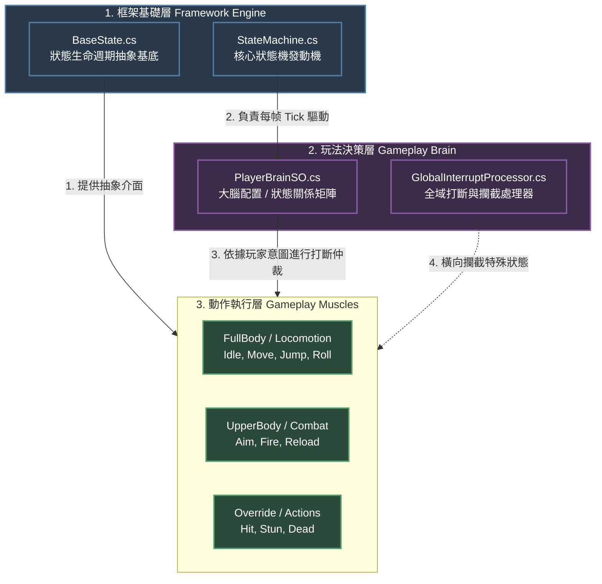

# 專案開發更新日誌 (Changelog & Learning Record)

---

## [v0.1] - 地基建設與基礎資料流驗證

### 1. 變更內容

* **核心資料結構建立**：實作了 `InputData` 類別、`IntentData` 結構體與資料中心黑板 `PlayerRuntimeData`。
* **輸入源與驅動器解耦**：定義 `IInputSource` 介面，並透過 Unity New Input System 實作 `PlayerInputSource`。
* **管線驅動核心**：建立 `CharacterPipelineRunner`，在 `Update` 中依序執行「採樣 $\rightarrow$ 轉化意圖 $\rightarrow$ 處理參數」，並在 `LateUpdate` 幀尾清空意圖。
* **簡易除錯器**：透過 `OnGUI` 實作初版 `BlackboardDebugViewer` 即時監控數據流。

### 2. 架構設計理由（Why）

* **意圖與參數分離**：`IntentData` 處理單幀觸發事件（如跳躍），其餘欄位處理連續數值（如移動速度），這能讓狀態機與動畫層各自獲取乾淨的資料。
* **結構體整體覆寫（零 GC）**：`IntentData` 採用 `struct` 設計，在幀尾透過 `Reset()` 覆寫欄位，完全避免了每幀產生的記憶體垃圾（GC Alloc）。

---

## [v0.2] - 命名規範落實與黑板封裝加固

### 1. 變更內容

* **程式碼命名規範嚴格化**：私有欄位全面重構為 `_camelCase`，公開屬性與欄位維持 `PascalCase`。
* **唯讀引用防護**：黑板新增 `CurrentWeapon` 與 `AimTarget` 引用欄位。將 `CurrentWeapon` 的 setter 權限設為 `internal`，嚴格限制外部模組的修改權限。
* **基礎 Dummy 類別補全**：新增 `ItemInstance` 空類別，確保專案在地基階段能直接通過編譯。

### 2. 架構設計理由（Why）

* **維護資料寫入邊界**：遵循規格書「新增黑板欄位必須明確誰寫誰讀」的規範，透過 `internal set` 鎖定寫入權，防止日後多處模組同時改寫同一數據而導致 Race Condition（競爭條件）。
* **防範 C# 結構體複製陷阱**：黑板中的 `Intent` 必須維持 **公開欄位 (Public Field)**。如果將其改成公開屬性 (Property)，C# 的 Property 語意會觸發 `struct` 的值複製機制，導致 `data.Intent.JumpRequested = true` 這類寫法直接編譯失敗（無法修改表達式產生的副本）。

---

## [v0.3] - 記憶體極致優化與除錯工具升級

### 1. 變更內容

* **InputData 破壞性升版**：將 `InputData` 由 class 改為 **`ref struct`**。
* **管線介面與驅動器重構**：
* `IInputSource` 簽名由回傳值改為傳址寫入：`void FetchRawInput(ref InputData data)`。
* `CharacterPipelineRunner` 的內部處理方法皆改為 `ref` 傳參。

* **黑板仲裁區配置**：引入 `ArbiterData` 結構體並嵌入黑板，預留第四階段（狀態打斷與表現層封鎖）的仲裁旗標。
* **管線順序加固**：在 `Update` 中加入 `BlockInput` 防禦線；在 `LateUpdate` 設立順序脆弱點防禦註解。
* **除錯面板重構（解決爆量塞不下問題）**：
* *方案 A*：在 `OnGUI` 中引入 `GUILayout.BeginScrollView` 與 `GUILayout.Toolbar`（分頁），解決固定佈局（Fixed Layout）無法承載維度增長的問題。
* *方案 B*：引入 `CustomEditor` 擴充，將運行時的數據流監視完全移交給 Unity Inspector，關閉 Runtime OnGUI 達到零效能損耗。

### 2. 架構設計理由（Why）

* **消滅鬼影資料風險 (Aliasing)**：在舊版本中，`InputData` 是 class，回傳的是記憶體參考。如果下游某個不守規矩的模組悄悄把這個參考存成成員變數，它就會在下一幀讀到被覆寫過的過期資料。
* **強迫編譯器當糾察隊**：`ref struct` 具有 **Stack-only（只能存活於堆疊）** 的特性。它不能被 class 持有、不能被裝箱 (Boxing)、不能用於 async。這等同於直接利用 C# 編譯器在底層建立一道防火牆，**100% 保證這份原始輸入資料絕不可能跨幀殘留**，且完全不消耗任何 Heap 記憶體。
* **面對資料維度爆量的 UI 哲學**：專案初期的 `OnGUI` 採用固定範圍，當黑板從原本的 3 個變數暴增到包含引用區、仲裁區等十幾個變數時，畫面必然重疊。透過 **Custom Editor** 把黑板可視化移到 Inspector，利用了編輯器原生自帶的滾動條與階層折疊特性。這不僅讓 Game 畫面回歸乾淨，更避免了 `OnGUI` 每幀因字串拼接（String Interpolation）而產生的垃圾記憶體（GC Alloc），是邁向 AAA 級工具鏈開發的重要思維。

---

## [v0.4] - 資料驅動分層狀態機與極致除錯整合（2026-07-02 ~ 2026-07-03）

### 1. 變更內容

* **分層狀態機骨架落地**：實作了 `FullBodyStateMachine` 主體與 `BaseState` 基底，並將其 Tick 正式接入 `CharacterPipelineRunner` 的【順序 4】。
* **資料驅動打斷系統**：實作 `StateMachineConfigSO` 藍圖，並建立實體檔案 `PlayerStateMachineConfig.asset`，允許透過 ScriptableObject 配置與共享狀態間的 `CanBeInterruptedBy`（主動意圖打斷）與 `ValidTransitions`（自然過渡順序）。
* **四大基礎狀態實作**：完成了 `Idle`、`Move`、`Jump`、`Roll` 狀態。在 `Jump` 與 `Roll` 中加入**時鐘模擬計時器**，在不接物理與動畫的前提下跑通狀態切換資料流。
* **模組目錄結構收攏重構**：為防範後續表現層與裝備系統接入時目錄失控，將所有檔案依據規格書向內收攏至 `Scripts/Core/` 目錄下（區分 `Blackboard`、`Pipeline`、`StateMachine/States`、`Arbitration`、`Editor`）。
* **解耦調試：原始輸入快照化**：因應 `InputData` 的 `ref struct` 限制，在 Runner 內部建立 `InputDebugSnapshot` 普通結構體，於每幀採樣完畢後進行值複製拷貝。
* **Inspector 高級擴充**：更新 `CharacterPipelineRunnerEditor`，新增「第 0 區：核心運行狀態與原始輸入」，利用亮色（Cyan）在編輯器端即時呈現角色當前所在的狀態機位置。
* **Animancer Lite v8 技術評估**：確認其在發行產品（Build）中**僅支援 Layer 0、不允許動態 new Mixer** 的底層限制。

### 2. 架構設計理由（Why）

* **狀態機的雙向評估思維**：在 `FullBodyStateMachine` 中，將狀態切換拆解為「主動意圖打斷（由 Input 驅動）」**與**「被動自然過渡（由狀態自身時鐘或參數驅動）」。這避免了在每個狀態內部寫死大量切換邏輯。
* **突破 ref struct 的記憶體邊界限制**：`ref struct` 無法作為 class 欄位且生命週期結束於 Stack 彈出，導致 Unity 的 `OnInspectorGUI` 循環根本摸不到它。透過在 Runner 中建立快照（`InputDebugSnapshot`）並在安全期「拓印」數值，**既保留了底層核心管線零 Heap GC 的極致效能，又完美解耦並滿足了開發時的可視化調試需求**。
* **資料與代碼完全分離（SO 哲學）**：`StateMachineConfigSO` 是食譜（代碼藍圖），而 `PlayerStateMachineConfig` 是蛋糕（資料檔案）。這樣設計能讓場景上 100 隻怪物共同引用同一個記憶體資產，達成零複製、完全共享的單一真理源（Single Source of Truth）。

---

### 3. 進階架構源碼研析：雙層 Core 與決策層解耦探討

透過對中大型先進控制器專案的目錄結構研析，發現其將狀態機拆分為：

1. `Character/Core/StateMachine` (內含抽象發動機與生命週期介面)
2. `Character/States/Core` (內含打斷處理器、大腦配置與狀態攔截器)
3. `Character/States/FullBody` (具體動作狀態實作)

## [v0.4.3] - 2026-07-04
### 狀態機核心加固：確定性、合約安全性與開放封閉原則落地

#### 1. 變更內容
* **確定性打斷仲裁 (Deterministic Arbitration)**：重構 `FullBodyStateMachine.EvaluateInterrupts`，移除潛在引發 GC 的 LINQ 語意，改用手動 foreach 結構體迭代比大小，實現本地端零 GC Alloc 的最高優先級動態篩選。
* **合約安全性保障 (Contract Safety)**：將狀態機的 Initialize 時機點由 Runner 的 `Awake()` 移至 `Start()`，確保黑板實例已百分之百就緒，安全傳遞引用，徹底消除 `OnEnter(null)` 的隱性 NullReferenceException 風險。
* **多型鎖定語意抽象 (OCP 實踐)**：於 `BaseState` 引入 `CanTransitionAway` 虛擬布林屬性。`JumpState` 與 `RollState` 自行複寫該屬性以控制自身的動作鎖定區間。狀態機主體全面移除 `is JumpState` 等具體型別硬編碼硬檢查。
* **配置層升版**：`StateRule` 結構體與 `StateMachineConfigSO` 新增 `Priority`（優先級）核心欄位與運行時字典快速查表優化。

#### 2. 架構設計理由與反思（Why & Refactoring Rationale）
* **消滅架構層面的不確定性**：
  雖然當前四個基礎動作在同幀同時觸發的機率極低，但 C# `Dictionary` 遍歷順序不穩定的底層特性，是動作框架未來擴展到複雜戰鬥系統時的致命隱患。透過資料化 `Priority` 欄位並手動迴圈比大小，以零效能代價換取了絕對確定的狀態切換結果。
* **守護開放封閉原則 (Open-Closed Principle)**：
  原本狀態機內部包含 `is JumpState && !jump.IsLanded` 的型別檢查，這是一種嚴格的「架構壞味道（Code Smell）」。這代表每當遊戲新增一個具備鎖定期的特殊狀態（如攀爬、受擊硬直），都必須被迫改寫狀態機主體的 switch/if 邏輯。
  * **思維核心**：透過將「我現在能不能被自然過渡切換走」這個職責收攏回狀態自身（透過 `CanTransitionAway` 曝露），狀態機成功實現了「對擴充開放，對修改封閉」的頂級彈性，完美達成邏輯層的解耦。

#### 心得分流與對齊策略：

* **實現依賴倒置原則 (DIP)**：最頂層的 `Core/StateMachine` 屬於通用框架，不應該依賴具體玩法。抽離後，狀態機發動機成為完全泛用的工具。
* **打斷邏輯的制高點仲裁**：若將打斷邏輯寫在動作內部會導致高度耦合。獨立出玩法決策層（大腦），動作腳本只需專注於自身的物理與表現。
* **對齊策略**：目前專案處於地基驗證階段，戰術性地將決策簡化封裝在 `StateMachineConfigSO` 中。當未來第三、四階段引入複雜的複合按鍵、換彈、硬直打斷導致配置條目超過 15 筆時，將嚴格執行此重構，拆分出獨立的玩法大腦目錄。

---

## [v0.5.1] - 根運動執行期驅動除錯與規格落差盤點（2026-07-08）

### 1. 變更內容

* **排查 `OnAnimatorMove` 收不到呼叫的階層問題**：確認 `CharacterController`、`Animator`、`MotionDriver`、`AnimancerComponent` 皆掛在同一個 GameObject（X Bot）上，排除訊息無法跨物件傳遞的假設。
* **清除 `Controller` 欄位 Missing 參照**：`Animator.Controller` 指到一個已遺失的 Runtime Animator Controller 資產，雖不影響 Animancer 運作，但已清空以排除干擾變因。
* **發現重力系統設計前提被誤用**：`MotionDriver` 的重力邏輯（`_verticalVelocity`）從設計上只有「貼地保底」與「持續下墜」兩態，從未有任何程式碼賦予其正值，代表原設計是「起跳的上升段完全交給動畫根運動的 Y 軸」，而非程式碼發射角色。若 `JumpState` 改走 `ExecuteBakedCurveMovement`（該方法完全不處理 Y 軸），會導致重力與跳躍衝量邏輯整段失效，這是「跳不起來」的根因，需另外設計 `ApplyJumpImpulse` 之類的垂直初速度注入口，而非直接套用 Roll 的曲線移動模式。
* **確認 `MotionBakeEditor.cs` 與 `02-dev-spec.md §4.1` 規格脫鉤（技術債，需標記）**：規格書 4.1 節明確要求烘焙工具「實例化臨時角色 Model，注入 Humanoid Avatar，設 `applyRootMotion = true`」後再採樣，但目前 `MotionBakeEditor.cs` 的實作是對一個空的 `new GameObject("BakeDummy")`（沒有 `Animator`、沒有 `Avatar`）直接呼叫 `AnimationClip.SampleAnimation`。Humanoid 根運動仰賴 Avatar 重定向計算，空物件採樣不出真實水平位移，這正是 `SpeedCurve` 曲線趨近全零、Roll 视觉上完全靠殘留 `_rootMotionDelta` 硬撐的根本原因。**目前程式碼並未落實既有規格**，非新發現的規格缺口，列為優先技術債。
* **評估中期重構方向（尚未定案，見 `01-design-doc.md` Trade-off 表新增列）**：對照另一份參考架構（`MotionDriver` 完全不依賴執行期 `OnAnimatorMove`，改用「輸入驅動速度 + 烘焙曲線速度」統一收斂成單一 `CharacterController.Move()` 呼叫，重力每幀快取一次、任何模式都會疊加），評估是否要把「即時根運動」整個從執行期拔除，改成單一由烘焙資料 + 程式碼算速度的模型。

### 2. 架構設計理由與反思（Why & Refactoring Rationale）

* **`OnAnimatorMove` 依賴鏈過於脆弱**：今天一路排查下來，`_rootMotionDelta` 要能正確運作，必須同時滿足：GameObject 階層正確、`Apply Root Motion` 勾選、`Animate Physics` 不勾選、匯入設定 `Bake Into Pose` 沒勾、且所有消耗它的路徑（`ExecuteBaseMovement` / `ExecuteBakedCurveMovement`）都要在正確時機歸零——任何一環斷掉，症狀都是「原地動作／瞬移／跳不起來」這幾種表面現象的排列組合，難以從單一症狀直接反推根因，只能逐層排除。這暴露出「執行期即時根運動」作為位移唯一真相來源，隱含了太多外部設定耦合，與規格書 2.2 節「資料中心黑板」想要的單一決策點精神有落差。
* **規格書寫對了，實作沒跟上**：`02-dev-spec.md` 4.1 節其實已經預先設計了正確的 Humanoid 取樣流程，但 `MotionBakeEditor.cs` 目前是一份更早期、更簡化的版本，兩者從未對齊過。這次順帶排查才發現這個落差，之後任何工具鏈檔案完工時，應該回頭對照規格書章節打勾，避免文件與程式碼各自漂移。
* **修 bug 與規格對齊分開處理**：本輪僅先修復立即影響體驗的部分（歸零缺失、Animator 設定錯誤），`MotionBakeEditor.cs` 改用真實 Humanoid Avatar 環境取樣、以及是否要移除執行期 `OnAnimatorMove` 依賴，列入下一輪重構排期，不在本次一次到位，避免除錯範圍失控。

---

## [v0.6] - 全面 Code Review 與文件同步盤點（2026-07-08）

### 1. 變更內容

* **重新複查 `MotionBakeEditor.cs` 技術債狀態**：v0.5.1 記錄的「對空 `GameObject`（無 `Animator`／`Avatar`）直接 `SampleAnimation`」問題，經複查**已在程式碼中解決**——目前 `ExecuteBakePipeline()` 會 `Instantiate(characterPrefab)`、驗證 `animator.avatar.isHuman`、設定 `applyRootMotion = true` 後才進入 `BakeCoreProcessor` 採樣。`02-dev-spec.md` §4.1 的落差警告與本檔 v0.5.1 的「所有既有資產視為不可信」結論已更新為「取樣來源問題已解決，Pass 分離／腳相／濾波仍待補」。
* **盤點 `JumpState` 落地判定的資料流缺口**：目前 `IsLanded` 由寫死的 `_airTimer = 1.0f` 倒數決定，與角色實際物理滯空時間（受 `jumpImpulseForce`、重力影響）脫鉤；黑板 `PlayerRuntimeData` 也還沒有 `IsGrounded` 欄位可讀。列為 v0.7 規劃項目：由 `MotionDriver` 寫入黑板 `IsGrounded`，`JumpState` 改讀黑板而非自行計時。
* **發現 `JumpState.jumpImpulseForce` 的 `[SerializeField]` 是死碼**：`BaseState` 為純 C# 類別、非 `MonoBehaviour`／`ScriptableObject`，此欄位不會被 Unity 序列化，Inspector 無法調整，永遠吃預設值 `7.5f`。規劃比照 `RollState` 改走 Config SO 查表。
* **盤點其餘小型防禦性缺口**：`MotionDriver.Awake()` 對 `characterController` 缺 null 防禦線；`RollState.OnUpdateMotion` 無條件信任 `AnimationFacade.GetNormalizedTime()`，若 `Play()` 失敗（clip mapping 查表 miss）會拿舊動畫的進度值驅動位移；`CharacterPipelineRunner` 熱路徑上的富文本 `Debug.Log` 有 GC Alloc 疑慮；`AnimancerFacade.SetLayerWeight` 缺負數 index 防呆。全數列入 `02-dev-spec.md` §5 待補清單追蹤。

### 2. 架構設計理由與反思（Why & Refactoring Rationale）

* **文件也會腐化，需要定期跟程式碼對帳**：這次盤點最大的收穫不是找到新 bug，而是發現**文件本身落後於程式碼**——`MotionBakeEditor.cs` 明明已經修好了，但兩份規格文件都還停在「未修復」的敘述。這正是 v0.5.1 反思裡提到「文件與程式碼各自漂移」的風險活生生發生在自己身上。以後每完成一項標記為技術債的修復，應該當下就回頭勾掉對應文件段落，而不是留到下次除錯才「順帶發現」。
* **黑板缺欄位比程式碼有 bug 更難察覺**：`JumpState` 需要 `IsGrounded` 卻拿不到，不是因為程式邏輯寫錯，而是黑板資料模型本身少了一塊。這種「資料流設計缺口」不會在編譯期或第一次測試時顯現，只有在調整數值（如 `jumpImpulseForce`）之後才會暴露成「落地判定跟直覺不符」的體感問題，排查成本比一般 bug 更高，值得在黑板 schema 每次擴充功能時多想一步「這個狀態未來需要讀什麼」。
* **`[SerializeField]` 掛在非 Unity 物件上是常見陷阱**：純 C# 類別（如 `BaseState` 的子類）不會被 Inspector 序列化，這個屬性容易讓人誤以為欄位可調，實際上是靜默失效、沒有任何警告或錯誤。之後新增狀態類別的可調參數時，一律走 Config SO 查表模式（比照 `RollState`），不要再用 `[SerializeField]` 掛在非 `MonoBehaviour`／`ScriptableObject` 的類別上。

---

## [v0.7~v0.9] - 文件追平程式碼進度（補記錄，2026-07-08）

> 這三個版本的程式碼修正在前幾輪對話中已經完成，但開發日誌沒有同步跟上（跟 v0.6 談到的「文件會腐化」是同一種問題，這次是日誌本身腐化）。這裡一次補記錄，細節見 `01-design-doc.md` 修訂紀錄 v0.7～v0.9 與 `02-dev-spec.md` v0.7～v0.9。

* **v0.7**：全面 Code Review，修正 Jump 落地判定資料流缺口（黑板新增 `IsGrounded`）、`JumpState.jumpImpulseForce` 序列化死碼、`MotionDriver` null 防禦、`RollState` 動畫播放防呆、熱路徑 log 的 GC 疑慮、`AnimancerFacade` 邊界檢查。
* **v0.8**：除錯 Jump「先蹲下再往上」問題，新增 `JumpTakeoffDelay` 讓物理起飛時機對齊動畫預備動作；`IsGrounded` 黑板同步收斂進 `MotionDriver.GetGravityThisFrame`，移除額外的 `SyncGroundedState` 呼叫點。
* **v0.9**：新增角色 GameObject 階層規範（Root Adapter + Model Child），杜絕 `Animator.applyRootMotion` 跟 `CharacterController` 世界座標互搶的問題；評估參考碼（BBBNexus）兩個設計但當時暫緩：`VerticalVelocity` 移入黑板、`JustLanded`／`JustLeftGround` 單幀旗標。

---

## [v0.10] - StateRule 職責分離重構規劃 + 跨遊戲模式重用策略（2026-07-08）

### 1. 變更內容

* **確認 `JumpTakeoffDelay` 修正生效**：手動依照實際動畫預備動作長度調整 Config 數值後，實機測試「先蹲下再往上」的違和感已消除，物理起飛時機與動畫預備姿勢的時間軸對齊。這是 v0.8 診斷的正式收尾。
* **盤點出 `StateRule` 的 SRP 違反**：v0.7/v0.8 為了解決 `[SerializeField]` 在純 C# 狀態類別上失效的問題，把 `JumpImpulseForce`、`JumpTakeoffDelay` 直接塞進了泛用的 `StateRule` 結構體。這次盤點確認這個做法犯了三個問題：
  1. **職責混亂**：`StateRule` 該管的是 FSM 拓撲（誰能打斷誰、能過渡到誰、優先級），跟「Jump 這個特定狀態的物理表現參數」是完全不同的關注點。
  2. **Inspector／記憶體污染**：設定 Idle、Move、Roll 的規則時，Inspector 也會強行冒出跟這些狀態無關的 `Jump Impulse Force` 欄位；每個 `StateRule` 元素都攜帶用不到的欄位，浪費執行期記憶體。
  3. **擴充性災難**：這是最致命的一點，直接關係到專案「同一套控制器要撐起 ARPG、射擊遊戲及其他各種遊戲模式」的終極目標——未來 `SlideState`（滑行距離/摩擦係數）、`ClimbState`（爬牆速度/體力消耗）、`AimState`（瞄準靈敏度）陸續加入時，若繼續往 `StateRule` 塞欄位，會讓它線性膨脹成沒人敢動的巨石類別。
* **設計 `StateParamsSO` 取代方案**：`StateRule` 恢復只留拓撲欄位；狀態專屬參數改用獨立的 `StateParamsSO` 子類別資產（一狀態一資產，如 `JumpStateParams`），`StateMachineConfigSO` 用泛型 `GetStateParams<T>(state)` 查表取得。完整介面設計見 `02-dev-spec.md` §3.2 新增小節、`01-design-doc.md` §2.7。**設計已定案，程式碼尚未遷移**——這次刻意只更新文件、不動程式碼，理由見下方「Why」。
* **重新評估並採用兩個參考碼設計**：v0.9 曾評估 BBBNexus 專案的 `VerticalVelocity` 黑板欄位、`JustLanded`／`JustLeftGround` 單幀旗標，但以「目前沒有下游消費者」為由暫緩。這次基於多遊戲模式重用的目標重新評估，改為已定案採用（理由見下方）。
* **新增「跨遊戲模式重用策略」章節**（`01-design-doc.md` §8）：系統性盤點哪些既有設計天生模式無關（黑板、仲裁層、Facade、Adapter/Model 分層）、哪些是這輪才補上的（`StateParamsSO`、提前開放的黑板欄位）、哪些還沒有答案（Intent/Parameter 處理器抽介面時機、`StateType` 是否分層、仲裁旗標粒度）。

### 2. 架構設計理由與反思（Why & Refactoring Rationale）

* **只改文件、不改程式碼是刻意的**：`StateParamsSO` 是個有一定改動面的重構（新增抽象基底、新增 Config SO 的查表機制、遷移既有兩個欄位、更新 `JumpState.Initialize`），而目前 `JumpTakeoffDelay` 才剛透過手動調整驗證表現正常。刻意選擇「先把設計定案寫清楚，下一輪對話再實作」，避免在同一輪裡又動了剛驗證穩定的 Jump 邏輯，把「文件說明」跟「程式碼變動」的風險分開處理。這也呼應 v0.6 反思過的教訓：文件寫的是意圖，程式碼是不是已經追上意圖，兩者要能被清楚地區分開來，不能靠記憶。
* **SRP 違反不是潔癖，是為了讓「擴充成本」保持 O(1)**：這次盤點的核心價值不是「StateRule 現在有點亂」這種美觀問題，而是量化了不修正的代價——如果不拆分，每新增一個需要調參的狀態，`StateRule` 就要多幾個欄位，且**所有狀態共用同一個結構體**，代表這個膨脹是全域的、對所有狀態都可見的。拆成 `StateParamsSO` 之後，新增一個狀態的調參需求，成本只跟這個狀態本身有關，不會讓其他狀態的配置介面跟著變複雜。這個差異在專案還只有 4 個狀態時看不太出來，但這正是為什麼要趁早修正——技術債在規模小的時候修正成本最低，這也是本專案從 v0.1 就一直在實踐的原則（例如 `InputData` 從 class 升級成 `ref struct` 也是同樣的邏輯：越早修正，波及面越小）。
* **提前採用 `VerticalVelocity`／`JustLanded` 的判斷依據**：v0.9 用「還沒有下游消費者」當理由暫緩是合理的（YAGNI 原則：不要為了假設中的需求先寫程式碼）。但這次重新評估的關鍵是「終極目標」的確立——一旦確定了「要支援 ARPG／射擊等多種模式」，落地音效、鏡頭震動、擊退這類需求就不再是「假設中」，而是幾乎可以肯定會出現的標配功能。在黑板 schema 還小、還沒有很多模組依賴既有欄位的現在先把管道打通，比之後每個模式各自繞路（例如射擊模式的擊退邏輯自己在 Controller 裡手刻一份邊沿偵測）成本更低。這跟「過早設計」不衝突，因為這兩個欄位本身沒有複雜的行為邏輯，加進黑板的邊際成本很低，真正該延後的是複雜的行為實作（例如 `ArbiterPipeline` 的旗標粒度，這次依然維持「等第四階段真的動工再定案」的立場，沒有一起提前）。

---

## [v0.11] - 分支整併與 StateParamsSO 實作落地（2026-07-11）

### 1. 變更內容
* **分支整併（feature ↔ main）**：以 main 為結構基準（保留其 `MotionBakeEditor`、`AnimancerFacade`、`MotionDriver`、`SampleScene`、`CLAUDE.md` 等），將本分支獨有成果整併上去。衝突僅出在雙方平行實作的同批檔案，逐項依約定取捨。
* **StateParamsSO 從「設計定案」正式落地**：v0.10 規劃、標記「實作待補」的 `StateParamsSO`／`JumpStateParams` 泛型設計正式實作——`StateMachineConfigSO.GetStateParams<TParams>()` 取代過渡期的 `GetJumpImpulseForce`／`GetJumpTakeoffDelay` float-getter；`StateRule` 移除 Jump 物理欄位、抽為獨立檔（純拓撲）。
* **跳躍延遲注入沿用 main**：`JumpState` 保留 main 的「延遲 `TakeoffDelay` 秒後再注入衝量」做法（等預備動畫播完），只把參數來源換成 `JumpStateParams`。
* **著地資料流統一**：`PlayerRuntimeData.IsGrounded` 採公開欄位；`MotionDriver` 沿用 main 的 `GetGravityThisFrame()` 集中回寫；`JumpState`／`RollState.CanEnter` 補上 `IsGrounded` 著地閘門，杜絕無限空中跳／空中翻滾。
* **測試地基**：導入 asmdef（`Project.Runtime`／`Project.Editor`／`Project.Tests.EditMode`）與 `StateMachineTests` EditMode 單元測試（進入／打斷著地閘門）。

### 2. 架構設計理由（Why）
* **兩條平行實作收斂成一條**：main 與本分支各自獨立實作了相同的著地修正與 Jump 參數化（API 不同）。整併選擇「main 的結構 + 本分支的 `StateParamsSO` 泛型設計」——後者正是 main 文件 v0.10 已定案、標記待補的目標，等於把 main 的設計意圖真正落地，而非兩套併存。
* **落地判定屬 PlayMode 範疇**：Jump 真實落地依賴 `OnUpdateMotion` 的物理注入與 `CharacterController.isGrounded`，不在純狀態機 EditMode 單元測試涵蓋；EditMode 測試聚焦確定性的進入／打斷閘門邏輯。

---

## [v0.12] - ADR-001：GameObject 階層 Root/Model 分離定調（2026-07-12）

### 1. 變更內容
* **新增 ADR**：`docs/ADR/001-root-model-hierarchy.md` 正式記錄「Root（邏輯/物理）＋ Model（美術/骨骼）」分層決策、元件獲取規範、Fail-Fast 校驗規範、Prefab 遷移步驟與未來擴充彈性。
* **釐清文件矛盾**：`01-design-doc.md` §2.6 原把 `AnimancerComponent` 畫在 Model 子物件，與 `02-dev-spec.md` §0.3 的 Root 擺法互相矛盾。ADR-001 定調 `AnimancerComponent` 掛在 **Root**（僅 `Animator`＋網格＋骨骼下放 Model），同步更新 §2.6／§4.4／§4.7 與 §0.3 規則。
* **`AnimancerFacade` 重構**：
  * 取得 `AnimancerComponent` 由 `GetComponentInChildren<AnimancerComponent>()` 改為 `GetComponent<AnimancerComponent>()`（Root/自身），杜絕誤抓子物件。
  * 新增 `ValidateHierarchy(bool runtimeThrow)`：Root 恰好 1 個 `AnimancerComponent` 且 0 個 `Animator`；Model 子物件恰好 1 個 `Animator`；`Animator` 綁 Humanoid Avatar；`AnimancerComponent.Animator` 指向該 Model `Animator`；並**強制關閉** `Animator.applyRootMotion`。
  * `Awake()`（Runtime）呼叫時違規直接拋例外（Fail-Fast）；新增 `OnValidate()`（Editor）以延遲呼叫在非執行狀態也給出清楚錯誤訊息。
* **`Animator` 取得改由 Model 子物件搜尋**（`GetComponentInChildren<Animator>` 排除 Root），**全程不依賴名稱字串**（禁止 `transform.Find("Model")`）。

### 2. 架構設計理由（Why）
* **物理權威與美術動畫徹底隔離**：`Animator` 下放 Model，即使 `applyRootMotion` 被誤勾，Unity 自動根動作也只改 Model 的 local transform，碰不到 Root 世界座標；`ValidateHierarchy` 的強制關閉是第二層保險。這是 v0.8「Jump 先蹲下再往上」根因的結構性根治。
* **`AnimancerComponent` 屬「邏輯」故留 Root**：它是 Facade 直接依賴的動畫邏輯元件，與 Facade 同物件用 `GetComponent` 語意最嚴格；Animancer 原生以序列化 `_Animator` 支援跨物件引用，此配置受官方支援。
* **Fail-Fast 勝於靜默降級**：階層或綁定錯誤在開場（Awake/OnValidate）就爆出清楚訊息，取代過往「動畫原地不動／結束瞬移」這類難以定位的表徵。
* **`MotionDriver` 刻意不動**：它只依賴 `CharacterController`、完全不感知 `Animator`，本就符合新架構，無需調整（另見 Architecture Notes 對「MotionDriver 是否該感知 Animator」的評估）。

---

## 5. 未來的重構訊號（Refactoring Triggers）

當你在接下來的第三、四階段（表現層解耦、Animancer Lite 接入、仲裁器接入）開發中看到以下現象，請立刻啟動重構：

1. **處理器肥大（超過 15 行）**：當 `CharacterPipelineRunner` 內的 `ProcessIntents` 或 `ProcessParameters` 開始塞滿各種複雜的複合按鍵（如長按、雙擊、組合鍵）判斷時 $\rightarrow$ 立刻實作規格書 **3.1 節**，將邏輯抽離成獨立的 `IIntentProcessor` 類別群。
2. **仲裁器重疊**：當未來多個狀態（如：定身 CC 狀態、過場動畫狀態）都需要封鎖輸入，導致單一的 `BlockInput = true` 無法分辨是誰封鎖、該由誰解鎖時 $\rightarrow$ 立刻實作規格書 **2.4 節**，引入 `ArbiterPipeline` 與優先級疊加系統。
3. **表現層受限突破**：若在實作 `AnimancerFacade` 時，單層骨骼遮罩（Avatar Mask）無法滿足複雜的全身/上半身動作混合需求 $\rightarrow$ 評估於發行 Build 時升級 Pro 版，或將部分靜態融合邏輯移回舊版 Animator Controller 作為 Facade 的混合後盾。